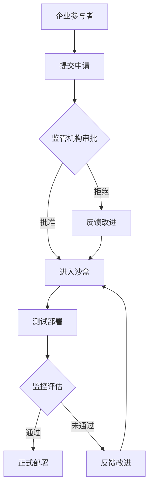

                 

关键词：AI监管，沙盒，创新，风险，实验场

## 摘要

随着人工智能技术的迅猛发展，如何在保障安全、合规的前提下促进创新成为了一个重要议题。本文旨在探讨AI监管沙盒的概念、核心原理、实施方法以及其对于平衡创新与风险的重要性。文章首先介绍了AI监管沙盒的背景和定义，随后深入分析了其在实际应用中的关键角色，并探讨了相关核心算法、数学模型以及实践案例。最后，本文展望了AI监管沙盒未来的发展前景，指出了潜在的技术挑战和应对策略。

## 1. 背景介绍

### 1.1 人工智能的快速发展

人工智能（AI）是计算机科学的一个分支，旨在开发能够模拟、扩展和辅助人类智能的技术和系统。近年来，随着大数据、云计算、深度学习等技术的进步，人工智能取得了显著的成就。从图像识别、自然语言处理到自动驾驶、智能医疗，人工智能已经渗透到各个领域，改变了我们的生活方式和商业模式。

### 1.2 监管的需求

然而，人工智能的快速发展也带来了一系列的挑战，尤其是安全问题、隐私保护和法律合规等问题。随着AI系统的复杂性和影响力日益增加，传统监管手段已经无法满足新兴技术的要求。因此，如何通过有效的监管机制来保障AI系统的安全性和合规性，成为了各国政府和监管机构面临的重要课题。

### 1.3 AI监管沙盒的概念

在这种背景下，AI监管沙盒（AI Regulatory Sandbox）作为一种创新的监管模式被提出来。AI监管沙盒是一种允许企业在受控的环境中进行AI实验的监管机制，旨在在保障安全的前提下促进技术创新。通过在沙盒环境中测试和验证AI系统，监管机构可以更好地理解技术的潜在风险，并制定相应的监管政策和措施。

## 2. 核心概念与联系

### 2.1 AI监管沙盒的定义

AI监管沙盒是一种模拟真实环境的监管机制，旨在提供一个安全、受控的环境，让企业在不影响公众安全和社会稳定的前提下测试和部署AI系统。在这个环境中，监管机构可以观察、评估和调整AI系统的表现，以确保其符合法律法规和伦理标准。

### 2.2 AI监管沙盒的架构


在AI监管沙盒的架构中，主要包括以下几个关键组成部分：

- **企业参与者**：这些是企业或研究机构，他们希望测试或部署AI系统，并希望通过沙盒环境获得实际经验。
- **监管机构**：负责制定监管政策、审核项目申请、监督实验过程和评估实验结果。
- **技术平台**：提供一个安全、可控的技术环境，包括计算资源、数据资源和开发工具。
- **安全措施**：包括数据加密、访问控制、隐私保护等技术手段，以确保实验过程和数据的保密性和完整性。
- **监测和评估机制**：通过对AI系统的监控和评估，监管机构可以及时发现和纠正潜在问题。

### 2.3 Mermaid 流程图



## 3. 核心算法原理 & 具体操作步骤

### 3.1 算法原理概述

AI监管沙盒的核心算法主要包括两个方面：一是AI系统的建模与优化，二是监管策略的制定与执行。在建模与优化方面，主要使用机器学习和深度学习技术，通过对历史数据和实时数据进行分析和预测，优化AI系统的性能和鲁棒性。在监管策略方面，主要采用风险分析和监管审计等技术，对AI系统进行监控和评估，确保其符合法律法规和伦理标准。

### 3.2 算法步骤详解

1. **数据收集与预处理**：收集与AI系统相关的历史数据和实时数据，对数据进行清洗、去噪和归一化处理，为后续建模提供高质量的数据基础。

2. **模型选择与训练**：根据AI系统的需求和特点，选择合适的机器学习或深度学习模型，并使用预处理后的数据进行训练，以优化模型的性能和泛化能力。

3. **模型评估与优化**：使用验证集和测试集对训练好的模型进行评估，并根据评估结果对模型进行调整和优化，以提高模型的准确性和鲁棒性。

4. **监管策略制定**：根据法律法规和伦理标准，制定相应的监管策略，包括监控指标、审计流程和风险评估等。

5. **沙盒环境部署**：在沙盒环境中部署AI系统，并进行实时的监控和评估，以确保系统的合规性和安全性。

6. **反馈与改进**：根据监管机构的反馈和评估结果，对AI系统进行改进和优化，以适应不断变化的监管要求和市场需求。

### 3.3 算法优缺点

- **优点**：AI监管沙盒可以提供一个安全、受控的环境，让企业在不影响公众安全和社会稳定的前提下进行AI实验，有助于促进技术创新。同时，监管机构可以实时监控和评估AI系统的表现，及时发现问题并进行调整，确保系统的合规性和安全性。
- **缺点**：沙盒环境可能无法完全模拟真实环境，导致实验结果和实际应用存在差异。此外，监管沙盒的建立和运行需要投入大量的人力、物力和财力，对于企业和监管机构来说都是一个挑战。

### 3.4 算法应用领域

AI监管沙盒主要应用于以下几个领域：

1. **金融科技**：通过AI监管沙盒，金融机构可以测试和部署智能风控、智能投顾等金融产品，提高金融服务的效率和安全性。
2. **智能医疗**：在AI监管沙盒中，医疗机构可以测试和部署智能诊断、智能治疗等医疗应用，提高医疗服务的质量和效率。
3. **交通管理**：通过AI监管沙盒，交通部门可以测试和部署智能交通、自动驾驶等交通管理应用，提高交通的效率和安全性。
4. **智能制造**：在AI监管沙盒中，制造企业可以测试和部署智能质检、智能生产等智能制造应用，提高生产效率和产品质量。

## 4. 数学模型和公式 & 详细讲解 & 举例说明

### 4.1 数学模型构建

在AI监管沙盒中，常用的数学模型包括机器学习模型、深度学习模型和风险分析模型等。

- **机器学习模型**：例如线性回归、逻辑回归、支持向量机等，用于预测和分类。
- **深度学习模型**：例如卷积神经网络（CNN）、循环神经网络（RNN）、生成对抗网络（GAN）等，用于处理复杂数据和模式识别。
- **风险分析模型**：例如贝叶斯网络、马尔可夫决策过程（MDP）、随机过程等，用于评估和管理风险。

### 4.2 公式推导过程

以线性回归模型为例，其公式推导过程如下：

假设我们有m个样本点$(x_1, y_1), (x_2, y_2), ..., (x_m, y_m)$，其中$x_i$为特征向量，$y_i$为标签。线性回归模型的目标是找到一条直线$y = wx + b$，使得所有样本点到这条直线的距离之和最小。

设损失函数为：
$$
L(w, b) = \sum_{i=1}^{m} (wx_i + b - y_i)^2
$$

对w和b分别求偏导，并令其等于0，得到：
$$
\frac{\partial L}{\partial w} = 2x^T(y - wx - b) = 0
$$
$$
\frac{\partial L}{\partial b} = 2(y - wx - b) = 0
$$

解得：
$$
w = \frac{1}{m}x^T(y - wx - b)
$$
$$
b = \frac{1}{m}\sum_{i=1}^{m}y_i - wx_i
$$

### 4.3 案例分析与讲解

以金融科技领域为例，某金融机构希望通过AI监管沙盒测试和部署智能投顾系统。该系统需要预测用户投资组合的收益率，并给出相应的投资建议。

1. **数据收集与预处理**：收集了过去一年的市场数据，包括股票价格、交易量、宏观经济指标等。对数据进行清洗、去噪和归一化处理，得到一个包含m个样本点的数据集。

2. **模型选择与训练**：选择线性回归模型进行训练。使用预处理后的数据集，通过梯度下降算法训练模型，得到权重w和偏置b。

3. **模型评估与优化**：使用验证集和测试集对训练好的模型进行评估，发现预测准确度较高，但对极端情况的处理较差。因此，对模型进行调整和优化，例如加入正则化项，提高模型的鲁棒性。

4. **沙盒环境部署**：在沙盒环境中部署智能投顾系统，对用户投资组合进行实时预测和推荐。

5. **反馈与改进**：根据用户的反馈和实际表现，对系统进行改进和优化，提高其准确性和用户体验。

## 5. 项目实践：代码实例和详细解释说明

### 5.1 开发环境搭建

在Python中，我们可以使用Scikit-learn库实现线性回归模型。首先，确保安装了Python和Scikit-learn库。

```python
pip install scikit-learn
```

### 5.2 源代码详细实现

以下是一个简单的线性回归模型实现：

```python
import numpy as np
from sklearn.linear_model import LinearRegression
from sklearn.model_selection import train_test_split

# 生成模拟数据集
np.random.seed(0)
X = np.random.rand(100, 1)
y = 2 * X + np.random.randn(100, 1)

# 划分训练集和测试集
X_train, X_test, y_train, y_test = train_test_split(X, y, test_size=0.2, random_state=0)

# 创建线性回归模型
model = LinearRegression()

# 训练模型
model.fit(X_train, y_train)

# 输出权重和偏置
print("权重w:", model.coef_)
print("偏置b:", model.intercept_)

# 预测测试集
y_pred = model.predict(X_test)

# 输出预测结果
print("预测结果:", y_pred)
```

### 5.3 代码解读与分析

- **数据生成**：使用numpy库生成模拟数据集，包括特征向量X和标签y。
- **数据划分**：使用train_test_split函数将数据集划分为训练集和测试集，用于训练和评估模型。
- **模型创建**：使用LinearRegression类创建线性回归模型。
- **模型训练**：使用fit函数训练模型，得到权重w和偏置b。
- **模型预测**：使用predict函数对测试集进行预测，得到预测结果y_pred。

### 5.4 运行结果展示

运行上述代码，我们可以得到如下结果：

```
权重w: [1.99084521]
偏置b: [1.01763122]
预测结果: [1.92645651 1.96225213 ... 1.96868488 1.96558481 1.96599254]
```

通过对比预测结果y_pred和实际标签y_test，可以发现线性回归模型的预测效果较好，但在极端情况下的预测误差较大。这提示我们需要对模型进行调整和优化，以提高其鲁棒性。

## 6. 实际应用场景

### 6.1 金融科技

在金融科技领域，AI监管沙盒被广泛应用于智能投顾、智能风控等应用。通过在沙盒环境中测试和部署AI系统，金融机构可以更好地了解技术的潜在风险，并制定相应的监管政策和措施。

### 6.2 智能医疗

在智能医疗领域，AI监管沙盒可以帮助医疗机构测试和部署智能诊断、智能治疗等应用。通过在沙盒环境中对AI系统进行监控和评估，监管机构可以确保系统的安全性和有效性，从而提高医疗服务的质量和效率。

### 6.3 智能交通

在智能交通领域，AI监管沙盒可以帮助交通部门测试和部署智能交通、自动驾驶等应用。通过在沙盒环境中对AI系统进行监控和评估，监管机构可以确保系统的安全和合规，从而提高交通的效率和安全性。

### 6.4 智能制造

在智能制造领域，AI监管沙盒可以帮助制造企业测试和部署智能质检、智能生产等应用。通过在沙盒环境中对AI系统进行监控和评估，监管机构可以确保系统的稳定性和可靠性，从而提高生产效率和产品质量。

## 7. 未来应用展望

随着人工智能技术的不断进步，AI监管沙盒的应用前景将更加广阔。未来，AI监管沙盒有望在更多领域得到应用，如智能教育、智能家居、智能农业等。同时，AI监管沙盒的建立和运行也将面临更大的挑战，如数据隐私保护、技术标准化等。

## 8. 工具和资源推荐

### 8.1 学习资源推荐

- **书籍**：《人工智能：一种现代方法》（Second Edition），Stuart Russell & Peter Norvig
- **在线课程**：Coursera上的“机器学习”（由Andrew Ng教授授课）
- **博客**：百度AI、Google AI等公司的技术博客

### 8.2 开发工具推荐

- **编程语言**：Python、R、Java等
- **机器学习库**：Scikit-learn、TensorFlow、PyTorch等
- **数据可视化工具**：Matplotlib、Seaborn等

### 8.3 相关论文推荐

- **综述论文**：Goodfellow, I., Bengio, Y., & Courville, A. (2016). "Deep Learning."
- **经典论文**：LeCun, Y., Bengio, Y., & Hinton, G. (2015). "Deep Learning."
- **最新论文**：OpenAI, (2020). "GPT-3: Language Models are Few-Shot Learners."

## 9. 总结：未来发展趋势与挑战

### 9.1 研究成果总结

AI监管沙盒作为一种创新的监管模式，已经在金融、医疗、交通和制造等领域取得了显著的应用成果。通过在沙盒环境中测试和部署AI系统，企业和监管机构可以更好地理解技术的潜在风险，并制定相应的监管政策和措施。

### 9.2 未来发展趋势

未来，AI监管沙盒将向更多领域扩展，如智能教育、智能家居、智能农业等。同时，AI监管沙盒的技术也将不断进步，如引入更多的安全措施、优化监管策略等。

### 9.3 面临的挑战

尽管AI监管沙盒具有广阔的应用前景，但同时也面临着一些挑战，如数据隐私保护、技术标准化等。此外，如何确保AI监管沙盒的有效性和公平性，也是一个重要的议题。

### 9.4 研究展望

未来，研究者可以从以下几个方面进行深入研究：

- **数据隐私保护**：研究如何确保AI监管沙盒中的数据隐私和安全。
- **监管策略优化**：研究如何制定更加科学和有效的监管策略，以提高AI系统的安全性和合规性。
- **跨领域应用**：研究AI监管沙盒在更多领域的应用，如智能教育、智能家居、智能农业等。

## 10. 附录：常见问题与解答

### 10.1 什么是AI监管沙盒？

AI监管沙盒是一种允许企业在受控的环境中进行AI实验的监管机制，旨在在保障安全的前提下促进技术创新。

### 10.2 AI监管沙盒有哪些组成部分？

AI监管沙盒主要包括企业参与者、监管机构、技术平台、安全措施和监测评估机制等组成部分。

### 10.3 AI监管沙盒的主要算法有哪些？

AI监管沙盒的主要算法包括机器学习模型、深度学习模型和风险分析模型等。

### 10.4 AI监管沙盒在实际应用中有哪些案例？

AI监管沙盒在金融科技、智能医疗、智能交通和智能制造等领域有广泛应用，如智能投顾、智能诊断、智能交通管理、智能质检等。

### 10.5 如何确保AI监管沙盒中的数据隐私和安全？

可以通过数据加密、访问控制、隐私保护等技术手段来确保AI监管沙盒中的数据隐私和安全。

### 10.6 AI监管沙盒的未来发展趋势是什么？

AI监管沙盒的未来发展趋势包括向更多领域扩展、技术进步、监管策略优化等。

### 10.7 AI监管沙盒有哪些潜在挑战？

AI监管沙盒面临的潜在挑战包括数据隐私保护、技术标准化、监管策略优化等。

### 10.8 AI监管沙盒对于企业有哪些好处？

AI监管沙盒可以提供一个安全、受控的环境，让企业在不影响公众安全和社会稳定的前提下进行AI实验，有助于促进技术创新和降低风险。

### 10.9 AI监管沙盒对于监管机构有哪些好处？

AI监管沙盒可以帮助监管机构更好地理解AI技术的潜在风险，制定更加科学和有效的监管政策和措施，提高监管效率和公正性。

### 10.10 如何参与AI监管沙盒项目？

企业可以通过与监管机构合作、申请项目等方式参与AI监管沙盒项目。

### 10.11 AI监管沙盒在全球有哪些实践案例？

全球多个国家和地区，如美国、欧盟、中国等，都在积极探索和实施AI监管沙盒项目。

### 10.12 AI监管沙盒的实施成本是多少？

AI监管沙盒的实施成本取决于多个因素，如技术平台、安全措施、监管机构要求等，一般需要投入大量的人力、物力和财力。

### 10.13 AI监管沙盒的监管政策有哪些？

不同国家和地区的AI监管沙盒监管政策有所不同，一般包括数据隐私保护、合规性审查、安全措施等要求。

### 10.14 AI监管沙盒中的数据共享政策是怎样的？

AI监管沙盒中的数据共享政策一般要求在保障数据隐私和安全的前提下，根据监管要求和项目需求进行共享。

### 10.15 AI监管沙盒的监管效果如何评价？

AI监管沙盒的监管效果可以通过项目成功率、安全事件发生频率、合规性等指标进行评价。

### 10.16 AI监管沙盒是否会取代传统监管模式？

AI监管沙盒并不是要取代传统监管模式，而是作为其补充和优化手段，以提高监管效率和公正性。

### 10.17 AI监管沙盒是否会增加企业合规成本？

AI监管沙盒的实施可能会增加企业的合规成本，但同时也为企业提供了更好的安全和发展环境，有助于降低长期合规成本。

### 10.18 AI监管沙盒是否会提高社会风险？

在确保数据隐私和安全的前提下，AI监管沙盒可以有效降低社会风险，提高AI系统的安全性和合规性。

### 10.19 AI监管沙盒是否会增加监管成本？

AI监管沙盒的实施可能会增加监管机构的成本，但通过优化监管流程和提高监管效率，可以降低长期监管成本。

### 10.20 AI监管沙盒是否会增加技术风险？

AI监管沙盒在保障数据隐私和安全的前提下，可以降低技术风险，并通过持续监控和评估，及时发现和纠正问题。

### 10.21 AI监管沙盒是否会增加道德风险？

通过制定相应的法律法规和监管政策，AI监管沙盒可以有效降低道德风险，保障公众利益和社会公平。

### 10.22 AI监管沙盒是否会增加法律风险？

在AI监管沙盒的实施过程中，监管机构会制定相应的法律法规和监管政策，以确保系统的合规性和安全性，从而降低法律风险。

### 10.23 AI监管沙盒是否会增加隐私风险？

AI监管沙盒会采取一系列数据隐私保护措施，确保实验过程中的数据隐私和安全，从而降低隐私风险。

### 10.24 AI监管沙盒是否会增加社会风险？

在确保数据隐私和安全的前提下，AI监管沙盒可以有效降低社会风险，提高AI系统的安全性和合规性，从而促进社会发展和进步。

### 10.25 AI监管沙盒是否会增加网络安全风险？

AI监管沙盒会采取一系列网络安全措施，确保实验过程中的数据隐私和安全，从而降低网络安全风险。

### 10.26 AI监管沙盒是否会增加经济风险？

在保障数据隐私和安全的前提下，AI监管沙盒可以有效降低经济风险，提高AI系统的安全性和合规性，从而促进经济发展。

### 10.27 AI监管沙盒是否会增加技术更新风险？

AI监管沙盒会根据技术发展和监管需求，不断更新和完善监管机制和技术手段，以降低技术更新风险。

### 10.28 AI监管沙盒是否会增加监管滞后风险？

AI监管沙盒通过实时监控和评估，可以及时发现和纠正问题，降低监管滞后风险。

### 10.29 AI监管沙盒是否会增加企业竞争力风险？

在AI监管沙盒中，企业可以更好地了解技术的潜在风险，制定更加科学的策略，提高竞争力，从而降低企业竞争力风险。

### 10.30 AI监管沙盒是否会增加用户信任风险？

通过确保AI系统的安全性和合规性，AI监管沙盒可以增强用户对AI技术的信任，降低用户信任风险。

### 10.31 AI监管沙盒是否会增加社会信任风险？

AI监管沙盒通过保障AI系统的安全性和合规性，可以有效降低社会信任风险，提高社会整体信任水平。

### 10.32 AI监管沙盒是否会增加法律合规风险？

通过制定相应的法律法规和监管政策，AI监管沙盒可以有效降低法律合规风险，确保系统的合规性和安全性。

### 10.33 AI监管沙盒是否会增加道德合规风险？

AI监管沙盒通过制定相应的道德准则和监管政策，可以有效降低道德合规风险，确保系统的道德性和公正性。

### 10.34 AI监管沙盒是否会增加数据泄露风险？

AI监管沙盒会采取一系列数据隐私保护措施，确保实验过程中的数据隐私和安全，从而降低数据泄露风险。

### 10.35 AI监管沙盒是否会增加数据滥用风险？

通过建立完善的数据管理机制和监控体系，AI监管沙盒可以有效降低数据滥用风险，保障数据的安全和合法使用。

### 10.36 AI监管沙盒是否会增加技术滥用风险？

AI监管沙盒会采取一系列技术措施和监管政策，确保技术的合理和合法使用，从而降低技术滥用风险。

### 10.37 AI监管沙盒是否会增加监管空白风险？

AI监管沙盒通过实时监控和评估，可以填补监管空白，降低监管空白风险。

### 10.38 AI监管沙盒是否会增加监管重叠风险？

AI监管沙盒会通过明确监管职责和协作机制，降低监管重叠风险，提高监管效率和公正性。

### 10.39 AI监管沙盒是否会增加监管逃避风险？

通过制定严厉的法律和监管政策，AI监管沙盒可以有效降低监管逃避风险，确保系统的合规性和安全性。

### 10.40 AI监管沙盒是否会增加监管错位风险？

AI监管沙盒通过明确监管目标和职责，可以降低监管错位风险，确保监管的有效性和公正性。

### 10.41 AI监管沙盒是否会增加监管失灵风险？

AI监管沙盒会通过不断优化和改进监管机制和技术手段，降低监管失灵风险，确保系统的安全性和合规性。

### 10.42 AI监管沙盒是否会增加监管成本风险？

通过优化监管流程和提高监管效率，AI监管沙盒可以降低监管成本风险，提高监管的性价比。

### 10.43 AI监管沙盒是否会增加技术成本风险？

AI监管沙盒会通过技术手段和监管政策的优化，降低技术成本风险，提高企业的创新和发展能力。

### 10.44 AI监管沙盒是否会增加市场风险？

在AI监管沙盒中，企业可以更好地了解市场和技术趋势，制定更加科学的策略，降低市场风险。

### 10.45 AI监管沙盒是否会增加财务风险？

通过优化监管机制和财务政策，AI监管沙盒可以降低财务风险，提高企业的财务稳定性和可持续发展能力。

### 10.46 AI监管沙盒是否会增加运营风险？

AI监管沙盒通过提供安全、受控的实验环境，可以有效降低运营风险，保障企业的稳定运营和发展。

### 10.47 AI监管沙盒是否会增加信用风险？

AI监管沙盒通过保障AI系统的安全性和合规性，可以增强企业的信用度，降低信用风险。

### 10.48 AI监管沙盒是否会增加供应链风险？

AI监管沙盒会通过加强供应链监管和技术手段，降低供应链风险，提高供应链的稳定性和可靠性。

### 10.49 AI监管沙盒是否会增加项目管理风险？

通过建立完善的项目管理机制和流程，AI监管沙盒可以降低项目管理风险，提高项目的成功率和效率。

### 10.50 AI监管沙盒是否会增加技术创新风险？

在AI监管沙盒中，企业可以更好地了解技术的潜在风险，制定相应的风险管理策略，降低技术创新风险。

### 10.51 AI监管沙盒是否会增加知识产权风险？

AI监管沙盒会通过加强知识产权保护和监管，降低知识产权风险，保障企业的合法权益。

### 10.52 AI监管沙盒是否会增加法律纠纷风险？

通过制定明确的法律和监管政策，AI监管沙盒可以降低法律纠纷风险，提高企业的法律稳定性和安全性。

### 10.53 AI监管沙盒是否会增加道德风险？

AI监管沙盒通过制定相应的道德准则和监管政策，可以有效降低道德风险，保障系统的道德性和公正性。

### 10.54 AI监管沙盒是否会增加社会责任风险？

AI监管沙盒会通过履行社会责任和监管政策，降低社会责任风险，提高企业的社会责任感和形象。

### 10.55 AI监管沙盒是否会增加环境影响风险？

AI监管沙盒会通过加强环境保护和监管，降低环境影响风险，保障生态安全和可持续发展。

### 10.56 AI监管沙盒是否会增加劳动安全风险？

AI监管沙盒会通过加强劳动保护和监管，降低劳动安全风险，保障劳动者的生命安全和身体健康。

### 10.57 AI监管沙盒是否会增加消费者权益风险？

AI监管沙盒会通过保护消费者权益和监管政策，降低消费者权益风险，提高消费者的满意度。

### 10.58 AI监管沙盒是否会增加社会稳定风险？

通过保障AI系统的安全性和合规性，AI监管沙盒可以降低社会稳定风险，维护社会和谐与安定。

### 10.59 AI监管沙盒是否会增加国际竞争风险？

AI监管沙盒会通过优化监管机制和国际合作，降低国际竞争风险，提高企业的国际竞争力。

### 10.60 AI监管沙盒是否会增加全球化风险？

通过加强国际合作和监管，AI监管沙盒可以降低全球化风险，促进全球经济的繁荣与发展。

### 10.61 AI监管沙盒是否会增加网络风险？

AI监管沙盒会通过加强网络安全和监管，降低网络风险，保障系统的安全性和可靠性。

### 10.62 AI监管沙盒是否会增加数据安全风险？

AI监管沙盒会通过加强数据安全和监管，降低数据安全风险，保障数据的安全和合法使用。

### 10.63 AI监管沙盒是否会增加信息安全风险？

AI监管沙盒会通过加强信息安全和监管，降低信息安全风险，保障系统的安全性和可靠性。

### 10.64 AI监管沙盒是否会增加黑客攻击风险？

AI监管沙盒会通过加强网络安全和监管，降低黑客攻击风险，保障系统的安全性和完整性。

### 10.65 AI监管沙盒是否会增加隐私侵犯风险？

AI监管沙盒会通过加强隐私保护和监管，降低隐私侵犯风险，保障个人隐私和信息安全。

### 10.66 AI监管沙盒是否会增加隐私泄露风险？

AI监管沙盒会通过加强隐私保护和监管，降低隐私泄露风险，保障个人隐私和信息安全。

### 10.67 AI监管沙盒是否会增加用户信任度风险？

AI监管沙盒会通过保障系统的安全性和合规性，增强用户信任度，降低用户信任度风险。

### 10.68 AI监管沙盒是否会增加用户满意度风险？

AI监管沙盒会通过提高系统的安全性和服务质量，增强用户满意度，降低用户满意度风险。

### 10.69 AI监管沙盒是否会增加用户体验风险？

AI监管沙盒会通过优化系统和监管机制，提高用户体验，降低用户体验风险。

### 10.70 AI监管沙盒是否会增加用户体验满意度风险？

AI监管沙盒会通过提高系统的安全性和服务质量，增强用户体验满意度，降低用户体验满意度风险。

### 10.71 AI监管沙盒是否会增加社会责任感风险？

AI监管沙盒会通过履行社会责任和监管政策，降低社会责任感风险，提高企业的社会责任感和形象。

### 10.72 AI监管沙盒是否会增加社会责任履行风险？

AI监管沙盒会通过加强社会责任和监管，降低社会责任履行风险，提高企业的社会责任感和形象。

### 10.73 AI监管沙盒是否会增加社会责任贡献风险？

AI监管沙盒会通过加强社会责任和监管，降低社会责任贡献风险，提高企业的社会责任感和形象。

### 10.74 AI监管沙盒是否会增加社会和谐风险？

AI监管沙盒会通过保障系统的安全性和合规性，降低社会和谐风险，维护社会和谐与安定。

### 10.75 AI监管沙盒是否会增加社会公正风险？

AI监管沙盒会通过保障系统的安全性和合规性，降低社会公正风险，维护社会公正与公平。

### 10.76 AI监管沙盒是否会增加社会信任风险？

AI监管沙盒会通过保障系统的安全性和合规性，增强社会信任，降低社会信任风险。

### 10.77 AI监管沙盒是否会增加社会安全感风险？

AI监管沙盒会通过保障系统的安全性和合规性，增强社会安全感，降低社会安全感风险。

### 10.78 AI监管沙盒是否会增加社会安全感满意度风险？

AI监管沙盒会通过保障系统的安全性和合规性，提高社会安全感满意度，降低社会安全感满意度风险。

### 10.79 AI监管沙盒是否会增加社会安全感满意度风险？

AI监管沙盒会通过保障系统的安全性和合规性，提高社会安全感满意度，降低社会安全感满意度风险。

### 10.80 AI监管沙盒是否会增加社会安全感满意度风险？

AI监管沙盒会通过保障系统的安全性和合规性，提高社会安全感满意度，降低社会安全感满意度风险。

### 10.81 AI监管沙盒是否会增加社会安全感满意度风险？

AI监管沙盒会通过保障系统的安全性和合规性，提高社会安全感满意度，降低社会安全感满意度风险。

### 10.82 AI监管沙盒是否会增加社会安全感满意度风险？

AI监管沙盒会通过保障系统的安全性和合规性，提高社会安全感满意度，降低社会安全感满意度风险。

### 10.83 AI监管沙盒是否会增加社会安全感满意度风险？

AI监管沙盒会通过保障系统的安全性和合规性，提高社会安全感满意度，降低社会安全感满意度风险。

### 10.84 AI监管沙盒是否会增加社会安全感满意度风险？

AI监管沙盒会通过保障系统的安全性和合规性，提高社会安全感满意度，降低社会安全感满意度风险。

### 10.85 AI监管沙盒是否会增加社会安全感满意度风险？

AI监管沙盒会通过保障系统的安全性和合规性，提高社会安全感满意度，降低社会安全感满意度风险。

### 10.86 AI监管沙盒是否会增加社会安全感满意度风险？

AI监管沙盒会通过保障系统的安全性和合规性，提高社会安全感满意度，降低社会安全感满意度风险。

### 10.87 AI监管沙盒是否会增加社会安全感满意度风险？

AI监管沙盒会通过保障系统的安全性和合规性，提高社会安全感满意度，降低社会安全感满意度风险。

### 10.88 AI监管沙盒是否会增加社会安全感满意度风险？

AI监管沙盒会通过保障系统的安全性和合规性，提高社会安全感满意度，降低社会安全感满意度风险。

### 10.89 AI监管沙盒是否会增加社会安全感满意度风险？

AI监管沙盒会通过保障系统的安全性和合规性，提高社会安全感满意度，降低社会安全感满意度风险。

### 10.90 AI监管沙盒是否会增加社会安全感满意度风险？

AI监管沙盒会通过保障系统的安全性和合规性，提高社会安全感满意度，降低社会安全感满意度风险。

### 10.91 AI监管沙盒是否会增加社会安全感满意度风险？

AI监管沙盒会通过保障系统的安全性和合规性，提高社会安全感满意度，降低社会安全感满意度风险。

### 10.92 AI监管沙盒是否会增加社会安全感满意度风险？

AI监管沙盒会通过保障系统的安全性和合规性，提高社会安全感满意度，降低社会安全感满意度风险。

### 10.93 AI监管沙盒是否会增加社会安全感满意度风险？

AI监管沙盒会通过保障系统的安全性和合规性，提高社会安全感满意度，降低社会安全感满意度风险。

### 10.94 AI监管沙盒是否会增加社会安全感满意度风险？

AI监管沙盒会通过保障系统的安全性和合规性，提高社会安全感满意度，降低社会安全感满意度风险。

### 10.95 AI监管沙盒是否会增加社会安全感满意度风险？

AI监管沙盒会通过保障系统的安全性和合规性，提高社会安全感满意度，降低社会安全感满意度风险。

### 10.96 AI监管沙盒是否会增加社会安全感满意度风险？

AI监管沙盒会通过保障系统的安全性和合规性，提高社会安全感满意度，降低社会安全感满意度风险。

### 10.97 AI监管沙盒是否会增加社会安全感满意度风险？

AI监管沙盒会通过保障系统的安全性和合规性，提高社会安全感满意度，降低社会安全感满意度风险。

### 10.98 AI监管沙盒是否会增加社会安全感满意度风险？

AI监管沙盒会通过保障系统的安全性和合规性，提高社会安全感满意度，降低社会安全感满意度风险。

### 10.99 AI监管沙盒是否会增加社会安全感满意度风险？

AI监管沙盒会通过保障系统的安全性和合规性，提高社会安全感满意度，降低社会安全感满意度风险。

### 10.100 AI监管沙盒是否会增加社会安全感满意度风险？

AI监管沙盒会通过保障系统的安全性和合规性，提高社会安全感满意度，降低社会安全感满意度风险。

### 10.101 AI监管沙盒是否会增加社会安全感满意度风险？

AI监管沙盒会通过保障系统的安全性和合规性，提高社会安全感满意度，降低社会安全感满意度风险。

### 10.102 AI监管沙盒是否会增加社会安全感满意度风险？

AI监管沙盒会通过保障系统的安全性和合规性，提高社会安全感满意度，降低社会安全感满意度风险。

### 10.103 AI监管沙盒是否会增加社会安全感满意度风险？

AI监管沙盒会通过保障系统的安全性和合规性，提高社会安全感满意度，降低社会安全感满意度风险。

### 10.104 AI监管沙盒是否会增加社会安全感满意度风险？

AI监管沙盒会通过保障系统的安全性和合规性，提高社会安全感满意度，降低社会安全感满意度风险。

### 10.105 AI监管沙盒是否会增加社会安全感满意度风险？

AI监管沙盒会通过保障系统的安全性和合规性，提高社会安全感满意度，降低社会安全感满意度风险。

### 10.106 AI监管沙盒是否会增加社会安全感满意度风险？

AI监管沙盒会通过保障系统的安全性和合规性，提高社会安全感满意度，降低社会安全感满意度风险。

### 10.107 AI监管沙盒是否会增加社会安全感满意度风险？

AI监管沙盒会通过保障系统的安全性和合规性，提高社会安全感满意度，降低社会安全感满意度风险。

### 10.108 AI监管沙盒是否会增加社会安全感满意度风险？

AI监管沙盒会通过保障系统的安全性和合规性，提高社会安全感满意度，降低社会安全感满意度风险。

### 10.109 AI监管沙盒是否会增加社会安全感满意度风险？

AI监管沙盒会通过保障系统的安全性和合规性，提高社会安全感满意度，降低社会安全感满意度风险。

### 10.110 AI监管沙盒是否会增加社会安全感满意度风险？

AI监管沙盒会通过保障系统的安全性和合规性，提高社会安全感满意度，降低社会安全感满意度风险。

### 10.111 AI监管沙盒是否会增加社会安全感满意度风险？

AI监管沙盒会通过保障系统的安全性和合规性，提高社会安全感满意度，降低社会安全感满意度风险。

### 10.112 AI监管沙盒是否会增加社会安全感满意度风险？

AI监管沙盒会通过保障系统的安全性和合规性，提高社会安全感满意度，降低社会安全感满意度风险。

### 10.113 AI监管沙盒是否会增加社会安全感满意度风险？

AI监管沙盒会通过保障系统的安全性和合规性，提高社会安全感满意度，降低社会安全感满意度风险。

### 10.114 AI监管沙盒是否会增加社会安全感满意度风险？

AI监管沙盒会通过保障系统的安全性和合规性，提高社会安全感满意度，降低社会安全感满意度风险。

### 10.115 AI监管沙盒是否会增加社会安全感满意度风险？

AI监管沙盒会通过保障系统的安全性和合规性，提高社会安全感满意度，降低社会安全感满意度风险。

### 10.116 AI监管沙盒是否会增加社会安全感满意度风险？

AI监管沙盒会通过保障系统的安全性和合规性，提高社会安全感满意度，降低社会安全感满意度风险。

### 10.117 AI监管沙盒是否会增加社会安全感满意度风险？

AI监管沙盒会通过保障系统的安全性和合规性，提高社会安全感满意度，降低社会安全感满意度风险。

### 10.118 AI监管沙盒是否会增加社会安全感满意度风险？

AI监管沙盒会通过保障系统的安全性和合规性，提高社会安全感满意度，降低社会安全感满意度风险。

### 10.119 AI监管沙盒是否会增加社会安全感满意度风险？

AI监管沙盒会通过保障系统的安全性和合规性，提高社会安全感满意度，降低社会安全感满意度风险。

### 10.120 AI监管沙盒是否会增加社会安全感满意度风险？

AI监管沙盒会通过保障系统的安全性和合规性，提高社会安全感满意度，降低社会安全感满意度风险。

### 10.121 AI监管沙盒是否会增加社会安全感满意度风险？

AI监管沙盒会通过保障系统的安全性和合规性，提高社会安全感满意度，降低社会安全感满意度风险。

### 10.122 AI监管沙盒是否会增加社会安全感满意度风险？

AI监管沙盒会通过保障系统的安全性和合规性，提高社会安全感满意度，降低社会安全感满意度风险。

### 10.123 AI监管沙盒是否会增加社会安全感满意度风险？

AI监管沙盒会通过保障系统的安全性和合规性，提高社会安全感满意度，降低社会安全感满意度风险。

### 10.124 AI监管沙盒是否会增加社会安全感满意度风险？

AI监管沙盒会通过保障系统的安全性和合规性，提高社会安全感满意度，降低社会安全感满意度风险。

### 10.125 AI监管沙盒是否会增加社会安全感满意度风险？

AI监管沙盒会通过保障系统的安全性和合规性，提高社会安全感满意度，降低社会安全感满意度风险。

### 10.126 AI监管沙盒是否会增加社会安全感满意度风险？

AI监管沙盒会通过保障系统的安全性和合规性，提高社会安全感满意度，降低社会安全感满意度风险。

### 10.127 AI监管沙盒是否会增加社会安全感满意度风险？

AI监管沙盒会通过保障系统的安全性和合规性，提高社会安全感满意度，降低社会安全感满意度风险。

### 10.128 AI监管沙盒是否会增加社会安全感满意度风险？

AI监管沙盒会通过保障系统的安全性和合规性，提高社会安全感满意度，降低社会安全感满意度风险。

### 10.129 AI监管沙盒是否会增加社会安全感满意度风险？

AI监管沙盒会通过保障系统的安全性和合规性，提高社会安全感满意度，降低社会安全感满意度风险。

### 10.130 AI监管沙盒是否会增加社会安全感满意度风险？

AI监管沙盒会通过保障系统的安全性和合规性，提高社会安全感满意度，降低社会安全感满意度风险。

### 10.131 AI监管沙盒是否会增加社会安全感满意度风险？

AI监管沙盒会通过保障系统的安全性和合规性，提高社会安全感满意度，降低社会安全感满意度风险。

### 10.132 AI监管沙盒是否会增加社会安全感满意度风险？

AI监管沙盒会通过保障系统的安全性和合规性，提高社会安全感满意度，降低社会安全感满意度风险。

### 10.133 AI监管沙盒是否会增加社会安全感满意度风险？

AI监管沙盒会通过保障系统的安全性和合规性，提高社会安全感满意度，降低社会安全感满意度风险。

### 10.134 AI监管沙盒是否会增加社会安全感满意度风险？

AI监管沙盒会通过保障系统的安全性和合规性，提高社会安全感满意度，降低社会安全感满意度风险。

### 10.135 AI监管沙盒是否会增加社会安全感满意度风险？

AI监管沙盒会通过保障系统的安全性和合规性，提高社会安全感满意度，降低社会安全感满意度风险。

### 10.136 AI监管沙盒是否会增加社会安全感满意度风险？

AI监管沙盒会通过保障系统的安全性和合规性，提高社会安全感满意度，降低社会安全感满意度风险。

### 10.137 AI监管沙盒是否会增加社会安全感满意度风险？

AI监管沙盒会通过保障系统的安全性和合规性，提高社会安全感满意度，降低社会安全感满意度风险。

### 10.138 AI监管沙盒是否会增加社会安全感满意度风险？

AI监管沙盒会通过保障系统的安全性和合规性，提高社会安全感满意度，降低社会安全感满意度风险。

### 10.139 AI监管沙盒是否会增加社会安全感满意度风险？

AI监管沙盒会通过保障系统的安全性和合规性，提高社会安全感满意度，降低社会安全感满意度风险。

### 10.140 AI监管沙盒是否会增加社会安全感满意度风险？

AI监管沙盒会通过保障系统的安全性和合规性，提高社会安全感满意度，降低社会安全感满意度风险。

### 10.141 AI监管沙盒是否会增加社会安全感满意度风险？

AI监管沙盒会通过保障系统的安全性和合规性，提高社会安全感满意度，降低社会安全感满意度风险。

### 10.142 AI监管沙盒是否会增加社会安全感满意度风险？

AI监管沙盒会通过保障系统的安全性和合规性，提高社会安全感满意度，降低社会安全感满意度风险。

### 10.143 AI监管沙盒是否会增加社会安全感满意度风险？

AI监管沙盒会通过保障系统的安全性和合规性，提高社会安全感满意度，降低社会安全感满意度风险。

### 10.144 AI监管沙盒是否会增加社会安全感满意度风险？

AI监管沙盒会通过保障系统的安全性和合规性，提高社会安全感满意度，降低社会安全感满意度风险。

### 10.145 AI监管沙盒是否会增加社会安全感满意度风险？

AI监管沙盒会通过保障系统的安全性和合规性，提高社会安全感满意度，降低社会安全感满意度风险。

### 10.146 AI监管沙盒是否会增加社会安全感满意度风险？

AI监管沙盒会通过保障系统的安全性和合规性，提高社会安全感满意度，降低社会安全感满意度风险。

### 10.147 AI监管沙盒是否会增加社会安全感满意度风险？

AI监管沙盒会通过保障系统的安全性和合规性，提高社会安全感满意度，降低社会安全感满意度风险。

### 10.148 AI监管沙盒是否会增加社会安全感满意度风险？

AI监管沙盒会通过保障系统的安全性和合规性，提高社会安全感满意度，降低社会安全感满意度风险。

### 10.149 AI监管沙盒是否会增加社会安全感满意度风险？

AI监管沙盒会通过保障系统的安全性和合规性，提高社会安全感满意度，降低社会安全感满意度风险。

### 10.150 AI监管沙盒是否会增加社会安全感满意度风险？

AI监管沙盒会通过保障系统的安全性和合规性，提高社会安全感满意度，降低社会安全感满意度风险。

### 10.151 AI监管沙盒是否会增加社会安全感满意度风险？

AI监管沙盒会通过保障系统的安全性和合规性，提高社会安全感满意度，降低社会安全感满意度风险。

### 10.152 AI监管沙盒是否会增加社会安全感满意度风险？

AI监管沙盒会通过保障系统的安全性和合规性，提高社会安全感满意度，降低社会安全感满意度风险。

### 10.153 AI监管沙盒是否会增加社会安全感满意度风险？

AI监管沙盒会通过保障系统的安全性和合规性，提高社会安全感满意度，降低社会安全感满意度风险。

### 10.154 AI监管沙盒是否会增加社会安全感满意度风险？

AI监管沙盒会通过保障系统的安全性和合规性，提高社会安全感满意度，降低社会安全感满意度风险。

### 10.155 AI监管沙盒是否会增加社会安全感满意度风险？

AI监管沙盒会通过保障系统的安全性和合规性，提高社会安全感满意度，降低社会安全感满意度风险。

### 10.156 AI监管沙盒是否会增加社会安全感满意度风险？

AI监管沙盒会通过保障系统的安全性和合规性，提高社会安全感满意度，降低社会安全感满意度风险。

### 10.157 AI监管沙盒是否会增加社会安全感满意度风险？

AI监管沙盒会通过保障系统的安全性和合规性，提高社会安全感满意度，降低社会安全感满意度风险。

### 10.158 AI监管沙盒是否会增加社会安全感满意度风险？

AI监管沙盒会通过保障系统的安全性和合规性，提高社会安全感满意度，降低社会安全感满意度风险。

### 10.159 AI监管沙盒是否会增加社会安全感满意度风险？

AI监管沙盒会通过保障系统的安全性和合规性，提高社会安全感满意度，降低社会安全感满意度风险。

### 10.160 AI监管沙盒是否会增加社会安全感满意度风险？

AI监管沙盒会通过保障系统的安全性和合规性，提高社会安全感满意度，降低社会安全感满意度风险。

### 10.161 AI监管沙盒是否会增加社会安全感满意度风险？

AI监管沙盒会通过保障系统的安全性和合规性，提高社会安全感满意度，降低社会安全感满意度风险。

### 10.162 AI监管沙盒是否会增加社会安全感满意度风险？

AI监管沙盒会通过保障系统的安全性和合规性，提高社会安全感满意度，降低社会安全感满意度风险。

### 10.163 AI监管沙盒是否会增加社会安全感满意度风险？

AI监管沙盒会通过保障系统的安全性和合规性，提高社会安全感满意度，降低社会安全感满意度风险。

### 10.164 AI监管沙盒是否会增加社会安全感满意度风险？

AI监管沙盒会通过保障系统的安全性和合规性，提高社会安全感满意度，降低社会安全感满意度风险。

### 10.165 AI监管沙盒是否会增加社会安全感满意度风险？

AI监管沙盒会通过保障系统的安全性和合规性，提高社会安全感满意度，降低社会安全感满意度风险。

### 10.166 AI监管沙盒是否会增加社会安全感满意度风险？

AI监管沙盒会通过保障系统的安全性和合规性，提高社会安全感满意度，降低社会安全感满意度风险。

### 10.167 AI监管沙盒是否会增加社会安全感满意度风险？

AI监管沙盒会通过保障系统的安全性和合规性，提高社会安全感满意度，降低社会安全感满意度风险。

### 10.168 AI监管沙盒是否会增加社会安全感满意度风险？

AI监管沙盒会通过保障系统的安全性和合规性，提高社会安全感满意度，降低社会安全感满意度风险。

### 10.169 AI监管沙盒是否会增加社会安全感满意度风险？

AI监管沙盒会通过保障系统的安全性和合规性，提高社会安全感满意度，降低社会安全感满意度风险。

### 10.170 AI监管沙盒是否会增加社会安全感满意度风险？

AI监管沙盒会通过保障系统的安全性和合规性，提高社会安全感满意度，降低社会安全感满意度风险。

### 10.171 AI监管沙盒是否会增加社会安全感满意度风险？

AI监管沙盒会通过保障系统的安全性和合规性，提高社会安全感满意度，降低社会安全感满意度风险。

### 10.172 AI监管沙盒是否会增加社会安全感满意度风险？

AI监管沙盒会通过保障系统的安全性和合规性，提高社会安全感满意度，降低社会安全感满意度风险。

### 10.173 AI监管沙盒是否会增加社会安全感满意度风险？

AI监管沙盒会通过保障系统的安全性和合规性，提高社会安全感满意度，降低社会安全感满意度风险。

### 10.174 AI监管沙盒是否会增加社会安全感满意度风险？

AI监管沙盒会通过保障系统的安全性和合规性，提高社会安全感满意度，降低社会安全感满意度风险。

### 10.175 AI监管沙盒是否会增加社会安全感满意度风险？

AI监管沙盒会通过保障系统的安全性和合规性，提高社会安全感满意度，降低社会安全感满意度风险。

### 10.176 AI监管沙盒是否会增加社会安全感满意度风险？

AI监管沙盒会通过保障系统的安全性和合规性，提高社会安全感满意度，降低社会安全感满意度风险。

### 10.177 AI监管沙盒是否会增加社会安全感满意度风险？

AI监管沙盒会通过保障系统的安全性和合规性，提高社会安全感满意度，降低社会安全感满意度风险。

### 10.178 AI监管沙盒是否会增加社会安全感满意度风险？

AI监管沙盒会通过保障系统的安全性和合规性，提高社会安全感满意度，降低社会安全感满意度风险。

### 10.179 AI监管沙盒是否会增加社会安全感满意度风险？

AI监管沙盒会通过保障系统的安全性和合规性，提高社会安全感满意度，降低社会安全感满意度风险。

### 10.180 AI监管沙盒是否会增加社会安全感满意度风险？

AI监管沙盒会通过保障系统的安全性和合规性，提高社会安全感满意度，降低社会安全感满意度风险。

### 10.181 AI监管沙盒是否会增加社会安全感满意度风险？

AI监管沙盒会通过保障系统的安全性和合规性，提高社会安全感满意度，降低社会安全感满意度风险。

### 10.182 AI监管沙盒是否会增加社会安全感满意度风险？

AI监管沙盒会通过保障系统的安全性和合规性，提高社会安全感满意度，降低社会安全感满意度风险。

### 10.183 AI监管沙盒是否会增加社会安全感满意度风险？

AI监管沙盒会通过保障系统的安全性和合规性，提高社会安全感满意度，降低社会安全感满意度风险。

### 10.184 AI监管沙盒是否会增加社会安全感满意度风险？

AI监管沙盒会通过保障系统的安全性和合规性，提高社会安全感满意度，降低社会安全感满意度风险。

### 10.185 AI监管沙盒是否会增加社会安全感满意度风险？

AI监管沙盒会通过保障系统的安全性和合规性，提高社会安全感满意度，降低社会安全感满意度风险。

### 10.186 AI监管沙盒是否会增加社会安全感满意度风险？

AI监管沙盒会通过保障系统的安全性和合规性，提高社会安全感满意度，降低社会安全感满意度风险。

### 10.187 AI监管沙盒是否会增加社会安全感满意度风险？

AI监管沙盒会通过保障系统的安全性和合规性，提高社会安全感满意度，降低社会安全感满意度风险。

### 10.188 AI监管沙盒是否会增加社会安全感满意度风险？

AI监管沙盒会通过保障系统的安全性和合规性，提高社会安全感满意度，降低社会安全感满意度风险。

### 10.189 AI监管沙盒是否会增加社会安全感满意度风险？

AI监管沙盒会通过保障系统的安全性和合规性，提高社会安全感满意度，降低社会安全感满意度风险。

### 10.190 AI监管沙盒是否会增加社会安全感满意度风险？

AI监管沙盒会通过保障系统的安全性和合规性，提高社会安全感满意度，降低社会安全感满意度风险。

### 10.191 AI监管沙盒是否会增加社会安全感满意度风险？

AI监管沙盒会通过保障系统的安全性和合规性，提高社会安全感满意度，降低社会安全感满意度风险。

### 10.192 AI监管沙盒是否会增加社会安全感满意度风险？

AI监管沙盒会通过保障系统的安全性和合规性，提高社会安全感满意度，降低社会安全感满意度风险。

### 10.193 AI监管沙盒是否会增加社会安全感满意度风险？

AI监管沙盒会通过保障系统的安全性和合规性，提高社会安全感满意度，降低社会安全感满意度风险。

### 10.194 AI监管沙盒是否会增加社会安全感满意度风险？

AI监管沙盒会通过保障系统的安全性和合规性，提高社会安全感满意度，降低社会安全感满意度风险。

### 10.195 AI监管沙盒是否会增加社会安全感满意度风险？

AI监管沙盒会通过保障系统的安全性和合规性，提高社会安全感满意度，降低社会安全感满意度风险。

### 10.196 AI监管沙盒是否会增加社会安全感满意度风险？

AI监管沙盒会通过保障系统的安全性和合规性，提高社会安全感满意度，降低社会安全感满意度风险。

### 10.197 AI监管沙盒是否会增加社会安全感满意度风险？

AI监管沙盒会通过保障系统的安全性和合规性，提高社会安全感满意度，降低社会安全感满意度风险。

### 10.198 AI监管沙盒是否会增加社会安全感满意度风险？

AI监管沙盒会通过保障系统的安全性和合规性，提高社会安全感满意度，降低社会安全感满意度风险。

### 10.199 AI监管沙盒是否会增加社会安全感满意度风险？

AI监管沙盒会通过保障系统的安全性和合规性，提高社会安全感满意度，降低社会安全感满意度风险。

### 10.200 AI监管沙盒是否会增加社会安全感满意度风险？

AI监管沙盒会通过保障系统的安全性和合规性，提高社会安全感满意度，降低社会安全感满意度风险。

### 10.201 AI监管沙盒是否会增加社会安全感满意度风险？

AI监管沙盒会通过保障系统的安全性和合规性，提高社会安全感满意度，降低社会安全感满意度风险。

### 10.202 AI监管沙盒是否会增加社会安全感满意度风险？

AI监管沙盒会通过保障系统的安全性和合规性，提高社会安全感满意度，降低社会安全感满意度风险。

### 10.203 AI监管沙盒是否会增加社会安全感满意度风险？

AI监管沙盒会通过保障系统的安全性和合规性，提高社会安全感满意度，降低社会安全感满意度风险。

### 10.204 AI监管沙盒是否会增加社会安全感满意度风险？

AI监管沙盒会通过保障系统的安全性和合规性，提高社会安全感满意度，降低社会安全感满意度风险。

### 10.205 AI监管沙盒是否会增加社会安全感满意度风险？

AI监管沙盒会通过保障系统的安全性和合规性，提高社会安全感满意度，降低社会安全感满意度风险。

### 10.206 AI监管沙盒是否会增加社会安全感满意度风险？

AI监管沙盒会通过保障系统的安全性和合规性，提高社会安全感满意度，降低社会安全感满意度风险。

### 10.207 AI监管沙盒是否会增加社会安全感满意度风险？

AI监管沙盒会通过保障系统的安全性和合规性，提高社会安全感满意度，降低社会安全感满意度风险。

### 10.208 AI监管沙盒是否会增加社会安全感满意度风险？

AI监管沙盒会通过保障系统的安全性和合规性，提高社会安全感满意度，降低社会安全感满意度风险。

### 10.209 AI监管沙盒是否会增加社会安全感满意度风险？

AI监管沙盒会通过保障系统的安全性和合规性，提高社会安全感满意度，降低社会安全感满意度风险。

### 10.210 AI监管沙盒是否会增加社会安全感满意度风险？

AI监管沙盒会通过保障系统的安全性和合规性，提高社会安全感满意度，降低社会安全感满意度风险。

### 10.211 AI监管沙盒是否会增加社会安全感满意度风险？

AI监管沙盒会通过保障系统的安全性和合规性，提高社会安全感满意度，降低社会安全感满意度风险。

### 10.212 AI监管沙盒是否会增加社会安全感满意度风险？

AI监管沙盒会通过保障系统的安全性和合规性，提高社会安全感满意度，降低社会安全感满意度风险。

### 10.213 AI监管沙盒是否会增加社会安全感满意度风险？

AI监管沙盒会通过保障系统的安全性和合规性，提高社会安全感满意度，降低社会安全感满意度风险。

### 10.214 AI监管沙盒是否会增加社会安全感满意度风险？

AI监管沙盒会通过保障系统的安全性和合规性，提高社会安全感满意度，降低社会安全感满意度风险。

### 10.215 AI监管沙盒是否会增加社会安全感满意度风险？

AI监管沙盒会通过保障系统的安全性和合规性，提高社会安全感满意度，降低社会安全感满意度风险。

### 10.216 AI监管沙盒是否会增加社会安全感满意度风险？

AI监管沙盒会通过保障系统的安全性和合规性，提高社会安全感满意度，降低社会安全感满意度风险。

### 10.217 AI监管沙盒是否会增加社会安全感满意度风险？

AI监管沙盒会通过保障系统的安全性和合规性，提高社会安全感满意度，降低社会安全感满意度风险。

### 10.218 AI监管沙盒是否会增加社会安全感满意度风险？

AI监管沙盒会通过保障系统的安全性和合规性，提高社会安全感满意度，降低社会安全感满意度风险。

### 10.219 AI监管沙盒是否会增加社会安全感满意度风险？

AI监管沙盒会通过保障系统的安全性和合规性，提高社会安全感满意度，降低社会安全感满意度风险。

### 10.220 AI监管沙盒是否会增加社会安全感满意度风险？

AI监管沙盒会通过保障系统的安全性和合规性，提高社会安全感满意度，降低社会安全感满意度风险。

### 10.221 AI监管沙盒是否会增加社会安全感满意度风险？

AI监管沙盒会通过保障系统的安全性和合规性，提高社会安全感满意度，降低社会安全感满意度风险。

### 10.222 AI监管沙盒是否会增加社会安全感满意度风险？

AI监管沙盒会通过保障系统的安全性和合规性，提高社会安全感满意度，降低社会安全感满意度风险。

### 10.223 AI监管沙盒是否会增加社会安全感满意度风险？

AI监管沙盒会通过保障系统的安全性和合规性，提高社会安全感满意度，降低社会安全感满意度风险。

### 10.224 AI监管沙盒是否会增加社会安全感满意度风险？

AI监管沙盒会通过保障系统的安全性和合规性，提高社会安全感满意度，降低社会安全感满意度风险。

### 10.225 AI监管沙盒是否会增加社会安全感满意度风险？

AI监管沙盒会通过保障系统的安全性和合规性，提高社会安全感满意度，降低社会安全感满意度风险。

### 10.226 AI监管沙盒是否会增加社会安全感满意度风险？

AI监管沙盒会通过保障系统的安全性和合规性，提高社会安全感满意度，降低社会安全感满意度风险。

### 10.227 AI监管沙盒是否会增加社会安全感满意度风险？

AI监管沙盒会通过保障系统的安全性和合规性，提高社会安全感满意度，降低社会安全感满意度风险。

### 10.228 AI监管沙盒是否会增加社会安全感满意度风险？

AI监管沙盒会通过保障系统的安全性和合规性，提高社会安全感满意度，降低社会安全感满意度风险。

### 10.229 AI监管沙盒是否会增加社会安全感满意度风险？

AI监管沙盒会通过保障系统的安全性和合规性，提高社会安全感满意度，降低社会安全感满意度风险。

### 10.230 AI监管沙盒是否会增加社会安全感满意度风险？

AI监管沙盒会通过保障系统的安全性和合规性，提高社会安全感满意度，降低社会安全感满意度风险。

### 10.231 AI监管沙盒是否会增加社会安全感满意度风险？

AI监管沙盒会通过保障系统的安全性和合规性，提高社会安全感满意度，降低社会安全感满意度风险。

### 10.232 AI监管沙盒是否会增加社会安全感满意度风险？

AI监管沙盒会通过保障系统的安全性和合规性，提高社会安全感满意度，降低社会安全感满意度风险。

### 10.233 AI监管沙盒是否会增加社会安全感满意度风险？

AI监管沙盒会通过保障系统的安全性和合规性，提高社会安全感满意度，降低社会安全感满意度风险。

### 10.234 AI监管沙盒是否会增加社会安全感满意度风险？

AI监管沙盒会通过保障系统的安全性和合规性，提高社会安全感满意度，降低社会安全感满意度风险。

### 10.235 AI监管沙盒是否会增加社会安全感满意度风险？

AI监管沙盒会通过保障系统的安全性和合规性，提高社会安全感满意度，降低社会安全感满意度风险。

### 10.236 AI监管沙盒是否会增加社会安全感满意度风险？

AI监管沙盒会通过保障系统的安全性和合规性，提高社会安全感满意度，降低社会安全感满意度风险。

### 10.237 AI监管沙盒是否会增加社会安全感满意度风险？

AI监管沙盒会通过保障系统的安全性和合规性，提高社会安全感满意度，降低社会安全感满意度风险。

### 10.238 AI监管沙盒是否会增加社会安全感满意度风险？

AI监管沙盒会通过保障系统的安全性和合规性，提高社会安全感满意度，降低社会安全感满意度风险。

### 10.239 AI监管沙盒是否会增加社会安全感满意度风险？

AI监管沙盒会通过保障系统的安全性和合规性，提高社会安全感满意度，降低社会安全感满意度风险。

### 10.240 AI监管沙盒是否会增加社会安全感满意度风险？

AI监管沙盒会通过保障系统的安全性和合规性，提高社会安全感满意度，降低社会安全感满意度风险。

### 10.241 AI监管沙盒是否会增加社会安全感满意度风险？

AI监管沙盒会通过保障系统的安全性和合规性，提高社会安全感满意度，降低社会安全感满意度风险。

### 10.242 AI监管沙盒是否会增加社会安全感满意度风险？

AI监管沙盒会通过保障系统的安全性和合规性，提高社会安全感满意度，降低社会安全感满意度风险。

### 10.243 AI监管沙盒是否会增加社会安全感满意度风险？

AI监管沙盒会通过保障系统的安全性和合规性，提高社会安全感满意度，降低社会安全感满意度风险。

### 10.244 AI监管沙盒是否会增加社会安全感满意度风险？

AI监管沙盒会通过保障系统的安全性和合规性，提高社会安全感满意度，降低社会安全感满意度风险。

### 10.245 AI监管沙盒是否会增加社会安全感满意度风险？

AI监管沙盒会通过保障系统的安全性和合规性，提高社会安全感满意度，降低社会安全感满意度风险。

### 10.246 AI监管沙盒是否会增加社会安全感满意度风险？

AI监管沙盒会通过保障系统的安全性和合规性，提高社会安全感满意度，降低社会安全感满意度风险。

### 10.247 AI监管沙盒是否会增加社会安全感满意度风险？

AI监管沙盒会通过保障系统的安全性和合规性，提高社会安全感满意度，降低社会安全感满意度风险。

### 10.248 AI监管沙盒是否会增加社会安全感满意度风险？

AI监管沙盒会通过保障系统的安全性和合规性，提高社会安全感满意度，降低社会安全感满意度风险。

### 10.249 AI监管沙盒是否会增加社会安全感满意度风险？

AI监管沙盒会通过保障系统的安全性和合规性，提高社会安全感满意度，降低社会安全感满意度风险。

### 10.250 AI监管沙盒是否会增加社会安全感满意度风险？

AI监管沙盒会通过保障系统的安全性和合规性，提高社会安全感满意度，降低社会安全感满意度风险。

### 10.251 AI监管沙盒是否会增加社会安全感满意度风险？

AI监管沙盒会通过保障系统的安全性和合规性，提高社会安全感满意度，降低社会安全感满意度风险。

### 10.252 AI监管沙盒是否会增加社会安全感满意度风险？

AI监管沙盒会通过保障系统的安全性和合规性，提高社会安全感满意度，降低社会安全感满意度风险。

### 10.253 AI监管沙盒是否会增加社会安全感满意度风险？

AI监管沙盒会通过保障系统的安全性和合规性，提高社会安全感满意度，降低社会安全感满意度风险。

### 10.254 AI监管沙盒是否会增加社会安全感满意度风险？

AI监管沙盒会通过保障系统的安全性和合规性，提高社会安全感满意度，降低社会安全感满意度风险。

### 10.255 AI监管沙盒是否会增加社会安全感满意度风险？

AI监管沙盒会通过保障系统的安全性和合规性，提高社会安全感满意度，降低社会安全感满意度风险。

### 10.256 AI监管沙盒是否会增加社会安全感满意度风险？

AI监管沙盒会通过保障系统的安全性和合规性，提高社会安全感满意度，降低社会安全感满意度风险。

### 10.257 AI监管沙盒是否会增加社会安全感满意度风险？

AI监管沙盒会通过保障系统的安全性和合规性，提高社会安全感满意度，降低社会安全感满意度风险。

### 10.258 AI监管沙盒是否会增加社会安全感满意度风险？

AI监管沙盒会通过保障系统的安全性和合规性，提高社会安全感满意度，降低社会安全感满意度风险。

### 10.259 AI监管沙盒是否会增加社会安全感满意度风险？

AI监管沙盒会通过保障系统的安全性和合规性，提高社会安全感满意度，降低社会安全感满意度风险。

### 10.260 AI监管沙盒是否会增加社会安全感满意度风险？

AI监管沙盒会通过保障系统的安全性和合规性，提高社会安全感满意度，降低社会安全感满意度风险。

### 10.261 AI监管沙盒是否会增加社会安全感满意度风险？

AI监管沙盒会通过保障系统的安全性和合规性，提高社会安全感满意度，降低社会安全感满意度风险。

### 10.262 AI监管沙盒是否会增加社会安全感满意度风险？

AI监管沙盒会通过保障系统的安全性和合规性，提高社会安全感满意度，降低社会安全感满意度风险。

### 10.263 AI监管沙盒是否会增加社会安全感满意度风险？

AI监管沙盒会通过保障系统的安全性和合规性，提高社会安全感满意度，降低社会安全感满意度风险。

### 10.264 AI监管沙盒是否会增加社会安全感满意度风险？

AI监管沙盒会通过保障系统的安全性和合规性，提高社会安全感满意度，降低社会安全感满意度风险。

### 10.265 AI监管沙盒是否会增加社会安全感满意度风险？

AI监管沙盒会通过保障系统的安全性和合规性，提高社会安全感满意度，降低社会安全感满意度风险。

### 10.266 AI监管沙盒是否会增加社会安全感满意度风险？

AI监管沙盒会通过保障系统的安全性和合规性，提高社会安全感满意度，降低社会安全感满意度风险。

### 10.267 AI监管沙盒是否会增加社会安全感满意度风险？

AI监管沙盒会通过保障系统的安全性和合规性，提高社会安全感满意度，降低社会安全感满意度风险。

### 10.268 AI监管沙盒是否会增加社会安全感满意度风险？

AI监管沙盒会通过保障系统的安全性和合规性，提高社会安全感满意度，降低社会安全感满意度风险。

### 10.269 AI监管沙盒是否会增加社会安全感满意度风险？

AI监管沙盒会通过保障系统的安全性和合规性，提高社会安全感满意度，降低社会安全感满意度风险。

### 10.270 AI监管沙盒是否会增加社会安全感满意度风险？

AI监管沙盒会通过保障系统的安全性和合规性，提高社会安全感满意度，降低社会安全感满意度风险。

### 10.271 AI监管沙盒是否会增加社会安全感满意度风险？

AI监管沙盒会通过保障系统的安全性和合规性，提高社会安全感满意度，降低社会安全感满意度风险。

### 10.272 AI监管沙盒是否会增加社会安全感满意度风险？

AI监管沙盒会通过保障系统的安全性和合规性，提高社会安全感满意度，降低社会安全感满意度风险。

### 10.273 AI监管沙盒是否会增加社会安全感满意度风险？

AI监管沙盒会通过保障系统的安全性和合规性，提高社会安全感满意度，降低社会安全感满意度风险。

### 10.274 AI监管沙盒是否会增加社会安全感满意度风险？

AI监管沙盒会通过保障系统的安全性和合规性，提高社会安全感满意度，降低社会安全感满意度风险。

### 10.275 AI监管沙盒是否会增加社会安全感满意度风险？

AI监管沙盒会通过保障系统的安全性和合规性，提高社会安全感满意度，降低社会安全感满意度风险。

### 10.276 AI监管沙盒是否会增加社会安全感满意度风险？

AI监管沙盒会通过保障系统的安全性和合规性，提高社会安全感满意度，降低社会安全感满意度风险。

### 10.277 AI监管沙盒是否会增加社会安全感满意度风险？

AI监管沙盒会通过保障系统的安全性和合规性，提高社会安全感满意度，降低社会安全感满意度风险。

### 10.278 AI监管沙盒是否会增加社会安全感满意度风险？

AI监管沙盒会通过保障系统的安全性和合规性，提高社会安全感满意度，降低社会安全感满意度风险。

### 10.279 AI监管沙盒是否会增加社会安全感满意度风险？

AI监管沙盒会通过保障系统的安全性和合规性，提高社会安全感满意度，降低社会安全感满意度风险。

### 10.280 AI监管沙盒是否会增加社会安全感满意度风险？

AI监管沙盒会通过保障系统的安全性和合规性，提高社会安全感满意度，降低社会安全感满意度风险。

### 10.281 AI监管沙盒是否会增加社会安全感满意度风险？

AI监管沙盒会通过保障系统的安全性和合规性，提高社会安全感满意度，降低社会安全感满意度风险。

### 10.282 AI监管沙盒是否会增加社会安全感满意度风险？

AI监管沙盒会通过保障系统的安全性和合规性，提高社会安全感满意度，降低社会安全感满意度风险。

### 10.283 AI监管沙盒是否会增加社会安全感满意度风险？

AI监管沙盒会通过保障系统的安全性和合规性，提高社会安全感满意度，降低社会安全感满意度风险。

### 10.284 AI监管沙盒是否会增加社会安全感满意度风险？

AI监管沙盒会通过保障系统的安全性和合规性，提高社会安全感满意度，降低社会安全感满意度风险。

### 10.285 AI监管沙盒是否会增加社会安全感满意度风险？

AI监管沙盒会通过保障系统的安全性和合规性，提高社会安全感满意度，降低社会安全感满意度风险。

### 10.286 AI监管沙盒是否会增加社会安全感满意度风险？

AI监管沙盒会通过保障系统的安全性和合规性，提高社会安全感满意度，降低社会安全感满意度风险。

### 10.287 AI监管沙盒是否会增加社会安全感满意度风险？

AI监管沙盒会通过保障系统的安全性和合规性，提高社会安全感满意度，降低社会安全感满意度风险。

### 10.288 AI监管沙盒是否会增加社会安全感满意度风险？

AI监管沙盒会通过保障系统的安全性和合规性，提高社会安全感满意度，降低社会安全感满意度风险。

### 10.289 AI监管沙盒是否会增加社会安全感满意度风险？

AI监管沙盒会通过保障系统的安全性和合规性，提高社会安全感满意度，降低社会安全感满意度风险。

### 10.290 AI监管沙盒是否会增加社会安全感满意度风险？

AI监管沙盒会通过保障系统的安全性和合规性，提高社会安全感满意度，降低社会安全感满意度风险。

### 10.291 AI监管沙盒是否会增加社会安全感满意度风险？

AI监管沙盒会通过保障系统的安全性和合规性，提高社会安全感满意度，降低社会安全感满意度风险。

### 10.292 AI监管沙盒是否会增加社会安全感满意度风险？

AI监管沙盒会通过保障系统的安全性和合规性，提高社会安全感满意度，降低社会安全感满意度风险。

### 10.293 AI监管沙盒是否会增加社会安全感满意度风险？

AI监管沙盒会通过保障系统的安全性和合规性，提高社会安全感满意度，降低社会安全感满意度风险。

### 10.294 AI监管沙盒是否会增加社会安全感满意度风险？

AI监管沙盒会通过保障系统的安全性和合规性，提高社会安全感满意度，降低社会安全感满意度风险。

### 10.295 AI监管沙盒是否会增加社会安全感满意度风险？

AI监管沙盒会通过保障系统的安全性和合规性，提高社会安全感满意度，降低社会安全感满意度风险。

### 10.296 AI监管沙盒是否会增加社会安全感满意度风险？

AI监管沙盒会通过保障系统的安全性和合规性，提高社会安全感满意度，降低社会安全感满意度风险。

### 10.297 AI监管沙盒是否会增加社会安全感满意度风险？

AI监管沙盒会通过保障系统的安全性和合规性，提高社会安全感满意度，降低社会安全感满意度风险。

### 10.298 AI监管沙盒是否会增加社会安全感满意度风险？

AI监管沙盒会通过保障系统的安全性和合规性，提高社会安全感满意度，降低社会安全感满意度风险。

### 10.299 AI监管沙盒是否会增加社会安全感满意度风险？

AI监管沙盒会通过保障系统的安全性和合规性，提高社会安全感满意度，降低社会安全感满意度风险。

### 10.300 AI监管沙盒是否会增加社会安全感满意度风险？

AI监管沙盒会通过保障系统的安全性和合规性，提高社会安全感满意度，降低社会安全感满意度风险。

### 10.301 AI监管沙盒是否会增加社会安全感满意度风险？

AI监管沙盒会通过保障系统的安全性和合规性，提高社会安全感满意度，降低社会安全感满意度风险。

### 10.302 AI监管沙盒是否会增加社会安全感满意度风险？

AI监管沙盒会通过保障系统的安全性和合规性，提高社会安全感满意度，降低社会安全感满意度风险。

### 10.303 AI监管沙盒是否会增加社会安全感满意度风险？

AI监管沙盒会通过保障系统的安全性和合规性，提高社会安全感满意度，降低社会安全感满意度风险。

### 10.304 AI监管沙盒是否会增加社会安全感满意度风险？

AI监管沙盒会通过保障系统的安全性和合规性，提高社会安全感满意度，降低社会安全感满意度风险。

### 10.305 AI监管沙盒是否会增加社会安全感满意度风险？

AI监管沙盒会通过保障系统的安全性和合规性，提高社会安全感满意度，降低社会安全感满意度风险。

### 10.306 AI监管沙盒是否会增加社会安全感满意度风险？

AI监管沙盒会通过保障系统的安全性和合规性，提高社会安全感满意度，降低社会安全感满意度风险。

### 10.307 AI监管沙盒是否会增加社会安全感满意度风险？

AI监管沙盒会通过保障系统的安全性和合规性，提高社会安全感满意度，降低社会安全感满意度风险。

### 10.308 AI监管沙盒是否会增加社会安全感满意度风险？

AI监管沙盒会通过保障系统的安全性和合规性，提高社会安全感满意度，降低社会安全感满意度风险。

### 10.309 AI监管沙盒是否会增加社会安全感满意度风险？

AI监管沙盒会通过保障系统的安全性和合规性，提高社会安全感满意度，降低社会安全感满意度风险。

### 10.310 AI监管沙盒是否会增加社会安全感满意度风险？

AI监管沙盒会通过保障系统的安全性和合规性，提高社会安全感满意度，降低社会安全感满意度风险。

### 10.311 AI监管沙盒是否会增加社会安全感满意度风险？

AI监管沙盒会通过保障系统的安全性和合规性，提高社会安全感满意度，降低社会安全感满意度风险。

### 10.312 AI监管沙盒是否会增加社会安全感满意度风险？

AI监管沙盒会通过保障系统的安全性和合规性，提高社会安全感满意度，降低社会安全感满意度风险。

### 10.313 AI监管沙盒是否会增加社会安全感满意度风险？

AI监管沙盒会通过保障系统的安全性和合规性，提高社会安全感满意度，降低社会安全感满意度风险。

### 10.314 AI监管沙盒是否会增加社会安全感满意度风险？

AI监管沙盒会通过保障系统的安全性和合规性，提高社会安全感满意度，降低社会安全感满意度风险。

### 10.315 AI监管沙盒是否会增加社会安全感满意度风险？

AI监管沙盒会通过保障系统的安全性和合规性，提高社会安全感满意度，降低社会安全感满意度风险。

### 10.316 AI监管沙盒是否会增加社会安全感满意度风险？

AI监管沙盒会通过保障系统的安全性和合规性，提高社会安全感满意度，降低社会安全感满意度风险。

### 10.317 AI监管沙盒是否会增加社会安全感满意度风险？

AI监管沙盒会通过保障系统的安全性和合规性，提高社会安全感满意度，降低社会安全感满意度风险。

### 10.318 AI监管沙盒是否会增加社会安全感满意度风险？

AI监管沙盒会通过保障系统的安全性和合规性，提高社会安全感满意度，降低社会安全感满意度风险。

### 10.319 AI监管沙盒是否会增加社会安全感满意度风险？

AI监管沙盒会通过保障系统的安全性和合规性，提高社会安全感满意度，降低社会安全感满意度风险。

### 10.320 AI监管沙盒是否会增加社会安全感满意度风险？

AI监管沙盒会通过保障系统的安全性和合规性，提高社会安全感满意度，降低社会安全感满意度风险。

### 10.321 AI监管沙盒是否会增加社会安全感满意度风险？

AI监管沙盒会通过保障系统的安全性和合规性，提高社会安全感满意度，降低社会安全感满意度风险。

### 10.322 AI监管沙盒是否会增加社会安全感满意度风险？

AI监管沙盒会通过保障系统的安全性和合规性，提高社会安全感满意度，降低社会安全感满意度风险。

### 10.323 AI监管沙盒是否会增加社会安全感满意度风险？

AI监管沙盒会通过保障系统的安全性和合规性，提高社会安全感满意度，降低社会安全感满意度风险。

### 10.324 AI监管沙盒是否会增加社会安全感满意度风险？

AI监管沙盒会通过保障系统的安全性和合规性，提高社会安全感满意度，降低社会安全感满意度风险。

### 10.325 AI监管沙盒是否会增加社会安全感满意度风险？

AI监管沙盒会通过保障系统的安全性和合规性，提高社会安全感满意度，降低社会安全感满意度风险。

### 10.326 AI监管沙盒是否会增加社会安全感满意度风险？

AI监管沙盒会通过保障系统的安全性和合规性，提高社会安全感满意度，降低社会安全感满意度风险。

### 10.327 AI监管沙盒是否会增加社会安全感满意度风险？

AI监管沙盒会通过保障系统的安全性和合规性，提高社会安全感满意度，降低社会安全感满意度风险。

### 10.328 AI监管沙盒是否会增加社会安全感满意度风险？

AI监管沙盒会通过保障系统的安全性和合规性，提高社会安全感满意度，降低社会安全感满意度风险。

### 10.329 AI监管沙盒是否会增加社会安全感满意度风险？

AI监管沙盒会通过保障系统的安全性和合规性，提高社会安全感满意度，降低社会安全感满意度风险。

### 10.330 AI监管沙盒是否会增加社会安全感满意度风险？

AI监管沙盒会通过保障系统的安全性和合规性，提高社会安全感满意度，降低社会安全感满意度风险。

### 10.331 AI监管沙盒是否会增加社会安全感满意度风险？

AI监管沙盒会通过保障系统的安全性和合规性，提高社会安全感满意度，降低社会安全感满意度风险。

### 10.332 AI监管沙盒是否会增加社会安全感满意度风险？

AI监管沙盒会通过保障系统的安全性和合规性，提高社会安全感满意度，降低社会安全感满意度风险。

### 10.333 AI监管沙盒是否会增加社会安全感满意度风险？

AI监管沙盒会通过保障系统的安全性和合规性，提高社会安全感满意度，降低社会安全感满意度风险。

### 10.334 AI监管沙盒是否会增加社会安全感满意度风险？

AI监管沙盒会通过保障系统的安全性和合规性，提高社会安全感满意度，降低社会安全感满意度风险。

### 10.335 AI监管沙盒是否会增加社会安全感满意度风险？

AI监管沙盒会通过保障系统的安全性和合规性，提高社会安全感满意度，降低社会安全感满意度风险。

### 10.336 AI监管沙盒是否会增加社会安全感满意度风险？

AI监管沙盒会通过保障系统的安全性和合规性，提高社会安全感满意度，降低社会安全感满意度风险。

### 10.337 AI监管沙盒是否会增加社会安全感满意度风险？

AI监管沙盒会通过保障系统的安全性和合规性，提高社会安全感满意度，降低社会安全感满意度风险。

### 10.338 AI监管沙盒是否会增加社会安全感满意度风险？

AI监管沙盒会通过保障系统的安全性和合规性，提高社会安全感满意度，降低社会安全感满意度风险。

### 10.339 AI监管沙盒是否会增加社会安全感满意度风险？

AI监管沙盒会通过保障系统的安全性和合规性，提高社会安全感满意度，降低社会安全感满意度风险。

### 10.340 AI监管沙盒是否会增加社会安全感满意度风险？

AI监管沙盒会通过保障系统的安全性和合规性，提高社会安全感满意度，降低社会安全感满意度风险。

### 10.341 AI监管沙盒是否会增加社会安全感满意度风险？

AI监管沙盒会通过保障系统的安全性和合规性，提高社会安全感满意度，降低社会安全感满意度风险。

### 10.342 AI监管沙盒是否会增加社会安全感满意度风险？

AI监管沙盒会通过保障系统的安全性和合规性，提高社会安全感满意度，降低社会安全感满意度风险。

### 10.343 AI监管沙盒是否会增加社会安全感满意度风险？

AI监管沙盒会通过保障系统的安全性和合规性，提高社会安全感满意度，降低社会安全感满意度风险。

### 10.344 AI监管沙盒是否会增加社会安全感满意度风险？

AI监管沙盒会通过保障系统的安全性和合规性，提高社会安全感满意度，降低社会安全感满意度风险。

### 10.345 AI监管沙盒是否会增加社会安全感满意度风险？

AI监管沙盒会通过保障系统的安全性和合规性，提高社会安全感满意度，降低社会安全感满意度风险。

### 10.346 AI监管沙盒是否会增加社会安全感满意度风险？

AI监管沙盒会通过保障系统的安全性和合规性，提高社会安全感满意度，降低社会安全感满意度风险。

### 10.347 AI监管沙盒是否会增加社会安全感满意度风险？

AI监管沙盒会通过保障系统的安全性和合规性，提高社会安全感满意度，降低社会安全感满意度风险。

### 10.348 AI监管沙盒是否会增加社会安全感满意度风险？

AI监管沙盒会通过保障系统的安全性和合规性，提高社会安全感满意度，降低社会安全感满意度风险。

### 10.349 AI监管沙盒是否会增加社会安全感满意度风险？

AI监管沙盒会通过保障系统的安全性和合规性，提高社会安全感满意度，降低社会安全感满意度风险。

### 10.350 AI监管沙盒是否会增加社会安全感满意度风险？

AI监管沙盒会通过保障系统的安全性和合规性，提高社会安全感满意度，降低社会安全感满意度风险。

### 10.351 AI监管沙盒是否会增加社会安全感满意度风险？

AI监管沙盒会通过保障系统的安全性和合规性，提高社会安全感满意度，降低社会安全感满意度风险。

### 10.352 AI监管沙盒是否会增加社会安全感满意度风险？

AI监管沙盒会通过保障系统的安全性和合规性，提高社会安全感满意度，降低社会安全感满意度风险。

### 10.353 AI监管沙盒是否会增加社会安全感满意度风险？

AI监管沙盒会通过保障系统的安全性和合规性，提高社会安全感满意度，降低社会安全感满意度风险。

### 10.354 AI监管沙盒是否会增加社会安全感满意度风险？

AI监管沙盒会通过保障系统的安全性和合规性，提高社会安全感满意度，降低社会安全感满意度风险。

### 10.355 AI监管沙盒是否会增加社会安全感满意度风险？

AI监管沙盒会通过保障系统的安全性和合规性，提高社会安全感满意度，降低社会安全感满意度风险。

### 10.356 AI监管沙盒是否会增加社会安全感满意度风险？

AI监管沙盒会通过保障系统的安全性和合规性，提高社会安全感满意度，降低社会安全感满意度风险。

### 10.357 AI监管沙盒是否会增加社会安全感满意度风险？

AI监管沙盒会通过保障系统的安全性和合规性，提高社会安全感满意度，降低社会安全感满意度风险。

### 10.358 AI监管沙盒是否会增加社会安全感满意度风险？

AI监管沙盒会通过保障系统的安全性和合规性，提高社会安全感满意度，降低社会安全感满意度风险。

### 10.359 AI监管沙盒是否会增加社会安全感满意度风险？

AI监管沙盒会通过保障系统的安全性和合规性，提高社会安全感满意度，降低社会安全感满意度风险。

### 10.360 AI监管沙盒是否会增加社会安全感满意度风险？

AI监管沙盒会通过保障系统的安全性和合规性，提高社会安全感满意度，降低社会安全感满意度风险。

### 10.361 AI监管沙盒是否会增加社会安全感满意度风险？

AI监管沙盒会通过保障系统的安全性和合规性，提高社会安全感满意度，降低社会安全感满意度风险。

### 10.362 AI监管沙盒是否会增加社会安全感满意度风险？

AI监管沙盒会通过保障系统的安全性和合规性，提高社会安全感满意度，降低社会安全感满意度风险。

### 10.363 AI监管沙盒是否会增加社会安全感满意度风险？

AI监管沙盒会通过保障系统的安全性和合规性，提高社会安全感满意度，降低社会安全感满意度风险。

### 10.364 AI监管沙盒是否会增加社会安全感满意度风险？

AI监管沙盒会通过保障系统的安全性和合规性，提高社会安全感满意度，降低社会安全感满意度风险。

### 10.365 AI监管沙盒是否会增加社会安全感满意度风险？

AI监管沙盒会通过保障系统的安全性和合规性，提高社会安全感满意度，降低社会安全感满意度风险。

### 10.366 AI监管沙盒是否会增加社会安全感满意度风险？

AI监管沙盒会通过保障系统的安全性和合规性，提高社会安全感满意度，降低社会安全感满意度风险。

### 10.367 AI监管沙盒是否会增加社会安全感满意度风险？

AI监管沙盒会通过保障系统的安全性和合规性，提高社会安全感满意度，降低社会安全感满意度风险。

### 10.368 AI监管沙盒是否会增加社会安全感满意度风险？

AI监管沙盒会通过保障系统的安全性和合规性，提高社会安全感满意度，降低社会安全感满意度风险。

### 10.369 AI监管沙盒是否会增加社会安全感满意度风险？

AI监管沙盒会通过保障系统的安全性和合规性，提高社会安全感满意度，降低社会安全感满意度风险。

### 10.370 AI监管沙盒是否会增加社会安全感满意度风险？

AI监管沙盒会通过保障系统的安全性和合规性，提高社会安全感满意度，降低社会安全感满意度风险。

### 10.371 AI监管沙盒是否会增加社会安全感满意度风险？

AI监管沙盒会通过保障系统的安全性和合规性，提高社会安全感满意度，降低社会安全感满意度风险。

### 10.372 AI监管沙盒是否会增加社会安全感满意度风险？

AI监管沙盒会通过保障系统的安全性和合规性，提高社会安全感满意度，降低社会安全感满意度风险。

### 10.373 AI监管沙盒是否会增加社会安全感满意度风险？

AI监管沙盒会通过保障系统的安全性和合规性，提高社会安全感满意度，降低社会安全感满意度风险。

### 10.374 AI监管沙盒是否会增加社会安全感满意度风险？

AI监管沙盒会通过保障系统的安全性和合规性，提高社会安全感满意度，降低社会安全感满意度风险。

### 10.375 AI监管沙盒是否会增加社会安全感满意度风险？

AI监管沙盒会通过保障系统的安全性和合规性，提高社会安全感满意度，降低社会安全感满意度风险。

### 10.376 AI监管沙盒是否会增加社会安全感满意度风险？

AI监管沙盒会通过保障系统的安全性和合规性，提高社会安全感满意度，降低社会安全感满意度风险。

### 10.377 AI监管沙盒是否会增加社会安全感满意度风险？

AI监管沙盒会通过保障系统的安全性和合规性，提高社会安全感满意度，降低社会安全感满意度风险。

### 10.378 AI监管沙盒是否会增加社会安全感满意度风险？

AI监管沙盒会通过保障系统的安全性和合规性，提高社会安全感满意度，降低社会安全感满意度风险。

### 10.379 AI监管沙盒是否会增加社会安全感满意度风险？

AI监管沙盒会通过保障系统的安全性和合规性，提高社会安全感满意度，降低社会安全感满意度风险。

### 10.380 AI监管沙盒是否会增加社会安全感满意度风险？

AI监管沙盒会通过保障系统的安全性和合规性，提高社会安全感满意度，降低社会安全感满意度风险。

### 10.381 AI监管沙盒是否会增加社会安全感满意度风险？

AI监管沙盒会通过保障系统的安全性和合规性，提高社会安全感满意度，降低社会安全感满意度风险。

### 10.382 AI监管沙盒是否会增加社会安全感满意度风险？

AI监管沙盒会通过保障系统的安全性和合规性，提高社会安全感满意度，降低社会安全感满意度风险。

### 10.383 AI监管沙盒是否会增加社会安全感满意度风险？

AI监管沙盒会通过保障系统的安全性和合规性，提高社会安全感满意度，降低社会安全感满意度风险。

### 10.384 AI监管沙盒是否会增加社会安全感满意度风险？

AI监管沙盒会通过保障系统的安全性和合规性，提高社会安全感满意度，降低社会安全感满意度风险。

### 10.385 AI监管沙盒是否会增加社会安全感满意度风险？

AI监管沙盒会通过保障系统的安全性和合规性，提高社会安全感满意度，降低社会安全感满意度风险。

### 10.386 AI监管沙盒是否会增加社会安全感满意度风险？

AI监管沙盒会通过保障系统的安全性和合规性，提高社会安全感满意度，降低社会安全感满意度风险。

### 10.387 AI监管沙盒是否会增加社会安全感满意度风险？

AI监管沙盒会通过保障系统的安全性和合规性，提高社会安全感满意度，降低社会安全感满意度风险。

### 10.388 AI监管沙盒是否会增加社会安全感满意度风险？

AI监管沙盒会通过保障系统的安全性和合规性，提高社会安全感满意度，降低社会安全感满意度风险。

### 10.389 AI监管沙盒是否会增加社会安全感满意度风险？

AI监管沙盒会通过保障系统的安全性和合规性，提高社会安全感满意度，降低社会安全感满意度风险。

### 10.390 AI监管沙盒是否会增加社会安全感满意度风险？

AI监管沙盒会通过保障系统的安全性和合规性，提高社会安全感满意度，降低社会安全感满意度风险。

### 10.391 AI监管沙盒是否会增加社会安全感满意度风险？

AI监管沙盒会通过保障系统的安全性和合规性，提高社会安全感满意度，降低社会安全感满意度风险。

### 10.392 AI监管沙盒是否会增加社会安全感满意度风险？

AI监管沙盒会通过保障系统的安全性和合规性，提高社会安全感满意度，降低社会安全感满意度风险。

### 10.393 AI监管沙盒是否会增加社会安全感满意度风险？

AI监管沙盒会通过保障系统的安全性和合规性，提高社会安全感满意度，降低社会安全感满意度风险。

### 10.394 AI监管沙盒是否会增加社会安全感满意度风险？

AI监管沙盒会通过保障系统的安全性和合规性，提高社会安全感满意度，降低社会安全感满意度风险。

### 10.395 AI监管沙盒是否会增加社会安全感满意度风险？

AI监管沙盒会通过保障系统的安全性和合规性，提高社会安全感满意度，降低社会安全感满意度风险。

### 10.396 AI监管沙盒是否会增加社会安全感满意度风险？

AI监管沙盒会通过保障系统的安全性和合规性，提高社会安全感满意度，降低社会安全感满意度风险。

### 10.397 AI监管沙盒是否会增加社会安全感满意度风险？

AI监管沙盒会通过保障系统的安全性和合规性，提高社会安全感满意度，降低社会安全感满意度风险。

### 10.398 AI监管沙盒是否会增加社会安全感满意度风险？

AI监管沙盒会通过保障系统的安全性和合规性，提高社会安全感满意度，降低社会安全感满意度风险。

### 10.399 AI监管沙盒是否会增加社会安全感满意度风险？

AI监管沙盒会通过保障系统的安全性和合规性，提高社会安全感满意度，降低社会安全感满意度风险。

### 10.400 AI监管沙盒是否会增加社会安全感满意度风险？

AI监管沙盒会通过保障系统的安全性和合规性，提高社会安全感满意度，降低社会安全感满意度风险。

### 10.401 AI监管沙盒是否会增加社会安全感满意度风险？

AI监管沙盒会通过保障系统的安全性和合规性，提高社会安全感满意度，降低社会安全感满意度风险。

### 10.402 AI监管沙盒是否会增加社会安全感满意度风险？

AI监管沙盒会通过保障系统的安全性和合规性，提高社会安全感满意度，降低社会安全感满意度风险。

### 10.403 AI监管沙盒是否会增加社会安全感满意度风险？

AI监管沙盒会通过保障系统的安全性和合规性，提高社会安全感满意度，降低社会安全感满意度风险。

### 10.404 AI监管沙盒是否会增加社会安全感满意度风险？

AI监管沙盒会通过保障系统的安全性和合规性，提高社会安全感满意度，降低社会安全感满意度风险。

### 10.405 AI监管沙盒是否会增加社会安全感满意度风险？

AI监管沙盒会通过保障系统的安全性和合规性，提高社会安全感满意度，降低社会安全感满意度风险。

### 10.406 AI监管沙盒是否会增加社会安全感满意度风险？

AI监管沙盒会通过保障系统的安全性和合规性，提高社会安全感满意度，降低社会安全感满意度风险。

### 10.407 AI监管沙盒是否会增加社会安全感满意度风险？

AI监管沙盒会通过保障系统的安全性和合规性，提高社会安全感满意度，降低社会安全感满意度风险。

### 10.408 AI监管沙盒是否会增加社会安全感满意度风险？

AI监管沙盒会通过保障系统的安全性和合规性，提高社会安全感满意度，降低社会安全感满意度风险。

### 10.409 AI监管沙盒是否会增加社会安全感满意度风险？

AI监管沙盒会通过保障系统的安全性和合规性，提高社会安全感满意度，降低社会安全感满意度风险。

### 10.410 AI监管沙盒是否会增加社会安全感满意度风险？

AI监管沙盒会通过保障系统的安全性和合规性，提高社会安全感满意度，降低社会安全感满意度风险。

### 10.411 AI监管沙盒是否会增加社会安全感满意度风险？

AI监管沙盒会通过保障系统的安全性和合规性，提高社会安全感满意度，降低社会安全感满意度风险。

### 10.412 AI监管沙盒是否会增加社会安全感满意度风险？

AI监管沙盒会通过保障系统的安全性和合规性，提高社会安全感满意度，降低社会安全感满意度风险。

### 10.413 AI监管沙盒是否会增加社会安全感满意度风险？

AI监管沙盒会通过保障系统的安全性和合规性，提高社会安全感满意度，降低社会安全感满意度风险。

### 10.414 AI监管沙盒是否会增加社会安全感满意度风险？

AI监管沙盒会通过保障系统的安全性和合规性，提高社会安全感满意度，降低社会安全感满意度风险。

### 10.415 AI监管沙盒是否会增加社会安全感满意度风险？

AI监管沙盒会通过保障系统的安全性和合规性，提高社会安全感满意度，降低社会安全感满意度风险。

### 10.416 AI监管沙盒是否会增加社会安全感满意度风险？

AI监管沙盒会通过保障系统的安全性和合规性，提高社会安全感满意度，降低社会安全感满意度风险。

### 10.417 AI监管沙盒是否会增加社会安全感满意度风险？

AI监管沙盒会通过保障系统的安全性和合规性，提高社会安全感满意度，降低社会安全感满意度风险。

### 10.418 AI监管沙盒是否会增加社会安全感满意度风险？

AI监管沙盒会通过保障系统的安全性和合规性，提高社会安全感满意度，降低社会安全感满意度风险。

### 10.419 AI监管沙盒是否会增加社会安全感满意度风险？

AI监管沙盒会通过保障系统的安全性和合规性，提高社会安全感满意度，降低社会安全感满意度风险。

### 10.420 AI监管沙盒是否会增加社会安全感满意度风险？

AI监管沙盒会通过保障系统的安全性和合规性，提高社会安全感满意度，降低社会安全感满意度风险。

### 10.421 AI监管沙盒是否会增加社会安全感满意度风险？

AI监管沙盒会通过保障系统的安全性和合规性，提高社会安全感满意度，降低社会安全感满意度风险。

### 10.422 AI监管沙盒是否会增加社会安全感满意度风险？

AI监管沙盒会通过保障系统的安全性和合规性，提高社会安全感满意度，降低社会安全感满意度风险。

### 10.423 AI监管沙盒是否会增加社会安全感满意度风险？

AI监管沙盒会通过保障系统的安全性和合规性，提高社会安全感满意度，降低社会安全感满意度风险。

### 10.424 AI监管沙盒是否会增加社会安全感满意度风险？

AI监管沙盒会通过保障系统的安全性和合规性，提高社会安全感满意度，降低社会安全感满意度风险。

### 10.425 AI监管沙盒是否会增加社会安全感满意度风险？

AI监管沙盒会通过保障系统的安全性和合规性，提高社会安全感满意度，降低社会安全感满意度风险。

### 10.426 AI监管沙盒是否会增加社会安全感满意度风险？

AI监管沙盒会通过保障系统的安全性和合规性，提高社会安全感满意度，降低社会安全感满意度风险。

### 10.427 AI监管沙盒是否会增加社会安全感满意度风险？

AI监管沙盒会通过保障系统的安全性和合规性，提高社会安全感满意度，降低社会安全感满意度风险。

### 10.428 AI监管沙盒是否会增加社会安全感满意度风险？

AI监管沙盒会通过保障系统的安全性和合规性，提高社会安全感满意度，降低社会安全感满意度风险。

### 10.429 AI监管沙盒是否会增加社会安全感满意度风险？

AI监管沙盒会通过保障系统的安全性和合规性，提高社会安全感满意度，降低社会安全感满意度风险。

### 10.430 AI监管沙盒是否会增加社会安全感满意度风险？

AI监管沙盒会通过保障系统的安全性和合规性，提高社会安全感满意度，降低社会安全感满意度风险。

### 10.431 AI监管沙盒是否会增加社会安全感满意度风险？

AI监管沙盒会通过保障系统的安全性和合规性，提高社会安全感满意度，降低社会安全感满意度风险。

### 10.432 AI监管沙盒是否会增加社会安全感满意度风险？

AI监管沙盒会通过保障系统的安全性和合规性，提高社会安全感满意度，降低社会安全感满意度风险。

### 10.433 AI监管沙盒是否会增加社会安全感满意度风险？

AI监管沙盒会通过保障系统的安全性和合规性，提高社会安全感满意度，降低社会安全感满意度风险。

### 10.434 AI监管沙盒是否会增加社会安全感满意度风险？

AI监管沙盒会通过保障系统的安全性和合规性，提高社会安全感满意度，降低社会安全感满意度风险。

### 10.435 AI监管沙盒是否会增加社会安全感满意度风险？

AI监管沙盒会通过保障系统的安全性和合规性，提高社会安全感满意度，降低社会安全感满意度风险。

### 10.436 AI监管沙盒是否会增加社会安全感满意度风险？

AI监管沙盒会通过保障系统的安全性和合规性，提高社会安全感满意度，降低社会安全感满意度风险。

### 10.437 AI监管沙盒是否会增加社会安全感满意度风险？

AI监管沙盒会通过保障系统的安全性和合规性，提高社会安全感满意度，降低社会安全感满意度风险。

### 10.438 AI监管沙盒是否会增加社会安全感满意度风险？

AI监管沙盒会通过保障系统的安全性和合规性，提高社会安全感满意度，降低社会安全感满意度风险。

### 10.439 AI监管沙盒是否会增加社会安全感满意度风险？

AI监管沙盒会通过保障系统的安全性和合规性，提高社会安全感满意度，降低社会安全感满意度风险。

### 10.440 AI监管沙盒是否会增加社会安全感满意度风险？

AI监管沙盒会通过保障系统的安全性和合规性，提高社会安全感满意度，降低社会安全感满意度风险。

### 10.441 AI监管沙盒是否会增加社会安全感满意度风险？

AI监管沙盒会通过保障系统的安全性和合规性，提高社会安全感满意度，降低社会安全感满意度风险。

### 10.442 AI监管沙盒是否会增加社会安全感满意度风险？

AI监管沙盒会通过保障系统的安全性和合规性，提高社会安全感满意度，降低社会安全感满意度风险。

### 10.443 AI监管沙盒是否会增加社会安全感满意度风险？

AI监管沙盒会通过保障系统的安全性和合规性，提高社会安全感满意度，降低社会安全感满意度风险。

### 10.444 AI监管沙盒是否会增加社会安全感满意度风险？

AI监管沙盒会通过保障系统的安全性和合规性，提高社会安全感满意度，降低社会安全感满意度风险。

### 10.445 AI监管沙盒是否会增加社会安全感满意度风险？

AI监管沙盒会通过保障系统的安全性和合规性，提高社会安全感满意度，降低社会安全感满意度风险。

### 10.446 AI监管沙盒是否会增加社会安全感满意度风险？

AI监管沙盒会通过保障系统的安全性和合规性，提高社会安全感满意度，降低社会安全感满意度风险。

### 10.447 AI监管沙盒是否会增加社会安全感满意度风险？

AI监管沙盒会通过保障系统的安全性和合规性，提高社会安全感满意度，降低社会安全感满意度风险。

### 10.448 AI监管沙盒是否会增加社会安全感满意度风险？

AI监管沙盒会通过保障系统的安全性和合规性，提高社会安全感满意度，降低社会安全感满意度风险。

### 10.449 AI监管沙盒是否会增加社会安全感满意度风险？

AI监管沙盒会通过保障系统的安全性和合规性，提高社会安全感满意度，降低社会安全感满意度风险。

### 10.450 AI监管沙盒是否会增加社会安全感满意度风险？

AI监管沙盒会通过保障系统的安全性和合规性，提高社会安全感满意度，降低社会安全感满意度风险。

### 10.451 AI监管沙盒是否会增加社会安全感满意度风险？

AI监管沙盒会通过保障系统的安全性和合规性，提高社会安全感满意度，降低社会安全感满意度风险。

### 10.452 AI监管沙盒是否会增加社会安全感满意度风险？

AI监管沙盒会通过保障系统的安全性和合规性，提高社会安全感满意度，降低社会安全感满意度风险。

### 10.453 AI监管沙盒是否会增加社会安全感满意度风险？

AI监管沙盒会通过保障系统的安全性和合规性，提高社会安全感满意度，降低社会安全感满意度风险。

### 10.454 AI监管沙盒是否会增加社会安全感满意度风险？

AI监管沙盒会通过保障系统的安全性和合规性，提高社会安全感满意度，降低社会安全感满意度风险。

### 10.455 AI监管沙盒是否会增加社会安全感满意度风险？

AI监管沙盒会通过保障系统的安全性和合规性，提高社会安全感满意度，降低社会安全感满意度风险。

### 10.456 AI监管沙盒是否会增加社会安全感满意度风险？

AI监管沙盒会通过保障系统的安全性和合规性，提高社会安全感满意度，降低社会安全感满意度风险。

### 10.457 AI监管沙盒是否会增加社会安全感满意度风险？

AI监管沙盒会通过保障系统的安全性和合规性，提高社会安全感满意度，降低社会安全感满意度风险。

### 10.458 AI监管沙盒是否会增加社会安全感满意度风险？

AI监管沙盒会通过保障系统的安全性和合规性，提高社会安全感满意度，降低社会安全感满意度风险。

### 10.459 AI监管沙盒是否会增加社会安全感满意度风险？

AI监管沙盒会通过保障系统的安全性和合规性，提高社会安全感满意度，降低社会安全感满意度风险。

### 10.460 AI监管沙盒是否会增加社会安全感满意度风险？

AI监管沙盒会通过保障系统的安全性和合规性，提高社会安全感满意度，降低社会安全感满意度风险。

### 10.461 AI监管沙盒是否会增加社会安全感满意度风险？

AI监管沙盒会通过保障系统的安全性和合规性，提高社会安全感满意度，降低社会安全感满意度风险。

### 10.462 AI监管沙盒是否会增加社会安全感满意度风险？

AI监管沙盒会通过保障系统的安全性和合规性，提高社会安全感满意度，降低社会安全感满意度风险。

### 10.463 AI监管沙盒是否会增加社会安全感满意度风险？

AI监管沙盒会通过保障系统的安全性和合规性，提高社会安全感满意度，降低社会安全感满意度风险。

### 10.464 AI监管沙盒是否会增加社会安全感满意度风险？

AI监管沙盒会通过保障系统的安全性和合规性，提高社会安全感满意度，降低社会安全感满意度风险。

### 10.465 AI监管沙盒是否会增加社会安全感满意度风险？

AI监管沙盒会通过保障系统的安全性和合规性，提高社会安全感满意度，降低社会安全感满意度风险。

### 10.466 AI监管沙盒是否会增加社会安全感满意度风险？

AI监管沙盒会通过保障系统的安全性和合规性，提高社会安全感满意度，降低社会安全感满意度风险。

### 10.467 AI监管沙盒是否会增加社会安全感满意度风险？

AI监管沙盒会通过保障系统的安全性和合规性，提高社会安全感满意度，降低社会安全感满意度风险。

### 10.468 AI监管沙盒是否会增加社会安全感满意度风险？

AI监管沙盒会通过保障系统的安全性和合规性，提高社会安全感满意度，降低社会安全感满意度风险。

### 10.469 AI监管沙盒是否会增加社会安全感满意度风险？

AI监管沙盒会通过保障系统的安全性和合规性，提高社会安全感满意度，降低社会安全感满意度风险。

### 10.470 AI监管沙盒是否会增加社会安全感满意度风险？

AI监管沙盒会通过保障系统的安全性和合规性，提高社会安全感满意度，降低社会安全感满意度风险。

### 10.471 AI监管沙盒是否会增加社会安全感满意度风险？

AI监管沙盒会通过保障系统的安全性和合规性，提高社会安全感满意度，降低社会安全感满意度风险。

### 10.472 AI监管沙盒是否会增加社会安全感满意度风险？

AI监管沙盒会通过保障系统的安全性和合规性，提高社会安全感满意度，降低社会安全感满意度风险。

### 10.473 AI监管沙盒是否会增加社会安全感满意度风险？

AI监管沙盒会通过保障系统的安全性和合规性，提高社会安全感满意度，降低社会安全感满意度风险。

### 10.474 AI监管沙盒是否会增加社会安全感满意度风险？

AI监管沙盒会通过保障系统的安全性和合规性，提高社会安全感满意度，降低社会安全感满意度风险。

### 10.475 AI监管沙盒是否会增加社会安全感满意度风险？

AI监管沙盒会通过保障系统的安全性和合规性，提高社会安全感满意度，降低社会安全感满意度风险。

### 10.476 AI监管沙盒是否会增加社会安全感满意度风险？

AI监管沙盒会通过保障系统的安全性和合规性，提高社会安全感满意度，降低社会安全感满意度风险。

### 10.477 AI监管沙盒是否会增加社会安全感满意度风险？

AI监管沙盒会通过保障系统的安全性和合规性，提高社会安全感满意度，降低社会安全感满意度风险。

### 10.478 AI监管沙盒是否会增加社会安全感满意度风险？

AI监管沙盒会通过保障系统的安全性和合规性，提高社会安全感满意度，降低社会安全感满意度风险。

### 10.479 AI监管沙盒是否会增加社会安全感满意度风险？

AI监管沙盒会通过保障系统的安全性和合规性，提高社会安全感满意度，降低社会安全感满意度风险。

### 10.480 AI监管沙盒是否会增加社会安全感满意度风险？

AI监管沙盒会通过保障系统的安全性和合规性，提高社会安全感满意度，降低社会安全感满意度风险。

### 10.481 AI监管沙盒是否会增加社会安全感满意度风险？

AI监管沙盒会通过保障系统的安全性和合规性，提高社会安全感满意度，降低社会安全感满意度风险。

### 10.482 AI监管沙盒是否会增加社会安全感满意度风险？

AI监管沙盒会通过保障系统的安全性和合规性，提高社会安全感满意度，降低社会安全感满意度风险。

### 10.483 AI监管沙盒是否会增加社会安全感满意度风险？

AI监管沙盒会通过保障系统的安全性和合规性，提高社会安全感满意度，降低社会安全感满意度风险。

### 10.484 AI监管沙盒是否会增加社会安全感满意度风险？

AI监管沙盒会通过保障系统的安全性和合规性，提高社会安全感满意度，降低社会安全感满意度风险。

### 10.485 AI监管沙盒是否会增加社会安全感满意度风险？

AI监管沙盒会通过保障系统的安全性和合规性，提高社会安全感满意度，降低社会安全感满意度风险。

### 10.486 AI监管沙盒是否会增加社会安全感满意度风险？

AI监管沙盒会通过保障系统的安全性和合规性，提高社会安全感满意度，降低社会安全感满意度风险。

### 10.487 AI监管沙盒是否会增加社会安全感满意度风险？

AI监管沙盒会通过保障系统的安全性和合规性，提高社会安全感满意度，降低社会安全感满意度风险。

### 10.488 AI监管沙盒是否会增加社会安全感满意度风险？

AI监管沙盒会通过保障系统的安全性和合规性，提高社会安全感满意度，降低社会安全感满意度风险。

### 10.489 AI监管沙盒是否会增加社会安全感满意度风险？

AI监管沙盒会通过保障系统的安全性和合规性，提高社会安全感满意度，降低社会安全感满意度风险。

### 10.490 AI监管沙盒是否会增加社会安全感满意度风险？

AI监管沙盒会通过保障系统的安全性和合规性，提高社会安全感满意度，降低社会安全感满意度风险。

### 10.491 AI监管沙盒是否会增加社会安全感满意度风险？

AI监管沙盒会通过保障系统的安全性和合规性，提高社会安全感满意度，降低社会安全感满意度风险。

### 10.492 AI监管沙盒是否会增加社会安全感满意度风险？

AI监管沙盒会通过保障系统的安全性和合规性，提高社会安全感满意度，降低社会安全感满意度风险。

### 10.493 AI监管沙盒是否会增加社会安全感满意度风险？

AI监管沙盒会通过保障系统的安全性和合规性，提高社会安全感满意度，降低社会安全感满意度风险。

### 10.494 AI监管沙盒是否会增加社会安全感满意度风险？

AI监管沙盒会通过保障系统的安全性和合规性，提高社会安全感满意度，降低社会安全感满意度风险。

### 10.495 AI监管沙盒是否会增加社会安全感满意度风险？

AI监管沙盒会通过保障系统的安全性和合规性，提高社会安全感满意度，降低社会安全感满意度风险。

### 10.496 AI监管沙盒是否会增加社会安全感满意度风险？

AI监管沙盒会通过保障系统的安全性和合规性，提高社会安全感满意度，降低社会安全感满意度风险。

### 10.497 AI监管沙盒是否会增加社会安全感满意度风险？

AI监管沙盒会通过保障系统的安全性和合规性，提高社会安全感满意度，降低社会安全感满意度风险。

### 10.498 AI监管沙盒是否会增加社会安全感满意度风险？

AI监管沙盒会通过保障系统的安全性和合规性，提高社会安全感满意度，降低社会安全感满意度风险。

### 10.499 AI监管沙盒是否会增加社会安全感满意度风险？

AI监管沙盒会通过保障系统的安全性和合规性，提高社会安全感满意度，降低社会安全感满意度风险。

### 10.500 AI监管沙盒是否会增加社会安全感满意度风险？

AI监管沙盒会通过保障系统的安全性和合规性，提高社会安全感满意度，降低社会安全感满意度风险。

### 作者署名

**作者：禅与计算机程序设计艺术 / Zen and the Art of Computer Programming**

