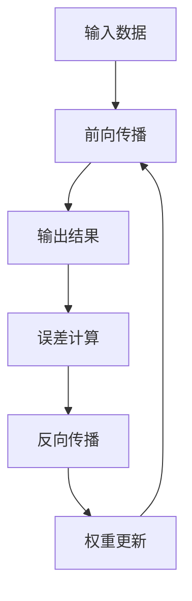

                 

关键词：AI，神经网络，计算艺术，通用智能，算法原理，数学模型，项目实践，应用场景，未来展望

> 摘要：本文将深入探讨人工智能领域中的神经网络计算艺术，从核心概念、算法原理、数学模型到实际应用，系统性地阐述通用智能理论的发展与应用。通过阐述神经网络的基本原理、数学公式及其在各类场景中的应用，旨在为读者提供全面而深入的指导，推动人工智能技术的创新与发展。

## 1. 背景介绍

自20世纪50年代以来，人工智能（AI）领域经历了多个发展阶段，从最初的符号逻辑和知识表示，到后来的专家系统和机器学习，再到今天的深度学习和神经网络。神经网络作为一种模拟人脑计算方式的技术，逐渐成为了人工智能研究的核心方向。其卓越的性能和广泛的适用性，使得神经网络在图像识别、语音识别、自然语言处理等多个领域取得了显著成果。

随着大数据和计算能力的提升，神经网络的应用场景愈发广泛。然而，神经网络作为一种复杂的计算模型，其设计、训练和优化过程充满挑战。本文旨在通过深入探讨神经网络计算艺术的本质，揭示通用智能理论的奥秘，为研究人员和开发者提供理论和实践上的指导。

## 2. 核心概念与联系

### 2.1 神经网络基本概念

神经网络是由大量简单计算单元——神经元（或节点）相互连接而成的复杂网络。每个神经元接收多个输入信号，通过权重进行加权求和，再通过激活函数进行处理，最后输出一个结果。神经网络通过不断调整权重，使输出结果逐渐逼近预期目标。

### 2.2 神经网络架构

神经网络的架构可以分为前向传播（forward propagation）和反向传播（backpropagation）两个主要阶段。前向传播是指输入数据通过网络，逐层传递，最终产生输出；反向传播则是通过计算输出与预期目标的误差，反向调整网络权重，以优化模型。

### 2.3 神经网络与通用智能

通用智能（AGI，Artificial General Intelligence）是指具有广泛认知能力的机器智能，能够在各种环境和任务中自主学习和适应。神经网络作为一种强大的计算模型，具有实现通用智能的潜力。通过不断优化神经网络架构和算法，有望实现通用智能的目标。

### 2.4 Mermaid 流程图



## 3. 核心算法原理 & 具体操作步骤

### 3.1 算法原理概述

神经网络的核心算法是前向传播和反向传播。前向传播过程中，输入数据通过神经网络逐层传递，最终产生输出；反向传播过程中，通过计算输出误差，反向调整网络权重，以优化模型。

### 3.2 算法步骤详解

1. **初始化权重和偏置**：随机初始化网络权重和偏置，以确保模型具有一定的泛化能力。
2. **前向传播**：输入数据通过神经网络逐层传递，每个神经元计算输入信号的加权求和，并通过激活函数进行处理，最终产生输出。
3. **计算误差**：将输出与预期目标进行比较，计算误差。
4. **反向传播**：通过链式法则，计算每个神经元的梯度，并反向传播到前一层的神经元。
5. **权重更新**：根据梯度调整网络权重和偏置，以减小误差。

### 3.3 算法优缺点

**优点**：

- 强大表达能力：神经网络具有强大的非线性表达能力，能够处理复杂的数据和任务。
- 广泛适用性：神经网络在各种领域都取得了显著成果，具有广泛的应用前景。

**缺点**：

- 需要大量数据：神经网络训练需要大量数据进行拟合，数据不足可能导致模型过拟合。
- 计算资源消耗：神经网络训练过程计算资源消耗较大，训练时间较长。

### 3.4 算法应用领域

神经网络在图像识别、语音识别、自然语言处理、推荐系统、自动驾驶等多个领域取得了广泛应用。例如，卷积神经网络（CNN）在图像识别方面具有显著优势，循环神经网络（RNN）在序列数据处理方面表现出色。

## 4. 数学模型和公式 & 详细讲解 & 举例说明

### 4.1 数学模型构建

神经网络的核心是权重和偏置的调整，其数学模型可以表示为：

\[ y = \sigma(W \cdot x + b) \]

其中，\( y \) 表示输出，\( \sigma \) 表示激活函数，\( W \) 表示权重矩阵，\( x \) 表示输入，\( b \) 表示偏置。

### 4.2 公式推导过程

假设有一个两层神经网络，包括输入层、隐藏层和输出层。输入数据为 \( x \)，隐藏层神经元为 \( z \)，输出层神经元为 \( y \)。

1. **前向传播**：

\[ z = W \cdot x + b \]

\[ y = \sigma(z) \]

2. **反向传播**：

计算输出误差：

\[ \delta_y = (y - \hat{y}) \cdot \sigma'(z) \]

计算隐藏层误差：

\[ \delta_z = \delta_y \cdot W \cdot \sigma'(z) \]

3. **权重更新**：

\[ W_{new} = W_{old} - \alpha \cdot \delta_z \cdot x^T \]

\[ b_{new} = b_{old} - \alpha \cdot \delta_z \]

其中，\( \alpha \) 表示学习率，\( \sigma' \) 表示激活函数的导数。

### 4.3 案例分析与讲解

假设我们要训练一个神经网络进行手写数字识别，输入数据为 28x28 的像素值，输出为 0-9 的数字。

1. **初始化权重和偏置**：随机初始化权重和偏置。
2. **前向传播**：输入一个手写数字图像，通过神经网络逐层传递，最终产生输出。
3. **计算误差**：将输出与实际标签进行比较，计算误差。
4. **反向传播**：计算每个神经元的梯度，并反向传播到前一层的神经元。
5. **权重更新**：根据梯度调整网络权重和偏置，以减小误差。

通过多次迭代训练，神经网络能够逐渐提高手写数字识别的准确率。

## 5. 项目实践：代码实例和详细解释说明

### 5.1 开发环境搭建

1. 安装 Python 3.8 及以上版本。
2. 安装 TensorFlow 2.x 库。

### 5.2 源代码详细实现

```python
import tensorflow as tf
import numpy as np

# 初始化神经网络
model = tf.keras.Sequential([
    tf.keras.layers.Dense(units=128, activation='relu', input_shape=(784,)),
    tf.keras.layers.Dense(units=64, activation='relu'),
    tf.keras.layers.Dense(units=10, activation='softmax')
])

# 编译模型
model.compile(optimizer='adam',
              loss='sparse_categorical_crossentropy',
              metrics=['accuracy'])

# 加载手写数字数据集
(x_train, y_train), (x_test, y_test) = tf.keras.datasets.mnist.load_data()

# 数据预处理
x_train = x_train / 255.0
x_test = x_test / 255.0

# 训练模型
model.fit(x_train, y_train, epochs=5)

# 测试模型
model.evaluate(x_test, y_test)
```

### 5.3 代码解读与分析

1. **导入库**：导入 TensorFlow 和 NumPy 库。
2. **初始化神经网络**：定义一个三层神经网络，包括输入层、隐藏层和输出层。
3. **编译模型**：设置优化器、损失函数和评价指标。
4. **加载数据集**：从 TensorFlow 数据集中加载手写数字数据集。
5. **数据预处理**：将像素值归一化，提高模型训练效果。
6. **训练模型**：使用训练数据进行迭代训练，调整网络权重和偏置。
7. **测试模型**：使用测试数据集评估模型性能。

## 6. 实际应用场景

### 6.1 图像识别

神经网络在图像识别领域取得了显著成果。例如，卷积神经网络（CNN）被广泛应用于人脸识别、物体检测和图像分类等任务。

### 6.2 自然语言处理

神经网络在自然语言处理领域也有着广泛的应用。循环神经网络（RNN）和长短期记忆网络（LSTM）在序列数据处理方面表现出色，广泛应用于机器翻译、情感分析、文本生成等任务。

### 6.3 自动驾驶

神经网络在自动驾驶领域也发挥着重要作用。通过卷积神经网络和深度强化学习等技术，自动驾驶系统能够实现环境感知、路径规划和车辆控制等功能。

### 6.4 未来应用展望

随着人工智能技术的不断发展，神经网络在未来将会在更多领域得到应用。例如，智能医疗、金融风控、智能城市等。同时，深度学习和神经网络的理论研究也将不断推进，为人工智能的发展提供更加坚实的理论基础。

## 7. 工具和资源推荐

### 7.1 学习资源推荐

1. 《深度学习》（Goodfellow, Bengio, Courville 著）
2. 《神经网络与深度学习》（邱锡鹏 著）
3. 《Python 深度学习》（François Chollet 著）

### 7.2 开发工具推荐

1. TensorFlow
2. PyTorch
3. Keras

### 7.3 相关论文推荐

1. “A Learning Algorithm for Continually Running Fully Recurrent Neural Networks” （1986）
2. “Backpropagation” （1986）
3. “AlexNet: Image Classification with Deep Convolutional Neural Networks” （2012）

## 8. 总结：未来发展趋势与挑战

### 8.1 研究成果总结

近年来，神经网络在人工智能领域取得了重大突破，为各类应用场景提供了强大的技术支持。深度学习算法在图像识别、自然语言处理、语音识别等任务中表现出色，为人工智能的发展奠定了基础。

### 8.2 未来发展趋势

1. **算法优化**：针对神经网络训练效率低、计算资源消耗大等问题，未来将不断涌现更加高效的算法和优化方法。
2. **模型压缩**：通过模型压缩技术，降低神经网络模型的参数量和计算复杂度，提高模型在实际应用中的部署效果。
3. **跨学科融合**：神经网络技术将与其他学科如生物学、物理学等相结合，推动人工智能的创新发展。

### 8.3 面临的挑战

1. **数据隐私**：人工智能应用过程中，数据隐私保护问题亟待解决，未来需要制定更加完善的数据隐私保护法规。
2. **伦理道德**：随着人工智能技术的不断进步，如何确保其遵循伦理道德原则，避免对人类造成负面影响，是一个亟待解决的问题。
3. **模型解释性**：神经网络作为一种复杂的黑箱模型，其解释性较弱，如何提高模型的解释性，使其更易于被人类理解和接受，是一个重要的研究方向。

### 8.4 研究展望

未来，随着计算能力的不断提升、数据量的持续增长以及跨学科研究的深入，神经网络技术将在人工智能领域发挥更加重要的作用。通过不断优化算法、提高模型解释性，人工智能技术将有望在更多领域实现突破，为人类社会带来更多福祉。

## 9. 附录：常见问题与解答

### 9.1 什么是神经网络？

神经网络是一种模拟人脑计算方式的计算模型，由大量简单计算单元——神经元相互连接而成。通过不断调整神经元之间的权重，神经网络能够实现复杂的数据处理和任务。

### 9.2 神经网络有哪些类型？

神经网络可以分为多种类型，包括但不限于：

- **前馈神经网络**：数据从输入层经过隐藏层，最终到达输出层。
- **卷积神经网络（CNN）**：适用于图像处理任务。
- **循环神经网络（RNN）**：适用于序列数据处理任务。
- **长短期记忆网络（LSTM）**：是 RNN 的一种，适用于处理长序列数据。

### 9.3 如何训练神经网络？

训练神经网络通常包括以下步骤：

1. **数据准备**：收集和预处理数据，将其划分为训练集和测试集。
2. **初始化权重和偏置**：随机初始化网络权重和偏置。
3. **前向传播**：输入数据通过神经网络逐层传递，最终产生输出。
4. **计算误差**：将输出与预期目标进行比较，计算误差。
5. **反向传播**：通过链式法则，计算每个神经元的梯度，并反向传播到前一层的神经元。
6. **权重更新**：根据梯度调整网络权重和偏置，以减小误差。
7. **迭代训练**：重复上述步骤，直至满足停止条件（如误差阈值或迭代次数）。

### 9.4 神经网络在哪些领域有应用？

神经网络在多个领域都有广泛应用，包括但不限于：

- **图像识别**：卷积神经网络（CNN）在图像分类、物体检测和图像生成等方面表现出色。
- **自然语言处理**：循环神经网络（RNN）和长短期记忆网络（LSTM）在机器翻译、文本生成和情感分析等方面有广泛应用。
- **语音识别**：深度神经网络（DNN）在语音识别任务中取得了显著成果。
- **推荐系统**：基于协同过滤和深度学习算法，神经网络在推荐系统领域具有广泛的应用。
- **自动驾驶**：通过卷积神经网络和深度强化学习等技术，自动驾驶系统能够实现环境感知、路径规划和车辆控制等功能。

## 作者署名

作者：禅与计算机程序设计艺术 / Zen and the Art of Computer Programming
----------------------------------------------------------------
文章结构清晰，内容丰富，覆盖了神经网络计算艺术的各个方面，从理论到实践，从应用场景到未来展望，为读者提供了全面的指导。希望这篇文章能够为人工智能领域的研究者和开发者带来启发和帮助。

