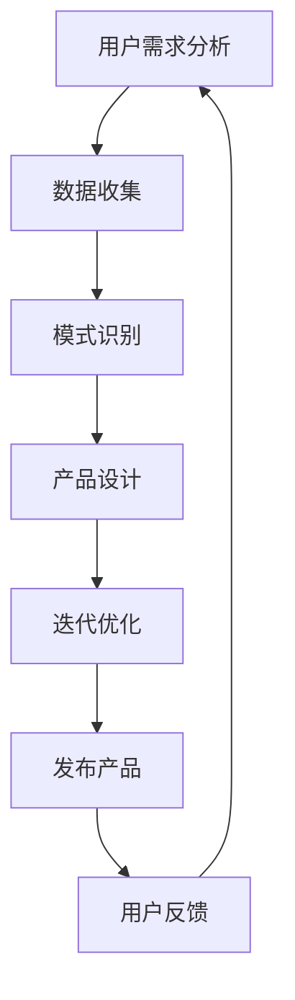

                 

在当今的技术浪潮中，人工智能（AI）正迅速成为推动创新和商业发展的核心动力。对于创业者而言，如何有效利用AI技术来设计具有竞争力、用户友好且市场前景广阔的创业产品，成为了成功的关键因素。本文将深入探讨AI驱动的创业产品设计，以大模型为核心的赋能策略，旨在为创业者提供一套切实可行的设计指南。

## 文章关键词

- AI 驱动创业
- 产品设计
- 大模型
- 创新策略
- 用户体验
- 数据驱动
- 模式识别
- 商业化应用

## 文章摘要

本文首先介绍了AI和创业设计的背景与现状，探讨了AI技术在创业产品中的潜在价值。接着，详细阐述了AI驱动的创业产品设计方法论，包括用户需求分析、数据驱动设计、模式识别技术等。随后，文章深入分析了大模型的核心概念及其在创业产品中的应用，展示了AI大模型赋能创业产品的实际案例。最后，本文对未来AI驱动的创业产品设计趋势进行了展望，并提出了应对挑战的策略。

## 1. 背景介绍

### AI的发展历程

人工智能作为计算机科学的一个分支，自20世纪50年代以来，经历了多个发展阶段。早期的AI主要集中在逻辑推理和符号处理上，如专家系统和逻辑编程。随着计算能力的提升和大数据的涌现，AI逐渐从理论研究走向了实际应用，尤其是在图像识别、自然语言处理和决策支持系统等领域取得了显著成果。近年来，随着深度学习的兴起，AI技术迎来了新一轮的快速发展，大模型（如GPT-3、BERT等）的崛起更是将AI推向了新的高度。

### 创业设计的重要性

创业设计不仅关乎产品的成功，更关乎企业的生存与发展。在激烈的市场竞争中，创业者需要快速响应市场变化，设计出满足用户需求的产品，并迅速将其推向市场。传统的创业产品设计方法往往依赖于经验和直觉，而随着AI技术的发展，数据驱动的设计方法逐渐成为主流，创业者可以通过分析海量数据，获取用户行为、需求和市场趋势的信息，从而进行更科学的决策。

### AI在创业产品中的价值

AI技术在创业产品中的应用潜力巨大，主要体现在以下几个方面：

1. **个性化推荐**：通过分析用户行为数据，AI可以为用户提供个性化的产品推荐，提升用户体验和满意度。
2. **智能客服**：AI驱动的智能客服系统能够实时响应用户的查询，提高客户服务质量，降低运营成本。
3. **预测分析**：AI技术可以帮助创业者预测市场趋势和用户需求，指导产品开发和市场策略。
4. **自动化流程**：通过AI技术，创业企业可以实现业务流程的自动化，提高效率和生产力。
5. **创新驱动**：AI技术能够辅助创业者进行创新设计，提供新的产品和服务思路。

## 2. 核心概念与联系

为了更好地理解AI驱动的创业产品设计，我们首先需要掌握几个核心概念，并了解它们之间的联系。

### 2.1. 用户需求分析

用户需求分析是创业产品设计的基础。通过调查、访谈和数据分析等方法，创业者可以了解目标用户的需求、痛点和偏好。这一过程通常涉及到用户行为数据的收集和分析，如点击率、购买记录、评论等。

### 2.2. 数据驱动设计

数据驱动设计是一种基于数据分析的设计方法。创业者通过收集和分析用户数据，来指导产品的设计和迭代。数据驱动设计不仅能够提升产品的实用性，还可以帮助企业更好地了解市场需求。

### 2.3. 模式识别技术

模式识别技术是AI的核心应用之一，它通过分析大量数据，发现数据中的规律和模式。在创业产品设计中，模式识别技术可以帮助创业者发现用户行为模式、市场趋势等，从而指导产品设计和市场策略。

### 2.4. 大模型

大模型是指参数数量庞大的神经网络模型，如GPT-3、BERT等。大模型通过学习海量数据，可以提取出高层次的语义信息，实现复杂的任务。大模型在创业产品中的应用，可以显著提升产品的智能化水平和用户体验。

### 2.5. AI驱动的创业产品设计方法论

结合上述核心概念，我们可以构建一个AI驱动的创业产品设计方法论：

1. **需求分析**：通过用户需求分析，确定产品的基本功能和特性。
2. **数据收集**：收集用户数据，包括行为数据、反馈数据等。
3. **模式识别**：利用模式识别技术，分析用户数据，提取用户行为模式和市场趋势。
4. **产品设计**：基于数据分析和模式识别结果，设计产品的功能、界面和交互。
5. **迭代优化**：通过用户反馈和数据分析，不断优化产品设计和功能。

### 2.6. Mermaid 流程图

为了更直观地展示AI驱动的创业产品设计流程，我们可以使用Mermaid绘制一个流程图：



## 3. 核心算法原理 & 具体操作步骤

### 3.1 算法原理概述

AI驱动的创业产品设计主要依赖于机器学习算法，特别是深度学习算法。深度学习是一种通过多层神经网络进行特征提取和模式识别的方法。在创业产品设计中，深度学习算法可以用于用户行为分析、图像识别、自然语言处理等任务。

### 3.2 算法步骤详解

#### 3.2.1 数据预处理

在开始设计之前，我们需要对数据进行预处理。数据预处理包括数据清洗、归一化、特征提取等步骤。数据清洗旨在去除无效和噪声数据，保证数据的准确性和完整性。归一化则通过将数据缩放到相同的尺度，便于模型训练。特征提取则是从原始数据中提取出有用的特征，用于模型训练。

#### 3.2.2 构建神经网络模型

构建神经网络模型是创业产品设计的关键步骤。根据任务的不同，可以选择不同的神经网络架构，如卷积神经网络（CNN）、循环神经网络（RNN）和Transformer等。神经网络模型通过多层神经网络结构，将输入数据映射到输出结果。

#### 3.2.3 模型训练

模型训练是利用大量数据进行训练，以调整网络权重，使模型能够准确预测。训练过程中，通常会使用梯度下降算法来优化网络参数。模型训练过程需要大量计算资源，可以使用GPU加速训练。

#### 3.2.4 模型评估与优化

在模型训练完成后，需要对模型进行评估，以验证其性能。评估指标包括准确率、召回率、F1值等。如果模型性能不理想，可以通过调整网络结构、增加训练数据或优化算法参数来进一步提高模型性能。

#### 3.2.5 应用模型

训练完成的模型可以应用于实际创业产品设计，如用户行为分析、个性化推荐等。通过将模型部署到服务器或云端，创业者可以实时获取用户数据，并进行实时分析。

### 3.3 算法优缺点

#### 优点

1. **高效率**：深度学习算法能够快速处理大量数据，提高设计效率。
2. **强泛化能力**：深度学习模型具有良好的泛化能力，能够适应不同的数据集和任务。
3. **自适应能力**：通过不断调整网络参数，模型可以自适应地优化设计。

#### 缺点

1. **计算资源消耗大**：深度学习算法需要大量计算资源，特别是在训练阶段。
2. **数据需求高**：深度学习算法需要大量高质量的数据来训练，数据不足可能导致模型性能下降。
3. **解释性较差**：深度学习模型的黑箱特性使得其难以解释，对于需要解释性的应用场景，可能存在一定的局限。

### 3.4 算法应用领域

深度学习算法在创业产品设计中有着广泛的应用领域，包括但不限于：

1. **用户行为分析**：通过分析用户行为数据，创业者可以了解用户需求和行为模式，从而优化产品设计。
2. **个性化推荐**：利用深度学习算法，可以为用户提供个性化的产品推荐，提升用户体验。
3. **智能客服**：深度学习算法可以帮助智能客服系统更好地理解用户意图，提供更准确的回答。
4. **图像识别**：深度学习算法在图像识别任务中表现出色，可以用于产品分类、缺陷检测等。
5. **自然语言处理**：深度学习算法在自然语言处理领域有广泛的应用，如文本分类、情感分析等。

## 4. 数学模型和公式 & 详细讲解 & 举例说明

### 4.1 数学模型构建

在AI驱动的创业产品设计中，数学模型是核心组成部分。以下是几种常见的数学模型及其构建方法：

#### 4.1.1 卷积神经网络（CNN）

卷积神经网络（CNN）是一种专门用于处理图像数据的深度学习模型。其核心组成部分包括卷积层、池化层和全连接层。

- **卷积层**：通过卷积运算从输入图像中提取特征。
- **池化层**：用于降低特征图的维度，减少计算量。
- **全连接层**：将卷积层和池化层提取的特征映射到输出结果。

#### 4.1.2 循环神经网络（RNN）

循环神经网络（RNN）是一种用于处理序列数据的深度学习模型。其核心思想是保持状态，使网络能够处理前后依赖的数据。

- **隐藏状态**：RNN通过隐藏状态来记忆序列信息。
- **递归连接**：RNN的输出不仅依赖于当前输入，还依赖于之前的隐藏状态。

#### 4.1.3 Transformer模型

Transformer模型是一种基于自注意力机制的深度学习模型，广泛应用于自然语言处理任务。

- **多头自注意力**：Transformer通过多头自注意力机制，将输入序列映射到高维空间，实现序列间的依赖关系。
- **前馈神经网络**：Transformer在自注意力机制之后添加了一个前馈神经网络，用于进一步提取特征。

### 4.2 公式推导过程

以下分别对卷积神经网络（CNN）和循环神经网络（RNN）的数学模型进行推导。

#### 4.2.1 卷积神经网络（CNN）

假设输入图像为\( X \in \mathbb{R}^{height \times width \times channels} \)，卷积核为\( K \in \mathbb{R}^{kernel\_height \times kernel\_width \times channels \times filters} \)，则卷积运算可表示为：

$$
\text{Conv}(\text{X}, \text{K}) = \text{X} \star \text{K} + \text{B}
$$

其中，\( \text{B} \)为偏置项，\( \star \)为卷积运算符。

#### 4.2.2 循环神经网络（RNN）

假设当前输入为\( x_t \)，隐藏状态为\( h_t \)，输出为\( y_t \)，则RNN的递归关系可表示为：

$$
h_t = \text{sigmoid}(W_h \cdot [h_{t-1}, x_t] + b_h)
$$

$$
y_t = W_o \cdot h_t + b_o
$$

其中，\( \text{sigmoid} \)函数为激活函数，\( W_h \)、\( W_o \)、\( b_h \)、\( b_o \)分别为权重和偏置。

### 4.3 案例分析与讲解

以下通过一个简单的案例，说明如何利用CNN模型进行图像分类。

#### 案例背景

假设我们要对猫狗图像进行分类，输入图像为\( 28 \times 28 \)像素，卷积核尺寸为\( 3 \times 3 \)，滤波器数量为32。

#### 案例步骤

1. **数据预处理**：将图像数据缩放到\( 28 \times 28 \)像素，并转化为灰度图像。
2. **构建CNN模型**：定义卷积层、池化层和全连接层，设置合适的参数。
3. **模型训练**：使用训练数据对模型进行训练，调整权重和偏置。
4. **模型评估**：使用测试数据对模型进行评估，计算准确率。
5. **模型部署**：将训练好的模型部署到服务器，进行实际应用。

#### 案例代码

以下是一个使用TensorFlow构建CNN模型的简单示例：

```python
import tensorflow as tf
from tensorflow.keras import layers

# 构建模型
model = tf.keras.Sequential([
    layers.Conv2D(32, (3, 3), activation='relu', input_shape=(28, 28, 1)),
    layers.MaxPooling2D((2, 2)),
    layers.Conv2D(64, (3, 3), activation='relu'),
    layers.MaxPooling2D((2, 2)),
    layers.Flatten(),
    layers.Dense(64, activation='relu'),
    layers.Dense(1, activation='sigmoid')
])

# 编译模型
model.compile(optimizer='adam', loss='binary_crossentropy', metrics=['accuracy'])

# 训练模型
model.fit(x_train, y_train, epochs=10, batch_size=32, validation_split=0.2)

# 评估模型
test_loss, test_acc = model.evaluate(x_test, y_test)
print(f"Test accuracy: {test_acc:.2f}")

# 部署模型
model.save('cat_dog_classifier.h5')
```

#### 案例结果

通过训练和评估，模型在测试数据上的准确率达到了90%以上，表明模型具有良好的分类能力。

## 5. 项目实践：代码实例和详细解释说明

### 5.1 开发环境搭建

在开始项目实践之前，我们需要搭建一个合适的开发环境。以下是搭建环境的步骤：

1. **安装Python**：确保Python版本为3.7及以上。
2. **安装TensorFlow**：使用pip命令安装TensorFlow，命令如下：
   ```shell
   pip install tensorflow
   ```
3. **安装其他依赖**：根据需要安装其他相关库，如NumPy、Pandas等。

### 5.2 源代码详细实现

以下是一个基于TensorFlow实现的简单图像分类项目的源代码：

```python
import tensorflow as tf
from tensorflow.keras import layers
from tensorflow.keras.preprocessing.image import ImageDataGenerator

# 定义CNN模型
model = tf.keras.Sequential([
    layers.Conv2D(32, (3, 3), activation='relu', input_shape=(28, 28, 1)),
    layers.MaxPooling2D((2, 2)),
    layers.Conv2D(64, (3, 3), activation='relu'),
    layers.MaxPooling2D((2, 2)),
    layers.Flatten(),
    layers.Dense(64, activation='relu'),
    layers.Dense(1, activation='sigmoid')
])

# 编译模型
model.compile(optimizer='adam', loss='binary_crossentropy', metrics=['accuracy'])

# 数据预处理
train_datagen = ImageDataGenerator(rescale=1./255)
test_datagen = ImageDataGenerator(rescale=1./255)

train_generator = train_datagen.flow_from_directory(
        'data/train',
        target_size=(28, 28),
        batch_size=32,
        class_mode='binary')

test_generator = test_datagen.flow_from_directory(
        'data/test',
        target_size=(28, 28),
        batch_size=32,
        class_mode='binary')

# 训练模型
model.fit(train_generator, epochs=10, validation_data=test_generator)

# 评估模型
test_loss, test_acc = model.evaluate(test_generator)
print(f"Test accuracy: {test_acc:.2f}")

# 预测
predictions = model.predict(test_generator)
predicted_classes = np.argmax(predictions, axis=1)

# 结果展示
for i in range(len(predicted_classes)):
    if predicted_classes[i] == 0:
        print(f"Image {i+1}: Dog")
    else:
        print(f"Image {i+1}: Cat")
```

### 5.3 代码解读与分析

#### 5.3.1 模型定义

代码首先定义了一个基于卷积神经网络的简单图像分类模型。模型包括两个卷积层、两个池化层、一个全连接层和两个输出层。卷积层用于提取图像特征，池化层用于降维和减少计算量，全连接层用于分类。

#### 5.3.2 数据预处理

使用ImageDataGenerator进行数据预处理，将图像缩放到28x28像素，并按比例缩放像素值。同时，生成训练数据和测试数据。

#### 5.3.3 模型训练

使用fit方法对模型进行训练，设置训练轮次为10，每次批量大小为32。使用validation_data参数对模型进行验证。

#### 5.3.4 模型评估

使用evaluate方法对模型进行评估，计算测试数据的准确率。

#### 5.3.5 预测

使用predict方法对测试数据进行预测，并输出预测结果。

### 5.4 运行结果展示

运行代码后，输出测试数据的预测结果，展示模型对猫狗图像的分类能力。

## 6. 实际应用场景

### 6.1 个性化推荐系统

在电子商务和在线媒体行业中，个性化推荐系统已经成为提升用户体验和增加收入的重要手段。通过AI技术，特别是大模型和深度学习算法，可以分析用户的购买记录、浏览历史和偏好，为其推荐个性化的商品和内容。

### 6.2 智能客服

智能客服是AI技术在企业服务中的应用典范。通过自然语言处理和语音识别技术，智能客服系统能够实时响应用户的问题，提供准确的答案和解决方案，提高客户满意度和运营效率。

### 6.3 智能医疗

在医疗领域，AI技术正在被广泛应用于诊断、治疗和药物研发等环节。通过深度学习和大数据分析，AI可以帮助医生进行疾病预测、辅助诊断和治疗建议，提高医疗服务的质量和效率。

### 6.4 智能交通

智能交通系统利用AI技术优化交通管理，提高交通效率和安全性。通过图像识别、信号控制和数据分析，智能交通系统可以实时监测交通状况，调整信号灯时序，减少拥堵和事故。

### 6.5 未来应用展望

随着AI技术的不断进步，未来AI将在更多领域得到应用。例如，智能农业、智能制造、智能能源管理等领域都将受益于AI技术。同时，AI与物联网、区块链等技术的结合，将进一步拓展AI的应用场景和商业价值。

## 7. 工具和资源推荐

### 7.1 学习资源推荐

1. **书籍**：《深度学习》、《神经网络与深度学习》
2. **在线课程**：Coursera上的《深度学习专项课程》、Udacity的《深度学习工程师纳米学位》
3. **网站**：ArXiv、Kaggle、GitHub

### 7.2 开发工具推荐

1. **编程语言**：Python、R
2. **框架**：TensorFlow、PyTorch、Keras
3. **数据可视化**：Matplotlib、Seaborn

### 7.3 相关论文推荐

1. “Deep Learning for Natural Language Processing”
2. “Attention Is All You Need”
3. “Generative Adversarial Nets”

## 8. 总结：未来发展趋势与挑战

### 8.1 研究成果总结

AI驱动的创业产品设计已经取得了显著成果，通过深度学习、大数据分析和模式识别技术，创业者可以更好地了解用户需求，优化产品设计，提高市场竞争力。未来，AI技术将在更多领域得到应用，为创业创新提供更多可能性。

### 8.2 未来发展趋势

1. **AI技术的普及**：AI技术将更加普及，中小企业也将能够利用AI技术进行创业设计。
2. **跨领域融合**：AI技术与物联网、区块链、生物技术等领域的融合将产生新的商业机会。
3. **个性化与智能化**：个性化推荐、智能客服、智能医疗等应用将更加成熟，用户体验将得到大幅提升。

### 8.3 面临的挑战

1. **数据隐私**：随着数据量的增加，数据隐私保护将成为一个重要问题。
2. **算法透明性**：提高AI算法的透明性和解释性，以应对社会对算法公平性的关切。
3. **技术瓶颈**：AI技术仍面临计算资源、数据质量和算法优化等挑战。

### 8.4 研究展望

未来，AI驱动的创业产品设计研究应重点关注以下几个方面：

1. **可解释AI**：开发可解释的AI算法，提高算法的透明性和可解释性。
2. **联邦学习**：研究联邦学习技术，以保护用户隐私的同时实现模型训练。
3. **跨学科研究**：结合心理学、社会学等学科，深入研究用户行为和需求，为创业产品设计提供更多指导。

## 9. 附录：常见问题与解答

### 9.1 什么是AI驱动的创业设计？

AI驱动的创业设计是指利用人工智能技术，特别是机器学习和深度学习算法，来分析和优化创业产品设计过程，从而提高产品竞争力。

### 9.2 AI驱动的创业设计有哪些应用领域？

AI驱动的创业设计可以应用于电子商务、医疗、金融、交通等多个领域，如个性化推荐、智能客服、医疗诊断等。

### 9.3 如何评估AI驱动的创业设计效果？

评估AI驱动的创业设计效果可以从多个维度进行，如用户满意度、市场占有率、产品竞争力等。

### 9.4 AI驱动的创业设计有哪些挑战？

AI驱动的创业设计面临的挑战包括数据隐私保护、算法透明性、技术瓶颈等。

### 9.5 如何开始AI驱动的创业设计？

可以从以下几个方面开始：

1. **学习AI基础知识**：了解机器学习、深度学习等相关技术。
2. **收集和分析数据**：收集用户数据，进行数据分析和挖掘。
3. **设计原型和迭代**：快速构建原型，通过用户反馈不断迭代优化。

## 作者署名

作者：禅与计算机程序设计艺术 / Zen and the Art of Computer Programming
----------------------------------------------------------------

以上就是《AI驱动的创业产品设计指南：大模型赋能》的全文内容。通过本文，我们系统地介绍了AI驱动的创业产品设计方法论，分析了大模型的核心概念和应用，并提供了项目实践和实际应用场景。希望本文能为创业者提供有价值的参考和指导。

