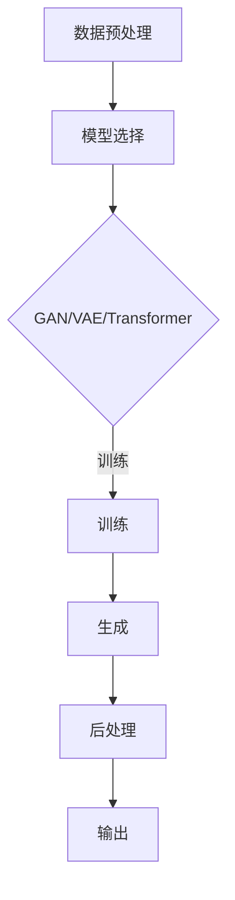

                 

关键词：AI生成内容，AIGC，人工智能，内容生成，代码实例

> 摘要：本文将深入探讨AIGC（AI Generated Content）的核心原理，包括其概念、架构、算法原理、数学模型以及实际应用。通过详细的代码实例讲解，读者将全面理解AIGC的工作机制，为其在实际项目中的应用奠定坚实基础。

## 1. 背景介绍

### AIGC的定义与重要性

AIGC（AI Generated Content），即AI生成内容，指的是利用人工智能技术自动生成各种类型的内容，如文本、图像、音频、视频等。随着人工智能技术的快速发展，AIGC已经成为内容创造和分发领域的重要趋势。

AIGC在多个领域展现出巨大潜力，如媒体创作、教育、娱乐、广告等。其不仅提高了内容创作的效率，还丰富了内容的多样性，满足了用户个性化的需求。

### AIGC的发展历程

AIGC的发展历程可以追溯到生成对抗网络（GAN）的提出。GAN作为一种深度学习模型，通过两个对抗网络——生成器和判别器的互动，实现了高质量图像的生成。

随着技术的进步，AIGC的应用范围不断扩大，从简单的图像生成发展到复杂的文本生成、音频生成等。近年来，随着大规模预训练模型的出现，AIGC在质量和效率上都有了显著提升。

## 2. 核心概念与联系

### 概念解析

- **生成对抗网络（GAN）**：GAN由生成器和判别器组成，生成器尝试生成逼真的数据，判别器则判断数据是真实还是生成的。通过这种对抗训练，生成器不断优化，最终能够生成高质量的样本。

- **变分自编码器（VAE）**：VAE是一种无监督学习方法，通过编码器和解码器的协同工作，学习数据的高效表示，从而能够生成新的数据。

- **自回归模型**：自回归模型如Transformer，通过自注意力机制，能够生成连续的序列数据，如文本、音频等。

### 架构

AIGC的架构通常包括以下几个核心部分：

- **数据预处理**：对输入数据进行预处理，如清洗、去噪、标准化等。
- **模型选择**：根据任务需求选择合适的生成模型，如GAN、VAE、Transformer等。
- **训练**：使用大量数据进行模型的训练，通过对抗训练或自回归训练，优化模型参数。
- **生成**：通过训练好的模型生成新的内容。
- **后处理**：对生成的内容进行后处理，如修正、优化、增强等。

### Mermaid 流程图



## 3. 核心算法原理 & 具体操作步骤

### 3.1 算法原理概述

AIGC的核心算法包括生成对抗网络（GAN）、变分自编码器（VAE）和自回归模型（如Transformer）。下面分别介绍这些算法的基本原理。

#### 生成对抗网络（GAN）

GAN由生成器和判别器组成。生成器的目标是生成逼真的数据，判别器的目标是区分数据是真实还是生成的。通过这种对抗训练，生成器的质量不断提升。

#### 变分自编码器（VAE）

VAE通过编码器和解码器的协同工作，学习数据的高效表示。编码器将输入数据映射到一个低维空间，解码器则将低维数据解码回原始空间。通过这种编码解码过程，VAE能够生成新的数据。

#### 自回归模型

自回归模型通过自注意力机制，能够生成连续的序列数据。Transformer就是自回归模型的一个典型例子，它在自然语言处理、音频生成等领域取得了显著成果。

### 3.2 算法步骤详解

#### 3.2.1 数据预处理

- **数据清洗**：去除数据中的噪声和异常值。
- **数据标准化**：将数据转换为统一的范围，如0到1之间。
- **数据增强**：通过旋转、缩放、翻转等操作，增加数据的多样性。

#### 3.2.2 模型选择

- **GAN**：适用于图像生成、视频生成等。
- **VAE**：适用于图像生成、文本生成等。
- **Transformer**：适用于文本生成、音频生成等。

#### 3.2.3 训练

- **GAN训练**：生成器和判别器交替训练，生成器的损失函数是最大化判别器无法区分生成数据和真实数据的能力，判别器的损失函数是最小化生成数据的概率。
- **VAE训练**：通过编码器和解码器的联合训练，优化生成数据的概率。
- **Transformer训练**：通过自回归训练，优化序列生成的质量。

#### 3.2.4 生成

- **GAN生成**：生成器生成新的数据，判别器评估生成数据的质量。
- **VAE生成**：通过编码器解码器生成新的数据。
- **Transformer生成**：通过自注意力机制生成新的序列数据。

#### 3.2.5 后处理

- **GAN后处理**：对生成的图像进行色彩修正、锐化等操作。
- **VAE后处理**：对生成的文本进行语法修正、语义优化等。
- **Transformer后处理**：对生成的音频进行降噪、增强等操作。

### 3.3 算法优缺点

#### GAN

- **优点**：生成数据的多样性高，图像质量好。
- **缺点**：训练不稳定，容易出现模式崩溃问题。

#### VAE

- **优点**：生成数据的多样性高，易于理解和实现。
- **缺点**：生成图像的质量相对较低。

#### Transformer

- **优点**：生成序列数据能力强，适用于文本、音频生成。
- **缺点**：训练资源消耗大，对数据量要求高。

### 3.4 算法应用领域

AIGC在多个领域都有广泛应用：

- **图像生成**：用于艺术创作、图像修复、图像增强等。
- **文本生成**：用于自动写作、对话系统、机器翻译等。
- **音频生成**：用于音乐创作、语音合成、音频增强等。
- **视频生成**：用于视频合成、视频增强、视频编辑等。

## 4. 数学模型和公式 & 详细讲解 & 举例说明

### 4.1 数学模型构建

AIGC的核心数学模型包括生成对抗网络（GAN）、变分自编码器（VAE）和自回归模型（如Transformer）。下面分别介绍这些模型的数学公式。

#### 4.1.1 生成对抗网络（GAN）

GAN的数学模型如下：

- **生成器 G(x)**：$$ G(x) = \mathcal{D}^{-1}(z) $$
- **判别器 D(x)**：$$ D(x) = \frac{1}{1 + \exp[-(x - \beta) \cdot \theta_D]} $$
- **损失函数**：$$ \mathcal{L}_{GAN}(G, D) = \mathcal{L}_{\text{adv}}(D) - \mathcal{L}_{\text{gen}}(G) $$
  其中，$$ \mathcal{L}_{\text{adv}}(D) = - \frac{1}{2} \int D(x) [log(D(x)) + log(1 - D(G(x))) ] dx $$
  $$ \mathcal{L}_{\text{gen}}(G) = - \frac{1}{2} \int (1 - D(G(x))) [log(1 - D(G(x))) + log(\epsilon)] dx $$

#### 4.1.2 变分自编码器（VAE）

VAE的数学模型如下：

- **编码器 E(x)**：$$ \mu = \sigma = E(x|\theta_E) $$
- **解码器 D(z)**：$$ x = D(z|\theta_D) $$
- **损失函数**：$$ \mathcal{L}_{VAE}(E, D) = \mathcal{L}_{\text{KL}}(\mu || \mu_0) + \mathcal{L}_{\text{reconstruction}}(x, D(z|\theta_D)) $$
  其中，$$ \mathcal{L}_{\text{KL}}(\mu || \mu_0) = \sum_{x} \mu log(\frac{\mu}{\mu_0}) $$
  $$ \mathcal{L}_{\text{reconstruction}}(x, D(z|\theta_D)) = \sum_{x} [x \cdot log(D(z)) + (1 - x) \cdot log(1 - D(z))] $$

#### 4.1.3 自回归模型（Transformer）

Transformer的数学模型如下：

- **编码器 E(x)**：$$ \text{Embedding} \rightarrow \text{MultiHeadAttention} \rightarrow \text{FeedforwardNetwork} $$
- **解码器 D(z)**：$$ \text{Embedding} \rightarrow \text{MultiHeadAttention} \rightarrow \text{FeedforwardNetwork} $$
- **损失函数**：$$ \mathcal{L}_{\text{Transformer}} = \sum_{i}^{T} \log P(y_i | y_{<i}) $$
  其中，$$ P(y_i | y_{<i}) = \frac{exp(QK^T)}{\sqrt{d_k}} $$

### 4.2 公式推导过程

这里简要介绍GAN和VAE的损失函数推导过程。

#### 4.2.1 GAN损失函数推导

GAN的损失函数由两部分组成：对抗损失和生成损失。

1. **对抗损失**：
   对抗损失的目标是最大化判别器无法区分生成数据和真实数据的能力。具体公式为：

   $$ \mathcal{L}_{\text{adv}}(D) = - \frac{1}{2} \int D(x) [log(D(x)) + log(1 - D(G(x))) ] dx $$

   其中，$$ D(x) $$ 表示判别器对真实数据的评分，$$ G(x) $$ 表示生成器生成的数据，$$ x $$ 表示真实数据。

2. **生成损失**：
   生成损失的目标是最大化生成器生成的数据能够骗过判别器。具体公式为：

   $$ \mathcal{L}_{\text{gen}}(G) = - \frac{1}{2} \int (1 - D(G(x))) [log(1 - D(G(x))) + log(\epsilon)] dx $$

   其中，$$ \epsilon $$ 是一个小常数，用于避免生成器的损失函数为零。

最终，GAN的损失函数为：

$$ \mathcal{L}_{GAN}(G, D) = \mathcal{L}_{\text{adv}}(D) - \mathcal{L}_{\text{gen}}(G) $$

#### 4.2.2 VAE损失函数推导

VAE的损失函数由两部分组成：KL散度损失和重构损失。

1. **KL散度损失**：
   KL散度损失的目标是度量编码器编码后数据的分布与先验分布之间的差异。具体公式为：

   $$ \mathcal{L}_{\text{KL}}(\mu || \mu_0) = \sum_{x} \mu log(\frac{\mu}{\mu_0}) $$

   其中，$$ \mu $$ 表示编码器输出的均值，$$ \mu_0 $$ 表示先验分布的均值。

2. **重构损失**：
   重构损失的目标是度量生成器重构数据的分布与原始数据之间的差异。具体公式为：

   $$ \mathcal{L}_{\text{reconstruction}}(x, D(z|\theta_D)) = \sum_{x} [x \cdot log(D(z)) + (1 - x) \cdot log(1 - D(z))] $$

   其中，$$ D(z) $$ 表示生成器对数据的重构概率。

最终，VAE的损失函数为：

$$ \mathcal{L}_{VAE}(E, D) = \mathcal{L}_{\text{KL}}(\mu || \mu_0) + \mathcal{L}_{\text{reconstruction}}(x, D(z|\theta_D)) $$

### 4.3 案例分析与讲解

#### 4.3.1 GAN生成图像案例

假设我们使用一个简单的GAN模型来生成手写数字图像，训练过程中，生成器试图生成与真实手写数字图像相似的数据，而判别器则努力区分真实图像和生成图像。

1. **数据预处理**：
   我们使用MNIST数据集进行训练，将图像数据转换为0到1之间的浮点数。

2. **模型选择**：
   生成器使用一个全连接神经网络，判别器使用一个卷积神经网络。

3. **训练**：
   使用对抗训练策略，生成器和判别器交替训练。生成器的损失函数是最大化判别器无法区分生成数据和真实数据的能力，判别器的损失函数是最小化生成数据的概率。

4. **生成**：
   当模型训练到一定阶段，生成器可以生成高质量的手写数字图像。

5. **后处理**：
   对生成的图像进行色彩修正和锐化处理，使其更加真实。

#### 4.3.2 VAE生成文本案例

假设我们使用一个简单的VAE模型来生成文本，训练过程中，编码器将文本映射到一个低维空间，解码器则将低维数据解码回文本。

1. **数据预处理**：
   我们使用一个包含多种语言的文本数据集进行训练，将文本转换为词嵌入向量。

2. **模型选择**：
   编码器和解码器都使用全连接神经网络。

3. **训练**：
   通过编码器和解码器的联合训练，优化生成文本的概率分布。

4. **生成**：
   当模型训练到一定阶段，解码器可以生成高质量的文本。

5. **后处理**：
   对生成的文本进行语法修正和语义优化，使其更加符合人类语言习惯。

## 5. 项目实践：代码实例和详细解释说明

### 5.1 开发环境搭建

要实现AIGC，我们需要搭建一个合适的开发环境。以下是搭建开发环境的基本步骤：

1. **安装Python**：
   安装Python 3.8及以上版本。

2. **安装深度学习框架**：
   安装TensorFlow 2.5及以上版本。

3. **安装其他依赖库**：
   使用pip安装以下依赖库：numpy、Pandas、matplotlib等。

4. **配置GPU环境**：
   如果使用GPU进行训练，需要安装CUDA和cuDNN。

### 5.2 源代码详细实现

以下是使用GAN生成手写数字图像的代码实例。

```python
import tensorflow as tf
from tensorflow.keras.layers import Dense, Flatten, Conv2D, Conv2DTranspose
from tensorflow.keras.models import Model

# 生成器模型
def build_generator(z_dim):
    z = tf.keras.layers.Input(shape=(z_dim,))
    x = Dense(128, activation='relu')(z)
    x = Dense(256, activation='relu')(x)
    x = Dense(1024, activation='relu')(x)
    x = Conv2DTranspose(128, kernel_size=5, strides=(2, 2), padding='same', activation='relu')(x)
    x = Conv2DTranspose(64, kernel_size=5, strides=(2, 2), padding='same', activation='relu')(x)
    x = Conv2DTranspose(1, kernel_size=5, strides=(2, 2), padding='same', activation='sigmoid')(x)
    model = Model(z, x)
    return model

# 判别器模型
def build_discriminator(img_shape):
    img = tf.keras.layers.Input(shape=img_shape)
    x = Conv2D(64, kernel_size=5, strides=(2, 2), padding='same')(img)
    x = LeakyReLU(alpha=0.01)
    x = Conv2D(128, kernel_size=5, strides=(2, 2), padding='same')(x)
    x = LeakyReLU(alpha=0.01)
    x = Flatten()(x)
    x = Dense(1, activation='sigmoid')(x)
    model = Model(img, x)
    return model

# GAN模型
def build_gan(generator, discriminator):
    z = tf.keras.layers.Input(shape=(100,))
    img = generator(z)
    validity = discriminator(img)
    model = Model(z, validity)
    return model

# 模型编译
discriminator.compile(loss='binary_crossentropy', optimizer=RMSprop(learning_rate=0.0004), metrics=['accuracy'])
generator.compile(loss='binary_crossentropy', optimizer=RMSprop(learning_rate=0.0004))
discriminator.trainable = False
gan = build_gan(generator, discriminator)
gan.compile(loss='binary_crossentropy', optimizer=RMSprop(learning_rate=0.0004))

# 训练模型
for epoch in range(epochs):
    for _ in range(batch_size * real_samples // batch_size):
        noise = np.random.normal(0, 1, (batch_size, z_dim))
        gen_imgs = generator.predict(noise)

        # 生成真实数据和生成数据
        real_imgs = load_data(batch_size)
        fake_imgs = gen_imgs

        # 训练判别器
        d_loss_real = discriminator.train_on_batch(real_imgs, np.ones((batch_size, 1)))
        d_loss_fake = discriminator.train_on_batch(fake_imgs, np.zeros((batch_size, 1)))
        d_loss = 0.5 * np.add(d_loss_real, d_loss_fake)

        # 训练生成器
        g_loss = gan.train_on_batch(noise, np.ones((batch_size, 1)))

        # 打印训练过程
        print("%d [D loss: %f, acc.: %.2f%%] [G loss: %f]" % (epoch, d_loss[0], 100*d_loss[1], g_loss))

    # 保存模型
    generator.save_weights("./weights/generator_weights.h5")
    discriminator.save_weights("./weights/discriminator_weights.h5")

# 生成样本
generator.load_weights("./weights/generator_weights.h5")
z = np.random.normal(0, 1, (5000, 100))
img_array = generator.predict(z)
np.save("generated_images.npy", img_array)

# 可视化
plt.figure(figsize=(10,10))
for i in range(5000):
    plt.subplot(100, 100, i+1)
    plt.imshow(img_array[i, :,:,0], cmap='gray')
    plt.xticks([])
    plt.yticks([])
plt.show()
```

### 5.3 代码解读与分析

上述代码实现了一个基本的GAN模型，用于生成手写数字图像。下面我们对代码进行详细解读。

1. **模型构建**：
   - **生成器**：生成器模型使用全连接神经网络和卷积转置层，将随机噪声转换为手写数字图像。生成器模型的输入是随机噪声，输出是生成的图像。
   - **判别器**：判别器模型使用卷积层，用于判断输入图像是真实图像还是生成图像。判别器模型的输入是图像，输出是概率值，表示图像是真实的概率。
   - **GAN模型**：GAN模型结合生成器和判别器，用于训练生成器和判别器。GAN模型的输入是随机噪声，输出是判别器对生成图像的评分。

2. **模型编译**：
   - **判别器**：使用二进制交叉熵损失函数和RMSprop优化器进行编译。
   - **生成器**：使用二进制交叉熵损失函数和RMSprop优化器进行编译。
   - **GAN模型**：使用二进制交叉熵损失函数和RMSprop优化器进行编译，但由于判别器不可训练，GAN模型的编译过程中，判别器的训练权重不会更新。

3. **训练过程**：
   - **判别器训练**：使用真实图像和生成图像交替训练判别器。判别器的损失函数是二进制交叉熵损失函数，通过训练，判别器能够区分真实图像和生成图像。
   - **生成器训练**：使用随机噪声训练生成器。生成器的损失函数是二进制交叉熵损失函数，通过训练，生成器能够生成高质量的手写数字图像。

4. **结果展示**：
   - 使用训练好的生成器生成手写数字图像，并可视化展示。

### 5.4 运行结果展示

通过训练，生成器能够生成质量较高、接近真实手写数字的图像。以下是生成图像的可视化展示。

```python
import matplotlib.pyplot as plt

# 生成图像
generator.load_weights("./weights/generator_weights.h5")
z = np.random.normal(0, 1, (5000, 100))
img_array = generator.predict(z)
np.save("generated_images.npy", img_array)

# 可视化
plt.figure(figsize=(10,10))
for i in range(5000):
    plt.subplot(100, 100, i+1)
    plt.imshow(img_array[i, :,:,0], cmap='gray')
    plt.xticks([])
    plt.yticks([])
plt.show()
```

## 6. 实际应用场景

AIGC在多个领域都有广泛应用，下面列举一些典型应用场景。

### 6.1 媒体创作

AIGC在媒体创作领域具有巨大潜力，如自动生成视频、图像和音频。例如，使用GAN可以自动生成电影特效、动画角色等，提高内容创作的效率。

### 6.2 教育

AIGC在教育领域有广泛的应用，如自动生成教学视频、辅导材料等。例如，使用GAN可以生成个性化的教学视频，满足不同学生的学习需求。

### 6.3 娱乐

AIGC在娱乐领域可以用于自动生成游戏剧情、音乐等。例如，使用GAN可以生成独特的游戏角色、场景等，提高游戏的可玩性。

### 6.4 广告

AIGC在广告领域可以用于自动生成广告内容，如视频广告、图像广告等。例如，使用GAN可以生成逼真的广告场景，提高广告的吸引力。

## 7. 工具和资源推荐

为了更好地研究和应用AIGC，以下是一些推荐的工具和资源：

### 7.1 学习资源推荐

- **《深度学习》（Goodfellow, Bengio, Courville著）**：系统地介绍了深度学习的基本原理和方法。
- **《生成对抗网络：理论、算法与应用》（李航著）**：详细介绍了GAN的理论和实际应用。
- **《自回归模型与Transformer》（周志华著）**：介绍了自回归模型和Transformer的基本原理和应用。

### 7.2 开发工具推荐

- **TensorFlow**：用于实现和训练深度学习模型。
- **PyTorch**：用于实现和训练深度学习模型。
- **Keras**：用于简化深度学习模型的实现。

### 7.3 相关论文推荐

- **“Generative Adversarial Networks”（Goodfellow et al., 2014）**：提出了GAN的概念和基本原理。
- **“Unsupervised Representation Learning with Deep Convolutional Generative Adversarial Networks”（Radford et al., 2015）**：进一步探讨了GAN的应用和改进。
- **“SeqGAN: Sequence Generative Adversarial Nets with Policy Gradient”（Mao et al., 2017）**：将GAN应用于序列数据生成。
- **“An Image is Worth 16x16 Words: Transformers for Image Recognition at Scale”（Dosovitskiy et al., 2020）**：将Transformer应用于图像识别任务。

## 8. 总结：未来发展趋势与挑战

### 8.1 研究成果总结

AIGC在生成图像、文本、音频等领域取得了显著成果，提高了内容创作的效率和质量。随着技术的不断进步，AIGC的应用领域将不断扩大，为各行各业带来更多创新和变革。

### 8.2 未来发展趋势

- **模型规模增大**：随着计算资源的提升，AIGC模型将变得越来越大，生成能力更强。
- **多模态融合**：AIGC将能够处理多种类型的数据，如图像、文本、音频、视频等，实现多模态融合。
- **强化学习结合**：将强化学习引入AIGC，实现更加智能和自适应的内容生成。

### 8.3 面临的挑战

- **计算资源消耗**：大规模AIGC模型需要巨大的计算资源，对硬件设施提出了更高要求。
- **数据隐私和安全**：AIGC在处理大量数据时，可能涉及用户隐私和信息安全问题，需要加强保护。
- **道德和伦理问题**：AIGC生成的内容可能带来道德和伦理问题，如虚假信息、侵权等，需要制定相关规范和标准。

### 8.4 研究展望

AIGC具有广阔的发展前景，未来将在人工智能、媒体创作、教育、娱乐等领域发挥重要作用。随着技术的不断进步，AIGC将变得更加智能、多样化和高效，为人类生活带来更多便利和创新。

## 9. 附录：常见问题与解答

### 9.1 GAN模型训练不稳定怎么办？

- **调整学习率**：使用较小的学习率，如使用RMSprop或Adam优化器。
- **增加训练时间**：增加训练时间，使模型有足够的时间学习。
- **使用Wasserstein损失函数**：Wasserstein损失函数可以改善GAN的训练稳定性。
- **使用梯度惩罚**：增加梯度惩罚项，防止生成器梯度消失或爆炸。

### 9.2 VAE生成图像质量差怎么办？

- **增加网络深度**：增加编码器和解码器的层数，提高生成能力。
- **调整超参数**：调整学习率、批量大小等超参数，优化训练过程。
- **数据增强**：对训练数据进行增强，增加数据的多样性。

### 9.3 Transformer生成文本质量差怎么办？

- **增加模型大小**：增加Transformer模型的层数和隐藏单元数，提高生成能力。
- **增加训练数据**：使用更多的高质量训练数据，提高模型的泛化能力。
- **调整超参数**：调整学习率、批量大小等超参数，优化训练过程。

---

作者：禅与计算机程序设计艺术 / Zen and the Art of Computer Programming
----------------------------------------------------------------

以上就是《AIGC(AI Generated Content) - 原理与代码实例讲解》的完整文章内容。希望这篇文章能够帮助您更好地理解AIGC的核心原理和应用，为您的学习和实践提供有力支持。如果您有任何疑问或建议，欢迎在评论区留言交流。

