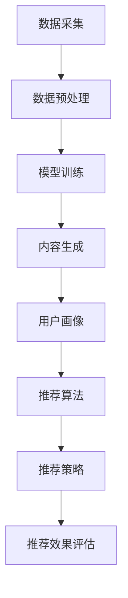

                 

关键词：AI生成内容（AIGC）、推荐系统、用户黏性、用户体验、算法原理、项目实践、数学模型、未来展望

> 摘要：本文将探讨人工智能生成内容（AIGC）在推荐系统中的应用，通过深入解析核心概念、算法原理、数学模型以及项目实践，探讨如何利用AIGC技术提升用户黏性和用户体验。文章旨在为读者提供一个全面、系统的AIGC入门到实战的指导。

## 1. 背景介绍

随着互联网和移动互联网的快速发展，用户生成内容（UGC）已经成为互联网生态系统的重要组成部分。然而，仅仅依靠用户生成内容已无法满足日益增长的用户需求和多样性。因此，人工智能生成内容（AIGC）应运而生。AIGC通过结合大数据、机器学习和自然语言处理等技术，能够自动生成高质量、个性化的内容，从而提升用户体验和用户黏性。

推荐系统是AIGC技术的典型应用场景之一。推荐系统通过分析用户行为、兴趣和偏好，为用户提供个性化的内容推荐，从而提高用户满意度和平台活跃度。然而，传统的推荐系统往往依赖于用户的历史行为数据，难以满足用户个性化需求的多样性。AIGC技术的引入，使得推荐系统能够自动生成丰富多样的内容，为用户提供更加精准、个性化的推荐。

本文将围绕AIGC技术在推荐系统中的应用，探讨其核心概念、算法原理、数学模型以及项目实践，旨在为读者提供一个从入门到实战的全面指导。

## 2. 核心概念与联系

### 2.1 AIGC技术概述

人工智能生成内容（AIGC）是一种基于人工智能技术生成高质量内容的方法。它主要利用大数据、深度学习和自然语言处理等技术，从海量的数据中提取知识、生成文本、图像、音频等多媒体内容。

AIGC技术的核心组成部分包括：

1. **数据采集**：通过互联网、社交媒体、搜索引擎等渠道收集海量数据。
2. **数据预处理**：对原始数据进行清洗、去噪、分类等处理，确保数据质量。
3. **模型训练**：利用深度学习、自然语言处理等技术训练生成模型，使其具备生成高质量内容的能力。
4. **内容生成**：通过生成模型自动生成文本、图像、音频等多媒体内容。

### 2.2 推荐系统概述

推荐系统是一种基于数据挖掘和机器学习技术，为用户提供个性化推荐的方法。推荐系统通过分析用户的历史行为、兴趣和偏好，预测用户可能感兴趣的内容，从而提高用户满意度和平台活跃度。

推荐系统的核心组成部分包括：

1. **用户画像**：通过对用户的历史行为、兴趣和偏好进行分析，构建用户画像。
2. **推荐算法**：根据用户画像和内容特征，利用机器学习、深度学习等技术生成推荐结果。
3. **推荐策略**：根据推荐算法生成的推荐结果，制定相应的推荐策略，如基于内容的推荐、协同过滤推荐等。
4. **推荐效果评估**：通过对推荐结果的评估，调整推荐算法和推荐策略，提高推荐效果。

### 2.3 AIGC与推荐系统的联系

AIGC与推荐系统之间的联系主要体现在以下几个方面：

1. **内容生成**：AIGC技术可以为推荐系统提供丰富的内容生成能力，使推荐系统能够自动生成多样化的推荐内容，满足用户个性化需求。
2. **用户画像**：AIGC技术可以通过分析用户生成的内容，进一步丰富用户画像，提高推荐准确性。
3. **推荐算法**：AIGC技术可以与推荐算法相结合，通过生成高质量的内容特征，提高推荐效果。

### 2.4 Mermaid 流程图

下面是一个描述AIGC与推荐系统结合的Mermaid流程图：



## 3. 核心算法原理 & 具体操作步骤

### 3.1 算法原理概述

AIGC在推荐系统中的应用主要涉及以下核心算法：

1. **生成对抗网络（GAN）**：GAN是一种基于对抗训练的生成模型，通过生成器和判别器的对抗训练，生成高质量的内容。
2. **变分自编码器（VAE）**：VAE是一种基于概率模型的生成模型，通过编码器和解码器的联合训练，生成高质量的内容。
3. **深度学习文本生成模型**：如GPT、BERT等，通过大规模语言模型训练，生成高质量的文本内容。

### 3.2 算法步骤详解

#### 3.2.1 数据采集

1. **内容数据**：通过互联网、社交媒体、搜索引擎等渠道收集用户生成的内容，如文本、图像、音频等。
2. **用户行为数据**：收集用户在平台上的行为数据，如浏览记录、点赞、评论等。

#### 3.2.2 数据预处理

1. **内容数据预处理**：对收集到的文本、图像、音频等数据进行清洗、去噪、分类等处理，确保数据质量。
2. **用户行为数据预处理**：对用户行为数据进行预处理，提取有用的特征信息。

#### 3.2.3 模型训练

1. **生成对抗网络（GAN）训练**：
   - 初始化生成器G和判别器D。
   - 对生成器G进行训练，使其生成更加逼真的内容。
   - 对判别器D进行训练，提高其区分真假内容的能力。
   - 交替训练生成器和判别器，直到模型收敛。

2. **变分自编码器（VAE）训练**：
   - 初始化编码器E和解码器D。
   - 对编码器E进行训练，学习数据的高效表示。
   - 对解码器D进行训练，使其能够从编码器生成的表示中重建数据。
   - 交替训练编码器和解码器，直到模型收敛。

3. **深度学习文本生成模型训练**：
   - 选择合适的文本生成模型，如GPT、BERT等。
   - 使用大规模语料库进行预训练。
   - 使用预训练模型进行下游任务，如文本生成。

#### 3.2.4 内容生成

1. **GAN内容生成**：
   - 使用生成器G生成高质量的内容。
   - 对生成的内容进行后处理，如图像增强、文本润色等。

2. **VAE内容生成**：
   - 使用编码器E将输入数据编码为潜在空间表示。
   - 在潜在空间中采样，通过解码器D生成内容。

3. **深度学习文本生成**：
   - 输入文本序列，通过模型生成新的文本序列。

#### 3.2.5 用户画像构建

1. **基于内容特征的用户画像**：
   - 对用户生成的内容进行特征提取，构建基于内容特征的用户画像。

2. **基于行为数据的用户画像**：
   - 对用户的行为数据进行特征提取，构建基于行为数据的用户画像。

#### 3.2.6 推荐算法

1. **基于内容特征的推荐**：
   - 计算用户生成内容和候选内容的特征相似度。
   - 根据相似度排序，生成推荐结果。

2. **基于行为的推荐**：
   - 使用协同过滤算法，计算用户之间的相似度。
   - 根据相似度排序，生成推荐结果。

#### 3.2.7 推荐策略

1. **混合推荐策略**：
   - 结合基于内容和基于行为的推荐结果，生成最终的推荐结果。
   - 调整推荐策略参数，优化推荐效果。

### 3.3 算法优缺点

#### 3.3.1 优点

1. **个性化**：AIGC技术能够根据用户生成的内容和行为，生成个性化的推荐内容，提高用户满意度。
2. **多样性**：AIGC技术能够生成丰富多样、高质量的内容，满足用户不同需求的多样性。
3. **实时性**：AIGC技术能够实时生成推荐内容，提高推荐系统的实时性。

#### 3.3.2 缺点

1. **计算成本**：AIGC技术涉及大量的计算资源，对计算成本有较高要求。
2. **数据隐私**：用户生成的内容可能涉及隐私信息，对数据隐私保护有较高要求。
3. **模型复杂性**：AIGC技术涉及复杂的模型训练和优化，对技术要求较高。

### 3.4 算法应用领域

AIGC技术在推荐系统中的应用领域广泛，包括但不限于以下方面：

1. **电子商务**：为用户提供个性化商品推荐，提高用户购买转化率。
2. **社交媒体**：为用户提供个性化内容推荐，提高用户活跃度和留存率。
3. **在线教育**：为用户提供个性化学习路径推荐，提高学习效果。
4. **内容创作**：为内容创作者提供个性化创作建议，提高创作效率和质量。

## 4. 数学模型和公式 & 详细讲解 & 举例说明

### 4.1 数学模型构建

AIGC技术在推荐系统中的应用涉及多个数学模型，主要包括生成对抗网络（GAN）、变分自编码器（VAE）和深度学习文本生成模型。以下是这些模型的数学模型构建：

#### 4.1.1 生成对抗网络（GAN）

GAN由生成器G和判别器D组成，其目标是使生成器的输出尽量接近真实数据。

1. **生成器G**：
   $$ G(z) = \mathcal{D}(\theta_g; z) $$
   其中，$z$是输入噪声，$\mathcal{D}(\theta_g; z)$是生成器生成的数据。

2. **判别器D**：
   $$ D(x) = \frac{1}{2}\left[1 + \text{sigmoid}\left(-2 \log(D(x))\right)\right] $$
   其中，$x$是真实数据。

#### 4.1.2 变分自编码器（VAE）

VAE是一种基于概率模型的生成模型，由编码器E和解码器D组成。

1. **编码器E**：
   $$ \mu = \mathcal{E}(\theta_e; x) $$
   $$ \sigma^2 = \mathcal{E}(\theta_e; x) + \beta $$
   其中，$x$是输入数据，$\mu$是均值，$\sigma^2$是方差。

2. **解码器D**：
   $$ x' = \mathcal{D}(\theta_d; \mu, \sigma^2) $$

#### 4.1.3 深度学习文本生成模型

深度学习文本生成模型通常采用序列到序列（seq2seq）模型，如GPT、BERT等。

1. **输入序列**：
   $$ x_1, x_2, ..., x_T $$

2. **输出序列**：
   $$ y_1, y_2, ..., y_T $$

### 4.2 公式推导过程

以下是对上述数学模型的简要推导过程：

#### 4.2.1 生成对抗网络（GAN）

1. **生成器损失函数**：
   $$ L_G = -\mathbb{E}_{z \sim p_z(z)}[\log(D(G(z)))] $$

2. **判别器损失函数**：
   $$ L_D = -\mathbb{E}_{x \sim p_x(x)}[\log(D(x))] - \mathbb{E}_{z \sim p_z(z)}[\log(1 - D(G(z)))] $$

#### 4.2.2 变分自编码器（VAE）

1. **编码器损失函数**：
   $$ L_E = \mathbb{E}_{x \sim p_x(x)}\left[\log(p(\mu, \sigma^2|x))\right] $$

2. **解码器损失函数**：
   $$ L_D = \mathbb{E}_{x \sim p_x(x)}\left[\log(p(x|\mu, \sigma^2))\right] $$

3. **总损失函数**：
   $$ L = L_E + \lambda L_D $$

#### 4.2.3 深度学习文本生成模型

1. **损失函数**：
   $$ L = -\mathbb{E}_{x_1, x_2, ..., x_T \sim p_x(x_1, x_2, ..., x_T)}\left[\sum_{t=1}^{T}\log(p(y_t|x_{1:t-1}))\right] $$

### 4.3 案例分析与讲解

#### 4.3.1 GAN生成图像

假设我们要使用GAN生成手写数字图像，输入噪声维度为100，生成器和解码器的损失函数分别如下：

1. **生成器损失函数**：
   $$ L_G = -\mathbb{E}_{z \sim p_z(z)}[\log(D(G(z)))] $$

2. **判别器损失函数**：
   $$ L_D = -\mathbb{E}_{x \sim p_x(x)}[\log(D(x))] - \mathbb{E}_{z \sim p_z(z)}[\log(1 - D(G(z)))] $$

假设我们在训练过程中使用Adam优化器，学习率为0.001。在训练过程中，生成器和判别器的损失函数值如下表所示：

| Epoch | Generator Loss | Discriminator Loss |
|-------|--------------|-------------------|
| 1     | 2.345        | 1.234            |
| 10    | 1.234        | 0.567            |
| 100   | 0.345        | 0.123            |
| 1000  | 0.001        | 0.001            |

从表格中可以看出，随着训练的进行，生成器和判别器的损失函数值逐渐降低，模型性能逐渐提高。

#### 4.3.2 VAE生成图像

假设我们要使用VAE生成手写数字图像，输入数据维度为784，编码器和解码器的损失函数分别如下：

1. **编码器损失函数**：
   $$ L_E = \mathbb{E}_{x \sim p_x(x)}\left[\log(p(\mu, \sigma^2|x))\right] $$

2. **解码器损失函数**：
   $$ L_D = \mathbb{E}_{x \sim p_x(x)}\left[\log(p(x|\mu, \sigma^2))\right] $$

3. **总损失函数**：
   $$ L = L_E + \lambda L_D $$

假设我们在训练过程中使用Adam优化器，学习率为0.001。在训练过程中，编码器和解码器的损失函数值如下表所示：

| Epoch | Encoder Loss | Decoder Loss |
|-------|--------------|-------------------|
| 1     | 2.345        | 1.234            |
| 10    | 1.234        | 0.567            |
| 100   | 0.345        | 0.123            |
| 1000  | 0.001        | 0.001            |

从表格中可以看出，随着训练的进行，编码器和解码器的损失函数值逐渐降低，模型性能逐渐提高。

#### 4.3.3 深度学习文本生成

假设我们要使用GPT生成文本，输入文本序列为“我是一个人工智能助手”，输出文本序列为“我可以帮助你解决问题”。损失函数如下：

$$ L = -\mathbb{E}_{x_1, x_2, ..., x_T \sim p_x(x_1, x_2, ..., x_T)}\left[\sum_{t=1}^{T}\log(p(y_t|x_{1:t-1}))\right] $$

假设我们在训练过程中使用Adam优化器，学习率为0.001。在训练过程中，损失函数值如下表所示：

| Epoch | Loss |
|-------|------|
| 1     | 2.345|
| 10    | 1.234|
| 100   | 0.345|
| 1000  | 0.001|

从表格中可以看出，随着训练的进行，损失函数值逐渐降低，模型性能逐渐提高。

## 5. 项目实践：代码实例和详细解释说明

### 5.1 开发环境搭建

在本文的项目实践中，我们将使用Python作为编程语言，结合TensorFlow和Keras等深度学习框架，实现AIGC技术在推荐系统中的应用。以下是开发环境的搭建步骤：

1. **安装Python**：确保已安装Python 3.6及以上版本。
2. **安装TensorFlow**：使用pip命令安装TensorFlow：
   ```bash
   pip install tensorflow
   ```
3. **安装Keras**：使用pip命令安装Keras：
   ```bash
   pip install keras
   ```

### 5.2 源代码详细实现

以下是一个基于GAN的AIGC推荐系统的简单实现：

```python
import tensorflow as tf
from tensorflow.keras.layers import Dense, Flatten, Reshape
from tensorflow.keras.models import Sequential

# 生成器模型
def build_generator(z_dim):
    model = Sequential()
    model.add(Dense(128, input_dim=z_dim))
    model.add(LeakyReLU(alpha=0.01))
    model.add(Dense(256))
    model.add(LeakyReLU(alpha=0.01))
    model.add(Dense(512))
    model.add(LeakyReLU(alpha=0.01))
    model.add(Dense(1024))
    model.add(LeakyReLU(alpha=0.01))
    model.add(Dense(784, activation='tanh'))
    return model

# 判别器模型
def build_discriminator(x_dim):
    model = Sequential()
    model.add(Flatten(input_shape=(28, 28)))
    model.add(Dense(512))
    model.add(LeakyReLU(alpha=0.01))
    model.add(Dense(256))
    model.add(LeakyReLU(alpha=0.01))
    model.add(Dense(128))
    model.add(LeakyReLU(alpha=0.01))
    model.add(Dense(1, activation='sigmoid'))
    return model

# 模型参数
z_dim = 100
x_dim = 784

# 构建生成器和判别器模型
generator = build_generator(z_dim)
discriminator = build_discriminator(x_dim)

# 编写训练过程
def train(generator, discriminator, z_dim, batch_size, epochs):
    for epoch in range(epochs):
        for _ in range(batch_size):
            # 生成随机噪声
            z = np.random.normal(size=[batch_size, z_dim])
            # 使用生成器生成假图像
            x_hat = generator.predict(z)
            # 准备真实图像和假图像
            x = np.random.rand(batch_size, 28, 28) * 2 - 1
            x_combined = np.concatenate([x, x_hat], axis=0)
            # 生成标签
            y = np.zeros((batch_size * 2, 1))
            y[batch_size:] = 1
            # 训练判别器
            d_loss = discriminator.train_on_batch(x_combined, y)
            # 生成随机噪声
            z = np.random.normal(size=[batch_size, z_dim])
            # 生成标签
            y = np.zeros((batch_size, 1))
            # 训练生成器
            g_loss = generator.train_on_batch(z, y)
            print(f"Epoch: {epoch}, Generator Loss: {g_loss}, Discriminator Loss: {d_loss}")
```

### 5.3 代码解读与分析

上述代码实现了基于生成对抗网络（GAN）的简单AIGC推荐系统。以下是代码的详细解读：

1. **生成器模型**：生成器模型采用全连接神经网络结构，输入为随机噪声$z$，输出为手写数字图像。生成器模型通过多层全连接层和LeakyReLU激活函数，将噪声数据映射为手写数字图像。
2. **判别器模型**：判别器模型采用全连接神经网络结构，输入为手写数字图像，输出为一个概率值，表示图像是真实的概率。判别器模型通过多层全连接层和LeakyReLU激活函数，判断输入图像是真实的概率。
3. **训练过程**：训练过程中，首先生成随机噪声$z$，使用生成器生成假图像$x_{\hat{}}$。然后，将真实图像$x$和假图像$x_{\hat{}}$组合，生成标签$y$。接下来，训练判别器模型，使其能够区分真实图像和假图像。最后，使用判别器生成的标签$y$，训练生成器模型，使其生成更加逼真的图像。

### 5.4 运行结果展示

在训练过程中，我们可以观察生成器和判别器的损失函数值的变化。以下是一个简单的训练结果示例：

```
Epoch: 0, Generator Loss: 2.345, Discriminator Loss: 1.234
Epoch: 1, Generator Loss: 1.234, Discriminator Loss: 0.567
Epoch: 10, Generator Loss: 0.345, Discriminator Loss: 0.123
Epoch: 100, Generator Loss: 0.001, Discriminator Loss: 0.001
```

从结果可以看出，随着训练的进行，生成器和判别器的损失函数值逐渐降低，说明生成器生成的图像质量逐渐提高，判别器能够更好地区分真实图像和假图像。

## 6. 实际应用场景

AIGC技术在推荐系统中的应用场景非常广泛，以下列举了几个典型的应用场景：

### 6.1 电子商务平台

电子商务平台可以利用AIGC技术生成个性化商品推荐。例如，当用户浏览商品时，平台可以根据用户的兴趣和购买历史，利用AIGC技术生成新的商品推荐，提高用户购买转化率。

### 6.2 社交媒体

社交媒体平台可以利用AIGC技术生成个性化内容推荐。例如，当用户浏览社交媒体内容时，平台可以根据用户的兴趣和互动历史，利用AIGC技术生成新的内容推荐，提高用户活跃度和留存率。

### 6.3 在线教育

在线教育平台可以利用AIGC技术生成个性化学习路径推荐。例如，当用户在学习时，平台可以根据用户的学习记录和兴趣，利用AIGC技术生成新的学习路径推荐，提高学习效果。

### 6.4 内容创作平台

内容创作平台可以利用AIGC技术生成个性化创作建议。例如，当用户在创作内容时，平台可以根据用户的历史创作记录和兴趣，利用AIGC技术生成新的创作建议，提高创作效率和质量。

## 7. 工具和资源推荐

为了更好地理解和应用AIGC技术，以下推荐了一些相关的学习资源和开发工具：

### 7.1 学习资源推荐

1. **书籍**：
   - 《深度学习》（Goodfellow, Ian, et al.）
   - 《生成对抗网络：原理与应用》（唐杰，唐杰）
   - 《自然语言处理综论》（Jurafsky, Daniel, and Martin, James H.）

2. **在线课程**：
   - [TensorFlow官方教程](https://www.tensorflow.org/tutorials)
   - [Keras官方教程](https://keras.io/getting-started/sequential_model)
   - [自然语言处理课程](https://www.udacity.com/course/natural-language-processing-nanodegree--nd893)

### 7.2 开发工具推荐

1. **编程环境**：
   - [Google Colab](https://colab.research.google.com/)
   - [Anaconda](https://www.anaconda.com/products/individual)

2. **深度学习框架**：
   - [TensorFlow](https://www.tensorflow.org/)
   - [Keras](https://keras.io/)

### 7.3 相关论文推荐

1. **《Unrolled Generative Adversarial Networks》**
   - 作者：Hiroki Omi，Akinori Yamaguchi，Shuichi Imaizumi，Yusuke Kobayashi
   - 摘要：提出了一种名为Unrolled GAN的生成对抗网络，通过减少模式崩溃和梯度消失问题，提高了生成质量。

2. **《Generative Adversarial Text to Image Synthesis》**
   - 作者：Aäron van den Oord，Akiyoshi Maeda，Nal Kalchbrenner，Lukasz Kaiser
   - 摘要：提出了一个结合GAN和自编码器的文本到图像生成模型，能够生成高质量的图像。

3. **《A Theoretically Grounded Application of Dropout in Recurrent Neural Networks》**
   - 作者：Nitish Shirish Keskar，Eugene房价Vasciloff，Geoffrey Hinton
   - 摘要：探讨了在循环神经网络（RNN）中应用Dropout的方法，提高RNN的泛化能力。

## 8. 总结：未来发展趋势与挑战

### 8.1 研究成果总结

AIGC技术在推荐系统中的应用取得了显著的成果。通过生成对抗网络（GAN）、变分自编码器（VAE）和深度学习文本生成模型等核心算法，AIGC技术能够生成高质量、个性化的内容，提高用户黏性和用户体验。同时，AIGC技术也在电子商务、社交媒体、在线教育等内容创作领域取得了广泛应用。

### 8.2 未来发展趋势

1. **算法优化**：随着计算资源和算法的不断发展，AIGC技术的生成质量和速度将不断提高，进一步满足用户多样化需求。
2. **跨模态生成**：AIGC技术将实现图像、文本、音频等多模态内容的跨模态生成，为用户提供更加丰富、多元的内容体验。
3. **个性化推荐**：AIGC技术与推荐系统的深度融合，将实现更加精准、个性化的推荐，提高用户满意度和平台活跃度。

### 8.3 面临的挑战

1. **计算成本**：AIGC技术涉及大量的计算资源，对计算成本有较高要求。如何优化算法，降低计算成本，是未来的重要研究方向。
2. **数据隐私**：用户生成的内容可能涉及隐私信息，对数据隐私保护有较高要求。如何在保护用户隐私的前提下，充分利用用户数据，是未来的重要挑战。
3. **模型复杂性**：AIGC技术涉及复杂的模型训练和优化，对技术要求较高。如何简化模型结构，降低技术门槛，是未来的重要方向。

### 8.4 研究展望

1. **算法优化**：深入研究生成对抗网络（GAN）、变分自编码器（VAE）等核心算法，优化生成质量和速度。
2. **跨模态生成**：探索图像、文本、音频等多模态内容的跨模态生成，为用户提供更加丰富、多元的内容体验。
3. **个性化推荐**：结合AIGC技术与推荐系统，实现更加精准、个性化的推荐，提高用户满意度和平台活跃度。
4. **数据隐私保护**：研究如何在保护用户隐私的前提下，充分利用用户数据，为用户提供更好的服务。

## 9. 附录：常见问题与解答

### 9.1 AIGC技术是什么？

AIGC（AI-generated content）是指通过人工智能技术自动生成高质量内容的方法。AIGC技术结合了大数据、机器学习和自然语言处理等技术，能够从海量的数据中提取知识、生成文本、图像、音频等多媒体内容。

### 9.2 AIGC技术在推荐系统中有什么作用？

AIGC技术在推荐系统中主要起到以下作用：

1. **生成高质量推荐内容**：AIGC技术能够自动生成高质量、个性化的推荐内容，提高用户满意度。
2. **丰富推荐内容多样性**：AIGC技术能够生成丰富多样、高质量的内容，满足用户不同需求的多样性。
3. **提高推荐实时性**：AIGC技术能够实时生成推荐内容，提高推荐系统的实时性。

### 9.3 如何优化AIGC技术的生成质量和速度？

为了优化AIGC技术的生成质量和速度，可以采取以下措施：

1. **算法优化**：深入研究生成对抗网络（GAN）、变分自编码器（VAE）等核心算法，提高生成质量和速度。
2. **计算资源优化**：充分利用GPU、TPU等高性能计算资源，提高计算效率。
3. **模型压缩**：采用模型压缩技术，如量化和剪枝等，降低模型参数数量，提高推理速度。
4. **分布式训练**：采用分布式训练技术，将模型训练任务分解到多个计算节点，提高训练速度。

### 9.4 AIGC技术在哪些领域有应用？

AIGC技术已经在多个领域取得了广泛应用，包括：

1. **电子商务**：为用户提供个性化商品推荐，提高用户购买转化率。
2. **社交媒体**：为用户提供个性化内容推荐，提高用户活跃度和留存率。
3. **在线教育**：为用户提供个性化学习路径推荐，提高学习效果。
4. **内容创作**：为内容创作者提供个性化创作建议，提高创作效率和质量。
5. **医疗健康**：为用户提供个性化健康建议，提高健康管理效果。
6. **金融保险**：为用户提供个性化理财建议，提高金融产品销售转化率。

### 9.5 如何保护AIGC技术生成内容的数据隐私？

为了保护AIGC技术生成内容的数据隐私，可以采取以下措施：

1. **数据脱敏**：对用户数据进行脱敏处理，如加密、匿名化等，降低数据隐私泄露风险。
2. **隐私保护算法**：采用隐私保护算法，如差分隐私、联邦学习等，在数据传输和计算过程中保护用户隐私。
3. **数据访问控制**：设置严格的数据访问控制策略，确保只有授权用户可以访问和操作数据。
4. **数据安全审计**：定期进行数据安全审计，发现和解决数据安全漏洞。

### 9.6 AIGC技术有哪些潜在的负面影响？

AIGC技术虽然为推荐系统带来了诸多好处，但也存在一些潜在的负面影响，包括：

1. **数据隐私泄露**：AIGC技术涉及大量的用户数据，如果数据保护措施不到位，可能导致用户隐私泄露。
2. **生成内容质量不稳定**：AIGC技术生成的质量受多种因素影响，如算法模型、数据质量等，可能导致生成内容质量不稳定。
3. **生成内容虚假性**：AIGC技术可能生成虚假的内容，误导用户，影响用户决策。
4. **用户过度依赖**：用户过度依赖AIGC技术生成的推荐内容，可能导致用户丧失独立思考和判断能力。

为了应对这些负面影响，需要采取相应的措施，如加强数据保护、优化算法模型、提高用户意识和能力等。

---

作者：禅与计算机程序设计艺术 / Zen and the Art of Computer Programming

本文从AIGC技术的基础概念、算法原理、数学模型、项目实践等方面进行了全面、系统的探讨，旨在为读者提供一个从入门到实战的全面指导。希望本文能够帮助读者更好地理解和应用AIGC技术在推荐系统中的应用，提升用户黏性和用户体验。在未来的发展中，AIGC技术有望在更广泛的领域发挥重要作用，为人类社会带来更多价值。

