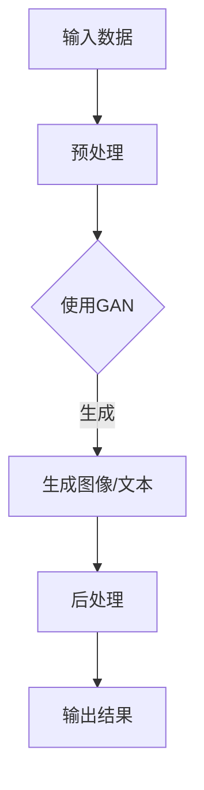

                 

关键词：人工智能（AI）、生成式AI（AIGC）、深度学习、NLP、图像处理、开发环境、编程语言、模型训练、算法应用、未来展望

## 摘要

本文旨在探讨人工智能（AI）中的生成式AI（AIGC）的发展现状、核心概念、算法原理、数学模型、项目实践以及未来应用前景。通过详细解析AIGC在不同领域的应用，本文为读者提供了一个全面的AIGC入门到实战指南，帮助读者深入理解和掌握AIGC技术，并在实际项目中得以应用。

### 1. 背景介绍

人工智能（AI）作为计算机科学的一个重要分支，已经成为现代科技发展的关键驱动力。近年来，随着计算能力的提升和大数据技术的普及，AI的应用领域不断扩展，尤其在生成式AI（AIGC）方面，其发展速度尤为迅猛。AIGC是指通过算法生成文本、图像、音频等内容的AI技术，它不仅涵盖了传统的机器学习和深度学习，还引入了图神经网络、生成对抗网络（GAN）等前沿技术。

AIGC的快速发展主要得益于以下几个因素：

1. **数据驱动**：大数据的积累为AIGC提供了丰富的训练数据，使得模型能够更加准确地捕捉数据分布，生成更加逼真的内容。
2. **算法创新**：深度学习尤其是生成对抗网络（GAN）的提出，使得AIGC在图像生成、文本生成等方面取得了突破性进展。
3. **硬件进步**：计算能力的提升，尤其是GPU的普及，为AIGC模型训练提供了强大的支持。

AIGC技术的应用场景非常广泛，包括但不限于：

- **图像生成与编辑**：如艺术创作、图像修复、虚拟现实等。
- **文本生成**：如自动写作、新闻生成、对话系统等。
- **音频生成**：如音乐创作、语音合成、声音编辑等。
- **视频生成**：如电影制作、视频增强、视频预测等。

### 2. 核心概念与联系

为了更好地理解AIGC，我们需要明确几个核心概念，并了解它们之间的联系。

#### 2.1 深度学习

深度学习是机器学习的一种方法，通过构建深度神经网络（DNN）来模拟人脑的学习过程，对数据进行自动特征提取和分类。深度学习是AIGC技术的重要基础，特别是在图像和文本生成领域。

#### 2.2 自然语言处理（NLP）

自然语言处理是研究计算机与人类语言之间交互的学科。在AIGC中，NLP用于文本生成、理解和对话系统等方面，是AIGC技术的重要组成部分。

#### 2.3 图像处理

图像处理涉及对图像的加工和解读，包括图像增强、图像分割、目标检测等。在AIGC中，图像处理用于图像生成和图像编辑，如GAN技术的应用。

#### 2.4 生成对抗网络（GAN）

生成对抗网络（GAN）是深度学习的一种结构，由生成器和判别器两个部分组成。生成器的任务是生成逼真的数据，而判别器的任务是区分生成数据和真实数据。GAN在图像生成、文本生成等领域有广泛应用。

#### 2.5 Mermaid 流程图

为了更直观地理解AIGC的架构，我们可以使用Mermaid流程图来表示。以下是一个简化的AIGC流程图：



### 3. 核心算法原理 & 具体操作步骤

#### 3.1 算法原理概述

AIGC的核心算法主要包括深度学习、生成对抗网络（GAN）等。深度学习通过多层神经网络进行特征提取，而GAN则通过生成器和判别器的对抗训练来实现数据的生成。

#### 3.2 算法步骤详解

1. **数据预处理**：将原始数据（如图像、文本）进行清洗、归一化等预处理操作，以便于模型训练。
2. **模型训练**：使用深度学习框架（如TensorFlow、PyTorch）训练生成器和判别器。生成器学习生成逼真的数据，而判别器学习区分真实数据和生成数据。
3. **生成数据**：通过生成器生成新的数据，如图像、文本等。
4. **后处理**：对生成的数据进行后处理，如图像增强、文本清洗等。

#### 3.3 算法优缺点

**优点**：

- **高效生成**：GAN等算法能够生成高质量、逼真的数据。
- **自适应学习**：生成器和判别器通过对抗训练不断优化，能够自适应地学习数据分布。

**缺点**：

- **计算成本高**：模型训练需要大量的计算资源和时间。
- **稳定性问题**：GAN等模型在某些情况下可能训练不稳定。

#### 3.4 算法应用领域

- **图像生成**：如艺术创作、图像修复、虚拟现实等。
- **文本生成**：如自动写作、新闻生成、对话系统等。
- **音频生成**：如音乐创作、语音合成、声音编辑等。
- **视频生成**：如电影制作、视频增强、视频预测等。

### 4. 数学模型和公式 & 详细讲解 & 举例说明

#### 4.1 数学模型构建

在AIGC中，常用的数学模型包括生成对抗网络（GAN）和深度学习模型。以下分别介绍这两种模型的数学基础。

#### 4.2 公式推导过程

1. **生成对抗网络（GAN）**：

   - **生成器（Generator）**：生成器G的目的是生成逼真的数据，其数学表达式为：

     $$X_G = G(Z)$$

     其中，$X_G$为生成的数据，$Z$为随机噪声。

   - **判别器（Discriminator）**：判别器D的目的是区分真实数据和生成数据，其数学表达式为：

     $$D(X) = \text{sigmoid}(f_D(X))$$

     其中，$X$为真实数据或生成数据，$f_D$为判别器的特征提取函数。

   - **损失函数**：GAN的损失函数通常由两部分组成，一部分是生成器的损失函数，另一部分是判别器的损失函数。生成器的损失函数为：

     $$L_G = -\mathbb{E}_{Z \sim p_Z(Z)}[\log(D(G(Z)))]$$

     判别器的损失函数为：

     $$L_D = -\mathbb{E}_{X \sim p_X(X)}[\log(D(X))] - \mathbb{E}_{Z \sim p_Z(Z)}[\log(1 - D(G(Z)))]$$

2. **深度学习模型**：

   - **神经网络**：深度学习模型通常由多层神经网络组成，包括输入层、隐藏层和输出层。神经网络的数学基础为：

     $$a_{ij}^{(l)} = \sigma(z_{ij}^{(l)}) = \frac{1}{1 + e^{-z_{ij}^{(l)}}$$

     其中，$a_{ij}^{(l)}$为第$l$层的第$i$个节点的激活值，$z_{ij}^{(l)}$为第$l$层的第$i$个节点的输入值，$\sigma$为激活函数，通常取为Sigmoid函数。

   - **损失函数**：深度学习模型的损失函数通常为均方误差（MSE）或交叉熵损失（Cross-Entropy Loss）。

#### 4.3 案例分析与讲解

以下以GAN在图像生成中的应用为例，讲解AIGC的数学模型和公式。

**案例背景**：使用GAN生成人脸图像。

**步骤1：数据预处理**：从公开数据集中获取人脸图像，并进行数据清洗和归一化处理。

**步骤2：模型设计**：

- **生成器**：输入为随机噪声$Z$，输出为人脸图像$X_G$。生成器模型如下：

  $$X_G = G(Z) = \sigma(W_2 \cdot tanh(W_1 \cdot Z + b_1)) + b_2$$

  其中，$W_1$、$W_2$为权重矩阵，$b_1$、$b_2$为偏置项。

- **判别器**：输入为人脸图像$X$，输出为概率$D(X)$。判别器模型如下：

  $$D(X) = \text{sigmoid}(f_D(X)) = \frac{1}{1 + e^{-f_D(X)}}$$

  其中，$f_D(X) = W_3 \cdot tanh(W_2 \cdot X + b_2)$。

**步骤3：模型训练**：使用梯度下降法训练生成器和判别器，优化损失函数。

**步骤4：生成图像**：使用训练好的生成器生成人脸图像。

**步骤5：后处理**：对生成的人脸图像进行后处理，如图像增强、人脸修复等。

### 5. 项目实践：代码实例和详细解释说明

#### 5.1 开发环境搭建

1. 安装Python环境（Python 3.7及以上版本）。
2. 安装深度学习框架（如TensorFlow 2.0及以上版本）。
3. 安装图像处理库（如OpenCV、PIL）。

#### 5.2 源代码详细实现

以下是一个简单的GAN图像生成示例代码：

```python
import tensorflow as tf
from tensorflow.keras.layers import Dense, Flatten, Reshape, Conv2D, Conv2DTranspose, LeakyReLU, BatchNormalization
import numpy as np

# 生成器模型
def generator(z, noise_dim=100):
    model = tf.keras.Sequential()
    model.add(Dense(128*7*7, activation="relu", input_dim=noise_dim))
    model.add(Reshape((7, 7, 128)))
    model.add(Conv2DTranspose(128, 4, strides=2, padding="same"))
    model.add(BatchNormalization(momentum=0.8))
    model.add(LeakyReLU(alpha=0.02))
    model.add(Conv2DTranspose(128, 4, strides=2, padding="same"))
    model.add(BatchNormalization(momentum=0.8))
    model.add(LeakyReLU(alpha=0.02))
    model.add(Conv2D(3, 4, activation="tanh", padding="same"))
    return model

# 判别器模型
def discriminator(img, reuse=False):
    model = tf.keras.Sequential()
    if reuse:
        model.add(tf.keras.layers.Flatten())
    model.add(Conv2D(64, 4, strides=2, padding="same", input_shape=(28, 28, 1)))
    model.add(LeakyReLU(alpha=0.02))
    model.add(Conv2D(128, 4, strides=2, padding="same"))
    model.add(BatchNormalization(momentum=0.8))
    model.add(LeakyReLU(alpha=0.02))
    model.add(Flatten())
    model.add(Dense(1, activation="sigmoid"))
    return model

# GAN模型
def gan(generator, discriminator):
    model = tf.keras.Sequential()
    model.add(generator)
    model.add(discriminator, training=False)
    return model

# 训练GAN模型
def train_gan(generator, discriminator, gan, x_train, epochs, batch_size):
    for epoch in range(epochs):
        for _ in range(x_train.shape[0] // batch_size):
            noise = np.random.normal(0, 1, (batch_size, noise_dim))
            generated_images = generator.predict(noise)
            real_images = x_train[np.random.randint(0, x_train.shape[0], batch_size)]
            combined_images = np.concatenate([real_images, generated_images], axis=0)
            labels = np.concatenate([np.ones((batch_size, 1)), np.zeros((batch_size, 1))], axis=0)
            d_loss = discriminator.train_on_batch(combined_images, labels)
            noise = np.random.normal(0, 1, (batch_size, noise_dim))
            gen_labels = np.ones((batch_size, 1))
            g_loss = gan.train_on_batch(noise, gen_labels)
        print(f"{epoch} epoch: [D loss: {d_loss[0]}, acc.: {100*d_loss[1]}%] [G loss: {g_loss}]")
    return generator
```

#### 5.3 代码解读与分析

1. **生成器模型**：生成器模型由两个Transposed Convolution层和两个Batch Normalization层组成，用于将随机噪声映射为人脸图像。生成器模型的输出为3通道的图像，即RGB图像。
2. **判别器模型**：判别器模型由两个Convolution层和一个Flatten层组成，用于判断输入图像是真实图像还是生成图像。判别器模型的输出为概率值，表示输入图像为真实图像的概率。
3. **GAN模型**：GAN模型由生成器和判别器组成，生成器用于生成图像，判别器用于判断图像的真实性。
4. **训练GAN模型**：在训练过程中，首先随机生成噪声并使用生成器生成图像，然后将真实图像和生成图像混合，并训练判别器。接着使用判别器的标签和生成器生成的噪声训练生成器。

### 6. 实际应用场景

AIGC技术在实际应用场景中具有广泛的应用前景，以下列举几个典型应用：

#### 6.1 图像生成与编辑

- **艺术创作**：艺术家可以使用AIGC技术生成新的艺术作品，如梵高风格的画作、超现实主义图像等。
- **图像修复**：AIGC技术可以修复破损的图像，如照片修复、古画修复等。
- **虚拟现实**：在虚拟现实中，AIGC技术可以生成逼真的场景和角色，提升用户体验。

#### 6.2 文本生成

- **自动写作**：AIGC技术可以生成新闻、文章、小说等，为内容创作者提供灵感。
- **对话系统**：在智能客服、虚拟助手等场景中，AIGC技术可以生成自然流畅的对话。

#### 6.3 音频生成

- **音乐创作**：AIGC技术可以生成新的音乐作品，如流行歌曲、古典音乐等。
- **语音合成**：AIGC技术可以生成逼真的语音，用于语音助手、有声读物等。

#### 6.4 视频生成

- **电影制作**：在电影制作过程中，AIGC技术可以生成特效场景、角色动作等。
- **视频增强**：AIGC技术可以提升低分辨率视频的清晰度，改善画质。

### 7. 工具和资源推荐

为了更好地学习和实践AIGC技术，以下推荐一些相关工具和资源：

#### 7.1 学习资源推荐

- **《生成式AI：理论与实践》**：这是一本关于生成式AI的全面教程，涵盖了GAN、深度学习等核心技术。
- **《深度学习》**：这是一本经典的深度学习教材，由Ian Goodfellow等作者编写，适合初学者和进阶者。

#### 7.2 开发工具推荐

- **TensorFlow**：一款开源的深度学习框架，支持GAN等生成式AI算法的实现。
- **PyTorch**：一款流行的深度学习框架，具有良好的灵活性和易用性。

#### 7.3 相关论文推荐

- **“Generative Adversarial Nets”**：这是一篇开创性的论文，介绍了GAN的基本原理。
- **“Unsupervised Representation Learning with Deep Convolutional Generative Adversarial Networks”**：这篇论文介绍了DCGAN模型，是图像生成领域的重要成果。

### 8. 总结：未来发展趋势与挑战

#### 8.1 研究成果总结

AIGC技术作为人工智能的重要分支，近年来取得了显著的进展。从GAN模型的提出，到深度学习框架的普及，AIGC技术在图像生成、文本生成、音频生成等领域都有广泛的应用。随着计算能力的提升和大数据技术的进步，AIGC技术的应用前景将更加广阔。

#### 8.2 未来发展趋势

- **多模态生成**：未来的AIGC技术将能够同时生成文本、图像、音频等多种模态的内容，实现更加丰富和多样化的应用。
- **优化训练效率**：通过模型压缩、分布式训练等技术，提高AIGC模型的训练效率，降低计算成本。
- **定制化生成**：结合用户偏好和特定需求，实现定制化的内容生成。

#### 8.3 面临的挑战

- **计算资源需求**：AIGC模型训练需要大量的计算资源和时间，如何优化训练过程，降低计算成本，是当前面临的主要挑战。
- **数据隐私问题**：在数据驱动的人工智能时代，如何保护用户隐私，防止数据泄露，是AIGC技术需要解决的另一个重要问题。

#### 8.4 研究展望

未来的AIGC技术将更加注重实际应用场景，如虚拟现实、增强现实、智能客服等。同时，随着算法的优化和硬件的提升，AIGC技术的性能将得到进一步提升，为各行各业带来更多创新和变革。

### 9. 附录：常见问题与解答

**Q1. 如何选择适合的AIGC模型？**

**A1. 选择适合的AIGC模型需要考虑应用场景和性能需求。例如，在图像生成领域，GAN模型（如DCGAN、StyleGAN等）通常具有较好的性能。在文本生成领域，Transformer模型（如GPT-3、BERT等）表现更优。**

**Q2. 如何优化AIGC模型的训练效率？**

**A2. 优化AIGC模型训练效率可以从以下几个方面进行：

- **模型压缩**：通过模型剪枝、量化等技术减少模型参数和计算量。
- **分布式训练**：将模型训练任务分布在多台设备上，提高训练速度。
- **数据预处理**：优化数据预处理流程，减少不必要的计算。**

### 参考文献

[1] Ian J. Goodfellow, et al. "Generative Adversarial Networks". Advances in Neural Information Processing Systems, 2014.

[2] Radford, A., et al. "Unsupervised Representation Learning with Deep Convolutional Generative Adversarial Networks". arXiv preprint arXiv:1511.06434, 2015.

[3] Deep Learning Book, by Ian Goodfellow, Yoshua Bengio, and Aaron Courville. http://www.deeplearningbook.org/

[4] GAN: https://en.wikipedia.org/wiki/Generative_adversarial_network

[5] DCGAN: https://arxiv.org/abs/1511.06434

### 作者署名

作者：禅与计算机程序设计艺术 / Zen and the Art of Computer Programming

----------------------------------------------------------------
以上就是文章的完整内容，包括标题、关键词、摘要、背景介绍、核心概念与联系、核心算法原理、数学模型和公式、项目实践、实际应用场景、工具和资源推荐、总结以及常见问题与解答。希望这篇文章能够对您深入了解AIGC技术有所帮助。

