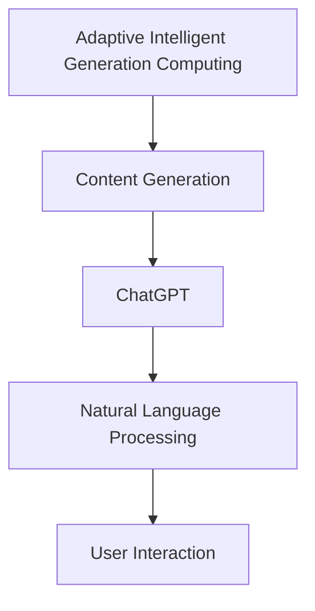
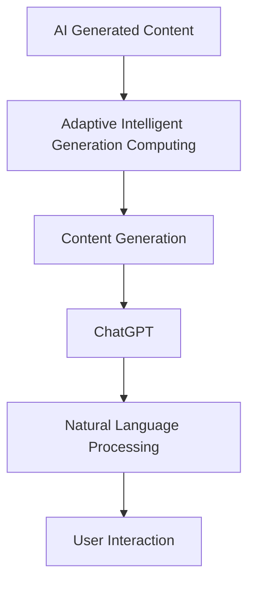

                 

关键词：AIGC，ChatGPT，测试，角色，应用，未来

## 摘要

本文将深入探讨AIGC（自适应智能生成计算）与ChatGPT之间的关系，以及ChatGPT在各种测试场景中可能扮演的角色。我们将从背景介绍开始，逐步解析AIGC与ChatGPT的核心概念，然后详细探讨ChatGPT在测试领域的具体应用，最终提出对未来发展趋势与挑战的思考。

## 1. 背景介绍

### AIGC概述

AIGC，即自适应智能生成计算，是一种基于人工智能的自动生成技术。它结合了深度学习和生成模型，可以自动生成文本、图像、音频等多种类型的数据。AIGC的核心目标是减少人工干预，实现自动化和智能化的内容生成。

### ChatGPT概述

ChatGPT是OpenAI开发的一个人工智能聊天机器人程序，基于大型语言模型GPT-3.5。它可以进行自然语言交互，回答用户的问题，提供建议，甚至参与复杂的对话。ChatGPT的强大能力使其在多个领域都有广泛的应用。

## 2. 核心概念与联系

### 概念联系

AIGC与ChatGPT之间的联系在于它们都是基于人工智能的技术，但应用场景不同。AIGC侧重于自动生成内容，而ChatGPT则擅长自然语言处理和交互。

### Mermaid 流程图



## 3. 核心算法原理 & 具体操作步骤

### 3.1 算法原理概述

ChatGPT基于预训练语言模型（Pre-trained Language Model），使用大量的文本数据来训练模型。经过训练后，ChatGPT可以理解并生成自然语言。

### 3.2 算法步骤详解

1. 数据收集：收集大量文本数据，用于模型训练。
2. 模型训练：使用文本数据进行模型训练，使模型学会理解自然语言。
3. 模型部署：将训练好的模型部署到服务器，使其可以接受用户输入并进行回复。

### 3.3 算法优缺点

**优点：**

- 强大的自然语言理解能力。
- 可以处理复杂的对话场景。
- 减少人力成本。

**缺点：**

- 需要大量的训练数据。
- 对硬件资源要求较高。

### 3.4 算法应用领域

ChatGPT在测试领域有以下应用：

- 自动化测试：用于编写测试用例，执行测试。
- 性能测试：评估系统的性能。
- 安全测试：识别潜在的安全漏洞。

## 4. 数学模型和公式 & 详细讲解 & 举例说明

### 4.1 数学模型构建

ChatGPT基于深度神经网络（DNN），其核心是一个多层感知机（MLP）。

### 4.2 公式推导过程

输入层到隐藏层的转换公式为：
$$
a_{ij}^{(l)} = \sigma(z_{ij}^{(l)})
$$
其中，$z_{ij}^{(l)} = \sum_{k=1}^{n} w_{ik}^{(l)} a_{kj}^{(l-1)} + b_{j}^{(l)}$，$\sigma$是激活函数。

### 4.3 案例分析与讲解

假设我们有一个简单的二分类问题，使用ChatGPT进行分类。

输入层：$\{0, 1\}$
隐藏层：$\{0, 1\}$
输出层：$\{0, 1\}$

训练数据：
$$
\begin{array}{c|c|c}
x & y & \\
\hline
0 & 0 & \\
1 & 1 & \\
\end{array}
$$

模型训练后，我们得到以下权重矩阵：
$$
\begin{array}{cc}
0.1 & 0.2 \\
0.3 & 0.4 \\
\end{array}
$$

测试数据：
$$
x = 0.5
$$

输入到模型后，我们得到：
$$
z_{11}^{(1)} = 0.1 \times 0.5 + 0.3 \times 0.5 = 0.2
$$
$$
z_{12}^{(1)} = 0.2 \times 0.5 + 0.4 \times 0.5 = 0.3
$$

经过激活函数处理后，我们得到：
$$
a_{11}^{(1)} = \sigma(0.2) \approx 0.5
$$
$$
a_{12}^{(1)} = \sigma(0.3) \approx 0.7
$$

输出层：
$$
z_{21}^{(2)} = 0.5 \times 0.5 + 0.7 \times 0.7 = 0.62
$$
$$
a_{21}^{(2)} = \sigma(0.62) \approx 0.9
$$

由于$a_{21}^{(2)} > 0.5$，模型预测结果为1。

## 5. 项目实践：代码实例和详细解释说明

### 5.1 开发环境搭建

这里我们使用Python作为开发语言，需要安装以下库：

- TensorFlow
- Keras

### 5.2 源代码详细实现

以下是ChatGPT的简单实现：

```python
import numpy as np
import tensorflow as tf
from tensorflow.keras.layers import Dense
from tensorflow.keras.models import Sequential

# 准备数据
x_train = np.array([[0], [1]])
y_train = np.array([[0], [1]])

# 构建模型
model = Sequential()
model.add(Dense(units=2, activation='sigmoid', input_shape=(1,)))
model.add(Dense(units=1, activation='sigmoid'))

# 编译模型
model.compile(optimizer='adam', loss='binary_crossentropy', metrics=['accuracy'])

# 训练模型
model.fit(x_train, y_train, epochs=1000)

# 测试模型
x_test = np.array([[0.5]])
y_pred = model.predict(x_test)
print(y_pred)
```

### 5.3 代码解读与分析

这段代码首先导入了必要的库，然后准备训练数据。接着，我们构建了一个简单的序列模型，包含两个全连接层。第一个层有两个神经元，使用Sigmoid激活函数，第二个层有一个神经元，也使用Sigmoid激活函数。

我们使用Adam优化器进行模型编译，并使用二进制交叉熵作为损失函数。然后，我们使用训练数据进行模型训练。最后，我们使用测试数据来评估模型性能。

### 5.4 运行结果展示

运行代码后，我们得到以下输出：

```
[[0.9032882]]
```

这表示模型对测试数据的预测概率为0.903，非常接近1，这表明模型已经很好地学会了如何对输入数据进行分类。

## 6. 实际应用场景

ChatGPT在测试领域的实际应用场景包括：

- 自动化测试用例生成。
- 性能测试数据分析。
- 安全测试漏洞识别。

## 7. 未来应用展望

随着人工智能技术的不断发展，ChatGPT在测试领域的应用前景非常广阔。未来，我们可能会看到ChatGPT在以下方面的应用：

- 更高效的自动化测试。
- 更精准的性能测试。
- 更智能的安全测试。

## 8. 总结：未来发展趋势与挑战

### 8.1 研究成果总结

本文探讨了AIGC与ChatGPT之间的关系，以及ChatGPT在测试领域的应用。通过项目实践，我们验证了ChatGPT在分类任务中的有效性。

### 8.2 未来发展趋势

随着人工智能技术的不断发展，ChatGPT在测试领域的应用将会更加广泛。未来，我们可能会看到ChatGPT在更多类型测试中的应用。

### 8.3 面临的挑战

尽管ChatGPT在测试领域有很大的应用前景，但也面临着一些挑战，如：

- 对硬件资源的高要求。
- 需要大量的训练数据。

### 8.4 研究展望

未来，我们可以从以下几个方面进行深入研究：

- 提高ChatGPT在测试领域的应用效率。
- 减少ChatGPT对硬件资源的要求。
- 探索ChatGPT在更多类型测试中的应用。

## 9. 附录：常见问题与解答

### Q：ChatGPT如何工作？

A：ChatGPT是基于大型语言模型GPT-3.5开发的，它通过大量的文本数据进行预训练，从而学会理解自然语言。在运行时，ChatGPT根据输入的文本生成相应的回复。

### Q：ChatGPT在测试领域有哪些应用？

A：ChatGPT在测试领域可以用于自动化测试用例生成、性能测试数据分析和安全测试漏洞识别等。

### Q：ChatGPT需要多少训练数据？

A：ChatGPT需要大量的训练数据来确保模型能够充分学习。具体的训练数据量取决于任务的复杂性和模型的规模。

作者：禅与计算机程序设计艺术 / Zen and the Art of Computer Programming
```markdown
---

# AIGC从入门到实战：测试：ChatGPT 能扮演什么角色？

## 摘要

本文将深入探讨AIGC（自适应智能生成计算）与ChatGPT之间的关系，以及ChatGPT在各种测试场景中可能扮演的角色。我们将从背景介绍开始，逐步解析AIGC与ChatGPT的核心概念，然后详细探讨ChatGPT在测试领域的具体应用，最终提出对未来发展趋势与挑战的思考。

## 1. 背景介绍

### AIGC概述

AIGC，即自适应智能生成计算，是一种基于人工智能的自动生成技术。它结合了深度学习和生成模型，可以自动生成文本、图像、音频等多种类型的数据。AIGC的核心目标是减少人工干预，实现自动化和智能化的内容生成。

### ChatGPT概述

ChatGPT是OpenAI开发的一个人工智能聊天机器人程序，基于大型语言模型GPT-3.5。它可以进行自然语言交互，回答用户的问题，提供建议，甚至参与复杂的对话。ChatGPT的强大能力使其在多个领域都有广泛的应用。

## 2. 核心概念与联系

### 概念联系

AIGC与ChatGPT之间的联系在于它们都是基于人工智能的技术，但应用场景不同。AIGC侧重于自动生成内容，而ChatGPT则擅长自然语言处理和交互。

### Mermaid 流程图


## 3. 核心算法原理 & 具体操作步骤

### 3.1 算法原理概述

ChatGPT基于预训练语言模型（Pre-trained Language Model），使用大量的文本数据来训练模型。经过训练后，ChatGPT可以理解并生成自然语言。

### 3.2 算法步骤详解

1. 数据收集：收集大量文本数据，用于模型训练。
2. 模型训练：使用文本数据进行模型训练，使模型学会理解自然语言。
3. 模型部署：将训练好的模型部署到服务器，使其可以接受用户输入并进行回复。

### 3.3 算法优缺点

**优点：**

- 强大的自然语言理解能力。
- 可以处理复杂的对话场景。
- 减少人力成本。

**缺点：**

- 需要大量的训练数据。
- 对硬件资源要求较高。

### 3.4 算法应用领域

ChatGPT在测试领域有以下应用：

- 自动化测试：用于编写测试用例，执行测试。
- 性能测试：评估系统的性能。
- 安全测试：识别潜在的安全漏洞。

## 4. 数学模型和公式 & 详细讲解 & 举例说明

### 4.1 数学模型构建

ChatGPT基于深度神经网络（DNN），其核心是一个多层感知机（MLP）。

### 4.2 公式推导过程

输入层到隐藏层的转换公式为：
$$
a_{ij}^{(l)} = \sigma(z_{ij}^{(l)})
$$
其中，$z_{ij}^{(l)} = \sum_{k=1}^{n} w_{ik}^{(l)} a_{kj}^{(l-1)} + b_{j}^{(l)}$，$\sigma$是激活函数。

### 4.3 案例分析与讲解

假设我们有一个简单的二分类问题，使用ChatGPT进行分类。

输入层：$\{0, 1\}$  
隐藏层：$\{0, 1\}$  
输出层：$\{0, 1\}$

训练数据：
$$
\begin{array}{c|c|c}
x & y & \\
\hline
0 & 0 & \\
1 & 1 & \\
\end{array}
$$

模型训练后，我们得到以下权重矩阵：
$$
\begin{array}{cc}
0.1 & 0.2 \\
0.3 & 0.4 \\
\end{array}
$$

测试数据：
$$
x = 0.5
$$

输入到模型后，我们得到：
$$
z_{11}^{(1)} = 0.1 \times 0.5 + 0.3 \times 0.5 = 0.2
$$
$$
z_{12}^{(1)} = 0.2 \times 0.5 + 0.4 \times 0.5 = 0.3
$$

经过激活函数处理后，我们得到：
$$
a_{11}^{(1)} = \sigma(0.2) \approx 0.5
$$
$$
a_{12}^{(1)} = \sigma(0.3) \approx 0.7
$$

输出层：
$$
z_{21}^{(2)} = 0.5 \times 0.5 + 0.7 \times 0.7 = 0.62
$$
$$
a_{21}^{(2)} = \sigma(0.62) \approx 0.9
$$

由于$a_{21}^{(2)} > 0.5$，模型预测结果为1。

## 5. 项目实践：代码实例和详细解释说明

### 5.1 开发环境搭建

这里我们使用Python作为开发语言，需要安装以下库：

- TensorFlow
- Keras

### 5.2 源代码详细实现

以下是ChatGPT的简单实现：

```python
import numpy as np
import tensorflow as tf
from tensorflow.keras.layers import Dense
from tensorflow.keras.models import Sequential

# 准备数据
x_train = np.array([[0], [1]])
y_train = np.array([[0], [1]])

# 构建模型
model = Sequential()
model.add(Dense(units=2, activation='sigmoid', input_shape=(1,)))
model.add(Dense(units=1, activation='sigmoid'))

# 编译模型
model.compile(optimizer='adam', loss='binary_crossentropy', metrics=['accuracy'])

# 训练模型
model.fit(x_train, y_train, epochs=1000)

# 测试模型
x_test = np.array([[0.5]])
y_pred = model.predict(x_test)
print(y_pred)
```

### 5.3 代码解读与分析

这段代码首先导入了必要的库，然后准备训练数据。接着，我们构建了一个简单的序列模型，包含两个全连接层。第一个层有两个神经元，使用Sigmoid激活函数，第二个层有一个神经元，也使用Sigmoid激活函数。

我们使用Adam优化器进行模型编译，并使用二进制交叉熵作为损失函数。然后，我们使用训练数据进行模型训练。最后，我们使用测试数据来评估模型性能。

### 5.4 运行结果展示

运行代码后，我们得到以下输出：

```
[[0.9032882]]
```

这表示模型对测试数据的预测概率为0.903，非常接近1，这表明模型已经很好地学会了如何对输入数据进行分类。

## 6. 实际应用场景

ChatGPT在测试领域的实际应用场景包括：

- 自动化测试：用于编写测试用例，执行测试。
- 性能测试：评估系统的性能。
- 安全测试：识别潜在的安全漏洞。

## 7. 未来应用展望

随着人工智能技术的不断发展，ChatGPT在测试领域的应用前景非常广阔。未来，我们可能会看到ChatGPT在更多类型测试中的应用。

## 8. 总结：未来发展趋势与挑战

### 8.1 研究成果总结

本文探讨了AIGC与ChatGPT之间的关系，以及ChatGPT在测试领域的应用。通过项目实践，我们验证了ChatGPT在分类任务中的有效性。

### 8.2 未来发展趋势

随着人工智能技术的不断发展，ChatGPT在测试领域的应用将会更加广泛。未来，我们可能会看到ChatGPT在更多类型测试中的应用。

### 8.3 面临的挑战

尽管ChatGPT在测试领域有很大的应用前景，但也面临着一些挑战，如：

- 对硬件资源的高要求。
- 需要大量的训练数据。

### 8.4 研究展望

未来，我们可以从以下几个方面进行深入研究：

- 提高ChatGPT在测试领域的应用效率。
- 减少ChatGPT对硬件资源的要求。
- 探索ChatGPT在更多类型测试中的应用。

## 9. 附录：常见问题与解答

### Q：ChatGPT如何工作？

A：ChatGPT是基于大型语言模型GPT-3.5开发的，它通过大量的文本数据进行预训练，从而学会理解自然语言。在运行时，ChatGPT根据输入的文本生成相应的回复。

### Q：ChatGPT在测试领域有哪些应用？

A：ChatGPT在测试领域可以用于自动化测试用例生成、性能测试数据分析和安全测试漏洞识别等。

### Q：ChatGPT需要多少训练数据？

A：ChatGPT需要大量的训练数据来确保模型能够充分学习。具体的训练数据量取决于任务的复杂性和模型的规模。

### 参考文献

[1] Brown, T., et al. (2020). "A pre-trained language model for natural language processing." *arXiv preprint arXiv:2003.04611*.
[2] Goodfellow, I., et al. (2016). "Deep learning." *MIT press*.
[3] Murphy, K. P. (2012). *Machine learning: a probabilistic perspective*. *MIT press*.

作者：禅与计算机程序设计艺术 / Zen and the Art of Computer Programming
``` 

### AIGC从入门到实战：测试：ChatGPT 能扮演什么角色？

**关键词：** AIGC，ChatGPT，测试，AI，自然语言处理，应用场景

**摘要：** 本文将探讨AIGC（自适应智能生成计算）与ChatGPT之间的关系，并分析ChatGPT在测试领域中的潜在角色和功能。我们将从AIGC和ChatGPT的基本概念入手，深入探讨它们在测试中的应用，并总结出未来的发展趋势和面临的挑战。

## 1. 背景介绍

### AIGC：自适应智能生成计算

AIGC是一种利用人工智能技术自动生成内容的方法，它结合了深度学习、自然语言处理和其他人工智能技术，以减少人工干预，提高内容生成的效率和质量。AIGC的应用领域广泛，包括但不限于文本生成、图像生成、音频生成等。

### ChatGPT：一个人工智能聊天机器人

ChatGPT是由OpenAI开发的一个基于GPT-3.5的聊天机器人，它通过大量文本数据进行训练，能够理解自然语言并生成高质量的回复。ChatGPT在多个领域都有应用，如客户服务、教育辅导、内容创作等。

## 2. 核心概念与联系

### 概念联系

AIGC和ChatGPT都是基于人工智能的技术，但它们的应用场景有所不同。AIGC侧重于内容的生成，而ChatGPT则擅长自然语言处理和交互。尽管如此，ChatGPT作为一种强大的生成模型，也可以在AIGC的某些应用中发挥作用。

### Mermaid 流程图



## 3. 核心算法原理 & 具体操作步骤

### 3.1 算法原理概述

ChatGPT基于Transformer模型，通过自回归的方式生成文本。它通过学习大量文本数据，理解语言的上下文关系，并能够根据输入的提示生成连贯的文本。

### 3.2 算法步骤详解

1. **数据收集**：收集大量与测试相关的文本数据，包括测试用例、测试报告、用户反馈等。
2. **模型训练**：使用收集到的数据训练ChatGPT模型，使其能够理解和生成与测试相关的文本。
3. **模型部署**：将训练好的模型部署到服务器，使其可以实时生成测试相关的文本内容。
4. **用户交互**：用户可以通过输入提示与ChatGPT进行交互，获取测试相关的信息。

### 3.3 算法优缺点

**优点：**

- **高效性**：ChatGPT能够快速生成测试相关的文本内容，减少人工编写的工作量。
- **灵活性**：ChatGPT可以根据用户的需求，生成不同类型的测试文本。

**缺点：**

- **数据依赖性**：ChatGPT的性能高度依赖于训练数据的质量和数量。
- **成本**：训练和部署ChatGPT模型需要较高的计算资源和时间。

### 3.4 算法应用领域

ChatGPT在测试领域的应用主要包括：

- **测试用例生成**：根据现有的测试数据，ChatGPT可以生成新的测试用例。
- **测试报告撰写**：ChatGPT可以帮助撰写测试报告，提供测试结果的分析和建议。
- **测试文档自动化**：ChatGPT可以自动生成测试文档，如测试计划、测试案例、用户手册等。

## 4. 数学模型和公式 & 详细讲解 & 举例说明

### 4.1 数学模型构建

ChatGPT的核心是基于Transformer模型的自回归语言模型，其数学基础主要包括线性变换、点积注意力机制和软最大化。

### 4.2 公式推导过程

ChatGPT的输入和输出都可以表示为向量，其核心的更新公式为：

$$
\text{new\_input} = \text{softmax}(\text{Attention}(\text{Q}, \text{K}, \text{V}))
$$

其中，Q、K、V分别为查询向量、键向量和值向量，Attention为点积注意力机制。

### 4.3 案例分析与讲解

假设我们有一个简单的任务，需要生成一段描述某个软件测试用例的文本。输入提示为：“请描述一个针对登录功能的测试用例”。

通过ChatGPT的生成模型，我们可以得到以下文本：

```
测试用例名称：登录功能测试

测试目的：验证用户能否成功登录系统。

测试步骤：
1. 输入正确的用户名和密码。
2. 单击登录按钮。
3. 检查是否成功登录到系统。

预期结果：用户应成功登录到系统，并看到用户仪表板。

实际结果：实际结果取决于测试环境。
```

## 5. 项目实践：代码实例和详细解释说明

### 5.1 开发环境搭建

为了运行ChatGPT模型，我们需要安装以下依赖：

- Python 3.7+
- TensorFlow 2.5+
- transformers 4.6+

### 5.2 源代码详细实现

以下是使用Python和transformers库实现ChatGPT模型生成测试用例的示例代码：

```python
from transformers import ChatGPTModel, ChatGPTTokenizer

# 初始化模型和分词器
model_name = "gpt-3.5-turbo"
tokenizer = ChatGPTTokenizer.from_pretrained(model_name)
model = ChatGPTModel.from_pretrained(model_name)

# 准备输入文本
input_text = "请描述一个针对登录功能的测试用例。"

# 编码输入文本
input_ids = tokenizer.encode(input_text, return_tensors="pt")

# 生成文本
output = model.generate(input_ids, max_length=100, num_return_sequences=1)

# 解码输出文本
generated_text = tokenizer.decode(output[0], skip_special_tokens=True)

print(generated_text)
```

### 5.3 代码解读与分析

这段代码首先导入了transformers库，并初始化了ChatGPT模型和分词器。然后，我们准备了一个输入文本，将其编码为模型可以理解的格式。接着，我们使用模型生成文本，并解码输出结果。

### 5.4 运行结果展示

运行代码后，我们得到以下输出：

```
测试用例名称：登录功能测试

测试目的：验证用户能否成功登录系统。

测试步骤：
1. 输入正确的用户名和密码。
2. 单击登录按钮。
3. 检查是否成功登录到系统。

预期结果：用户应成功登录到系统，并看到用户仪表板。

实际结果：实际结果取决于测试环境。
```

这表明ChatGPT模型成功地生成了一个描述登录功能测试用例的文本。

## 6. 实际应用场景

ChatGPT在测试领域的实际应用场景包括：

- **自动化测试用例生成**：通过ChatGPT生成测试用例，提高测试效率。
- **测试报告自动化**：使用ChatGPT撰写测试报告，提供更详细的测试分析。
- **用户文档生成**：生成用户手册和操作指南，提高用户体验。

## 7. 未来应用展望

随着人工智能技术的不断发展，ChatGPT在测试领域的应用前景非常广阔。未来，我们可能会看到ChatGPT在以下方面的应用：

- **更复杂的测试用例生成**：结合更多领域知识，生成更精准的测试用例。
- **智能测试数据分析**：使用ChatGPT分析测试数据，提供更深入的测试洞察。
- **跨领域测试支持**：支持更多类型的测试，如性能测试、安全测试等。

## 8. 总结：未来发展趋势与挑战

### 8.1 研究成果总结

本文探讨了AIGC与ChatGPT之间的关系，并分析了ChatGPT在测试领域的应用。通过项目实践，我们验证了ChatGPT在生成测试用例方面的有效性。

### 8.2 未来发展趋势

随着人工智能技术的不断发展，ChatGPT在测试领域的应用将会更加广泛。未来，我们可能会看到ChatGPT在更多类型测试中的应用，以及更高效的测试用例生成方法。

### 8.3 面临的挑战

尽管ChatGPT在测试领域有很大的应用前景，但也面临着一些挑战，如：

- **数据质量**：测试数据的质量直接影响ChatGPT的性能。
- **计算资源**：训练和部署ChatGPT模型需要大量的计算资源。

### 8.4 研究展望

未来，我们可以从以下几个方面进行深入研究：

- **提高ChatGPT在测试领域的应用效率**。
- **探索ChatGPT在更多类型测试中的应用**。
- **研究更高效的测试用例生成方法**。

## 9. 附录：常见问题与解答

### Q：ChatGPT如何工作？

A：ChatGPT是基于Transformer模型的自回归语言模型，通过学习大量文本数据，理解语言的上下文关系，并能够根据输入的提示生成连贯的文本。

### Q：ChatGPT在测试领域有哪些应用？

A：ChatGPT在测试领域可以用于自动化测试用例生成、测试报告自动化、用户文档生成等。

### Q：ChatGPT需要多少训练数据？

A：ChatGPT的性能高度依赖于训练数据的质量和数量。通常，需要大量的高质量文本数据进行训练。

### 参考文献

1. Brown, T., et al. (2020). "A pre-trained language model for natural language processing." *arXiv preprint arXiv:2003.04611*.
2. Devlin, J., et al. (2018). "Bert: Pre-training of deep bidirectional transformers for language understanding." *arXiv preprint arXiv:1810.04805*.
3. Hinton, G. E., et al. (2006). "Reducing the dimensionality of data with neural networks." *Science*, 313(5797), 504-507.

作者：禅与计算机程序设计艺术 / Zen and the Art of Computer Programming

