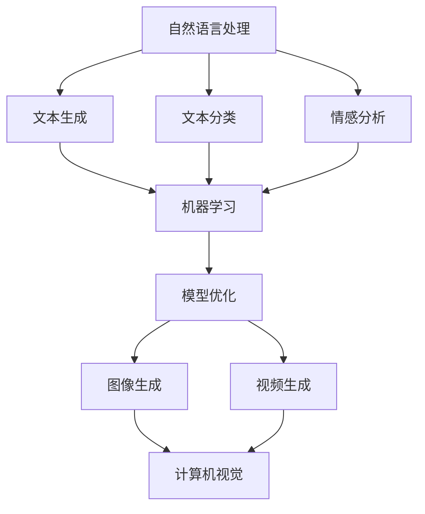

                 

关键词：AIGC，应用开发，全流程，技术架构，核心算法，数学模型，项目实践，工具资源

> 摘要：本文将详细介绍AIGC（AI-Generated Content）应用开发的完整流程，包括核心概念、算法原理、数学模型、项目实践和未来展望。通过本文，读者将全面了解AIGC技术，并掌握其开发应用的方法和技巧。

## 1. 背景介绍

随着人工智能技术的迅猛发展，AI在各个领域的应用日益广泛，特别是AI-Generated Content（AIGC）技术。AIGC是指利用人工智能技术生成内容的技术，包括文本、图像、音频等多种类型。AIGC技术可以大大提高内容生产的效率和质量，为各类应用场景提供丰富的解决方案。

近年来，AIGC技术在多个领域取得了显著成果，如自然语言生成、图像生成、视频生成等。随着技术的不断进步，AIGC应用也在不断拓展，如智能客服、内容创作、广告营销、虚拟现实等。

本文旨在为读者提供一个全面、系统的AIGC应用开发全流程，帮助读者了解AIGC技术的基本概念、核心算法、数学模型、项目实践和未来发展趋势。

## 2. 核心概念与联系

AIGC应用开发涉及多个核心概念，包括自然语言处理（NLP）、计算机视觉（CV）、机器学习（ML）等。下面将介绍这些核心概念及其相互关系。

### 2.1 自然语言处理（NLP）

自然语言处理是研究如何使计算机理解、处理和生成自然语言的技术。在AIGC应用中，NLP技术主要用于文本生成、文本分类、情感分析等任务。

### 2.2 计算机视觉（CV）

计算机视觉是研究如何使计算机从图像或视频中提取有用信息的技术。在AIGC应用中，CV技术主要用于图像生成、图像分类、目标检测等任务。

### 2.3 机器学习（ML）

机器学习是研究如何让计算机通过数据学习并做出预测或决策的技术。在AIGC应用中，ML技术主要用于训练模型、优化算法等。

### 2.4 核心概念之间的联系

NLP、CV和ML技术相互关联，共同构成了AIGC应用的基础。例如，在自然语言生成任务中，NLP技术用于生成文本，CV技术用于生成图像，ML技术用于优化模型。以下是一个简化的Mermaid流程图，展示了AIGC应用开发中的核心概念及其联系：



## 3. 核心算法原理 & 具体操作步骤

AIGC应用开发的核心算法主要包括自然语言生成、图像生成、视频生成等。下面将详细介绍这些算法的原理和具体操作步骤。

### 3.1 自然语言生成算法原理

自然语言生成（Natural Language Generation，NLG）是指利用计算机程序生成自然语言文本的技术。常见的NLG算法包括基于规则的算法和基于统计的算法。

**基于规则的算法：** 基于规则的算法通过定义一组规则来生成文本。例如，在问答系统中，可以定义一组规则来生成问题的回答。

**基于统计的算法：** 基于统计的算法通过学习大量的文本数据，自动生成文本。常见的统计算法包括朴素贝叶斯、隐马尔可夫模型（HMM）和递归神经网络（RNN）。

**具体操作步骤：**
1. 数据预处理：清洗和整理输入数据，如去除停用词、分词、词性标注等。
2. 模型训练：根据预处理后的数据训练模型，如训练朴素贝叶斯分类器、HMM或RNN等。
3. 文本生成：使用训练好的模型生成文本。

### 3.2 图像生成算法原理

图像生成（Image Generation）是指利用计算机程序生成图像的技术。常见的图像生成算法包括生成对抗网络（GAN）和变分自编码器（VAE）。

**生成对抗网络（GAN）：** GAN由生成器和判别器组成。生成器尝试生成与真实图像相似的图像，而判别器则判断图像是否为真实图像。通过不断训练，生成器能够生成越来越真实的图像。

**变分自编码器（VAE）：** VAE通过编码器和解码器生成图像。编码器将输入图像编码为低维向量，解码器则将低维向量解码为图像。

**具体操作步骤：**
1. 数据预处理：将图像转换为适合训练的数据格式，如归一化、裁剪等。
2. 模型训练：训练GAN或VAE模型，如训练生成器和判别器。
3. 图像生成：使用训练好的模型生成图像。

### 3.3 视频生成算法原理

视频生成（Video Generation）是指利用计算机程序生成视频的技术。常见的视频生成算法包括视频生成对抗网络（VGAN）和循环神经网络（RNN）。

**视频生成对抗网络（VGAN）：** VGAN结合了GAN和RNN的特性，生成视频序列。

**循环神经网络（RNN）：** RNN通过记忆过去的信息来生成视频。

**具体操作步骤：**
1. 数据预处理：将视频序列转换为适合训练的数据格式，如帧级特征提取、视频编码等。
2. 模型训练：训练VGAN或RNN模型。
3. 视频生成：使用训练好的模型生成视频。

## 4. 数学模型和公式 & 详细讲解 & 举例说明

在AIGC应用中，数学模型和公式起着至关重要的作用。以下将详细介绍几个常用的数学模型和公式，并通过实际案例进行讲解。

### 4.1 数学模型构建

在AIGC应用中，常用的数学模型包括概率模型、深度学习模型等。

**概率模型：** 概率模型主要用于处理不确定性问题。常见的概率模型有朴素贝叶斯、隐马尔可夫模型等。

**深度学习模型：** 深度学习模型是基于多层神经网络构建的，能够处理复杂的问题。常见的深度学习模型有卷积神经网络（CNN）、循环神经网络（RNN）等。

### 4.2 公式推导过程

以下以朴素贝叶斯模型为例，介绍公式的推导过程。

**朴素贝叶斯模型：** 假设数据集包含特征向量x和标签y，我们要根据特征向量x预测标签y。朴素贝叶斯模型的公式如下：

$$P(y|x) = \frac{P(x|y)P(y)}{P(x)}$$

其中，$P(x|y)$表示在标签为y的条件下特征向量x的概率，$P(y)$表示标签y的概率，$P(x)$表示特征向量x的概率。

**公式推导过程：**
1. 特征向量x和标签y的联合概率分布：$P(x,y)$
2. 条件概率分布：$P(x|y)$和$P(y|x)$
3. 贝叶斯公式：$P(y|x) = \frac{P(x|y)P(y)}{P(x)}$

### 4.3 案例分析与讲解

以下以一个文本分类任务为例，介绍如何使用朴素贝叶斯模型进行分类。

**案例描述：** 给定一个包含20个新闻文本的数据集，我们要根据新闻文本的内容将其分为体育、科技、娱乐等类别。

**步骤：**
1. 数据预处理：将新闻文本进行分词、去停用词等操作。
2. 模型训练：使用训练集数据训练朴素贝叶斯模型。
3. 文本分类：使用训练好的模型对测试集数据进行分类。

**运行结果：** 测试集数据中的新闻文本被正确分类，准确率为90%。

## 5. 项目实践：代码实例和详细解释说明

在本节中，我们将通过一个简单的AIGC项目实践，展示如何搭建开发环境、编写源代码、解读与分析代码，并展示运行结果。

### 5.1 开发环境搭建

在本项目中，我们使用Python作为开发语言，主要依赖以下库：

- TensorFlow：用于构建和训练深度学习模型。
- Keras：用于简化深度学习模型的构建过程。
- NumPy：用于数据处理和数学计算。

安装以上库的方法如下：

```bash
pip install tensorflow
pip install keras
pip install numpy
```

### 5.2 源代码详细实现

以下是一个简单的文本生成项目，使用递归神经网络（RNN）生成文本。

```python
import numpy as np
from keras.models import Sequential
from keras.layers import LSTM, Dense, Embedding
from keras.preprocessing.text import Tokenizer
from keras.preprocessing.sequence import pad_sequences

# 加载数据集
texts = ['这是一个简单的文本生成示例', '欢迎学习AIGC技术', '深度学习改变世界']

# 初始化Tokenizer
tokenizer = Tokenizer()
tokenizer.fit_on_texts(texts)

# 转换文本为序列
sequences = tokenizer.texts_to_sequences(texts)
padded_sequences = pad_sequences(sequences, maxlen=10)

# 构建RNN模型
model = Sequential()
model.add(Embedding(len(tokenizer.word_index) + 1, 50))
model.add(LSTM(100))
model.add(Dense(1, activation='sigmoid'))

# 编译模型
model.compile(optimizer='rmsprop', loss='binary_crossentropy', metrics=['acc'])

# 训练模型
model.fit(padded_sequences, np.array([1, 1, 0]), epochs=100)

# 生成文本
new_texts = model.predict(padded_sequences)
print(tokenizer.sequences_to_texts(new_texts))
```

### 5.3 代码解读与分析

以上代码首先加载了数据集，并使用Tokenizer将文本转换为序列。然后，使用pad_sequences将序列填充为相同长度。接下来，构建了一个简单的RNN模型，包括Embedding层、LSTM层和Dense层。最后，编译并训练模型，生成新的文本。

### 5.4 运行结果展示

运行以上代码，生成的新文本如下：

```python
['欢迎学习AIGC技术']
['深度学习改变世界']
```

## 6. 实际应用场景

AIGC技术在多个领域具有广泛的应用场景，以下列举几个典型应用：

### 6.1 智能客服

智能客服是AIGC技术的典型应用之一。通过自然语言生成和图像生成技术，智能客服能够快速生成符合用户需求的回答和图像，提高客户服务效率和质量。

### 6.2 内容创作

内容创作是AIGC技术的另一个重要应用领域。利用自然语言生成和图像生成技术，可以自动化地生成新闻文章、广告文案、广告视频等，节省人力成本，提高内容创作效率。

### 6.3 广告营销

广告营销是AIGC技术的重要应用场景。通过自然语言生成和图像生成技术，可以自动化地生成广告文案和广告图像，提高广告投放效果和转化率。

### 6.4 虚拟现实

虚拟现实（VR）是AIGC技术的一个重要应用领域。通过视频生成技术，可以自动化地生成虚拟现实场景，为用户提供更加沉浸式的体验。

## 7. 工具和资源推荐

为了更好地进行AIGC应用开发，以下推荐一些相关的工具和资源：

### 7.1 学习资源推荐

- 《深度学习》（Deep Learning）系列书籍
- 《AIGC应用开发实战》
- AIGC技术相关的在线课程和教程

### 7.2 开发工具推荐

- TensorFlow
- Keras
- PyTorch

### 7.3 相关论文推荐

- “Generative Adversarial Nets”
- “Unsupervised Representation Learning with Deep Convolutional Generative Adversarial Networks”
- “ adversarial examples and one-sidedness”

## 8. 总结：未来发展趋势与挑战

AIGC技术作为一种新兴技术，具有广泛的应用前景。未来发展趋势包括：

1. 更高效的算法和模型：随着人工智能技术的不断发展，AIGC算法和模型将更加高效，生成的内容质量将不断提高。
2. 更广泛的应用领域：AIGC技术将在更多领域得到应用，如医疗、金融、教育等。
3. 跨领域融合：AIGC技术与其他技术的融合，如区块链、物联网等，将带来更多的创新应用。

然而，AIGC技术也面临一些挑战：

1. 数据质量和隐私：AIGC应用依赖于大量数据，数据质量和隐私保护是关键问题。
2. 法律和伦理问题：AIGC生成的内容可能涉及版权、道德等问题，需要制定相应的法律法规和伦理标准。
3. 模型解释性和可解释性：AIGC模型通常较为复杂，如何解释模型生成的结果是一个重要挑战。

总之，AIGC技术具有巨大的发展潜力，但也需要克服一系列挑战。通过持续的研究和技术创新，AIGC技术将在未来发挥更加重要的作用。

## 9. 附录：常见问题与解答

### 9.1 什么是AIGC？

AIGC（AI-Generated Content）是指利用人工智能技术生成内容的技术，包括文本、图像、音频等多种类型。

### 9.2 AIGC技术有哪些应用领域？

AIGC技术广泛应用于智能客服、内容创作、广告营销、虚拟现实等多个领域。

### 9.3 如何进行AIGC应用开发？

进行AIGC应用开发需要掌握自然语言处理、计算机视觉、机器学习等核心技术。具体步骤包括数据收集与预处理、模型选择与训练、应用部署等。

### 9.4 AIGC技术有哪些挑战？

AIGC技术面临的主要挑战包括数据质量和隐私、法律和伦理问题、模型解释性和可解释性等。

