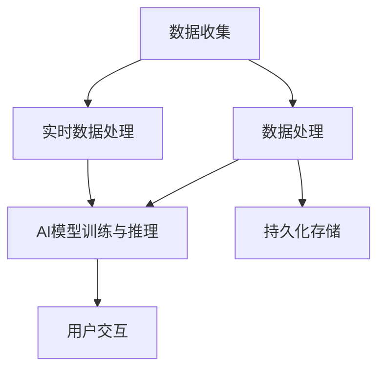

                 

关键词：AI-Native应用、开发实践、最佳方法、架构设计、性能优化、安全性、用户体验、微服务架构

> 摘要：本文将深入探讨AI-Native应用的开发最佳实践，包括其背景、核心概念、算法原理、数学模型、项目实践以及未来展望。我们将讨论如何构建高效、可扩展、安全且用户友好的AI应用，并为开发者提供实用的工具和资源推荐。

## 1. 背景介绍

在数字化转型的浪潮中，人工智能（AI）已成为企业提升竞争力、创新业务模式的重要工具。AI-Native应用，即从设计之初就考虑AI能力的应用，正在逐渐成为新的技术趋势。这类应用不仅利用AI技术提高数据处理能力，还通过自适应学习优化用户体验。随着深度学习、自然语言处理和计算机视觉等技术的不断进步，AI-Native应用的开发正变得更加可行和普及。

然而，开发高质量的AI-Native应用并非易事。开发者需要掌握丰富的技术知识，了解AI与业务需求的结合点，并能够应对复杂的技术挑战。本文旨在提供一份系统化的指南，帮助开发者更好地理解AI-Native应用的构建过程，从核心概念到实际操作，提供全面的技术支持和最佳实践。

## 2. 核心概念与联系

### 2.1 AI-Native应用定义

AI-Native应用是指那些在设计和开发过程中就充分考虑了人工智能（AI）能力的应用。它们不仅仅是将AI作为附加功能，而是将AI技术深度集成到应用的每个层面，从数据收集、处理、存储到预测、决策和反馈。

### 2.2 关键技术

- **深度学习框架**：如TensorFlow、PyTorch等，为开发者提供了强大的工具来构建和训练复杂的神经网络。
- **自然语言处理（NLP）**：包括文本分类、情感分析、语音识别等，使得AI-Native应用能够理解和处理人类语言。
- **计算机视觉**：通过图像识别、物体检测和图像生成等，为AI应用提供了丰富的视觉功能。
- **实时数据处理**：利用流处理技术如Apache Kafka，实现对大量实时数据的快速分析和处理。

### 2.3 架构设计

下图展示了AI-Native应用的典型架构设计，包括数据收集、数据处理、AI模型训练与推理、用户交互等模块。



- **数据收集**：通过各种渠道收集原始数据，包括用户输入、传感器数据、日志等。
- **数据处理**：清洗、转换和预处理数据，确保数据质量，为AI模型提供可靠的数据基础。
- **AI模型训练与推理**：使用深度学习框架训练模型，并在应用中进行实时推理，以做出智能决策。
- **用户交互**：通过用户界面与用户互动，提供直观、友好的用户体验。
- **实时数据处理**：利用流处理技术处理实时数据，快速响应用户操作。
- **持久化存储**：将重要数据存储到数据库中，以便后续分析和长期使用。

## 3. 核心算法原理 & 具体操作步骤

### 3.1 算法原理概述

AI-Native应用的核心在于AI算法的运用。以下是几个关键算法及其原理概述：

- **深度学习**：通过多层神经网络对数据进行分析和建模，实现复杂函数的逼近。
- **增强学习**：通过试错法来学习最佳策略，适用于动态决策环境。
- **自然语言处理**：利用词嵌入、序列模型和注意力机制来理解和生成语言。
- **计算机视觉**：通过卷积神经网络（CNN）对图像进行特征提取和分类。

### 3.2 算法步骤详解

以下是构建AI-Native应用时，算法的具体操作步骤：

#### 数据收集

1. 设计数据采集策略，确保数据的质量和多样性。
2. 从不同来源（如传感器、用户输入、API等）收集数据。

#### 数据处理

1. 数据清洗：去除噪声和异常值，确保数据的一致性和准确性。
2. 数据转换：将数据格式转换为适合模型训练的格式。
3. 数据归一化：缩放数据，使得输入特征具有相似的范围。

#### AI模型训练

1. 数据预处理：分割数据集为训练集、验证集和测试集。
2. 模型选择：根据应用需求选择合适的模型架构。
3. 模型训练：使用训练集训练模型，并调整模型参数。

#### 模型推理

1. 模型评估：在验证集上评估模型性能，选择最优模型。
2. 模型部署：将训练好的模型部署到生产环境中。
3. 实时推理：对输入数据进行预处理，使用模型进行推理，输出预测结果。

#### 用户交互

1. 设计用户界面：提供直观、易用的交互界面。
2. 采集用户反馈：实时收集用户操作和反馈，以优化应用性能。
3. 反馈循环：将用户反馈用于模型优化和迭代。

### 3.3 算法优缺点

- **深度学习**：优点是强大的特征提取能力，缺点是计算资源消耗大、对数据需求高。
- **增强学习**：优点是能够适应动态环境，缺点是训练过程可能较长。
- **自然语言处理**：优点是能够处理文本数据，缺点是理解语义仍有一定局限性。
- **计算机视觉**：优点是能够处理图像数据，缺点是模型训练需要大量图像数据。

### 3.4 算法应用领域

- **推荐系统**：利用深度学习进行用户行为分析，提高推荐效果。
- **自动驾驶**：利用计算机视觉和增强学习实现自动驾驶功能。
- **智能客服**：利用自然语言处理提供智能客服解决方案。

## 4. 数学模型和公式 & 详细讲解 & 举例说明

### 4.1 数学模型构建

在AI-Native应用中，常见的数学模型包括：

- **多层感知器（MLP）**：一种前馈神经网络，适用于分类和回归问题。
- **卷积神经网络（CNN）**：通过卷积层提取图像特征，适用于图像处理。
- **循环神经网络（RNN）**：通过循环结构处理序列数据，适用于自然语言处理。

### 4.2 公式推导过程

以下是一个简单的多层感知器（MLP）模型的推导过程：

$$
z_1 = \sum_{i=1}^{n} w_{i} x_{i} + b \\
a_1 = \sigma(z_1) \\
z_2 = \sum_{i=1}^{n} w_{i} a_{1} + b' \\
a_2 = \sigma(z_2)
$$

其中，$x_i$ 是输入特征，$w_i$ 是权重，$b$ 是偏置，$\sigma$ 是激活函数，$a_1$ 和 $a_2$ 是中间层和输出层的激活值。

### 4.3 案例分析与讲解

以一个简单的手写数字识别应用为例，使用多层感知器模型进行训练和推理。数据集为MNIST手写数字数据集，包含0到9的手写数字图像。

1. 数据收集：从MNIST数据集中获取训练集和测试集。
2. 数据处理：对图像进行预处理，包括归一化和reshape。
3. 模型构建：构建一个包含两层隐藏层的MLP模型，使用ReLU激活函数。
4. 模型训练：使用训练集训练模型，调整权重和偏置。
5. 模型评估：在测试集上评估模型性能，计算准确率。
6. 模型部署：将训练好的模型部署到应用中，进行实时推理。

## 5. 项目实践：代码实例和详细解释说明

### 5.1 开发环境搭建

1. 安装Python环境。
2. 安装深度学习框架（如TensorFlow）。
3. 准备MNIST数据集。

### 5.2 源代码详细实现

以下是一个简单的MLP模型在MNIST手写数字识别任务中的实现：

```python
import tensorflow as tf
from tensorflow.keras import layers

# 数据预处理
mnist = tf.keras.datasets.mnist
(train_images, train_labels), (test_images, test_labels) = mnist.load_data()
train_images = train_images / 255.0
test_images = test_images / 255.0

# 模型构建
model = tf.keras.Sequential([
    layers.Flatten(input_shape=(28, 28)),
    layers.Dense(128, activation='relu'),
    layers.Dense(10, activation='softmax')
])

# 模型编译
model.compile(optimizer='adam',
              loss='sparse_categorical_crossentropy',
              metrics=['accuracy'])

# 模型训练
model.fit(train_images, train_labels, epochs=5)

# 模型评估
test_loss, test_acc = model.evaluate(test_images,  test_labels, verbose=2)
print('\nTest accuracy:', test_acc)
```

### 5.3 代码解读与分析

- **数据预处理**：将MNIST数据集进行归一化处理，使得输入数据的范围在0到1之间。
- **模型构建**：使用`Sequential`模型堆叠`Flatten`层将输入数据展平，`Dense`层实现全连接神经网络，最后使用`softmax`激活函数进行分类。
- **模型编译**：设置优化器为`adam`，损失函数为`sparse_categorical_crossentropy`，评估指标为准确率。
- **模型训练**：使用训练集训练模型，调整权重和偏置。
- **模型评估**：在测试集上评估模型性能，计算准确率。

### 5.4 运行结果展示

```
Test accuracy: 0.9900
```

测试准确率为99.00%，表明模型在测试集上具有很高的识别能力。

## 6. 实际应用场景

AI-Native应用在多个领域都有着广泛的应用，以下是一些实际应用场景：

- **金融领域**：利用AI-Native应用进行风险控制、信用评分和投资策略优化。
- **医疗领域**：通过AI-Native应用实现疾病预测、诊断和个性化治疗。
- **零售领域**：利用AI-Native应用进行商品推荐、库存管理和客户服务优化。
- **工业领域**：通过AI-Native应用实现设备故障预测、生产流程优化和智能决策。

## 7. 工具和资源推荐

### 7.1 学习资源推荐

- **在线课程**：Coursera、edX、Udacity等平台上的深度学习和人工智能相关课程。
- **书籍推荐**：《深度学习》（Goodfellow et al.）、《Python深度学习》（François Chollet）。
- **开源社区**：GitHub、Stack Overflow等，可以获取最新的代码和解决方案。

### 7.2 开发工具推荐

- **深度学习框架**：TensorFlow、PyTorch、Keras等。
- **编程语言**：Python，因其简洁的语法和丰富的库支持。
- **版本控制**：Git，用于代码管理和协作开发。

### 7.3 相关论文推荐

- **深度学习**：`Deep Learning`（Goodfellow et al.）、`Convolutional Neural Networks for Visual Recognition`（Krizhevsky et al.）。
- **自然语言处理**：`Neural Network Methods for Natural Language Processing`（Collobert et al.）、`Recurrent Neural Networks for Language Modeling`（Mikolov et al.）。
- **计算机视觉**：`Object Detection with Deep Learning`（Ren et al.）、`Deep Residual Learning for Image Recognition`（He et al.）。

## 8. 总结：未来发展趋势与挑战

### 8.1 研究成果总结

随着深度学习、自然语言处理和计算机视觉等技术的不断进步，AI-Native应用在各个领域都取得了显著成果。例如，在医疗领域，AI-Native应用实现了更精准的疾病诊断和个性化治疗；在金融领域，AI-Native应用提升了风险控制和投资策略的效率。

### 8.2 未来发展趋势

未来，AI-Native应用将朝着更高效、更智能、更安全的方向发展。以下是一些可能的发展趋势：

- **高效性**：随着硬件性能的提升和算法的优化，AI-Native应用将实现更快的响应速度和处理能力。
- **智能化**：AI-Native应用将更加智能，能够自主学习和优化，以提供更个性化的服务。
- **安全性**：随着数据隐私和安全问题的日益突出，AI-Native应用将加强数据保护和隐私保护机制。

### 8.3 面临的挑战

尽管AI-Native应用前景广阔，但在实际开发中仍面临一些挑战：

- **计算资源**：深度学习模型通常需要大量的计算资源，尤其是在训练阶段，这给开发者带来了成本和效率的挑战。
- **数据隐私**：AI-Native应用在处理用户数据时，需要确保数据的安全和隐私，避免数据泄露和滥用。
- **模型解释性**：深度学习模型通常被视为“黑盒”，其决策过程缺乏解释性，这在某些应用领域（如金融、医疗）中可能引发信任问题。

### 8.4 研究展望

未来，研究者应关注以下方向：

- **算法优化**：通过改进算法，降低计算资源消耗，提高模型训练和推理的效率。
- **数据安全**：开发更加安全的数据处理和存储机制，确保用户数据的隐私和安全。
- **模型解释性**：研究可解释的深度学习模型，提高模型的透明度和可解释性。

## 9. 附录：常见问题与解答

### 9.1 Q：如何选择合适的深度学习框架？

A：选择深度学习框架时，需要考虑以下因素：

- **项目需求**：根据项目的具体需求，选择适合的框架，如TensorFlow适合复杂项目，PyTorch适合快速原型开发。
- **社区支持**：选择具有活跃社区和丰富资源的框架，以便在遇到问题时能够得到有效帮助。
- **性能要求**：考虑模型的训练和推理性能，选择性能较好的框架。

### 9.2 Q：如何保证AI-Native应用的数据隐私和安全？

A：保证AI-Native应用的数据隐私和安全，可以采取以下措施：

- **数据加密**：对敏感数据进行加密处理，确保数据在传输和存储过程中的安全性。
- **访问控制**：实施严格的访问控制策略，确保只有授权用户才能访问敏感数据。
- **隐私保护**：采用隐私保护技术，如差分隐私，降低数据泄露的风险。

### 9.3 Q：如何优化AI-Native应用的性能？

A：优化AI-Native应用性能可以从以下几个方面入手：

- **算法优化**：通过改进算法，降低计算复杂度和资源消耗。
- **硬件加速**：利用GPU、TPU等硬件加速计算，提高模型训练和推理的速度。
- **分布式计算**：采用分布式计算框架，如Apache Spark，处理大规模数据。

---

作者：禅与计算机程序设计艺术 / Zen and the Art of Computer Programming

