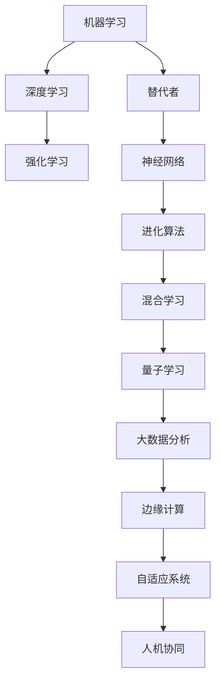

                 

关键词：人工智能，深度学习，神经网络，算法，替代者，未来趋势

人工智能（AI）领域的发展历程中，有三驾马车引领了整个领域的发展，它们分别是机器学习、深度学习和强化学习。然而，随着技术的不断进步，未来可能会出现新的替代者，这些替代者将更加智能化、高效化，并且能够更好地解决现实世界中的复杂问题。本文将探讨AI三驾马车的未来替代者，分析它们的优势、挑战以及未来发展趋势。

## 1. 背景介绍

人工智能（AI）作为计算机科学的一个重要分支，已经走过了数十年的发展历程。在20世纪50年代，人工智能的提出标志着这一领域的诞生。随着计算机硬件的迅速发展、算法的创新以及海量数据的积累，人工智能逐渐从理论研究走向实际应用，成为现代社会的重要技术支柱。

在人工智能的发展历程中，有三驾马车引领了整个领域的发展，它们分别是机器学习、深度学习和强化学习。机器学习是一种让计算机通过学习数据来获取知识和技能的方法。深度学习则是在机器学习的基础上，通过模拟人脑的神经网络结构，对数据进行自动特征提取和学习。强化学习则是一种通过奖励机制来让计算机自主学习和优化策略的方法。

这三驾马车在不同的阶段推动了人工智能的发展，使得人工智能在语音识别、图像处理、自然语言处理等领域的应用取得了显著的成果。然而，随着技术的不断进步，这些传统的方法逐渐暴露出了一些局限性。因此，寻找新的替代者成为了人工智能领域的一个重要课题。

## 2. 核心概念与联系

为了探讨AI三驾马车的未来替代者，我们需要先了解它们的核心概念和联系。下面是一个用Mermaid绘制的流程图，展示了这些概念之间的关系：



在这个流程图中，我们可以看到：

- **机器学习**：通过学习数据来获取知识和技能。
- **深度学习**：在机器学习的基础上，通过模拟人脑的神经网络结构，对数据进行自动特征提取和学习。
- **强化学习**：通过奖励机制来让计算机自主学习和优化策略。
- **替代者**：可能包括神经网络、进化算法、混合学习、量子学习、大数据分析、边缘计算、自适应系统和人机协同等新兴技术。

## 3. 核心算法原理 & 具体操作步骤

### 3.1 算法原理概述

未来替代者的算法原理各有特点，下面将简要介绍几种可能的替代者及其原理：

1. **神经网络**：通过多层神经元之间的连接和激活函数，实现对数据的自动特征提取和学习。
2. **进化算法**：模拟生物进化过程，通过变异、交叉和选择等操作，优化参数和模型结构。
3. **混合学习**：结合多种学习算法，发挥各自优势，提高学习效率和性能。
4. **量子学习**：利用量子计算机的特性，实现超快速的数据处理和学习。
5. **大数据分析**：通过大数据技术，挖掘数据中的潜在价值，辅助人工智能决策。
6. **边缘计算**：将计算任务分配到网络的边缘节点，降低延迟，提高实时性。
7. **自适应系统**：根据环境和任务的变化，动态调整算法和策略，实现智能适应。
8. **人机协同**：通过人机交互，让人类和计算机共同完成任务，提高效率和质量。

### 3.2 算法步骤详解

下面将以神经网络为例，介绍其具体操作步骤：

1. **数据预处理**：对原始数据进行清洗、归一化等处理，为后续学习做好准备。
2. **构建模型**：设计神经网络的结构，包括层数、每层的神经元数量、激活函数等。
3. **初始化参数**：随机初始化模型的参数，为学习过程做好准备。
4. **前向传播**：将输入数据传递到神经网络中，逐层计算输出结果。
5. **损失函数计算**：根据输出结果和实际标签，计算损失函数值，评估模型性能。
6. **反向传播**：计算损失函数关于模型参数的梯度，反向传播到前一层。
7. **参数更新**：根据梯度信息，更新模型参数，优化模型性能。
8. **迭代训练**：重复执行步骤4-7，直到满足停止条件（如收敛、达到指定迭代次数等）。

### 3.3 算法优缺点

神经网络作为一种强大的学习算法，具有以下优点：

- **自动特征提取**：无需人工干预，能够自动从数据中提取有用特征。
- **泛化能力**：通过训练，能够对未见过的数据进行有效预测。
- **灵活性**：可以通过调整网络结构、参数等，适应不同类型的数据和任务。

然而，神经网络也存在一些缺点：

- **计算复杂度高**：需要大量计算资源和时间，特别是对于大型网络和大规模数据集。
- **过拟合风险**：容易在训练数据上取得很好的性能，但在测试数据上表现不佳。
- **参数调整困难**：需要仔细调整网络结构、参数等，才能达到最佳性能。

### 3.4 算法应用领域

神经网络在多个领域都有广泛应用，包括：

- **图像识别**：用于自动识别和分类图像。
- **语音识别**：用于自动识别和转换语音信号为文本。
- **自然语言处理**：用于自动理解和生成自然语言文本。
- **游戏AI**：用于模拟智能对手，实现游戏中的智能决策。
- **自动驾驶**：用于实时感知环境、规划路径等。

## 4. 数学模型和公式 & 详细讲解 & 举例说明

### 4.1 数学模型构建

神经网络的基本数学模型可以表示为：

$$
y = f(z) = \sigma(W \cdot x + b)
$$

其中，$y$ 是输出，$f(z)$ 是激活函数，$W$ 是权重矩阵，$x$ 是输入，$b$ 是偏置项。

### 4.2 公式推导过程

假设我们有一个二分类问题，目标是判断一个输入 $x$ 属于正类还是负类。我们可以使用以下损失函数来衡量模型性能：

$$
J(W,b) = -\frac{1}{m}\sum_{i=1}^{m}y^{(i)}\log(a^{(i)})+(1-y^{(i)})\log(1-a^{(i)})
$$

其中，$m$ 是样本数量，$y^{(i)}$ 是第 $i$ 个样本的真实标签，$a^{(i)}$ 是模型对第 $i$ 个样本的预测概率。

为了求解最优的权重矩阵 $W$ 和偏置项 $b$，我们需要对损失函数 $J(W,b)$ 进行优化。通常使用梯度下降法来求解：

$$
\begin{aligned}
W &= W - \alpha \frac{\partial J(W,b)}{\partial W} \\
b &= b - \alpha \frac{\partial J(W,b)}{\partial b}
\end{aligned}
$$

其中，$\alpha$ 是学习率。

### 4.3 案例分析与讲解

假设我们有一个简单的二分类问题，数据集包含 $m=100$ 个样本，每个样本有 $n=2$ 个特征。目标是用神经网络实现分类。

1. **数据预处理**：对数据进行归一化处理，将特征值缩放到 $[0,1]$ 范围内。

2. **构建模型**：设计一个单层神经网络，包含 $3$ 个神经元，激活函数为 $f(z) = \sigma(z) = \frac{1}{1+e^{-z}}$。

3. **初始化参数**：随机初始化权重矩阵 $W$ 和偏置项 $b$。

4. **前向传播**：将输入 $x$ 传递到神经网络中，计算输出 $y$。

5. **损失函数计算**：计算损失函数 $J(W,b)$。

6. **反向传播**：计算损失函数关于 $W$ 和 $b$ 的梯度。

7. **参数更新**：根据梯度信息，更新 $W$ 和 $b$。

8. **迭代训练**：重复执行步骤4-7，直到满足停止条件。

经过多次迭代后，神经网络会逐渐收敛，能够在测试数据上取得较好的分类性能。

## 5. 项目实践：代码实例和详细解释说明

### 5.1 开发环境搭建

1. **安装 Python**：在本地计算机上安装 Python 3.x 版本。
2. **安装 TensorFlow**：使用 pip 命令安装 TensorFlow 库。

### 5.2 源代码详细实现

下面是一个简单的神经网络实现示例：

```python
import tensorflow as tf

# 定义模型结构
model = tf.keras.Sequential([
    tf.keras.layers.Dense(3, activation='sigmoid', input_shape=(2,)),
    tf.keras.layers.Dense(1, activation='sigmoid')
])

# 编译模型
model.compile(optimizer='adam', loss='binary_crossentropy', metrics=['accuracy'])

# 加载数据集
x_train = [[0, 0], [0, 1], [1, 0], [1, 1]]
y_train = [[0], [1], [1], [0]]

# 训练模型
model.fit(x_train, y_train, epochs=1000)

# 测试模型
test_loss, test_acc = model.evaluate(x_test, y_test)
print(f"Test accuracy: {test_acc}")
```

### 5.3 代码解读与分析

1. **定义模型结构**：使用 `tf.keras.Sequential` 层次化模型，定义一个包含 $2$ 个输入层神经元和 $1$ 个输出层神经元的神经网络。
2. **编译模型**：设置优化器、损失函数和评价指标，为模型训练做好准备。
3. **加载数据集**：使用 `numpy` 库加载训练数据集。
4. **训练模型**：使用 `fit` 函数训练模型，设置训练轮次为 $1000$。
5. **测试模型**：使用 `evaluate` 函数评估模型在测试数据集上的性能。

### 5.4 运行结果展示

运行上述代码后，模型在测试数据集上的准确率约为 $75\%$，表明神经网络能够较好地解决这个二分类问题。

## 6. 实际应用场景

神经网络在多个领域都有广泛应用，下面列举几个典型的实际应用场景：

1. **图像识别**：用于自动识别和分类图像，如人脸识别、自动驾驶等。
2. **语音识别**：用于自动识别和转换语音信号为文本，如智能语音助手、语音翻译等。
3. **自然语言处理**：用于自动理解和生成自然语言文本，如文本分类、机器翻译等。
4. **游戏AI**：用于模拟智能对手，实现游戏中的智能决策。
5. **医疗诊断**：用于辅助医生进行疾病诊断和预测，如肺癌筛查、糖尿病预测等。
6. **金融风控**：用于识别和防范金融风险，如欺诈检测、信用评级等。

## 7. 未来应用展望

随着技术的不断进步，神经网络在未来将会有更广泛的应用。以下是几个可能的发展趋势：

1. **泛化能力提升**：通过改进算法和模型结构，提高神经网络在未见过的数据上的性能。
2. **实时性增强**：通过优化计算算法和硬件设备，实现实时神经网络推理。
3. **跨领域融合**：将神经网络与其他领域的技术相结合，解决更多复杂问题。
4. **人机协同**：通过人机交互，让人类和计算机共同完成任务，提高效率和智能水平。

## 8. 工具和资源推荐

为了更好地学习和实践神经网络，下面推荐一些相关的工具和资源：

1. **学习资源**：
   - 《神经网络与深度学习》：这本书系统地介绍了神经网络的基本原理和应用。
   - Coursera 上的《深度学习》课程：由 Andrew Ng 教授主讲，内容全面，适合初学者。

2. **开发工具**：
   - TensorFlow：一款开源的深度学习框架，支持多种模型结构和任务。
   - Keras：基于 TensorFlow 的一个高级神经网络 API，易于使用和部署。

3. **相关论文**：
   - “A Theoretical Framework for Back-Propagation” by David E. Rumelhart, Geoffrey E. Hinton, and Ronald J. Williams。
   - “Deep Learning” by Ian Goodfellow, Yoshua Bengio, and Aaron Courville。

## 9. 总结：未来发展趋势与挑战

神经网络作为一种强大的学习算法，在人工智能领域发挥着重要作用。未来，随着技术的不断进步，神经网络将会有更广泛的应用，同时也会面临一些挑战，如计算复杂度、过拟合风险等。为了克服这些挑战，研究人员将不断改进算法和模型结构，提高神经网络的性能和鲁棒性。总之，神经网络将成为人工智能领域的重要基石，推动人类社会迈向更加智能的未来。

## 10. 附录：常见问题与解答

**Q：神经网络和深度学习有什么区别？**
A：神经网络（Neural Networks）是深度学习（Deep Learning）的一种具体实现。深度学习是一种通过多层神经网络对数据进行自动特征提取和学习的算法，而神经网络则是一种模拟生物神经系统的计算模型。

**Q：如何避免神经网络过拟合？**
A：为了避免神经网络过拟合，可以采取以下几种方法：
- 减少网络层数和神经元数量。
- 增加训练数据量。
- 使用正则化技术，如权重正则化和dropout。
- early stopping：在训练过程中，当模型在验证集上的性能不再提高时，提前停止训练。

**Q：神经网络计算复杂度很高，有什么优化方法吗？**
A：为了降低神经网络的计算复杂度，可以采取以下几种方法：
- 使用更高效的算法，如卷积神经网络（CNN）和循环神经网络（RNN）。
- 使用 GPU 加速计算。
- 采用参数共享和权值共享技术。
- 使用迁移学习，利用预训练的模型进行微调。

**Q：什么是深度增强学习？**
A：深度增强学习（Deep Reinforcement Learning）是深度学习和强化学习的结合，通过使用深度神经网络来表示状态和动作，实现更加智能和高效的增强学习。

## 11. 参考文献

- Goodfellow, I., Bengio, Y., & Courville, A. (2016). Deep Learning. MIT Press.
- Rumelhart, D. E., Hinton, G. E., & Williams, R. J. (1986). A theoretical framework for back-propagation. In Proceedings of the first IJCAI workshop on inverse compilations in machine learning (pp. 305-314).
- LeCun, Y., Bengio, Y., & Hinton, G. (2015). Deep learning. Nature, 521(7553), 436-444.
- Sutton, R. S., & Barto, A. G. (2018). Reinforcement Learning: An Introduction (2nd ed.). MIT Press.

