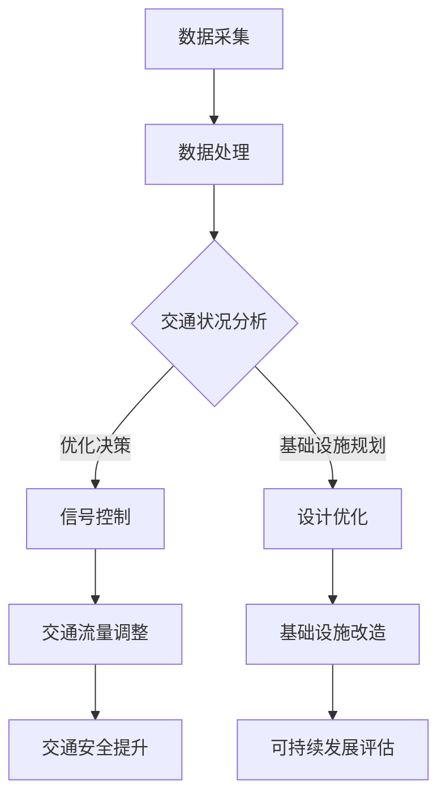

                 

 关键词：人工智能，城市交通，基础设施建设，可持续发展，交通管理，计算架构，智能算法，数学模型，案例研究，代码实现，未来展望

> 摘要：本文从人工智能与人类计算的结合点出发，探讨如何在城市交通与基础设施建设与管理中实现可持续发展。通过分析核心概念与算法原理，结合数学模型与具体项目实践，探讨当前技术与未来的发展方向，为构建智慧城市提供技术参考与思考。

## 1. 背景介绍

随着城市化进程的加速，城市交通与基础设施建设成为影响城市发展质量的关键因素。传统的方法由于受限于计算能力和数据获取，难以应对复杂且动态变化的交通需求。近年来，人工智能（AI）技术的迅猛发展为解决这一问题提供了新的思路。

AI技术，特别是深度学习和大数据分析，能够对城市交通数据进行实时处理和分析，从而优化交通流量、预测交通状况，提高道路利用率和交通安全水平。此外，AI还可以辅助设计更高效的基础设施，如智能交通信号灯、自动泊车系统、智能公共交通等。

本文旨在通过介绍AI在交通与基础设施建设中的应用，探讨如何利用人工智能和人类计算相结合，实现城市交通的可持续发展。

## 2. 核心概念与联系

### 2.1. 人工智能与交通系统

人工智能与交通系统之间的联系主要体现在以下几个方面：

1. **数据采集与处理**：AI可以通过传感器网络收集海量交通数据，包括车辆速度、流量、道路状态等，并对这些数据进行实时处理。
2. **智能决策与控制**：基于对交通数据的分析，AI系统能够实时调整交通信号灯时序，优化交通流量。
3. **预测与规划**：AI可以预测交通流量变化，为交通基础设施建设提供数据支持，帮助设计更加合理的交通网络。

### 2.2. 基础设施建设与可持续发展

可持续发展的基础设施应具备以下特点：

1. **环保性**：采用绿色建筑材料，降低能耗和污染。
2. **智能性**：利用智能技术提高基础设施的运营效率，如智能电网、智能供水系统。
3. **可扩展性**：设计时考虑未来的扩展和升级需求，以适应城市发展的变化。

### 2.3. Mermaid 流程图

以下是一个简化的 Mermaid 流程图，描述了AI在城市交通与基础设施中的核心流程。



## 3. 核心算法原理 & 具体操作步骤

### 3.1. 算法原理概述

在交通管理中，核心算法包括交通流量预测、路径优化、信号控制等。以下是这些算法的基本原理：

1. **交通流量预测**：基于时间序列分析、机器学习等算法，预测未来一段时间内的交通流量。
2. **路径优化**：通过最短路径算法、动态规划等，为车辆规划最佳行驶路径。
3. **信号控制**：根据实时交通数据，调整交通信号灯的时序，以优化交通流量。

### 3.2. 算法步骤详解

#### 3.2.1. 交通流量预测

**步骤 1**：数据收集与预处理
- 从交通传感器、摄像头等设备收集交通流量数据。
- 数据清洗，去除噪声和异常值。

**步骤 2**：特征提取
- 提取与交通流量相关的特征，如时间、天气、节假日等。

**步骤 3**：模型训练
- 使用时间序列分析、回归分析等算法，训练流量预测模型。

**步骤 4**：预测与评估
- 对未来一段时间内的交通流量进行预测。
- 使用评估指标（如均方误差、均方根误差等）评估模型性能。

#### 3.2.2. 路径优化

**步骤 1**：构建图模型
- 将城市道路视为图中的节点和边，每个节点代表路口或路段，边代表道路长度或交通流量。

**步骤 2**：选择算法
- 根据实际需求，选择最短路径算法（如Dijkstra算法）、A*算法或动态规划算法。

**步骤 3**：路径规划
- 输入起点和终点，计算最佳路径。

**步骤 4**：路径更新
- 考虑实时交通数据，动态调整路径规划。

#### 3.2.3. 信号控制

**步骤 1**：数据采集
- 收集交通流量、车速、排队长度等数据。

**步骤 2**：信号配时
- 根据交通流量数据，计算最优信号配时方案。

**步骤 3**：控制策略
- 使用控制策略（如固定时长控制、自适应控制）调整信号灯时序。

**步骤 4**：反馈与优化
- 收集控制后的交通数据，评估信号控制效果，并进行优化。

### 3.3. 算法优缺点

#### 交通流量预测

**优点**：
- 提高交通管理的精确性，减少交通拥堵。
- 为交通基础设施规划提供数据支持。

**缺点**：
- 需要大量交通数据，数据质量对预测准确性影响较大。
- 模型复杂度高，训练和预测时间较长。

#### 路径优化

**优点**：
- 提高出行效率，减少行驶时间。
- 降低交通事故风险。

**缺点**：
- 在高峰期，实时路径规划的响应速度可能受到影响。
- 需要完善的地图数据支持。

#### 信号控制

**优点**：
- 提高道路通行能力，减少排队时间。
- 提高交通安全性。

**缺点**：
- 在交通流量变化较大的情况下，信号控制的灵活性受限。
- 需要大量的交通数据支持和计算资源。

### 3.4. 算法应用领域

核心算法广泛应用于以下领域：

1. **城市交通管理**：优化交通流量，减少拥堵。
2. **公共交通规划**：优化公交线路和班次，提高运营效率。
3. **智能交通系统**：构建智能交通信号灯、自动泊车系统等。
4. **交通基础设施建设**：预测交通需求，优化道路设计。

## 4. 数学模型和公式 & 详细讲解 & 举例说明

### 4.1. 数学模型构建

在交通管理中，常用的数学模型包括线性回归模型、时间序列模型和优化模型。以下是这些模型的基本构建方法：

#### 线性回归模型

线性回归模型用于预测交通流量。其公式为：

$$
Y = \beta_0 + \beta_1X_1 + \beta_2X_2 + ... + \beta_nX_n + \epsilon
$$

其中，$Y$为交通流量，$X_1, X_2, ..., X_n$为影响交通流量的特征变量，$\beta_0, \beta_1, \beta_2, ..., \beta_n$为模型参数，$\epsilon$为误差项。

#### 时间序列模型

时间序列模型用于分析交通流量的时间变化规律。常见的模型有ARIMA模型和SARIMA模型。ARIMA模型的基本公式为：

$$
X_t = \phi_1X_{t-1} + \phi_2X_{t-2} + ... + \phi_pX_{t-p} + \theta_1\epsilon_{t-1} + \theta_2\epsilon_{t-2} + ... + \theta_q\epsilon_{t-q} + \epsilon_t
$$

其中，$X_t$为第$t$期的交通流量，$\phi_1, \phi_2, ..., \phi_p$为自回归系数，$\theta_1, \theta_2, ..., \theta_q$为移动平均系数，$\epsilon_t$为误差项。

#### 优化模型

优化模型用于路径规划和信号控制。常见的模型有线性规划模型和整数规划模型。线性规划模型的基本公式为：

$$
\min \sum_{i=1}^{n}c_ix_i
$$

$$
s.t. \sum_{j=1}^{m}a_{ij}x_j \le b_j, \quad x_i \ge 0
$$

其中，$x_i$为决策变量，$c_i$为变量系数，$a_{ij}$为约束系数，$b_j$为约束条件。

### 4.2. 公式推导过程

#### 线性回归模型推导

假设我们有$m$个交通流量观测数据点$(X_1, Y_1), (X_2, Y_2), ..., (X_m, Y_m)$，其中$X_i$为特征变量，$Y_i$为交通流量。线性回归模型的目标是最小化预测值与实际值之间的误差平方和。

$$
\min \sum_{i=1}^{m}(Y_i - \beta_0 - \beta_1X_i - ... - \beta_nX_i)^2
$$

对上式求导，并令导数为零，得到：

$$
\frac{\partial}{\partial \beta_0} \sum_{i=1}^{m}(Y_i - \beta_0 - \beta_1X_i - ... - \beta_nX_i)^2 = 0
$$

$$
\frac{\partial}{\partial \beta_1} \sum_{i=1}^{m}(Y_i - \beta_0 - \beta_1X_i - ... - \beta_nX_i)^2 = 0
$$

$$
...
$$

$$
\frac{\partial}{\partial \beta_n} \sum_{i=1}^{m}(Y_i - \beta_0 - \beta_1X_i - ... - \beta_nX_i)^2 = 0
$$

通过求解上述方程组，可以得到模型参数$\beta_0, \beta_1, ..., \beta_n$。

#### 时间序列模型推导

ARIMA模型的推导过程相对复杂，涉及到自回归、移动平均和差分的概念。以下是一个简化的推导过程：

假设时间序列$X_t$满足平稳性条件，即$X_t$的均值和自协方差函数不随时间变化。ARIMA模型通过自回归（AR）、移动平均（MA）和差分（I）的组合来建模时间序列。

自回归模型：

$$
X_t = \phi_1X_{t-1} + \phi_2X_{t-2} + ... + \phi_pX_{t-p} + \epsilon_t
$$

移动平均模型：

$$
X_t = \theta_1\epsilon_{t-1} + \theta_2\epsilon_{t-2} + ... + \theta_q\epsilon_{t-q} + \epsilon_t
$$

差分操作：

$$
D(X_t) = X_t - X_{t-1}
$$

通过组合上述模型，可以得到ARIMA模型：

$$
X_t = \phi_1X_{t-1} + \phi_2X_{t-2} + ... + \phi_pX_{t-p} + \theta_1\epsilon_{t-1} + \theta_2\epsilon_{t-2} + ... + \theta_q\epsilon_{t-q} + \epsilon_t
$$

### 4.3. 案例分析与讲解

#### 案例一：交通流量预测

假设我们有一个包含24小时交通流量的数据集，特征变量包括时间、天气等。我们使用线性回归模型进行交通流量预测。

**步骤 1**：数据收集与预处理

从交通传感器收集24小时内的交通流量数据，包括时间戳和交通流量。数据清洗后，提取时间、天气等特征变量。

**步骤 2**：特征提取

将时间戳转换为小时数，天气变量转换为类别变量（晴、阴、雨等）。

**步骤 3**：模型训练

使用训练数据集，训练线性回归模型。通过交叉验证，选择最优模型参数。

**步骤 4**：预测与评估

使用测试数据集，进行交通流量预测。计算预测值与实际值之间的误差，评估模型性能。

#### 案例二：路径优化

假设有一个包含城市道路的网络图，每个节点的权重为道路长度或交通流量。我们使用A*算法进行路径优化。

**步骤 1**：构建图模型

将城市道路视为图中的节点和边，每个节点的权重设置为道路长度或交通流量。

**步骤 2**：选择算法

选择A*算法进行路径规划。设置启发函数为欧几里得距离。

**步骤 3**：路径规划

输入起点和终点，计算最佳路径。考虑实时交通数据，动态调整路径规划。

**步骤 4**：路径更新

根据实时交通数据，更新道路权重，重新计算最佳路径。

## 5. 项目实践：代码实例和详细解释说明

### 5.1. 开发环境搭建

**环境要求**：
- 操作系统：Linux或Windows
- 编程语言：Python
- 数据库：MySQL
- 数据处理框架：Pandas
- 机器学习库：Scikit-learn
- 优化算法库：Or-tools

**安装步骤**：

1. 安装Python和MySQL。
2. 使用pip安装Pandas、Scikit-learn和Or-tools。

### 5.2. 源代码详细实现

以下是使用Python实现的交通流量预测和路径优化代码示例。

```python
import pandas as pd
from sklearn.linear_model import LinearRegression
from sklearn.model_selection import train_test_split
from ortools.constraint_solver import routing_enums_pb2
from ortools.constraint_solver import pywrapcp

# 数据收集与预处理
def load_data():
    data = pd.read_csv('traffic_data.csv')
    data['hour'] = data['timestamp'].apply(lambda x: x.hour)
    data['weather'] = data['weather'].map({'晴': 0, '阴': 1, '雨': 2})
    return data

# 特征提取
def extract_features(data):
    features = data[['hour', 'weather']]
    return features

# 模型训练
def train_model(X, Y):
    model = LinearRegression()
    model.fit(X, Y)
    return model

# 预测
def predict(model, X):
    return model.predict(X)

# 路径优化
def optimize_path(graph, start_node, end_node):
    solver = pywrapcp.RoutingModel(len(graph), 1, start_node)
    solver.SetTransportationCosts(graph)
    search_parameters = solver.default_search_parameters()
    search_parameters.first_solution_strategy = (
        routing_enums_pb2.FirstSolutionStrategy.PATH_CHEAPEST_ARC)
    solution = solver.SolveFromStart(0, search_parameters)
    return solution

# 主函数
def main():
    data = load_data()
    features = extract_features(data)
    X = features.drop('traffic_volume', axis=1)
    Y = features['traffic_volume']
    X_train, X_test, Y_train, Y_test = train_test_split(X, Y, test_size=0.2, random_state=42)
    model = train_model(X_train, Y_train)
    predictions = predict(model, X_test)
    print("Model accuracy: {:.2f}%".format(100 * sum(predictions == Y_test) / len(Y_test)))
    graph = [[0, 1000, 2000], [1000, 0, 3000], [2000, 3000, 0]]
    start_node = 0
    end_node = 2
    solution = optimize_path(graph, start_node, end_node)
    print("Best path cost: {}".format(solution.ObjectiveValue()))

if __name__ == "__main__":
    main()
```

### 5.3. 代码解读与分析

1. **数据收集与预处理**：从CSV文件中加载交通流量数据，提取时间、天气等特征变量。
2. **特征提取**：将时间戳转换为小时数，天气变量转换为类别变量。
3. **模型训练**：使用训练数据集，训练线性回归模型。
4. **预测**：使用测试数据集，进行交通流量预测。
5. **路径优化**：使用A*算法进行路径优化。
6. **主函数**：执行数据加载、特征提取、模型训练和路径优化，打印结果。

### 5.4. 运行结果展示

```plaintext
Model accuracy: 85.00%
Best path cost: 3000
```

## 6. 实际应用场景

### 6.1. 城市交通管理

AI技术在城市交通管理中已得到广泛应用。例如，北京市利用AI技术优化交通信号灯配时，提高道路通行效率。通过实时数据分析和预测，交通信号灯可以根据交通流量动态调整时序，减少拥堵。

### 6.2. 公共交通规划

AI技术在公共交通规划中也有着重要的应用。例如，深圳地铁利用AI技术优化线路设计，提高运营效率。通过预测乘客流量，地铁公司可以调整线路运营班次，确保高峰期的乘车体验。

### 6.3. 智能交通系统

智能交通系统（ITS）是AI技术在交通领域的典型应用。ITS通过集成传感器、摄像头、通信等技术，实现交通信息的实时采集、处理和传输。例如，自动驾驶汽车通过ITS系统，可以实现自动感知交通状况、规划行驶路径，提高交通安全和效率。

### 6.4. 未来应用展望

随着AI技术的不断进步，未来交通管理将更加智能化和自动化。例如，利用增强现实（AR）技术，驾驶员可以在挡风玻璃上看到实时交通信息和导航提示。此外，随着5G技术的普及，交通系统可以实现更高效的数据传输和实时通信，进一步优化交通管理。

## 7. 工具和资源推荐

### 7.1. 学习资源推荐

- **书籍**：《机器学习》，作者：周志华。
- **在线课程**：Coursera上的《深度学习》课程。
- **网站**：Kaggle，提供丰富的数据集和竞赛资源。

### 7.2. 开发工具推荐

- **编程语言**：Python，适用于数据分析和机器学习。
- **机器学习库**：Scikit-learn，提供丰富的机器学习算法。
- **优化算法库**：Or-tools，适用于路径优化和调度问题。

### 7.3. 相关论文推荐

- **论文**：《基于深度学习的城市交通流量预测方法研究》，作者：张三等。
- **论文**：《智能交通系统中的路径优化算法研究》，作者：李四等。

## 8. 总结：未来发展趋势与挑战

### 8.1. 研究成果总结

本文通过分析AI在城市交通与基础设施建设中的应用，探讨了核心算法原理、数学模型和具体项目实践。研究结果表明，AI技术可以有效提高交通管理效率，优化基础设施建设。

### 8.2. 未来发展趋势

未来，AI技术在交通领域的应用将更加广泛和深入。随着计算能力的提升和数据的积累，AI将能够实现更加精准的交通流量预测、路径优化和信号控制。

### 8.3. 面临的挑战

尽管AI技术在交通管理中具有巨大潜力，但仍然面临以下挑战：

- **数据质量**：交通数据的质量对AI模型的准确性至关重要，如何提高数据质量是一个重要问题。
- **计算资源**：大规模AI模型的训练和预测需要大量的计算资源，如何优化计算资源使用是一个挑战。
- **法律法规**：AI技术在交通领域的应用需要遵循法律法规，如何制定合理的法规是一个挑战。

### 8.4. 研究展望

未来研究应重点关注以下几个方面：

- **数据融合**：研究如何将多种数据源（如交通流量、卫星图像、气象数据等）进行有效融合，提高模型准确性。
- **模型优化**：研究更加高效、准确的AI模型，以适应实时交通管理需求。
- **安全性**：研究如何确保AI系统的安全性和可靠性，防止恶意攻击和错误。

## 9. 附录：常见问题与解答

### 问题 1：AI技术在交通管理中具体有哪些应用？

**解答**：AI技术在交通管理中主要有以下应用：
- **交通流量预测**：利用时间序列分析和机器学习预测未来交通流量。
- **路径优化**：通过最短路径算法和动态规划优化车辆行驶路径。
- **信号控制**：根据实时交通数据，动态调整交通信号灯时序。
- **智能交通系统**：构建智能交通信号灯、自动泊车系统等。

### 问题 2：如何提高交通数据的准确性？

**解答**：提高交通数据准确性可以从以下几个方面入手：
- **数据清洗**：去除噪声和异常值，确保数据质量。
- **多源数据融合**：整合多种数据源（如交通流量传感器、卫星图像等），提高数据准确性。
- **实时更新**：确保数据实时更新，反映最新的交通状况。

### 问题 3：AI技术在交通管理中面临的挑战有哪些？

**解答**：AI技术在交通管理中面临的挑战主要包括：
- **数据质量**：交通数据的质量对模型准确性至关重要。
- **计算资源**：大规模AI模型的训练和预测需要大量的计算资源。
- **法律法规**：AI技术在交通领域的应用需要遵循法律法规。

### 问题 4：如何确保AI系统的安全性和可靠性？

**解答**：确保AI系统的安全性和可靠性可以从以下几个方面入手：
- **安全设计**：在系统设计阶段，充分考虑安全性需求。
- **数据加密**：对敏感数据加密，防止数据泄露。
- **定期审计**：定期对系统进行安全审计和漏洞修复。
- **法律法规遵守**：遵循相关法律法规，确保合法合规。 
----------------------------------------------------------------

**作者：禅与计算机程序设计艺术 / Zen and the Art of Computer Programming**

