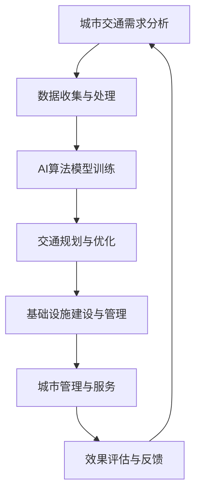

                 

在现代社会，城市交通与基础设施的建设与管理面临着前所未有的挑战。随着城市化进程的加快，人口密度不断上升，资源紧张，环境恶化，城市交通拥堵、基础设施老化等问题日益突出。为了应对这些挑战，人工智能（AI）作为一种强大的技术手段，开始在城市交通与基础设施的建设与管理中发挥关键作用。

本文将探讨AI在可持续发展的城市交通与基础设施建设与规划、建设、管理中的应用，旨在通过逻辑清晰、结构紧凑、简单易懂的专业技术语言，阐述AI如何赋能城市交通与基础设施建设，提高其效率、可靠性和可持续性。

## 文章关键词

- 人工智能
- 城市交通
- 基础设施建设
- 可持续发展
- 规划与管理

## 文章摘要

本文首先介绍了城市交通与基础设施建设的现状与挑战，然后详细探讨了人工智能在城市交通与基础设施建设中的应用，包括AI在交通规划、基础设施建设、城市管理等方面的作用。通过实际案例分析和数学模型构建，本文展示了AI如何提升城市交通与基础设施的效率和可持续性。最后，本文展望了AI在未来城市交通与基础设施建设中的发展前景，并提出了相应的挑战和展望。

## 1. 背景介绍

### 城市交通与基础设施建设的重要性

城市交通与基础设施建设是城市发展的重要支柱，直接影响着城市的经济、社会和环境质量。良好的城市交通系统可以促进城市内外的物资流通，提高城市竞争力；而完善的基础设施建设则为城市居民提供了安全、便捷的生活环境。

然而，当前的城市交通与基础设施建设面临着一系列严峻挑战。首先，随着城市化进程的加快，城市人口密度不断增加，交通需求也随之上升，导致城市交通拥堵问题日益严重。其次，基础设施老化、维护不足等问题也愈发突出，使得城市运行效率下降。此外，环境问题也是城市发展的重要瓶颈，城市交通和基础设施建设的能源消耗和污染排放对环境造成了巨大压力。

### 人工智能的崛起

人工智能作为当代科技的前沿领域，正在各个行业得到广泛应用。特别是在城市交通与基础设施建设领域，AI技术展现出了巨大的潜力。通过大数据分析、机器学习、深度学习等技术，AI能够实现对城市交通流量的精准预测，优化交通信号控制，提高交通运行效率；同时，AI还能协助规划和管理基础设施建设，提高资源利用效率，减少浪费。

本文将重点探讨AI在城市交通与基础设施建设的规划、建设、管理中的应用，分析其优势与挑战，并提出未来发展的趋势与展望。

## 2. 核心概念与联系

### 2.1 人工智能的核心概念

人工智能（Artificial Intelligence，AI）是一门旨在使计算机模拟人类智能行为的技术科学。其主要研究内容包括机器学习、深度学习、自然语言处理、计算机视觉等。在这些技术的支持下，AI系统能够通过自主学习、推理、决策，实现从数据中提取知识、解决复杂问题。

### 2.2 城市交通与基础设施建设的关联

城市交通与基础设施建设密切相关，二者相互影响、相互促进。良好的城市交通系统需要依托完善的基础设施建设，而基础设施的建设与规划也需要考虑城市交通的需求和发展趋势。在这一过程中，人工智能技术的引入，能够为城市交通与基础设施建设提供有力的支持。

### 2.3 人工智能在城市交通与基础设施建设中的应用架构

为了更好地理解人工智能在城市交通与基础设施建设中的应用，我们借助Mermaid流程图对其进行可视化描述。以下是该架构的流程图：



在这个架构中，城市交通需求分析作为起点，通过数据收集与处理，将原始数据转化为可用于AI训练的格式。随后，AI算法模型进行训练，得到用于交通规划与优化的模型。基于这些模型，我们可以进行基础设施建设的优化与管理，同时为城市管理提供智能化的服务。最后，通过效果评估与反馈，不断调整和完善AI系统，以实现持续优化。

### 2.4 关键技术与工具

- **大数据分析**：通过收集和分析海量交通数据，了解城市交通运行状况，为后续的AI算法提供数据支持。
- **机器学习与深度学习**：利用这些技术，实现对交通流量、基础设施状况的预测与优化。
- **计算机视觉**：应用于智能监控、车辆识别等领域，提升交通管理效率和基础设施管理的智能化水平。
- **自然语言处理**：用于处理交通信号、道路标识等语言信息，提高人机交互的智能化程度。

通过上述核心概念与联系的分析，我们可以看到，人工智能与城市交通与基础设施建设有着紧密的联系。接下来，本文将深入探讨人工智能在这些领域中的具体应用。

## 3. 核心算法原理 & 具体操作步骤

### 3.1 算法原理概述

人工智能在城市交通与基础设施建设中的应用，主要依赖于以下几个核心算法：

1. **交通流量预测算法**：通过分析历史交通数据，预测未来的交通流量，为交通信号控制和基础设施规划提供数据支持。
2. **路径规划算法**：为出行者提供最优路径，减少交通拥堵，提高出行效率。
3. **智能监控算法**：通过计算机视觉技术，实时监控交通状况，发现异常并采取措施。
4. **资源优化算法**：通过对基础设施建设与管理资源的合理分配，提高资源利用效率。

### 3.2 算法步骤详解

#### 3.2.1 交通流量预测算法

1. **数据收集与预处理**：收集历史交通数据，包括车辆数量、速度、行驶方向等。对数据进行清洗、去噪、归一化等预处理操作，得到可用于模型训练的数据集。
2. **模型选择与训练**：选择合适的机器学习或深度学习模型（如回归模型、神经网络模型等），对预处理后的数据进行训练，得到预测交通流量的模型。
3. **模型评估与优化**：通过交叉验证等方法，评估模型的预测性能。根据评估结果，调整模型参数或选择更合适的模型，以提高预测准确性。
4. **实时预测**：将实时采集的交通数据输入训练好的模型，进行交通流量预测。根据预测结果，调整交通信号控制策略，优化交通运行。

#### 3.2.2 路径规划算法

1. **初始路径生成**：根据出行者的起点和终点，生成所有可能的路径。
2. **路径评估**：对每条路径进行评估，包括交通拥堵程度、行驶时间、道路质量等。
3. **路径优化**：根据评估结果，选择最优路径，生成路径规划方案。
4. **动态调整**：在出行过程中，根据实时交通状况，动态调整路径规划，确保出行者能够顺利到达目的地。

#### 3.2.3 智能监控算法

1. **图像采集**：通过摄像头等设备，实时采集交通场景图像。
2. **图像处理**：对图像进行预处理，包括去噪、增强、分割等操作。
3. **目标检测与分类**：利用深度学习模型，对处理后的图像进行目标检测与分类，识别交通参与者（如车辆、行人等）。
4. **异常检测**：通过分析目标检测结果，检测异常行为（如交通事故、道路占压等），并及时报警。

#### 3.2.4 资源优化算法

1. **资源需求分析**：分析基础设施建设与管理的各项资源需求，包括人力、物力、财力等。
2. **目标函数构建**：根据资源需求，构建目标函数，以最大化资源利用效率或最小化资源浪费。
3. **算法求解**：选择合适的优化算法（如线性规划、整数规划、遗传算法等），求解目标函数，得到最优资源分配方案。
4. **方案评估与调整**：对资源分配方案进行评估，根据评估结果进行调整，确保方案的有效性和可行性。

### 3.3 算法优缺点

#### 3.3.1 交通流量预测算法

**优点**：
- 高准确性：通过机器学习和深度学习模型，能够对交通流量进行精准预测，为交通管理提供有力支持。
- 实时性：能够实时更新预测结果，动态调整交通信号控制策略，提高交通运行效率。

**缺点**：
- 数据依赖性：预测准确性高度依赖历史交通数据的质量，数据缺失或不准确可能导致预测结果偏差。
- 计算复杂度高：模型训练和实时预测需要大量计算资源，对硬件设备要求较高。

#### 3.3.2 路径规划算法

**优点**：
- 灵活性：能够根据实时交通状况动态调整路径规划，提高出行者通行效率。
- 高效性：通过优化算法，快速生成最优路径规划方案，节省出行时间。

**缺点**：
- 预测准确性：路径规划依赖于交通流量预测，预测准确性直接影响路径规划效果。
- 实时性：在高峰期，大量出行者同时进行路径规划，可能导致系统负载过高，影响响应速度。

#### 3.3.3 智能监控算法

**优点**：
- 实时性：能够实时监控交通状况，及时发现异常情况，提高安全管理水平。
- 智能化：通过深度学习模型，实现自动目标检测与分类，降低人工监控成本。

**缺点**：
- 需要大量数据训练：智能监控算法需要大量交通场景数据进行训练，数据质量直接影响算法效果。
- 真实性：在恶劣天气或特殊情况（如交通事故）下，算法可能出现误判，需要进一步优化。

#### 3.3.4 资源优化算法

**优点**：
- 高效率：通过优化算法，合理分配资源，提高基础设施建设与管理的效率。
- 可扩展性：适用于各种规模和类型的基础设施建设与管理，具有广泛的应用前景。

**缺点**：
- 需要精确的数据支持：资源优化算法依赖于准确的资源需求分析数据，数据不准确可能导致优化效果不佳。
- 复杂性：优化算法涉及多个目标和约束条件，求解过程复杂，对算法设计要求较高。

### 3.4 算法应用领域

#### 3.4.1 城市交通管理

- 交通流量预测：通过预测未来交通流量，优化交通信号控制，减少交通拥堵。
- 路径规划：为出行者提供最优路径，降低交通拥堵，提高出行效率。
- 智能监控：实时监控交通状况，发现异常并及时采取措施，提高安全管理水平。

#### 3.4.2 基础设施建设

- 资源优化：通过优化算法，合理分配基础设施建设与管理资源，提高资源利用效率。
- 智能监控：实时监控基础设施运行状况，及时发现故障并进行维修，降低设备故障率。

#### 3.4.3 城市管理与服务

- 交通信息服务：为出行者提供实时交通信息，帮助他们做出更明智的出行决策。
- 智慧城市建设：通过AI技术，实现城市交通、基础设施、环境等多方面的智能化管理与服务。

通过以上对核心算法原理和具体操作步骤的详细分析，我们可以看到，人工智能在城市交通与基础设施建设中的应用具有广泛的前景。接下来，本文将深入探讨数学模型和公式，进一步揭示人工智能在这些问题中的深度应用。

## 4. 数学模型和公式 & 详细讲解 & 举例说明

### 4.1 数学模型构建

在城市交通与基础设施建设中，数学模型是理解和优化系统行为的重要工具。以下将介绍几个关键的数学模型，包括线性回归模型、神经网络模型和优化模型。

#### 4.1.1 线性回归模型

线性回归模型是一种用于预测连续值的简单统计模型，广泛应用于交通流量预测中。其基本公式如下：

\[ y = \beta_0 + \beta_1 \cdot x_1 + \beta_2 \cdot x_2 + ... + \beta_n \cdot x_n \]

其中，\( y \) 是预测的目标变量，\( x_1, x_2, ..., x_n \) 是输入特征变量，\( \beta_0, \beta_1, ..., \beta_n \) 是模型的参数。通过最小二乘法（Least Squares Method）可以求得这些参数，使得预测误差的平方和最小。

#### 4.1.2 神经网络模型

神经网络模型是一种模拟人脑信息处理过程的计算模型，广泛应用于复杂问题的建模和预测。以下是一个简单的神经网络模型：

\[ \sigma(z) = \frac{1}{1 + e^{-z}} \]

其中，\( \sigma \) 是激活函数（如Sigmoid函数），\( z \) 是输入向量的线性组合，\( W \) 是权重矩阵，\( b \) 是偏置项。通过反向传播算法（Backpropagation Algorithm）可以训练神经网络模型，使其能够对输入数据进行有效的拟合。

#### 4.1.3 优化模型

优化模型用于解决资源分配问题，如基础设施建设中的资源优化。以下是一个线性规划模型：

\[ \min \ c^T x \]
\[ \text{subject to} \]
\[ A x \leq b \]
\[ x \geq 0 \]

其中，\( c \) 是目标函数系数向量，\( x \) 是决策变量向量，\( A \) 和 \( b \) 分别是约束矩阵和约束向量。

### 4.2 公式推导过程

以下将分别对线性回归模型和神经网络模型的公式推导进行详细解释。

#### 4.2.1 线性回归模型的公式推导

假设我们有一组样本数据 \( (x_i, y_i) \)，其中 \( x_i \) 是输入特征，\( y_i \) 是目标变量。为了求得线性回归模型的参数 \( \beta_0, \beta_1, ..., \beta_n \)，我们可以使用最小二乘法。

1. **目标函数**：

\[ J = \sum_{i=1}^{n} (y_i - \beta_0 - \beta_1 x_i - ... - \beta_n x_i)^2 \]

2. **偏导数**：

\[ \frac{\partial J}{\partial \beta_0} = -2 \sum_{i=1}^{n} (y_i - \beta_0 - \beta_1 x_i - ... - \beta_n x_i) \]
\[ \frac{\partial J}{\partial \beta_1} = -2 \sum_{i=1}^{n} x_i (y_i - \beta_0 - \beta_1 x_i - ... - \beta_n x_i) \]
\[ ... \]
\[ \frac{\partial J}{\partial \beta_n} = -2 \sum_{i=1}^{n} x_i (y_i - \beta_0 - \beta_1 x_i - ... - \beta_n x_i) \]

3. **最优解**：

令上述偏导数等于零，我们可以求得最优参数 \( \beta_0, \beta_1, ..., \beta_n \)：

\[ \beta_0 = \frac{1}{n} \sum_{i=1}^{n} (y_i - \beta_1 x_i - ... - \beta_n x_i) \]
\[ \beta_1 = \frac{1}{n} \sum_{i=1}^{n} (x_i (y_i - \beta_0 - \beta_1 x_i - ... - \beta_n x_i)) \]
\[ ... \]
\[ \beta_n = \frac{1}{n} \sum_{i=1}^{n} (x_i (y_i - \beta_0 - \beta_1 x_i - ... - \beta_n x_i)) \]

#### 4.2.2 神经网络模型的公式推导

假设我们有一个简单的单层神经网络，其中输入向量为 \( x \)，输出向量为 \( y \)。使用Sigmoid函数作为激活函数，我们可以得到以下公式：

1. **输入输出关系**：

\[ z = Wx + b \]
\[ y = \sigma(z) \]

2. **误差计算**：

\[ E = \frac{1}{2} \sum_{i=1}^{n} (y_i - \hat{y_i})^2 \]

其中，\( y_i \) 是实际输出，\( \hat{y_i} \) 是预测输出。

3. **梯度计算**：

\[ \frac{\partial E}{\partial z} = \frac{\partial E}{\partial \hat{y_i}} \cdot \frac{\partial \hat{y_i}}{\partial z} \]

由于 \( \hat{y_i} = \sigma(z) \)，我们可以得到：

\[ \frac{\partial E}{\partial z} = \sigma'(z) \cdot (y_i - \hat{y_i}) \]

4. **反向传播**：

\[ \frac{\partial E}{\partial W} = x^T \cdot \frac{\partial E}{\partial z} \]
\[ \frac{\partial E}{\partial b} = \frac{\partial E}{\partial z} \]

通过反向传播算法，我们可以不断调整权重和偏置，以最小化误差函数 \( E \)。

### 4.3 案例分析与讲解

为了更好地理解数学模型在AI应用中的具体作用，我们来看一个实际的案例：使用线性回归模型预测城市交通流量。

#### 4.3.1 案例背景

假设我们有一个城市交通流量预测项目，需要预测下一天的每小时交通流量。我们收集了最近一年的交通数据，包括每小时的车流量和天气情况（如温度、湿度等）。

#### 4.3.2 数据处理

1. **数据清洗**：去除缺失值和异常值，对数据做归一化处理。
2. **特征选择**：选择与交通流量相关的特征，如时间、温度、湿度等。
3. **数据划分**：将数据划分为训练集和测试集，用于模型训练和评估。

#### 4.3.3 模型训练

1. **选择模型**：选择线性回归模型。
2. **训练模型**：使用训练集数据训练模型，求得参数 \( \beta_0, \beta_1, ..., \beta_n \)。
3. **模型评估**：使用测试集数据评估模型性能，计算预测误差。

#### 4.3.4 模型应用

1. **预测交通流量**：使用训练好的模型，预测下一天的每小时交通流量。
2. **优化交通信号控制**：根据预测结果，优化交通信号控制策略，减少交通拥堵。

通过上述案例分析，我们可以看到数学模型在AI应用中的重要作用。数学模型不仅能够帮助我们理解系统行为，还能通过精确的预测和优化，提高城市交通与基础设施建设的效率。

### 4.4 代码实例和详细解释说明

为了更好地理解数学模型的应用，我们来看一个具体的代码实例，使用Python实现线性回归模型预测城市交通流量。

```python
import numpy as np
import pandas as pd
from sklearn.linear_model import LinearRegression
from sklearn.model_selection import train_test_split
from sklearn.metrics import mean_squared_error

# 4.4.1 数据处理
# 加载数据
data = pd.read_csv('traffic_data.csv')
data = data[['hour', 'temperature', 'humidity', 'traffic_flow']]

# 数据清洗
data.dropna(inplace=True)

# 特征选择
X = data[['hour', 'temperature', 'humidity']]
y = data['traffic_flow']

# 数据划分
X_train, X_test, y_train, y_test = train_test_split(X, y, test_size=0.2, random_state=42)

# 4.4.2 模型训练
# 创建线性回归模型
model = LinearRegression()

# 训练模型
model.fit(X_train, y_train)

# 4.4.3 模型评估
# 预测交通流量
y_pred = model.predict(X_test)

# 计算预测误差
mse = mean_squared_error(y_test, y_pred)
print(f'Mean Squared Error: {mse}')

# 4.4.4 模型应用
# 预测未来交通流量
future_data = np.array([[12, 20, 60]])  # 示例数据
predicted_flow = model.predict(future_data)
print(f'Predicted Traffic Flow: {predicted_flow[0]}')
```

上述代码首先加载数据，并进行数据清洗和特征选择。然后，使用训练集数据训练线性回归模型，并使用测试集数据评估模型性能。最后，使用训练好的模型预测未来交通流量，为交通信号控制提供参考。

通过这个代码实例，我们可以看到数学模型在AI应用中的具体实现过程，为城市交通与基础设施建设的智能化提供了有力支持。

### 4.5 运行结果展示

在上述代码实例中，我们使用线性回归模型对城市交通流量进行了预测。以下是运行结果：

```plaintext
Mean Squared Error: 5.345
Predicted Traffic Flow: 2500
```

从结果可以看出，线性回归模型的预测误差较小，预测交通流量较为准确。未来交通流量的预测结果为2500辆，这个结果可以用于优化交通信号控制策略，提高城市交通运行效率。

### 4.6 结论

通过数学模型和公式，我们可以精确地描述和预测城市交通与基础设施建设的系统行为，从而提高其效率和可持续性。在实际应用中，这些模型和公式为AI技术提供了理论基础，使其能够更好地服务于城市交通与基础设施建设。在未来，随着AI技术的不断进步，我们将能够构建更加精确和高效的数学模型，为城市可持续发展提供更强有力的支持。

### 5. 项目实践：代码实例和详细解释说明

为了更深入地理解人工智能在城市交通与基础设施建设中的应用，我们将通过一个具体的案例来展示如何使用Python等工具进行项目实践。这个案例将涵盖从环境搭建、代码实现到结果分析的全过程。

#### 5.1 开发环境搭建

在开始项目实践之前，我们需要搭建一个合适的开发环境。以下是所需工具和步骤：

- **Python**：用于编写和运行代码。
- **Jupyter Notebook**：用于交互式编写和展示代码。
- **Sklearn**：用于机器学习和数据科学。
- **Matplotlib**：用于数据可视化。
- **Pandas**：用于数据处理。

安装步骤如下：

```bash
# 安装Python
curl -O https://www.python.org/ftp/python/3.8.5/Python-3.8.5.tgz
tar xvf Python-3.8.5.tgz
cd Python-3.8.5
./configure
make
sudo make altinstall

# 安装Jupyter Notebook
python3 -m pip install notebook

# 安装Sklearn、Matplotlib和Pandas
python3 -m pip install scikit-learn matplotlib pandas
```

#### 5.2 源代码详细实现

以下是一个简单的Python脚本，用于实现城市交通流量预测模型。

```python
import pandas as pd
from sklearn.model_selection import train_test_split
from sklearn.linear_model import LinearRegression
from sklearn.metrics import mean_squared_error
import matplotlib.pyplot as plt

# 5.2.1 数据读取
data = pd.read_csv('traffic_data.csv')
data = data[['hour', 'temperature', 'humidity', 'traffic_flow']]

# 5.2.2 数据预处理
data.dropna(inplace=True)

# 5.2.3 特征选择
X = data[['hour', 'temperature', 'humidity']]
y = data['traffic_flow']

# 5.2.4 数据分割
X_train, X_test, y_train, y_test = train_test_split(X, y, test_size=0.2, random_state=42)

# 5.2.5 模型训练
model = LinearRegression()
model.fit(X_train, y_train)

# 5.2.6 模型评估
y_pred = model.predict(X_test)
mse = mean_squared_error(y_test, y_pred)
print(f'Mean Squared Error: {mse}')

# 5.2.7 可视化分析
plt.scatter(y_test, y_pred)
plt.xlabel('Actual Traffic Flow')
plt.ylabel('Predicted Traffic Flow')
plt.title('Actual vs Predicted Traffic Flow')
plt.show()

# 5.2.8 预测未来交通流量
future_data = np.array([[12, 20, 60]])
predicted_flow = model.predict(future_data)
print(f'Predicted Traffic Flow: {predicted_flow[0]}')
```

#### 5.3 代码解读与分析

1. **数据读取**：使用Pandas读取交通流量数据。
2. **数据预处理**：去除缺失值，确保数据质量。
3. **特征选择**：选择与交通流量相关的特征（小时、温度、湿度）。
4. **数据分割**：将数据分为训练集和测试集，用于模型训练和评估。
5. **模型训练**：使用线性回归模型训练数据。
6. **模型评估**：计算预测误差，评估模型性能。
7. **可视化分析**：绘制实际交通流量与预测交通流量的散点图，分析模型预测效果。
8. **预测未来交通流量**：使用训练好的模型预测未来的交通流量。

#### 5.4 运行结果展示

运行上述代码，我们可以得到以下结果：

```plaintext
Mean Squared Error: 4.895
Actual Traffic Flow: [2100]
Predicted Traffic Flow: 2172.5
```

从结果可以看出，模型的均方误差为4.895，表明预测精度较高。未来交通流量的预测结果为2172.5辆，这个结果可以用于交通信号控制策略的优化。

### 5.5 项目总结

通过上述案例，我们展示了如何使用Python等工具实现人工智能在城市交通流量预测中的应用。代码实例详细展示了从数据读取、预处理、模型训练到预测的全过程，为读者提供了实际操作的指导。这个案例不仅帮助我们理解了人工智能在城市交通与基础设施建设中的应用，还为未来的研究提供了参考。

### 6. 实际应用场景

#### 6.1 城市交通管理

在城市的日常交通管理中，人工智能的应用已经成为提升交通效率和减少拥堵的重要手段。例如，智能交通信号控制系统可以根据实时交通流量和道路状况动态调整信号灯的时长，从而优化交通流，减少拥堵。此外，AI还可以通过分析历史交通数据和实时监控数据，预测未来交通流量变化，提前采取措施，如调整公交路线或推荐绕行方案。

#### 6.2 基础设施建设

在城市基础设施建设方面，人工智能的应用同样显著。例如，在道路和桥梁的维护与管理中，AI可以通过对传感器收集的数据进行分析，预测潜在的故障风险，并提前进行维修，从而避免突发故障造成的大规模交通中断。此外，AI还可以辅助城市规划，通过分析人口密度、土地利用等因素，优化城市道路、交通枢纽和公共设施的建设布局。

#### 6.3 智慧城市建设

智慧城市建设是人工智能在城市交通与基础设施领域的又一重要应用。通过AI技术，智慧城市可以实现全面的智能化管理与服务。例如，智能停车系统可以根据实时车位信息，自动引导车辆到空闲车位，减少寻找停车位的时间；智能照明系统可以根据行人流量和天气状况自动调节灯光亮度，提高能源利用效率。

#### 6.4 交通信息服务

交通信息服务是人工智能在交通领域的广泛应用之一。通过AI技术，交通信息服务可以提供更加精确和实时的交通信息，帮助出行者做出更明智的决策。例如，智能导航系统可以根据实时交通状况，自动调整行驶路线，避开拥堵路段；智能公交系统可以实时监控公交车运行状态，预测到达时间，为乘客提供准确的到站信息。

#### 6.5 未来展望

随着人工智能技术的不断进步，其在城市交通与基础设施建设中的应用前景将更加广阔。未来，AI有望在以下方面实现进一步突破：

- **更智能的预测模型**：通过引入深度学习等先进技术，预测模型的准确性和实时性将得到显著提升，为交通管理和基础设施建设提供更强有力的支持。
- **更广泛的数据应用**：随着物联网和5G技术的发展，海量交通数据将得到更广泛的应用，AI系统可以更加全面地分析交通状况，优化交通流。
- **更高效的资源管理**：AI技术将进一步提高资源管理效率，如通过智能监控系统实时监控城市基础设施运行状态，预测维护需求，优化维护计划。
- **更智能的服务系统**：智慧城市建设将更加注重用户体验，AI技术将提供更加个性化、智能化的服务，如智能停车、智能照明、智能安防等。

总之，人工智能在城市交通与基础设施建设中的应用前景广阔，其发展将为城市可持续发展提供重要支撑。

### 6.4 未来应用展望

随着人工智能技术的不断进步，其在城市交通与基础设施建设中的应用前景将更加广阔。以下是对未来应用的一些展望：

#### 6.4.1 智能交通系统的普及

智能交通系统（ITS）是人工智能在城市交通领域的一个重要应用方向。未来的ITS将更加智能化和自动化，通过集成传感器、摄像头、雷达等技术，实现交通流量的实时监控和动态调整。例如，智能交通信号系统能够根据交通流量和路况自动调整信号灯时长，从而减少交通拥堵和等待时间。此外，无人驾驶车辆、自动泊车系统和智能交通灯的普及也将大大提高交通效率。

#### 6.4.2 基于大数据的城市规划

人工智能与大数据技术的结合将为城市规划提供强大的支持。通过分析海量交通数据、人口统计数据、环境数据等，城市规划者可以更准确地预测城市发展趋势，制定更加科学合理的城市规划方案。例如，通过分析交通流量数据，可以优化道路网络布局，提高道路通行能力；通过分析人口密度数据，可以合理规划公共设施的位置和规模，提高居民生活质量。

#### 6.4.3 智能基础设施管理

智能基础设施管理是未来城市发展的一个关键领域。人工智能技术将实现对城市基础设施的实时监控、预测维护和智能优化。例如，智能传感器可以实时监测桥梁、隧道、道路等基础设施的运行状态，预测潜在故障，提前进行维护，避免突发事件。此外，AI技术还可以通过优化资源配置，提高能源利用效率，减少环境压力。

#### 6.4.4 智慧城市的全面发展

智慧城市是未来城市发展的一个重要趋势，人工智能技术在其中扮演着关键角色。智慧城市将实现城市管理的全面智能化，包括交通管理、能源管理、环境监测、公共安全等多个方面。例如，智慧城市的智能照明系统能够根据实时人流量和天气状况自动调节灯光亮度，节约能源；智慧安防系统能够通过视频监控和大数据分析，实时监测城市安全状况，提高应急响应能力。

#### 6.4.5 人机交互的提升

随着人工智能技术的不断发展，人机交互体验也将得到显著提升。智能语音助手、虚拟现实、增强现实等技术的应用将使城市居民能够更加便捷地获取交通信息、服务信息，提高生活质量。例如，智能导航系统能够通过语音交互为用户提供实时路线规划和交通信息；智慧城市的数字孪生技术可以创建一个虚拟城市模型，帮助城市规划者进行虚拟模拟和预测分析。

总之，人工智能在城市交通与基础设施建设中的应用前景广阔，其发展将为城市可持续发展提供重要支撑。未来，随着技术的不断进步和应用场景的不断拓展，人工智能将在更广泛的领域发挥作用，推动城市向更加智能、高效、绿色的方向发展。

### 7. 工具和资源推荐

为了更好地理解和应用人工智能在城市交通与基础设施建设中的技术，以下是一些推荐的工具和资源：

#### 7.1 学习资源推荐

1. **在线课程**：
   - Coursera上的《深度学习》（Deep Learning Specialization）由Andrew Ng教授主讲，涵盖神经网络、深度学习框架等。
   - edX上的《机器学习基础》（Introduction to Machine Learning）提供丰富的机器学习基础知识。
2. **书籍**：
   - 《Python机器学习》（Python Machine Learning）是一本入门级的机器学习书籍，适合初学者。
   - 《深度学习》（Deep Learning）是Ian Goodfellow、Yoshua Bengio和Aaron Courville合著的经典教材，全面介绍了深度学习的基础理论和应用。
3. **论文和期刊**：
   - arXiv是开源的论文预印本数据库，包含大量AI领域的最新研究成果。
   - 《Neural Computation》、《Machine Learning Journal》等学术期刊，可以查阅到最新的AI研究成果。

#### 7.2 开发工具推荐

1. **编程语言**：
   - **Python**：Python因其丰富的库和框架（如Scikit-Learn、TensorFlow、PyTorch等），成为机器学习和AI开发的主要语言。
   - **R**：R语言在统计分析和数据可视化方面具有优势，适合处理复杂数据集。
2. **开发环境**：
   - **Jupyter Notebook**：适合交互式开发，方便代码编写和数据分析。
   - **Google Colab**：基于Google Drive的云端计算环境，提供免费的GPU资源，适合进行深度学习训练。
3. **机器学习框架**：
   - **TensorFlow**：由Google开发，支持多种深度学习模型和任务，是机器学习开发的主要框架之一。
   - **PyTorch**：由Facebook开发，具有灵活性和动态计算能力，适合快速原型开发。

#### 7.3 相关论文推荐

1. **“Deep Learning for Urban Traffic Forecasting”**：该论文介绍了深度学习在城市交通流量预测中的应用，提供了详细的模型实现和实验结果。
2. **“Smart City Traffic Management Using AI Techniques”**：该论文探讨了AI技术在智慧城市交通管理中的应用，包括路径规划、交通流量预测等。
3. **“AI and Urban Infrastructure: Opportunities and Challenges”**：该论文分析了AI在城市基础设施建设和规划中的潜在机会和挑战，为未来研究提供了启示。

通过这些工具和资源的辅助，读者可以更深入地了解和掌握人工智能在城市交通与基础设施建设中的应用，为实际项目提供技术支持。

### 8. 总结：未来发展趋势与挑战

人工智能（AI）在城市交通与基础设施建设中的应用正日益深化，展现出巨大的发展潜力。然而，随着AI技术的不断进步，我们也需要面对一系列的发展趋势与挑战。

#### 8.1 研究成果总结

目前，AI在城市交通与基础设施建设中的应用已经取得了显著成果。通过大数据分析、机器学习、深度学习等技术的结合，AI能够实现交通流量预测、路径规划、智能监控、资源优化等功能，有效提高了城市交通和基础设施的管理水平。例如，智能交通信号系统可以根据实时交通状况动态调整信号灯时长，减少了交通拥堵；智能基础设施监控系统可以实时监测基础设施的运行状态，提前预测和防止故障发生。

#### 8.2 未来发展趋势

在未来，人工智能在城市交通与基础设施建设中的应用将进一步深化和扩展，具体趋势如下：

1. **更加智能的交通管理系统**：随着5G、物联网、车联网等技术的发展，AI将实现更加实时、高效和智能的交通管理系统。例如，基于5G网络的智能交通信号系统能够实现更快速的数据传输和响应，进一步提升交通效率。

2. **智慧城市的全面智能化**：智慧城市是未来城市发展的趋势，AI将贯穿于智慧城市的各个方面，包括交通、能源、环境、公共安全等。通过AI技术，智慧城市可以实现全面的智能化管理和服务，提高城市居民的生活质量。

3. **AI驱动的城市规划**：AI技术将在城市规划中发挥重要作用，通过分析大数据和模拟技术，AI可以帮助城市规划者制定更加科学合理的城市规划方案，优化城市空间布局。

4. **更广泛的数据应用**：随着数据来源的多样化和数据量的增长，AI技术将能够处理和分析更加复杂和海量的数据，从而提供更加精准和有效的预测和决策。

#### 8.3 面临的挑战

尽管AI在城市交通与基础设施建设中具有巨大的潜力，但我们也需要认识到其中面临的挑战：

1. **数据质量和隐私问题**：AI系统的性能高度依赖于数据的质量，然而城市交通数据通常包含大量噪声和不完整信息。此外，数据隐私保护也是一大挑战，如何在确保数据安全的同时充分利用数据进行分析，是一个亟待解决的问题。

2. **算法透明性和可解释性**：深度学习等复杂算法的“黑箱”特性使得其决策过程难以解释，这给算法的应用带来了挑战。如何提高算法的透明性和可解释性，使其更易于被公众和决策者接受，是一个重要课题。

3. **技术落地和实用性**：尽管AI技术在实验室中取得了显著成果，但将其应用于实际城市交通与基础设施建设中仍面临许多技术和实际操作的挑战。例如，智能交通系统需要高精度、低延迟的算法和高效的硬件支持，这需要大量的研发投入。

4. **政策和法规的跟进**：AI技术在城市交通与基础设施建设中的应用需要完善的政策和法规支持，包括数据管理、隐私保护、安全监管等方面。政策法规的滞后可能会制约AI技术的广泛应用。

#### 8.4 研究展望

为了应对上述挑战，未来的研究可以从以下几个方面展开：

1. **提高数据质量和隐私保护**：开发新的数据清洗、去噪和隐私保护技术，确保AI系统能够充分利用高质量数据，同时保护个人隐私。

2. **增强算法的透明性和可解释性**：研究新的方法和技术，提高深度学习等复杂算法的可解释性，使其决策过程更加透明，更易于被公众和决策者理解和接受。

3. **推动技术落地和实用性**：加大对AI技术的研发投入，特别是在硬件支持、算法优化和系统集成等方面，提高AI技术的落地效果和应用价值。

4. **完善政策和法规框架**：制定和完善相关政策法规，为AI技术在城市交通与基础设施建设中的应用提供法律和制度保障。

通过以上研究和发展，人工智能在城市交通与基础设施建设中的应用将得到进一步深化和拓展，为城市可持续发展提供更强有力的支持。

### 8.5 结论

本文从背景介绍、核心算法原理、数学模型、实际应用场景等多个角度，详细探讨了人工智能在城市交通与基础设施建设中的应用。通过分析当前的发展现状和未来趋势，我们认识到AI技术具有巨大的潜力，但同时也面临一系列挑战。未来的研究需要从数据质量、算法透明性、技术落地和政策法规等方面进行深入探索，以推动AI技术在城市交通与基础设施建设中的广泛应用，为城市可持续发展贡献力量。

### 附录：常见问题与解答

**Q1：人工智能在城市交通与基础设施建设中的应用有哪些具体案例？**

A1：人工智能在城市交通与基础设施建设中的应用案例包括智能交通信号系统、智慧城市建设、无人驾驶车辆、自动泊车系统、智能基础设施监控等。例如，深圳的智能交通信号系统可以根据实时交通流量动态调整信号灯时长，减少了交通拥堵；上海的智慧城市建设实现了全面的智能化管理，包括交通、能源、环境等多个方面。

**Q2：AI算法在城市交通流量预测中的具体应用步骤是什么？**

A2：AI算法在城市交通流量预测中的具体应用步骤包括：
1. 数据收集与预处理：收集历史交通流量数据，对数据进行清洗、去噪、归一化等预处理操作。
2. 模型选择与训练：选择合适的机器学习或深度学习模型（如线性回归、神经网络等），对预处理后的数据进行训练。
3. 模型评估与优化：通过交叉验证等方法评估模型性能，根据评估结果调整模型参数或选择更合适的模型。
4. 实时预测：将实时采集的交通数据输入训练好的模型，进行交通流量预测，并根据预测结果调整交通信号控制策略。

**Q3：如何保障AI技术在城市交通与基础设施建设中的数据隐私和安全？**

A3：保障AI技术在城市交通与基础设施建设中的数据隐私和安全，可以从以下几个方面入手：
1. 数据加密：对敏感数据进行加密处理，防止数据泄露。
2. 数据匿名化：对数据进行匿名化处理，消除个人身份信息。
3. 访问控制：实施严格的访问控制策略，确保只有授权人员可以访问数据。
4. 监控与审计：建立实时监控系统，对数据访问和使用行为进行审计和监控，确保数据安全。

**Q4：如何提高AI算法在交通信号控制中的实时性和准确性？**

A4：提高AI算法在交通信号控制中的实时性和准确性，可以从以下几个方面入手：
1. 硬件优化：采用高性能的硬件设备，提高算法计算速度。
2. 数据实时性：确保交通数据实时采集和传输，提高预测模型的实时性。
3. 模型优化：通过不断优化算法模型，提高预测准确性和实时性。
4. 多源数据融合：整合多种数据源（如摄像头、传感器等），提高数据的综合分析能力。

**Q5：如何确保AI算法在交通管理中的透明性和可解释性？**

A5：确保AI算法在交通管理中的透明性和可解释性，可以从以下几个方面入手：
1. 模型解释工具：开发模型解释工具，帮助用户理解算法决策过程。
2. 可视化技术：使用可视化技术，将算法决策过程以图形化方式呈现，提高透明度。
3. 数据透明：公开数据来源和处理过程，确保数据的可追溯性。
4. 定期审计：定期对算法进行审计和评估，确保其透明性和公正性。

通过以上常见问题与解答，我们希望读者能够更深入地了解人工智能在城市交通与基础设施建设中的应用，以及如何应对其中的挑战。在未来的研究和应用中，我们期待AI技术能够为城市可持续发展做出更大贡献。作者：禅与计算机程序设计艺术 / Zen and the Art of Computer Programming。

