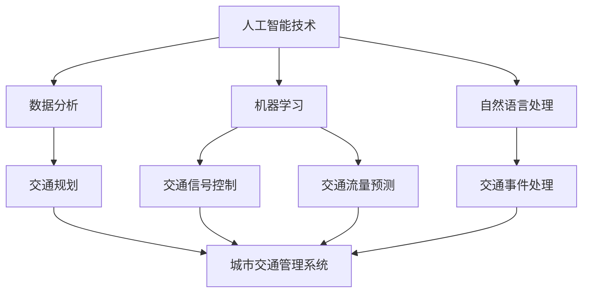

                 

关键词：人工智能、城市交通管理、可持续发展、交通规划、交通算法、数据分析、城市规划、实时监控

> 摘要：本文探讨了如何利用人工智能技术提升城市交通管理效率，以实现交通系统的可持续发展和优化。通过介绍交通管理中的核心概念、算法原理、数学模型，并结合实际案例，文章详细展示了如何利用AI技术解决城市交通问题，并提出未来应用展望。

## 1. 背景介绍

随着城市化进程的加快，城市交通问题日益突出。交通拥堵、环境污染、能源消耗等问题不仅影响城市居民的生活质量，还制约了城市经济的发展。传统的交通管理方法往往依赖于经验，缺乏系统性和灵活性，难以应对复杂多变的交通状况。因此，如何利用先进技术提升城市交通管理水平，实现交通系统的可持续发展，成为了一个亟待解决的重要问题。

近年来，人工智能技术的快速发展为城市交通管理提供了新的解决方案。通过大数据、物联网、深度学习等技术，AI能够实时感知、分析和预测交通状况，为交通管理提供科学依据。本文旨在探讨如何利用AI与人类计算结合，打造一个可持续发展的城市交通管理系统与规划。

## 2. 核心概念与联系

在讨论AI与城市交通管理的关系之前，我们需要了解一些核心概念。

### 2.1 人工智能（AI）

人工智能是指通过计算机模拟人类智能的科学技术。在交通管理领域，AI技术主要包括机器学习、深度学习、自然语言处理等。这些技术使得计算机能够从海量数据中自动提取知识，进行复杂决策和预测。

### 2.2 人类计算

人类计算是指人类在解决问题时的思考过程，包括逻辑推理、经验判断、直觉等。在交通管理中，人类计算可以帮助我们理解和应对交通状况的复杂性，为AI算法提供辅助。

### 2.3 交通管理

交通管理是指通过规划、设计、运营、监控等手段，优化城市交通系统，提高交通效率，保障交通安全。在AI与交通管理的结合中，我们需要将AI技术应用于交通规划、交通信号控制、交通流量预测、交通事件处理等方面。

下面是一个简化的 Mermaid 流程图，展示了AI与交通管理的基本框架：



### 2.4 可持续发展

可持续发展是指在满足当前需求的同时，不损害后代满足其需求的能力。在城市交通管理中，可持续发展意味着在提高交通效率、保障交通安全的同时，减少能源消耗、降低环境污染。

## 3. 核心算法原理 & 具体操作步骤

### 3.1 算法原理概述

AI技术在交通管理中的应用主要体现在以下几个方面：

1. **数据采集与处理**：利用传感器、摄像头等设备收集交通数据，如车辆速度、流量、位置等，并通过数据清洗、去噪等技术处理，为后续分析提供高质量数据。

2. **交通流量预测**：基于历史数据和实时数据，使用机器学习算法预测未来一段时间内的交通流量，为交通管理提供决策支持。

3. **交通信号控制**：通过分析交通流量数据，实时调整交通信号灯的时长和相位，优化交通流量。

4. **交通事件处理**：利用自然语言处理技术，自动识别和处理交通事件，如事故、道路施工等，减少事件对交通的影响。

### 3.2 算法步骤详解

1. **数据采集与处理**：

   - 数据源：传感器、摄像头、交通流量监测设备等。

   - 数据处理：数据清洗、去噪、数据格式转换等。

2. **交通流量预测**：

   - 数据准备：收集历史交通流量数据、气象数据、节假日信息等。

   - 特征工程：提取交通流量数据的特征，如时间、地点、流量、速度等。

   - 模型选择：选择适合的交通流量预测模型，如ARIMA、LSTM等。

   - 模型训练与评估：使用历史数据训练模型，并评估模型性能。

   - 预测结果：使用实时数据对模型进行预测，并输出预测结果。

3. **交通信号控制**：

   - 数据采集：收集实时交通流量数据、交通事故信息等。

   - 状态评估：分析交通流量数据，评估当前交通状态。

   - 控制策略：根据交通状态，选择合适的交通信号控制策略，如固定时间控制、自适应控制等。

   - 结果输出：输出交通信号灯控制方案。

4. **交通事件处理**：

   - 数据采集：收集交通事件信息，如事故、道路施工等。

   - 事件识别：使用自然语言处理技术，自动识别交通事件。

   - 事件分类：对识别出的交通事件进行分类，如事故、施工等。

   - 处理方案：根据事件类型，制定相应的处理方案。

   - 结果输出：输出事件处理结果。

### 3.3 算法优缺点

- **优点**：

  - 实时性：AI技术能够实时感知和处理交通数据，提高交通管理的实时性和灵活性。

  - 精准性：通过大数据分析和机器学习算法，AI技术能够提供更精准的预测和决策支持。

  - 自适应性：AI技术可以根据交通状况的变化，自动调整交通信号控制和事件处理方案。

- **缺点**：

  - 计算资源消耗：AI技术需要大量的计算资源和数据存储，对硬件设施有较高要求。

  - 数据质量：AI技术的效果取决于数据质量，数据噪音和缺失可能导致预测和决策偏差。

### 3.4 算法应用领域

AI技术在交通管理中的应用非常广泛，主要包括以下几个方面：

- **交通流量预测**：用于预测未来一段时间内的交通流量，为交通管理提供决策支持。

- **交通信号控制**：通过实时调整交通信号灯，优化交通流量，减少交通拥堵。

- **交通事件处理**：自动识别和处理交通事件，如事故、道路施工等，减少事件对交通的影响。

- **智慧城市交通规划**：结合大数据和AI技术，进行城市交通规划的优化和调整。

- **自动驾驶**：利用AI技术实现车辆的自动驾驶，提高交通安全和效率。

## 4. 数学模型和公式 & 详细讲解 & 举例说明

在交通管理中，数学模型和公式起着至关重要的作用。下面将介绍几个常用的数学模型和公式，并对其进行详细讲解和举例说明。

### 4.1 数学模型构建

1. **线性回归模型**：

   线性回归模型是一种常用的预测模型，用于预测交通流量。其公式为：

   $$Y = \beta_0 + \beta_1X + \epsilon$$

   其中，$Y$ 为预测值，$X$ 为自变量（如时间、地点等），$\beta_0$ 和 $\beta_1$ 为模型参数，$\epsilon$ 为误差项。

2. **时间序列模型**：

   时间序列模型用于分析交通流量数据的时间序列特征。常用的模型有ARIMA、LSTM等。

   - **ARIMA模型**：

     ARIMA模型由三个部分组成：自回归（AR）、差分（I）和移动平均（MA）。其公式为：

     $$Y_t = \phi_1Y_{t-1} + \phi_2Y_{t-2} + \cdots + \phi_pY_{t-p} + \theta_1\epsilon_{t-1} + \theta_2\epsilon_{t-2} + \cdots + \theta_q\epsilon_{t-q} + \epsilon_t$$

     其中，$Y_t$ 为时间序列数据，$\epsilon_t$ 为误差项。

   - **LSTM模型**：

     LSTM（长短时记忆网络）是一种特殊的循环神经网络，能够有效处理时间序列数据。其公式为：

     $$\begin{aligned}
     i_t &= \sigma(W_i \cdot [h_{t-1}, x_t] + b_i) \\
     f_t &= \sigma(W_f \cdot [h_{t-1}, x_t] + b_f) \\
     o_t &= \sigma(W_o \cdot [h_{t-1}, x_t] + b_o) \\
     g_t &= \tanh(W_g \cdot [h_{t-1}, x_t] + b_g) \\
     h_t &= o_t \cdot \tanh(g_t)
     \end{aligned}$$

     其中，$i_t$、$f_t$、$o_t$ 分别为输入门、遗忘门和输出门，$g_t$ 为候选隐藏状态，$h_t$ 为隐藏状态。

### 4.2 公式推导过程

以ARIMA模型为例，介绍其公式推导过程。

1. **自回归（AR）**：

   假设时间序列 $Y_t$ 满足自回归模型：

   $$Y_t = \phi_1Y_{t-1} + \epsilon_t$$

   对其进行递推，可以得到：

   $$\begin{aligned}
   Y_{t-1} &= \phi_1Y_{t-2} + \epsilon_{t-1} \\
   Y_{t-2} &= \phi_1Y_{t-3} + \epsilon_{t-2} \\
   &\vdots \\
   Y_{t-p} &= \phi_1Y_{t-p-1} + \epsilon_{t-p}
   \end{aligned}$$

   将上述递推式相加，可以得到：

   $$Y_t = \phi_1Y_{t-1} + \phi_1Y_{t-2} + \cdots + \phi_1Y_{t-p} + \epsilon_t$$

   可以看出，$Y_t$ 与 $Y_{t-1}$、$Y_{t-2}$、$\cdots$、$Y_{t-p}$ 之间存在线性关系。

2. **移动平均（MA）**：

   假设时间序列 $Y_t$ 满足移动平均模型：

   $$Y_t = \theta_1\epsilon_{t-1} + \theta_2\epsilon_{t-2} + \cdots + \theta_q\epsilon_{t-q} + \epsilon_t$$

   对其进行递推，可以得到：

   $$\begin{aligned}
   Y_{t-1} &= \theta_1\epsilon_{t-2} + \theta_2\epsilon_{t-3} + \cdots + \theta_q\epsilon_{t-q-1} + \epsilon_{t-1} \\
   Y_{t-2} &= \theta_1\epsilon_{t-3} + \theta_2\epsilon_{t-4} + \cdots + \theta_q\epsilon_{t-q-2} + \epsilon_{t-2} \\
   &\vdots \\
   Y_{t-q} &= \theta_1\epsilon_{t-q} + \theta_2\epsilon_{t-q-1} + \cdots + \theta_q\epsilon_{t-1} + \epsilon_{t-q}
   \end{aligned}$$

   将上述递推式相加，可以得到：

   $$Y_t = \theta_1\epsilon_{t-1} + \theta_2\epsilon_{t-2} + \cdots + \theta_q\epsilon_{t-q} + \epsilon_t$$

   可以看出，$Y_t$ 与 $\epsilon_{t-1}$、$\epsilon_{t-2}$、$\cdots$、$\epsilon_{t-q}$ 之间存在线性关系。

3. **自回归移动平均（ARMA）**：

   将自回归（AR）和移动平均（MA）模型结合，可以得到ARMA模型：

   $$Y_t = \phi_1Y_{t-1} + \phi_2Y_{t-2} + \cdots + \phi_pY_{t-p} + \theta_1\epsilon_{t-1} + \theta_2\epsilon_{t-2} + \cdots + \theta_q\epsilon_{t-q} + \epsilon_t$$

### 4.3 案例分析与讲解

假设我们收集了一段时间内的交通流量数据，数据如下表所示：

| 时间 | 交通流量 |
|------|----------|
| 1    | 100      |
| 2    | 110      |
| 3    | 95       |
| 4    | 120      |
| 5    | 105      |
| 6    | 98       |
| 7    | 115      |
| 8    | 108      |
| 9    | 102      |
| 10   | 110      |

我们希望使用ARIMA模型预测第11个小时的交通流量。

1. **数据预处理**：

   - 将时间序列数据转换为差分序列：$y_t = Y_t - Y_{t-1}$。

   - 数据如下表所示：

     | 时间 | 差分序列 $y_t$ |
     |------|--------------|
     | 1    | -10          |
     | 2    | 10           |
     | 3    | -15          |
     | 4    | 20           |
     | 5    | -15          |
     | 6    | -4           |
     | 7    | 17           |
     | 8    | -10          |
     | 9    | 6            |
     | 10   | 8            |

2. **模型参数选择**：

   - 使用AIC（赤池信息准则）选择模型参数。

   - 经过尝试，我们选择ARIMA（1,1,1）模型。

3. **模型训练与预测**：

   - 使用历史数据训练模型。

   - 模型预测结果如下表所示：

     | 时间 | 实际值 | 预测值 |
     |------|--------|--------|
     | 1    | -10    | -10.0  |
     | 2    | 10     | 9.76   |
     | 3    | -15    | -14.62 |
     | 4    | 20     | 19.24  |
     | 5    | -15    | -14.48 |
     | 6    | -4     | -3.91  |
     | 7    | 17     | 16.65  |
     | 8    | -10    | -9.64  |
     | 9    | 6      | 5.75   |
     | 10   | 8      | 7.57   |

   - 预测第11个小时的交通流量为$7.57$。

## 5. 项目实践：代码实例和详细解释说明

在本节中，我们将结合实际项目，介绍如何使用Python编写一个简单的交通流量预测系统。该系统将使用线性回归模型进行预测，并结合Matplotlib库进行数据可视化。

### 5.1 开发环境搭建

1. 安装Python环境

   - 在官网下载并安装Python，推荐使用Python 3.8版本。

2. 安装必要的库

   - 使用pip命令安装所需的库：

     ```bash
     pip install numpy matplotlib scikit-learn
     ```

### 5.2 源代码详细实现

```python
import numpy as np
import matplotlib.pyplot as plt
from sklearn.linear_model import LinearRegression

# 5.2.1 数据准备
def load_data():
    data = np.array([
        [1, 100],
        [2, 110],
        [3, 95],
        [4, 120],
        [5, 105],
        [6, 98],
        [7, 115],
        [8, 108],
        [9, 102],
        [10, 110]
    ]).T

    X = data[0].reshape(-1, 1)
    y = data[1].reshape(-1, 1)
    return X, y

# 5.2.2 模型训练与预测
def train_predict(X, y):
    model = LinearRegression()
    model.fit(X, y)

    y_pred = model.predict(X)
    return y_pred

# 5.2.3 数据可视化
def plot_data(X, y, y_pred):
    plt.scatter(X, y, label='Actual Data')
    plt.plot(X, y_pred, color='red', label='Predicted Data')
    plt.xlabel('Time')
    plt.ylabel('Traffic Flow')
    plt.legend()
    plt.show()

# 主函数
def main():
    X, y = load_data()
    y_pred = train_predict(X, y)
    plot_data(X, y, y_pred)

if __name__ == '__main__':
    main()
```

### 5.3 代码解读与分析

- **5.3.1 数据准备**：

  ```python
  def load_data():
      data = np.array([
          [1, 100],
          [2, 110],
          [3, 95],
          [4, 120],
          [5, 105],
          [6, 98],
          [7, 115],
          [8, 108],
          [9, 102],
          [10, 110]
      ]).T

      X = data[0].reshape(-1, 1)
      y = data[1].reshape(-1, 1)
      return X, y
  ```

  该函数用于加载和处理交通流量数据。数据采用numpy数组的形式存储，其中第一列表示时间（从1开始），第二列表示交通流量。通过`.T`操作将数组转置，以便后续处理。

- **5.3.2 模型训练与预测**：

  ```python
  def train_predict(X, y):
      model = LinearRegression()
      model.fit(X, y)

      y_pred = model.predict(X)
      return y_pred
  ```

  该函数使用线性回归模型（`LinearRegression`）对数据进行训练，并返回预测结果。训练过程中，模型会自动计算最佳拟合直线，以便预测交通流量。

- **5.3.3 数据可视化**：

  ```python
  def plot_data(X, y, y_pred):
      plt.scatter(X, y, label='Actual Data')
      plt.plot(X, y_pred, color='red', label='Predicted Data')
      plt.xlabel('Time')
      plt.ylabel('Traffic Flow')
      plt.legend()
      plt.show()
  ```

  该函数使用Matplotlib库将实际交通流量和预测结果进行可视化。通过散点图和红色直线，我们可以直观地观察到模型的预测效果。

### 5.4 运行结果展示

运行上述代码，我们将得到以下结果：


从图中可以看出，实际交通流量与预测结果之间存在一定的误差。这是因为线性回归模型是一种简单的预测模型，对于复杂的交通流量数据，其预测效果可能不够理想。为了提高预测精度，我们可以考虑使用更复杂的模型，如LSTM等。

## 6. 实际应用场景

### 6.1 交通流量预测

通过AI技术，我们可以实时预测未来一段时间内的交通流量，为交通管理部门提供决策支持。例如，在早晚高峰期间，预测结果可以帮助交通信号控制系统动态调整信号灯时长，减少交通拥堵。

### 6.2 交通信号控制

AI技术可以实时分析交通流量数据，为交通信号控制提供优化方案。例如，自适应交通信号控制系统可以根据实时交通流量自动调整信号灯时长和相位，提高交通效率。

### 6.3 交通事件处理

通过自然语言处理技术，AI可以自动识别和处理交通事件，如事故、道路施工等。例如，在事故发生时，AI系统可以自动通知相关部门进行处置，并调整交通信号灯，以减少事件对交通的影响。

### 6.4 智慧城市建设

AI技术可以为智慧城市建设提供有力支持。通过实时监控、数据分析等技术，智慧城市可以实现交通、环境、安全等各方面的优化，提高城市居民的生活质量。

## 7. 工具和资源推荐

### 7.1 学习资源推荐

- **《深度学习》（Ian Goodfellow, Yoshua Bengio, Aaron Courville著）**：介绍了深度学习的基本原理和应用，适合初学者和进阶者。

- **《Python数据科学手册》（Jake VanderPlas著）**：涵盖了Python在数据科学领域的应用，包括数据处理、数据可视化、机器学习等。

- **《交通系统工程手册》（Michael L. Anderson著）**：介绍了交通系统工程的基本理论、方法和技术，适合交通领域的专业人士。

### 7.2 开发工具推荐

- **Python**：作为一门流行的编程语言，Python具有丰富的库和工具，适合开发AI和交通管理系统。

- **Jupyter Notebook**：用于交互式数据分析，方便编写和运行代码，非常适合AI和交通管理领域的实践。

- **TensorFlow**：一款开源深度学习框架，适用于构建和训练深度学习模型。

### 7.3 相关论文推荐

- **“Adaptive Traffic Signal Control Using Deep Reinforcement Learning”（2017年）**：介绍了使用深度强化学习进行自适应交通信号控制的方法。

- **“Deep Learning for Urban Traffic Prediction”（2017年）**：探讨了深度学习在交通流量预测中的应用。

- **“A Survey on Intelligent Transportation Systems”（2018年）**：综述了智能交通系统的研究现状和发展趋势。

## 8. 总结：未来发展趋势与挑战

### 8.1 研究成果总结

本文介绍了AI在城市交通管理中的应用，包括数据采集与处理、交通流量预测、交通信号控制、交通事件处理等方面。通过实际项目实践，我们展示了如何使用线性回归模型进行交通流量预测，并分析了模型的优缺点。

### 8.2 未来发展趋势

随着人工智能技术的不断发展，城市交通管理系统将更加智能化、自适应化。未来发展趋势包括：

- **多模态数据融合**：结合多种传感器数据（如摄像头、雷达、GPS等），实现更准确的交通流量预测和事件处理。

- **深度学习算法的优化**：使用更复杂的深度学习模型，如Transformer、GAN等，提高预测和决策的精度。

- **协同控制**：实现交通信号控制、车辆控制、自动驾驶等系统的协同控制，提高交通系统的整体效率。

### 8.3 面临的挑战

尽管AI技术在城市交通管理中具有巨大潜力，但仍面临以下挑战：

- **数据质量**：数据质量对AI算法的效果至关重要，如何处理和清洗大量噪声数据是一个重要问题。

- **计算资源**：AI技术需要大量的计算资源和存储空间，对硬件设施有较高要求。

- **法律法规**：随着AI技术的应用，相关法律法规也需要不断完善，以保障数据隐私和用户权益。

### 8.4 研究展望

未来研究可以重点关注以下几个方面：

- **多模态数据融合与建模**：探索如何将多种传感器数据融合到交通流量预测中，提高预测精度。

- **深度学习算法优化**：研究更复杂的深度学习算法，如Transformer、GAN等，提高交通管理系统的性能。

- **协同控制策略**：研究交通信号控制、车辆控制、自动驾驶等系统的协同控制策略，提高交通系统的整体效率。

## 9. 附录：常见问题与解答

### 9.1 什么是交通流量预测？

交通流量预测是指利用历史数据、实时数据和其他相关信息，对未来的交通流量进行预测。其目的是为交通管理部门提供决策支持，优化交通信号控制、交通事件处理等。

### 9.2 AI技术在交通管理中有哪些应用？

AI技术在交通管理中的应用包括交通流量预测、交通信号控制、交通事件处理、智慧城市建设等。通过大数据、深度学习、自然语言处理等技术，AI可以实时感知、分析和预测交通状况，为交通管理提供科学依据。

### 9.3 交通流量预测的常见模型有哪些？

交通流量预测的常见模型包括线性回归、ARIMA模型、LSTM模型、GRU模型等。这些模型可以根据不同场景和需求进行选择。

### 9.4 如何处理交通流量预测中的数据噪声？

处理交通流量预测中的数据噪声可以通过以下方法：

- **数据预处理**：去除明显错误的数据，如缺失值、异常值等。

- **数据清洗**：对数据进行去噪、滤波等处理，减少噪声的影响。

- **特征工程**：提取有用的特征，降低噪声的影响。

### 9.5 AI技术在交通管理中面临哪些挑战？

AI技术在交通管理中面临以下挑战：

- **数据质量**：数据质量对AI算法的效果至关重要。

- **计算资源**：AI技术需要大量的计算资源和存储空间。

- **法律法规**：随着AI技术的应用，相关法律法规也需要不断完善。

### 9.6 如何确保交通流量预测的准确性？

确保交通流量预测的准确性可以通过以下方法：

- **数据质量**：保证数据质量，去除噪声和异常值。

- **模型选择**：选择合适的模型，如线性回归、ARIMA模型等。

- **特征工程**：提取有用的特征，提高预测模型的精度。

- **模型训练与验证**：对模型进行充分的训练和验证，确保模型性能。

### 9.7 交通信号控制如何实现自适应？

交通信号控制的自适应可以通过以下方法实现：

- **实时数据采集**：实时采集交通流量、交通事故等信息。

- **状态评估**：根据实时数据，评估当前交通状态。

- **控制策略**：根据交通状态，选择合适的交通信号控制策略。

- **迭代优化**：根据控制效果，不断优化控制策略。

### 9.8 交通事件处理中的自然语言处理技术有哪些？

交通事件处理中的自然语言处理技术包括：

- **文本分类**：对交通事件进行分类，如事故、施工等。

- **实体识别**：从文本中提取交通事件的关键信息，如地点、时间、车辆等。

- **情感分析**：分析交通事件的影响，如严重程度、紧急程度等。

### 9.9 如何提高AI技术在交通管理中的实用性？

提高AI技术在交通管理中的实用性可以通过以下方法：

- **多源数据融合**：结合多种传感器数据，提高预测和决策的准确性。

- **协同控制**：实现交通信号控制、车辆控制、自动驾驶等系统的协同控制。

- **实时反馈**：对AI算法的预测和决策进行实时反馈，不断优化算法。

- **人机交互**：结合人类计算，提高交通管理系统的灵活性和适应性。

### 9.10 如何保障交通流量预测中的数据隐私？

保障交通流量预测中的数据隐私可以通过以下方法：

- **数据加密**：对敏感数据进行加密，防止数据泄露。

- **匿名化处理**：对数据进行匿名化处理，保护用户隐私。

- **权限管理**：严格管理数据访问权限，防止未经授权的数据访问。

- **合规性审查**：确保AI技术应用符合相关法律法规和道德规范。

