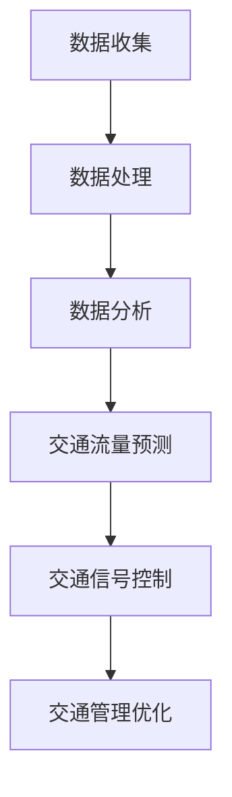
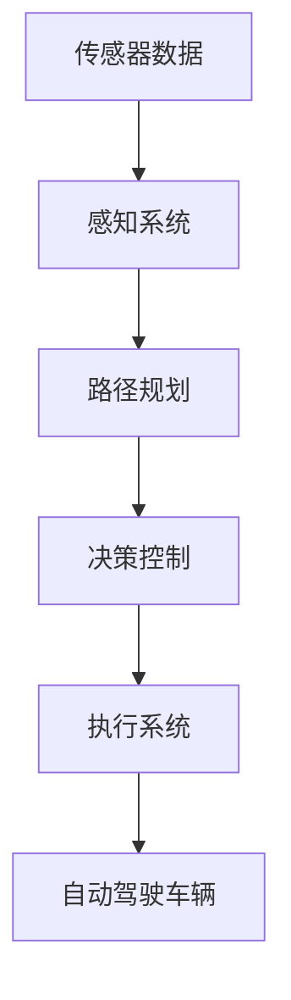
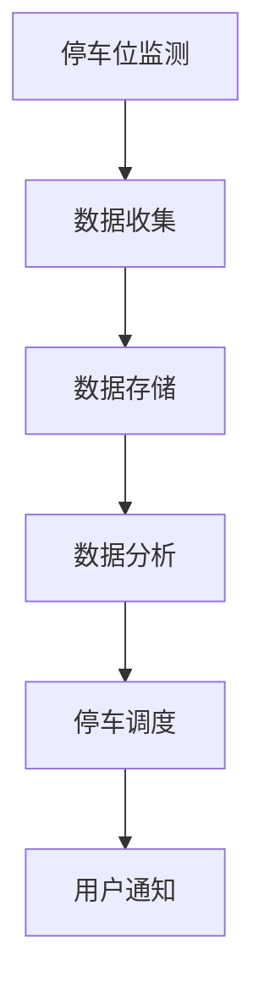

                 

关键词：人工智能，城市交通系统，可持续发展，规划与管理，算法，数学模型，实践实例

> 摘要：本文将探讨人工智能在城市交通系统规划与管理中的应用，分析当前城市交通面临的挑战，提出可持续发展的解决方案，并通过实例展示AI技术在交通系统中的应用效果。

## 1. 背景介绍

随着城市化进程的加速，城市交通系统面临诸多挑战。首先，城市交通拥堵问题日益严重，造成了大量的时间和经济浪费。其次，城市交通污染问题也给环境带来了巨大压力。此外，交通系统的不智能化也使得交通规划和管理效率低下。为了应对这些挑战，人工智能（AI）技术逐渐成为解决城市交通问题的重要工具。

AI技术在城市交通系统中的应用主要包括以下几个方面：智能交通信号控制、自动驾驶技术、实时交通流量监测与分析、智慧停车管理等。这些技术不仅可以提高交通系统的效率，还能实现交通污染的减少，促进城市可持续发展。

## 2. 核心概念与联系

在讨论AI在城市交通系统中的应用之前，我们需要先了解一些核心概念和它们之间的联系。

### 2.1 交通流量分析

交通流量分析是城市交通系统规划与管理的重要基础。它通过收集和分析交通数据，对道路流量、车速、行驶方向等信息进行实时监控。Mermaid流程图如下：



### 2.2 自动驾驶技术

自动驾驶技术是AI技术在交通领域的重要应用之一。它通过传感器、摄像头、GPS等技术实现车辆的自主驾驶。自动驾驶技术的核心是路径规划、障碍物检测和决策控制。以下是自动驾驶系统的简化架构图：



### 2.3 智慧停车管理

智慧停车管理利用AI技术实现停车场的智能管理和调度。通过摄像头、传感器等设备，实时监测停车位使用情况，为驾驶员提供最优的停车方案。以下是智慧停车管理的简化架构图：



## 3. 核心算法原理 & 具体操作步骤

### 3.1 算法原理概述

在AI技术中，常用的算法包括深度学习、决策树、聚类分析等。这些算法在不同的应用场景中发挥着重要作用。

- **深度学习**：通过神经网络模型，对大量交通数据进行训练，从而实现交通流量预测、自动驾驶等应用。
- **决策树**：根据交通数据，构建决策树模型，用于交通信号控制和停车调度。
- **聚类分析**：对交通流量数据进行分析，识别出不同类型的交通模式，为交通规划提供依据。

### 3.2 算法步骤详解

以深度学习算法为例，其具体操作步骤如下：

1. **数据收集**：收集交通流量、车速、行驶方向等数据。
2. **数据预处理**：对收集到的数据进行清洗、归一化等处理。
3. **模型训练**：使用预处理后的数据，训练深度学习模型。
4. **模型评估**：对训练好的模型进行评估，调整模型参数。
5. **模型部署**：将训练好的模型部署到实际应用场景中。

### 3.3 算法优缺点

- **深度学习**：优点是能够处理大规模数据，具有较高的预测精度；缺点是训练时间较长，对数据质量要求较高。
- **决策树**：优点是易于理解和实现，适用于小规模数据；缺点是预测精度较低，容易过拟合。
- **聚类分析**：优点是能够自动发现交通模式；缺点是对噪声敏感，预测精度较低。

### 3.4 算法应用领域

不同的算法在不同领域有着广泛的应用：

- **深度学习**：主要用于交通流量预测、自动驾驶等。
- **决策树**：主要用于交通信号控制和停车调度。
- **聚类分析**：主要用于交通模式识别和交通规划。

## 4. 数学模型和公式 & 详细讲解 & 举例说明

在AI技术中，数学模型和公式起着至关重要的作用。以下是一个常用的数学模型——基于泊松分布的交通流量预测模型。

### 4.1 数学模型构建

假设在某时间段内，道路上的车辆流量服从泊松分布，其概率分布函数为：

$$
P(X=k) = \frac{(\lambda t)^k e^{-\lambda t}}{k!}
$$

其中，$X$为车辆流量，$\lambda$为流量强度，$t$为时间。

### 4.2 公式推导过程

泊松分布的推导过程如下：

1. 假设每个时间段内，道路上进入某一区间的车辆数量为独立同分布的随机变量。
2. 定义流量强度$\lambda$为单位时间内进入该区间的平均车辆数。
3. 根据概率论中的大数定律，当时间趋于无穷时，车辆流量服从泊松分布。

### 4.3 案例分析与讲解

以下是一个交通流量预测的案例：

在某道路上，每小时平均有10辆车通过。请预测未来1小时内，该道路上的车辆流量。

根据泊松分布模型，我们可以计算出未来1小时内的车辆流量概率分布：

$$
P(X=k) = \frac{(10 \times 1)^k e^{-10}}{k!}
$$

然后，我们可以通过计算各个车辆流量的概率，得到预测结果。

## 5. 项目实践：代码实例和详细解释说明

以下是一个使用Python实现交通流量预测的代码实例：

```python
import numpy as np
import matplotlib.pyplot as plt

def poisson_distribution(lambda_):
    x = np.arange(0, 21)
    y = (lambda_ * 1) ** x * np.exp(-lambda_) / np.math.factorial(x)
    return x, y

lambda_ = 10
x, y = poisson_distribution(lambda_)

plt.bar(x, y)
plt.xlabel('车辆流量')
plt.ylabel('概率')
plt.title('泊松分布模型预测结果')
plt.show()
```

### 5.1 开发环境搭建

- Python版本：3.8及以上
- 库：NumPy、Matplotlib

### 5.2 源代码详细实现

上述代码中，`poisson_distribution`函数用于计算泊松分布的概率分布函数。通过调用该函数，我们可以得到不同车辆流量的概率。

### 5.3 代码解读与分析

代码首先定义了一个`poisson_distribution`函数，用于计算泊松分布的概率分布函数。然后，我们设置流量强度$\lambda$为10，调用该函数计算未来1小时内的车辆流量概率分布。最后，使用Matplotlib库绘制概率分布图。

### 5.4 运行结果展示

运行上述代码后，我们将得到一个泊松分布的概率分布图。该图显示了不同车辆流量的概率分布，有助于我们了解未来1小时内车辆流量的预测情况。

## 6. 实际应用场景

AI技术在城市交通系统中的应用场景非常广泛。以下是一些典型的应用案例：

- **智能交通信号控制**：通过实时交通流量数据，智能交通信号控制系统可以动态调整信号灯时长，减少交通拥堵。
- **自动驾驶技术**：自动驾驶技术可以减少交通事故，提高交通效率。
- **智慧停车管理**：智慧停车管理系统能够实时监测停车位使用情况，为驾驶员提供最优的停车方案。
- **实时交通流量监测**：通过传感器和摄像头，实时监测交通流量，为交通管理部门提供决策依据。

## 7. 未来应用展望

随着AI技术的不断发展，城市交通系统的规划与管理将更加智能化、精细化。未来，我们有望实现以下目标：

- **智能交通信号控制**：通过深度学习、强化学习等算法，实现更加智能的交通信号控制，提高交通效率。
- **自动驾驶技术**：自动驾驶技术的普及将减少交通事故，提高交通安全性。
- **智慧城市交通体系**：通过大数据、云计算等技术，构建智慧城市交通体系，实现交通资源的优化配置。
- **绿色交通**：通过推广新能源汽车、共享出行等模式，减少交通污染，促进城市可持续发展。

## 8. 工具和资源推荐

为了更好地掌握AI技术在城市交通系统中的应用，以下是一些建议的工具和资源：

### 8.1 学习资源推荐

- 《深度学习》（Goodfellow, Bengio, Courville著）
- 《Python编程：从入门到实践》（埃里克·马瑟斯著）
- 《机器学习》（周志华著）

### 8.2 开发工具推荐

- Python（用于算法实现）
- TensorFlow（用于深度学习）
- Matplotlib（用于数据可视化）

### 8.3 相关论文推荐

- "Deep Learning for Traffic Prediction: A Survey"
- "Intelligent Transportation Systems: Concepts, Methodologies, Tools, and Applications"
- "A Review of Urban Traffic Prediction Using Data Mining and Machine Learning"

## 9. 总结：未来发展趋势与挑战

随着AI技术的不断发展，城市交通系统的规划与管理将迎来新的发展机遇。然而，我们仍然面临着一些挑战，如数据隐私保护、算法公平性等。未来，我们需要在技术创新、政策法规、产业协同等方面共同努力，推动城市交通系统向更加智能化、绿色化、可持续化的方向发展。

## 10. 附录：常见问题与解答

### 10.1 问题1：如何收集交通数据？

解答：交通数据的收集可以通过传感器、摄像头、GPS等技术实现。这些设备可以实时监测交通流量、车速、行驶方向等信息，并将数据传输到服务器进行存储和分析。

### 10.2 问题2：如何保障数据隐私？

解答：在数据收集和处理过程中，我们可以采用数据加密、匿名化等技术手段，确保数据隐私得到保护。此外，相关法规和政策也需要不断完善，以规范数据收集和使用行为。

### 10.3 问题3：如何保证算法公平性？

解答：在算法设计过程中，我们需要充分考虑算法的公平性，避免歧视性算法的出现。同时，数据集的选择和预处理也需要遵循公平、透明的原则，确保算法模型的公正性。

作者：禅与计算机程序设计艺术 / Zen and the Art of Computer Programming
----------------------------------------------------------------

这篇文章详细介绍了人工智能在城市交通系统规划与管理中的应用，分析了核心算法原理，提供了项目实践实例，并展望了未来发展趋势与挑战。希望这篇文章能够为读者提供有价值的参考和启发。

