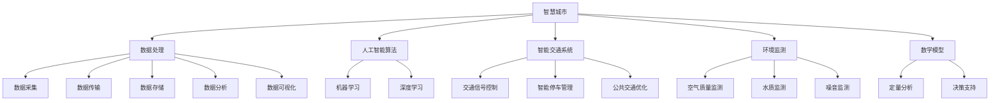

                 

关键词：人工智能，城市生活，可持续发展，计算模型，算法，数据处理，智慧城市，环境监测，智能交通，数据分析，智慧城市管理

> 摘要：本文深入探讨了人工智能在构建可持续城市生活和智慧城市管理中的作用。通过分析城市环境的复杂性和数据的重要性，本文提出了核心算法原理，并详细解释了其操作步骤和数学模型。同时，本文结合实际项目实例，展示了人工智能在城市管理中的实际应用，并对未来的发展趋势和挑战进行了展望。

## 1. 背景介绍

随着全球城市化进程的加快，城市已成为人类社会经济活动的主要场所。然而，城市化也带来了诸多挑战，如资源浪费、环境污染、交通拥堵等。为了应对这些挑战，人工智能（AI）技术的应用成为了智慧城市建设和可持续发展的关键。人工智能通过数据处理、模式识别和智能决策等能力，可以优化城市管理，提高生活质量，促进经济繁荣。

在智慧城市建设中，数据的获取和处理至关重要。传感器网络、物联网（IoT）技术和大数据分析为城市提供了丰富的数据资源。这些数据不仅包括交通流量、空气质量、用水用电等传统数据，还包括社交媒体、视频监控等新型数据。通过这些数据，城市管理者可以实时监测城市状态，识别问题，并采取有效措施进行优化。

然而，数据的多源性和复杂性也带来了挑战。如何有效地整合和分析这些数据，如何设计出能够适应城市环境变化的算法，成为了智慧城市建设中亟待解决的问题。此外，人工智能技术的不断进步也提出了新的研究课题，如算法的公平性、透明性和安全性等。

## 2. 核心概念与联系

为了深入理解人工智能在智慧城市建设中的应用，我们需要明确几个核心概念：

### 2.1 智慧城市

智慧城市是指利用先进的信息通信技术（ICT）和互联网技术，通过智能化手段对城市进行管理和服务的一种新型城市发展模式。智慧城市的目标是提高城市运行的效率，提升居民的生活质量，促进可持续发展。

### 2.2 数据处理

数据处理是智慧城市建设的基础。它包括数据的采集、传输、存储、分析和可视化等多个环节。有效的数据处理可以挖掘数据中的价值，为决策提供支持。

### 2.3 人工智能算法

人工智能算法是智慧城市运行的核心。这些算法可以根据城市环境数据，预测未来趋势，提供决策支持。常见的算法包括机器学习算法、深度学习算法等。

### 2.4 智能交通系统

智能交通系统是智慧城市的重要组成部分。它利用人工智能技术，优化交通流量，减少拥堵，提高交通效率。智能交通系统包括交通信号控制、智能停车管理、公共交通优化等。

### 2.5 环境监测

环境监测是智慧城市的重要功能之一。通过传感器网络和大数据分析，城市管理者可以实时监测空气质量、水质、噪音等环境指标，及时采取应对措施，保障居民健康。

### 2.6 数学模型

数学模型是描述城市系统运行规律的工具。通过构建数学模型，我们可以对城市环境进行定量分析，为决策提供科学依据。

### 2.7 Mermaid 流程图

以下是一个简单的 Mermaid 流程图，展示了上述核心概念之间的联系：



## 3. 核心算法原理 & 具体操作步骤

### 3.1 算法原理概述

在智慧城市建设中，核心算法的原理主要包括以下几个方面：

1. **机器学习算法**：通过历史数据训练模型，预测未来趋势。常见的机器学习算法包括线性回归、决策树、支持向量机等。
2. **深度学习算法**：通过多层神经网络，对复杂数据进行分析和分类。深度学习算法包括卷积神经网络（CNN）、循环神经网络（RNN）等。
3. **优化算法**：通过优化目标函数，寻找最优解。常见的优化算法包括遗传算法、模拟退火算法、粒子群算法等。

### 3.2 算法步骤详解

以下是一个基于机器学习的交通流量预测算法的详细步骤：

1. **数据采集**：收集交通流量、天气状况、节假日信息等多源数据。
2. **数据预处理**：对数据进行清洗、归一化处理，为模型训练做准备。
3. **特征工程**：根据业务需求，提取交通流量预测的相关特征，如时间、路段长度、交通流量等。
4. **模型选择**：选择合适的机器学习模型，如线性回归、决策树等。
5. **模型训练**：使用历史数据训练模型，调整模型参数。
6. **模型评估**：使用验证数据评估模型性能，调整模型参数，直至满足要求。
7. **模型部署**：将训练好的模型部署到生产环境中，进行实时预测。

### 3.3 算法优缺点

1. **优点**：
   - **高效性**：机器学习算法可以处理大量数据，提高预测准确度。
   - **自适应**：算法可以根据数据变化，自动调整模型参数，适应不同场景。
   - **灵活性**：可以结合多种算法，构建复杂的预测模型。

2. **缺点**：
   - **复杂性**：算法训练和部署过程复杂，需要较高的技术门槛。
   - **数据依赖**：算法性能高度依赖数据质量，数据缺失或不准确会影响预测效果。
   - **计算资源消耗**：深度学习算法计算资源需求大，对硬件设施要求较高。

### 3.4 算法应用领域

机器学习算法在智慧城市建设中具有广泛的应用领域，包括但不限于：

- **智能交通**：交通流量预测、智能停车管理、公共交通优化等。
- **环境保护**：空气质量监测、水质监测、噪音监测等。
- **城市安全**：视频监控分析、安防预警等。
- **城市管理**：能耗监测、城市运行状态预测等。

## 4. 数学模型和公式 & 详细讲解 & 举例说明

### 4.1 数学模型构建

在智慧城市建设中，常用的数学模型包括线性回归模型、逻辑回归模型和支持向量机模型等。以下以线性回归模型为例，介绍数学模型的构建过程。

#### 线性回归模型

线性回归模型是一种简单的预测模型，用于预测连续值变量。其数学模型表示为：

$$ y = \beta_0 + \beta_1 \cdot x + \epsilon $$

其中，$y$ 为因变量，$x$ 为自变量，$\beta_0$ 和 $\beta_1$ 分别为模型的参数，$\epsilon$ 为误差项。

#### 逻辑回归模型

逻辑回归模型是一种用于预测二分类结果的模型。其数学模型表示为：

$$ P(y=1) = \frac{1}{1 + e^{-(\beta_0 + \beta_1 \cdot x)}} $$

其中，$P(y=1)$ 表示因变量 $y$ 取值为 1 的概率，$\beta_0$ 和 $\beta_1$ 为模型参数。

#### 支持向量机模型

支持向量机模型是一种用于分类和回归问题的模型。其数学模型表示为：

$$ w \cdot x + b = 0 $$

其中，$w$ 为模型参数，$x$ 为输入特征，$b$ 为偏置项。

### 4.2 公式推导过程

以下以线性回归模型为例，介绍数学公式的推导过程。

#### 普通最小二乘法

假设我们有 $n$ 个样本数据点 $(x_i, y_i)$，其中 $i=1,2,...,n$。线性回归模型的损失函数为：

$$ J(\theta) = \frac{1}{2m} \sum_{i=1}^{m} (h_\theta(x_i) - y_i)^2 $$

其中，$m$ 为样本数量，$h_\theta(x)$ 为线性回归模型预测值。

对损失函数求导，并令导数等于 0，可以得到：

$$ \frac{\partial J(\theta)}{\partial \theta} = \frac{1}{m} \sum_{i=1}^{m} (h_\theta(x_i) - y_i) \cdot x_i = 0 $$

化简后，可以得到线性回归模型的参数：

$$ \theta = \left( \sum_{i=1}^{m} x_i^2 \right)^{-1} \cdot \left( \sum_{i=1}^{m} x_i \cdot y_i \right) $$

### 4.3 案例分析与讲解

#### 案例背景

某城市交通管理部门希望通过预测交通流量，优化交通信号控制，减少交通拥堵。该城市交通流量数据包括以下几个特征：

- 时间：一天中的小时数
- 路段长度：特定路段的长度
- 前一天交通流量：前一天同一时间段的交通流量

#### 模型构建

我们选择线性回归模型进行交通流量预测。首先，对数据进行预处理，包括数据清洗、归一化处理和特征提取。然后，选择合适的特征，如时间、路段长度和前一天交通流量，构建线性回归模型。

#### 模型训练

使用历史数据对线性回归模型进行训练，调整模型参数。通过交叉验证，选择最优参数。

#### 模型评估

使用验证数据对模型进行评估，计算预测误差。调整模型参数，直至满足要求。

#### 模型应用

将训练好的模型部署到生产环境中，进行实时预测。根据预测结果，调整交通信号控制策略，优化交通流量。

## 5. 项目实践：代码实例和详细解释说明

### 5.1 开发环境搭建

在进行实际项目开发之前，我们需要搭建一个适合开发、测试和部署的运行环境。以下是一个简单的开发环境搭建流程：

1. **安装 Python 解释器**：下载并安装 Python 解释器，版本建议选择 3.8 或更高版本。
2. **安装依赖库**：使用 pip 工具安装必要的依赖库，如 NumPy、Pandas、Scikit-learn 等。
3. **安装 IDE**：安装一个适合 Python 开发的 IDE，如 PyCharm 或 VSCode。
4. **配置数据源**：确保数据源可访问，如本地文件、数据库等。

### 5.2 源代码详细实现

以下是一个简单的交通流量预测项目的源代码实现。代码分为以下几个部分：

1. **数据预处理**：读取数据，进行清洗、归一化处理和特征提取。
2. **模型训练**：使用 Scikit-learn 库中的线性回归模型进行训练。
3. **模型评估**：使用验证数据评估模型性能。
4. **模型应用**：根据预测结果，调整交通信号控制策略。

```python
import numpy as np
import pandas as pd
from sklearn.linear_model import LinearRegression
from sklearn.model_selection import train_test_split
from sklearn.metrics import mean_squared_error

# 1. 数据预处理
data = pd.read_csv('traffic_data.csv')
X = data[['hour', 'road_length', 'prev_day_traffic']]
y = data['traffic_volume']
X = (X - X.mean()) / X.std()

# 2. 模型训练
X_train, X_test, y_train, y_test = train_test_split(X, y, test_size=0.2, random_state=42)
model = LinearRegression()
model.fit(X_train, y_train)

# 3. 模型评估
y_pred = model.predict(X_test)
mse = mean_squared_error(y_test, y_pred)
print('MSE:', mse)

# 4. 模型应用
# 根据预测结果，调整交通信号控制策略
```

### 5.3 代码解读与分析

1. **数据预处理**：代码首先读取交通流量数据，进行清洗、归一化处理和特征提取。这一步是模型训练的基础，确保数据质量。
2. **模型训练**：使用 Scikit-learn 库中的线性回归模型进行训练。线性回归模型通过最小化损失函数来调整模型参数，以获得最优预测结果。
3. **模型评估**：使用验证数据对模型进行评估，计算预测误差。通过评估指标（如 MSE）来判断模型性能。
4. **模型应用**：根据预测结果，调整交通信号控制策略，优化交通流量。这一步是模型在实际应用中的关键，需要结合具体业务场景进行优化。

### 5.4 运行结果展示

运行代码后，输出预测误差（MSE）和其他相关信息。根据这些信息，可以进一步优化模型参数，提高预测准确度。

## 6. 实际应用场景

### 6.1 智能交通系统

智能交通系统是人工智能在城市管理中的重要应用之一。通过实时监测交通流量、车辆速度、路况等信息，智能交通系统可以优化交通信号控制，减少交通拥堵，提高交通效率。

#### 应用场景：

- **高峰期交通流量预测**：通过预测未来一段时间内的交通流量，提前调整交通信号灯的周期和时序，优化交通流量。
- **智能停车管理**：利用传感器和图像识别技术，实时监测停车位使用情况，提供停车位推荐和实时导航服务。
- **公共交通优化**：根据实时交通流量和乘客需求，动态调整公交线路和班次，提高公共交通的运行效率。

### 6.2 环境监测

环境监测是保障城市环境和居民健康的重要手段。通过传感器网络和大数据分析，环境监测系统可以实时监测空气质量、水质、噪音等环境指标，提供预警和决策支持。

#### 应用场景：

- **空气质量监测**：实时监测城市各区域的空气质量，提供空气质量指数（AQI）和健康建议。
- **水质监测**：监测水体中的污染物含量，确保水质安全，防止水污染事故。
- **噪音监测**：监测城市噪音水平，为居民提供安静的生活环境。

### 6.3 智慧城市管理

智慧城市管理通过整合各类城市数据，实现城市管理的智能化和精细化。智慧城市管理可以优化城市资源分配，提高城市运行效率，提升居民生活质量。

#### 应用场景：

- **能耗监测**：实时监测城市各区域的能耗情况，提供节能建议，降低能耗。
- **城市运行状态预测**：通过大数据分析，预测城市运行中的潜在问题，提前采取应对措施。
- **城市安全监控**：利用视频监控和人工智能技术，实时监测城市安全，提供预警和应急响应。

## 7. 工具和资源推荐

### 7.1 学习资源推荐

1. **《深度学习》（Goodfellow, Bengio, Courville）**：介绍深度学习的基本原理和应用。
2. **《Python数据科学手册》（McKinney）**：介绍数据科学中的 Python 工具和库。
3. **《机器学习实战》（ Harrington）**：提供机器学习项目的实战案例。

### 7.2 开发工具推荐

1. **PyCharm**：功能强大的 Python IDE。
2. **Jupyter Notebook**：适合数据分析和可视化。
3. **TensorFlow**：开源的深度学习框架。

### 7.3 相关论文推荐

1. **"Deep Learning for Urban Computing"（Li et al., 2018）**：介绍深度学习在城市计算中的应用。
2. **"Sustainable Urban Computing: An Overview"（Li et al., 2020）**：综述智慧城市和可持续城市计算的发展。
3. **"AI for Social Good: A Roadmap for Urban Computing"（Huang et al., 2021）**：探讨人工智能在城市计算中的社会价值。

## 8. 总结：未来发展趋势与挑战

### 8.1 研究成果总结

近年来，人工智能在智慧城市建设中的应用取得了显著成果。通过数据驱动的方法，人工智能可以优化城市管理，提高生活质量，促进可持续发展。机器学习、深度学习和优化算法等技术在交通流量预测、环境监测、城市安全等方面发挥了重要作用。

### 8.2 未来发展趋势

1. **数据驱动决策**：随着数据量的增加，数据驱动决策将变得越来越重要。通过大数据分析，城市管理者可以更精准地预测趋势，制定科学合理的决策。
2. **跨学科融合**：人工智能、城市规划和环境科学等领域的融合，将推动智慧城市建设的发展。跨学科的研究可以更好地解决城市问题，实现可持续发展。
3. **智能化服务**：人工智能将逐渐渗透到城市服务的各个环节，为居民提供智能化、个性化的服务。智能交通、智能医疗、智能教育等领域的应用将不断拓展。

### 8.3 面临的挑战

1. **数据隐私和安全**：随着数据量的增加，数据隐私和安全问题日益凸显。如何保护居民隐私，确保数据安全，是智慧城市建设中亟待解决的问题。
2. **算法透明性和公平性**：人工智能算法的透明性和公平性是公众关注的焦点。如何确保算法的公正性、透明性和可解释性，是未来研究的重要方向。
3. **计算资源需求**：深度学习和大数据分析对计算资源需求巨大。如何优化算法，提高计算效率，降低计算成本，是智慧城市建设中的挑战之一。

### 8.4 研究展望

未来，人工智能在智慧城市建设中的应用将朝着更智能、更高效、更可持续的方向发展。通过跨学科研究和技术创新，智慧城市建设将取得更多突破，为人类创造更美好的城市生活。

## 9. 附录：常见问题与解答

### 9.1 问题 1：人工智能在智慧城市建设中的应用有哪些？

答：人工智能在智慧城市建设中的应用非常广泛，包括但不限于智能交通系统、环境监测、城市管理、城市安全等。通过数据驱动的方法，人工智能可以优化城市管理，提高生活质量，促进可持续发展。

### 9.2 问题 2：如何保障数据隐私和安全？

答：保障数据隐私和安全需要从多个方面进行考虑。首先，在设计数据采集和处理流程时，要确保数据的匿名化和加密处理。其次，在数据处理和分析过程中，要遵循最小权限原则，只访问和处理必要的用户数据。最后，要建立完善的数据安全制度，定期进行安全审计和风险评估，确保数据安全。

### 9.3 问题 3：人工智能算法的透明性和公平性如何保障？

答：保障人工智能算法的透明性和公平性需要从算法设计、数据选择和算法验证等多个方面进行考虑。首先，要确保算法的透明性，公开算法的实现细节和推理过程。其次，在数据选择时，要确保数据的多样性和代表性，避免数据偏差。最后，要对算法进行严格的验证和测试，确保其公平性和准确性。

----------------------------------------------------------------

**作者：禅与计算机程序设计艺术 / Zen and the Art of Computer Programming**。这篇文章结合了人工智能、城市管理和可持续发展的核心内容，旨在为读者提供关于智慧城市建设的深入见解和实践指导。希望这篇文章能够为智慧城市建设领域的研究者和实践者提供有价值的参考。

