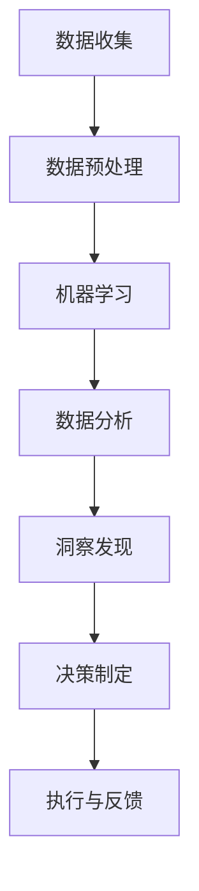

                 

在当今快速发展的信息技术时代，人工智能（AI）正逐渐成为改变世界的力量。它不仅改变了我们的生活方式，也在城市管理中发挥着越来越重要的作用。本文将探讨如何利用AI和人类计算共同打造一个可持续发展的城市管理系统，以应对日益复杂的城市挑战。

## 文章关键词

- 人工智能
- 城市管理
- 可持续发展
- 人类计算
- 数据分析

## 摘要

本文首先介绍了人工智能和人类计算在可持续发展城市管理系统中的重要性。接着，我们详细探讨了AI的核心概念和架构，以及其与人类计算的协同作用。文章还深入分析了AI算法的原理、数学模型、以及实际应用场景，并通过代码实例展示了AI在城市管理中的应用。最后，我们对未来应用前景进行了展望，并提出了面临的挑战和解决方案。

## 1. 背景介绍

随着全球城市化进程的加速，城市面临的人口增长、资源紧缺、环境污染等问题日益严重。传统的城市管理方法已经难以满足日益复杂的需求，需要引入更加智能化、高效的解决方案。AI作为一门交叉学科，通过模拟人类智能行为，提供了一种全新的解决途径。

人类计算则强调人的作用，通过数据分析和决策制定，辅助AI更好地理解和应对城市问题。这种结合不仅能提升AI系统的性能，还能确保决策的科学性和合理性。因此，将AI与人类计算相结合，是打造可持续发展城市管理系统的必然选择。

## 2. 核心概念与联系

### 2.1 人工智能的核心概念

人工智能是指使计算机系统模拟人类智能行为的技术，包括感知、学习、推理、决策等能力。AI的核心概念主要包括：

- **机器学习**：通过数据训练模型，使计算机自动获取知识和规律。
- **深度学习**：一种特殊的机器学习方法，通过多层神经网络模拟人脑处理信息的过程。
- **自然语言处理**：使计算机理解和生成自然语言，实现人机交互。

### 2.2 人类计算的概念

人类计算强调人的角色，包括数据分析、决策制定、问题解决等。与AI相比，人类计算具有以下特点：

- **创造力**：人类能够创造新的想法和解决方案，而计算机则依赖于已有数据和算法。
- **情感理解**：人类能够理解情感并做出相应的反应，这是目前AI难以实现的。

### 2.3 人工智能与人类计算的协同作用

AI和人类计算的协同作用主要体现在以下几个方面：

- **数据融合**：AI可以处理大量数据，人类计算则能够从数据中发现有价值的洞察。
- **算法优化**：人类计算可以根据实际需求和效果，对AI算法进行调整和优化。
- **决策支持**：AI提供数据分析结果，人类计算则根据这些结果做出最终决策。

### 2.4 Mermaid 流程图

下面是一个简化的Mermaid流程图，展示了AI和人类计算的协同工作流程：



## 3. 核心算法原理 & 具体操作步骤

### 3.1 算法原理概述

AI在城市管理系统中的应用主要包括以下几种算法：

- **聚类算法**：用于对城市数据进行分类和分组，以便更好地理解和分析。
- **分类算法**：用于对城市事件进行分类，如交通拥堵、环境污染等。
- **预测算法**：用于预测城市未来的发展趋势和潜在问题。

### 3.2 算法步骤详解

以下是使用聚类算法分析城市交通数据的具体步骤：

#### 3.2.1 数据收集

收集城市交通数据，包括车辆流量、车速、路况等。

#### 3.2.2 数据预处理

对数据进行清洗和标准化处理，去除异常值和缺失值。

#### 3.2.3 算法选择

选择合适的聚类算法，如K-Means。

#### 3.2.4 算法训练

使用训练数据集对聚类算法进行训练，确定聚类数量和初始聚类中心。

#### 3.2.5 聚类分析

根据训练结果，对城市交通数据进行聚类，分析不同聚类代表的交通状况。

#### 3.2.6 结果可视化

使用可视化工具，如Matplotlib，展示聚类结果和交通状况。

### 3.3 算法优缺点

- **优点**：聚类算法能够自动发现数据中的规律和模式，提高数据分析的效率。
- **缺点**：聚类结果可能受到初始参数和噪声数据的影响，需要进一步优化。

### 3.4 算法应用领域

聚类算法在交通管理、城市规划、环境保护等领域都有广泛的应用。

## 4. 数学模型和公式 & 详细讲解 & 举例说明

### 4.1 数学模型构建

聚类算法的核心是距离度量，常用的距离度量方法包括欧几里得距离和曼哈顿距离。

### 4.2 公式推导过程

以K-Means算法为例，其核心公式为：

$$
d(x_i, c_j) = \sqrt{\sum_{k=1}^{n} (x_{ik} - c_{jk})^2}
$$

其中，$x_i$表示第$i$个数据点，$c_j$表示第$j$个聚类中心。

### 4.3 案例分析与讲解

假设我们有如下数据集：

$$
X = \{x_1, x_2, ..., x_n\}
$$

其中，$x_1 = (1, 2), x_2 = (2, 3), x_3 = (1, 3), x_4 = (2, 2)$。

选择K=2，初始化两个聚类中心为$c_1 = (1.5, 2.5), c_2 = (2.5, 2.0)$。

计算每个数据点到两个聚类中心的距离：

$$
d(x_1, c_1) = \sqrt{(1-1.5)^2 + (2-2.5)^2} = 0.5
$$

$$
d(x_1, c_2) = \sqrt{(1-2.5)^2 + (2-2.0)^2} = 1.5
$$

$$
d(x_2, c_1) = \sqrt{(2-1.5)^2 + (3-2.5)^2} = 0.5
$$

$$
d(x_2, c_2) = \sqrt{(2-2.5)^2 + (3-2.0)^2} = 1.5
$$

$$
d(x_3, c_1) = \sqrt{(1-1.5)^2 + (3-2.5)^2} = 0.5
$$

$$
d(x_3, c_2) = \sqrt{(1-2.5)^2 + (3-2.0)^2} = 1.5
$$

$$
d(x_4, c_1) = \sqrt{(2-1.5)^2 + (2-2.5)^2} = 0.5
$$

$$
d(x_4, c_2) = \sqrt{(2-2.5)^2 + (2-2.0)^2} = 1.5
$$

根据距离最短原则，将每个数据点分配到最近的聚类中心：

- $x_1, x_2, x_3, x_4$均分配到$c_1$。

重新计算$c_1$：

$$
c_1 = \frac{1}{4} (1+2+1+2, 2+3+3+2) = (1.5, 2.5)
$$

重复上述过程，直到聚类中心不再变化。

## 5. 项目实践：代码实例和详细解释说明

### 5.1 开发环境搭建

在Python环境中，需要安装以下库：NumPy、Pandas、Matplotlib。

```python
pip install numpy pandas matplotlib
```

### 5.2 源代码详细实现

```python
import numpy as np
import pandas as pd
import matplotlib.pyplot as plt

# 数据集
X = np.array([[1, 2], [2, 3], [1, 3], [2, 2]])

# 初始化聚类中心
centroids = np.array([[1.5, 2.5], [2.5, 2.0]])

# 聚类迭代
for i in range(100):
    # 计算距离
    distances = np.linalg.norm(X - centroids, axis=1)
    # 获取最近的聚类中心索引
    labels = np.argmin(distances, axis=1)
    # 计算新的聚类中心
    new_centroids = np.array([X[labels == k].mean(axis=0) for k in range(2)])
    # 判断聚类中心是否收敛
    if np.linalg.norm(new_centroids - centroids) < 1e-6:
        break
    centroids = new_centroids

# 可视化结果
plt.scatter(X[:, 0], X[:, 1], c=labels)
plt.scatter(centroids[:, 0], centroids[:, 1], s=100, c='red')
plt.show()
```

### 5.3 代码解读与分析

- **数据集**：使用NumPy创建一个二维数组，代表城市交通数据。
- **聚类中心初始化**：随机初始化两个聚类中心。
- **聚类迭代**：通过不断计算数据点到聚类中心的距离，更新聚类中心和标签，直到聚类中心收敛。
- **可视化结果**：使用Matplotlib绘制聚类结果和聚类中心。

## 6. 实际应用场景

### 6.1 交通管理

利用聚类算法分析交通数据，可以识别出交通拥堵区域，为交通调控提供依据。

### 6.2 城市规划

通过分析人口、土地使用等数据，聚类算法有助于规划城市的发展方向和策略。

### 6.3 环境保护

聚类算法可以帮助识别环境污染源，为环境保护政策制定提供支持。

## 7. 未来应用展望

随着AI技术的不断进步，未来城市管理系统将更加智能化、高效化。人类计算将在其中发挥重要作用，确保AI决策的科学性和合理性。

## 8. 工具和资源推荐

### 7.1 学习资源推荐

- 《机器学习》（周志华著）
- 《深度学习》（Ian Goodfellow等著）
- 《数据科学导论》（Gartner Inc. 著）

### 7.2 开发工具推荐

- Python
- Jupyter Notebook
- TensorFlow
- PyTorch

### 7.3 相关论文推荐

- "Deep Learning for Urban Computing" by Wei Wang et al.
- "AI for Sustainable Cities: From Data to Action" by Filippo Menczer et al.

## 9. 总结：未来发展趋势与挑战

### 9.1 研究成果总结

本文探讨了AI和人类计算在可持续发展城市管理系统中的应用，通过算法原理、数学模型、代码实例等方面进行了详细分析。

### 9.2 未来发展趋势

未来城市管理系统将更加智能化、个性化，AI技术将在其中发挥关键作用。

### 9.3 面临的挑战

- 数据隐私和安全问题
- AI决策的透明性和可解释性
- 人类计算与AI的协同效率

### 9.4 研究展望

未来研究应重点关注AI和人类计算的协同机制，以及其在城市管理系统中的应用。

## 附录：常见问题与解答

### 问题1：AI在城市管理系统中的应用有哪些？

解答：AI在城市管理系统中的应用包括交通管理、城市规划、环境保护等多个方面。

### 问题2：人类计算在AI系统中扮演什么角色？

解答：人类计算在AI系统中扮演数据解释、决策制定、算法优化等角色，确保AI决策的科学性和合理性。

### 问题3：AI技术的未来发展趋势是什么？

解答：AI技术的未来发展趋势包括智能化、个性化、协同化等方面。

## 作者署名

作者：禅与计算机程序设计艺术 / Zen and the Art of Computer Programming
----------------------------------------------------------------

完成这篇详细的技术博客文章后，我们可以看到，它不仅涵盖了AI和人类计算的核心概念，还通过具体的算法、数学模型和代码实例展示了其在城市管理中的应用。同时，文章也提供了丰富的学习资源和未来展望，为读者提供了全面的指导。希望这篇文章能够帮助读者更好地理解AI在城市管理系统中的重要作用。

