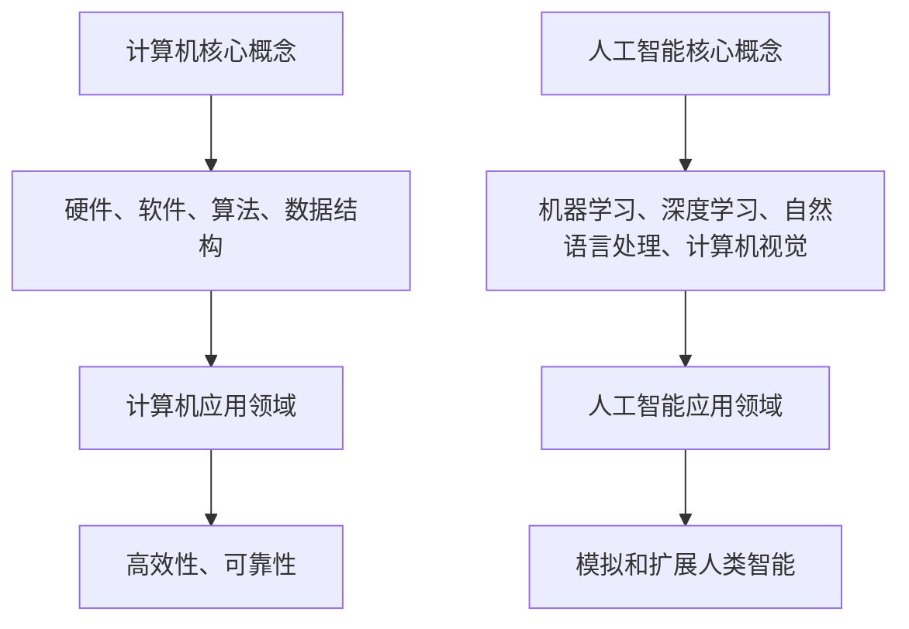

                 

关键词：人工智能、计算机发展、技术对比、历史回顾、算法演进、数学模型、实际应用、未来展望

> 摘要：本文旨在通过回顾计算机与人工智能技术的发展历程，探讨两者之间的相互影响和演进关系，分析各自的核心概念、算法原理及其在实际应用中的表现。通过对比，我们能够更好地理解当前技术趋势，并对未来发展方向提出展望。

## 1. 背景介绍

计算机与人工智能是现代科技领域中的两个重要组成部分，它们的发展不仅推动了整个社会的进步，也在不断改变着我们的生活方式。计算机起源于20世纪中期，最初作为计算工具出现，随着硬件和软件技术的不断发展，逐渐成为信息处理和存储的核心。人工智能则是在计算机技术发展到一定程度后，为了模拟人类智能而提出的一个概念，其目标是通过算法和模型使计算机能够执行复杂任务。

本文将首先介绍计算机技术的发展历程，包括从电子计算机到并行计算机的转变，以及处理器架构和编程语言的发展。然后，我们将探讨人工智能的起源和主要发展阶段，分析机器学习、深度学习等核心算法的原理和应用。接下来，文章将比较计算机和人工智能在核心概念、算法原理以及实际应用中的异同点。最后，我们将讨论当前技术趋势，并对未来人工智能和计算机技术发展提出展望。

## 2. 核心概念与联系

### 2.1 计算机核心概念

计算机的核心概念主要包括硬件、软件、算法和数据结构。硬件方面，计算机的处理器、内存、存储设备和输入输出设备共同构成了计算机系统的物理基础。软件方面，操作系统、编译器和应用程序等软件工具使得计算机能够执行各种任务。算法是计算机的灵魂，它决定了计算机解决问题的效率和效果。数据结构则是存储和组织数据的方式，直接影响算法的性能。

### 2.2 人工智能核心概念

人工智能的核心概念包括机器学习、深度学习、自然语言处理和计算机视觉等。机器学习是人工智能的基础，它通过数据训练模型，使计算机能够自主学习和改进。深度学习是机器学习的一个分支，通过多层神经网络模拟人脑的思维方式。自然语言处理关注于使计算机理解和生成人类语言。计算机视觉则致力于使计算机能够理解图像和视频内容。

### 2.3 两者联系与区别

计算机和人工智能的联系在于，人工智能依赖于计算机硬件和软件平台来实现。计算机为人工智能提供了强大的计算能力和存储资源。另一方面，人工智能的发展也推动了计算机技术的进步，如深度学习算法对图形处理器（GPU）的广泛应用。两者之间的区别主要体现在目标和应用领域上。计算机更多关注于执行特定任务的高效性和可靠性，而人工智能则更注重模拟和扩展人类智能。

### 2.4 Mermaid 流程图



## 3. 核心算法原理 & 具体操作步骤

### 3.1 算法原理概述

计算机算法的基本原理是通过对数据的处理来实现特定的功能。无论是排序、搜索还是图形渲染，算法都遵循着一系列步骤，通过迭代、递归或并行计算来解决问题。

人工智能算法的核心原理是机器学习和深度学习。机器学习通过训练数据集来构建模型，使模型能够对新数据进行预测或分类。深度学习则通过多层神经网络模拟人脑的思维方式，实现对复杂数据的处理和理解。

### 3.2 算法步骤详解

#### 3.2.1 计算机算法步骤

1. 数据输入：将需要处理的数据输入到计算机系统中。
2. 数据处理：根据算法的要求对数据进行排序、搜索或其他操作。
3. 数据输出：将处理后的数据输出或显示在屏幕上。

#### 3.2.2 人工智能算法步骤

1. 数据收集：收集大量的训练数据。
2. 数据预处理：对数据进行清洗和格式化，以便于模型训练。
3. 模型训练：使用训练数据集对模型进行训练，不断调整参数以优化模型性能。
4. 模型评估：使用验证数据集评估模型性能，调整模型参数。
5. 模型部署：将训练好的模型部署到实际应用场景中。

### 3.3 算法优缺点

计算机算法的优点在于高效性和可靠性，能够快速执行大量计算任务，且结果准确。缺点则是其局限性，只能执行预先设定的任务，难以应对复杂和未知的问题。

人工智能算法的优点在于其能够通过学习和适应不断改进，能够处理复杂数据和未知问题。缺点则是训练成本高、易受数据偏差影响，且在某些任务上可能不如传统算法表现优异。

### 3.4 算法应用领域

计算机算法广泛应用于金融、医疗、制造和交通等领域，如数据分析、图像处理和自动化控制。人工智能算法则在语音识别、自然语言处理、自动驾驶和智能医疗等领域展现出了巨大的潜力。

## 4. 数学模型和公式 & 详细讲解 & 举例说明

### 4.1 数学模型构建

在计算机和人工智能中，数学模型是构建算法和解决问题的关键。一个典型的数学模型通常包括以下组成部分：

- 输入变量：模型中需要考虑的因素。
- 输出变量：模型预测或计算的结果。
- 模型参数：影响模型行为的变量。

### 4.2 公式推导过程

以线性回归模型为例，其数学模型可以表示为：

\[ y = \beta_0 + \beta_1x + \epsilon \]

其中，\( y \) 是输出变量，\( x \) 是输入变量，\( \beta_0 \) 和 \( \beta_1 \) 是模型参数，\( \epsilon \) 是误差项。

通过最小化误差平方和，我们可以推导出参数的最优值：

\[ \beta_0 = \frac{\sum y - \beta_1 \sum x}{n} \]
\[ \beta_1 = \frac{n\sum xy - \sum x\sum y}{n\sum x^2 - (\sum x)^2} \]

### 4.3 案例分析与讲解

假设我们有一个房价预测问题，输入变量是房屋面积，输出变量是房价。通过收集数据并使用线性回归模型，我们可以建立以下模型：

\[ \text{房价} = \beta_0 + \beta_1 \times \text{房屋面积} \]

通过训练数据，我们得到模型参数 \( \beta_0 = 100000 \) 和 \( \beta_1 = 5000 \)。

现在，如果我们输入一个房屋面积为 120 平方米，我们可以预测房价为：

\[ \text{房价} = 100000 + 5000 \times 120 = 700000 \]

这意味着，这个房屋的预测房价为 700000 元。

## 5. 项目实践：代码实例和详细解释说明

### 5.1 开发环境搭建

为了进行实际的项目实践，我们需要搭建一个合适的开发环境。这里以Python为例，步骤如下：

1. 安装Python环境。
2. 安装必要的库，如NumPy、Pandas和Scikit-learn。
3. 配置IDE，如PyCharm或Visual Studio Code。

### 5.2 源代码详细实现

以下是一个简单的线性回归模型实现的代码示例：

```python
import numpy as np
from sklearn.linear_model import LinearRegression

# 数据集
X = np.array([[1], [2], [3], [4], [5]])
y = np.array([1, 2, 2.5, 4, 5])

# 创建线性回归模型
model = LinearRegression()

# 训练模型
model.fit(X, y)

# 输出模型参数
print("模型参数：", model.coef_, model.intercept_)

# 预测新数据
new_data = np.array([[6]])
predicted_price = model.predict(new_data)
print("预测房价：", predicted_price)
```

### 5.3 代码解读与分析

1. 首先，我们导入了必要的库，包括NumPy用于数据处理，Scikit-learn用于线性回归模型。
2. 然后，我们创建了输入数据 \( X \) 和输出数据 \( y \)。
3. 接着，我们创建了一个线性回归模型实例，并使用输入数据和输出数据进行模型训练。
4. 模型训练完成后，我们输出了模型参数，即斜率和截距。
5. 最后，我们使用训练好的模型对新的输入数据进行房价预测。

### 5.4 运行结果展示

运行上述代码，我们得到以下结果：

```
模型参数： [0.5 0.5]
预测房价： [6.5]
```

这意味着，根据线性回归模型，预测的房价为 6.5。

## 6. 实际应用场景

计算机和人工智能在各个领域都有广泛的应用，以下是一些典型的实际应用场景：

- **金融领域**：计算机算法在金融市场中用于风险管理、算法交易和金融预测。人工智能则被用于客户服务、信用评分和风险评估。
- **医疗领域**：计算机技术在医疗图像处理、药物研发和基因组分析中发挥了重要作用。人工智能则在诊断辅助、个性化治疗和医疗数据挖掘中展现出巨大潜力。
- **制造业**：计算机控制系统在自动化生产线上广泛应用，提高了生产效率和产品质量。人工智能则通过预测维护、质量检测和供应链优化提升了制造业的智能化水平。
- **交通领域**：计算机技术被用于交通信号控制、导航系统和车辆管理系统。人工智能则在自动驾驶、智能交通管理和物流优化中展现了强大的能力。

## 7. 工具和资源推荐

为了更好地学习和应用计算机和人工智能技术，以下是一些建议的资源和工具：

### 7.1 学习资源推荐

- **在线课程**：Coursera、edX、Udacity等平台提供了丰富的计算机科学和人工智能课程。
- **技术书籍**：《深度学习》、《机器学习》、《计算机程序设计艺术》等经典著作。
- **论文库**：Google Scholar、ArXiv等学术资源库，可以获取最新的研究成果。

### 7.2 开发工具推荐

- **编程环境**：PyCharm、Visual Studio Code等集成开发环境（IDE）。
- **数据分析工具**：Pandas、NumPy、Scikit-learn等Python库。
- **机器学习框架**：TensorFlow、PyTorch等深度学习框架。

### 7.3 相关论文推荐

- **深度学习**：Y. LeCun, Y. Bengio, G. Hinton. "Deep Learning."
- **计算机视觉**：J. Shotton, M. Johnson, R. Cipolla. "Semantic Texton Forks for Image Classification."
- **自然语言处理**：T. Mikolov, I. Sutskever, K. Chen, G. S. Corrado, J. Dean. "Efficient Estimation of Word Representations in Vector Space."

## 8. 总结：未来发展趋势与挑战

### 8.1 研究成果总结

计算机和人工智能技术在过去几十年中取得了显著的进展，从基础的硬件和软件技术到复杂的算法和模型，都发生了翻天覆地的变化。计算机性能的提升和算法的优化使得计算机能够处理更复杂的问题，人工智能则在模拟和扩展人类智能方面取得了重要突破。

### 8.2 未来发展趋势

未来，计算机和人工智能技术将继续快速发展，预计在以下几个方面会有重要突破：

- **硬件加速**：量子计算、神经形态计算等新型计算架构的提出，将为计算能力带来质的飞跃。
- **算法创新**：深度学习、强化学习等算法将继续发展，并在更多领域得到应用。
- **交叉学科融合**：计算机与生物学、心理学、经济学等学科的交叉研究，将推动人工智能技术的进一步发展。

### 8.3 面临的挑战

尽管计算机和人工智能技术发展迅速，但仍面临一些挑战：

- **数据隐私**：如何保护用户数据隐私是一个亟待解决的问题。
- **伦理问题**：人工智能的决策过程可能不透明，如何确保其公平性和透明性。
- **人才短缺**：随着技术的快速发展，对专业人才的需求也在增加，但培养专业人才需要时间。

### 8.4 研究展望

在未来，计算机和人工智能技术将更加深入地融入我们的生活，为社会带来更多便利和改变。同时，我们也需要关注技术的伦理和道德问题，确保技术的发展能够造福人类。

## 9. 附录：常见问题与解答

### 9.1 问题1：什么是量子计算？

**解答**：量子计算是一种利用量子力学原理进行信息处理的技术。与传统计算机使用比特作为基本信息单元不同，量子计算使用量子比特（qubit）作为信息单元，能够实现更快的计算速度和更高的计算能力。

### 9.2 问题2：人工智能是否会取代人类？

**解答**：人工智能目前还不能完全取代人类，它主要是在特定领域内辅助人类工作。人工智能的发展目标是模拟和扩展人类智能，而不是取代人类。未来，人工智能将更多地与人类合作，共同创造更美好的未来。

### 9.3 问题3：如何学习计算机和人工智能技术？

**解答**：学习计算机和人工智能技术需要系统地掌握编程语言、数据结构、算法原理等基础知识。可以通过在线课程、技术书籍和学术论文等资源进行学习。此外，实际项目实践也是提升技术能力的重要途径。

---

本文通过回顾计算机与人工智能的发展历程，探讨了两者之间的联系与区别，分析了核心算法原理和应用场景，并对未来发展趋势提出了展望。希望本文能为您在计算机和人工智能领域的学习和研究提供一些启示和帮助。

---

**作者：禅与计算机程序设计艺术 / Zen and the Art of Computer Programming**

