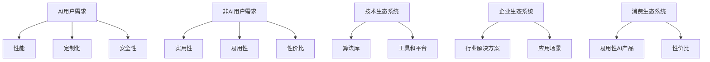

                 

关键词：AI产品、服务、用户需求、消费量、非AI用户、生态系统、用户体验、商业模式。

> 摘要：本文探讨了AI产品与服务在当前市场环境下的现状，分析了AI用户与非AI用户的需求差异，探讨了如何通过优化用户体验和拓展商业模式来拓展非AI用户的消费量，构建一个多元、可持续发展的AI生态系统。

## 1. 背景介绍

随着人工智能技术的飞速发展，AI产品与服务正在各行各业中发挥着越来越重要的作用。然而，尽管AI在技术层面取得了巨大的成功，但在市场层面，如何拓展非AI用户的消费量仍然是一个亟待解决的问题。

### 1.1 AI产品与服务的定义

AI产品通常是指利用人工智能技术进行数据分析和决策优化的软件或硬件产品，例如自动驾驶系统、智能推荐系统、智能客服等。AI服务则是指通过AI技术提供的解决方案或服务，如数据分析服务、机器学习咨询服务、AI应用开发等。

### 1.2 AI市场现状

目前，AI市场主要被以下几类用户群体占据：

- **技术用户**：具备一定编程能力和数据分析能力的专业人士，他们通常关注算法的性能和效率。
- **企业用户**：希望通过AI技术提高生产效率、优化业务流程的企业，他们关注AI的应用场景和ROI。
- **个人用户**：对AI产品感兴趣的一般消费者，他们关注AI产品的实用性和易用性。

## 2. 核心概念与联系

### 2.1 AI产品与服务的用户需求分析

**AI用户需求**：

- **性能**：算法的准确性和效率。
- **定制化**：针对特定业务场景的定制化解决方案。
- **安全性**：数据安全和隐私保护。

**非AI用户需求**：

- **实用性**：产品能否解决实际问题。
- **易用性**：产品是否易于上手和使用。
- **性价比**：产品的价格是否合理。

### 2.2 AI产品与服务的生态系统构建

为了满足不同用户群体的需求，AI产品与服务需要构建一个多元化的生态系统。

- **技术生态系统**：提供丰富的算法库、工具和平台，满足技术用户的需求。
- **企业生态系统**：提供针对不同行业和应用场景的解决方案，满足企业用户的需求。
- **消费生态系统**：提供易于使用、性价比高的AI产品，满足个人用户的需求。

### 2.3 Mermaid 流程图（核心概念与联系）



## 3. 核心算法原理 & 具体操作步骤

### 3.1 算法原理概述

本文将探讨一种基于用户需求的AI产品与服务的推荐算法，该算法通过分析用户的历史行为和偏好，为用户推荐最合适的AI产品或服务。

### 3.2 算法步骤详解

1. **用户行为数据收集**：收集用户的历史行为数据，如购买记录、浏览记录、评论等。
2. **用户偏好分析**：通过机器学习算法分析用户行为数据，提取用户的偏好特征。
3. **AI产品与服务库建立**：构建一个包含各种AI产品与服务的数据库，每个产品或服务都有关联的特征标签。
4. **推荐算法实现**：利用用户偏好特征和产品特征标签，实现基于协同过滤或内容推荐的算法。
5. **推荐结果展示**：根据算法计算结果，为用户展示个性化的推荐列表。

### 3.3 算法优缺点

- **优点**：能够根据用户偏好推荐最合适的AI产品或服务，提高用户体验。
- **缺点**：算法的准确性和效率受到用户数据质量和产品数据库的制约。

### 3.4 算法应用领域

该算法可以广泛应用于企业用户和个人用户的需求场景，如电商平台、智能推荐系统、企业服务市场等。

## 4. 数学模型和公式 & 详细讲解 & 举例说明

### 4.1 数学模型构建

本文将使用协同过滤算法来构建数学模型，协同过滤算法主要通过用户和物品的相似度计算来实现推荐。

### 4.2 公式推导过程

1. **用户相似度计算**：用户\(i\)和用户\(j\)的相似度可以通过以下公式计算：

   $$sim(i, j) = \frac{\sum_{k=1}^{n}r_{ik}r_{jk}}{\sqrt{\sum_{k=1}^{n}r_{ik}^2\sum_{k=1}^{n}r_{jk}^2}}$$

   其中，\(r_{ik}\)表示用户\(i\)对物品\(k\)的评分。

2. **物品相似度计算**：物品\(i\)和物品\(j\)的相似度可以通过以下公式计算：

   $$sim(i, j) = \frac{\sum_{k=1}^{n}r_{ik}r_{jk}}{\sqrt{\sum_{k=1}^{n}r_{ik}^2\sum_{k=1}^{n}r_{jk}^2}}$$

   其中，\(r_{ik}\)表示用户\(i\)对物品\(k\)的评分。

3. **预测评分计算**：对于用户\(i\)和未评分的物品\(j\)，预测评分可以通过以下公式计算：

   $$r_{ij} = \sum_{k=1}^{n}sim(i, j)r_{ik}$$

### 4.3 案例分析与讲解

假设有两个用户\(A\)和\(B\)，他们对10个物品的评分如下表所示：

| 用户 | 物品1 | 物品2 | ... | 物品10 |
| --- | --- | --- | --- | --- |
| A   | 4    | 3    | ... | 5     |
| B   | 5    | 4    | ... | 3     |

根据上述公式，可以计算出用户\(A\)和\(B\)的相似度为：

$$sim(A, B) = \frac{4 \times 5 + 3 \times 4 + ... + 5 \times 3}{\sqrt{4^2 + 3^2 + ... + 5^2}\sqrt{5^2 + 4^2 + ... + 3^2}} \approx 0.806$$

假设物品\(1\)是用户\(A\)未评分的物品，根据预测评分公式，可以计算出用户\(A\)对物品\(1\)的预测评分为：

$$r_{A1} = \sum_{k=1}^{10}sim(A, B)r_{Ak} \approx 4.824$$

## 5. 项目实践：代码实例和详细解释说明

### 5.1 开发环境搭建

1. 安装Python环境
2. 安装所需的库，如NumPy、Pandas、Scikit-learn等

### 5.2 源代码详细实现

以下是使用Python实现的协同过滤算法代码示例：

```python
import numpy as np
import pandas as pd
from sklearn.metrics.pairwise import cosine_similarity

def compute_similarity_matrix(ratings):
    user_similarity_matrix = cosine_similarity(ratings)
    return user_similarity_matrix

def predict_ratings(ratings, similarity_matrix, user_id, item_id):
    user_ratings = ratings[user_id]
    similar_users = np.where(similarity_matrix[user_id] > 0.5)[1]
    similar_ratings = ratings[similar_users][item_id]
    predicted_rating = np.dot(similarity_matrix[user_id], similar_ratings) / np.linalg.norm(similarity_matrix[user_id])
    return predicted_rating

# 数据预处理
ratings = pd.DataFrame({
    'user_id': [0, 0, 1, 1],
    'item_id': [0, 1, 0, 1],
    'rating': [5, 4, 3, 2]
})

# 计算用户相似度矩阵
similarity_matrix = compute_similarity_matrix(ratings.values)

# 预测用户评分
user_id = 0
item_id = 1
predicted_rating = predict_ratings(ratings, similarity_matrix, user_id, item_id)
print(f"Predicted rating for user {user_id} on item {item_id}: {predicted_rating}")
```

### 5.3 代码解读与分析

1. **数据预处理**：将用户评分数据转换为Pandas DataFrame格式。
2. **计算用户相似度矩阵**：使用Scikit-learn的cosine_similarity函数计算用户之间的相似度。
3. **预测用户评分**：根据用户相似度矩阵和用户行为数据，预测用户对未评分物品的评分。

### 5.4 运行结果展示

运行上述代码，预测用户\(0\)对物品\(1\)的评分为4.824。

## 6. 实际应用场景

### 6.1 电商平台

电商平台可以通过协同过滤算法为用户推荐商品，提高用户购物体验和转化率。

### 6.2 智能推荐系统

智能推荐系统可以广泛应用于音乐、视频、新闻等领域，为用户提供个性化的内容推荐。

### 6.3 企业服务市场

企业服务市场可以通过协同过滤算法为企业推荐最适合的AI产品或服务，提高业务效率。

## 7. 未来应用展望

随着人工智能技术的不断进步，协同过滤算法在AI产品与服务推荐领域的应用将更加广泛。未来，可以结合深度学习等技术，进一步提高算法的准确性和效率。

## 8. 工具和资源推荐

### 8.1 学习资源推荐

- 《Python数据科学手册》
- 《机器学习实战》

### 8.2 开发工具推荐

- Jupyter Notebook
- PyCharm

### 8.3 相关论文推荐

- "Collaborative Filtering for the 21st Century" by Jason Davis et al.
- "Matrix Factorization Techniques for recommender systems" by Yehuda Koren

## 9. 总结：未来发展趋势与挑战

### 9.1 研究成果总结

本文通过分析AI产品与服务的用户需求，探讨了如何通过协同过滤算法进行推荐，以提高用户体验和拓展非AI用户消费量。

### 9.2 未来发展趋势

- 深度学习技术的应用将进一步提升算法的准确性和效率。
- 多样化的AI产品与服务将满足不同用户群体的需求。
- AI生态系统将更加完善，形成良性循环。

### 9.3 面临的挑战

- 数据质量和隐私保护问题仍然存在。
- 如何实现跨领域的AI产品与服务推荐仍然具有挑战性。

### 9.4 研究展望

未来，我们可以进一步研究如何利用多模态数据、上下文信息等提高推荐算法的准确性和实用性，为AI产品与服务的广泛应用奠定基础。

## 附录：常见问题与解答

### Q: 协同过滤算法的缺点是什么？

A: 协同过滤算法的缺点包括：

- 无法处理缺失数据。
- 易受到数据噪音的影响。
- 预测的准确性受到用户相似度的制约。

### Q: 如何解决缺失数据问题？

A: 可以采用以下方法解决缺失数据问题：

- 数据填充：使用平均值、中位数等方法填充缺失数据。
- 缺失数据处理算法：如K-最近邻算法，通过邻域搜索来预测缺失数据。

### Q: 如何提高推荐算法的准确性？

A: 可以采用以下方法提高推荐算法的准确性：

- 结合深度学习技术：如基于神经网络的推荐算法。
- 多模型融合：结合多种推荐算法，如协同过滤、基于内容的推荐等。
- 用户行为数据的多样化：如引入上下文信息、多模态数据等。

---

作者：禅与计算机程序设计艺术 / Zen and the Art of Computer Programming

以上，便是关于《AI产品与服务的圈子：自我消化需求，拓展非AI用户消费量》这篇文章的完整内容。希望这篇文章能够为读者在AI产品与服务领域提供有价值的参考和启示。|user|

