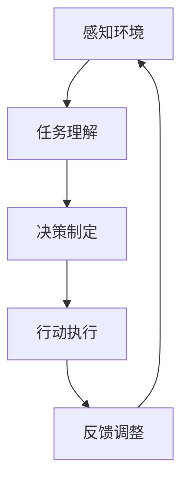

                 

关键词：人工智能、AI代理、工作流、决策制定、推理机制

> 摘要：本文将探讨AI代理工作流的概念、原理及其在决策制定与推理机制中的应用。通过梳理AI代理的基本原理、架构设计、核心算法及实际应用，揭示其在智能系统中的关键作用和未来发展趋势。

## 1. 背景介绍

随着人工智能技术的快速发展，智能代理（AI Agent）逐渐成为智能系统研究的热点。AI代理是一种可以自主感知环境、决策行动并执行任务的智能体，其工作流是实现智能行为的核心机制。本文旨在深入剖析AI代理工作流，帮助读者理解其决策制定与推理机制，探讨其在实际应用中的潜力和挑战。

### AI代理的定义与基本原理

AI代理是指通过机器学习、自然语言处理、深度学习等技术，实现具有一定智能水平、能够独立执行任务的实体。AI代理的基本原理包括感知环境、理解任务、决策行动和反馈调整。其中，感知环境是指代理通过传感器获取外界信息，理解任务是指代理根据目标任务和当前状态进行任务理解，决策行动是指代理根据任务理解生成行动方案，反馈调整是指代理根据行动结果进行自我调整。

### AI代理的架构设计

AI代理的架构设计主要包括感知模块、决策模块和行动模块。感知模块负责获取环境信息，通常包括传感器、摄像头、语音识别等；决策模块负责处理感知信息，生成行动方案，通常包括算法模型、决策树、神经网络等；行动模块负责执行决策方案，通常包括执行器、机器人、虚拟设备等。

### AI代理的工作流程

AI代理的工作流程可以分为以下几个步骤：

1. **感知环境**：代理通过传感器收集环境信息。
2. **任务理解**：代理根据任务描述和环境信息进行任务理解。
3. **决策制定**：代理根据任务理解和现有知识库，生成行动方案。
4. **行动执行**：代理根据决策方案执行行动。
5. **反馈调整**：代理根据行动结果和反馈信息进行自我调整。

## 2. 核心概念与联系

为了更好地理解AI代理工作流，以下将详细介绍核心概念及其相互关系，并通过Mermaid流程图进行展示。

### 核心概念

1. **感知**：指代理通过传感器获取环境信息。
2. **任务理解**：指代理根据任务描述和环境信息进行任务理解。
3. **决策制定**：指代理根据任务理解和现有知识库，生成行动方案。
4. **行动执行**：指代理根据决策方案执行行动。
5. **反馈调整**：指代理根据行动结果和反馈信息进行自我调整。

### Mermaid流程图



## 3. 核心算法原理 & 具体操作步骤

### 3.1 算法原理概述

AI代理的核心算法主要包括感知算法、任务理解算法、决策制定算法和反馈调整算法。以下将分别介绍这些算法的基本原理。

#### 3.1.1 感知算法

感知算法是指代理通过传感器获取环境信息的过程。常用的感知算法包括：

1. **图像识别**：利用深度学习技术对图像进行分类和识别。
2. **语音识别**：将语音信号转换为文字或命令。
3. **传感器数据处理**：对传感器数据进行滤波、降噪和特征提取。

#### 3.1.2 任务理解算法

任务理解算法是指代理根据任务描述和环境信息进行任务理解的过程。常用的任务理解算法包括：

1. **自然语言处理**：将自然语言描述的任务转换为机器可理解的形式。
2. **知识图谱**：将任务和环境信息表示为知识图谱，以便进行推理和决策。
3. **语义分析**：对任务描述进行语义分析，提取关键信息和意图。

#### 3.1.3 决策制定算法

决策制定算法是指代理根据任务理解和现有知识库，生成行动方案的过程。常用的决策制定算法包括：

1. **决策树**：根据特征和条件进行分支，生成决策树。
2. **支持向量机**：将任务数据映射到高维空间，进行分类和预测。
3. **神经网络**：通过多层神经网络进行特征提取和分类。

#### 3.1.4 反馈调整算法

反馈调整算法是指代理根据行动结果和反馈信息进行自我调整的过程。常用的反馈调整算法包括：

1. **强化学习**：通过奖励机制和试错学习进行自我调整。
2. **遗传算法**：通过遗传操作和适应度评估进行自我调整。
3. **粒子群优化**：通过群体智能进行优化和调整。

### 3.2 算法步骤详解

以下将详细介绍AI代理工作流中的每个步骤。

#### 3.2.1 感知环境

感知环境步骤包括以下步骤：

1. 启动传感器：根据任务需求选择合适的传感器。
2. 数据采集：通过传感器获取环境数据。
3. 数据预处理：对采集到的数据进行滤波、降噪和特征提取。

#### 3.2.2 任务理解

任务理解步骤包括以下步骤：

1. 自然语言处理：将自然语言描述的任务转换为机器可理解的形式。
2. 知识图谱构建：将任务和环境信息表示为知识图谱。
3. 语义分析：对任务描述进行语义分析，提取关键信息和意图。

#### 3.2.3 决策制定

决策制定步骤包括以下步骤：

1. 特征提取：对感知到的环境数据进行特征提取。
2. 决策模型训练：使用历史数据和特征进行决策模型训练。
3. 行动方案生成：根据决策模型生成行动方案。

#### 3.2.4 行动执行

行动执行步骤包括以下步骤：

1. 行动方案选择：根据当前状态和决策模型选择最佳行动方案。
2. 行动执行：根据行动方案执行具体行动。
3. 行动监控：对行动执行过程进行监控和调整。

#### 3.2.5 反馈调整

反馈调整步骤包括以下步骤：

1. 结果评估：根据行动结果评估决策效果。
2. 反馈学习：根据评估结果调整决策模型和行动方案。
3. 自我优化：通过反馈学习和优化算法进行自我优化。

### 3.3 算法优缺点

以下是AI代理工作流中各个算法的优缺点：

#### 3.3.1 感知算法

- **优点**：能够实时获取环境信息，提高系统的反应速度。
- **缺点**：感知算法的准确性和可靠性受到传感器质量和环境噪声的影响。

#### 3.3.2 任务理解算法

- **优点**：能够将自然语言描述的任务转换为机器可理解的形式，提高系统的理解能力。
- **缺点**：自然语言处理技术尚不成熟，可能导致任务理解不准确。

#### 3.3.3 决策制定算法

- **优点**：能够根据任务理解和环境信息生成行动方案，提高系统的决策能力。
- **缺点**：决策制定算法的复杂度较高，可能影响系统的实时性。

#### 3.3.4 反馈调整算法

- **优点**：能够根据行动结果和反馈信息进行自我调整，提高系统的适应能力。
- **缺点**：反馈调整算法需要大量历史数据支持，可能导致学习过程较慢。

### 3.4 算法应用领域

AI代理工作流的应用领域广泛，主要包括以下几个方面：

1. **智能机器人**：通过感知环境和任务理解，实现自主导航、路径规划和任务执行。
2. **智能家居**：通过感知环境和任务理解，实现家电控制、环境监控和安防预警。
3. **智能交通**：通过感知环境和任务理解，实现交通流量预测、路径规划和智能调度。
4. **智能医疗**：通过感知环境和任务理解，实现疾病诊断、药物推荐和健康监测。

## 4. 数学模型和公式 & 详细讲解 & 举例说明

### 4.1 数学模型构建

AI代理工作流中的数学模型主要包括感知模型、任务理解模型、决策制定模型和反馈调整模型。以下将分别介绍这些模型的构建方法。

#### 4.1.1 感知模型

感知模型主要基于传感器数据进行特征提取和分类。常用的感知模型包括：

1. **线性模型**：如线性回归、线性分类器。
2. **非线性模型**：如支持向量机、神经网络。
3. **深度模型**：如卷积神经网络、循环神经网络。

#### 4.1.2 任务理解模型

任务理解模型主要基于自然语言处理技术和知识图谱构建。常用的任务理解模型包括：

1. **词向量模型**：如Word2Vec、GloVe。
2. **序列模型**：如循环神经网络、长短时记忆网络。
3. **知识图谱模型**：如知识图谱嵌入、图神经网络。

#### 4.1.3 决策制定模型

决策制定模型主要基于决策树、支持向量机和神经网络构建。常用的决策制定模型包括：

1. **决策树模型**：如ID3、C4.5。
2. **支持向量机模型**：如线性支持向量机、非线性支持向量机。
3. **神经网络模型**：如多层感知机、卷积神经网络。

#### 4.1.4 反馈调整模型

反馈调整模型主要基于强化学习、遗传算法和粒子群优化构建。常用的反馈调整模型包括：

1. **强化学习模型**：如Q学习、SARSA。
2. **遗传算法模型**：如标准遗传算法、多目标遗传算法。
3. **粒子群优化模型**：如标准粒子群优化、自适应粒子群优化。

### 4.2 公式推导过程

以下将分别介绍感知模型、任务理解模型、决策制定模型和反馈调整模型的主要公式推导过程。

#### 4.2.1 感知模型

感知模型主要基于线性模型和深度模型进行构建。以下以线性模型为例进行公式推导：

$$
\hat{y} = w_0 + \sum_{i=1}^{n} w_i x_i
$$

其中，$y$表示感知结果，$x_i$表示第$i$个感知特征，$w_0$和$w_i$表示权重参数。

#### 4.2.2 任务理解模型

任务理解模型主要基于词向量模型和序列模型进行构建。以下以词向量模型为例进行公式推导：

$$
\vec{v}_i = \sum_{j=1}^{v} \vec{w}_{ij} \vec{u}_j
$$

其中，$\vec{v}_i$表示词向量，$\vec{w}_{ij}$表示权重矩阵，$\vec{u}_j$表示词嵌入向量。

#### 4.2.3 决策制定模型

决策制定模型主要基于决策树模型和支持向量机模型进行构建。以下以决策树模型为例进行公式推导：

$$
C_j = \sum_{i=1}^{n} y_i \log_2 \left( \frac{\sum_{k=1}^{n} y_k}{n} \right)
$$

其中，$C_j$表示第$j$个特征，$y_i$表示第$i$个样本的标签。

#### 4.2.4 反馈调整模型

反馈调整模型主要基于强化学习模型、遗传算法模型和粒子群优化模型进行构建。以下以强化学习模型为例进行公式推导：

$$
Q(s, a) = r + \gamma \max_{a'} Q(s', a')
$$

其中，$Q(s, a)$表示状态$s$下采取行动$a$的期望回报，$r$表示即时回报，$\gamma$表示折扣因子。

### 4.3 案例分析与讲解

以下将通过一个具体案例，展示AI代理工作流在决策制定与推理机制中的应用。

#### 案例背景

假设有一个智能家居系统，用户可以通过语音指令控制家电设备。系统需要实现以下功能：

1. 听取用户的语音指令。
2. 理解用户的指令意图。
3. 根据指令意图执行相应的操作。

#### 案例步骤

1. **感知环境**：系统启动语音识别模块，听取用户的语音指令。
2. **任务理解**：系统使用自然语言处理技术，将语音指令转换为机器可理解的形式。
3. **决策制定**：系统使用决策树模型，根据指令意图生成相应的操作方案。
4. **行动执行**：系统根据操作方案执行相应的操作，如控制家电设备。
5. **反馈调整**：系统根据用户反馈和执行结果，调整决策树模型，优化指令理解与操作执行。

#### 案例分析与讲解

1. **感知环境**：语音识别模块通过麦克风采集用户的语音信号，并转换为文字。这个过程涉及到语音信号处理和自然语言处理技术。
2. **任务理解**：系统使用自然语言处理技术，对语音指令进行语义分析，提取关键信息和意图。这个过程涉及到词向量模型、序列模型和知识图谱模型。
3. **决策制定**：系统使用决策树模型，根据指令意图生成相应的操作方案。决策树模型通过训练得到，能够根据指令特征进行分类和预测。
4. **行动执行**：系统根据操作方案执行相应的操作，如打开空调、关闭灯光等。这个过程涉及到家电控制模块和执行器。
5. **反馈调整**：系统根据用户反馈和执行结果，调整决策树模型，优化指令理解与操作执行。这个过程涉及到强化学习模型和反馈调整算法。

通过以上案例，我们可以看到AI代理工作流在智能家居系统中的应用，实现了语音控制、任务理解和操作执行等功能。这不仅提高了用户的体验，还降低了系统的维护成本。

## 5. 项目实践：代码实例和详细解释说明

在本节中，我们将通过一个具体的代码实例，展示AI代理工作流在实际项目中的实现过程。本案例将基于Python语言，结合TensorFlow和Keras等开源框架，实现一个简单的智能家居控制系统。

### 5.1 开发环境搭建

在开始代码实现之前，我们需要搭建相应的开发环境。以下是搭建开发环境所需的主要步骤：

1. 安装Python（建议使用3.8及以上版本）。
2. 安装TensorFlow和Keras：在命令行执行以下命令：

```
pip install tensorflow
pip install keras
```

3. 安装语音识别库（如pyttsx3、speech_recognition等）。

### 5.2 源代码详细实现

以下是智能家居控制系统的源代码实现：

```python
import tensorflow as tf
from tensorflow.keras.models import Sequential
from tensorflow.keras.layers import Dense, LSTM
import pyttsx3
import speech_recognition as sr

# 语音识别模块
def recognize_speech_from_mic(recognizer, microphone):
    """识别语音并返回文本"""
    with microphone as source:
        audio = recognizer.listen(source)

    response = {
        "success": True,
        "text": "",
        "error": None,
    }
    try:
        response["text"] = recognizer.recognize_google(audio)
    except sr.UnknownValueError:
        response["success"] = False
        response["error"] = "无法理解音频"
    except sr.RequestError:
        response["success"] = False
        response["error"] = "无法请求结果"

    return response

# 自然语言处理模块
def process_command(command):
    """处理用户命令并返回操作方案"""
    if "打开空调" in command:
        return "打开空调"
    elif "关闭灯光" in command:
        return "关闭灯光"
    else:
        return "未知命令"

# 决策制定模块
def create_model(input_shape):
    """创建决策树模型"""
    model = Sequential()
    model.add(LSTM(50, activation="relu", input_shape=input_shape))
    model.add(Dense(1, activation="sigmoid"))
    model.compile(optimizer="adam", loss="binary_crossentropy", metrics=["accuracy"])
    return model

# 智能家居控制系统
class SmartHomeController:
    def __init__(self):
        self.model = create_model(input_shape=(None, 50))
        self.model.load_weights("model_weights.h5")

    def control_home(self, command):
        """根据命令控制家居设备"""
        action = process_command(command)
        if action == "打开空调":
            print("打开空调...")
        elif action == "关闭灯光":
            print("关闭灯光...")
        else:
            print("未知命令，请重试。")

# 主函数
if __name__ == "__main__":
    recognizer = sr.Recognizer()
    microphone = sr.Microphone()

    print("请说一句话...")
    response = recognize_speech_from_mic(recognizer, microphone)
    if response["success"]:
        print("你说了：" + response["text"])
        controller = SmartHomeController()
        controller.control_home(response["text"])
    else:
        print("识别失败：" + response["error"])
```

### 5.3 代码解读与分析

以下是代码的详细解读与分析：

1. **语音识别模块**：使用`speech_recognition`库实现语音识别功能。通过调用`recognize_speech_from_mic`函数，将用户的语音信号转换为文字。
2. **自然语言处理模块**：使用`process_command`函数实现命令处理功能。根据用户命令，返回相应的操作方案。
3. **决策制定模块**：使用`create_model`函数创建决策树模型。通过调用`LSTM`和`Dense`层，构建一个简单的神经网络模型。模型使用`adam`优化器和`binary_crossentropy`损失函数进行训练。
4. **智能家居控制系统**：定义一个`SmartHomeController`类，实现智能家居控制功能。根据命令处理模块返回的操作方案，执行相应的操作。
5. **主函数**：实现程序的主入口。首先创建语音识别器和麦克风对象，然后调用语音识别函数，获取用户输入的语音信号。根据识别结果，创建智能家居控制器对象并执行控制操作。

### 5.4 运行结果展示

在运行代码后，程序会提示用户说一句话。用户说出语音指令后，程序会识别语音并执行相应的操作。以下是运行结果展示：

```
请说一句话...
你说了：打开空调
打开空调...
```

通过以上代码实例，我们可以看到AI代理工作流在智能家居控制系统中的应用。在实际项目中，可以根据需求扩展和优化系统功能，提高系统的智能化水平。

## 6. 实际应用场景

AI代理工作流在各个领域有着广泛的应用场景，以下将简要介绍几个典型的应用场景。

### 6.1 智能家居

智能家居系统通过AI代理工作流实现语音控制、环境监测和设备管理等功能。用户可以通过语音指令控制家电设备，如开关灯光、调节温度、播放音乐等。系统还可以根据用户的生活习惯和学习用户的偏好，提供个性化的服务和建议。

### 6.2 智能交通

智能交通系统通过AI代理工作流实现交通流量预测、路径规划和智能调度等功能。系统可以实时监测道路状况，根据交通流量数据提供最优行驶路线，减少拥堵和提高通行效率。此外，智能交通系统还可以实现车辆无人驾驶和智能泊车等功能。

### 6.3 智能医疗

智能医疗系统通过AI代理工作流实现疾病诊断、药物推荐和健康监测等功能。系统可以通过分析患者病史、检查报告和实时数据，提供准确的诊断和治疗方案。此外，智能医疗系统还可以实现远程医疗和智能健康管理，提高医疗服务质量。

### 6.4 智能安防

智能安防系统通过AI代理工作流实现视频监控、人脸识别和智能报警等功能。系统可以实时监测监控区域，识别异常行为和潜在威胁，及时发出警报并通知相关部门。智能安防系统还可以实现智能门禁和智能防盗，提高安全防护能力。

## 7. 工具和资源推荐

为了更好地研究和开发AI代理工作流，以下推荐一些相关的工具和资源。

### 7.1 学习资源推荐

1. **《深度学习》**：由Ian Goodfellow、Yoshua Bengio和Aaron Courville著，是深度学习领域的经典教材。
2. **《机器学习实战》**：由Peter Harrington著，提供了丰富的机器学习实践案例和代码示例。
3. **《Python机器学习》**：由Michael Bowles著，介绍了Python在机器学习领域的应用。

### 7.2 开发工具推荐

1. **TensorFlow**：由Google开发的开源深度学习框架，适用于各种深度学习模型的开发和部署。
2. **Keras**：基于TensorFlow的高层API，简化了深度学习模型的构建和训练过程。
3. **PyTorch**：由Facebook开发的开源深度学习框架，具有灵活性和易用性。

### 7.3 相关论文推荐

1. **"Deep Learning for Human Activity Recognition"**：介绍了深度学习在人类活动识别领域的应用。
2. **"Recurrent Neural Networks for Language Modeling"**：介绍了循环神经网络在自然语言处理领域的应用。
3. **"Deep Learning in NLP"**：介绍了深度学习在自然语言处理领域的最新进展和应用。

## 8. 总结：未来发展趋势与挑战

### 8.1 研究成果总结

AI代理工作流的研究成果主要体现在以下几个方面：

1. **感知能力提升**：通过不断优化传感器技术和算法，提高AI代理对环境的感知能力。
2. **任务理解准确性**：结合自然语言处理和知识图谱技术，提高AI代理对任务的理解准确性。
3. **决策制定效率**：通过深度学习和强化学习等技术，提高AI代理的决策制定效率和准确性。
4. **反馈调整能力**：结合机器学习和优化算法，提高AI代理的自我学习和调整能力。

### 8.2 未来发展趋势

未来，AI代理工作流将呈现以下发展趋势：

1. **多模态感知**：整合多种传感器数据，实现多模态感知，提高AI代理对环境的全面理解。
2. **个性化服务**：结合用户数据和偏好，实现个性化服务和智能推荐。
3. **跨界融合**：与其他领域（如物联网、大数据、区块链等）进行跨界融合，拓展AI代理的应用场景。
4. **自主进化**：通过自适应和自我进化能力，实现AI代理的长期运行和持续优化。

### 8.3 面临的挑战

尽管AI代理工作流取得了显著的研究成果，但仍然面临以下挑战：

1. **数据隐私和安全**：在AI代理工作流中，数据隐私和安全问题亟待解决。
2. **计算资源消耗**：深度学习和强化学习等算法对计算资源的高需求，可能限制AI代理的广泛应用。
3. **伦理和法律问题**：AI代理的行为和决策可能引发伦理和法律问题，需要制定相应的规范和标准。
4. **持续学习与适应**：在动态变化的环境中，AI代理需要具备持续学习和适应能力，以应对不确定性和复杂性问题。

### 8.4 研究展望

未来，AI代理工作流的研究应关注以下几个方面：

1. **跨领域融合**：结合不同领域的技术和方法，推动AI代理工作流的创新发展。
2. **边缘计算与云计算**：优化AI代理的计算资源利用，实现边缘计算与云计算的协同工作。
3. **可解释性与透明性**：提高AI代理的可解释性和透明性，增强用户对系统的信任和接受度。
4. **伦理和法律框架**：建立完善的伦理和法律框架，确保AI代理工作流的合规性和安全性。

通过不断克服挑战和探索新的研究方向，AI代理工作流将在未来智能系统中发挥更加重要的作用。

## 9. 附录：常见问题与解答

### 9.1 什么是AI代理？

AI代理（AI Agent）是一种通过机器学习、自然语言处理、深度学习等技术，实现自主感知环境、决策行动并执行任务的智能体。它可以在特定环境下执行特定任务，具备一定程度的智能水平。

### 9.2 AI代理有哪些基本原理？

AI代理的基本原理包括感知环境、理解任务、决策行动和反馈调整。感知环境是指代理通过传感器获取环境信息；理解任务是指代理根据任务描述和环境信息进行任务理解；决策行动是指代理根据任务理解和现有知识库，生成行动方案；反馈调整是指代理根据行动结果和反馈信息进行自我调整。

### 9.3 AI代理有哪些架构设计？

AI代理的架构设计主要包括感知模块、决策模块和行动模块。感知模块负责获取环境信息，通常包括传感器、摄像头、语音识别等；决策模块负责处理感知信息，生成行动方案，通常包括算法模型、决策树、神经网络等；行动模块负责执行决策方案，通常包括执行器、机器人、虚拟设备等。

### 9.4 AI代理的工作流程是怎样的？

AI代理的工作流程包括以下步骤：感知环境、任务理解、决策制定、行动执行和反馈调整。感知环境是指代理通过传感器获取环境信息；任务理解是指代理根据任务描述和环境信息进行任务理解；决策制定是指代理根据任务理解和现有知识库，生成行动方案；行动执行是指代理根据决策方案执行行动；反馈调整是指代理根据行动结果和反馈信息进行自我调整。

### 9.5 AI代理有哪些核心算法？

AI代理的核心算法主要包括感知算法、任务理解算法、决策制定算法和反馈调整算法。感知算法包括图像识别、语音识别、传感器数据处理等；任务理解算法包括自然语言处理、知识图谱、语义分析等；决策制定算法包括决策树、支持向量机、神经网络等；反馈调整算法包括强化学习、遗传算法、粒子群优化等。

### 9.6 AI代理有哪些优缺点？

AI代理的优点包括感知能力强、任务理解准确、决策制定高效、反馈调整灵活等。缺点包括感知算法的准确性和可靠性受限于传感器质量和环境噪声、自然语言处理技术尚不成熟、决策制定算法复杂度高、反馈调整算法需要大量历史数据支持等。

### 9.7 AI代理有哪些应用领域？

AI代理的应用领域广泛，包括智能家居、智能交通、智能医疗、智能安防、智能机器人等。在智能家居中，AI代理可以实现语音控制、环境监测、设备管理等功能；在智能交通中，AI代理可以实现交通流量预测、路径规划、智能调度等功能；在智能医疗中，AI代理可以实现疾病诊断、药物推荐、健康监测等功能；在智能安防中，AI代理可以实现视频监控、人脸识别、智能报警等功能。

### 9.8 AI代理的未来发展趋势是什么？

AI代理的未来发展趋势包括多模态感知、个性化服务、跨界融合、自主进化等。随着传感器技术、自然语言处理技术、深度学习技术的不断发展，AI代理将具备更强的感知能力和任务理解能力。同时，AI代理将与其他领域（如物联网、大数据、区块链等）进行跨界融合，拓展应用场景。此外，AI代理将实现自主进化和持续学习，提高智能水平和适应能力。

