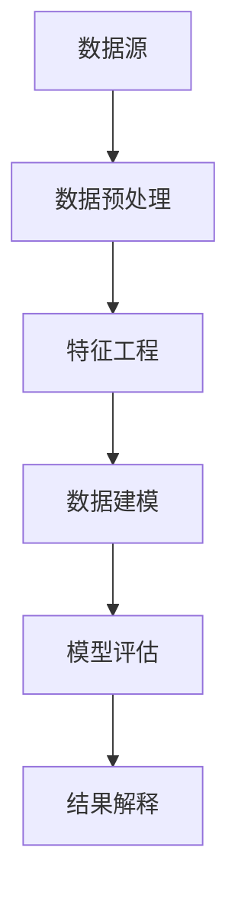

                 

## 1. 背景介绍

人工智能（AI）是计算机科学的一个分支，旨在创建能够模拟、延伸和扩展人类智能的理论、算法和技术。随着大数据、云计算和深度学习等技术的飞速发展，人工智能在各个领域都取得了显著的成就。数据挖掘是人工智能中的一个重要分支，它涉及从大量数据中提取有价值的信息和知识，是许多应用场景（如推荐系统、金融风控、医疗诊断等）的关键技术。

本文旨在深入探讨人工智能领域中的核心算法，尤其是数据挖掘算法的原理与应用。我们将从以下几个方面展开：

- **核心概念与联系**：介绍数据挖掘中的核心概念及其相互关系，使用Mermaid流程图展示其架构。
- **核心算法原理与具体操作步骤**：详细解析常见数据挖掘算法，包括其原理、步骤、优缺点及应用领域。
- **数学模型与公式**：讲解数据挖掘中常用的数学模型和公式，并进行案例分析与讲解。
- **项目实践**：通过具体代码实例展示算法的实现过程，并进行解读与分析。
- **实际应用场景**：探讨数据挖掘在各个领域的应用场景及其未来发展趋势。
- **工具和资源推荐**：推荐学习资源、开发工具和相关论文。
- **总结与展望**：总结研究成果，展望未来发展趋势与挑战。

通过本文的学习，读者将能够全面了解数据挖掘算法的核心原理和实际应用，为今后的研究和实践打下坚实基础。

## 2. 核心概念与联系

数据挖掘作为人工智能领域的一个重要分支，涉及多个核心概念。这些概念不仅相互独立，而且在实际应用中密切联系，共同构成了一个完整的数据挖掘流程。下面，我们将通过Mermaid流程图来展示这些核心概念及其相互关系。

### 数据源

数据源是数据挖掘的起点，也是数据挖掘中最重要的资源。数据源可以是结构化数据（如数据库）、半结构化数据（如XML、JSON）和非结构化数据（如文本、图像、音频）。不同的数据源特点决定了数据挖掘的方法和难度。

### 数据预处理

数据预处理是数据挖掘中的关键步骤，其目的是提高数据质量，为后续的数据分析和建模提供高质量的数据。数据预处理包括数据清洗、数据集成、数据转换和数据归一化等操作。这些操作确保数据的一致性、完整性和准确性。

### 特征工程

特征工程是数据挖掘中的一项重要工作，其目的是从原始数据中提取出对特定任务有重要意义的特征。特征工程不仅影响模型的效果，还直接影响数据挖掘的效率和可解释性。常见的特征工程方法包括特征选择、特征提取和特征变换。

### 数据建模

数据建模是数据挖掘的核心步骤，旨在从数据中构建一个能够反映数据内在规律的模型。常用的数据挖掘算法包括分类、聚类、关联规则挖掘、时间序列分析等。这些算法通过不同的数学模型来实现，针对不同的任务有不同的应用效果。

### 模型评估

模型评估是验证数据挖掘模型性能的重要环节。常用的评估指标包括准确率、召回率、F1值、ROC曲线等。通过模型评估，可以确定模型是否满足实际需求，并为进一步优化提供依据。

### 结果解释

结果解释是数据挖掘应用中的关键环节，旨在将复杂的模型结果转化为易于理解和解释的信息。通过结果解释，用户可以更好地理解数据挖掘模型的工作原理和结果意义，为决策提供有力支持。

### Mermaid流程图

下面是数据挖掘核心概念的Mermaid流程图：

通过这个流程图，我们可以清晰地看到数据挖掘各步骤之间的联系和相互作用，为后续的内容展开提供了直观的参考。

## 3. 核心算法原理与具体操作步骤

### 3.1 算法原理概述

数据挖掘算法种类繁多，每种算法都有其独特的原理和应用场景。以下是几种常见的数据挖掘算法及其原理概述：

1. **分类算法**：分类算法是将数据集中的样本分为不同的类别。常见的分类算法包括决策树、随机森林、支持向量机（SVM）和K近邻（KNN）等。
   
2. **聚类算法**：聚类算法将相似的数据点归为一类，以发现数据中的自然分组。常见的聚类算法包括K-means、层次聚类和DBSCAN等。

3. **关联规则挖掘**：关联规则挖掘旨在发现数据项之间的相关性。常见的算法包括Apriori算法和Eclat算法。

4. **时间序列分析**：时间序列分析用于分析数据随时间的变化规律。常见的方法包括ARIMA模型、季节性分解和趋势分析等。

### 3.2 算法步骤详解

1. **分类算法**

   - **决策树**：
     - **原理**：决策树通过一系列条件分支来对数据进行分类。每个节点代表一个特征，每个分支代表这个特征的一个取值。
     - **步骤**：
       1. 选择一个特征作为节点。
       2. 计算每个特征的不同取值下的信息增益或基尼指数。
       3. 选择增益最大的特征作为节点，并创建分支。
       4. 对每个分支递归地执行上述步骤，直到满足停止条件（如最大深度、最小叶节点数等）。
     - **优缺点**：
       - 优点：直观易懂，易于解释。
       - 缺点：易过拟合，对噪声敏感。

   - **随机森林**：
     - **原理**：随机森林是一种集成学习方法，通过构建多个决策树并取其多数投票结果来提高分类准确率。
     - **步骤**：
       1. 随机选择特征子集。
       2. 构建单个决策树。
       3. 重复步骤1和2，构建多个决策树。
       4. 对每个样本在多个决策树上进行投票，取多数投票结果作为最终分类结果。
     - **优缺点**：
       - 优点：强鲁棒性，能够处理高维度数据。
       - 缺点：计算复杂度较高，对噪声较为敏感。

   - **支持向量机（SVM）**：
     - **原理**：SVM通过找到最佳超平面来最大化分类间隔，从而实现数据的分类。
     - **步骤**：
       1. 选择一个核函数（如线性核、多项式核、径向基函数核等）。
       2. 通过求解最优化问题找到最佳超平面。
       3. 对新的样本进行分类，计算其到超平面的距离。
       4. 根据距离判断其类别。
     - **优缺点**：
       - 优点：具有很好的泛化能力，能够在高维空间中找到最佳分类边界。
       - 缺点：对异常值敏感，计算复杂度较高。

   - **K近邻（KNN）**：
     - **原理**：KNN算法通过计算新样本与训练样本之间的距离，并基于距离最近的K个样本的多数类别进行分类。
     - **步骤**：
       1. 计算新样本与训练样本之间的距离（如欧氏距离、曼哈顿距离等）。
       2. 选择距离最近的K个样本。
       3. 对K个样本的类别进行投票，取多数类别作为最终分类结果。
     - **优缺点**：
       - 优点：简单易懂，易于实现。
       - 缺点：计算复杂度较高，对噪声敏感。

2. **聚类算法**

   - **K-means**：
     - **原理**：K-means算法通过迭代的方式将数据点划分为K个簇，每个簇由其质心代表。
     - **步骤**：
       1. 初始化K个质心。
       2. 对于每个数据点，计算其到各个质心的距离，并将其分配到最近的簇。
       3. 更新质心，使得每个簇的质心尽量接近其簇内的数据点。
       4. 重复步骤2和3，直到满足停止条件（如收敛阈值、最大迭代次数等）。
     - **优缺点**：
       - 优点：计算简单，易于实现。
       - 缺点：对初始质心敏感，易陷入局部最优。

   - **层次聚类**：
     - **原理**：层次聚类通过逐步合并或分裂现有的簇，构建一个层次结构的聚类结果。
     - **步骤**：
       1. 初始化单个簇。
       2. 在每个层次上，计算所有簇之间的距离，选择最近的两个簇进行合并或分裂。
       3. 重复步骤2，直到满足停止条件（如达到最大层次、所有簇合并为一个簇等）。
     - **优缺点**：
       - 优点：能够发现不同层次的结构信息。
       - 缺点：计算复杂度较高，对初始簇敏感。

   - **DBSCAN**：
     - **原理**：DBSCAN算法通过密度 reachable 连通性来定义簇，可以自动确定簇的数量。
     - **步骤**：
       1. 初始化参数ε和minPts。
       2. 对于每个数据点，检查其是否满足密度 reachable 连通性条件。
       3. 将满足条件的数据点划分为同一簇。
       4. 重复步骤2和3，直到所有数据点都被划分为簇。
     - **优缺点**：
       - 优点：能够发现任意形状的簇。
       - 缺点：对噪声敏感，参数选择较为困难。

3. **关联规则挖掘**

   - **Apriori算法**：
     - **原理**：Apriori算法通过逐层搜索频繁项集，并利用候选生成方法来挖掘关联规则。
     - **步骤**：
       1. 计算频繁1项集。
       2. 使用频繁1项集生成候选k项集。
       3. 计算候选k项集的支持度。
       4. 移除不满足最小支持度的候选k项集。
       5. 递归地重复步骤2-4，直到k达到最大长度。
     - **优缺点**：
       - 优点：简单高效，适用于大量稀疏数据。
       - 缺点：计算复杂度高，对噪声敏感。

   - **Eclat算法**：
     - **原理**：Eclat算法是基于Apriori算法的改进，通过连接项集并计算支持度来生成频繁项集。
     - **步骤**：
       1. 计算频繁1项集。
       2. 对于每个频繁1项集，计算其连接项集的支持度。
       3. 移除不满足最小支持度的连接项集。
       4. 递归地重复步骤2和3，直到满足最小支持度。
     - **优缺点**：
       - 优点：计算复杂度较低，适用于高维稀疏数据。
       - 缺点：对噪声敏感。

4. **时间序列分析**

   - **ARIMA模型**：
     - **原理**：ARIMA模型通过自回归（AR）、差分（I）和移动平均（MA）来建模时间序列。
     - **步骤**：
       1. 对时间序列进行差分，使其平稳。
       2. 确定ARIMA模型中的p、d、q参数。
       3. 拟合ARIMA模型，并评估其性能。
       4. 使用拟合模型进行预测。
     - **优缺点**：
       - 优点：能够处理非平稳时间序列，具有较好的预测性能。
       - 缺点：建模过程较为复杂，对参数选择敏感。

   - **季节性分解**：
     - **原理**：季节性分解通过分离时间序列中的趋势、季节性和残差成分，来分析时间序列的周期性特征。
     - **步骤**：
       1. 对时间序列进行移动平均，分离出趋势成分。
       2. 对趋势成分进行季节性分解，分离出季节性成分。
       3. 对季节性成分进行残差分解，分离出残差成分。
       4. 分析各个成分，提取周期性特征。
     - **优缺点**：
       - 优点：能够识别时间序列的季节性特征。
       - 缺点：对噪声敏感，处理复杂。

### 3.3 算法优缺点

每种数据挖掘算法都有其独特的优势和局限性。以下是常见算法的优缺点总结：

- **分类算法**：
  - **决策树**：直观易懂，易于解释，但易过拟合，对噪声敏感。
  - **随机森林**：强鲁棒性，能够处理高维度数据，但计算复杂度较高。
  - **支持向量机（SVM）**：具有很好的泛化能力，能够在高维空间中找到最佳分类边界，但对异常值敏感，计算复杂度较高。
  - **K近邻（KNN）**：简单易懂，易于实现，但计算复杂度较高，对噪声敏感。

- **聚类算法**：
  - **K-means**：计算简单，易于实现，但易陷入局部最优，对初始质心敏感。
  - **层次聚类**：能够发现不同层次的结构信息，但计算复杂度较高，对初始簇敏感。
  - **DBSCAN**：能够发现任意形状的簇，但对噪声敏感，参数选择较为困难。

- **关联规则挖掘**：
  - **Apriori算法**：简单高效，适用于大量稀疏数据，但计算复杂度高，对噪声敏感。
  - **Eclat算法**：计算复杂度较低，适用于高维稀疏数据，但

