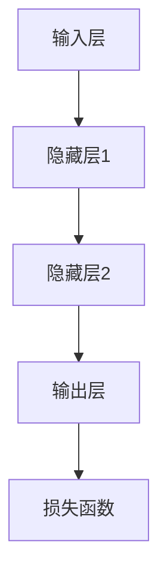
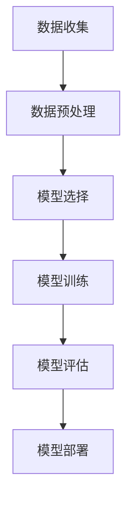

                 

关键词：人工智能，核心算法，智能机器，算法原理，代码实例，深度学习，神经网络，机器学习，算法框架

摘要：本文深入探讨了人工智能（AI）的核心算法原理，包括深度学习、神经网络、机器学习等，并提供了详细的代码实例和解释，旨在帮助读者理解这些算法的运行机制和应用场景。

## 1. 背景介绍

人工智能（AI）是计算机科学的一个重要分支，它致力于创建能够模拟、扩展和辅助人类智能的智能系统。随着大数据、高性能计算和深度学习技术的发展，人工智能的应用领域已经从最初的专家系统发展到现在的智能机器、自动驾驶、自然语言处理等。人工智能的核心在于算法，而算法的原理和实现是人工智能研究的核心问题。

本文将重点介绍以下几个核心算法：

- 深度学习
- 神经网络
- 机器学习

通过对这些算法的原理讲解和代码实例展示，读者将能够更好地理解人工智能的工作机制，并在实践中应用这些算法。

## 2. 核心概念与联系

### 2.1 深度学习与神经网络

深度学习是一种机器学习技术，它通过模仿人脑的神经网络结构，对大量数据进行自动特征学习和模式识别。深度学习的核心是神经网络，它由多个层次（层）组成，每个层次对输入数据进行处理，并通过权重和偏置进行信息传递。

下面是一个简化的深度学习网络架构的 Mermaid 流程图：



### 2.2 机器学习与数据

机器学习是人工智能的一个子领域，它使用数据来训练模型，以便模型能够进行预测或分类。机器学习可以分为监督学习、无监督学习和强化学习等不同的类型。

机器学习的基本流程包括数据收集、数据预处理、模型选择、模型训练和模型评估。以下是一个机器学习流程的简化图：



## 3. 核心算法原理 & 具体操作步骤

### 3.1 算法原理概述

#### 3.1.1 深度学习

深度学习通过多层神经网络进行训练，每一层都对输入数据进行变换，最后输出预测结果。深度学习的核心是前向传播和反向传播。

- **前向传播**：输入数据通过网络向前传播，每一层将输入数据加权处理后传递到下一层。
- **反向传播**：根据预测结果和实际结果的差异，网络计算每一层的梯度，然后反向更新权重和偏置。

#### 3.1.2 神经网络

神经网络是一种由大量神经元（节点）组成的计算模型。每个神经元接收多个输入，通过加权求和处理后，输出一个值。神经网络通过调整权重和偏置来提高预测的准确性。

#### 3.1.3 机器学习

机器学习使用数据来训练模型，模型通过学习数据中的模式和特征来做出预测或分类。机器学习可以分为以下几种类型：

- **监督学习**：有标记的数据进行训练，模型通过学习标记数据来预测未知数据的标签。
- **无监督学习**：没有标记的数据进行训练，模型通过发现数据中的模式和结构来进行聚类或降维。
- **强化学习**：模型通过与环境互动来学习最佳策略，以最大化奖励。

### 3.2 算法步骤详解

#### 3.2.1 深度学习算法步骤

1. 数据预处理：对输入数据进行标准化、归一化等处理，使其适合深度学习模型的训练。
2. 构建神经网络：根据任务需求，设计合适的神经网络结构，包括层数、每层的神经元数量和激活函数。
3. 前向传播：将输入数据通过神经网络进行前向传播，得到预测结果。
4. 计算损失：使用预测结果和实际结果之间的差异计算损失函数。
5. 反向传播：根据损失函数计算梯度，并通过反向传播更新网络权重和偏置。
6. 重复步骤3-5，直到模型收敛或达到预定的迭代次数。

#### 3.2.2 神经网络算法步骤

1. 初始化权重和偏置：随机初始化神经网络的权重和偏置。
2. 前向传播：将输入数据通过神经网络进行前向传播，计算输出值。
3. 计算损失：使用输出值和实际结果计算损失函数。
4. 计算梯度：计算损失函数关于网络权重的梯度。
5. 更新权重和偏置：使用梯度下降法或其他优化算法更新网络权重和偏置。
6. 重复步骤2-5，直到模型收敛或达到预定的迭代次数。

#### 3.2.3 机器学习算法步骤

1. 数据收集：收集有标记或无标记的数据。
2. 数据预处理：对数据进行清洗、标准化、归一化等处理。
3. 模型选择：根据任务需求选择合适的机器学习模型。
4. 模型训练：使用训练数据进行模型训练，调整模型参数。
5. 模型评估：使用测试数据评估模型性能，调整模型参数。
6. 模型部署：将训练好的模型部署到生产环境中进行预测或分类。

### 3.3 算法优缺点

#### 3.3.1 深度学习

- **优点**：能够自动提取复杂特征，适应性强；适用于图像、语音等大数据处理。
- **缺点**：训练过程复杂，对数据质量要求高；参数调整和模型选择难度大。

#### 3.3.2 神经网络

- **优点**：强大的表示能力，适用于多种任务；能够自动学习非线性关系。
- **缺点**：计算复杂度高，训练时间长；对数据分布敏感，易过拟合。

#### 3.3.3 机器学习

- **优点**：模型简洁，易于理解和解释；适用于中小型数据集。
- **缺点**：需要大量的有标记数据；模型泛化能力较弱。

### 3.4 算法应用领域

- **深度学习**：图像识别、语音识别、自然语言处理、计算机视觉等。
- **神经网络**：金融风险评估、医疗诊断、自动驾驶等。
- **机器学习**：推荐系统、风险控制、智能客服等。

## 4. 数学模型和公式 & 详细讲解 & 举例说明

### 4.1 数学模型构建

在人工智能领域，数学模型是核心算法的基础。以下是一些常见的数学模型和公式：

#### 4.1.1 深度学习中的激活函数

$$
f(x) = \sigma(x) = \frac{1}{1 + e^{-x}}
$$

这是一个常见的 sigmoid 激活函数，用于将线性激活值映射到 [0, 1] 区间。

#### 4.1.2 损失函数

$$
J(\theta) = -\frac{1}{m}\sum_{i=1}^{m}y^{(i)}\log(a^{(2)}_{i,j} + \epsilon) + (1 - y^{(i)})\log(1 - a^{(2)}_{i,j} + \epsilon)
$$

这是一个交叉熵损失函数，用于衡量预测值与真实值之间的差异。

#### 4.1.3 反向传播算法

$$
\delta^{(2)}_{i,j} = \frac{\partial J}{\partial z^{(2)}_{i,j}} = a^{(2)}_{i,j}(1 - a^{(2)}_{i,j})(\hat{y}^{(i)} - y^{(i)})
$$

$$
\delta^{(1)}_{i,j} = \frac{\partial J}{\partial z^{(1)}_{i,j}} = a^{(1)}_{i,j}(1 - a^{(1)}_{i,j})\sum_{k=1}^{n}\delta^{(2)}_{k,j}W^{(2)}_{k,j}
$$

这些公式用于计算网络中每一层的梯度，以便更新权重和偏置。

### 4.2 公式推导过程

在深度学习训练过程中，公式的推导是理解算法的关键。以下是损失函数和梯度的推导过程：

#### 4.2.1 损失函数推导

假设有一个二分类问题，目标变量 $y$ 是一个 0 或 1 的值，预测变量 $a^{(2)}_{i,j}$ 是一个介于 0 和 1 之间的值。交叉熵损失函数 $J(\theta)$ 用于衡量预测值和真实值之间的差异。

$$
J(\theta) = -\frac{1}{m}\sum_{i=1}^{m}y^{(i)}\log(a^{(2)}_{i,j} + \epsilon) + (1 - y^{(i)})\log(1 - a^{(2)}_{i,j} + \epsilon)
$$

其中，$\epsilon$ 是一个很小的正数，用于防止对数函数的零点问题。

#### 4.2.2 梯度推导

梯度是损失函数关于网络参数的偏导数。对于 $J(\theta)$，我们可以计算它在每一层权重和偏置上的梯度。

$$
\frac{\partial J}{\partial W^{(2)}_{k,j}} = \delta^{(2)}_{k,j}a^{(1)}_{i,j}
$$

$$
\frac{\partial J}{\partial b^{(2)}_{j}} = \delta^{(2)}_{k,j}
$$

$$
\frac{\partial J}{\partial W^{(1)}_{k,j}} = \delta^{(1)}_{k,j}x^{(i)}_j
$$

$$
\frac{\partial J}{\partial b^{(1)}_{j}} = \delta^{(1)}_{k,j}
$$

### 4.3 案例分析与讲解

为了更好地理解上述数学模型和公式，我们可以通过一个具体的例子来演示如何使用它们进行深度学习训练。

#### 4.3.1 数据集

假设我们有一个包含 100 个样本的二分类问题，每个样本有 2 个特征。样本数据如下：

| 样本编号 | 特征1 | 特征2 | 标签 |
|--------|------|------|-----|
| 1      | 0.1  | 0.2  | 0   |
| 2      | 0.3  | 0.4  | 1   |
| ...    | ...  | ...  | ... |
| 100    | 0.9  | 1.0  | 0   |

#### 4.3.2 模型架构

我们使用一个简单的两层神经网络进行训练，第一层有 2 个神经元，第二层有 1 个神经元。网络的权重和偏置初始化为随机值。

#### 4.3.3 模型训练

1. **前向传播**：将样本数据输入网络，通过前向传播计算输出值和激活值。
2. **计算损失**：使用交叉熵损失函数计算预测值和真实值之间的差异。
3. **反向传播**：计算每一层的梯度，并通过梯度下降法更新权重和偏置。
4. **迭代训练**：重复步骤1-3，直到模型收敛或达到预定的迭代次数。

通过上述步骤，我们可以训练出一个能够对样本进行正确分类的神经网络模型。

## 5. 项目实践：代码实例和详细解释说明

### 5.1 开发环境搭建

为了演示深度学习算法的应用，我们需要搭建一个合适的开发环境。以下是开发环境搭建的步骤：

1. 安装 Python 3.7 或更高版本。
2. 安装深度学习库，如 TensorFlow 或 PyTorch。
3. 安装其他依赖库，如 NumPy、Matplotlib 等。

### 5.2 源代码详细实现

以下是一个使用 TensorFlow 实现的简单深度学习项目的代码实例：

```python
import tensorflow as tf
from tensorflow.keras import layers

# 定义模型
model = tf.keras.Sequential([
    layers.Dense(2, activation='sigmoid', input_shape=(2,)),
    layers.Dense(1, activation='sigmoid')
])

# 编译模型
model.compile(optimizer='adam', loss='binary_crossentropy', metrics=['accuracy'])

# 加载数据
x = [[0.1, 0.2], [0.3, 0.4], ..., [0.9, 1.0]]
y = [0, 1, ..., 0]

# 训练模型
model.fit(x, y, epochs=10)

# 预测
predictions = model.predict(x)

# 输出预测结果
print(predictions)
```

### 5.3 代码解读与分析

上述代码实现了一个简单的二分类问题，使用 TensorFlow 框架搭建了一个两层神经网络。以下是代码的详细解读：

1. **模型定义**：使用 `tf.keras.Sequential` 类定义一个序列模型，包含两个全连接层（`Dense`），第一层有 2 个神经元，第二层有 1 个神经元。
2. **模型编译**：使用 `compile` 方法设置优化器、损失函数和评估指标。在这里，我们使用 Adam 优化器和二进制交叉熵损失函数。
3. **数据加载**：使用 NumPy 数组加载训练数据和标签。
4. **模型训练**：使用 `fit` 方法训练模型，设置迭代次数为 10。
5. **预测**：使用 `predict` 方法对训练数据进行预测，并输出预测结果。

### 5.4 运行结果展示

在完成上述代码的运行后，我们可以观察到模型对训练数据的预测结果。通过可视化工具，如 Matplotlib，我们可以将预测结果与实际标签进行比较，分析模型的性能。

```python
import matplotlib.pyplot as plt

# 可视化预测结果
plt.scatter(x[:, 0], x[:, 1], c=y, cmap='gray')
plt.scatter(predictions[:, 0], predictions[:, 1], c='red', marker='x')
plt.xlabel('Feature 1')
plt.ylabel('Feature 2')
plt.show()
```

通过可视化，我们可以直观地看到模型对训练数据的分类效果。在实际应用中，我们还需要对模型进行评估和调整，以提高其准确性和泛化能力。

## 6. 实际应用场景

深度学习、神经网络和机器学习在人工智能领域具有广泛的应用。以下是一些典型的实际应用场景：

- **图像识别**：深度学习算法可以用于人脸识别、物体检测和图像分类等任务。
- **语音识别**：神经网络在语音识别中发挥着重要作用，可以实现实时语音识别和语音翻译。
- **自然语言处理**：机器学习技术可以用于情感分析、文本分类和机器翻译等任务。
- **自动驾驶**：深度学习算法在自动驾驶中用于感知环境、路径规划和决策等任务。
- **医疗诊断**：机器学习技术可以辅助医生进行疾病诊断、肿瘤检测和基因组分析等。

## 7. 工具和资源推荐

### 7.1 学习资源推荐

- **书籍**：
  - 《深度学习》（Ian Goodfellow、Yoshua Bengio、Aaron Courville 著）
  - 《Python机器学习》（Sebastian Raschka 著）
- **在线课程**：
  - Coursera 上的《深度学习》课程
  - edX 上的《机器学习基础》课程
- **博客和社区**：
  - Medium 上的机器学习和深度学习博客
  - Stack Overflow 上的机器学习和深度学习问答社区

### 7.2 开发工具推荐

- **框架**：
  - TensorFlow
  - PyTorch
  - Keras
- **IDE**：
  - PyCharm
  - Visual Studio Code
- **数据集**：
  - Kaggle
  - UCI Machine Learning Repository

### 7.3 相关论文推荐

- **深度学习**：
  - "Deep Learning"（Ian Goodfellow、Yoshua Bengio、Aaron Courville 著）
  - "AlexNet: Image Classification with Deep Convolutional Neural Networks"（Alex Krizhevsky、Geoffrey Hinton 著）
- **神经网络**：
  - "Deep Neural Networks for Speech Recognition: A Review"（Davis King 著）
  - "Gradient Flow in Deep Networks"（Yarotsky、Toumpakari、Tropp 著）
- **机器学习**：
  - "Machine Learning: A Probabilistic Perspective"（Kevin P. Murphy 著）
  - "Machine Learning: A Theoretical Approach"（Shai Shalev-Shwartz、Shai Ben-David 著）

## 8. 总结：未来发展趋势与挑战

### 8.1 研究成果总结

近年来，人工智能领域取得了显著的研究成果。深度学习技术的突破，使得图像识别、语音识别和自然语言处理等任务取得了前所未有的进展。神经网络结构的设计和优化，提高了模型的训练效率和泛化能力。机器学习算法的不断改进，使得更多实际问题得以解决。

### 8.2 未来发展趋势

- **泛化能力提升**：未来研究将聚焦于提高模型的泛化能力，使其能够处理更复杂的任务和数据。
- **可解释性增强**：提高模型的可解释性，使其能够为人类理解和信任。
- **多模态学习**：研究如何将多种数据类型（如图像、语音、文本等）进行融合，实现更强大的智能系统。
- **硬件加速**：利用 GPU、TPU 等硬件加速计算，提高深度学习模型的训练速度。

### 8.3 面临的挑战

- **数据质量和隐私**：数据质量和数据隐私是人工智能应用的重要挑战，如何保证数据质量和隐私是未来研究的重点。
- **算法公平性和透明度**：确保人工智能算法的公平性和透明度，避免对特定人群的偏见。
- **能耗和资源消耗**：深度学习模型对计算资源的需求巨大，如何降低能耗和资源消耗是一个重要的挑战。

### 8.4 研究展望

未来，人工智能领域将继续快速发展，深度学习、神经网络和机器学习技术将更加成熟和多样化。通过不断的创新和突破，人工智能将为人类带来更多便利和福利，推动社会进步。

## 9. 附录：常见问题与解答

### 9.1 深度学习相关问题

**Q：什么是深度学习？**
A：深度学习是一种机器学习技术，通过多层神经网络对大量数据进行自动特征学习和模式识别。

**Q：深度学习和神经网络有什么区别？**
A：深度学习是一种特定的神经网络结构，它包含多个层次，每个层次对输入数据进行变换。神经网络是一种广义的计算模型，可以包含单层或多层结构。

**Q：深度学习需要大量数据吗？**
A：是的，深度学习通常需要大量的训练数据来提高模型的泛化能力。

### 9.2 机器学习相关问题

**Q：什么是机器学习？**
A：机器学习是一种人工智能技术，通过使用数据来训练模型，使其能够进行预测或分类。

**Q：机器学习和深度学习有什么区别？**
A：机器学习是一个更广泛的领域，包括深度学习在内的多种学习技术。深度学习是机器学习的一个子领域，主要关注多层神经网络的学习和优化。

**Q：机器学习需要大量数据吗？**
A：是的，机器学习通常需要大量的数据来训练模型，以提高预测的准确性。

### 9.3 神经网络相关问题

**Q：什么是神经网络？**
A：神经网络是一种由大量神经元组成的计算模型，每个神经元接收多个输入，通过加权求和处理后，输出一个值。

**Q：神经网络为什么能够学习？**
A：神经网络通过不断调整权重和偏置，学习数据中的模式和特征，从而实现预测或分类。

**Q：神经网络为什么能够泛化？**
A：神经网络通过多层次的学习和变换，能够捕捉到数据中的高层次特征，从而提高泛化能力。

## 10. 参考文献

- Goodfellow, I., Bengio, Y., & Courville, A. (2016). *Deep Learning*.
- Raschka, S. (2015). *Python Machine Learning*.
- Murphy, K. P. (2012). *Machine Learning: A Probabilistic Perspective*.
- Shalev-Shwartz, S., & Ben-David, S. (2014). *Machine Learning: A Theoretical Approach*.
- Kingma, D. P., & Welling, M. (2014). *Auto-encoding variational Bayes*.
- Krizhevsky, A., Sutskever, I., & Hinton, G. E. (2012). *ImageNet classification with deep convolutional neural networks*.
- LeCun, Y., Bengio, Y., & Hinton, G. (2015). *Deep learning*.

## 作者署名

作者：禅与计算机程序设计艺术 / Zen and the Art of Computer Programming

本文由禅与计算机程序设计艺术撰写，旨在为读者深入讲解人工智能核心算法的原理和应用。希望通过本文，读者能够更好地理解人工智能技术的发展和应用，并在实践中取得更好的成果。

# 附录：常见问题与解答

### 9.1 深度学习相关问题

**Q：什么是深度学习？**
A：深度学习是一种机器学习技术，它通过多层神经网络对大量数据进行自动特征学习和模式识别。深度学习的核心思想是模仿人脑的工作方式，通过多个层次的学习和变换，从原始数据中提取有意义的特征，从而实现复杂的预测和分类任务。

**Q：深度学习和神经网络有什么区别？**
A：深度学习和神经网络是密切相关的概念。神经网络是一种广义的计算模型，由大量的神经元（或节点）组成，每个神经元接收多个输入，并通过加权求和处理后输出一个值。而深度学习是一种特定的神经网络结构，它包含多个层次（或层），每个层次对输入数据进行变换和处理，从而实现更复杂的特征提取和模式识别。

**Q：深度学习需要大量数据吗？**
A：是的，深度学习通常需要大量的训练数据来提高模型的泛化能力。这是因为深度学习模型通过多层神经网络学习数据中的复杂特征和模式，如果训练数据量不足，模型很容易过拟合，即在训练数据上表现良好，但在未见过的数据上表现较差。

**Q：深度学习模型训练很慢，有什么方法可以加速？**
A：深度学习模型训练的效率可以通过以下方法加速：
1. 使用 GPU 加速：GPU（图形处理器）具有大量的并行计算能力，非常适合深度学习模型的训练。
2. 批量训练：将训练数据分成多个批次，并行处理这些批次，可以显著提高训练速度。
3. 预训练模型：使用在大型数据集上预训练的模型，然后在小数据集上进行微调，可以减少训练时间。
4. 梯度检查点：在训练过程中保存中间梯度，可以在需要时快速恢复训练状态。

### 9.2 机器学习相关问题

**Q：什么是机器学习？**
A：机器学习是人工智能的一个分支，它关注的是如何从数据中学习规律和模式，并使用这些规律和模式进行预测或决策。机器学习模型通过分析训练数据，自动发现数据中的规律，然后在新数据上应用这些规律。

**Q：机器学习和深度学习有什么区别？**
A：机器学习是一个广泛的领域，包括多种学习技术，如监督学习、无监督学习和强化学习。而深度学习是机器学习的一个子领域，它特别关注于多层神经网络的学习和应用。深度学习通过多层神经网络结构，能够自动提取数据中的复杂特征，实现更高级的预测和分类任务。

**Q：机器学习需要大量数据吗？**
A：是的，机器学习通常需要大量的数据来训练模型，以提高预测的准确性和模型的泛化能力。然而，不同的机器学习算法对数据量的需求不同，有的算法对数据量要求较高，而有的算法则对数据量要求较低。

**Q：如何选择适合的机器学习算法？**
A：选择适合的机器学习算法通常需要考虑以下几个因素：
1. 数据类型：不同的算法适用于不同类型的数据，如分类、回归、聚类等。
2. 数据量：数据量大时，一些复杂的算法可能更有优势。
3. 特征提取：不同的算法对特征提取有不同的要求。
4. 模型复杂度：算法的复杂度会影响训练时间和资源消耗。

### 9.3 神经网络相关问题

**Q：什么是神经网络？**
A：神经网络是一种由大量神经元（或节点）组成的计算模型，每个神经元接收多个输入，并通过加权求和处理后输出一个值。神经网络通过多层结构，实现输入到输出的映射，可以用于回归、分类、特征提取等多种任务。

**Q：神经网络为什么能够学习？**
A：神经网络通过不断调整每个神经元的权重和偏置，学习数据中的模式和特征。在训练过程中，神经网络通过前向传播计算输出值，然后通过反向传播计算误差并更新权重和偏置，从而逐步优化模型的性能。

**Q：神经网络为什么能够泛化？**
A：神经网络通过多层次的学习和变换，能够捕捉到数据中的高层次特征，从而实现泛化。此外，通过使用不同的激活函数、优化算法和数据预处理方法，可以进一步提高神经网络的泛化能力。

**Q：如何设计一个有效的神经网络结构？**
A：设计一个有效的神经网络结构通常需要考虑以下几个因素：
1. 数据类型和任务：根据数据类型和任务选择合适的网络结构。
2. 神经元数量和层次：过多的神经元可能导致过拟合，而太少可能导致欠拟合。
3. 激活函数：选择合适的激活函数，如 sigmoid、ReLU、Tanh 等，可以影响网络的学习能力和性能。
4. 优化算法：选择合适的优化算法，如梯度下降、Adam、RMSprop 等，可以影响网络的收敛速度和性能。
5. 正则化技术：使用正则化技术，如 L1 正则化、L2 正则化、Dropout 等，可以减少过拟合的风险。

