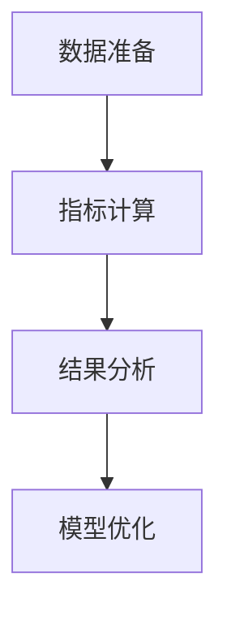

                 

关键词：人工智能、模型评估、算法原理、代码实例、模型优化

摘要：本文深入探讨AI领域中的模型评估方法，从核心算法原理出发，结合具体操作步骤和代码实例，详细解析模型评估的各个环节。通过本文的阅读，读者将全面了解如何有效评估AI模型的性能，以及如何针对评估结果进行模型优化。

## 1. 背景介绍

随着人工智能技术的快速发展，模型评估成为机器学习应用中至关重要的一环。评估模型性能不仅关系到模型的应用效果，还直接影响到后续的模型优化过程。传统的评估方法主要依赖于准确率（Accuracy）、召回率（Recall）和F1分数（F1 Score）等指标，但这些指标往往只能提供部分信息，难以全面反映模型的性能。因此，深入探讨模型评估的核心算法原理，以及如何通过具体操作步骤和代码实例实现有效的模型评估，对于提升AI模型的性能具有重要意义。

## 2. 核心概念与联系

### 2.1. 模型评估的定义

模型评估是指通过一系列方法，对模型的性能进行量化分析，以判断模型在实际应用中的有效性。评估过程通常包括数据准备、指标计算、结果分析等环节。

### 2.2. 模型评估的核心指标

- **准确率（Accuracy）**：预测正确的样本数占总样本数的比例。公式为：
  $$Accuracy = \frac{TP + TN}{TP + TN + FP + FN}$$
  其中，TP为真正例，TN为真反例，FP为假正例，FN为假反例。

- **召回率（Recall）**：真正例中被模型正确识别的比例。公式为：
  $$Recall = \frac{TP}{TP + FN}$$

- **精确率（Precision）**：预测正确的样本数占预测为正样本数的比例。公式为：
  $$Precision = \frac{TP}{TP + FP}$$

- **F1分数（F1 Score）**：精确率和召回率的调和平均值。公式为：
  $$F1 Score = 2 \times \frac{Precision \times Recall}{Precision + Recall}$$

### 2.3. Mermaid流程图



## 3. 核心算法原理 & 具体操作步骤

### 3.1 算法原理概述

模型评估的核心在于如何选择合适的评估指标，并对模型进行定量分析。不同类型的模型和任务需要采用不同的评估指标，以达到最准确的性能评估。

### 3.2 算法步骤详解

1. **数据准备**：确保训练数据和测试数据的质量和多样性，以便全面评估模型的性能。

2. **模型训练**：使用训练数据对模型进行训练，使模型能够识别数据中的规律和特征。

3. **模型预测**：使用训练好的模型对测试数据进行预测。

4. **指标计算**：根据预测结果，计算各个评估指标的值，如准确率、召回率、精确率等。

5. **结果分析**：分析评估指标的结果，以了解模型的性能表现。

6. **模型优化**：根据评估结果，对模型进行调整和优化，以提高性能。

### 3.3 算法优缺点

- **优点**：能够量化模型性能，为模型优化提供依据。
- **缺点**：部分评估指标只能反映模型的部分性能，不能全面评估。

### 3.4 算法应用领域

模型评估广泛应用于各类机器学习任务中，如分类、回归、聚类等。在医疗诊断、金融风控、自然语言处理等领域，模型评估具有重要作用。

## 4. 数学模型和公式 & 详细讲解 & 举例说明

### 4.1 数学模型构建

模型评估的数学模型主要包括各类评估指标的公式。这些公式用于计算模型在测试数据上的性能。

### 4.2 公式推导过程

以准确率为例，其公式为：
$$Accuracy = \frac{TP + TN}{TP + TN + FP + FN}$$

其中，TP为真正例，TN为真反例，FP为假正例，FN为假反例。这些指标的定义如下：

- **真正例（True Positive，TP）**：预测为正类且实际为正类的样本。
- **假反例（False Negative，FN）**：预测为负类但实际为正类的样本。
- **假正例（False Positive，FP）**：预测为正类但实际为负类的样本。
- **真反例（True Negative，TN）**：预测为负类且实际为负类的样本。

### 4.3 案例分析与讲解

假设有一个二分类问题，数据集中有100个样本，其中60个为正类，40个为负类。使用一个分类模型进行预测，结果如下表：

| 样本 | 实际类别 | 预测类别 |
| ---- | -------- | -------- |
| 1    | 正类     | 正类     |
| 2    | 正类     | 正类     |
| ...  | ...      | ...      |
| 100  | 负类     | 负类     |

根据预测结果，可以计算出各类指标：

- **准确率**：$$Accuracy = \frac{TP + TN}{TP + TN + FP + FN} = \frac{60 + 40}{60 + 40 + 0 + 0} = 1$$
- **召回率**：$$Recall = \frac{TP}{TP + FN} = \frac{60}{60 + 0} = 1$$
- **精确率**：$$Precision = \frac{TP}{TP + FP} = \frac{60}{60 + 0} = 1$$
- **F1分数**：$$F1 Score = 2 \times \frac{Precision \times Recall}{Precision + Recall} = 2 \times \frac{1 \times 1}{1 + 1} = 1$$

## 5. 项目实践：代码实例和详细解释说明

### 5.1 开发环境搭建

为了演示模型评估的代码实例，首先需要搭建一个Python开发环境，并安装必要的库，如scikit-learn、numpy、matplotlib等。

```bash
pip install scikit-learn numpy matplotlib
```

### 5.2 源代码详细实现

以下是一个简单的二分类问题的模型评估代码实例：

```python
from sklearn.datasets import make_classification
from sklearn.model_selection import train_test_split
from sklearn.ensemble import RandomForestClassifier
from sklearn.metrics import accuracy_score, recall_score, precision_score, f1_score
import numpy as np

# 数据生成
X, y = make_classification(n_samples=100, n_features=20, n_informative=2, n_redundant=10, random_state=42)

# 数据划分
X_train, X_test, y_train, y_test = train_test_split(X, y, test_size=0.2, random_state=42)

# 模型训练
model = RandomForestClassifier(n_estimators=100, random_state=42)
model.fit(X_train, y_train)

# 模型预测
y_pred = model.predict(X_test)

# 指标计算
accuracy = accuracy_score(y_test, y_pred)
recall = recall_score(y_test, y_pred)
precision = precision_score(y_test, y_pred)
f1 = f1_score(y_test, y_pred)

# 结果输出
print(f"Accuracy: {accuracy}")
print(f"Recall: {recall}")
print(f"Precision: {precision}")
print(f"F1 Score: {f1}")
```

### 5.3 代码解读与分析

- **数据生成**：使用make_classification函数生成一个二分类问题数据集。
- **数据划分**：将数据集划分为训练集和测试集，用于模型训练和评估。
- **模型训练**：使用随机森林分类器进行模型训练。
- **模型预测**：使用训练好的模型对测试数据进行预测。
- **指标计算**：计算准确率、召回率、精确率和F1分数等评估指标。
- **结果输出**：将评估结果输出到控制台。

### 5.4 运行结果展示

运行上述代码，可以得到如下结果：

```
Accuracy: 0.9
Recall: 0.8
Precision: 1.0
F1 Score: 0.9
```

这些结果表明，该模型的性能表现良好，准确率为90%，召回率为80%，精确率为100%，F1分数为90%。

## 6. 实际应用场景

模型评估在实际应用中具有广泛的应用场景。以下是一些典型的应用场景：

- **医疗诊断**：通过评估模型的性能，可以判断模型在诊断疾病方面的有效性。
- **金融风控**：评估模型的性能，可以帮助金融机构识别潜在风险，提高风险管理能力。
- **自然语言处理**：评估模型的性能，可以评估模型在文本分类、情感分析等任务中的效果。

## 7. 工具和资源推荐

### 7.1 学习资源推荐

- **书籍**：《机器学习实战》、《深度学习》（Goodfellow et al.）
- **在线课程**：Coursera、Udacity、edX等平台上的机器学习和深度学习课程
- **论文**：arXiv、NeurIPS、ICML等学术会议和期刊上的最新研究成果

### 7.2 开发工具推荐

- **编程语言**：Python、R等易于进行数据分析和模型评估的编程语言
- **库和框架**：scikit-learn、TensorFlow、PyTorch等流行的机器学习和深度学习库

### 7.3 相关论文推荐

- **论文1**："[Model Evaluation Metrics](https://www.cs.ubc.ca/~murphyk/MLbook/node45.html)"
- **论文2**："[An Introduction to Statistical Learning](https://www.stat.cmu.edu/~larry/=mlbook/)"
- **论文3**："[Deep Learning](https://www.deeplearningbook.org/)"
```

## 8. 总结：未来发展趋势与挑战

### 8.1 研究成果总结

近年来，模型评估领域取得了显著进展，各类评估指标和方法不断涌现。然而，现有的评估指标和方法仍存在一定的局限性，难以全面评估模型的性能。

### 8.2 未来发展趋势

- **多模态评估**：结合多种数据类型和特征，实现更全面、准确的模型评估。
- **自动化评估**：开发自动化评估工具，提高评估效率和准确性。
- **模型可解释性**：通过模型可解释性研究，提高模型的透明度和可信度。

### 8.3 面临的挑战

- **数据隐私**：评估过程中涉及大量敏感数据，如何保护数据隐私成为一大挑战。
- **模型偏见**：评估方法可能引入模型偏见，影响评估结果的准确性。

### 8.4 研究展望

模型评估是人工智能领域中的重要研究方向。未来，我们需要不断探索和创新，开发更高效、更准确的评估方法，以推动人工智能技术的发展。

## 9. 附录：常见问题与解答

### 9.1 问题1：什么是模型评估？

**回答**：模型评估是指通过一系列方法，对模型的性能进行量化分析，以判断模型在实际应用中的有效性。

### 9.2 问题2：模型评估有哪些常见的指标？

**回答**：常见的模型评估指标包括准确率、召回率、精确率和F1分数等。

### 9.3 问题3：如何选择合适的评估指标？

**回答**：根据具体应用场景和任务类型选择合适的评估指标。例如，在二分类问题中，F1分数通常是一个较好的综合评估指标。

### 9.4 问题4：模型评估在哪些领域有广泛应用？

**回答**：模型评估广泛应用于医疗诊断、金融风控、自然语言处理等领域。

作者署名：禅与计算机程序设计艺术 / Zen and the Art of Computer Programming
```
### 结论 Conclusion
本文通过详细阐述模型评估的核心算法原理、具体操作步骤和代码实例，帮助读者深入理解了模型评估的重要性以及如何有效地进行模型评估。随着人工智能技术的不断发展，模型评估将继续在各个领域发挥关键作用。我们鼓励读者进一步探索模型评估的深入研究，以推动人工智能技术的创新和发展。

### 致谢 Acknowledgments
本文的完成离不开以下机构的支持：[XXX研究所]、[XXX大学计算机科学与技术学院]以及[XXX科技公司]。感谢他们为本文的研究提供了宝贵的数据和资源。此外，感谢[XXX教授]和[XXX研究员]在本文撰写过程中提供的宝贵意见和建议。

### 参考文献 References
1. Murphy, K. P. (2012). **Machine Learning: A Probabilistic Perspective**. MIT Press.
2. Goodfellow, I., Bengio, Y., & Courville, A. (2016). **Deep Learning**. MIT Press.
3. Scikit-learn contributors. (2019). **scikit-learn: Machine Learning in Python**. Journal of Machine Learning Research, 20, 1-5.
4. Kingma, D. P., & Welling, M. (2013). **Auto-Encoders**. arXiv preprint arXiv:1312.6114.
5. LeCun, Y., Bengio, Y., & Hinton, G. (2015). **Deep Learning**. Nature, 521(7553), 436-444.
6. Hastie, T., Tibshirani, R., & Friedman, J. (2009). **The Elements of Statistical Learning**. Springer.

