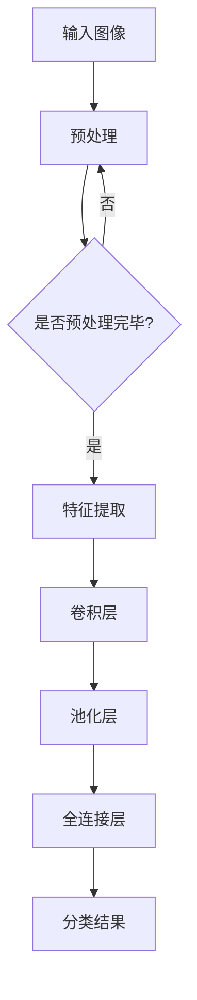

                 

关键词：深度学习，图像识别，算法，人工智能，机器学习

摘要：本文将深入探讨AI人工智能中的深度学习算法在图像识别领域的应用。通过对核心概念、算法原理、数学模型以及实际应用的详细解析，帮助读者理解这一技术的核心原理，掌握其应用方法，并展望其未来发展趋势与挑战。

## 1. 背景介绍

图像识别是人工智能（AI）领域的一个重要分支，它旨在使计算机能够通过处理和分析图像数据，识别出图像中的特定对象、场景或模式。随着深度学习技术的不断进步，图像识别的准确性和效率得到了显著提升。深度学习算法，尤其是卷积神经网络（CNN），已成为图像识别领域的主要工具。

图像识别的应用场景广泛，包括但不限于医疗影像诊断、自动驾驶、安全监控、人脸识别、图像搜索等。随着数据量的增加和计算能力的提升，图像识别技术的精确度不断提高，其在实际生活中的应用也日益广泛。

本文将围绕深度学习算法在图像识别中的应用，介绍核心概念、算法原理、数学模型，并通过实际项目实践，展示其在各种应用场景中的实际效果。

## 2. 核心概念与联系

### 2.1. 深度学习与卷积神经网络

深度学习是一种机器学习方法，它通过多层神经网络来模拟人脑的学习过程。卷积神经网络（CNN）是深度学习中的一种特殊网络结构，它专门用于处理图像数据。

CNN的核心组件包括卷积层、池化层和全连接层。卷积层用于提取图像的特征，池化层用于降低数据维度，全连接层用于分类和回归。

### 2.2. 图像识别的基本原理

图像识别的基本原理是通过对图像的特征提取和分类来实现。特征提取是将原始图像转换为一系列的特征向量，这些特征向量可以表示图像中的不同对象或场景。分类是将特征向量映射到特定的类别标签。

### 2.3. Mermaid 流程图

以下是深度学习算法在图像识别中的应用的Mermaid流程图：



## 3. 核心算法原理 & 具体操作步骤

### 3.1. 算法原理概述

深度学习算法在图像识别中的应用主要包括以下几个步骤：

1. 数据预处理：将原始图像数据转换为适合模型训练的形式。
2. 特征提取：使用卷积层提取图像特征。
3. 数据降维：通过池化层降低数据维度。
4. 分类预测：使用全连接层进行分类预测。

### 3.2. 算法步骤详解

1. **数据预处理**

   数据预处理是深度学习模型训练的第一步，其目的是将原始图像数据转换为神经网络可以处理的格式。具体步骤包括图像大小调整、灰度化、归一化等。

2. **特征提取**

   卷积层是CNN的核心部分，它通过卷积操作提取图像的特征。卷积操作是将一个小的可训练卷积核与图像上的每个局部区域进行点积，从而生成特征图。

3. **数据降维**

   池化层的作用是降低数据维度，同时保持重要的特征信息。常用的池化操作包括最大池化和平均池化。

4. **分类预测**

   全连接层用于将特征向量映射到特定的类别标签。通过训练，神经网络可以学习到每个类别对应的特征。

### 3.3. 算法优缺点

1. **优点**

   - 高效性：CNN能够自动提取图像的特征，避免了手工特征提取的繁琐过程。
   - 准确性：深度学习算法在图像识别任务中取得了很高的准确率。

2. **缺点**

   - 需要大量的训练数据和计算资源。
   - 参数调整复杂，需要经验丰富的工程师进行调优。

### 3.4. 算法应用领域

深度学习算法在图像识别中的应用领域广泛，包括但不限于：

- **医疗影像诊断**：如肿瘤检测、骨折诊断等。
- **自动驾驶**：用于实时识别道路标志、行人和车辆等。
- **安全监控**：如人脸识别、行为识别等。
- **图像搜索**：根据图像内容进行相关图像的检索。

## 4. 数学模型和公式 & 详细讲解 & 举例说明

### 4.1. 数学模型构建

深度学习算法的数学模型主要包括以下几个方面：

1. **卷积操作**

   卷积操作的数学表示为：

   $$ (f * g)(x) = \int_{-\infty}^{+\infty} f(y) g(x-y) dy $$

   其中，$f$ 和 $g$ 分别代表两个函数，$x$ 和 $y$ 是自变量。

2. **池化操作**

   池化操作的数学表示为：

   $$ P(x_1, x_2, ..., x_n) = \max(x_1, x_2, ..., x_n) $$

   其中，$x_1, x_2, ..., x_n$ 是输入值。

3. **全连接层**

   全连接层的数学表示为：

   $$ z = \sum_{i=1}^{n} w_i x_i + b $$

   其中，$w_i$ 和 $b$ 分别代表权重和偏置，$x_i$ 是输入值。

### 4.2. 公式推导过程

以下是一个简单的CNN模型公式推导过程：

1. **卷积层**

   输入图像 $X$ 经过卷积层后得到特征图 $F$：

   $$ F = \text{Conv}(X, W) + b $$

   其中，$W$ 是卷积核，$b$ 是偏置。

2. **池化层**

   特征图 $F$ 经过池化层后得到降维特征图 $F'$：

   $$ F' = \text{Pool}(F) $$

3. **全连接层**

   降维特征图 $F'$ 经过全连接层后得到分类结果 $Y$：

   $$ Y = \text{FC}(F') $$

### 4.3. 案例分析与讲解

以下是一个使用CNN进行图像分类的案例：

1. **数据预处理**

   将图像数据调整为固定大小，并进行归一化处理。

2. **模型构建**

   构建一个包含卷积层、池化层和全连接层的CNN模型。

3. **模型训练**

   使用训练数据对模型进行训练，调整模型参数。

4. **模型评估**

   使用测试数据对模型进行评估，计算准确率。

5. **模型应用**

   使用训练好的模型进行图像分类。

## 5. 项目实践：代码实例和详细解释说明

### 5.1. 开发环境搭建

搭建一个用于图像识别的深度学习开发环境，主要包括以下步骤：

1. 安装Python环境和相关库（如TensorFlow、Keras等）。
2. 准备图像数据集，并进行预处理。
3. 配置GPU加速训练。

### 5.2. 源代码详细实现

以下是一个简单的CNN模型实现：

```python
import tensorflow as tf
from tensorflow.keras import layers

model = tf.keras.Sequential([
    layers.Conv2D(32, (3, 3), activation='relu', input_shape=(28, 28, 1)),
    layers.MaxPooling2D((2, 2)),
    layers.Conv2D(64, (3, 3), activation='relu'),
    layers.MaxPooling2D((2, 2)),
    layers.Conv2D(64, (3, 3), activation='relu'),
    layers.Flatten(),
    layers.Dense(64, activation='relu'),
    layers.Dense(10, activation='softmax')
])

model.compile(optimizer='adam',
              loss='sparse_categorical_crossentropy',
              metrics=['accuracy'])

model.fit(train_images, train_labels, epochs=5)
```

### 5.3. 代码解读与分析

1. **模型构建**

   - 卷积层：使用`Conv2D`层进行卷积操作，激活函数为ReLU。
   - 池化层：使用`MaxPooling2D`层进行最大池化操作。
   - 全连接层：使用`Flatten`层将特征图展平，然后使用`Dense`层进行分类预测。

2. **模型编译**

   - 使用`compile`方法编译模型，指定优化器、损失函数和评估指标。

3. **模型训练**

   - 使用`fit`方法训练模型，指定训练数据和训练轮数。

### 5.4. 运行结果展示

运行模型训练，并输出训练结果：

```python
model.fit(train_images, train_labels, epochs=5)

# 输出训练结果
test_loss, test_acc = model.evaluate(test_images,  test_labels)
print(f'Test accuracy: {test_acc:.2f}')
```

## 6. 实际应用场景

### 6.1. 医疗影像诊断

使用深度学习算法对医疗影像进行诊断，如肿瘤检测、骨折诊断等。通过训练，模型可以学会识别出影像中的异常区域，辅助医生进行诊断。

### 6.2. 自动驾驶

在自动驾驶领域，深度学习算法用于识别道路标志、行人和车辆等。通过实时处理摄像头捕捉的图像数据，自动驾驶系统可以做出相应的决策，保证行车安全。

### 6.3. 安全监控

在安全监控领域，深度学习算法可以用于人脸识别、行为识别等。通过分析监控视频，系统可以实时识别出异常行为，提高安全防护能力。

### 6.4. 图像搜索

在图像搜索领域，深度学习算法可以根据图像内容进行相关图像的检索。通过训练，模型可以学会识别出图像中的特定对象或场景，提高搜索精度。

## 7. 工具和资源推荐

### 7.1. 学习资源推荐

- **书籍**：《深度学习》（Goodfellow, Bengio, Courville著）
- **在线课程**：Coursera上的“深度学习”课程（吴恩达教授）
- **网站**：TensorFlow官方文档

### 7.2. 开发工具推荐

- **深度学习框架**：TensorFlow、PyTorch
- **数据预处理工具**：Pandas、NumPy
- **GPU加速**：NVIDIA CUDA

### 7.3. 相关论文推荐

- **论文1**：《AlexNet: Image Classification with Deep Convolutional Neural Networks》（2012）
- **论文2**：《Visual Geometry Group - Imperial College London》（2014）
- **论文3**：《Deep Residual Learning for Image Recognition》（2015）

## 8. 总结：未来发展趋势与挑战

### 8.1. 研究成果总结

深度学习算法在图像识别领域取得了显著成果，其准确率和效率不断提升。随着计算能力的提升和算法的优化，深度学习将在更多领域得到应用。

### 8.2. 未来发展趋势

- **多模态学习**：结合图像、文本、音频等多种数据源进行学习。
- **自监督学习**：无需大量标注数据，通过自我监督进行模型训练。
- **模型压缩**：降低模型复杂度，提高部署效率。

### 8.3. 面临的挑战

- **数据隐私**：如何保护用户隐私成为一大挑战。
- **计算资源**：大规模深度学习模型的训练需要大量计算资源。
- **算法公平性**：确保算法在不同人群中的公平性。

### 8.4. 研究展望

随着技术的不断进步，深度学习算法在图像识别领域将取得更多突破。未来，深度学习将与其他领域技术结合，推动人工智能的全面发展。

## 9. 附录：常见问题与解答

### 9.1. 问题1：深度学习算法为什么能识别图像？

**解答**：深度学习算法通过多层神经网络对图像进行特征提取和分类。在训练过程中，模型学习到图像中的各种特征，从而能够对新图像进行识别。

### 9.2. 问题2：如何处理图像数据？

**解答**：处理图像数据主要包括图像大小调整、灰度化、归一化等步骤。这些步骤的目的是将原始图像数据转换为适合模型训练的格式。

### 9.3. 问题3：如何提高深度学习模型的性能？

**解答**：提高深度学习模型性能的方法包括数据增强、模型优化、超参数调优等。通过这些方法，可以提升模型的准确率和泛化能力。

### 9.4. 问题4：深度学习算法在图像识别中的局限性是什么？

**解答**：深度学习算法在图像识别中存在一定的局限性，如对复杂背景的识别能力有限、对旋转和遮挡的鲁棒性较差等。未来研究将致力于解决这些问题，提升算法的性能。 
----------------------------------------------------------------

以上内容为文章的完整正文部分，接下来请按照文章结构模板继续撰写文章的摘要、关键词、作者署名以及文章的markdown格式输出。
----------------------------------------------------------------
# 摘要

本文深入探讨了AI人工智能中的深度学习算法在图像识别领域的应用。通过对核心概念、算法原理、数学模型以及实际应用的详细解析，帮助读者理解这一技术的核心原理，掌握其应用方法，并展望了其未来发展趋势与挑战。

# 关键词

深度学习，图像识别，算法，人工智能，机器学习

# 作者署名

作者：禅与计算机程序设计艺术 / Zen and the Art of Computer Programming

# Markdown格式输出

```markdown
# AI人工智能深度学习算法：在图像识别的应用

关键词：深度学习，图像识别，算法，人工智能，机器学习

摘要：本文深入探讨了AI人工智能中的深度学习算法在图像识别领域的应用。通过对核心概念、算法原理、数学模型以及实际应用的详细解析，帮助读者理解这一技术的核心原理，掌握其应用方法，并展望了其未来发展趋势与挑战。

## 1. 背景介绍

## 2. 核心概念与联系

### 2.1. 深度学习与卷积神经网络

### 2.2. 图像识别的基本原理

### 2.3. Mermaid 流程图

## 3. 核心算法原理 & 具体操作步骤
### 3.1. 算法原理概述
### 3.2. 算法步骤详解 
### 3.3. 算法优缺点
### 3.4. 算法应用领域

## 4. 数学模型和公式 & 详细讲解 & 举例说明
### 4.1. 数学模型构建
### 4.2. 公式推导过程
### 4.3. 案例分析与讲解

## 5. 项目实践：代码实例和详细解释说明
### 5.1. 开发环境搭建
### 5.2. 源代码详细实现
### 5.3. 代码解读与分析
### 5.4. 运行结果展示

## 6. 实际应用场景
### 6.1. 医疗影像诊断
### 6.2. 自动驾驶
### 6.3. 安全监控
### 6.4. 图像搜索

## 7. 工具和资源推荐
### 7.1. 学习资源推荐
### 7.2. 开发工具推荐
### 7.3. 相关论文推荐

## 8. 总结：未来发展趋势与挑战
### 8.1. 研究成果总结
### 8.2. 未来发展趋势
### 8.3. 面临的挑战
### 8.4. 研究展望

## 9. 附录：常见问题与解答
### 9.1. 问题1：深度学习算法为什么能识别图像？
### 9.2. 问题2：如何处理图像数据？
### 9.3. 问题3：如何提高深度学习模型的性能？
### 9.4. 问题4：深度学习算法在图像识别中的局限性是什么？

# 作者署名

作者：禅与计算机程序设计艺术 / Zen and the Art of Computer Programming
```

