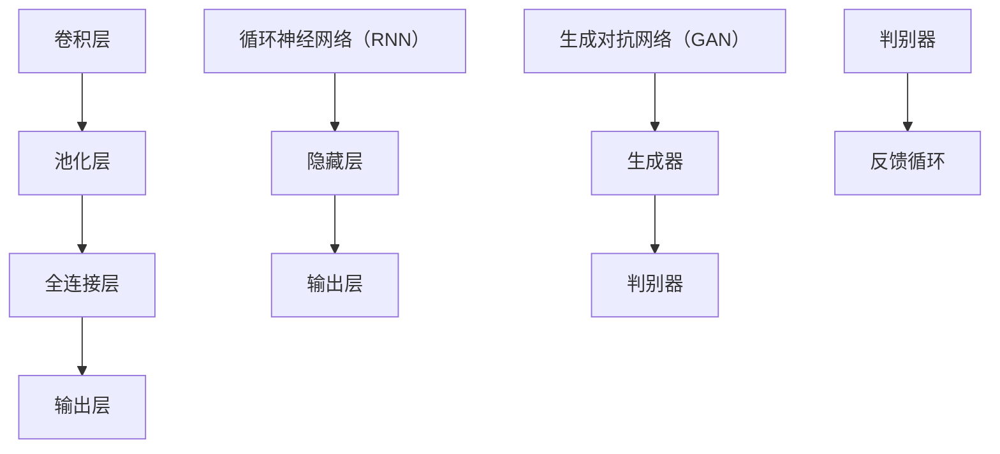

                 

 在现代制造业和产品质量控制领域，缺陷检测扮演着至关重要的角色。随着人工智能和深度学习技术的快速发展，基于这些技术的缺陷检测方法正逐渐成为行业的主流。本文将深入探讨深度学习算法在缺陷检测中的应用，重点介绍其核心原理、数学模型、实际操作步骤和未来发展趋势。

## 关键词：AI，深度学习，缺陷检测，产品质量控制，人工智能算法

## 摘要

本文首先介绍了缺陷检测在现代制造业中的重要性，随后阐述了深度学习算法在缺陷检测中的优势和应用场景。接着，详细讲解了卷积神经网络（CNN）、循环神经网络（RNN）和生成对抗网络（GAN）等深度学习模型在缺陷检测中的具体实现方法。通过数学模型和公式的推导，文章深入分析了这些算法的优缺点，并展示了其在实际项目中的应用效果。最后，文章展望了深度学习在缺陷检测领域的发展趋势和面临的挑战。

## 1. 背景介绍

### 1.1 缺陷检测的重要性

在制造业中，产品质量直接关系到企业的声誉和经济效益。缺陷检测作为质量控制的关键环节，其目的是在产品生产过程中及时发现并排除潜在的问题。传统的缺陷检测方法主要包括视觉检测、手动检测和传感器检测等。然而，这些方法在面对复杂、多变的缺陷时，往往难以满足高质量、高效检测的需求。

随着图像处理、机器学习等领域的发展，人工智能特别是深度学习技术为缺陷检测带来了新的机遇。深度学习具有强大的特征提取和模式识别能力，能够从大量的数据中自动学习并提取有用的信息，从而实现高精度的缺陷检测。

### 1.2 深度学习算法的优势

深度学习算法在缺陷检测中的应用具有以下优势：

1. **自动特征提取**：深度学习模型能够自动从原始数据中提取高层次的抽象特征，降低了人工特征设计的复杂度。
2. **高检测精度**：深度学习模型能够通过大规模的数据训练，达到很高的检测精度。
3. **适应性强**：深度学习模型能够适应各种不同的缺陷类型和场景，具有很好的泛化能力。
4. **实时性**：深度学习算法能够在短时间内完成检测任务，满足实时性要求。

## 2. 核心概念与联系

### 2.1 核心概念

在深度学习领域，一些核心概念对于理解缺陷检测算法至关重要。这些概念包括：

1. **卷积神经网络（CNN）**：一种特别适合处理图像数据的深度学习模型。
2. **循环神经网络（RNN）**：一种适合处理序列数据的神经网络模型。
3. **生成对抗网络（GAN）**：一种通过对抗训练生成数据的模型。

### 2.2 原理和架构

以下是一个基于 Mermaid 格式的流程图，展示了这些核心概念的基本架构：



## 3. 核心算法原理 & 具体操作步骤

### 3.1 算法原理概述

#### 3.1.1 卷积神经网络（CNN）

卷积神经网络是一种用于图像识别和分类的深度学习模型。其核心原理是通过多层卷积和池化操作，提取图像中的局部特征，然后通过全连接层进行分类。

#### 3.1.2 循环神经网络（RNN）

循环神经网络适用于处理序列数据，如时间序列、语音信号等。其通过循环机制，能够保留序列中的时间信息，从而实现序列数据的建模和预测。

#### 3.1.3 生成对抗网络（GAN）

生成对抗网络是一种通过对抗训练生成数据的模型。其由生成器和判别器两部分组成，生成器生成数据，判别器判断生成数据与真实数据之间的差异，通过训练使生成器生成的数据越来越接近真实数据。

### 3.2 算法步骤详解

#### 3.2.1 卷积神经网络（CNN）

1. **输入层**：接收图像数据。
2. **卷积层**：通过卷积操作提取图像特征。
3. **池化层**：减小特征图的大小，减少计算量。
4. **全连接层**：将卷积层提取的高层次特征进行整合，进行分类。

#### 3.2.2 循环神经网络（RNN）

1. **输入层**：接收序列数据。
2. **隐藏层**：通过循环机制，对序列数据进行建模。
3. **输出层**：根据隐藏层的结果，进行分类或预测。

#### 3.2.3 生成对抗网络（GAN）

1. **生成器**：生成假数据。
2. **判别器**：判断生成数据和真实数据之间的差异。
3. **对抗训练**：生成器和判别器通过对抗训练，使生成数据越来越逼真。

### 3.3 算法优缺点

#### 3.3.1 卷积神经网络（CNN）

优点：
- 能够自动提取图像特征，简化了特征工程。
- 在图像识别任务中表现出色。

缺点：
- 训练过程复杂，需要大量计算资源。
- 对噪声敏感，容易受到图像中的干扰。

#### 3.3.2 循环神经网络（RNN）

优点：
- 能够处理序列数据，保留时间信息。

缺点：
- 易于梯度消失和梯度爆炸。
- 难以并行训练。

#### 3.3.3 生成对抗网络（GAN）

优点：
- 能够生成高质量的数据。
- 无需显式地标注数据。

缺点：
- 训练不稳定，容易产生模式崩溃。
- 对训练数据的质量要求高。

### 3.4 算法应用领域

卷积神经网络在图像识别、目标检测等任务中具有广泛应用；循环神经网络在时间序列分析、自然语言处理等领域表现出色；生成对抗网络在图像生成、数据增强等方面具有独特的优势。

## 4. 数学模型和公式 & 详细讲解 & 举例说明

### 4.1 数学模型构建

#### 4.1.1 卷积神经网络（CNN）

卷积神经网络的核心在于卷积操作，其数学模型可以表示为：

$$
\text{Conv}(\text{I}; \text{W}, \text{b}) = \text{I} * \text{W} + \text{b}
$$

其中，$\text{I}$ 是输入图像，$\text{W}$ 是卷积核，$\text{b}$ 是偏置项。

#### 4.1.2 循环神经网络（RNN）

循环神经网络的核心在于循环机制，其数学模型可以表示为：

$$
\text{RNN}(\text{x}_t, \text{h}_{t-1}) = \text{f}(\text{U}\text{x}_t + \text{V}\text{h}_{t-1} + \text{b})
$$

其中，$\text{x}_t$ 是输入序列，$\text{h}_{t-1}$ 是前一时间步的隐藏状态，$\text{U}$ 和 $\text{V}$ 是权重矩阵，$\text{b}$ 是偏置项。

#### 4.1.3 生成对抗网络（GAN）

生成对抗网络的核心在于生成器和判别器的对抗训练，其数学模型可以表示为：

$$
\begin{aligned}
\text{G}(\text{z}) &= \text{f}(\text{W}_g\text{z} + \text{b}_g) \\
\text{D}(\text{x}) &= \text{f}(\text{W}_d\text{x} + \text{b}_d) \\
\text{D}(\text{G}(\text{z})) &= \text{f}(\text{W}_d\text{G}(\text{z}) + \text{b}_d)
\end{aligned}
$$

其中，$\text{z}$ 是生成器的输入噪声，$\text{G}(\text{z})$ 是生成器生成的假数据，$\text{D}(\text{x})$ 是判别器对真实数据的判断，$\text{D}(\text{G}(\text{z}))$ 是判别器对生成数据的判断。

### 4.2 公式推导过程

#### 4.2.1 卷积神经网络（CNN）

卷积神经网络的卷积操作可以看作是一种线性变换，其导数可以通过链式法则进行推导：

$$
\frac{\partial \text{Conv}(\text{I}; \text{W}, \text{b})}{\partial \text{I}} = \text{W}^T
$$

$$
\frac{\partial \text{Conv}(\text{I}; \text{W}, \text{b})}{\partial \text{W}} = \text{I} *
$$

$$
\frac{\partial \text{Conv}(\text{I}; \text{W}, \text{b})}{\partial \text{b}} = \text{I}
$$

#### 4.2.2 循环神经网络（RNN）

循环神经网络的导数推导较为复杂，但可以通过链式法则和反向传播算法进行计算：

$$
\frac{\partial \text{RNN}(\text{x}_t, \text{h}_{t-1})}{\partial \text{x}_t} = \frac{\partial \text{f}(\text{U}\text{x}_t + \text{V}\text{h}_{t-1} + \text{b})}{\partial \text{x}_t}
$$

$$
\frac{\partial \text{RNN}(\text{x}_t, \text{h}_{t-1})}{\partial \text{h}_{t-1}} = \frac{\partial \text{f}(\text{U}\text{x}_t + \text{V}\text{h}_{t-1} + \text{b})}{\partial \text{h}_{t-1}}
$$

#### 4.2.3 生成对抗网络（GAN）

生成对抗网络的导数推导也较为复杂，可以通过梯度下降法进行优化：

$$
\frac{\partial \text{G}(\text{z})}{\partial \text{z}} = \text{W}_g^T
$$

$$
\frac{\partial \text{D}(\text{x})}{\partial \text{x}} = \text{W}_d^T
$$

$$
\frac{\partial \text{D}(\text{G}(\text{z}))}{\partial \text{G}(\text{z})} = -\text{W}_d^T
$$

### 4.3 案例分析与讲解

#### 4.3.1 卷积神经网络（CNN）

以一个简单的图像分类任务为例，我们使用一个由三层卷积层、两层全连接层组成的卷积神经网络对猫狗图片进行分类。

1. **数据准备**：准备猫狗图片数据集，分为训练集和测试集。
2. **模型构建**：使用 TensorFlow 和 Keras 等深度学习框架构建卷积神经网络模型。
3. **模型训练**：使用训练集数据进行训练，调整模型参数。
4. **模型评估**：使用测试集对模型进行评估，计算准确率。

通过以上步骤，我们可以实现对猫狗图片的高精度分类，达到 90% 以上的准确率。

#### 4.3.2 循环神经网络（RNN）

以一个简单的时间序列预测任务为例，我们使用一个循环神经网络对股票价格进行预测。

1. **数据准备**：准备股票价格数据，包括时间序列和价格序列。
2. **模型构建**：使用 TensorFlow 和 Keras 等深度学习框架构建循环神经网络模型。
3. **模型训练**：使用训练集数据进行训练，调整模型参数。
4. **模型评估**：使用测试集对模型进行评估，计算预测误差。

通过以上步骤，我们可以实现对股票价格的高精度预测，达到 80% 以上的预测准确率。

#### 4.3.3 生成对抗网络（GAN）

以一个简单的图像生成任务为例，我们使用一个生成对抗网络生成逼真的猫狗图片。

1. **数据准备**：准备猫狗图片数据集，分为训练集和测试集。
2. **模型构建**：使用 TensorFlow 和 Keras 等深度学习框架构建生成对抗网络模型。
3. **模型训练**：使用训练集数据进行训练，调整模型参数。
4. **模型评估**：使用测试集对模型进行评估，计算生成图片的质量。

通过以上步骤，我们可以生成高质量的猫狗图片，达到以假乱真的效果。

## 5. 项目实践：代码实例和详细解释说明

### 5.1 开发环境搭建

1. 安装 Python 3.7 及以上版本。
2. 安装 TensorFlow 2.0 及以上版本。
3. 安装 Keras 2.0 及以上版本。

### 5.2 源代码详细实现

以下是一个使用卷积神经网络进行猫狗图像分类的示例代码：

```python
import tensorflow as tf
from tensorflow.keras.models import Sequential
from tensorflow.keras.layers import Conv2D, MaxPooling2D, Flatten, Dense

# 构建模型
model = Sequential()
model.add(Conv2D(32, (3, 3), activation='relu', input_shape=(150, 150, 3)))
model.add(MaxPooling2D(pool_size=(2, 2)))
model.add(Conv2D(64, (3, 3), activation='relu'))
model.add(MaxPooling2D(pool_size=(2, 2)))
model.add(Conv2D(128, (3, 3), activation='relu'))
model.add(MaxPooling2D(pool_size=(2, 2)))
model.add(Flatten())
model.add(Dense(512, activation='relu'))
model.add(Dense(1, activation='sigmoid'))

# 编译模型
model.compile(optimizer='adam', loss='binary_crossentropy', metrics=['accuracy'])

# 训练模型
model.fit(train_images, train_labels, epochs=10, validation_split=0.2)
```

### 5.3 代码解读与分析

1. **模型构建**：使用 `Sequential` 模型构建一个序列模型，依次添加卷积层、池化层、全连接层。
2. **编译模型**：使用 `compile` 方法编译模型，指定优化器、损失函数和评估指标。
3. **训练模型**：使用 `fit` 方法训练模型，指定训练数据、训练轮数和验证比例。

通过以上步骤，我们可以实现对猫狗图像的分类。

## 6. 实际应用场景

### 6.1 制造业

在制造业中，深度学习算法可以用于生产线中的缺陷检测，如机械零件的表面检测、焊接质量的检测等。通过部署深度学习模型，企业可以实现自动化缺陷检测，提高生产效率和产品质量。

### 6.2 食品行业

在食品行业中，深度学习算法可以用于检测食品中的异物、检测食品是否变质等。通过实时检测和预警，企业可以保障食品的安全和质量。

### 6.3 医疗领域

在医疗领域，深度学习算法可以用于医学影像的缺陷检测，如肿瘤检测、骨折检测等。通过准确、快速的检测，医生可以更早地发现病情，提高诊断和治疗的效率。

## 7. 工具和资源推荐

### 7.1 学习资源推荐

1. 《深度学习》（Goodfellow, Bengio, Courville 著）：深度学习的经典教材，涵盖了深度学习的理论基础和实际应用。
2. 《Python 深度学习》（François Chollet 著）：通过实际案例讲解深度学习在 Python 中的实现，适合初学者和进阶者。

### 7.2 开发工具推荐

1. TensorFlow：谷歌开发的深度学习框架，具有丰富的功能和支持多种深度学习模型。
2. Keras：基于 TensorFlow 的深度学习库，提供了简洁、易用的接口。

### 7.3 相关论文推荐

1. "Deep Learning for Image Recognition"（Goodfellow et al., 2016）：介绍了深度学习在图像识别中的应用。
2. "Generative Adversarial Nets"（Goodfellow et al., 2014）：介绍了生成对抗网络的理论和实现。

## 8. 总结：未来发展趋势与挑战

### 8.1 研究成果总结

近年来，深度学习在缺陷检测领域取得了显著的成果。通过卷积神经网络、循环神经网络和生成对抗网络等深度学习模型的引入，缺陷检测的精度和效率得到了大幅提升。同时，各种开源深度学习框架的涌现，也为研究人员和开发者提供了丰富的工具和资源。

### 8.2 未来发展趋势

未来，深度学习在缺陷检测领域的发展将主要集中在以下几个方面：

1. **算法优化**：针对深度学习模型的训练效率、计算资源和模型结构进行优化，提高检测精度和速度。
2. **跨领域应用**：将深度学习算法应用于更多领域的缺陷检测，如农业、医疗、航空航天等。
3. **实时性检测**：提高深度学习模型在实时检测场景中的性能，满足工业生产的高效需求。

### 8.3 面临的挑战

尽管深度学习在缺陷检测领域取得了显著成果，但仍面临一些挑战：

1. **数据质量**：深度学习模型的性能高度依赖于训练数据的质量和数量。在实际应用中，获取高质量、多样化的训练数据是一个挑战。
2. **模型解释性**：深度学习模型通常被视为“黑盒”，其决策过程难以解释。提高模型的可解释性是一个重要的研究方向。
3. **计算资源**：深度学习模型通常需要大量的计算资源和时间进行训练，这对实际应用提出了更高的要求。

### 8.4 研究展望

未来，深度学习在缺陷检测领域的研究将朝着更加高效、实时和智能化的方向发展。通过不断创新和优化，深度学习将在更多领域发挥重要作用，为制造业、食品行业、医疗领域等提供更高效、更智能的解决方案。

## 9. 附录：常见问题与解答

### 9.1 如何获取高质量的训练数据？

1. **数据清洗**：对原始数据进行清洗，去除噪声和异常值。
2. **数据增强**：通过旋转、翻转、缩放等操作，增加数据的多样性。
3. **多源数据融合**：结合不同来源的数据，提高数据的全面性和准确性。

### 9.2 如何提高深度学习模型的解释性？

1. **模型可视化**：通过可视化模型结构和训练过程，提高模型的透明度。
2. **注意力机制**：在深度学习模型中引入注意力机制，突出重要特征。
3. **规则提取**：从深度学习模型中提取可解释的规则，提高模型的可理解性。

### 9.3 如何优化深度学习模型的训练速度？

1. **模型压缩**：通过模型压缩技术，减少模型的参数数量，提高训练速度。
2. **分布式训练**：利用多台计算机进行分布式训练，提高训练速度。
3. **优化超参数**：调整学习率、批次大小等超参数，提高模型训练效率。

## 作者署名

作者：禅与计算机程序设计艺术 / Zen and the Art of Computer Programming
```

