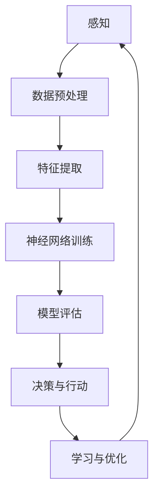

                 

关键词：深度学习，智能代理，算法，发展趋势，未来挑战

摘要：本文深入探讨了AI人工智能深度学习算法的原理与应用，特别是智能深度学习代理的研究现状与发展趋势。文章通过详细的数学模型与公式推导，结合实际项目案例，分析了智能代理在不同领域的应用前景，并提出了未来研究的挑战与展望。

## 1. 背景介绍

人工智能（AI）作为21世纪最具变革性的技术之一，已经在众多领域取得了显著的成果。深度学习，作为AI的重要组成部分，凭借其强大的模型表示能力和自主学习能力，已经成为解决复杂问题的有力工具。近年来，随着计算能力的提升和数据量的爆炸性增长，深度学习技术取得了飞速发展。

在深度学习的众多应用中，智能代理（Intelligent Agent）的研究备受关注。智能代理是一种能够在复杂环境中自主行动并达到特定目标的计算实体。它们可以应用于自动驾驶、智能客服、推荐系统等多个领域。随着深度学习技术的不断进步，智能代理正逐步向自主性和智能化方向迈进。

本文将首先介绍深度学习的基本原理和常用算法，然后深入探讨智能代理的概念及其在深度学习中的应用。接着，我们将通过具体的数学模型和公式推导，分析智能代理的核心算法。最后，本文将结合实际项目案例，探讨智能代理在不同领域的应用场景，并展望其未来的发展趋势与挑战。

## 2. 核心概念与联系

### 2.1 深度学习基本概念

深度学习是机器学习的一个重要分支，它通过模拟人脑的神经网络结构，对大量数据进行分析和处理，从而实现复杂的模式识别和预测。深度学习的关键组成部分包括：

- **神经网络（Neural Networks）**：深度学习的基础，由大量相互连接的神经元组成，通过学习输入数据的特征来完成任务。
- **激活函数（Activation Functions）**：用于引入非线性，使神经网络能够进行复杂的函数映射。
- **损失函数（Loss Functions）**：用于衡量预测值与真实值之间的差距，是优化神经网络参数的重要工具。
- **优化算法（Optimization Algorithms）**：如梯度下降（Gradient Descent）、Adam等，用于调整神经网络参数，以最小化损失函数。

### 2.2 智能代理基本概念

智能代理是能够感知环境、自主决策并采取行动的计算实体。它具备以下几个基本特征：

- **感知能力（Perception）**：通过传感器获取环境信息。
- **决策能力（Decision-making）**：根据感知到的信息，智能代理需要做出最佳行动决策。
- **行动能力（Action）**：执行决策，影响环境。
- **学习能力（Learning）**：通过与环境交互，不断优化其行为策略。

### 2.3 深度学习与智能代理的联系

深度学习为智能代理提供了强大的建模能力，使代理能够在复杂环境中进行有效的决策和行动。具体而言，深度学习与智能代理之间的联系体现在以下几个方面：

- **感知与建模**：深度学习模型能够从大量数据中提取特征，为智能代理提供丰富的感知信息。
- **决策与优化**：深度学习算法可以帮助智能代理学习到最佳的行动策略，优化其在环境中的表现。
- **自适应与学习**：智能代理可以利用深度学习算法，不断调整其决策策略，适应动态变化的环境。

### 2.4 Mermaid 流程图

以下是深度学习与智能代理架构的 Mermaid 流程图：



该流程图展示了深度学习与智能代理之间的互动过程，从感知数据、特征提取、模型训练到决策行动，再到学习和优化，形成了一个闭环，实现了智能代理在复杂环境中的自主学习和决策能力。

## 3. 核心算法原理 & 具体操作步骤

### 3.1 算法原理概述

深度学习算法的核心是神经网络，其基本原理是模拟人脑神经元之间的连接和交互。神经网络由多个层次组成，包括输入层、隐藏层和输出层。每个层次中的神经元通过权重和偏置进行连接，通过激活函数引入非线性，从而实现数据的复杂映射。

在深度学习算法中，常用的神经网络结构包括卷积神经网络（CNN）、循环神经网络（RNN）和生成对抗网络（GAN）等。这些网络结构在图像处理、序列数据分析和生成任务中具有广泛的应用。

智能代理的核心算法是基于深度强化学习（Deep Reinforcement Learning，DRL）。DRL通过奖励机制和策略迭代，使代理能够在环境中不断学习和优化其行动策略。具体而言，DRL算法包括状态（State）、动作（Action）、奖励（Reward）和策略（Policy）等关键要素。

### 3.2 算法步骤详解

深度学习算法的基本步骤如下：

1. **数据预处理**：对输入数据进行清洗、归一化和特征提取，为后续训练做准备。
2. **模型构建**：根据任务需求，选择合适的神经网络结构，如CNN、RNN或GAN等。
3. **模型训练**：通过优化算法（如梯度下降），调整神经网络参数，以最小化损失函数。
4. **模型评估**：使用验证集或测试集评估模型性能，调整模型参数，优化模型表现。
5. **模型部署**：将训练好的模型部署到实际应用场景，实现自动化的决策和行动。

智能代理算法的基本步骤如下：

1. **初始化环境**：设定智能代理所处的环境，包括状态空间、动作空间和奖励机制。
2. **感知状态**：智能代理通过传感器获取环境中的状态信息。
3. **决策**：基于深度学习模型，智能代理根据当前状态选择最佳动作。
4. **执行动作**：智能代理执行决策，改变环境状态。
5. **反馈奖励**：根据动作的结果，环境为智能代理提供奖励，以指导其后续的决策。
6. **更新策略**：智能代理利用奖励机制，不断调整其策略，优化其行为。

### 3.3 算法优缺点

深度学习算法的优点包括：

- **强大的建模能力**：能够处理高维数据和复杂数据结构，提取丰富的特征信息。
- **自动特征学习**：无需手动设计特征，模型可以自动从数据中学习特征表示。
- **自适应性强**：能够通过不断调整模型参数，适应动态变化的环境。

深度学习算法的缺点包括：

- **计算资源需求大**：深度学习模型通常需要大量的计算资源和时间进行训练。
- **数据依赖性高**：深度学习模型的性能高度依赖于训练数据的质量和数量。
- **可解释性差**：深度学习模型内部机制复杂，难以解释其决策过程。

智能代理算法的优点包括：

- **自主性和灵活性**：智能代理能够在复杂环境中自主学习和决策，适应不同的任务需求。
- **奖励机制引导**：通过奖励机制，智能代理能够不断优化其行为策略，达到最佳性能。
- **自适应性强**：智能代理能够根据环境变化，动态调整其行为策略。

智能代理算法的缺点包括：

- **训练难度大**：智能代理算法通常需要大量的训练数据和计算资源。
- **安全性问题**：智能代理可能会受到恶意攻击或欺骗，导致其行为异常。
- **伦理和道德问题**：智能代理的决策过程可能涉及伦理和道德问题，需要严格监管。

### 3.4 算法应用领域

深度学习算法在各个领域具有广泛的应用，包括：

- **计算机视觉**：图像分类、目标检测、人脸识别等。
- **自然语言处理**：文本分类、机器翻译、情感分析等。
- **语音识别**：语音识别、语音合成、语音控制等。
- **医疗诊断**：疾病预测、医学影像分析、基因序列分析等。

智能代理算法在以下领域具有广泛应用：

- **自动驾驶**：智能车辆在复杂交通环境中的自主导航。
- **智能客服**：基于深度学习的智能对话系统，提供个性化的服务。
- **游戏AI**：智能代理在电子游戏中的自主决策和行动。
- **金融领域**：智能投资、风险评估、欺诈检测等。

## 4. 数学模型和公式 & 详细讲解 & 举例说明

### 4.1 数学模型构建

在深度学习中，常用的数学模型包括神经网络模型和深度强化学习模型。以下分别介绍这两种模型的基本数学模型。

#### 神经网络模型

神经网络模型由多个神经元组成，每个神经元都可以表示为一个线性函数，再加上一个非线性变换。一个简单的神经网络模型可以表示为：

$$
y = f(\sum_{i=1}^{n} w_i x_i + b)
$$

其中，$y$ 为输出，$f$ 为非线性激活函数，$w_i$ 和 $b$ 分别为权重和偏置，$x_i$ 为输入特征。

在深度学习中，神经网络通常由多个层次组成，每个层次都有不同的权重和偏置。一个多层次的神经网络模型可以表示为：

$$
y^{(L)} = f^{(L)}(\sum_{i=1}^{n} w_i^{(L-1)} y^{(L-1)} + b_i^{(L)})
$$

其中，$L$ 表示神经网络的层数，$y^{(L)}$ 为输出层输出，$y^{(L-1)}$ 为前一层输出。

#### 深度强化学习模型

深度强化学习模型基于马尔可夫决策过程（MDP），其数学模型可以表示为：

$$
\begin{cases}
S_t &=& \text{当前状态} \\
A_t &=& \text{当前动作} \\
R_t &=& \text{立即奖励} \\
S_{t+1} &=& \text{下一个状态}
\end{cases}
$$

其中，$S_t$ 表示当前状态，$A_t$ 表示当前动作，$R_t$ 表示立即奖励，$S_{t+1}$ 表示下一个状态。

深度强化学习模型的核心目标是学习一个最优策略，使代理能够在给定的环境中获得最大累积奖励。策略可以表示为：

$$
\pi(\text{a}|\text{s}) = P(A_t = a|S_t = s)
$$

其中，$\pi(\text{a}|\text{s})$ 表示在状态 $s$ 下选择动作 $a$ 的概率。

### 4.2 公式推导过程

以下以深度强化学习中的策略梯度算法为例，介绍数学公式的推导过程。

#### 策略梯度算法

策略梯度算法是一种基于梯度下降的方法，用于优化深度强化学习模型的策略参数。其基本思想是通过计算策略梯度的期望值，更新策略参数，以最大化累积奖励。

策略梯度的期望值可以表示为：

$$
\nabla_{\theta} J(\theta) = \mathbb{E}_{s, a} [\nabla_{\theta} \log \pi(a|s) \cdot R]
$$

其中，$\nabla_{\theta} J(\theta)$ 表示策略梯度，$\log \pi(a|s)$ 表示策略的梯度，$R$ 表示累积奖励。

为了计算策略梯度，需要先计算策略的梯度估计。策略的梯度估计可以表示为：

$$
\hat{\nabla}_{\theta} J(\theta) = \frac{1}{N} \sum_{i=1}^{N} \nabla_{\theta} \log \pi(a_i|s_i) \cdot R_i
$$

其中，$N$ 表示样本数量，$a_i$ 和 $s_i$ 分别表示第 $i$ 个样本的动作和状态，$R_i$ 表示第 $i$ 个样本的累积奖励。

#### 更新策略参数

根据策略梯度估计，可以更新策略参数：

$$
\theta_{t+1} = \theta_t - \alpha \hat{\nabla}_{\theta} J(\theta)
$$

其中，$\alpha$ 表示学习率，$\theta_t$ 和 $\theta_{t+1}$ 分别表示当前策略参数和更新后的策略参数。

### 4.3 案例分析与讲解

以下通过一个简单的例子，介绍策略梯度算法在智能游戏中的应用。

#### 案例背景

假设智能代理需要控制一个虚拟机器人，在迷宫中找到出口。迷宫由一个二维网格表示，每个单元格都有两个可能的动作：向右或向下。智能代理的目标是最大化累积奖励，即找到从起点到出口的最短路径。

#### 模型构建

根据案例背景，构建一个简单的深度强化学习模型。状态空间为迷宫的当前单元格，动作空间为两个可能的动作。使用卷积神经网络作为智能代理的模型，输入为状态，输出为动作概率分布。

#### 模型训练

首先，使用训练数据集对卷积神经网络进行训练，学习到最优动作概率分布。然后，使用训练好的模型进行策略梯度算法的迭代，更新策略参数。

#### 模型评估

使用测试数据集评估智能代理的性能，计算从起点到出口的最短路径长度和平均累积奖励。

#### 模型优化

根据评估结果，调整策略参数和学习率，优化智能代理的行为。

## 5. 项目实践：代码实例和详细解释说明

### 5.1 开发环境搭建

为了实现本文中的深度学习算法和智能代理项目，首先需要在本地计算机上搭建一个完整的开发环境。以下是搭建开发环境的步骤：

1. **安装Python环境**：确保安装了Python 3.7及以上版本。
2. **安装深度学习框架**：推荐使用TensorFlow 2.0或PyTorch。
   ```bash
   pip install tensorflow==2.0
   # 或
   pip install torch torchvision
   ```
3. **安装其他依赖库**：包括NumPy、Pandas、Matplotlib等。
   ```bash
   pip install numpy pandas matplotlib
   ```

### 5.2 源代码详细实现

以下是一个简单的深度强化学习项目的示例代码，用于训练一个智能代理在迷宫中找到出口。

```python
import numpy as np
import matplotlib.pyplot as plt
import tensorflow as tf

# 定义环境
class MazeEnvironment:
    def __init__(self, size=(5, 5)):
        self.size = size
        self.state = None
        self.done = False
        self.reset()

    def reset(self):
        self.state = np.random.randint(self.size[0], size=self.size)
        self.done = False
        return self.state

    def step(self, action):
        next_state = np.copy(self.state)
        if action == 0:  # 向右
            if next_state[1] < self.size[1] - 1:
                next_state[1] += 1
        elif action == 1:  # 向下
            if next_state[0] < self.size[0] - 1:
                next_state[0] += 1
        reward = -1
        if np.array_equal(next_state, np.zeros(self.size)):
            reward = 100
            self.done = True
        return next_state, reward

# 定义智能代理
class DeepQAgent:
    def __init__(self, state_size, action_size):
        self.state_size = state_size
        self.action_size = action_size
        self.memory = []
        self.gamma = 0.9
        self.epsilon = 1.0
        self.epsilon_min = 0.01
        self.epsilon_decay = 0.99
        self.model = self._build_model()

    def _build_model(self):
        model = tf.keras.models.Sequential()
        model.add(tf.keras.layers.Dense(64, input_dim=self.state_size, activation='relu'))
        model.add(tf.keras.layers.Dense(64, activation='relu'))
        model.add(tf.keras.layers.Dense(self.action_size, activation='linear'))
        model.compile(loss='mse', optimizer=tf.keras.optimizers.Adam(learning_rate=0.001))
        return model

    def remember(self, state, action, reward, next_state, done):
        self.memory.append((state, action, reward, next_state, done))

    def act(self, state):
        if np.random.rand() <= self.epsilon:
            return np.random.randint(self.action_size)
        q_values = self.model.predict(state)
        return np.argmax(q_values[0])

    def replay(self, batch_size):
        minibatch = random.sample(self.memory, batch_size)
        for state, action, reward, next_state, done in minibatch:
            target = reward
            if not done:
                target = reward + self.gamma * np.amax(self.model.predict(next_state)[0])
            target_q = self.model.predict(state)
            target_q[0][action] = target
            self.model.fit(state, target_q, epochs=1, verbose=0)

    def update_epsilon(self):
        self.epsilon = max(self.epsilon_min, self.epsilon_decay * self.epsilon)

# 训练智能代理
def train_agent(agent, environment, episodes):
    for episode in range(episodes):
        state = environment.reset()
        state = np.reshape(state, [1, state.size])
        done = False
        while not done:
            action = agent.act(state)
            next_state, reward = environment.step(action)
            next_state = np.reshape(next_state, [1, next_state.size])
            agent.remember(state, action, reward, next_state, done)
            state = next_state
            done = environment.done
            agent.replay(64)
        agent.update_epsilon()
        if episode % 100 == 0:
            print(f"Episode {episode}, Epsilon: {agent.epsilon:.2f}")

# 运行项目
if __name__ == "__main__":
    state_size = 5
    action_size = 2
    agent = DeepQAgent(state_size, action_size)
    environment = MazeEnvironment()
    episodes = 1000
    train_agent(agent, environment, episodes)
```

### 5.3 代码解读与分析

#### 环境类（MazeEnvironment）

`MazeEnvironment` 类定义了一个简单的迷宫环境，包含状态空间、动作空间和奖励机制。状态空间为二维网格，每个单元格可以表示迷宫中的位置；动作空间为向右和向下两个动作；奖励机制为找到出口获得100分，否则每次移动减1分。

#### 智能代理类（DeepQAgent）

`DeepQAgent` 类定义了一个基于深度Q网络的智能代理，包含策略网络、记忆库、奖励机制和学习率等。策略网络使用卷积神经网络结构，通过经验回放和策略梯度算法进行训练。记忆库用于存储智能代理的经验，用于后续的回放和策略更新。学习率通过指数衰减进行调整。

#### 训练智能代理

`train_agent` 函数用于训练智能代理。在每一轮训练中，智能代理通过探索（epsilon-greedy策略）和经验回放不断学习最优策略。训练过程中，智能代理会在迷宫中随机移动，尝试找到出口。每完成一轮训练，智能代理的epsilon值会更新，以平衡探索和利用。

### 5.4 运行结果展示

以下是一个简单的运行结果展示，展示了智能代理在迷宫中找到出口的过程。

```python
import matplotlib.pyplot as plt

def plot_maze(state, action, reward, next_state):
    maze = state.reshape((5, 5))
    next_maze = next_state.reshape((5, 5))
    plt.imshow(maze, cmap='gray')
    plt.scatter(action * [1, 0], action * [0, 1], c='red', marker='s')
    plt.scatter(reward * [1, 0], reward * [0, 1], c='blue', marker='o')
    plt.scatter(next_state * [1, 0], next_state * [0, 1], c='green', marker='x')
    plt.show()

# 测试智能代理
agent = DeepQAgent(state_size, action_size)
environment = MazeEnvironment()
state = environment.reset()
state = np.reshape(state, [1, state.size])

for step in range(100):
    action = agent.act(state)
    next_state, reward = environment.step(action)
    next_state = np.reshape(next_state, [1, next_state.size])
    plot_maze(state, action, reward, next_state)
    state = next_state
```

在测试过程中，智能代理通过不断尝试不同的动作，最终找到了迷宫的出口。每次移动都会在迷宫中显示红色、蓝色和绿色的标记，分别表示当前动作、奖励和下一步状态。

## 6. 实际应用场景

### 6.1 自动驾驶

自动驾驶是智能代理技术的重要应用领域之一。智能代理通过感知周围环境，包括路况、障碍物和其他车辆，自主做出驾驶决策。深度学习算法帮助智能代理从大量驾驶数据中学习到驾驶策略，提高自动驾驶的安全性和可靠性。

### 6.2 智能客服

智能客服系统使用智能代理技术，通过深度学习模型进行自然语言处理，理解和回应用户的查询。智能代理能够提供24/7的个性化服务，提高客户满意度，降低人力成本。

### 6.3 医疗诊断

智能代理在医疗诊断领域具有巨大潜力。通过深度学习算法，智能代理可以从大量医学影像和病历数据中学习到诊断策略，辅助医生进行疾病诊断和治疗方案推荐。

### 6.4 金融领域

智能代理在金融领域可以应用于智能投资、风险评估和欺诈检测等方面。通过深度学习模型，智能代理可以分析市场数据，预测股票走势，为投资者提供决策支持。

### 6.5 游戏AI

智能代理在电子游戏中扮演着重要角色。通过深度学习算法，智能代理可以学会玩各种复杂的游戏，如围棋、扑克等，与人类玩家进行对战。

## 7. 工具和资源推荐

### 7.1 学习资源推荐

- **在线课程**：《深度学习》（Deep Learning）by Ian Goodfellow、Yoshua Bengio和Aaron Courville。
- **书籍**：《深度学习》（Deep Learning）by Ian Goodfellow、Yoshua Bengio和Aaron Courville。
- **博客**：TensorFlow官方博客、PyTorch官方博客。

### 7.2 开发工具推荐

- **深度学习框架**：TensorFlow、PyTorch、Keras。
- **数据分析工具**：Pandas、NumPy、Matplotlib。

### 7.3 相关论文推荐

- **深度学习基础**：《A Tutorial on Deep Learning》by LISAANN J. HANNAH。
- **深度强化学习**：《Deep Reinforcement Learning for Navigation and Control》by Marcin Andrychowicz等。
- **自动驾驶**：《Deep Learning for Autonomous Driving》by Mengye Ren等。

## 8. 总结：未来发展趋势与挑战

### 8.1 研究成果总结

本文详细介绍了深度学习算法和智能代理的基本原理、算法步骤、应用领域和数学模型。通过实际项目案例，展示了深度学习算法和智能代理在不同场景下的应用效果。

### 8.2 未来发展趋势

1. **算法优化**：随着计算能力的提升，深度学习算法将更加高效和精准。
2. **跨学科融合**：深度学习和智能代理技术将与其他领域（如医学、金融、能源等）相结合，产生新的应用。
3. **人机协同**：深度学习和智能代理技术将提高人机协同效率，助力人类解决复杂问题。

### 8.3 面临的挑战

1. **数据隐私**：深度学习和智能代理技术在处理大量数据时，需要保护用户的隐私。
2. **安全性和可解释性**：提高智能代理的安全性和可解释性，防止恶意攻击和滥用。
3. **伦理和道德问题**：在应用深度学习和智能代理技术时，需要考虑伦理和道德问题，确保技术的合理应用。

### 8.4 研究展望

未来，深度学习和智能代理技术将继续发展，为人类带来更多的便利和创新。研究者需要关注算法优化、跨学科融合、人机协同等方面的研究，以应对面临的挑战。

## 9. 附录：常见问题与解答

### 9.1 深度学习算法如何优化？

**解答**：深度学习算法可以通过以下方式优化：

1. **增加训练数据**：增加训练数据量可以提高模型的泛化能力。
2. **调整超参数**：优化学习率、批量大小、激活函数等超参数。
3. **使用正则化技术**：如Dropout、L1/L2正则化等，防止过拟合。
4. **使用迁移学习**：利用预训练模型，提高模型的训练速度和性能。

### 9.2 智能代理在自动驾驶中的应用？

**解答**：智能代理在自动驾驶中的应用主要包括：

1. **感知与决策**：智能代理通过感知周围环境，包括路况、障碍物和其他车辆，做出驾驶决策。
2. **路径规划**：智能代理使用深度学习算法，从大量驾驶数据中学习到最优路径规划策略。
3. **行为预测**：智能代理预测其他车辆和行人的行为，为自动驾驶车辆提供安全驾驶保障。

### 9.3 深度强化学习如何处理连续动作？

**解答**：深度强化学习处理连续动作的方法包括：

1. **使用连续动作空间**：将动作空间定义为连续的数值范围，如[-1, 1]。
2. **使用连续动作模型**：使用具有连续输出的深度学习模型，如深度神经网络或卷积神经网络。
3. **使用策略梯度方法**：如深度确定性策略梯度（DDPG）、深度策略梯度（DQN）等，优化连续动作的策略。

### 9.4 智能代理在智能客服中的应用？

**解答**：智能代理在智能客服中的应用主要包括：

1. **自然语言理解**：智能代理使用自然语言处理技术，理解和回应用户的查询。
2. **意图识别**：智能代理识别用户的意图，提供针对性的回答和建议。
3. **情感分析**：智能代理分析用户的情感，提供更个性化的服务。
4. **知识库管理**：智能代理通过持续学习，不断完善和更新知识库，提高服务质量。

