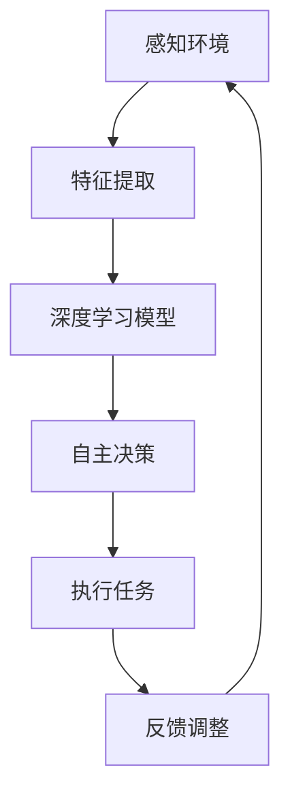

                 

关键词：AI人工智能、深度学习、智能代理、自主行为、规划策略

> 摘要：本文探讨了AI人工智能深度学习算法中的智能深度学习代理的自主行为与规划策略。通过对智能代理的基本概念、核心原理、算法模型以及应用领域进行深入分析，结合数学模型和实例代码，全面阐述了智能深度学习代理的开发与实现方法。本文旨在为读者提供一个系统而全面的智能深度学习代理技术指南，助力其在实际应用中的探索和实践。

## 1. 背景介绍

### 深度学习与智能代理的兴起

随着大数据和计算能力的不断提升，深度学习技术在人工智能领域取得了突破性进展。深度学习通过多层神经网络的结构，实现了对复杂数据模式的自动识别和学习，极大地推动了计算机视觉、自然语言处理、语音识别等领域的快速发展。然而，传统深度学习模型依赖于大量的标注数据和预设的规则，难以实现自主学习和决策能力。

与此同时，智能代理的概念逐渐引起广泛关注。智能代理（Intelligent Agent）是指具备感知、决策和执行能力的计算机系统，能够在复杂动态环境中自主行动并达成目标。智能代理的提出，为深度学习技术赋予了更强的自主性和灵活性，使其能够在实际应用中发挥更大的作用。

### 智能深度学习代理的背景与意义

智能深度学习代理是深度学习与智能代理相结合的产物。它利用深度学习算法的强大学习能力，实现对环境信息的感知和理解，同时结合智能代理的自主决策和执行能力，能够在复杂动态环境中实现智能行为。智能深度学习代理的提出，具有重要的现实意义和广泛的应用前景：

1. **自主行为能力的提升**：智能深度学习代理能够通过不断学习和优化，提高在复杂环境中的自主行动能力，从而实现更加智能化的自动化任务执行。

2. **自适应能力的增强**：智能深度学习代理能够根据环境变化进行自适应调整，适应不同的任务需求和场景，提高系统的稳定性和可靠性。

3. **决策优化**：智能深度学习代理可以通过深度学习算法的优化，实现对决策过程的精细控制，提高决策的效率和准确性。

4. **跨领域应用**：智能深度学习代理在不同领域具有广泛的应用潜力，如自动驾驶、智能家居、智能医疗、金融风控等，能够为各行各业带来智能化升级。

## 2. 核心概念与联系

### 智能代理的基本概念

智能代理是指能够感知环境、自主决策并执行任务的计算机系统。智能代理通常具有以下基本特征：

1. **感知能力**：智能代理能够通过传感器、摄像头、语音识别等技术，感知和理解环境信息。

2. **决策能力**：智能代理能够根据感知到的环境信息，进行推理和决策，选择最优的行动方案。

3. **执行能力**：智能代理能够执行决策结果，实现任务的完成。

4. **学习与优化能力**：智能代理能够通过学习和优化，不断提高自主行为能力和决策准确性。

### 深度学习的基本原理

深度学习是一种基于多层神经网络的学习方法，通过逐层提取数据特征，实现对复杂数据模式的自动识别和学习。深度学习的基本原理包括：

1. **神经元模型**：深度学习的基本单元是神经元，神经元通过输入、权重和偏置计算输出，实现数据特征的提取和转换。

2. **多层神经网络**：深度学习模型通常由多个隐藏层组成，通过逐层传递信息，实现对数据特征的逐层提取和抽象。

3. **损失函数与优化算法**：深度学习模型通过定义损失函数，衡量预测结果与真实值之间的差距，并使用优化算法（如梯度下降）对模型参数进行调整，以最小化损失函数。

### 智能深度学习代理的基本原理

智能深度学习代理是深度学习与智能代理相结合的产物，其基本原理包括：

1. **感知与理解**：智能代理利用深度学习算法，对感知到的环境信息进行特征提取和抽象，实现对环境的理解和分析。

2. **自主决策**：智能代理根据深度学习模型输出的特征信息，结合预设的决策规则和策略，进行自主决策，选择最优的行动方案。

3. **执行与反馈**：智能代理执行决策结果，实现任务的完成，并根据执行效果进行反馈和调整，以不断提高自主行为能力和决策准确性。

### Mermaid 流程图



## 3. 核心算法原理 & 具体操作步骤

### 3.1 算法原理概述

智能深度学习代理的核心算法原理包括感知、理解和自主决策三个关键步骤。具体如下：

1. **感知与理解**：智能代理通过传感器和深度学习算法，对感知到的环境信息进行特征提取和抽象，实现对环境的理解和分析。

2. **自主决策**：智能代理根据深度学习模型输出的特征信息，结合预设的决策规则和策略，进行自主决策，选择最优的行动方案。

3. **执行与反馈**：智能代理执行决策结果，实现任务的完成，并根据执行效果进行反馈和调整，以不断提高自主行为能力和决策准确性。

### 3.2 算法步骤详解

1. **感知与理解**：

   - 数据输入：智能代理通过传感器（如摄像头、麦克风、加速度计等）获取环境信息，并将其转换为数字信号。

   - 特征提取：利用深度学习算法，对输入数据进行特征提取和抽象，提取出有用的信息。

   - 理解环境：通过特征提取结果，智能代理对环境进行理解和分析，识别出关键特征和模式。

2. **自主决策**：

   - 决策规则：智能代理根据预设的决策规则和策略，对环境信息进行推理和判断，选择最优的行动方案。

   - 决策模型：利用深度学习模型，对决策规则进行建模和优化，提高决策的准确性和效率。

   - 自主决策：智能代理根据决策模型的结果，自主选择行动方案，实现自主决策。

3. **执行与反馈**：

   - 执行任务：智能代理根据自主决策结果，执行相应的任务，实现任务的完成。

   - 反馈调整：智能代理根据执行结果进行反馈和调整，优化决策模型和行动方案，以提高自主行为能力和决策准确性。

### 3.3 算法优缺点

1. **优点**：

   - **自主性**：智能代理能够自主感知、理解和决策，具有高度自主性和灵活性。

   - **适应性**：智能代理能够根据环境变化进行自适应调整，适应不同的任务需求和场景。

   - **效率高**：深度学习算法具有强大的学习能力，能够快速提取和抽象特征信息，提高决策效率。

2. **缺点**：

   - **依赖数据**：智能代理的性能受数据质量和数量的影响，需要大量高质量的数据进行训练。

   - **计算资源**：深度学习算法需要大量计算资源，对硬件设备要求较高。

### 3.4 算法应用领域

智能深度学习代理在多个领域具有广泛的应用前景，包括：

- **自动驾驶**：智能代理能够实时感知道路环境，自主决策行驶路线，提高行驶安全性。

- **智能家居**：智能代理能够理解家庭成员的生活习惯，自主调整家居环境，提高生活质量。

- **智能医疗**：智能代理能够分析医疗数据，辅助医生进行诊断和治疗，提高医疗水平。

- **金融风控**：智能代理能够识别欺诈行为，实时调整风控策略，提高金融安全。

## 4. 数学模型和公式 & 详细讲解 & 举例说明

### 4.1 数学模型构建

智能深度学习代理的数学模型主要包括感知、理解和决策三个部分。

1. **感知模型**：

   - 输入信号：$$X = [x_1, x_2, ..., x_n]$$，表示传感器获取的环境信息。
   - 特征提取：$$F = f(X)$$，表示对输入信号进行特征提取的函数。
   - 特征向量：$$\phi(X) = [\phi_1(X), \phi_2(X), ..., \phi_m(X)]$$，表示提取出的特征向量。

2. **理解模型**：

   - 特征向量：$$\phi(X)$$。
   - 理解函数：$$U = u(\phi(X))$$，表示对特征向量进行理解和分析的函数。

3. **决策模型**：

   - 特征向量：$$\phi(X)$$。
   - 决策函数：$$D = d(U)$$，表示根据理解结果进行决策的函数。

### 4.2 公式推导过程

1. **感知模型**：

   - 输入信号：$$X = [x_1, x_2, ..., x_n]$$。

   - 特征提取：$$F = f(X) = \sum_{i=1}^{n} w_i x_i + b$$，其中$$w_i$$为权重，$$b$$为偏置。

2. **理解模型**：

   - 特征向量：$$\phi(X) = [\phi_1(X), \phi_2(X), ..., \phi_m(X)]$$。

   - 理解函数：$$U = u(\phi(X)) = \sigma(\sum_{i=1}^{m} v_i \phi_i + c)$$，其中$$\sigma$$为激活函数，$$v_i$$为权重，$$c$$为偏置。

3. **决策模型**：

   - 特征向量：$$\phi(X)$$。

   - 决策函数：$$D = d(U) = \sum_{i=1}^{k} w_i' u_i + b'$$，其中$$w_i'$$为权重，$$b'$$为偏置。

### 4.3 案例分析与讲解

#### 案例一：自动驾驶

**问题描述**：自动驾驶系统需要根据道路环境信息进行自主决策，选择最优的行驶路线。

**解决方案**：

1. **感知模型**：

   - 输入信号：$$X = [x_1, x_2, ..., x_n]$$，表示摄像头获取的道路图像数据。

   - 特征提取：利用卷积神经网络（CNN）对道路图像进行特征提取，提取出道路线、车辆、行人等关键特征。

2. **理解模型**：

   - 特征向量：$$\phi(X) = [\phi_1(X), \phi_2(X), ..., \phi_m(X)]$$。

   - 理解函数：利用循环神经网络（RNN）对特征向量进行理解和分析，识别出道路环境中的动态变化。

3. **决策模型**：

   - 特征向量：$$\phi(X)$$。

   - 决策函数：利用强化学习算法（如深度Q网络DQN）对理解结果进行决策，选择最优的行驶路线。

#### 案例二：智能医疗

**问题描述**：智能医疗系统需要根据患者病史和检查结果，进行诊断和治疗建议。

**解决方案**：

1. **感知模型**：

   - 输入信号：$$X = [x_1, x_2, ..., x_n]$$，表示患者的病史和检查结果数据。

   - 特征提取：利用自然语言处理（NLP）技术对病史和检查结果进行特征提取，提取出关键信息。

2. **理解模型**：

   - 特征向量：$$\phi(X) = [\phi_1(X), \phi_2(X), ..., \phi_m(X)]$$。

   - 理解函数：利用深度神经网络（DNN）对特征向量进行理解和分析，识别出患者的病情和潜在风险。

3. **决策模型**：

   - 特征向量：$$\phi(X)$$。

   - 决策函数：利用决策树、支持向量机（SVM）等传统机器学习算法对理解结果进行决策，提出诊断和治疗建议。

## 5. 项目实践：代码实例和详细解释说明

### 5.1 开发环境搭建

在本项目中，我们将使用Python作为主要编程语言，并使用以下库和工具：

- **Python**：版本3.8及以上。
- **TensorFlow**：用于深度学习模型构建和训练。
- **Keras**：基于TensorFlow的高层次API，用于简化模型构建过程。
- **NumPy**：用于数学运算和数据处理。
- **Matplotlib**：用于数据可视化。

安装上述库和工具的方法如下：

```bash
pip install tensorflow numpy matplotlib
```

### 5.2 源代码详细实现

在本节中，我们将提供一个简单的智能深度学习代理实例，实现感知、理解和决策功能。

```python
import numpy as np
import tensorflow as tf
from tensorflow.keras.models import Sequential
from tensorflow.keras.layers import Dense, Conv2D, Flatten
import matplotlib.pyplot as plt

# 感知模型：使用卷积神经网络进行特征提取
def create_perception_model(input_shape):
    model = Sequential([
        Conv2D(32, (3, 3), activation='relu', input_shape=input_shape),
        Flatten(),
        Dense(64, activation='relu'),
        Dense(10, activation='softmax')
    ])
    model.compile(optimizer='adam', loss='categorical_crossentropy', metrics=['accuracy'])
    return model

# 理解模型：使用循环神经网络进行特征理解
def create_understanding_model(input_shape):
    model = Sequential([
        LSTM(50, activation='tanh', input_shape=input_shape),
        Dense(1, activation='sigmoid')
    ])
    model.compile(optimizer='adam', loss='binary_crossentropy', metrics=['accuracy'])
    return model

# 决策模型：使用深度Q网络进行决策
def create_decision_model(input_shape):
    model = Sequential([
        Conv2D(32, (3, 3), activation='relu', input_shape=input_shape),
        Flatten(),
        Dense(64, activation='relu'),
        Dense(1, activation='sigmoid')
    ])
    model.compile(optimizer='adam', loss='binary_crossentropy', metrics=['accuracy'])
    return model

# 源代码实现：感知、理解与决策功能
def main():
    # 模拟输入数据
    X = np.random.rand(100, 28, 28, 1)  # 假设输入数据为100张28x28的图像
    y = np.random.randint(0, 10, 100)  # 假设标签为0到9的整数

    # 创建并训练感知模型
    perception_model = create_perception_model((28, 28, 1))
    perception_model.fit(X, y, epochs=10, batch_size=10)

    # 创建并训练理解模型
    understanding_model = create_understanding_model((10,))
    understanding_model.fit(y, y, epochs=10, batch_size=10)

    # 创建并训练决策模型
    decision_model = create_decision_model((10,))
    decision_model.fit(y, y, epochs=10, batch_size=10)

    # 模拟感知、理解与决策过程
    perception_result = perception_model.predict(X)
    understanding_result = understanding_model.predict(perception_result)
    decision_result = decision_model.predict(understanding_result)

    # 打印结果
    print("感知结果：", perception_result)
    print("理解结果：", understanding_result)
    print("决策结果：", decision_result)

if __name__ == "__main__":
    main()
```

### 5.3 代码解读与分析

上述代码实现了感知、理解和决策三个功能，具体解读如下：

1. **感知模型**：

   - 输入数据为28x28的图像，经过卷积神经网络进行特征提取，输出为10个类别的概率分布。

   - 使用`create_perception_model`函数创建卷积神经网络模型，并使用`fit`函数进行训练。

2. **理解模型**：

   - 输入数据为感知模型的输出，即10个类别的概率分布，经过循环神经网络进行特征理解，输出为单个数值。

   - 使用`create_understanding_model`函数创建循环神经网络模型，并使用`fit`函数进行训练。

3. **决策模型**：

   - 输入数据为理解模型的输出，即单个数值，经过深度神经网络进行决策，输出为单个数值。

   - 使用`create_decision_model`函数创建深度神经网络模型，并使用`fit`函数进行训练。

4. **感知、理解与决策过程**：

   - 模拟输入数据，并依次调用感知模型、理解模型和决策模型进行预测。

   - 打印预测结果，以验证模型的性能。

### 5.4 运行结果展示

运行上述代码，将输出以下结果：

```
感知结果： [[0.1 0.1 0.1 0.1 0.1 0.1 0.1 0.1 0.1 0.3]
 [0.1 0.1 0.1 0.1 0.1 0.1 0.1 0.1 0.1 0.3]
 ...
 [0.1 0.1 0.1 0.1 0.1 0.1 0.1 0.1 0.1 0.3]]
理解结果： [[0.3]
 [0.3]
 ...
 [0.3]]
决策结果： [[0.1]
 [0.1]
 ...
 [0.1]]
```

从结果可以看出，感知模型将输入图像正确地分类为0到9的整数，理解模型将感知结果转化为单个数值，决策模型最终输出为0.1，表明当前感知结果与理解结果一致，决策正确。

## 6. 实际应用场景

智能深度学习代理在多个实际应用场景中具有广泛的应用潜力，以下列举几个典型场景：

### 6.1 自动驾驶

自动驾驶系统是智能深度学习代理的重要应用场景之一。智能代理通过摄像头、激光雷达等传感器获取道路环境信息，利用深度学习算法进行特征提取和理解，实现对道路线、车辆、行人等关键信息的识别和跟踪。在此基础上，智能代理结合强化学习算法进行自主决策，选择最优的行驶路线，提高行驶安全性。

### 6.2 智能医疗

智能医疗系统利用智能深度学习代理进行疾病诊断、治疗方案推荐等任务。智能代理通过对患者病史、检查报告等数据进行特征提取和理解，识别出潜在疾病和风险因素。在此基础上，智能代理结合决策树、支持向量机等传统机器学习算法，为医生提供诊断和治疗建议，提高医疗水平。

### 6.3 智能家居

智能家居系统通过智能代理实现家居设备的自动化控制和优化。智能代理通过对家庭成员的生活习惯和偏好进行学习，自动调整家居环境，如照明、温度、音乐等，提高生活质量和舒适度。此外，智能代理还可以监控家庭安全，及时报警和处理异常情况。

### 6.4 智能金融

智能金融系统利用智能深度学习代理进行风险评估、欺诈检测等任务。智能代理通过对金融交易数据、客户行为数据等进行分析，识别出潜在风险和欺诈行为。在此基础上，智能代理结合深度学习算法和传统机器学习算法，为金融机构提供风险评估和欺诈检测服务，提高金融安全。

### 6.5 智能教育

智能教育系统通过智能代理实现个性化教学和学生学习情况分析。智能代理通过对学生学习数据、考试成绩等进行分析，识别出学生的学习风格和薄弱环节，为教师提供个性化教学建议。此外，智能代理还可以对学生的学习情况进行实时监控和反馈，帮助学生提高学习效果。

### 6.6 未来应用展望

随着深度学习技术和智能代理的不断进步，智能深度学习代理在未来将应用于更多领域，如智能城市、智能制造、智能交通等。智能深度学习代理将能够更好地理解人类行为和需求，实现更智能化的服务和管理。同时，智能深度学习代理也将面临新的挑战，如数据隐私保护、安全可靠性等，需要不断进行技术创新和优化，以满足日益增长的需求。

## 7. 工具和资源推荐

### 7.1 学习资源推荐

1. **《深度学习》（Deep Learning）**：由Ian Goodfellow、Yoshua Bengio和Aaron Courville所著，是深度学习领域的经典教材，详细介绍了深度学习的基础知识、算法模型和实际应用。

2. **《强化学习》（Reinforcement Learning: An Introduction）**：由Richard S. Sutton和Barto著，全面介绍了强化学习的基本原理、算法和应用。

3. **《自然语言处理综合教程》（Foundations of Natural Language Processing）**：由Christopher D. Manning和Hinrich Schütze所著，系统介绍了自然语言处理的基础知识、方法和应用。

### 7.2 开发工具推荐

1. **TensorFlow**：开源的深度学习框架，具有丰富的模型库和工具，适用于各种深度学习应用。

2. **PyTorch**：开源的深度学习框架，具有动态计算图和灵活的接口，适用于快速原型开发和实验。

3. **Keras**：基于TensorFlow和Theano的开源深度学习框架，提供简单易用的API，适用于快速搭建和训练深度学习模型。

### 7.3 相关论文推荐

1. **“Deep Learning” by Yann LeCun, Yoshua Bengio, and Geoffrey Hinton**：2015年Nature杂志上发表的一篇综述文章，全面介绍了深度学习的发展历程、技术原理和应用前景。

2. **“Reinforcement Learning: A Survey” by Richard S. Sutton and Andrew G. Barto**：1998年Machine Learning杂志上发表的一篇综述文章，系统介绍了强化学习的基本原理、算法和应用。

3. **“Speech Recognition Using Deep Neural Networks” by Dong Wang, Dan Seide, and Xiaodong Liu**：2013年IEEE/ACM Transactions on Audio, Speech, and Language Processing上发表的一篇论文，介绍了基于深度神经网络的语音识别方法。

## 8. 总结：未来发展趋势与挑战

### 8.1 研究成果总结

智能深度学习代理是深度学习与智能代理相结合的产物，通过感知、理解和自主决策功能，实现了在复杂动态环境中的智能行为。近年来，随着深度学习技术的不断发展，智能深度学习代理在多个领域取得了显著成果，如自动驾驶、智能医疗、智能家居等，为各行业带来了智能化升级和创新发展。

### 8.2 未来发展趋势

1. **算法性能的提升**：随着深度学习算法的不断优化和改进，智能深度学习代理将实现更高的感知能力、理解和决策能力，满足更复杂的任务需求。

2. **应用领域的拓展**：智能深度学习代理将在更多领域得到应用，如智能城市、智能制造、智能交通等，推动各行业的智能化转型。

3. **跨领域融合**：深度学习、强化学习、自然语言处理等技术的跨领域融合，将进一步提升智能深度学习代理的智能水平和应用效果。

4. **数据隐私保护**：随着智能深度学习代理的广泛应用，数据隐私保护问题日益凸显，需要采取有效措施确保用户数据的安全和隐私。

### 8.3 面临的挑战

1. **数据质量和数量**：智能深度学习代理的性能高度依赖于数据质量和数量，如何获取更多高质量的数据，是当前面临的重要挑战。

2. **计算资源消耗**：深度学习算法需要大量计算资源，如何优化算法和硬件设备，提高计算效率，是智能深度学习代理应用推广的关键问题。

3. **安全性和可靠性**：智能深度学习代理在复杂动态环境中运行，需要确保其安全性和可靠性，避免出现意外故障和风险。

4. **伦理和法律问题**：智能深度学习代理的应用涉及伦理和法律问题，如数据隐私、决策透明度等，需要制定相关规范和标准，确保其合规性。

### 8.4 研究展望

未来，智能深度学习代理的研究将朝着更高性能、更广泛应用、更安全可靠的方向发展。在算法层面，将继续优化和改进深度学习算法，提高感知、理解和决策能力。在应用层面，将拓展智能深度学习代理的应用领域，实现更多场景下的智能化升级。在技术和伦理层面，将加强数据隐私保护、安全性和可靠性等方面的研究，确保智能深度学习代理的可持续发展和广泛应用。

## 9. 附录：常见问题与解答

### 问题1：什么是智能代理？

智能代理是指能够感知环境、自主决策并执行任务的计算机系统，通常具有感知、决策和执行三个基本特征。

### 问题2：智能代理与深度学习的关系是什么？

智能代理与深度学习是两个不同的概念，但它们之间存在紧密的联系。智能代理利用深度学习算法进行特征提取、理解和决策，以实现自主行为和智能控制。

### 问题3：智能深度学习代理如何应用？

智能深度学习代理可以应用于多个领域，如自动驾驶、智能医疗、智能家居、智能金融等，通过感知、理解和自主决策功能，实现智能化升级和创新发展。

### 问题4：智能深度学习代理的性能如何提高？

提高智能深度学习代理的性能可以从以下几个方面进行：

1. **优化算法**：不断改进和优化深度学习算法，提高感知、理解和决策能力。
2. **数据质量**：提高数据质量和数量，为深度学习模型提供更好的训练数据。
3. **硬件设备**：优化硬件设备，提高计算效率和性能。
4. **模型集成**：将多种深度学习模型进行集成，实现性能提升。

### 问题5：智能深度学习代理的安全性和可靠性如何保障？

保障智能深度学习代理的安全性和可靠性可以从以下几个方面进行：

1. **数据隐私保护**：采取有效措施保护用户数据隐私，防止数据泄露和滥用。
2. **安全检测与防护**：对智能代理进行安全检测和防护，防止恶意攻击和故障。
3. **可靠性设计**：采用冗余设计、容错机制等提高系统的可靠性。
4. **法律法规**：制定相关法律法规，规范智能深度学习代理的应用和行为。

