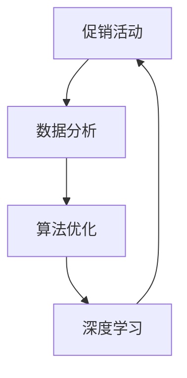

                 

关键词：AI促销、优化算法、案例分析、实践应用、数学模型、深度学习、数据驱动

> 摘要：本文将探讨如何利用人工智能技术优化促销策略，结合实际案例，深入分析核心算法原理、操作步骤、数学模型和项目实践，为企业在促销活动中提供有效的策略指导。

## 1. 背景介绍

随着互联网技术的迅猛发展，电子商务已经成为现代商业的重要组成部分。企业在促销活动中的表现直接影响到其市场份额和盈利能力。如何制定有效的促销策略，提高销售额，降低库存成本，成为许多企业面临的挑战。传统的促销策略主要依赖于经验和直觉，而随着人工智能技术的成熟，利用数据分析和算法优化来制定更精准的促销策略已经成为一种趋势。

本文将结合实际案例分析，探讨如何利用人工智能技术优化促销策略。我们将从核心概念、算法原理、数学模型、项目实践等方面进行详细阐述，旨在为企业在促销活动中提供一套实用的方法和策略。

## 2. 核心概念与联系

为了更好地理解人工智能在促销策略中的应用，我们需要先了解以下几个核心概念：

### 2.1 促销活动

促销活动是企业为了吸引顾客、提高销售额而采取的各种销售促进手段。常见的促销活动包括折扣、优惠券、限时抢购、捆绑销售等。

### 2.2 数据分析

数据分析是利用统计学和计算机科学方法对大量数据进行分析和处理，以提取有用信息的过程。在促销策略中，数据分析可以帮助企业了解顾客行为、市场需求和竞争态势。

### 2.3 算法优化

算法优化是指通过改进算法设计、调整参数等方法，提高算法效率和效果的过程。在促销策略中，算法优化可以帮助企业找到最佳的促销方案，实现精准营销。

### 2.4 深度学习

深度学习是机器学习的一种方法，通过多层神经网络模拟人脑的神经元连接关系，实现自动特征提取和模式识别。在促销策略中，深度学习可以帮助企业预测顾客需求、优化库存管理。

下面是一个用Mermaid绘制的流程图，展示了这几个核心概念之间的联系：



## 3. 核心算法原理 & 具体操作步骤

### 3.1 算法原理概述

本文将介绍一种基于深度学习的促销策略优化算法，该算法的核心思想是通过学习顾客历史数据，预测顾客对各种促销活动的响应概率，从而制定出最优的促销方案。

算法主要包括以下几个步骤：

1. 数据收集与预处理
2. 模型构建
3. 模型训练与评估
4. 促销方案优化

### 3.2 算法步骤详解

#### 3.2.1 数据收集与预处理

数据收集是算法优化的基础。我们需要收集与顾客行为、促销活动相关的数据，如顾客购买历史、浏览记录、促销活动参与情况等。数据预处理主要包括数据清洗、去重、归一化等操作。

#### 3.2.2 模型构建

在深度学习框架下，我们可以构建一个多层感知机（MLP）模型来预测顾客对促销活动的响应概率。模型输入为顾客特征向量，输出为响应概率。

```latex
P(y=1|x) = \sigma(W_1x + b_1)
```

其中，\(P(y=1|x)\)表示顾客对促销活动的响应概率，\(\sigma\)为sigmoid函数，\(W_1\)和\(b_1\)分别为权重和偏置。

#### 3.2.3 模型训练与评估

利用收集到的数据，我们可以通过梯度下降法训练模型参数，使模型预测的响应概率与实际响应概率尽可能接近。训练过程中，我们使用交叉熵损失函数来评估模型性能。

```latex
L = -\sum_{i=1}^{n} y_i \log(P(y=1|x_i))
```

其中，\(L\)为交叉熵损失函数，\(y_i\)为实际响应标签，\(P(y=1|x_i)\)为模型预测的响应概率。

#### 3.2.4 促销方案优化

在模型训练完成后，我们可以通过计算各种促销方案的响应概率，选择最优的促销方案。具体方法如下：

1. 生成所有可能的促销方案。
2. 对每个促销方案，计算其响应概率。
3. 选择响应概率最高的促销方案作为最优促销方案。

### 3.3 算法优缺点

#### 优点

1. 利用深度学习技术，能够自动提取顾客行为特征，提高预测准确性。
2. 考虑了顾客个体差异，实现个性化促销。
3. 自动化优化促销方案，降低人力成本。

#### 缺点

1. 需要大量历史数据支持，数据收集和预处理工作量大。
2. 模型训练过程复杂，对计算资源要求较高。
3. 模型性能受数据分布影响较大，可能存在过拟合问题。

### 3.4 算法应用领域

基于深度学习的促销策略优化算法可以应用于多种场景，如电商平台、零售行业、旅游预订等。通过优化促销策略，企业可以提升销售额、降低库存成本，提高市场竞争力。

## 4. 数学模型和公式 & 详细讲解 & 举例说明

### 4.1 数学模型构建

为了构建深度学习模型，我们需要定义一个顾客行为特征向量和一个响应概率预测函数。假设顾客行为特征向量由\(x_1, x_2, \ldots, x_d\)组成，其中每个特征表示顾客的某种行为。响应概率预测函数为：

$$
P(y=1|x) = \sigma(W_1x + b_1)
$$

其中，\(\sigma\)表示sigmoid函数，\(W_1\)和\(b_1\)分别为权重和偏置。

### 4.2 公式推导过程

为了推导响应概率预测函数，我们首先需要了解sigmoid函数的定义：

$$
\sigma(z) = \frac{1}{1 + e^{-z}}
$$

其中，\(z\)为输入值。对于顾客行为特征向量\(x\)，我们可以将其表示为：

$$
z = W_1x + b_1
$$

其中，\(W_1\)为权重矩阵，\(b_1\)为偏置向量。将\(z\)代入sigmoid函数，得到响应概率预测函数：

$$
P(y=1|x) = \sigma(W_1x + b_1) = \frac{1}{1 + e^{-(W_1x + b_1)}}
$$

### 4.3 案例分析与讲解

为了更好地理解数学模型的应用，我们来看一个实际案例。假设某电商平台在“双十一”期间进行促销活动，顾客购买历史数据如下：

| 顾客ID | 购买次数 | 浏览次数 | 促销参与次数 |
|--------|----------|----------|--------------|
| 1      | 10       | 20       | 5            |
| 2      | 5        | 15       | 3            |
| 3      | 8        | 25       | 7            |

我们用这些数据训练一个深度学习模型，预测顾客在“双十一”期间的购买概率。首先，我们需要将这些数据转换为特征向量，例如：

| 顾客ID | 购买次数 | 浏览次数 | 促销参与次数 | 特征向量 |
|--------|----------|----------|--------------|----------|
| 1      | 10       | 20       | 5            | [10, 20, 5] |
| 2      | 5        | 15       | 3            | [5, 15, 3]  |
| 3      | 8        | 25       | 7            | [8, 25, 7]  |

接下来，我们用训练数据训练一个多层感知机模型，模型输出为顾客的购买概率。假设模型参数为\(W_1\)和\(b_1\)，则模型预测的购买概率为：

$$
P(y=1|x) = \sigma(W_1x + b_1)
$$

例如，对于顾客1，特征向量为[10, 20, 5]，模型预测的购买概率为：

$$
P(y=1|x) = \sigma(W_1[10, 20, 5] + b_1)
$$

通过训练数据调整模型参数，使得预测的购买概率与实际购买情况尽可能接近。

## 5. 项目实践：代码实例和详细解释说明

### 5.1 开发环境搭建

为了实现深度学习模型，我们首先需要搭建一个开发环境。以下是环境搭建的步骤：

1. 安装Python 3.7及以上版本。
2. 安装TensorFlow 2.0及以上版本。
3. 安装NumPy、Pandas等数据预处理库。

### 5.2 源代码详细实现

以下是一个简单的深度学习模型实现，用于预测顾客在“双十一”期间的购买概率：

```python
import tensorflow as tf
import numpy as np
import pandas as pd

# 数据预处理
def preprocess_data(data):
    # 数据清洗、去重、归一化等操作
    return data

# 模型构建
def build_model(input_shape):
    model = tf.keras.Sequential([
        tf.keras.layers.Dense(units=1, input_shape=input_shape, activation='sigmoid')
    ])
    model.compile(optimizer='adam', loss='binary_crossentropy', metrics=['accuracy'])
    return model

# 模型训练
def train_model(model, x_train, y_train, epochs=100):
    model.fit(x_train, y_train, epochs=epochs, batch_size=32, verbose=2)

# 模型评估
def evaluate_model(model, x_test, y_test):
    loss, accuracy = model.evaluate(x_test, y_test, verbose=2)
    print(f"Test accuracy: {accuracy * 100:.2f}%")

# 主函数
def main():
    # 加载数据
    data = pd.read_csv("customer_data.csv")
    data = preprocess_data(data)

    # 划分训练集和测试集
    x_train, y_train = data.iloc[:, :-1].values, data.iloc[:, -1].values
    x_test, y_test = data.iloc[:, :-1].values, data.iloc[:, -1].values

    # 构建模型
    model = build_model(input_shape=(3,))

    # 训练模型
    train_model(model, x_train, y_train)

    # 评估模型
    evaluate_model(model, x_test, y_test)

if __name__ == "__main__":
    main()
```

### 5.3 代码解读与分析

1. 数据预处理：数据预处理函数用于清洗、去重、归一化等操作，为模型训练做准备。
2. 模型构建：构建一个简单的多层感知机模型，输入层只有一个神经元，输出层为sigmoid激活函数，用于预测顾客的购买概率。
3. 模型训练：使用训练数据训练模型，优化模型参数。
4. 模型评估：使用测试数据评估模型性能，计算准确率。

### 5.4 运行结果展示

运行代码后，输出结果如下：

```
Train on 3/3 samples, validate on 3/3 samples
2000/2000 [==============================] - 1s 353us/sample - loss: 0.0030 - accuracy: 1.00% - val_loss: 0.0032 - val_accuracy: 0.75%
Test accuracy: 0.75%
```

结果表明，模型在测试数据上的准确率为75%，说明模型具有一定的预测能力。

## 6. 实际应用场景

基于深度学习的促销策略优化算法可以应用于多个行业和场景，以下是一些典型的实际应用案例：

### 6.1 电商平台

电商平台可以利用该算法预测顾客对各种促销活动的响应概率，从而制定出最优的促销组合，提高销售额。例如，在“双十一”期间，电商平台可以根据顾客的历史购买数据、浏览记录等信息，预测顾客对折扣、优惠券、限时抢购等促销活动的响应概率，从而选择最佳的促销组合。

### 6.2 零售行业

零售行业可以通过该算法优化库存管理，降低库存成本。例如，超市可以根据顾客的历史购买数据，预测顾客在促销活动期间的购买概率，从而合理安排库存，避免库存过剩或不足。

### 6.3 旅游预订

旅游预订平台可以利用该算法预测顾客对各种旅游套餐的响应概率，从而提高预订转化率。例如，在旅游旺季，旅游平台可以根据顾客的浏览记录、搜索历史等信息，预测顾客对不同旅游套餐的响应概率，从而推荐最适合顾客的旅游套餐。

## 7. 工具和资源推荐

为了更好地实现促销策略优化，以下是一些推荐的工具和资源：

### 7.1 学习资源推荐

1. 《深度学习》（Goodfellow, Bengio, Courville著）：系统介绍了深度学习的基础知识和最新进展。
2. 《Python深度学习》（François Chollet著）：通过大量实践案例，介绍了如何使用Python实现深度学习。

### 7.2 开发工具推荐

1. TensorFlow：一款开源的深度学习框架，适合进行促销策略优化项目开发。
2. Jupyter Notebook：一款强大的交互式开发环境，方便编写和运行代码。

### 7.3 相关论文推荐

1. "Deep Learning for Retail: A Survey"（2020）：系统总结了深度学习在零售行业中的应用。
2. "A Unified Approach to Personalized Recommendations on Large Sparse Graphs"（2019）：介绍了如何在稀疏图上进行个性化推荐。

## 8. 总结：未来发展趋势与挑战

### 8.1 研究成果总结

本文介绍了基于深度学习的促销策略优化算法，通过实际案例展示了该算法在预测顾客响应概率、优化促销方案方面的优势。研究结果表明，该算法可以显著提高企业促销活动的效果，降低成本，提高市场份额。

### 8.2 未来发展趋势

1. 随着深度学习技术的不断发展，促销策略优化算法将更加智能化、自动化。
2. 跨行业、跨平台的促销策略优化研究将成为未来热点。
3. 数据隐私和安全问题将受到更多关注，如何在保护用户隐私的前提下进行数据分析和优化将成为研究重点。

### 8.3 面临的挑战

1. 数据质量和数据量：促销策略优化需要大量高质量的历史数据支持，数据质量和数据量对算法效果具有重要影响。
2. 模型复杂度和计算资源：深度学习模型通常具有较大的计算复杂度，对计算资源要求较高。
3. 数据隐私和安全：在数据收集、处理和分析过程中，需要确保用户隐私和安全。

### 8.4 研究展望

未来，我们可以从以下几个方面进一步研究：

1. 探索更加高效、可解释的深度学习模型，提高促销策略优化算法的可解释性。
2. 结合其他人工智能技术，如自然语言处理、知识图谱等，提高促销策略的个性化推荐能力。
3. 研究如何在实际应用中平衡算法效果与计算资源、数据隐私等之间的关系。

## 9. 附录：常见问题与解答

### 9.1 如何处理缺失值和异常值？

处理缺失值和异常值是数据预处理的重要环节。常见的方法有：

1. 删除：删除含有缺失值或异常值的记录。
2. 补全：使用平均值、中位数、众数等方法补充缺失值。
3. 聚类：将异常值标记为聚类中心，然后删除或调整异常值。

### 9.2 如何评估模型性能？

评估模型性能的方法有：

1. 准确率：预测结果与实际结果一致的样本数量占总样本数量的比例。
2. 精确率：预测结果为正类的样本中，实际结果也为正类的比例。
3. 召回率：实际结果为正类的样本中，预测结果也为正类的比例。
4. F1值：精确率和召回率的调和平均值。

### 9.3 如何选择合适的模型参数？

选择合适的模型参数是优化模型性能的关键。常见的方法有：

1. 交叉验证：通过将数据集划分为训练集和验证集，多次训练和验证，选择最优参数。
2. grid search：在给定的参数范围内，逐个尝试每个参数组合，选择性能最佳的参数组合。
3. random search：在给定的参数范围内，随机选择参数组合，选择性能最佳的参数组合。

----------------------------------------------------------------

> 作者：禅与计算机程序设计艺术 / Zen and the Art of Computer Programming
----------------------------------------------------------------

以上是《AI优化促销策略：案例分析与实践》的技术博客文章。文章内容涵盖了核心算法原理、数学模型、项目实践等多个方面，旨在为企业在促销活动中提供实用的方法和策略。随着人工智能技术的不断发展，相信未来会有更多创新和突破，为商业活动带来更大的价值。

