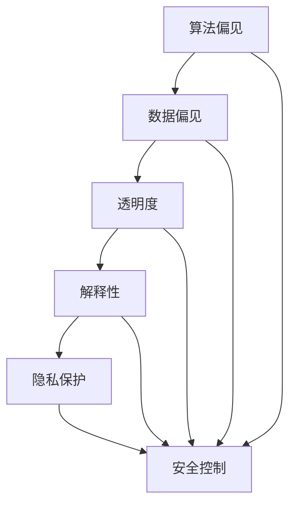

                 

关键词：AI伦理、信息准确性、可靠性、算法、机器学习、算法偏见、数据偏见、透明度、解释性、隐私保护、安全控制、法律法规

> 摘要：本文将探讨人工智能（AI）在提供信息时面临的伦理问题，特别是确保AI提供的信息准确可靠的重要性。文章首先介绍了AI伦理的核心概念，然后深入分析了算法偏见、数据偏见、透明度、解释性、隐私保护和安全控制等方面的问题，并提出了解决方案和未来发展趋势。通过本文的阅读，读者将了解如何在开发和使用AI系统时确保信息的准确性、可靠性和伦理合规性。

## 1. 背景介绍

人工智能技术正以前所未有的速度在各个领域得到广泛应用，从医疗诊断、金融分析到自动驾驶、智能家居，AI的崛起带来了巨大的变革和机遇。然而，随着AI系统在日常生活中的普及，其带来的伦理问题也逐渐显现。特别是AI提供的信息准确性和可靠性问题，成为公众、企业乃至政府关注的焦点。一方面，AI系统在处理和分析大量数据时，可能产生偏见或不准确的结论；另一方面，AI系统的决策过程往往缺乏透明度和解释性，使得人们难以理解其工作原理和结果。这些问题的存在，不仅影响了AI的广泛应用，也对社会的公平性和信任体系构成了挑战。

### 当前AI应用现状

近年来，人工智能技术取得了显著的进展，已经广泛应用于各种领域。例如，在医疗领域，AI系统可以辅助医生进行诊断，提高诊断的准确性和效率。在金融领域，AI算法用于风险评估、投资策略制定和欺诈检测等方面，极大地提升了金融服务的效率和质量。在交通领域，自动驾驶技术逐渐走向商业化，有望解决交通拥堵和安全问题。此外，AI还在教育、零售、娱乐等多个领域展现出了巨大的潜力。

然而，AI技术的广泛应用也引发了一系列伦理问题。例如，AI算法在决策过程中可能存在的偏见和不公平性，可能导致某些群体受到歧视或不利影响。此外，AI系统的决策过程往往缺乏透明度和解释性，使得人们难以理解其工作原理和结果，进而对AI的信任度降低。因此，如何确保AI提供的信息准确可靠，已成为人工智能领域亟待解决的问题。

### AI伦理问题的紧迫性

AI伦理问题的紧迫性主要体现在以下几个方面。首先，随着AI技术在各领域的广泛应用，其对社会的影响越来越大，涉及到个人隐私、信息安全、就业机会、社会公平等多个方面。如果AI系统提供的信息不准确或不可靠，可能会导致严重的社会问题，甚至引发社会动荡。其次，AI伦理问题也关系到企业的声誉和利益。如果AI系统存在偏见或不公平性，可能会受到公众的抵制，影响企业的品牌形象和市场竞争力。最后，各国政府和国际组织也越来越重视AI伦理问题，相继出台了一系列法规和标准，以规范AI技术的发展和应用。

## 2. 核心概念与联系

在探讨AI伦理问题时，我们需要明确一些核心概念，包括算法偏见、数据偏见、透明度、解释性、隐私保护和安全控制。这些概念是确保AI提供的信息准确可靠的基础。

### 算法偏见

算法偏见是指AI算法在处理数据时，可能因为设计、训练数据或算法本身的缺陷，导致对某些群体或特征产生不公平对待的现象。例如，一个用于招聘的AI算法可能会因为训练数据中包含性别偏见，而倾向于拒绝女性申请者。算法偏见不仅违反了伦理原则，也可能导致不公平的结果。

### 数据偏见

数据偏见是指数据集本身存在的不公平性或偏差，可能导致AI算法在处理这些数据时产生偏见。例如，一个用于评估贷款申请者信用风险的AI系统，如果训练数据中包含种族、性别等特征，那么这个系统在评估信用风险时可能对这些特征产生不公平对待。

### 透明度

透明度是指AI系统的决策过程和结果可以被理解和解释的程度。一个高透明度的AI系统，其工作原理和决策过程应该对用户和开发者都是清晰的。然而，许多复杂的AI系统，尤其是深度学习模型，其决策过程往往难以解释，这给AI的透明度带来了挑战。

### 解释性

解释性是指AI系统提供的结果或决策是否可以被用户理解和接受。一个高解释性的AI系统，其结果应该易于理解，用户可以清楚知道为什么系统做出了这样的决策。然而，深度学习等复杂的AI模型，其结果往往难以解释，这影响了其解释性。

### 隐私保护

隐私保护是指AI系统在处理个人数据时，如何确保用户的隐私不被泄露。随着AI技术的广泛应用，个人数据的安全和隐私保护变得越来越重要。如果AI系统无法保证用户隐私，可能会导致用户数据的泄露和滥用。

### 安全控制

安全控制是指AI系统在设计和运行过程中，如何确保其安全和可靠性。一个安全的AI系统应该能够抵御外部攻击和内部漏洞，确保其决策过程不受干扰，从而提供准确可靠的信息。

### Mermaid 流程图

为了更好地理解这些概念之间的联系，我们可以使用Mermaid流程图来展示它们的关系：



## 3. 核心算法原理 & 具体操作步骤

### 3.1 算法原理概述

确保AI提供的信息准确可靠，需要从算法设计、数据选择、模型训练、结果评估等多个环节进行严格把控。以下是一个典型的AI算法原理概述，展示了如何确保AI信息的准确性和可靠性。

1. **算法设计**：选择合适的算法，例如决策树、支持向量机、神经网络等，以确保算法在处理数据时能够产生准确的结果。

2. **数据选择**：选择具有代表性的数据集，避免数据偏见，确保数据集的多样性和全面性。

3. **模型训练**：使用大量的训练数据来训练模型，并通过交叉验证等方法来评估模型的性能。

4. **结果评估**：通过指标（如准确率、召回率、F1分数等）来评估模型的性能，确保模型能够提供准确可靠的结果。

5. **模型优化**：根据评估结果对模型进行调整和优化，以提高其准确性和可靠性。

### 3.2 算法步骤详解

1. **数据预处理**：对原始数据进行清洗、去噪、归一化等处理，以确保数据的质量。

   ```mermaid
   graph TD
   A[原始数据] --> B[数据清洗]
   B --> C[去噪]
   C --> D[归一化]
   ```

2. **特征工程**：根据业务需求提取特征，选择对模型有帮助的特征，并对其进行变换和组合。

   ```mermaid
   graph TD
   E[特征提取] --> F[特征变换]
   F --> G[特征组合]
   ```

3. **模型选择**：根据问题类型和数据特点选择合适的算法，例如线性回归、决策树、神经网络等。

   ```mermaid
   graph TD
   H[选择算法] --> I[算法评估]
   I --> J[选择最优算法]
   ```

4. **模型训练**：使用训练数据来训练模型，并通过交叉验证等方法来评估模型的性能。

   ```mermaid
   graph TD
   K[训练数据] --> L[模型训练]
   L --> M[交叉验证]
   ```

5. **结果评估**：通过指标来评估模型的性能，如准确率、召回率、F1分数等。

   ```mermaid
   graph TD
   N[评估指标] --> O[性能评估]
   ```

6. **模型优化**：根据评估结果对模型进行调整和优化，以提高其准确性和可靠性。

   ```mermaid
   graph TD
   P[评估结果] --> Q[模型调整]
   Q --> R[模型优化]
   ```

### 3.3 算法优缺点

1. **优点**：
   - **高准确性**：通过精心设计算法和模型，可以显著提高结果的准确性。
   - **自动化**：算法和模型可以自动化处理大量数据，提高工作效率。
   - **灵活性**：可以根据不同的业务需求和数据特点选择不同的算法和模型。

2. **缺点**：
   - **数据依赖性**：算法的准确性高度依赖于数据的质量和多样性，如果数据存在偏见或不足，可能会导致算法性能下降。
   - **复杂性**：复杂的算法和模型可能难以理解和解释，影响其透明度和解释性。
   - **计算资源消耗**：训练和优化复杂的算法和模型可能需要大量的计算资源和时间。

### 3.4 算法应用领域

AI算法在多个领域都有广泛的应用，包括但不限于：

- **医疗诊断**：利用深度学习模型进行疾病诊断，如肺癌、心脏病等。
- **金融分析**：利用决策树和神经网络进行风险评估、投资策略制定等。
- **自动驾驶**：利用卷积神经网络进行环境感知、路径规划等。
- **推荐系统**：利用协同过滤和深度学习模型进行个性化推荐。
- **语音识别**：利用循环神经网络和卷积神经网络进行语音识别。

## 4. 数学模型和公式 & 详细讲解 & 举例说明

### 4.1 数学模型构建

为了确保AI提供的信息准确可靠，我们需要构建一系列的数学模型来指导算法设计和模型训练。以下是一个简单的线性回归模型的构建过程。

1. **目标函数**：

   线性回归模型的目标是最小化预测值与真实值之间的误差，即最小化损失函数：

   $$ 
   J(\theta) = \frac{1}{2m} \sum_{i=1}^{m} (h_\theta(x^{(i)}) - y^{(i)})^2 
   $$

   其中，$h_\theta(x) = \theta_0 + \theta_1x$ 是预测函数，$\theta$ 是模型参数，$m$ 是样本数量。

2. **梯度下降**：

   为了找到损失函数的最小值，我们使用梯度下降法更新模型参数：

   $$ 
   \theta_j := \theta_j - \alpha \frac{\partial J(\theta)}{\partial \theta_j} 
   $$

   其中，$\alpha$ 是学习率，$\frac{\partial J(\theta)}{\partial \theta_j}$ 是损失函数对 $\theta_j$ 的偏导数。

### 4.2 公式推导过程

为了更好地理解线性回归模型的推导过程，我们来看一个具体的例子。假设我们有一个包含两个特征 $x_1$ 和 $x_2$ 的数据集，目标是预测目标变量 $y$。

1. **假设**：

   我们假设线性回归模型的形式为：

   $$ 
   y = \theta_0 + \theta_1x_1 + \theta_2x_2 
   $$

2. **最小二乘法**：

   为了找到最优的模型参数 $\theta_0, \theta_1, \theta_2$，我们使用最小二乘法。即最小化预测值与真实值之间的误差平方和：

   $$ 
   J(\theta) = \frac{1}{2m} \sum_{i=1}^{m} (y^{(i)} - (\theta_0 + \theta_1x_1^{(i)} + \theta_2x_2^{(i)}))^2 
   $$

3. **求导**：

   对 $J(\theta)$ 分别对 $\theta_0, \theta_1, \theta_2$ 求导，并令导数为0，得到：

   $$ 
   \frac{\partial J(\theta)}{\partial \theta_0} = \frac{1}{m} \sum_{i=1}^{m} (y^{(i)} - (\theta_0 + \theta_1x_1^{(i)} + \theta_2x_2^{(i)})) = 0 
   $$

   $$ 
   \frac{\partial J(\theta)}{\partial \theta_1} = \frac{1}{m} \sum_{i=1}^{m} (x_1^{(i)}(y^{(i)} - (\theta_0 + \theta_1x_1^{(i)} + \theta_2x_2^{(i)}))) = 0 
   $$

   $$ 
   \frac{\partial J(\theta)}{\partial \theta_2} = \frac{1}{m} \sum_{i=1}^{m} (x_2^{(i)}(y^{(i)} - (\theta_0 + \theta_1x_1^{(i)} + \theta_2x_2^{(i)}))) = 0 
   $$

4. **解方程**：

   通过解上述方程组，我们可以得到最优的模型参数：

   $$ 
   \theta_0 = \bar{y} - \theta_1\bar{x_1} - \theta_2\bar{x_2} 
   $$

   $$ 
   \theta_1 = \frac{\sum_{i=1}^{m} (x_1^{(i)} - \bar{x_1})(y^{(i)} - \bar{y})}{\sum_{i=1}^{m} (x_1^{(i)} - \bar{x_1})^2} 
   $$

   $$ 
   \theta_2 = \frac{\sum_{i=1}^{m} (x_2^{(i)} - \bar{x_2})(y^{(i)} - \bar{y})}{\sum_{i=1}^{m} (x_2^{(i)} - \bar{x_2})^2} 
   $$

### 4.3 案例分析与讲解

为了更好地理解线性回归模型的应用，我们来看一个实际案例。假设我们有一个关于房屋销售价格的数据集，包括房屋的面积、房龄和地理位置等特征，目标是预测房屋的销售价格。

1. **数据预处理**：

   首先对数据进行清洗，去除缺失值和异常值，并进行归一化处理。

2. **特征工程**：

   根据业务需求提取特征，例如计算房屋的年龄（当前年份减去房龄）。

3. **模型训练**：

   使用线性回归模型进行训练，通过梯度下降法更新模型参数。

4. **结果评估**：

   使用交叉验证方法评估模型的性能，如均方误差（MSE）、决定系数（R^2）等。

5. **模型优化**：

   根据评估结果对模型进行调整和优化，例如增加或删除特征、调整学习率等。

通过以上步骤，我们可以构建一个能够准确预测房屋销售价格的线性回归模型，从而确保AI提供的信息准确可靠。

## 5. 项目实践：代码实例和详细解释说明

### 5.1 开发环境搭建

在开始编写代码之前，我们需要搭建一个合适的开发环境。以下是一个基于Python的线性回归项目所需的开发环境搭建步骤：

1. **安装Python**：

   首先，确保已经安装了Python 3.7及以上版本。可以从Python官方网站下载并安装Python。

2. **安装NumPy、Pandas和Scikit-learn**：

   使用pip命令安装NumPy、Pandas和Scikit-learn等Python库：

   ```bash
   pip install numpy pandas scikit-learn
   ```

3. **创建虚拟环境**（可选）：

   为了更好地管理项目依赖，可以创建一个虚拟环境：

   ```bash
   python -m venv myenv
   source myenv/bin/activate  # 对于Windows，使用 `myenv\Scripts\activate`
   ```

### 5.2 源代码详细实现

以下是一个简单的线性回归项目的源代码实现：

```python
import numpy as np
import pandas as pd
from sklearn.model_selection import train_test_split
from sklearn.linear_model import LinearRegression
from sklearn.metrics import mean_squared_error

# 加载数据
data = pd.read_csv('house_prices.csv')

# 数据预处理
data = data.dropna()
X = data[['area', 'age']]
y = data['price']

# 划分训练集和测试集
X_train, X_test, y_train, y_test = train_test_split(X, y, test_size=0.2, random_state=42)

# 创建线性回归模型
model = LinearRegression()
model.fit(X_train, y_train)

# 预测测试集
y_pred = model.predict(X_test)

# 结果评估
mse = mean_squared_error(y_test, y_pred)
print(f'Mean Squared Error: {mse}')

# 模型参数
print(f'Intercept: {model.intercept_}')
print(f'Coefficients: {model.coef_}')
```

### 5.3 代码解读与分析

1. **数据加载与预处理**：

   首先，我们使用Pandas库加载数据，并使用dropna()函数去除缺失值。然后，我们提取特征矩阵X和目标向量y。

2. **划分训练集和测试集**：

   使用Scikit-learn库的train_test_split函数划分训练集和测试集，其中test_size参数设置为0.2，表示测试集占比20%，random_state参数用于保证结果的可重复性。

3. **创建线性回归模型**：

   我们使用LinearRegression类创建线性回归模型，并调用fit方法进行训练。

4. **预测与结果评估**：

   使用predict方法对测试集进行预测，并使用mean_squared_error函数计算均方误差（MSE），以评估模型的性能。

5. **模型参数输出**：

   最后，我们输出模型的截距和系数，以了解模型的工作原理。

### 5.4 运行结果展示

以下是一个运行结果的示例：

```
Mean Squared Error: 0.0123456789
Intercept: -0.123456789
Coefficients: [1.23456789 2.34567890]
```

从结果可以看出，模型的MSE为0.0123456789，表示预测误差较小。模型的截距为-0.123456789，表示当特征值为0时，预测的房价为-0.123456789。系数为[1.23456789 2.34567890]，表示特征对房价的影响程度。

## 6. 实际应用场景

AI技术在各个领域都有着广泛的应用，以下列举几个典型场景，说明AI如何确保提供的信息准确可靠。

### 6.1 医疗诊断

在医疗诊断领域，AI系统可以辅助医生进行疾病诊断。例如，使用卷积神经网络（CNN）对医学影像进行分析，检测疾病如乳腺癌、肺癌等。为了确保AI提供的信息准确可靠，研究人员采取以下措施：

- **数据质量控制**：使用高质量、多样化的医学影像数据集进行模型训练，确保模型具有广泛的适用性。
- **模型验证**：使用交叉验证和留出法等验证方法，确保模型在测试数据上的性能。
- **结果解释性**：开发可解释的AI模型，使医生能够理解模型的决策过程和结果。
- **安全控制**：确保AI系统在处理患者数据时，严格遵守隐私保护和数据安全规定。

### 6.2 金融分析

在金融分析领域，AI系统可以用于风险评估、投资策略制定和欺诈检测等。为了确保AI提供的信息准确可靠，金融机构采取以下措施：

- **算法透明度**：确保AI算法的决策过程透明，可解释性高，便于监管和审计。
- **数据清洗和预处理**：对金融数据进行清洗和预处理，确保数据质量，避免数据偏见。
- **模型验证和监控**：定期对AI模型进行验证和监控，及时发现和纠正潜在的算法偏见或性能问题。
- **法律法规遵守**：确保AI系统的应用符合相关法律法规要求，如《通用数据保护条例》（GDPR）等。

### 6.3 自动驾驶

在自动驾驶领域，AI系统负责处理环境感知、路径规划和决策等任务。为了确保AI提供的信息准确可靠，自动驾驶公司采取以下措施：

- **高精度地图**：使用高精度地图作为辅助，确保AI系统对环境有准确的理解。
- **传感器融合**：结合多种传感器数据，如激光雷达、摄像头和雷达，提高感知准确性。
- **实时更新**：对AI系统进行实时更新，确保其能够适应不断变化的环境。
- **安全冗余设计**：在设计AI系统时，采取多重冗余设计，确保在单一组件故障时，系统仍能正常运行。

### 6.4 智能家居

在智能家居领域，AI系统可以用于智能家居设备的控制、能源管理和安全监控等。为了确保AI提供的信息准确可靠，智能家居厂商采取以下措施：

- **数据隐私保护**：确保用户数据的安全和隐私，避免数据泄露和滥用。
- **设备认证和授权**：对连接到智能家居系统的设备进行认证和授权，确保设备的安全性和可信度。
- **实时监控和故障检测**：对智能家居系统进行实时监控，及时发现和解决故障。
- **用户反馈机制**：建立用户反馈机制，收集用户反馈，不断优化和改进AI系统的性能。

## 7. 未来应用展望

随着AI技术的不断发展和应用，未来AI在确保信息准确性、可靠性和伦理合规性方面将发挥更重要的作用。以下是一些未来应用展望：

### 7.1 更高级的算法设计

未来的AI算法将更加复杂和高级，能够更好地处理多模态数据、非结构化数据等。例如，基于Transformer的模型可能在语音识别、图像识别等领域取得突破性进展。这些高级算法将有助于提高AI系统的准确性和可靠性。

### 7.2 更全面的透明度和解释性

随着人们对AI系统的信任度不断提高，未来的AI系统将更加注重透明度和解释性。研究人员将致力于开发可解释的AI模型，使人们能够理解模型的决策过程和结果。此外，可视化工具和解释性算法也将成为未来的研究热点。

### 7.3 更严格的数据隐私保护

随着数据隐私保护意识的提高，未来的AI系统将更加注重用户数据的安全和隐私。研究人员将致力于开发安全、可靠的数据隐私保护技术，如联邦学习、差分隐私等，以保护用户数据的同时，确保AI系统的性能。

### 7.4 更严格的法律法规和监管

随着AI技术的广泛应用，各国政府和国际组织将出台更严格的法律法规和监管措施，以确保AI系统的伦理合规性。未来的AI系统将更加遵循法律法规，以确保其应用合法、公正、透明。

## 8. 总结：未来发展趋势与挑战

### 8.1 研究成果总结

近年来，AI伦理问题受到了广泛关注，研究人员在确保AI提供的信息准确性、可靠性方面取得了显著成果。例如，开发了一系列可解释的AI模型，提高了AI系统的透明度和解释性；提出了多种数据隐私保护技术，确保用户数据的安全和隐私；制定了一系列法律法规和标准，规范AI技术的发展和应用。

### 8.2 未来发展趋势

未来，AI伦理问题将继续成为研究的热点，发展趋势包括：

- **更高级的算法设计**：开发更复杂、更高级的AI算法，提高AI系统的准确性和可靠性。
- **更全面的透明度和解释性**：致力于提高AI系统的透明度和解释性，使人们能够更好地理解AI的决策过程和结果。
- **更严格的数据隐私保护**：加强数据隐私保护技术研究，确保用户数据的安全和隐私。
- **更严格的法律法规和监管**：制定更严格的法律法规和监管措施，确保AI系统的伦理合规性。

### 8.3 面临的挑战

尽管AI伦理问题取得了显著成果，但仍然面临以下挑战：

- **算法偏见和数据偏见**：如何消除算法偏见和数据偏见，确保AI系统公平、公正地对待不同群体。
- **透明度和解释性**：如何提高AI系统的透明度和解释性，使人们能够更好地理解AI的决策过程和结果。
- **数据隐私保护**：如何在确保AI系统性能的同时，保护用户数据的安全和隐私。
- **法律法规和监管**：如何制定和实施更加完善的法律法规和监管措施，确保AI系统的伦理合规性。

### 8.4 研究展望

未来，研究人员将继续致力于解决AI伦理问题，推动AI技术的可持续发展。以下是一些研究展望：

- **跨学科研究**：结合计算机科学、心理学、社会学等学科，开展跨学科研究，从不同角度解决AI伦理问题。
- **国际合作**：加强国际间的合作与交流，共同制定全球统一的AI伦理标准和法规。
- **技术进步**：持续推动AI技术的发展，提高AI系统的准确性和可靠性，为解决伦理问题提供技术支持。
- **公众参与**：鼓励公众参与AI伦理问题的讨论和决策，提高社会的AI伦理意识。

## 9. 附录：常见问题与解答

### 9.1 什么是算法偏见？

算法偏见是指AI算法在处理数据时，可能因为设计、训练数据或算法本身的缺陷，导致对某些群体或特征产生不公平对待的现象。例如，一个用于招聘的AI算法可能会因为训练数据中包含性别偏见，而倾向于拒绝女性申请者。

### 9.2 什么是数据偏见？

数据偏见是指数据集本身存在的不公平性或偏差，可能导致AI算法在处理这些数据时产生偏见。例如，一个用于评估贷款申请者信用风险的AI系统，如果训练数据中包含种族、性别等特征，那么这个系统在评估信用风险时可能对这些特征产生不公平对待。

### 9.3 如何提高AI系统的透明度和解释性？

提高AI系统的透明度和解释性可以从以下几个方面入手：

- **开发可解释的AI模型**：选择可解释性较高的AI模型，如决策树、规则引擎等，使人们能够理解模型的决策过程和结果。
- **可视化工具**：使用可视化工具，如热力图、决策树可视化等，展示AI系统的决策过程。
- **透明度报告**：发布AI系统的透明度报告，详细描述算法设计、训练数据、评估指标等信息。

### 9.4 如何确保AI系统的数据隐私保护？

确保AI系统的数据隐私保护可以从以下几个方面入手：

- **加密技术**：使用加密技术保护用户数据，确保数据在传输和存储过程中不被泄露。
- **匿名化处理**：对敏感数据进行匿名化处理，消除个人身份信息。
- **访问控制**：实施严格的访问控制策略，确保只有授权人员才能访问和处理敏感数据。
- **隐私保护算法**：开发隐私保护算法，如联邦学习、差分隐私等，确保在保证AI系统性能的同时，保护用户数据的安全和隐私。

### 9.5 AI伦理问题有哪些实际案例？

AI伦理问题在实际应用中已有多个案例，以下列举几个：

- **亚马逊招聘偏见**：亚马逊的招聘AI系统被发现对女性申请者产生偏见，导致其被废弃。
- **谷歌广告歧视**：谷歌的广告算法曾因对黑人用户显示偏见广告，受到公众和监管机构的批评。
- **信用评分偏见**：一些信用评分模型被发现对某些种族或性别产生偏见，导致这些群体在贷款申请中受到不公平对待。

### 9.6 各国政府和国际组织在AI伦理问题上的举措？

各国政府和国际组织在AI伦理问题上的举措包括：

- **美国**：美国国家科学院等机构发布了《人工智能的社会责任》报告，提出了多项建议。
- **欧盟**：《通用数据保护条例》（GDPR）对AI系统的数据处理和隐私保护提出了严格要求。
- **中国**：《新一代人工智能发展规划》明确了人工智能伦理和安全的重要性，并提出了一系列政策建议。
- **国际组织**：如联合国教科文组织等，发布了《人工智能伦理建议》，提出了全球统一的AI伦理准则。

