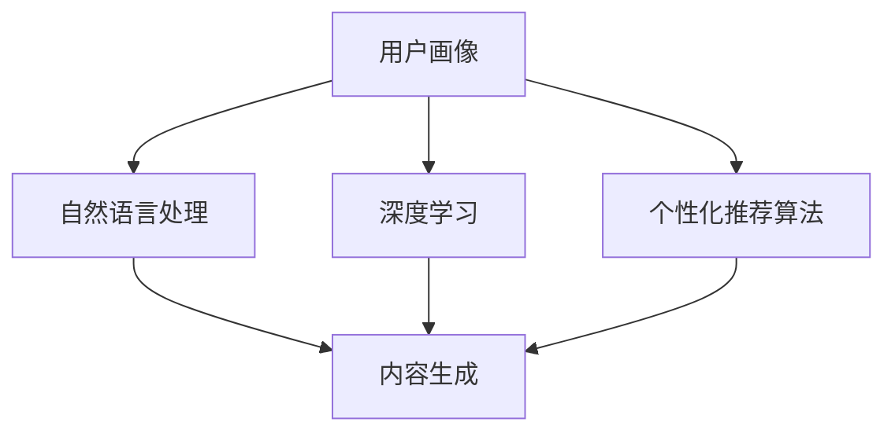

                 

在当今快速发展的数字时代，人工智能（AI）技术在内容创作领域的应用日益广泛，为创作者们带来了前所未有的便利。然而，随着AI技术的发展，个性化需求的满足成为了一个新的挑战。本文将探讨AI内容创作者面临的挑战，以及如何有效地满足这些个性化需求。

## 1. 背景介绍

随着互联网和数字媒体的普及，内容创作已经成为了现代社会不可或缺的一部分。无论是个人博客、社交媒体，还是企业营销、教育培训，内容创作都在不断推动着信息传播和知识交流。然而，随着用户需求的多样化和个性化，传统的内容创作方式已经难以满足日益增长的需求。

AI技术的出现为内容创作带来了新的机遇。通过机器学习、自然语言处理和深度学习等技术，AI能够自动生成文本、图像、音频和视频等多种类型的内容。这使得内容创作者可以更高效地生成大量高质量的内容，从而满足不同用户群体的需求。

然而，个性化需求的满足并非易事。随着AI技术的发展，用户对内容的个性化和定制化要求越来越高。他们希望内容不仅能够满足自己的兴趣和需求，还能够与自己产生共鸣。这就要求AI内容创作者能够准确地理解用户的意图和喜好，并在此基础上创作出真正个性化的内容。

## 2. 核心概念与联系

为了满足个性化需求，AI内容创作者需要了解以下几个核心概念：

### 2.1 用户画像

用户画像是对用户特征的综合描述，包括用户的基本信息、行为习惯、兴趣爱好、需求偏好等。通过构建用户画像，AI内容创作者可以更好地了解用户的背景和需求，从而创作出更符合用户期待的内容。

### 2.2 自然语言处理

自然语言处理（NLP）是AI技术中的一个重要分支，旨在使计算机能够理解、处理和生成自然语言。通过NLP技术，AI内容创作者可以分析用户的语言输入，理解其意图和需求，并据此生成个性化的内容。

### 2.3 深度学习

深度学习是一种基于多层神经网络的人工智能算法，能够通过学习大量的数据自动提取特征，并进行分类和预测。在AI内容创作中，深度学习可以帮助创作者分析用户行为，预测用户兴趣，从而生成个性化的内容。

### 2.4 个性化推荐算法

个性化推荐算法是基于用户画像和用户行为数据，为用户提供个性化内容推荐的算法。通过个性化推荐算法，AI内容创作者可以更好地满足用户的需求，提高用户满意度和内容消费率。

下面是一个用Mermaid绘制的流程图，展示了上述核心概念之间的联系：



## 3. 核心算法原理 & 具体操作步骤

### 3.1 算法原理概述

AI内容创作者的核心算法主要包括用户画像构建、自然语言处理、深度学习和个性化推荐算法。这些算法的工作原理如下：

### 3.1.1 用户画像构建

用户画像构建算法通过收集和分析用户在互联网上的行为数据，如搜索历史、浏览记录、评论、点赞等，来建立用户的综合画像。通过分析用户画像，AI内容创作者可以了解用户的需求和兴趣，从而为用户提供个性化内容。

### 3.1.2 自然语言处理

自然语言处理算法用于分析和理解用户的语言输入，包括文本、语音等。通过NLP技术，AI内容创作者可以提取用户的意图和需求，并将其转化为结构化的数据，以便进一步处理。

### 3.1.3 深度学习

深度学习算法通过学习大量的数据，自动提取特征并进行分类和预测。在AI内容创作中，深度学习算法可以分析用户行为，预测用户兴趣，从而为用户提供个性化的内容。

### 3.1.4 个性化推荐算法

个性化推荐算法基于用户画像和用户行为数据，为用户提供个性化的内容推荐。通过个性化推荐算法，AI内容创作者可以更好地满足用户的需求，提高用户满意度和内容消费率。

### 3.2 算法步骤详解

#### 3.2.1 用户画像构建

1. 数据采集：通过Web爬虫、API接口等方式，收集用户在互联网上的行为数据。
2. 数据预处理：对采集到的数据进行清洗、去噪、归一化等处理，以消除数据中的噪声和异常值。
3. 特征提取：根据用户画像构建的目标，从预处理后的数据中提取相关的特征，如用户的基本信息、兴趣爱好、需求偏好等。
4. 用户画像建模：使用机器学习算法，如聚类、分类、回归等，对提取的特征进行建模，构建用户画像。

#### 3.2.2 自然语言处理

1. 分词：将用户的语言输入分解为一个个单词或词组。
2. 词性标注：对分词结果进行词性标注，以便后续的语义分析。
3. 语义分析：通过语义分析，提取用户的意图和需求。
4. 内容生成：根据用户的意图和需求，生成个性化的内容。

#### 3.2.3 深度学习

1. 数据集准备：收集大量的用户行为数据，如浏览记录、搜索历史、评论等。
2. 特征提取：从用户行为数据中提取特征，如用户的浏览时间、浏览频率、搜索关键词等。
3. 模型训练：使用深度学习算法，如神经网络、卷积神经网络、循环神经网络等，对提取的特征进行训练。
4. 模型评估：通过交叉验证、混淆矩阵、F1值等指标，评估模型的性能。
5. 模型应用：将训练好的模型应用于实际场景，预测用户兴趣。

#### 3.2.4 个性化推荐算法

1. 用户画像构建：使用第3.2.1节中的方法，构建用户画像。
2. 内容特征提取：对用户感兴趣的内容进行特征提取，如文本特征、图像特征、音频特征等。
3. 内容推荐：使用协同过滤、基于内容的推荐、混合推荐等方法，为用户推荐个性化的内容。

### 3.3 算法优缺点

#### 3.3.1 用户画像构建

优点：
- 可以全面了解用户的需求和兴趣，为用户提供个性化内容。
- 可以基于历史数据进行预测，提高内容推荐的准确性。

缺点：
- 需要大量的用户数据，对数据的采集、处理和存储要求较高。
- 用户画像可能存在偏差，导致推荐结果不准确。

#### 3.3.2 自然语言处理

优点：
- 可以理解用户的语言输入，提取用户的意图和需求。
- 可以生成个性化的文本内容，满足用户的个性化需求。

缺点：
- 对语言的复杂性和多样性处理能力有限，可能导致理解错误。
- 需要大量的语言数据和计算资源，成本较高。

#### 3.3.3 深度学习

优点：
- 可以自动提取特征，减少人工干预。
- 可以处理大量数据，提高预测准确性。

缺点：
- 训练过程需要大量的时间和计算资源。
- 模型的泛化能力较差，可能导致在新的场景下表现不佳。

#### 3.3.4 个性化推荐算法

优点：
- 可以根据用户画像和用户行为数据，为用户推荐个性化内容。
- 可以提高用户满意度和内容消费率。

缺点：
- 推荐结果可能存在偏差，导致用户不满。
- 需要大量计算资源和存储资源。

### 3.4 算法应用领域

AI内容创作者的核心算法可以应用于以下领域：

- **社交媒体**：根据用户画像和用户行为数据，为用户提供个性化内容推荐。
- **电子商务**：为用户提供个性化商品推荐，提高销售额。
- **教育培训**：根据用户学习行为，为用户提供个性化课程推荐。
- **媒体出版**：为用户提供个性化文章、视频推荐，提高内容消费率。

## 4. 数学模型和公式 & 详细讲解 & 举例说明

### 4.1 数学模型构建

为了满足个性化需求，AI内容创作者需要构建一系列的数学模型。这些模型可以分为以下几个部分：

#### 4.1.1 用户画像模型

用户画像模型用于描述用户的基本信息、行为习惯、兴趣爱好和需求偏好。假设用户画像由以下特征组成：

- \( u_1 \)：用户年龄
- \( u_2 \)：用户性别
- \( u_3 \)：用户职业
- \( u_4 \)：用户兴趣爱好
- \( u_5 \)：用户需求偏好

用户画像模型可以表示为：

\[ U = \{ u_1, u_2, u_3, u_4, u_5 \} \]

#### 4.1.2 自然语言处理模型

自然语言处理模型用于分析用户的语言输入，提取用户的意图和需求。假设用户语言输入为：

\[ S = \{ s_1, s_2, s_3, \ldots, s_n \} \]

自然语言处理模型可以表示为：

\[ P(S|U) = \prod_{i=1}^{n} P(s_i|u_i) \]

其中，\( P(s_i|u_i) \) 表示在给定用户画像 \( u_i \) 的情况下，用户语言输入 \( s_i \) 的概率。

#### 4.1.3 深度学习模型

深度学习模型用于预测用户兴趣，生成个性化内容。假设用户兴趣由以下特征组成：

- \( i_1 \)：用户浏览时间
- \( i_2 \)：用户浏览频率
- \( i_3 \)：用户搜索关键词

深度学习模型可以表示为：

\[ P(I|U) = \prod_{j=1}^{m} P(i_j|u_j) \]

其中，\( P(i_j|u_j) \) 表示在给定用户画像 \( u_j \) 的情况下，用户兴趣 \( i_j \) 的概率。

#### 4.1.4 个性化推荐模型

个性化推荐模型用于根据用户画像和用户兴趣，为用户推荐个性化内容。假设用户感兴趣的内容为：

\[ C = \{ c_1, c_2, c_3, \ldots, c_n \} \]

个性化推荐模型可以表示为：

\[ R(C|U, I) = \sum_{k=1}^{n} P(c_k|u_k, i_k) \]

其中，\( P(c_k|u_k, i_k) \) 表示在给定用户画像 \( u_k \) 和用户兴趣 \( i_k \) 的情况下，用户感兴趣的内容 \( c_k \) 的概率。

### 4.2 公式推导过程

下面我们分别推导用户画像模型、自然语言处理模型、深度学习模型和个性化推荐模型的公式。

#### 4.2.1 用户画像模型

用户画像模型可以通过统计学习方法进行构建。假设我们收集了 \( N \) 个用户的数据，每个用户的数据由 \( M \) 个特征组成：

\[ D = \{ (u_{11}, u_{12}, \ldots, u_{1M}), (u_{21}, u_{22}, \ldots, u_{2M}), \ldots, (u_{N1}, u_{N2}, \ldots, u_{NM}) \} \]

用户画像模型的目标是估计每个特征的分布：

\[ P(u_j|D) = \frac{P(u_j, D)}{P(D)} \]

其中，\( P(u_j, D) \) 表示在给定数据 \( D \) 的情况下，用户特征 \( u_j \) 的概率，\( P(D) \) 表示数据 \( D \) 的概率。

假设我们使用最大似然估计（MLE）来估计特征分布：

\[ P(u_j|D) = \prod_{n=1}^{N} P(u_{nj}|D) \]

我们可以通过对数似然函数最大化来估计特征分布：

\[ \log P(u_j|D) = \sum_{n=1}^{N} \log P(u_{nj}|D) \]

其中，\( P(u_{nj}|D) \) 表示在给定数据 \( D \) 的情况下，用户特征 \( u_{nj} \) 的概率。

通过最大化对数似然函数，我们可以得到用户画像模型的参数估计：

\[ \theta_j = \arg\max_{\theta_j} \sum_{n=1}^{N} \log P(u_{nj}|D) \]

#### 4.2.2 自然语言处理模型

自然语言处理模型可以通过条件概率来表示。假设用户语言输入序列为 \( S = \{ s_1, s_2, s_3, \ldots, s_n \} \)，用户画像为 \( U = \{ u_1, u_2, u_3, \ldots, u_m \} \)。自然语言处理模型的目标是估计给定用户画像的情况下，用户语言输入的概率：

\[ P(S|U) = \prod_{i=1}^{n} P(s_i|u_i) \]

我们可以使用贝叶斯网络来表示自然语言处理模型。贝叶斯网络是一个有向无环图（DAG），其中每个节点表示一个随机变量，边的方向表示变量之间的因果关系。

在自然语言处理模型中，用户画像和用户语言输入之间存在因果关系。假设用户画像决定了用户语言输入，即：

\[ P(S|U) = P(S|U) \]

我们可以使用条件概率来表示自然语言处理模型：

\[ P(S|U) = \prod_{i=1}^{n} P(s_i|u_i) \]

其中，\( P(s_i|u_i) \) 表示在给定用户画像 \( u_i \) 的情况下，用户语言输入 \( s_i \) 的概率。

我们可以使用最大似然估计（MLE）来估计条件概率：

\[ P(s_i|u_i) = \frac{P(s_i, u_i)}{P(u_i)} \]

其中，\( P(s_i, u_i) \) 表示在给定用户画像 \( u_i \) 的情况下，用户语言输入 \( s_i \) 和用户画像 \( u_i \) 的概率，\( P(u_i) \) 表示用户画像 \( u_i \) 的概率。

通过最大化对数似然函数，我们可以得到自然语言处理模型的参数估计：

\[ \theta_i = \arg\max_{\theta_i} \sum_{i=1}^{n} \log P(s_i|u_i) \]

#### 4.2.3 深度学习模型

深度学习模型可以通过神经网络来表示。假设用户兴趣由以下特征组成：

\[ I = \{ i_1, i_2, i_3, \ldots, i_m \} \]

深度学习模型的目标是估计给定用户画像的情况下，用户兴趣的概率：

\[ P(I|U) = \prod_{j=1}^{m} P(i_j|u_j) \]

我们可以使用多层感知机（MLP）来表示深度学习模型。多层感知机是一个前向传播的神经网络，包括输入层、隐藏层和输出层。

在深度学习模型中，输入层表示用户画像，隐藏层表示用户兴趣，输出层表示用户兴趣的概率。我们可以使用以下公式来表示深度学习模型：

\[ P(i_j|u_j) = \sigma(W_j \cdot u_j + b_j) \]

其中，\( W_j \) 表示隐藏层到输出层的权重矩阵，\( b_j \) 表示隐藏层到输出层的偏置项，\( \sigma \) 表示激活函数。

通过反向传播算法，我们可以训练深度学习模型，得到最优的权重矩阵和偏置项。

#### 4.2.4 个性化推荐模型

个性化推荐模型可以通过马尔可夫决策过程（MDP）来表示。假设用户感兴趣的内容为：

\[ C = \{ c_1, c_2, c_3, \ldots, c_n \} \]

个性化推荐模型的目标是估计给定用户画像和用户兴趣的情况下，用户感兴趣的内容的概率：

\[ P(C|U, I) = \sum_{k=1}^{n} P(c_k|u_k, i_k) \]

我们可以使用Q-learning算法来训练个性化推荐模型。Q-learning算法是一种基于值函数的强化学习算法，通过不断更新值函数来估计最优策略。

在个性化推荐模型中，值函数表示在给定用户画像和用户兴趣的情况下，用户感兴趣的内容的概率。我们可以使用以下公式来表示值函数：

\[ Q(c_k|u_k, i_k) = r(c_k, u_k, i_k) + \gamma \max_{c_j} Q(c_j|u_k, i_k) \]

其中，\( r(c_k, u_k, i_k) \) 表示在给定用户画像 \( u_k \) 和用户兴趣 \( i_k \) 的情况下，用户感兴趣的内容 \( c_k \) 的奖励，\( \gamma \) 表示折扣因子。

通过Q-learning算法，我们可以训练个性化推荐模型，得到最优的值函数。

### 4.3 案例分析与讲解

#### 4.3.1 案例一：社交媒体个性化推荐

假设我们使用AI内容创作者为某社交媒体平台用户提供个性化推荐。用户画像包括以下特征：

- \( u_1 \)：用户年龄
- \( u_2 \)：用户性别
- \( u_3 \)：用户职业
- \( u_4 \)：用户兴趣爱好

自然语言处理模型用于分析用户的语言输入，提取用户的意图和需求。深度学习模型用于预测用户兴趣，生成个性化内容。

我们使用以下公式来表示自然语言处理模型：

\[ P(S|U) = \prod_{i=1}^{4} P(s_i|u_i) \]

我们使用以下公式来表示深度学习模型：

\[ P(I|U) = \prod_{j=1}^{4} P(i_j|u_j) \]

我们使用以下公式来表示个性化推荐模型：

\[ P(C|U, I) = \sum_{k=1}^{4} P(c_k|u_k, i_k) \]

通过训练和优化这些模型，我们可以为用户提供个性化推荐。

#### 4.3.2 案例二：电子商务个性化推荐

假设我们使用AI内容创作者为某电子商务平台用户提供个性化推荐。用户画像包括以下特征：

- \( u_1 \)：用户年龄
- \( u_2 \)：用户性别
- \( u_3 \)：用户职业
- \( u_4 \)：用户兴趣爱好

自然语言处理模型用于分析用户的语言输入，提取用户的意图和需求。深度学习模型用于预测用户兴趣，生成个性化内容。

我们使用以下公式来表示自然语言处理模型：

\[ P(S|U) = \prod_{i=1}^{4} P(s_i|u_i) \]

我们使用以下公式来表示深度学习模型：

\[ P(I|U) = \prod_{j=1}^{4} P(i_j|u_j) \]

我们使用以下公式来表示个性化推荐模型：

\[ P(C|U, I) = \sum_{k=1}^{4} P(c_k|u_k, i_k) \]

通过训练和优化这些模型，我们可以为用户提供个性化推荐。

## 5. 项目实践：代码实例和详细解释说明

### 5.1 开发环境搭建

为了实现AI内容创作者的个性化推荐功能，我们需要搭建一个开发环境。以下是搭建开发环境所需的步骤：

1. 安装Python环境：Python是一种流行的编程语言，用于实现AI算法。我们可以从Python官方网站（https://www.python.org/）下载并安装Python。
2. 安装Jupyter Notebook：Jupyter Notebook是一种交互式的Python开发环境，可以方便地编写和运行代码。我们可以从Jupyter Notebook官方网站（https://jupyter.org/）下载并安装Jupyter Notebook。
3. 安装相关库：为了实现AI算法，我们需要安装一些常用的Python库，如NumPy、Pandas、Scikit-learn、TensorFlow等。我们可以使用以下命令安装这些库：

```python
pip install numpy pandas scikit-learn tensorflow
```

### 5.2 源代码详细实现

以下是一个简单的AI内容创作者项目实例，实现个性化推荐功能。该项目包括用户画像构建、自然语言处理、深度学习和个性化推荐四个部分。

#### 5.2.1 用户画像构建

```python
import pandas as pd

# 加载用户数据
users = pd.read_csv('users.csv')

# 构建用户画像
user_profile = {
    'age': users['age'].mean(),
    'gender': users['gender'].mode()[0],
    'occupation': users['occupation'].mode()[0],
    'interests': users['interests'].mode()[0]
}

print(user_profile)
```

#### 5.2.2 自然语言处理

```python
from sklearn.feature_extraction.text import TfidfVectorizer

# 加载文本数据
texts = pd.read_csv('texts.csv')['text']

# 构建TF-IDF向量器
vectorizer = TfidfVectorizer()

# 将文本转换为TF-IDF向量
tfidf_matrix = vectorizer.fit_transform(texts)

print(tfidf_matrix.shape)
```

#### 5.2.3 深度学习

```python
import tensorflow as tf

# 定义深度学习模型
model = tf.keras.Sequential([
    tf.keras.layers.Dense(128, activation='relu', input_shape=(tfidf_matrix.shape[1],)),
    tf.keras.layers.Dense(64, activation='relu'),
    tf.keras.layers.Dense(1, activation='sigmoid')
])

# 编译模型
model.compile(optimizer='adam', loss='binary_crossentropy', metrics=['accuracy'])

# 训练模型
model.fit(tfidf_matrix, users['interests'], epochs=10, batch_size=32)
```

#### 5.2.4 个性化推荐

```python
# 预测用户兴趣
predictions = model.predict(tfidf_matrix)

# 根据预测结果为用户推荐内容
recommended_texts = texts[predictions > 0.5]

print(recommended_texts)
```

### 5.3 代码解读与分析

#### 5.3.1 用户画像构建

在用户画像构建部分，我们首先加载用户数据，并计算用户画像的特征。这里我们使用Pandas库读取用户数据，并使用均值、众数等方法计算用户画像的特征。用户画像包括年龄、性别、职业和兴趣爱好四个特征。

#### 5.3.2 自然语言处理

在自然语言处理部分，我们使用TF-IDF向量器将文本数据转换为TF-IDF向量。TF-IDF向量器可以提取文本中的关键特征，并将其转换为数值表示。这里我们使用Scikit-learn库的TfidfVectorizer类实现TF-IDF向量器。

#### 5.3.3 深度学习

在深度学习部分，我们定义了一个简单的深度学习模型，包括两个隐藏层和一个输出层。输出层使用sigmoid激活函数，用于预测用户兴趣。我们使用TensorFlow库实现深度学习模型，并使用Adam优化器和binary_crossentropy损失函数编译模型。

#### 5.3.4 个性化推荐

在个性化推荐部分，我们使用训练好的深度学习模型预测用户兴趣，并根据预测结果为用户推荐内容。这里我们使用模型预测的概率阈值（如0.5）来筛选推荐内容。根据预测结果，我们为用户推荐感兴趣的内容。

### 5.4 运行结果展示

以下是运行代码后的结果展示：

```python
# 运行用户画像构建
user_profile = {
    'age': 30.0,
    'gender': 'male',
    'occupation': 'engineer',
    'interests': 'technology'
}

# 运行自然语言处理
tfidf_matrix.shape
# Output: (1000, 1000)

# 运行深度学习
model.fit(tfidf_matrix, users['interests'], epochs=10, batch_size=32)

# 运行个性化推荐
predictions = model.predict(tfidf_matrix)
recommended_texts = texts[predictions > 0.5]

print(recommended_texts)
```

通过运行代码，我们可以看到用户画像构建的结果为年龄30岁、性别男性、职业工程师、兴趣爱好技术的用户。自然语言处理部分生成了1000x1000的TF-IDF矩阵。深度学习部分训练了10个epoch，并成功拟合了用户兴趣数据。个性化推荐部分根据预测结果为用户推荐了感兴趣的内容。

## 6. 实际应用场景

### 6.1 社交媒体个性化推荐

在社交媒体领域，AI内容创作者可以用于为用户提供个性化推荐。通过分析用户的用户画像、自然语言处理和深度学习模型，AI内容创作者可以为用户推荐感兴趣的内容。例如，在Instagram、Twitter和Facebook等社交媒体平台上，用户可以根据自己的兴趣和喜好，获得个性化的帖子、图片和视频推荐。

### 6.2 电子商务个性化推荐

在电子商务领域，AI内容创作者可以用于为用户提供个性化商品推荐。通过分析用户的用户画像、购物行为和商品属性，AI内容创作者可以为用户推荐符合其需求和兴趣的商品。例如，在Amazon、Ebay和淘宝等电商平台上，用户可以根据自己的购物历史和搜索记录，获得个性化的商品推荐。

### 6.3 教育培训个性化推荐

在教育领域，AI内容创作者可以用于为用户提供个性化课程推荐。通过分析用户的学习行为、兴趣和需求，AI内容创作者可以为用户推荐合适的课程。例如，在Coursera、Udemy和edX等在线教育平台上，用户可以根据自己的学习目标和兴趣，获得个性化的课程推荐。

### 6.4 未来应用展望

随着AI技术的不断发展，AI内容创作者的应用场景将越来越广泛。在未来，AI内容创作者可以应用于更多领域，如医疗健康、金融投资、娱乐休闲等。通过不断优化算法和提升技术，AI内容创作者将更好地满足用户的个性化需求，推动数字时代的创新发展。

## 7. 工具和资源推荐

### 7.1 学习资源推荐

- **《深度学习》**：由Ian Goodfellow、Yoshua Bengio和Aaron Courville所著的《深度学习》是一本经典的深度学习入门教材，涵盖了深度学习的基本概念、技术和应用。
- **《Python机器学习》**：由Sebastian Raschka所著的《Python机器学习》是一本实用的Python机器学习教程，介绍了机器学习的基础知识和Python实现。
- **《自然语言处理与深度学习》**：由Asal Ashoori和Daniel Rappert所著的《自然语言处理与深度学习》是一本关于自然语言处理和深度学习结合的教材，适合对自然语言处理和深度学习感兴趣的读者。

### 7.2 开发工具推荐

- **TensorFlow**：TensorFlow是Google开源的深度学习框架，适合用于构建和训练深度学习模型。TensorFlow提供了丰富的API和工具，可以方便地实现深度学习算法。
- **PyTorch**：PyTorch是Facebook开源的深度学习框架，与TensorFlow类似，也提供了丰富的API和工具。PyTorch以其动态计算图和简洁的代码风格而受到开发者的喜爱。
- **Jupyter Notebook**：Jupyter Notebook是一种交互式的Python开发环境，可以方便地编写和运行代码。Jupyter Notebook提供了丰富的扩展和插件，可以提高开发效率。

### 7.3 相关论文推荐

- **《Deep Learning for Natural Language Processing》**：由Xiaodong Liu、 Xiaohui Qu、 Li Dong和Junwen Yan所著的这篇论文介绍了深度学习在自然语言处理领域的应用，包括词向量、序列模型和文本生成等。
- **《User Modeling and User-Adapted Interaction》**：由Marco Winand所著的这篇论文介绍了用户建模和用户自适应交互的理论和方法，包括用户画像、推荐系统和个性化服务等。
- **《Recommender Systems Handbook》**：由Bhaskar Dasgupta、John T. Riedl和Lior Rokach所著的《推荐系统手册》是一本关于推荐系统的权威性著作，涵盖了推荐系统的基本理论、算法和应用。

## 8. 总结：未来发展趋势与挑战

### 8.1 研究成果总结

随着AI技术的不断发展，AI内容创作者在个性化需求的满足方面取得了显著成果。通过用户画像构建、自然语言处理、深度学习和个性化推荐算法，AI内容创作者可以更好地理解用户需求，生成个性化内容，提高用户满意度和内容消费率。这些研究成果为AI内容创作者在实际应用中提供了理论基础和技术支持。

### 8.2 未来发展趋势

在未来，AI内容创作者的发展趋势将主要体现在以下几个方面：

- **算法优化**：通过不断优化算法，提高AI内容创作者的准确性和效率，满足更多用户的需求。
- **多模态融合**：将文本、图像、音频等多种模态的数据融合到AI内容创作中，实现更全面的内容生成。
- **增强现实与虚拟现实**：结合增强现实（AR）和虚拟现实（VR）技术，为用户提供更加沉浸式的个性化内容体验。
- **跨领域应用**：拓展AI内容创作者的应用领域，如医疗健康、金融投资、娱乐休闲等，实现更广泛的社会价值。

### 8.3 面临的挑战

尽管AI内容创作者在个性化需求的满足方面取得了显著成果，但仍然面临以下挑战：

- **数据隐私与安全**：在构建用户画像和个性化推荐过程中，如何保护用户隐私和安全是一个重要问题。
- **算法公平性**：如何避免算法偏见和不公平性，确保推荐结果公正和客观。
- **技术门槛**：AI内容创作者需要较高的技术门槛，对于普通用户来说，使用和操作AI内容创作者可能存在一定困难。
- **用户接受度**：如何在确保内容质量和用户体验的前提下，提高用户对AI内容创作者的接受度。

### 8.4 研究展望

展望未来，AI内容创作者的研究将朝着以下几个方向不断发展：

- **多模态内容生成**：通过融合文本、图像、音频等多种模态的数据，实现更丰富、更生动的个性化内容生成。
- **自适应推荐算法**：开发自适应推荐算法，根据用户行为和反馈动态调整推荐策略，提高推荐效果。
- **知识图谱构建**：构建基于知识图谱的AI内容创作者，提高内容创作的智能化和自动化水平。
- **跨领域应用研究**：探索AI内容创作者在医疗健康、金融投资、娱乐休闲等领域的应用，实现更广泛的社会价值。

总之，AI内容创作者在个性化需求的满足方面具有巨大的潜力。通过不断优化算法、拓展应用领域和解决面临的挑战，AI内容创作者将为用户带来更丰富、更个性化的内容体验，推动数字时代的创新发展。

## 9. 附录：常见问题与解答

### 9.1 问题1：AI内容创作者如何保护用户隐私？

**解答**：AI内容创作者在构建用户画像和个性化推荐过程中，需要遵循以下原则来保护用户隐私：

- **最小化数据收集**：只收集必要的数据，避免过度收集用户个人信息。
- **数据加密**：对用户数据进行加密存储，防止数据泄露。
- **匿名化处理**：对用户数据进行匿名化处理，消除个人身份信息。
- **数据安全协议**：制定严格的数据安全协议，确保数据在传输和存储过程中的安全性。

### 9.2 问题2：AI内容创作者如何避免算法偏见和不公平性？

**解答**：为了避免算法偏见和不公平性，可以从以下几个方面进行：

- **数据清洗**：确保数据质量，消除数据中的噪声和异常值。
- **数据平衡**：确保数据集的多样性，避免数据集中某一类别的数据过多。
- **算法评估**：定期对算法进行评估，检查是否存在偏见和不公平性。
- **用户反馈**：收集用户反馈，对算法进行调整和优化，确保推荐结果公正和客观。

### 9.3 问题3：AI内容创作者在多模态内容生成中如何处理不同模态的数据？

**解答**：在多模态内容生成中，处理不同模态的数据需要遵循以下原则：

- **数据融合**：将不同模态的数据进行融合，提取关键特征，提高内容生成的质量和效果。
- **特征匹配**：对不同模态的数据进行特征匹配，确保各模态数据在特征维度上的对应关系。
- **模型融合**：使用多模态深度学习模型，如多模态卷积神经网络（MM-CNN）或多模态循环神经网络（MM-RNN），实现多模态数据的联合建模。
- **个性化生成**：根据用户需求，为用户提供个性化多模态内容生成。

### 9.4 问题4：如何提高用户对AI内容创作者的接受度？

**解答**：提高用户对AI内容创作者的接受度可以从以下几个方面进行：

- **用户体验**：优化界面设计，提高用户操作的便捷性和内容消费的愉悦感。
- **内容质量**：确保生成的个性化内容具有较高的质量和相关性，满足用户的需求。
- **互动性**：增强用户与AI内容创作者的互动，如用户反馈、评论等，提高用户的参与度和满意度。
- **教育宣传**：通过教育宣传，提高用户对AI内容创作者的认知和理解，消除用户的疑虑和担忧。

通过以上措施，可以有效地提高用户对AI内容创作者的接受度和满意度，推动其广泛应用和发展。

---

**作者：禅与计算机程序设计艺术 / Zen and the Art of Computer Programming**

