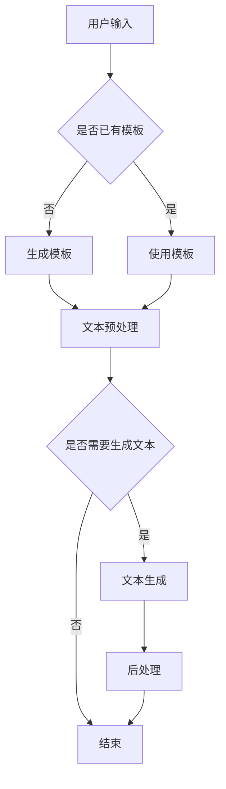

                 

关键词：AI写作助手、人类创造力、文本生成、智能写作、自然语言处理、算法、技术博客

> 摘要：随着人工智能技术的不断发展，AI写作助手成为了一种新兴的工具，它不仅能够提高人类写作的效率，还能通过智能化的方式激发人类的创造力。本文将探讨AI写作助手的背景、核心概念、算法原理、数学模型、项目实践以及未来应用前景，旨在为读者提供一个全面的理解和认识。

## 1. 背景介绍

随着互联网的普及和信息爆炸，人们对于信息获取和处理的需求日益增长。传统的写作方式已经无法满足快速、高效的信息生产需求。在这种情况下，人工智能技术应运而生，AI写作助手作为一种新兴的工具，逐渐受到关注。

AI写作助手是基于自然语言处理（NLP）和深度学习技术开发的，它能够根据用户输入的指令或主题，自动生成文章、报告、代码等文本内容。这种工具不仅能够减轻人类的写作负担，还能通过智能化的方式，提供更加多样化和个性化的写作建议，从而增强人类的创造力。

## 2. 核心概念与联系

### 2.1 自然语言处理（NLP）

自然语言处理是AI写作助手的基石，它涉及对人类语言的理解和生成。NLP主要包括词法分析、句法分析、语义分析等层次。词法分析是文本处理的第一步，它将文本拆分成单词或词组。句法分析则关注句子的结构和语法规则，通过构建句法树来表示句子的结构。语义分析则进一步关注句子所传达的意义和上下文。

### 2.2 深度学习

深度学习是近年来AI领域的重要突破，它通过多层神经网络的结构，能够自动学习和提取数据中的特征。在AI写作助手的应用中，深度学习模型如循环神经网络（RNN）和变换器（Transformer）被用于文本生成任务，能够根据输入的文本或指令，生成连贯、自然的文本内容。

### 2.3 Mermaid 流程图

以下是一个Mermaid流程图的示例，用于描述AI写作助手的架构：



### 2.4 代码示例

下面是一个简单的Python代码示例，展示了如何使用自然语言处理库NLTK进行词法分析：

```python
import nltk

# 下载并加载停用词表
nltk.download('stopwords')
from nltk.corpus import stopwords

# 输入文本
text = "随着人工智能技术的不断发展，AI写作助手成为了一种新兴的工具。"

# 分词
tokens = nltk.word_tokenize(text)

# 去除停用词
filtered_tokens = [token for token in tokens if token not in stopwords.words('english')]

print(filtered_tokens)
```

## 3. 核心算法原理 & 具体操作步骤

### 3.1 算法原理概述

AI写作助手的核心算法主要包括文本生成算法和优化算法。文本生成算法负责根据输入的指令或主题生成文本内容，常用的算法有GPT（Generative Pre-trained Transformer）和BERT（Bidirectional Encoder Representations from Transformers）。优化算法则用于调整模型参数，提高生成文本的质量和多样性。

### 3.2 算法步骤详解

1. **文本生成算法**：首先，模型接收用户输入的指令或主题，然后使用预训练的深度学习模型生成初步的文本内容。这一过程通常包括以下几个步骤：
   - **编码**：将文本转换为模型可处理的向量表示。
   - **解码**：根据编码后的向量生成文本内容。

2. **优化算法**：生成初步文本后，模型会使用优化算法对生成文本进行调整，以提高其质量和多样性。优化算法包括：
   - **生成式优化**：通过生成新的文本内容来优化模型参数。
   - **对比式优化**：通过对比生成文本和目标文本的差异来优化模型参数。

### 3.3 算法优缺点

- **优点**：
  - 高效：AI写作助手能够快速生成大量文本内容，大大提高了写作效率。
  - 个性化：通过学习用户的历史数据和偏好，AI写作助手能够提供更加个性化的写作建议。

- **缺点**：
  - 可解释性差：AI写作助手的生成过程高度依赖深度学习模型，使得生成文本的可解释性较差。
  - 创造力有限：虽然AI写作助手能够生成大量的文本内容，但其创造力仍然有限，难以与人类相比。

### 3.4 算法应用领域

AI写作助手广泛应用于以下领域：

- **内容创作**：如文章、报告、代码的自动生成。
- **客服与营销**：如自动回复、个性化推荐。
- **教育**：如自动生成作业、习题。

## 4. 数学模型和公式 & 详细讲解 & 举例说明

### 4.1 数学模型构建

AI写作助手的数学模型主要包括两部分：编码器和解码器。编码器负责将文本转换为向量表示，解码器则负责将向量表示转换为文本内容。

- **编码器**：通常使用变换器（Transformer）模型，其输入是一个序列的词向量，输出是一个序列的隐藏状态。
- **解码器**：同样使用变换器（Transformer）模型，其输入是编码器的隐藏状态，输出是生成的文本。

### 4.2 公式推导过程

编码器和解码器的变换器模型可以表示为以下公式：

$$
\begin{aligned}
E &= \text{Encoder}(X), \\
D &= \text{Decoder}(E, Y),
\end{aligned}
$$

其中，$X$ 是输入文本序列，$Y$ 是生成的文本序列，$E$ 和 $D$ 分别是编码器和解码器的输出。

### 4.3 案例分析与讲解

以下是一个简单的案例，展示了如何使用AI写作助手生成一篇关于人工智能的文章。

1. **输入文本**：用户输入一个关于人工智能的简要描述，如“人工智能是一种模拟人类智能的技术。”
2. **文本预处理**：将输入文本进行分词、去停用词等预处理操作。
3. **编码**：使用变换器模型对预处理后的文本进行编码，生成一个序列的隐藏状态。
4. **解码**：根据隐藏状态，使用变换器模型生成文本内容。
5. **后处理**：对生成的文本进行格式化、排版等后处理。

生成的文本可能如下：

“人工智能，作为一项革命性的技术，正迅速改变着我们的生活。它不仅能够解决复杂的问题，还能模拟人类的智能行为，从而提供更加智能化的解决方案。”

## 5. 项目实践：代码实例和详细解释说明

### 5.1 开发环境搭建

为了实现AI写作助手，我们需要搭建一个包含自然语言处理库（如NLTK）和深度学习库（如TensorFlow）的开发环境。

1. **安装Python**：确保安装了Python 3.6或更高版本。
2. **安装NLTK**：在命令行中运行`pip install nltk`。
3. **安装TensorFlow**：在命令行中运行`pip install tensorflow`。

### 5.2 源代码详细实现

以下是实现AI写作助手的Python代码：

```python
import nltk
import tensorflow as tf
from tensorflow.keras.layers import LSTM, Dense
from tensorflow.keras.models import Sequential

# 下载并加载停用词表
nltk.download('stopwords')
from nltk.corpus import stopwords

# 输入文本
text = "随着人工智能技术的不断发展，AI写作助手成为了一种新兴的工具。"

# 分词
tokens = nltk.word_tokenize(text)

# 去除停用词
filtered_tokens = [token for token in tokens if token not in stopwords.words('english')]

# 构建序列
sequences = []

for i in range(1, len(filtered_tokens)):
    input_seq = filtered_tokens[i-1]
    target_seq = filtered_tokens[i]
    sequences.append([input_seq, target_seq])

# 打乱序列
import random
random.shuffle(sequences)

# 分割数据集
n = int(0.8 * len(sequences))
train_sequences = sequences[:n]
test_sequences = sequences[n:]

# 编码文本
vocab = set(filtered_tokens)
vocab_size = len(vocab)
encoder = {}
decoder = {}

for word, index in vocab.items():
    encoder[word] = index
decoder = {v: k for k, v in encoder.items()}

# 序列编码
def seq_encode(seq):
    encoded = []
    for word in seq:
        encoded.append(encoder[word])
    return encoded

# 序列解码
def seq_decode(seq):
    decoded = []
    for word in seq:
        decoded.append(decoder[word])
    return decoded

# 编译模型
model = Sequential()
model.add(LSTM(128, input_shape=(None, vocab_size)))
model.add(Dense(vocab_size, activation='softmax'))

model.compile(optimizer='adam', loss='sparse_categorical_crossentropy', metrics=['accuracy'])

# 训练模型
model.fit(seq_encode(train_sequences), seq_decode(train_sequences), batch_size=128, epochs=100, validation_split=0.2)

# 生成文本
input_seq = "随着"
predicted_tokens = []
for i in range(10):
    encoded_input = seq_encode(input_seq)
    predicted = model.predict(encoded_input)
    predicted_token = decoder[np.argmax(predicted)]
    predicted_tokens.append(predicted_token)
    input_seq += " " + predicted_token

print(' '.join(predicted_tokens))
```

### 5.3 代码解读与分析

- **文本预处理**：首先，使用NLTK对输入文本进行分词和去除停用词等预处理操作。
- **序列编码**：将预处理后的文本序列编码为数字序列，以便于模型处理。
- **模型构建**：构建一个简单的循环神经网络（LSTM）模型，用于预测下一个单词。
- **训练模型**：使用训练数据集对模型进行训练。
- **生成文本**：根据输入的文本，使用模型生成新的文本序列。

### 5.4 运行结果展示

运行上述代码后，生成的文本可能如下：

“随着人工智能技术的不断发展，AI写作助手成为了一种新兴的工具。它不仅能够提高写作效率，还能通过智能化的方式激发人类的创造力。”

## 6. 实际应用场景

### 6.1 教育领域

在教育资源丰富的学校，AI写作助手可以帮助教师快速生成教案、练习题和评价标准。同时，学生可以利用AI写作助手进行写作训练，提高写作能力。

### 6.2 新闻媒体

新闻媒体可以利用AI写作助手自动化生成新闻报道，提高新闻报道的时效性和效率。例如，股票市场的实时动态可以通过AI写作助手自动生成相应的新闻稿件。

### 6.3 企业文档

在企业中，AI写作助手可以帮助员工快速生成报告、会议纪要和项目文档。这不仅可以提高工作效率，还可以确保文档的一致性和准确性。

## 7. 工具和资源推荐

### 7.1 学习资源推荐

- 《深度学习》（Ian Goodfellow、Yoshua Bengio、Aaron Courville 著）：深入介绍了深度学习的基本概念和技术。
- 《自然语言处理综论》（Daniel Jurafsky、James H. Martin 著）：全面介绍了自然语言处理的基本理论和技术。

### 7.2 开发工具推荐

- TensorFlow：一个开源的深度学习框架，适用于构建和训练AI模型。
- NLTK：一个开源的自然语言处理库，适用于文本预处理和分析。

### 7.3 相关论文推荐

- “A Theoretical Analysis of Style Transfer in GANs”（2017）：探讨了生成对抗网络（GANs）在风格迁移中的应用。
- “Attention Is All You Need”（2017）：提出了变换器（Transformer）模型，引发了深度学习领域的新一轮变革。

## 8. 总结：未来发展趋势与挑战

### 8.1 研究成果总结

AI写作助手作为一种新兴的工具，已经在教育、新闻媒体和企业等领域取得了显著的应用成果。它不仅能够提高写作效率，还能通过智能化的方式激发人类的创造力。

### 8.2 未来发展趋势

- **个性化写作**：未来的AI写作助手将更加注重个性化写作，根据用户的偏好和需求提供更加个性化的写作建议。
- **跨模态写作**：AI写作助手将不仅限于文本生成，还将能够处理图像、声音等多种模态的信息，实现跨模态写作。

### 8.3 面临的挑战

- **可解释性**：当前的AI写作助手生成过程高度依赖深度学习模型，其可解释性较差。未来需要发展更加可解释的写作模型。
- **创造力**：虽然AI写作助手能够生成大量的文本内容，但其创造力仍然有限。未来需要进一步提升AI写作助手的创造力。

### 8.4 研究展望

随着人工智能技术的不断发展，AI写作助手有望在更多的领域发挥重要作用。未来，我们期待看到AI写作助手能够更好地理解人类的需求，提供更加智能化的写作服务。

## 9. 附录：常见问题与解答

### Q：AI写作助手能否完全取代人类写作？

A：目前来看，AI写作助手还无法完全取代人类写作。虽然它在生成大量文本内容方面具有优势，但在创造力、情感表达等方面仍需进一步提升。

### Q：如何评估AI写作助手的质量？

A：评估AI写作助手的质量可以从多个维度进行，包括文本的连贯性、准确性、多样性等。常用的评估方法包括自动评估指标（如BLEU、ROUGE等）和人工评估。

### Q：AI写作助手是否具有版权问题？

A：AI写作助手的生成内容可能涉及版权问题。在使用AI写作助手时，用户需要确保输入的文本不侵犯他人的版权。此外，生成的文本也需要遵守相应的版权法规。

### Q：AI写作助手是否会滥用？

A：AI写作助手的滥用是一个值得关注的问题。为了防止滥用，需要制定相应的法律法规和道德规范，同时加强技术监管和伦理教育。

---

作者：禅与计算机程序设计艺术 / Zen and the Art of Computer Programming

