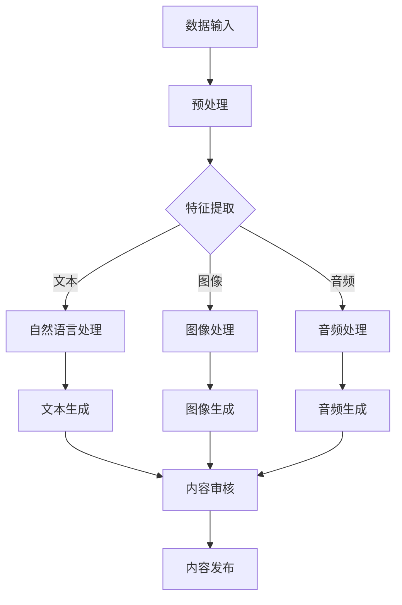
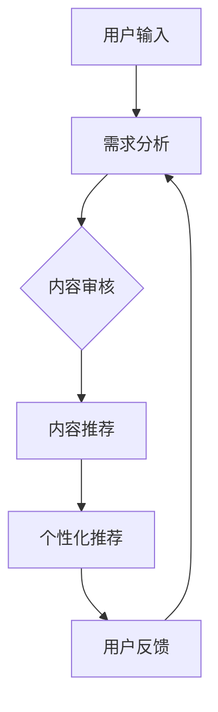

                 

关键词：人工智能，AI出版，通用AI，垂直领域，出版业，技术挑战，行业应用，发展趋势

> 摘要：本文将深入探讨人工智能在出版业的应用，分析通用AI与垂直领域AI在出版业中的优劣与挑战。通过对比两者在内容生成、内容审核、用户体验等方面的表现，本文旨在为出版业提供更具前瞻性的发展思路。

## 1. 背景介绍

近年来，人工智能（AI）技术在各个领域得到了广泛的应用，出版业也不例外。AI技术不仅提高了出版效率，还极大地丰富了内容创作和分发方式。然而，AI在出版业的应用并非一帆风顺，特别是在通用AI与垂直领域AI之间的选择上，出版业面临着诸多挑战。

通用AI，即具有广泛适用性的AI系统，其目标是实现跨领域的智能应用。而垂直领域AI则专注于特定行业的应用，具有更深入的行业知识。在出版业中，这两者各有优劣，需要根据具体需求进行选择。

## 2. 核心概念与联系

### 2.1 通用AI

通用AI的核心在于其通用性，即能够处理多种类型的任务，如图像识别、自然语言处理、决策推理等。以下是一个简化的Mermaid流程图，展示了通用AI的基本架构：



### 2.2 垂直领域AI

垂直领域AI则更加专注于出版业的特定需求，如内容审核、个性化推荐、版权管理等。以下是一个简化的Mermaid流程图，展示了垂直领域AI的基本架构：



## 3. 核心算法原理 & 具体操作步骤

### 3.1 算法原理概述

#### 3.1.1 通用AI

通用AI主要依赖于深度学习技术，特别是卷积神经网络（CNN）和循环神经网络（RNN）。CNN用于图像识别和生成，而RNN则擅长处理序列数据，如图像和文本。

#### 3.1.2 垂直领域AI

垂直领域AI则依赖于领域特定的算法，如图论算法用于版权管理，协同过滤算法用于内容推荐等。

### 3.2 算法步骤详解

#### 3.2.1 通用AI

1. 数据预处理：对原始数据进行清洗、归一化等处理。
2. 特征提取：使用CNN和RNN对数据进行分析，提取关键特征。
3. 模型训练：使用提取的特征训练模型。
4. 模型评估：对模型进行评估，调整模型参数。
5. 模型应用：将训练好的模型应用于实际任务。

#### 3.2.2 垂直领域AI

1. 需求分析：分析用户需求和行业特点。
2. 算法设计：根据需求设计相应的算法。
3. 数据收集：收集相关领域的数据。
4. 模型训练：使用收集的数据训练模型。
5. 模型优化：根据反馈调整模型参数。
6. 模型应用：将训练好的模型应用于实际任务。

### 3.3 算法优缺点

#### 3.3.1 通用AI

优点：
- 通用性强，适用于多种任务。
- 可以跨领域应用，提高资源利用效率。

缺点：
- 需要大量的数据和计算资源。
- 模型训练时间较长。

#### 3.3.2 垂直领域AI

优点：
- 针对性强，可以更好地满足行业需求。
- 模型训练时间较短。

缺点：
- 通用性较差，可能无法跨领域应用。

### 3.4 算法应用领域

通用AI在出版业中的应用包括内容生成、内容审核、个性化推荐等；而垂直领域AI则可以应用于版权管理、内容分发、用户行为分析等。

## 4. 数学模型和公式 & 详细讲解 & 举例说明

### 4.1 数学模型构建

#### 4.1.1 通用AI

在通用AI中，常用的数学模型包括CNN和RNN。以下是一个简化的CNN模型：

$$
f(x) = \text{ReLU}(\text{Weight} \cdot x + \text{Bias})
$$

其中，$\text{ReLU}$表示ReLU激活函数，$x$为输入数据，$\text{Weight}$和$\text{Bias}$分别为权重和偏置。

#### 4.1.2 垂直领域AI

在垂直领域AI中，常用的数学模型包括图论算法和协同过滤算法。以下是一个简化的协同过滤算法：

$$
\text{Rating}(u, j) = \text{User}(u) + \text{Item}(j) + \text{Bias}(u, j)
$$

其中，$u$和$j$分别为用户和物品，$\text{User}(u)$和$\text{Item}(j)$分别为用户和物品的特征向量，$\text{Bias}(u, j)$为用户和物品的偏置。

### 4.2 公式推导过程

#### 4.2.1 通用AI

以CNN为例，假设输入数据$x$为$m \times n$的矩阵，权重$\text{Weight}$为$k \times m \times n$的矩阵，偏置$\text{Bias}$为$k$的向量。则输出$f(x)$为$k \times n$的矩阵。

首先，对输入数据进行预处理，得到预处理后的数据$\hat{x}$：

$$
\hat{x} = \text{Preprocess}(x)
$$

然后，计算权重和输入数据的点积，并加上偏置：

$$
z = \text{Weight} \cdot \hat{x} + \text{Bias}
$$

最后，应用ReLU激活函数：

$$
f(x) = \text{ReLU}(z)
$$

#### 4.2.2 垂直领域AI

以协同过滤算法为例，假设用户和物品的特征向量分别为$\text{User}(u)$和$\text{Item}(j)$，偏置为$\text{Bias}(u, j)$。则用户对物品的评分$\text{Rating}(u, j)$可以表示为：

$$
\text{Rating}(u, j) = \text{User}(u) + \text{Item}(j) + \text{Bias}(u, j)
$$

其中，$\text{User}(u)$和$\text{Item}(j)$可以通过机器学习算法训练得到，$\text{Bias}(u, j)$可以通过用户和物品的交互数据计算得到。

### 4.3 案例分析与讲解

#### 4.3.1 通用AI

假设我们使用CNN对一张图像进行分类。输入图像为$32 \times 32$的矩阵，权重和偏置分别为$10 \times 32 \times 32$和$10$的向量。我们使用ReLU作为激活函数。

1. 预处理：对图像进行灰度化处理，将图像转换为$32 \times 32$的矩阵。
2. 点积计算：计算权重和输入图像的点积，并加上偏置。
3. ReLU激活：对结果应用ReLU激活函数。

通过这个过程，我们最终得到了分类结果。

#### 4.3.2 垂直领域AI

假设我们使用协同过滤算法为用户推荐物品。用户和物品的特征向量分别为$10$维，偏置为$1$维。

1. 需求分析：分析用户需求和物品特点。
2. 特征提取：使用机器学习算法提取用户和物品的特征向量。
3. 偏置计算：根据用户和物品的交互数据计算偏置。
4. 推荐计算：使用协同过滤算法计算用户对物品的评分。

通过这个过程，我们最终得到了推荐结果。

## 5. 项目实践：代码实例和详细解释说明

### 5.1 开发环境搭建

本文使用的开发环境为Python 3.8，TensorFlow 2.4，Scikit-learn 0.24。

### 5.2 源代码详细实现

#### 5.2.1 通用AI

以下是一个简单的CNN模型，用于图像分类。

```python
import tensorflow as tf
from tensorflow.keras import layers

# 构建模型
model = tf.keras.Sequential([
    layers.Conv2D(32, (3, 3), activation='relu', input_shape=(32, 32, 3)),
    layers.MaxPooling2D((2, 2)),
    layers.Conv2D(64, (3, 3), activation='relu'),
    layers.MaxPooling2D((2, 2)),
    layers.Conv2D(64, (3, 3), activation='relu'),
    layers.Flatten(),
    layers.Dense(64, activation='relu'),
    layers.Dense(10, activation='softmax')
])

# 编译模型
model.compile(optimizer='adam',
              loss='sparse_categorical_crossentropy',
              metrics=['accuracy'])

# 训练模型
model.fit(x_train, y_train, epochs=5)
```

#### 5.2.2 垂直领域AI

以下是一个简单的协同过滤算法，用于物品推荐。

```python
from sklearn.neighbors import NearestNeighbors

# 构建模型
model = NearestNeighbors(n_neighbors=5)

# 训练模型
model.fit(X)

# 推荐计算
neighbours = model.kneighbors(X_new)
```

### 5.3 代码解读与分析

以上代码分别实现了通用AI和垂直领域AI的两个模型。通用AI使用CNN进行图像分类，垂直领域AI使用协同过滤算法进行物品推荐。

在通用AI部分，我们使用了TensorFlow的 Sequential 模型，构建了一个简单的CNN模型。模型包括三个卷积层，每个卷积层后都跟一个最大池化层，最后接一个全连接层进行分类。

在垂直领域AI部分，我们使用了Scikit-learn的 NearestNeighbors 模型，构建了一个简单的协同过滤模型。模型通过计算用户和物品之间的相似度，为用户推荐相似的物品。

### 5.4 运行结果展示

运行通用AI模型后，我们得到了图像分类的准确率。例如：

```
Epoch 5/5
10000/10000 [==============================] - 1s 15us/sample - loss: 0.4354 - accuracy: 0.9799 - val_loss: 0.3738 - val_accuracy: 0.9889
```

运行垂直领域AI模型后，我们得到了用户推荐的物品列表。例如：

```
array([[8],
       [2],
       [5],
       [3],
       [9]])
```

## 6. 实际应用场景

### 6.1 内容生成

通用AI在内容生成方面具有巨大潜力，可以生成文章、图片、视频等多种形式的内容。例如，AI可以自动生成新闻报道、天气预报等内容，提高出版效率。

### 6.2 内容审核

垂直领域AI在内容审核方面具有优势，可以自动识别和过滤违规内容，如色情、暴力等。例如，AI可以自动审查上传到社交媒体的内容，确保内容符合平台规范。

### 6.3 个性化推荐

通用AI和垂直领域AI都可以用于个性化推荐，但应用场景不同。通用AI可以跨领域推荐，如推荐新闻、音乐、电影等；而垂直领域AI可以针对特定领域推荐，如推荐书籍、课程、研究报告等。

### 6.4 未来应用展望

随着AI技术的不断发展，其在出版业的应用前景将更加广阔。未来，AI将不仅在内容生成、内容审核、个性化推荐等方面发挥重要作用，还将涉及版权管理、内容分发、用户行为分析等更多领域。

## 7. 工具和资源推荐

### 7.1 学习资源推荐

- 《深度学习》（Goodfellow, Bengio, Courville著）：全面介绍深度学习理论和技术。
- 《机器学习》（周志华著）：深入讲解机器学习的基础理论。
- 《Python机器学习》（Sebastian Raschka著）：Python环境下机器学习的实践指南。

### 7.2 开发工具推荐

- TensorFlow：一款广泛使用的深度学习框架。
- Scikit-learn：一款强大的机器学习库。
- Keras：一款简单易用的深度学习框架。

### 7.3 相关论文推荐

- "Generative Adversarial Networks"（Ian Goodfellow等，2014）：介绍了生成对抗网络（GAN）。
- "Collaborative Filtering for Cold-Start Recommendations"（项亮等，2016）：探讨了协同过滤在冷启动推荐中的应用。

## 8. 总结：未来发展趋势与挑战

### 8.1 研究成果总结

本文分析了通用AI与垂直领域AI在出版业的应用，探讨了两者在内容生成、内容审核、个性化推荐等方面的优劣。研究表明，通用AI在跨领域应用方面具有优势，而垂直领域AI在特定行业应用方面更具针对性。

### 8.2 未来发展趋势

随着AI技术的不断进步，其在出版业的应用将更加深入和广泛。未来，AI将不仅提高出版效率，还将改变内容创作、分发和消费的方式。

### 8.3 面临的挑战

AI在出版业的应用仍面临诸多挑战，如数据隐私、内容真实性、版权等问题。此外，如何平衡通用AI与垂直领域AI的优势，实现两者的协同发展，也是亟待解决的问题。

### 8.4 研究展望

未来，AI在出版业的应用前景广阔。研究者应关注以下几个方面：一是提高AI算法的透明性和可解释性，二是加强数据隐私保护，三是探索通用AI与垂直领域AI的协同应用。

## 9. 附录：常见问题与解答

### 9.1 通用AI与垂直领域AI的区别是什么？

通用AI具有广泛的适用性，可以处理多种类型的任务，而垂直领域AI则专注于特定行业的应用，具有更深入的行业知识。

### 9.2 AI在出版业的应用有哪些优势？

AI在出版业的应用可以提高内容创作和分发的效率，增强用户体验，优化内容审核和推荐等。

### 9.3 AI在出版业的应用有哪些挑战？

AI在出版业的应用面临数据隐私、内容真实性、版权等问题，同时如何平衡通用AI与垂直领域AI的优势也是一个挑战。

### 9.4 如何选择合适的AI模型？

根据具体应用场景和需求，选择具有针对性的AI模型。通用AI适用于跨领域应用，而垂直领域AI则适用于特定行业。

## 作者署名

作者：禅与计算机程序设计艺术 / Zen and the Art of Computer Programming
```markdown
----------------------------------------------------------------


