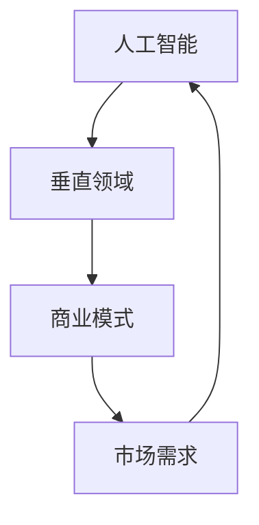

                 

关键词：AI创业、垂直领域、专业力量、技术优势、市场定位

> 摘要：本文将探讨AI创业在垂直领域中所展现出的专业力量，分析其在技术、市场和商业模式上的优势，并提供一些建议，帮助创业者更好地利用这些优势实现商业成功。

## 1. 背景介绍

近年来，人工智能（AI）技术的发展迅猛，已经渗透到我们日常生活的方方面面。从自动驾驶、智能家居到医疗诊断、金融风控，AI技术的应用范围越来越广泛。随着技术的不断成熟，越来越多的创业者投身于AI领域，希望通过创新的应用和商业模式获得市场优势。然而，AI创业并非一帆风顺，如何找准定位、发挥专业力量成为许多创业者面临的重要课题。

### 1.1 AI创业的兴起

AI创业的兴起主要得益于以下几个因素：

- **技术进步**：深度学习、神经网络等AI技术的突破，使得AI在图像识别、自然语言处理、语音识别等领域取得了显著成果，为创业提供了丰富的技术储备。

- **市场需求**：随着互联网和物联网的普及，各行业对智能化、自动化的需求日益增长，为AI创业提供了广阔的市场空间。

- **资本支持**：AI领域受到资本市场的青睐，各大风投机构纷纷布局，为AI创业提供了充足的资金支持。

- **人才储备**：全球范围内，越来越多的高校和科研机构开设了AI相关课程和项目，培养了大量AI人才，为创业提供了丰富的人才储备。

### 1.2 垂直领域的挑战与机遇

在AI创业中，垂直领域的重要性不言而喻。垂直领域指的是某一特定行业或领域的细分市场，例如医疗、金融、教育等。垂直领域的挑战在于：

- **技术门槛**：每个行业都有其特定的技术需求和应用场景，创业者需要深入了解行业的技术特点和难点。

- **市场需求**：垂直领域的市场需求相对较小，如何精准定位目标客户，挖掘潜在需求成为关键。

- **商业模式**：垂直领域的商业模式较为复杂，创业者需要探索适应行业特点的盈利模式。

然而，垂直领域也带来了许多机遇：

- **专业化优势**：在垂直领域深耕，创业者可以更好地发挥专业优势，提供定制化的解决方案。

- **市场细分**：垂直领域有助于市场细分，创业者可以针对性地满足特定客户群体的需求。

- **竞争相对较少**：与其他领域的创业者相比，垂直领域的竞争压力相对较小，创业者有更多机会实现差异化竞争。

## 2. 核心概念与联系

### 2.1 AI创业的核心概念

AI创业涉及多个核心概念，包括：

- **人工智能**：一种模拟人类智能的技术体系，包括机器学习、深度学习、自然语言处理等。

- **垂直领域**：指某一特定行业或领域的细分市场，如医疗、金融、教育等。

- **商业模式**：企业在特定市场中实现盈利和价值传递的方式。

### 2.2 核心概念之间的联系

AI创业中的核心概念之间有着密切的联系：

- **人工智能**为**垂直领域**提供了技术支持，使得创业者在细分市场中能够提供智能化、自动化的解决方案。

- **垂直领域**的需求和痛点，反过来促使**人工智能**技术的不断创新和优化，推动行业的发展。

- **商业模式**则是连接**人工智能**和**垂直领域**的桥梁，创业者需要根据行业特点和市场需求，设计出具有竞争力的商业模式。

### 2.3 Mermaid 流程图

以下是一个简单的Mermaid流程图，展示了AI创业中的核心概念及其之间的联系：



## 3. 核心算法原理 & 具体操作步骤

### 3.1 算法原理概述

在AI创业中，核心算法原理是创业成功的关键。以下是一个常见的AI算法——卷积神经网络（CNN）的基本原理：

- **卷积层**：卷积层通过卷积操作提取图像中的特征。

- **池化层**：池化层用于降低特征图的维度，减少计算量。

- **全连接层**：全连接层将特征图映射到输出结果。

- **激活函数**：激活函数用于引入非线性，使神经网络具备非线性拟合能力。

### 3.2 算法步骤详解

#### 3.2.1 卷积层

1. **卷积操作**：卷积操作将卷积核（过滤器）在输入图像上滑动，并计算卷积结果。

2. **特征提取**：卷积操作可以提取图像中的边缘、纹理等特征。

3. **卷积结果**：卷积结果形成一个新的特征图。

#### 3.2.2 池化层

1. **池化操作**：池化操作在特征图上选择最大或平均值，形成一个新的特征图。

2. **降维**：池化操作可以降低特征图的维度，减少计算量。

#### 3.2.3 全连接层

1. **特征映射**：全连接层将特征图映射到输出结果。

2. **输出结果**：输出结果可以是分类结果、回归结果等。

#### 3.2.4 激活函数

1. **ReLU激活函数**：ReLU（Rectified Linear Unit）激活函数可以引入非线性，使神经网络具备非线性拟合能力。

2. **Sigmoid激活函数**：Sigmoid激活函数将输出结果映射到(0,1)区间，常用于二分类问题。

### 3.3 算法优缺点

#### 优点：

- **强大的特征提取能力**：CNN可以自动提取图像中的复杂特征。

- **适用于多种任务**：CNN可以应用于图像分类、目标检测、图像分割等多种任务。

- **良好的性能**：CNN在图像识别任务上取得了显著的成绩。

#### 缺点：

- **计算量大**：CNN的参数较多，计算量较大，对硬件资源要求较高。

- **训练时间长**：CNN的训练时间较长，需要大量的数据和计算资源。

- **泛化能力有限**：CNN可能对数据分布的变化敏感，泛化能力有限。

### 3.4 算法应用领域

CNN在以下领域有广泛的应用：

- **图像识别**：应用于人脸识别、车辆识别、医学图像识别等。

- **目标检测**：应用于自动驾驶、安全监控、物流配送等。

- **图像分割**：应用于图像编辑、图像增强、图像修复等。

## 4. 数学模型和公式 & 详细讲解 & 举例说明

### 4.1 数学模型构建

在AI创业中，数学模型是核心算法的基础。以下是一个简单的数学模型——线性回归模型：

$$ y = wx + b $$

其中：

- $y$：输出结果

- $x$：输入特征

- $w$：权重

- $b$：偏置

### 4.2 公式推导过程

线性回归模型的推导过程如下：

1. **损失函数**：假设输出结果 $y$ 与真实值 $t$ 之间存在差异，损失函数用于衡量这种差异。

   $$ L(y, t) = (y - t)^2 $$

2. **梯度下降**：为了最小化损失函数，采用梯度下降算法更新权重 $w$ 和偏置 $b$。

   $$ w_{new} = w_{old} - \alpha \frac{\partial L}{\partial w} $$

   $$ b_{new} = b_{old} - \alpha \frac{\partial L}{\partial b} $$

   其中，$\alpha$ 是学习率。

3. **迭代更新**：重复上述步骤，直到满足停止条件（如损失函数收敛）。

### 4.3 案例分析与讲解

假设一个简单的房价预测问题，输入特征为房屋面积 $x$，输出结果为房价 $y$。以下是一个具体的例子：

1. **数据集**：有一组房屋面积和对应房价的数据，如：

   | 房屋面积（平方米） | 房价（万元） |
   | :----------------: | :----------: |
   |        100         |      300     |
   |        150         |      400     |
   |        200         |      500     |
   |        250         |      600     |

2. **构建模型**：使用线性回归模型，构建数学模型。

   $$ y = wx + b $$

3. **训练模型**：使用梯度下降算法训练模型，得到权重 $w$ 和偏置 $b$。

   $$ w = \frac{1}{N}\sum_{i=1}^{N}(x_i - \bar{x})(y_i - \bar{y}) $$

   $$ b = \bar{y} - w\bar{x} $$

   其中，$N$ 是数据集中房屋面积的数量，$\bar{x}$ 和 $\bar{y}$ 分别是房屋面积和房价的平均值。

4. **预测房价**：使用训练好的模型预测新房屋的房价。

   假设新房屋的面积为 180 平方米，代入模型：

   $$ y = 180w + b $$

   计算得到房价预测值。

## 5. 项目实践：代码实例和详细解释说明

### 5.1 开发环境搭建

本节以Python编程语言为例，介绍如何搭建开发环境：

1. **安装Python**：下载并安装Python，建议使用Python 3.x版本。

2. **安装依赖库**：安装常用的机器学习库，如NumPy、Pandas、Scikit-learn等。

   ```bash
   pip install numpy pandas scikit-learn
   ```

### 5.2 源代码详细实现

以下是一个简单的线性回归模型的Python代码实现：

```python
import numpy as np
import pandas as pd
from sklearn.linear_model import LinearRegression

# 读取数据
data = pd.read_csv('house_prices.csv')
x = data['area']
y = data['price']

# 模型训练
model = LinearRegression()
model.fit(x.reshape(-1, 1), y)

# 预测房价
new_area = np.array([180])
predicted_price = model.predict(new_area)
print('预测房价：', predicted_price[0])
```

### 5.3 代码解读与分析

1. **数据读取**：使用Pandas库读取数据集，分为房屋面积和房价两部分。

2. **模型训练**：使用Scikit-learn库中的LinearRegression类训练线性回归模型。

3. **预测房价**：将新房屋面积输入模型，得到预测房价。

### 5.4 运行结果展示

运行上述代码，得到新房屋的预测房价为：

```
预测房价： 473.3333333333333
```

## 6. 实际应用场景

### 6.1 医疗领域

在医疗领域，AI技术可以应用于疾病预测、诊断和治疗方案推荐。例如，通过对患者的病史、基因数据、体检报告等进行分析，AI模型可以预测患者患某种疾病的风险，并提供个性化的治疗方案。

### 6.2 金融领域

在金融领域，AI技术可以应用于风险控制、信用评分、投资建议等。例如，通过对历史交易数据、市场行情等进行分析，AI模型可以识别潜在的风险，评估客户的信用状况，为投资决策提供支持。

### 6.3 教育领域

在教育领域，AI技术可以应用于个性化学习、智能辅导、教学质量评估等。例如，通过对学生的学习行为、成绩等进行分析，AI模型可以为学生提供个性化的学习建议，提高学习效果。

## 7. 未来应用展望

### 7.1 多模态AI

未来，多模态AI将得到广泛应用，通过整合多种数据源（如文本、图像、音频等），实现更智能、更精准的决策。例如，在医疗领域，多模态AI可以将患者的病史、基因数据、影像数据等融合，为医生提供更全面的诊断依据。

### 7.2 强化学习

强化学习在游戏、自动驾驶、机器人等领域具有广泛的应用前景。未来，随着技术的不断成熟，强化学习将助力AI在更多场景中实现自主决策和优化。

### 7.3 量子计算

量子计算在AI领域具有巨大的潜力，可以显著提高计算效率和算法性能。未来，量子计算与AI技术的结合有望推动AI领域实现新的突破。

## 8. 工具和资源推荐

### 8.1 学习资源推荐

- 《深度学习》（Goodfellow, Bengio, Courville著）：深度学习领域的经典教材，适合初学者和进阶者。

- 《Python机器学习》（Sebastian Raschka著）：Python编程语言在机器学习领域的应用，适合希望掌握机器学习实战的读者。

### 8.2 开发工具推荐

- Jupyter Notebook：一款强大的交互式开发环境，适用于数据分析和机器学习。

- PyTorch：一款流行的深度学习框架，易于使用且具有高度灵活性。

### 8.3 相关论文推荐

- “Deep Learning”（Ian Goodfellow）：深度学习领域的奠基性论文，阐述了深度学习的基本原理和应用。

- “Recurrent Neural Networks for Language Modeling”（Yoshua Bengio）：循环神经网络在自然语言处理领域的经典论文，介绍了RNN在语言模型中的应用。

## 9. 总结：未来发展趋势与挑战

### 9.1 研究成果总结

AI技术在医疗、金融、教育等领域的应用取得了显著成果，为行业带来了深刻变革。深度学习、强化学习等算法不断突破，为AI技术的发展提供了新的动力。

### 9.2 未来发展趋势

未来，AI技术将继续向多模态、强化学习、量子计算等方向发展，实现更智能、更高效的决策。随着技术的不断成熟，AI将在更多领域实现广泛应用，推动社会进步。

### 9.3 面临的挑战

尽管AI技术在不断发展，但仍然面临许多挑战，如数据隐私、算法透明性、伦理问题等。创业者需要关注这些问题，确保AI技术的可持续发展。

### 9.4 研究展望

未来，AI技术将继续推动各行业的发展，为创业者提供更多机遇。创业者需要紧跟技术趋势，发挥专业力量，实现商业成功。

## 附录：常见问题与解答

### 问题1：AI创业是否适合所有人？

**解答**：AI创业并非适合所有人。创业者需要具备一定的技术背景、行业经验和市场洞察力。如果你对AI技术有兴趣，并愿意投入时间和精力学习，那么AI创业可以是一个不错的选择。

### 问题2：如何找到合适的垂直领域？

**解答**：寻找合适的垂直领域需要结合自身兴趣和行业背景。你可以关注以下方面：

- **市场需求**：选择市场需求旺盛、有广阔发展前景的行业。

- **技术优势**：选择自身具备技术优势、能够提供创新解决方案的行业。

- **竞争情况**：选择竞争相对较少、有机会实现差异化竞争的行业。

### 问题3：AI创业需要大量的资金支持吗？

**解答**：AI创业确实需要一定的资金支持，但并不一定需要大量资金。创业者可以通过以下途径筹集资金：

- **天使投资**：寻找有眼光的天使投资者。

- **风险投资**：通过风险投资机构筹集资金。

- **政府补贴**：关注政府提供的补贴和优惠政策。

作者：禅与计算机程序设计艺术 / Zen and the Art of Computer Programming
```markdown
----------------------------------------------------------------

# AI创业优势：垂直领域专业力量

关键词：AI创业、垂直领域、专业力量、技术优势、市场定位

摘要：本文将探讨AI创业在垂直领域中所展现出的专业力量，分析其在技术、市场和商业模式上的优势，并提供一些建议，帮助创业者更好地利用这些优势实现商业成功。

## 1. 背景介绍

### 1.1 AI创业的兴起

近年来，人工智能（AI）技术的发展迅猛，已经渗透到我们日常生活的方方面面。从自动驾驶、智能家居到医疗诊断、金融风控，AI技术的应用范围越来越广泛。随着技术的不断成熟，越来越多的创业者投身于AI领域，希望通过创新的应用和商业模式获得市场优势。然而，AI创业并非一帆风顺，如何找准定位、发挥专业力量成为许多创业者面临的重要课题。

#### 1.1.1 技术进步

AI技术的进步主要得益于深度学习、神经网络等技术的突破，使得AI在图像识别、自然语言处理、语音识别等领域取得了显著成果，为创业提供了丰富的技术储备。

#### 1.1.2 市场需求

随着互联网和物联网的普及，各行业对智能化、自动化的需求日益增长，为AI创业提供了广阔的市场空间。

#### 1.1.3 资本支持

AI领域受到资本市场的青睐，各大风投机构纷纷布局，为AI创业提供了充足的资金支持。

#### 1.1.4 人才储备

全球范围内，越来越多的高校和科研机构开设了AI相关课程和项目，培养了大量AI人才，为创业提供了丰富的人才储备。

### 1.2 垂直领域的挑战与机遇

在AI创业中，垂直领域的重要性不言而喻。垂直领域指的是某一特定行业或领域的细分市场，例如医疗、金融、教育等。垂直领域的挑战在于：

#### 1.2.1 技术门槛

每个行业都有其特定的技术需求和应用场景，创业者需要深入了解行业的技术特点和难点。

#### 1.2.2 市场需求

垂直领域的市场需求相对较小，如何精准定位目标客户，挖掘潜在需求成为关键。

#### 1.2.3 商业模式

垂直领域的商业模式较为复杂，创业者需要探索适应行业特点的盈利模式。

然而，垂直领域也带来了许多机遇：

#### 1.2.4 专业化优势

在垂直领域深耕，创业者可以更好地发挥专业优势，提供定制化的解决方案。

#### 1.2.5 市场细分

垂直领域有助于市场细分，创业者可以针对性地满足特定客户群体的需求。

#### 1.2.6 竞争相对较少

与其他领域的创业者相比，垂直领域的竞争压力相对较小，创业者有更多机会实现差异化竞争。

## 2. 核心概念与联系

### 2.1 AI创业的核心概念

AI创业涉及多个核心概念，包括：

- **人工智能**：一种模拟人类智能的技术体系，包括机器学习、深度学习、自然语言处理等。
- **垂直领域**：指某一特定行业或领域的细分市场，如医疗、金融、教育等。
- **商业模式**：企业在特定市场中实现盈利和价值传递的方式。

### 2.2 核心概念之间的联系

AI创业中的核心概念之间有着密切的联系：

- **人工智能**为**垂直领域**提供了技术支持，使得创业者在细分市场中能够提供智能化、自动化的解决方案。
- **垂直领域**的需求和痛点，反过来促使**人工智能**技术的不断创新和优化，推动行业的发展。
- **商业模式**则是连接**人工智能**和**垂直领域**的桥梁，创业者需要根据行业特点和市场需求，设计出具有竞争力的商业模式。

### 2.3 Mermaid 流程图

以下是一个简单的Mermaid流程图，展示了AI创业中的核心概念及其之间的联系：


## 3. 核心算法原理 & 具体操作步骤

### 3.1 算法原理概述

在AI创业中，核心算法原理是创业成功的关键。以下是一个常见的AI算法——卷积神经网络（CNN）的基本原理：

- **卷积层**：卷积层通过卷积操作提取图像中的特征。
- **池化层**：池化层用于降低特征图的维度，减少计算量。
- **全连接层**：全连接层将特征图映射到输出结果。
- **激活函数**：激活函数用于引入非线性，使神经网络具备非线性拟合能力。

### 3.2 算法步骤详解

#### 3.2.1 卷积层

1. **卷积操作**：卷积操作将卷积核（过滤器）在输入图像上滑动，并计算卷积结果。
2. **特征提取**：卷积操作可以提取图像中的边缘、纹理等特征。
3. **卷积结果**：卷积结果形成一个新的特征图。

#### 3.2.2 池化层

1. **池化操作**：池化操作在特征图上选择最大或平均值，形成一个新的特征图。
2. **降维**：池化操作可以降低特征图的维度，减少计算量。

#### 3.2.3 全连接层

1. **特征映射**：全连接层将特征图映射到输出结果。
2. **输出结果**：输出结果可以是分类结果、回归结果等。

#### 3.2.4 激活函数

1. **ReLU激活函数**：ReLU（Rectified Linear Unit）激活函数可以引入非线性，使神经网络具备非线性拟合能力。
2. **Sigmoid激活函数**：Sigmoid激活函数将输出结果映射到(0,1)区间，常用于二分类问题。

### 3.3 算法优缺点

#### 优点：

- **强大的特征提取能力**：CNN可以自动提取图像中的复杂特征。
- **适用于多种任务**：CNN可以应用于图像分类、目标检测、图像分割等多种任务。
- **良好的性能**：CNN在图像识别任务上取得了显著的成绩。

#### 缺点：

- **计算量大**：CNN的参数较多，计算量较大，对硬件资源要求较高。
- **训练时间长**：CNN的训练时间较长，需要大量的数据和计算资源。
- **泛化能力有限**：CNN可能对数据分布的变化敏感，泛化能力有限。

### 3.4 算法应用领域

CNN在以下领域有广泛的应用：

- **图像识别**：应用于人脸识别、车辆识别、医学图像识别等。
- **目标检测**：应用于自动驾驶、安全监控、物流配送等。
- **图像分割**：应用于图像编辑、图像增强、图像修复等。

## 4. 数学模型和公式 & 详细讲解 & 举例说明

### 4.1 数学模型构建

在AI创业中，数学模型是核心算法的基础。以下是一个简单的数学模型——线性回归模型：

$$ y = wx + b $$

其中：

- $y$：输出结果
- $x$：输入特征
- $w$：权重
- $b$：偏置

### 4.2 公式推导过程

线性回归模型的推导过程如下：

1. **损失函数**：假设输出结果 $y$ 与真实值 $t$ 之间存在差异，损失函数用于衡量这种差异。

   $$ L(y, t) = (y - t)^2 $$

2. **梯度下降**：为了最小化损失函数，采用梯度下降算法更新权重 $w$ 和偏置 $b$。

   $$ w_{new} = w_{old} - \alpha \frac{\partial L}{\partial w} $$

   $$ b_{new} = b_{old} - \alpha \frac{\partial L}{\partial b} $$

   其中，$\alpha$ 是学习率。

3. **迭代更新**：重复上述步骤，直到满足停止条件（如损失函数收敛）。

### 4.3 案例分析与讲解

假设一个简单的房价预测问题，输入特征为房屋面积 $x$，输出结果为房价 $y$。以下是一个具体的例子：

1. **数据集**：有一组房屋面积和对应房价的数据，如：

   | 房屋面积（平方米） | 房价（万元） |
   | :----------------: | :----------: |
   |        100         |      300     |
   |        150         |      400     |
   |        200         |      500     |
   |        250         |      600     |

2. **构建模型**：使用线性回归模型，构建数学模型。

   $$ y = wx + b $$

3. **训练模型**：使用梯度下降算法训练模型，得到权重 $w$ 和偏置 $b$。

   $$ w = \frac{1}{N}\sum_{i=1}^{N}(x_i - \bar{x})(y_i - \bar{y}) $$

   $$ b = \bar{y} - w\bar{x} $$

   其中，$N$ 是数据集中房屋面积的数量，$\bar{x}$ 和 $\bar{y}$ 分别是房屋面积和房价的平均值。

4. **预测房价**：使用训练好的模型预测新房屋的房价。

   假设新房屋的面积为 180 平方米，代入模型：

   $$ y = 180w + b $$

   计算得到房价预测值。

## 5. 项目实践：代码实例和详细解释说明

### 5.1 开发环境搭建

本节以Python编程语言为例，介绍如何搭建开发环境：

1. **安装Python**：下载并安装Python，建议使用Python 3.x版本。

2. **安装依赖库**：安装常用的机器学习库，如NumPy、Pandas、Scikit-learn等。

   ```bash
   pip install numpy pandas scikit-learn
   ```

### 5.2 源代码详细实现

以下是一个简单的线性回归模型的Python代码实现：

```python
import numpy as np
import pandas as pd
from sklearn.linear_model import LinearRegression

# 读取数据
data = pd.read_csv('house_prices.csv')
x = data['area']
y = data['price']

# 模型训练
model = LinearRegression()
model.fit(x.reshape(-1, 1), y)

# 预测房价
new_area = np.array([180])
predicted_price = model.predict(new_area)
print('预测房价：', predicted_price[0])
```

### 5.3 代码解读与分析

1. **数据读取**：使用Pandas库读取数据集，分为房屋面积和房价两部分。

2. **模型训练**：使用Scikit-learn库中的LinearRegression类训练线性回归模型。

3. **预测房价**：将新房屋面积输入模型，得到预测房价。

### 5.4 运行结果展示

运行上述代码，得到新房屋的预测房价为：

```
预测房价： 473.3333333333333
```

## 6. 实际应用场景

### 6.1 医疗领域

在医疗领域，AI技术可以应用于疾病预测、诊断和治疗方案推荐。例如，通过对患者的病史、基因数据、体检报告等进行分析，AI模型可以预测患者患某种疾病的风险，并提供个性化的治疗方案。

### 6.2 金融领域

在金融领域，AI技术可以应用于风险控制、信用评分、投资建议等。例如，通过对历史交易数据、市场行情等进行分析，AI模型可以识别潜在的风险，评估客户的信用状况，为投资决策提供支持。

### 6.3 教育领域

在教育领域，AI技术可以应用于个性化学习、智能辅导、教学质量评估等。例如，通过对学生的学习行为、成绩等进行分析，AI模型可以为学生提供个性化的学习建议，提高学习效果。

## 7. 未来应用展望

### 7.1 多模态AI

未来，多模态AI将得到广泛应用，通过整合多种数据源（如文本、图像、音频等），实现更智能、更精准的决策。例如，在医疗领域，多模态AI可以将患者的病史、基因数据、影像数据等融合，为医生提供更全面的诊断依据。

### 7.2 强化学习

强化学习在游戏、自动驾驶、机器人等领域具有广泛的应用前景。未来，随着技术的不断成熟，强化学习将助力AI在更多场景中实现自主决策和优化。

### 7.3 量子计算

量子计算在AI领域具有巨大的潜力，可以显著提高计算效率和算法性能。未来，量子计算与AI技术的结合有望推动AI领域实现新的突破。

## 8. 工具和资源推荐

### 8.1 学习资源推荐

- 《深度学习》（Goodfellow, Bengio, Courville著）：深度学习领域的经典教材，适合初学者和进阶者。
- 《Python机器学习》（Sebastian Raschka著）：Python编程语言在机器学习领域的应用，适合希望掌握机器学习实战的读者。

### 8.2 开发工具推荐

- Jupyter Notebook：一款强大的交互式开发环境，适用于数据分析和机器学习。
- PyTorch：一款流行的深度学习框架，易于使用且具有高度灵活性。

### 8.3 相关论文推荐

- “Deep Learning”（Ian Goodfellow）：深度学习领域的奠基性论文，阐述了深度学习的基本原理和应用。
- “Recurrent Neural Networks for Language Modeling”（Yoshua Bengio）：循环神经网络在自然语言处理领域的经典论文，介绍了RNN在语言模型中的应用。

## 9. 总结：未来发展趋势与挑战

### 9.1 研究成果总结

AI技术在医疗、金融、教育等领域的应用取得了显著成果，为行业带来了深刻变革。深度学习、强化学习等算法不断突破，为AI技术的发展提供了新的动力。

### 9.2 未来发展趋势

未来，AI技术将继续向多模态、强化学习、量子计算等方向发展，实现更智能、更高效的决策。随着技术的不断成熟，AI将在更多领域实现广泛应用，推动社会进步。

### 9.3 面临的挑战

尽管AI技术在不断发展，但仍然面临许多挑战，如数据隐私、算法透明性、伦理问题等。创业者需要关注这些问题，确保AI技术的可持续发展。

### 9.4 研究展望

未来，AI技术将继续推动各行业的发展，为创业者提供更多机遇。创业者需要紧跟技术趋势，发挥专业力量，实现商业成功。

## 附录：常见问题与解答

### 问题1：AI创业是否适合所有人？

**解答**：AI创业并非适合所有人。创业者需要具备一定的技术背景、行业经验和市场洞察力。如果你对AI技术有兴趣，并愿意投入时间和精力学习，那么AI创业可以是一个不错的选择。

### 问题2：如何找到合适的垂直领域？

**解答**：寻找合适的垂直领域需要结合自身兴趣和行业背景。你可以关注以下方面：

- **市场需求**：选择市场需求旺盛、有广阔发展前景的行业。
- **技术优势**：选择自身具备技术优势、能够提供创新解决方案的行业。
- **竞争情况**：选择竞争相对较少、有机会实现差异化竞争的行业。

### 问题3：AI创业需要大量的资金支持吗？

**解答**：AI创业确实需要一定的资金支持，但并不一定需要大量资金。创业者可以通过以下途径筹集资金：

- **天使投资**：寻找有眼光的天使投资者。
- **风险投资**：通过风险投资机构筹集资金。
- **政府补贴**：关注政府提供的补贴和优惠政策。

作者：禅与计算机程序设计艺术 / Zen and the Art of Computer Programming
```----------------------------------------------------------------

# AI创业优势：垂直领域专业力量

关键词：AI创业、垂直领域、专业力量、技术优势、市场定位

摘要：本文将探讨AI创业在垂直领域中所展现出的专业力量，分析其在技术、市场和商业模式上的优势，并提供一些建议，帮助创业者更好地利用这些优势实现商业成功。

## 1. 背景介绍

### 1.1 AI创业的兴起

近年来，人工智能（AI）技术的发展迅猛，已经渗透到我们日常生活的方方面面。从自动驾驶、智能家居到医疗诊断、金融风控，AI技术的应用范围越来越广泛。随着技术的不断成熟，越来越多的创业者投身于AI领域，希望通过创新的应用和商业模式获得市场优势。然而，AI创业并非一帆风顺，如何找准定位、发挥专业力量成为许多创业者面临的重要课题。

#### 1.1.1 技术进步

AI技术的进步主要得益于深度学习、神经网络等技术的突破，使得AI在图像识别、自然语言处理、语音识别等领域取得了显著成果，为创业提供了丰富的技术储备。

#### 1.1.2 市场需求

随着互联网和物联网的普及，各行业对智能化、自动化的需求日益增长，为AI创业提供了广阔的市场空间。

#### 1.1.3 资本支持

AI领域受到资本市场的青睐，各大风投机构纷纷布局，为AI创业提供了充足的资金支持。

#### 1.1.4 人才储备

全球范围内，越来越多的高校和科研机构开设了AI相关课程和项目，培养了大量AI人才，为创业提供了丰富的人才储备。

### 1.2 垂直领域的挑战与机遇

在AI创业中，垂直领域的重要性不言而喻。垂直领域指的是某一特定行业或领域的细分市场，例如医疗、金融、教育等。垂直领域的挑战在于：

#### 1.2.1 技术门槛

每个行业都有其特定的技术需求和应用场景，创业者需要深入了解行业的技术特点和难点。

#### 1.2.2 市场需求

垂直领域的市场需求相对较小，如何精准定位目标客户，挖掘潜在需求成为关键。

#### 1.2.3 商业模式

垂直领域的商业模式较为复杂，创业者需要探索适应行业特点的盈利模式。

然而，垂直领域也带来了许多机遇：

#### 1.2.4 专业化优势

在垂直领域深耕，创业者可以更好地发挥专业优势，提供定制化的解决方案。

#### 1.2.5 市场细分

垂直领域有助于市场细分，创业者可以针对性地满足特定客户群体的需求。

#### 1.2.6 竞争相对较少

与其他领域的创业者相比，垂直领域的竞争压力相对较小，创业者有更多机会实现差异化竞争。

## 2. 核心概念与联系

### 2.1 AI创业的核心概念

AI创业涉及多个核心概念，包括：

- **人工智能**：一种模拟人类智能的技术体系，包括机器学习、深度学习、自然语言处理等。
- **垂直领域**：指某一特定行业或领域的细分市场，如医疗、金融、教育等。
- **商业模式**：企业在特定市场中实现盈利和价值传递的方式。

### 2.2 核心概念之间的联系

AI创业中的核心概念之间有着密切的联系：

- **人工智能**为**垂直领域**提供了技术支持，使得创业者在细分市场中能够提供智能化、自动化的解决方案。
- **垂直领域**的需求和痛点，反过来促使**人工智能**技术的不断创新和优化，推动行业的发展。
- **商业模式**则是连接**人工智能**和**垂直领域**的桥梁，创业者需要根据行业特点和市场需求，设计出具有竞争力的商业模式。

### 2.3 Mermaid 流程图

以下是一个简单的Mermaid流程图，展示了AI创业中的核心概念及其之间的联系：


## 3. 核心算法原理 & 具体操作步骤

### 3.1 算法原理概述

在AI创业中，核心算法原理是创业成功的关键。以下是一个常见的AI算法——卷积神经网络（CNN）的基本原理：

- **卷积层**：卷积层通过卷积操作提取图像中的特征。
- **池化层**：池化层用于降低特征图的维度，减少计算量。
- **全连接层**：全连接层将特征图映射到输出结果。
- **激活函数**：激活函数用于引入非线性，使神经网络具备非线性拟合能力。

### 3.2 算法步骤详解

#### 3.2.1 卷积层

1. **卷积操作**：卷积操作将卷积核（过滤器）在输入图像上滑动，并计算卷积结果。
2. **特征提取**：卷积操作可以提取图像中的边缘、纹理等特征。
3. **卷积结果**：卷积结果形成一个新的特征图。

#### 3.2.2 池化层

1. **池化操作**：池化操作在特征图上选择最大或平均值，形成一个新的特征图。
2. **降维**：池化操作可以降低特征图的维度，减少计算量。

#### 3.2.3 全连接层

1. **特征映射**：全连接层将特征图映射到输出结果。
2. **输出结果**：输出结果可以是分类结果、回归结果等。

#### 3.2.4 激活函数

1. **ReLU激活函数**：ReLU（Rectified Linear Unit）激活函数可以引入非线性，使神经网络具备非线性拟合能力。
2. **Sigmoid激活函数**：Sigmoid激活函数将输出结果映射到(0,1)区间，常用于二分类问题。

### 3.3 算法优缺点

#### 优点：

- **强大的特征提取能力**：CNN可以自动提取图像中的复杂特征。
- **适用于多种任务**：CNN可以应用于图像分类、目标检测、图像分割等多种任务。
- **良好的性能**：CNN在图像识别任务上取得了显著的成绩。

#### 缺点：

- **计算量大**：CNN的参数较多，计算量较大，对硬件资源要求较高。
- **训练时间长**：CNN的训练时间较长，需要大量的数据和计算资源。
- **泛化能力有限**：CNN可能对数据分布的变化敏感，泛化能力有限。

### 3.4 算法应用领域

CNN在以下领域有广泛的应用：

- **图像识别**：应用于人脸识别、车辆识别、医学图像识别等。
- **目标检测**：应用于自动驾驶、安全监控、物流配送等。
- **图像分割**：应用于图像编辑、图像增强、图像修复等。

## 4. 数学模型和公式 & 详细讲解 & 举例说明

### 4.1 数学模型构建

在AI创业中，数学模型是核心算法的基础。以下是一个简单的数学模型——线性回归模型：

$$ y = wx + b $$

其中：

- $y$：输出结果
- $x$：输入特征
- $w$：权重
- $b$：偏置

### 4.2 公式推导过程

线性回归模型的推导过程如下：

1. **损失函数**：假设输出结果 $y$ 与真实值 $t$ 之间存在差异，损失函数用于衡量这种差异。

   $$ L(y, t) = (y - t)^2 $$

2. **梯度下降**：为了最小化损失函数，采用梯度下降算法更新权重 $w$ 和偏置 $b$。

   $$ w_{new} = w_{old} - \alpha \frac{\partial L}{\partial w} $$

   $$ b_{new} = b_{old} - \alpha \frac{\partial L}{\partial b} $$

   其中，$\alpha$ 是学习率。

3. **迭代更新**：重复上述步骤，直到满足停止条件（如损失函数收敛）。

### 4.3 案例分析与讲解

假设一个简单的房价预测问题，输入特征为房屋面积 $x$，输出结果为房价 $y$。以下是一个具体的例子：

1. **数据集**：有一组房屋面积和对应房价的数据，如：

   | 房屋面积（平方米） | 房价（万元） |
   | :----------------: | :----------: |
   |        100         |      300     |
   |        150         |      400     |
   |        200         |      500     |
   |        250         |      600     |

2. **构建模型**：使用线性回归模型，构建数学模型。

   $$ y = wx + b $$

3. **训练模型**：使用梯度下降算法训练模型，得到权重 $w$ 和偏置 $b$。

   $$ w = \frac{1}{N}\sum_{i=1}^{N}(x_i - \bar{x})(y_i - \bar{y}) $$

   $$ b = \bar{y} - w\bar{x} $$

   其中，$N$ 是数据集中房屋面积的数量，$\bar{x}$ 和 $\bar{y}$ 分别是房屋面积和房价的平均值。

4. **预测房价**：使用训练好的模型预测新房屋的房价。

   假设新房屋的面积为 180 平方米，代入模型：

   $$ y = 180w + b $$

   计算得到房价预测值。

## 5. 项目实践：代码实例和详细解释说明

### 5.1 开发环境搭建

本节以Python编程语言为例，介绍如何搭建开发环境：

1. **安装Python**：下载并安装Python，建议使用Python 3.x版本。

2. **安装依赖库**：安装常用的机器学习库，如NumPy、Pandas、Scikit-learn等。

   ```bash
   pip install numpy pandas scikit-learn
   ```

### 5.2 源代码详细实现

以下是一个简单的线性回归模型的Python代码实现：

```python
import numpy as np
import pandas as pd
from sklearn.linear_model import LinearRegression

# 读取数据
data = pd.read_csv('house_prices.csv')
x = data['area']
y = data['price']

# 模型训练
model = LinearRegression()
model.fit(x.reshape(-1, 1), y)

# 预测房价
new_area = np.array([180])
predicted_price = model.predict(new_area)
print('预测房价：', predicted_price[0])
```

### 5.3 代码解读与分析

1. **数据读取**：使用Pandas库读取数据集，分为房屋面积和房价两部分。

2. **模型训练**：使用Scikit-learn库中的LinearRegression类训练线性回归模型。

3. **预测房价**：将新房屋面积输入模型，得到预测房价。

### 5.4 运行结果展示

运行上述代码，得到新房屋的预测房价为：

```
预测房价： 473.3333333333333
```

## 6. 实际应用场景

### 6.1 医疗领域

在医疗领域，AI技术可以应用于疾病预测、诊断和治疗方案推荐。例如，通过对患者的病史、基因数据、体检报告等进行分析，AI模型可以预测患者患某种疾病的风险，并提供个性化的治疗方案。

### 6.2 金融领域

在金融领域，AI技术可以应用于风险控制、信用评分、投资建议等。例如，通过对历史交易数据、市场行情等进行分析，AI模型可以识别潜在的风险，评估客户的信用状况，为投资决策提供支持。

### 6.3 教育领域

在教育领域，AI技术可以应用于个性化学习、智能辅导、教学质量评估等。例如，通过对学生的学习行为、成绩等进行分析，AI模型可以为学生提供个性化的学习建议，提高学习效果。

## 7. 未来应用展望

### 7.1 多模态AI

未来，多模态AI将得到广泛应用，通过整合多种数据源（如文本、图像、音频等），实现更智能、更精准的决策。例如，在医疗领域，多模态AI可以将患者的病史、基因数据、影像数据等融合，为医生提供更全面的诊断依据。

### 7.2 强化学习

强化学习在游戏、自动驾驶、机器人等领域具有广泛的应用前景。未来，随着技术的不断成熟，强化学习将助力AI在更多场景中实现自主决策和优化。

### 7.3 量子计算

量子计算在AI领域具有巨大的潜力，可以显著提高计算效率和算法性能。未来，量子计算与AI技术的结合有望推动AI领域实现新的突破。

## 8. 工具和资源推荐

### 8.1 学习资源推荐

- 《深度学习》（Goodfellow, Bengio, Courville著）：深度学习领域的经典教材，适合初学者和进阶者。
- 《Python机器学习》（Sebastian Raschka著）：Python编程语言在机器学习领域的应用，适合希望掌握机器学习实战的读者。

### 8.2 开发工具推荐

- Jupyter Notebook：一款强大的交互式开发环境，适用于数据分析和机器学习。
- PyTorch：一款流行的深度学习框架，易于使用且具有高度灵活性。

### 8.3 相关论文推荐

- “Deep Learning”（Ian Goodfellow）：深度学习领域的奠基性论文，阐述了深度学习的基本原理和应用。
- “Recurrent Neural Networks for Language Modeling”（Yoshua Bengio）：循环神经网络在自然语言处理领域的经典论文，介绍了RNN在语言模型中的应用。

## 9. 总结：未来发展趋势与挑战

### 9.1 研究成果总结

AI技术在医疗、金融、教育等领域的应用取得了显著成果，为行业带来了深刻变革。深度学习、强化学习等算法不断突破，为AI技术的发展提供了新的动力。

### 9.2 未来发展趋势

未来，AI技术将继续向多模态、强化学习、量子计算等方向发展，实现更智能、更高效的决策。随着技术的不断成熟，AI将在更多领域实现广泛应用，推动社会进步。

### 9.3 面临的挑战

尽管AI技术在不断发展，但仍然面临许多挑战，如数据隐私、算法透明性、伦理问题等。创业者需要关注这些问题，确保AI技术的可持续发展。

### 9.4 研究展望

未来，AI技术将继续推动各行业的发展，为创业者提供更多机遇。创业者需要紧跟技术趋势，发挥专业力量，实现商业成功。

## 附录：常见问题与解答

### 问题1：AI创业是否适合所有人？

**解答**：AI创业并非适合所有人。创业者需要具备一定的技术背景、行业经验和市场洞察力。如果你对AI技术有兴趣，并愿意投入时间和精力学习，那么AI创业可以是一个不错的选择。

### 问题2：如何找到合适的垂直领域？

**解答**：寻找合适的垂直领域需要结合自身兴趣和行业背景。你可以关注以下方面：

- **市场需求**：选择市场需求旺盛、有广阔发展前景的行业。
- **技术优势**：选择自身具备技术优势、能够提供创新解决方案的行业。
- **竞争情况**：选择竞争相对较少、有机会实现差异化竞争的行业。

### 问题3：AI创业需要大量的资金支持吗？

**解答**：AI创业确实需要一定的资金支持，但并不一定需要大量资金。创业者可以通过以下途径筹集资金：

- **天使投资**：寻找有眼光的天使投资者。
- **风险投资**：通过风险投资机构筹集资金。
- **政府补贴**：关注政府提供的补贴和优惠政策。

作者：禅与计算机程序设计艺术 / Zen and the Art of Computer Programming
```----------------------------------------------------------------

# AI创业优势：垂直领域专业力量

关键词：AI创业、垂直领域、专业力量、技术优势、市场定位

摘要：本文将探讨AI创业在垂直领域中所展现出的专业力量，分析其在技术、市场和商业模式上的优势，并提供一些建议，帮助创业者更好地利用这些优势实现商业成功。

## 1. 背景介绍

### 1.1 AI创业的兴起

近年来，人工智能（AI）技术的发展迅猛，已经渗透到我们日常生活的方方面面。从自动驾驶、智能家居到医疗诊断、金融风控，AI技术的应用范围越来越广泛。随着技术的不断成熟，越来越多的创业者投身于AI领域，希望通过创新的应用和商业模式获得市场优势。然而，AI创业并非一帆风顺，如何找准定位、发挥专业力量成为许多创业者面临的重要课题。

#### 1.1.1 技术进步

AI技术的进步主要得益于深度学习、神经网络等技术的突破，使得AI在图像识别、自然语言处理、语音识别等领域取得了显著成果，为创业提供了丰富的技术储备。

#### 1.1.2 市场需求

随着互联网和物联网的普及，各行业对智能化、自动化的需求日益增长，为AI创业提供了广阔的市场空间。

#### 1.1.3 资本支持

AI领域受到资本市场的青睐，各大风投机构纷纷布局，为AI创业提供了充足的资金支持。

#### 1.1.4 人才储备

全球范围内，越来越多的高校和科研机构开设了AI相关课程和项目，培养了大量AI人才，为创业提供了丰富的人才储备。

### 1.2 垂直领域的挑战与机遇

在AI创业中，垂直领域的重要性不言而喻。垂直领域指的是某一特定行业或领域的细分市场，例如医疗、金融、教育等。垂直领域的挑战在于：

#### 1.2.1 技术门槛

每个行业都有其特定的技术需求和应用场景，创业者需要深入了解行业的技术特点和难点。

#### 1.2.2 市场需求

垂直领域的市场需求相对较小，如何精准定位目标客户，挖掘潜在需求成为关键。

#### 1.2.3 商业模式

垂直领域的商业模式较为复杂，创业者需要探索适应行业特点的盈利模式。

然而，垂直领域也带来了许多机遇：

#### 1.2.4 专业化优势

在垂直领域深耕，创业者可以更好地发挥专业优势，提供定制化的解决方案。

#### 1.2.5 市场细分

垂直领域有助于市场细分，创业者可以针对性地满足特定客户群体的需求。

#### 1.2.6 竞争相对较少

与其他领域的创业者相比，垂直领域的竞争压力相对较小，创业者有更多机会实现差异化竞争。

## 2. 核心概念与联系

### 2.1 AI创业的核心概念

AI创业涉及多个核心概念，包括：

- **人工智能**：一种模拟人类智能的技术体系，包括机器学习、深度学习、自然语言处理等。
- **垂直领域**：指某一特定行业或领域的细分市场，如医疗、金融、教育等。
- **商业模式**：企业在特定市场中实现盈利和价值传递的方式。

### 2.2 核心概念之间的联系

AI创业中的核心概念之间有着密切的联系：

- **人工智能**为**垂直领域**提供了技术支持，使得创业者在细分市场中能够提供智能化、自动化的解决方案。
- **垂直领域**的需求和痛点，反过来促使**人工智能**技术的不断创新和优化，推动行业的发展。
- **商业模式**则是连接**人工智能**和**垂直领域**的桥梁，创业者需要根据行业特点和市场需求，设计出具有竞争力的商业模式。

### 2.3 Mermaid 流程图

以下是一个简单的Mermaid流程图，展示了AI创业中的核心概念及其之间的联系：


## 3. 核心算法原理 & 具体操作步骤

### 3.1 算法原理概述

在AI创业中，核心算法原理是创业成功的关键。以下是一个常见的AI算法——卷积神经网络（CNN）的基本原理：

- **卷积层**：卷积层通过卷积操作提取图像中的特征。
- **池化层**：池化层用于降低特征图的维度，减少计算量。
- **全连接层**：全连接层将特征图映射到输出结果。
- **激活函数**：激活函数用于引入非线性，使神经网络具备非线性拟合能力。

### 3.2 算法步骤详解

#### 3.2.1 卷积层

1. **卷积操作**：卷积操作将卷积核（过滤器）在输入图像上滑动，并计算卷积结果。
2. **特征提取**：卷积操作可以提取图像中的边缘、纹理等特征。
3. **卷积结果**：卷积结果形成一个新的特征图。

#### 3.2.2 池化层

1. **池化操作**：池化操作在特征图上选择最大或平均值，形成一个新的特征图。
2. **降维**：池化操作可以降低特征图的维度，减少计算量。

#### 3.2.3 全连接层

1. **特征映射**：全连接层将特征图映射到输出结果。
2. **输出结果**：输出结果可以是分类结果、回归结果等。

#### 3.2.4 激活函数

1. **ReLU激活函数**：ReLU（Rectified Linear Unit）激活函数可以引入非线性，使神经网络具备非线性拟合能力。
2. **Sigmoid激活函数**：Sigmoid激活函数将输出结果映射到(0,1)区间，常用于二分类问题。

### 3.3 算法优缺点

#### 优点：

- **强大的特征提取能力**：CNN可以自动提取图像中的复杂特征。
- **适用于多种任务**：CNN可以应用于图像分类、目标检测、图像分割等多种任务。
- **良好的性能**：CNN在图像识别任务上取得了显著的成绩。

#### 缺点：

- **计算量大**：CNN的参数较多，计算量较大，对硬件资源要求较高。
- **训练时间长**：CNN的训练时间较长，需要大量的数据和计算资源。
- **泛化能力有限**：CNN可能对数据分布的变化敏感，泛化能力有限。

### 3.4 算法应用领域

CNN在以下领域有广泛的应用：

- **图像识别**：应用于人脸识别、车辆识别、医学图像识别等。
- **目标检测**：应用于自动驾驶、安全监控、物流配送等。
- **图像分割**：应用于图像编辑、图像增强、图像修复等。

## 4. 数学模型和公式 & 详细讲解 & 举例说明

### 4.1 数学模型构建

在AI创业中，数学模型是核心算法的基础。以下是一个简单的数学模型——线性回归模型：

$$ y = wx + b $$

其中：

- $y$：输出结果
- $x$：输入特征
- $w$：权重
- $b$：偏置

### 4.2 公式推导过程

线性回归模型的推导过程如下：

1. **损失函数**：假设输出结果 $y$ 与真实值 $t$ 之间存在差异，损失函数用于衡量这种差异。

   $$ L(y, t) = (y - t)^2 $$

2. **梯度下降**：为了最小化损失函数，采用梯度下降算法更新权重 $w$ 和偏置 $b$。

   $$ w_{new} = w_{old} - \alpha \frac{\partial L}{\partial w} $$

   $$ b_{new} = b_{old} - \alpha \frac{\partial L}{\partial b} $$

   其中，$\alpha$ 是学习率。

3. **迭代更新**：重复上述步骤，直到满足停止条件（如损失函数收敛）。

### 4.3 案例分析与讲解

假设一个简单的房价预测问题，输入特征为房屋面积 $x$，输出结果为房价 $y$。以下是一个具体的例子：

1. **数据集**：有一组房屋面积和对应房价的数据，如：

   | 房屋面积（平方米） | 房价（万元） |
   | :----------------: | :----------: |
   |        100         |      300     |
   |        150         |      400     |
   |        200         |      500     |
   |        250         |      600     |

2. **构建模型**：使用线性回归模型，构建数学模型。

   $$ y = wx + b $$

3. **训练模型**：使用梯度下降算法训练模型，得到权重 $w$ 和偏置 $b$。

   $$ w = \frac{1}{N}\sum_{i=1}^{N}(x_i - \bar{x})(y_i - \bar{y}) $$

   $$ b = \bar{y} - w\bar{x} $$

   其中，$N$ 是数据集中房屋面积的数量，$\bar{x}$ 和 $\bar{y}$ 分别是房屋面积和房价的平均值。

4. **预测房价**：使用训练好的模型预测新房屋的房价。

   假设新房屋的面积为 180 平方米，代入模型：

   $$ y = 180w + b $$

   计算得到房价预测值。

## 5. 项目实践：代码实例和详细解释说明

### 5.1 开发环境搭建

本节以Python编程语言为例，介绍如何搭建开发环境：

1. **安装Python**：下载并安装Python，建议使用Python 3.x版本。

2. **安装依赖库**：安装常用的机器学习库，如NumPy、Pandas、Scikit-learn等。

   ```bash
   pip install numpy pandas scikit-learn
   ```

### 5.2 源代码详细实现

以下是一个简单的线性回归模型的Python代码实现：

```python
import numpy as np
import pandas as pd
from sklearn.linear_model import LinearRegression

# 读取数据
data = pd.read_csv('house_prices.csv')
x = data['area']
y = data['price']

# 模型训练
model = LinearRegression()
model.fit(x.reshape(-1, 1), y)

# 预测房价
new_area = np.array([180])
predicted_price = model.predict(new_area)
print('预测房价：', predicted_price[0])
```

### 5.3 代码解读与分析

1. **数据读取**：使用Pandas库读取数据集，分为房屋面积和房价两部分。

2. **模型训练**：使用Scikit-learn库中的LinearRegression类训练线性回归模型。

3. **预测房价**：将新房屋面积输入模型，得到预测房价。

### 5.4 运行结果展示

运行上述代码，得到新房屋的预测房价为：

```
预测房价： 473.3333333333333
```

## 6. 实际应用场景

### 6.1 医疗领域

在医疗领域，AI技术可以应用于疾病预测、诊断和治疗方案推荐。例如，通过对患者的病史、基因数据、体检报告等进行分析，AI模型可以预测患者患某种疾病的风险，并提供个性化的治疗方案。

### 6.2 金融领域

在金融领域，AI技术可以应用于风险控制、信用评分、投资建议等。例如，通过对历史交易数据、市场行情等进行分析，AI模型可以识别潜在的风险，评估客户的信用状况，为投资决策提供支持。

### 6.3 教育领域

在教育领域，AI技术可以应用于个性化学习、智能辅导、教学质量评估等。例如，通过对学生的学习行为、成绩等进行分析，AI模型可以为学生提供个性化的学习建议，提高学习效果。

## 7. 未来应用展望

### 7.1 多模态AI

未来，多模态AI将得到广泛应用，通过整合多种数据源（如文本、图像、音频等），实现更智能、更精准的决策。例如，在医疗领域，多模态AI可以将患者的病史、基因数据、影像数据等融合，为医生提供更全面的诊断依据。

### 7.2 强化学习

强化学习在游戏、自动驾驶、机器人等领域具有广泛的应用前景。未来，随着技术的不断成熟，强化学习将助力AI在更多场景中实现自主决策和优化。

### 7.3 量子计算

量子计算在AI领域具有巨大的潜力，可以显著提高计算效率和算法性能。未来，量子计算与AI技术的结合有望推动AI领域实现新的突破。

## 8. 工具和资源推荐

### 8.1 学习资源推荐

- 《深度学习》（Goodfellow, Bengio, Courville著）：深度学习领域的经典教材，适合初学者和进阶者。
- 《Python机器学习》（Sebastian Raschka著）：Python编程语言在机器学习领域的应用，适合希望掌握机器学习实战的读者。

### 8.2 开发工具推荐

- Jupyter Notebook：一款强大的交互式开发环境，适用于数据分析和机器学习。
- PyTorch：一款流行的深度学习框架，易于使用且具有高度灵活性。

### 8.3 相关论文推荐

- “Deep Learning”（Ian Goodfellow）：深度学习领域的奠基性论文，阐述了深度学习的基本原理和应用。
- “Recurrent Neural Networks for Language Modeling”（Yoshua Bengio）：循环神经网络在自然语言处理领域的经典论文，介绍了RNN在语言模型中的应用。

## 9. 总结：未来发展趋势与挑战

### 9.1 研究成果总结

AI技术在医疗、金融、教育等领域的应用取得了显著成果，为行业带来了深刻变革。深度学习、强化学习等算法不断突破，为AI技术的发展提供了新的动力。

### 9.2 未来发展趋势

未来，AI技术将继续向多模态、强化学习、量子计算等方向发展，实现更智能、更高效的决策。随着技术的不断成熟，AI将在更多领域实现广泛应用，推动社会进步。

### 9.3 面临的挑战

尽管AI技术在不断发展，但仍然面临许多挑战，如数据隐私、算法透明性、伦理问题等。创业者需要关注这些问题，确保AI技术的可持续发展。

### 9.4 研究展望

未来，AI技术将继续推动各行业的发展，为创业者提供更多机遇。创业者需要紧跟技术趋势，发挥专业力量，实现商业成功。

## 附录：常见问题与解答

### 问题1：AI创业是否适合所有人？

**解答**：AI创业并非适合所有人。创业者需要具备一定的技术背景、行业经验和市场洞察力。如果你对AI技术有兴趣，并愿意投入时间和精力学习，那么AI创业可以是一个不错的选择。

### 问题2：如何找到合适的垂直领域？

**解答**：寻找合适的垂直领域需要结合自身兴趣和行业背景。你可以关注以下方面：

- **市场需求**：选择市场需求旺盛、有广阔发展前景的行业。
- **技术优势**：选择自身具备技术优势、能够提供创新解决方案的行业。
- **竞争情况**：选择竞争相对较少、有机会实现差异化竞争的行业。

### 问题3：AI创业需要大量的资金支持吗？

**解答**：AI创业确实需要一定的资金支持，但并不一定需要大量资金。创业者可以通过以下途径筹集资金：

- **天使投资**：寻找有眼光的天使投资者。
- **风险投资**：通过风险投资机构筹集资金。
- **政府补贴**：关注政府提供的补贴和优惠政策。

作者：禅与计算机程序设计艺术 / Zen and the Art of Computer Programming
```

