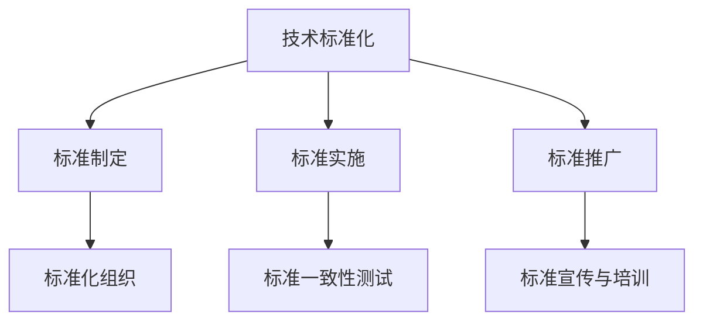
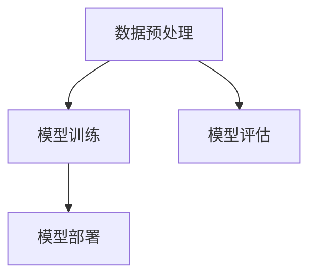
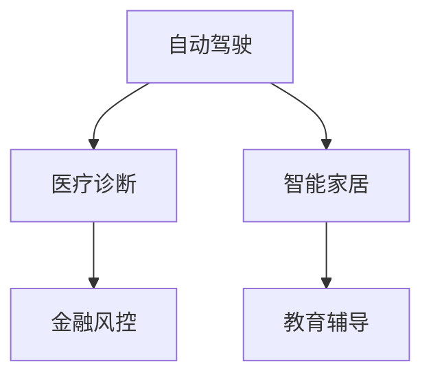

                 

关键词：AI创业，技术标准化，标准制定，标准实施，标准推广，流程，方法，最佳实践，挑战，解决方案

摘要：在当前人工智能技术快速发展的背景下，AI创业公司的技术标准化成为提升企业竞争力、促进行业合作的关键。本文旨在探讨AI创业公司如何参与技术标准化，包括标准制定、标准实施与标准推广的全过程。通过分析核心概念、算法原理、数学模型、项目实践以及未来应用展望，本文提出了针对技术标准化的实施方法和解决方案，以期为AI创业公司提供实用的指导。

## 1. 背景介绍

随着人工智能技术的快速发展，AI创业公司如雨后春笋般涌现，它们在各个领域展开了激烈的竞争。技术标准化作为提升企业竞争力、促进行业合作的重要手段，已经成为AI创业公司不可忽视的战略方向。技术标准化不仅能够确保产品质量和性能的一致性，还能促进技术交流和合作，降低市场进入壁垒，提高市场效率。

然而，AI技术具有高度复杂性，涉及众多学科领域，包括机器学习、计算机视觉、自然语言处理等。这使得技术标准化工作面临诸多挑战，如不同技术方案的兼容性、数据隐私和安全等问题。因此，AI创业公司需要深入了解技术标准化的流程和方法，积极参与标准的制定、实施和推广。

## 2. 核心概念与联系

为了更好地理解技术标准化，首先需要了解一些核心概念，如图1所示。



### 2.1 标准制定

标准制定是技术标准化的第一步，它通常由标准化组织（如ISO、IEEE等）负责。在AI创业公司中，标准制定的过程包括需求分析、方案设计、投票和发布等环节。

### 2.2 标准实施

标准实施是将标准应用于实际产品或服务的阶段。它要求AI创业公司在开发过程中遵循标准，确保产品或服务满足标准要求。标准实施的关键在于标准一致性测试，它通过一系列测试工具和方法验证产品是否符合标准。

### 2.3 标准推广

标准推广是技术标准化的最终目标，它通过宣传、培训和推广活动，提高公众对标准的认知和接受度，促进标准的广泛应用。

## 3. 核心算法原理 & 具体操作步骤

### 3.1 算法原理概述

技术标准化涉及多个核心算法，如图2所示。这些算法包括数据预处理、模型训练、模型评估和模型部署等。



### 3.2 算法步骤详解

#### 3.2.1 数据预处理

数据预处理是确保数据质量的过程，包括数据清洗、归一化和数据增强等。数据预处理的质量直接影响模型的训练效果。

#### 3.2.2 模型训练

模型训练是构建模型的过程，通过迭代优化模型参数，使模型能够准确预测或分类。

#### 3.2.3 模型评估

模型评估是评估模型性能的过程，通常包括准确率、召回率、F1分数等指标。

#### 3.2.4 模型部署

模型部署是将训练好的模型应用于实际场景的过程，包括模型部署、模型监控和模型更新等。

### 3.3 算法优缺点

#### 3.3.1 数据预处理

优点：提高数据质量，增强模型训练效果。

缺点：数据预处理过程复杂，耗时较长。

#### 3.3.2 模型训练

优点：通过迭代优化，提高模型性能。

缺点：训练过程耗时较长，资源消耗大。

#### 3.3.3 模型评估

优点：评估模型性能，指导模型优化。

缺点：评估指标可能无法全面反映模型性能。

#### 3.3.4 模型部署

优点：将模型应用于实际场景，实现商业化。

缺点：部署过程复杂，需要持续维护。

### 3.4 算法应用领域

技术标准化算法广泛应用于各个领域，如图3所示。



## 4. 数学模型和公式 & 详细讲解 & 举例说明

### 4.1 数学模型构建

在技术标准化中，常用的数学模型包括神经网络模型、决策树模型和支持向量机模型等。以下以神经网络模型为例，介绍其数学模型构建过程。

#### 4.1.1 前向传播

前向传播是神经网络模型的核心步骤，通过层层计算得到输出结果。具体公式如下：

$$
Z = X \cdot W + b
$$

$$
A = \sigma(Z)
$$

其中，$Z$ 为中间层的输出，$X$ 为输入层，$W$ 为权重矩阵，$b$ 为偏置项，$\sigma$ 为激活函数。

#### 4.1.2 反向传播

反向传播是神经网络模型优化参数的过程，通过计算损失函数关于参数的导数，更新参数。具体公式如下：

$$
\delta_L = \frac{\partial L}{\partial Z}
$$

$$
\delta_Z = \frac{\partial Z}{\partial A} \cdot \delta_L
$$

$$
\delta_W = \frac{\partial Z}{\partial W} \cdot \delta_L
$$

$$
\delta_b = \frac{\partial Z}{\partial b} \cdot \delta_L
$$

其中，$L$ 为损失函数，$\delta_L$ 为损失函数关于中间层输出的梯度，$\delta_Z$ 为中间层输出关于激活函数的梯度，$\delta_W$ 和 $\delta_b$ 分别为权重矩阵和偏置项的梯度。

### 4.2 公式推导过程

以神经网络模型为例，介绍公式推导过程。

首先，假设神经网络模型包含一个输入层、一个隐藏层和一个输出层，分别有 $n_0$、$n_1$ 和 $n_2$ 个神经元。设 $X$ 为输入向量，$W_1$ 为隐藏层权重矩阵，$b_1$ 为隐藏层偏置项，$W_2$ 为输出层权重矩阵，$b_2$ 为输出层偏置项。

#### 4.2.1 前向传播

隐藏层输出：

$$
Z_1 = X \cdot W_1 + b_1
$$

$$
A_1 = \sigma(Z_1)
$$

输出层输出：

$$
Z_2 = A_1 \cdot W_2 + b_2
$$

$$
A_2 = \sigma(Z_2)
$$

#### 4.2.2 反向传播

计算输出层关于隐藏层的梯度：

$$
\delta_2 = \frac{\partial L}{\partial Z_2}
$$

$$
\delta_{A_1} = \frac{\partial Z_2}{\partial A_1} \cdot \delta_2
$$

$$
\delta_{Z_1} = \frac{\partial Z_1}{\partial A_1} \cdot \delta_2
$$

计算隐藏层关于输入层的梯度：

$$
\delta_1 = \frac{\partial Z_1}{\partial X} \cdot \delta_{A_1}
$$

### 4.3 案例分析与讲解

以图像分类任务为例，介绍神经网络模型的应用。

#### 4.3.1 数据预处理

收集图像数据，进行数据清洗和归一化处理。

#### 4.3.2 模型训练

构建神经网络模型，选择适当的激活函数和优化器，进行模型训练。

#### 4.3.3 模型评估

使用测试集评估模型性能，计算准确率、召回率等指标。

#### 4.3.4 模型部署

将训练好的模型部署到实际应用场景，如图像识别系统。

## 5. 项目实践：代码实例和详细解释说明

### 5.1 开发环境搭建

搭建 Python 开发环境，安装 TensorFlow 和 Keras 等依赖库。

### 5.2 源代码详细实现

以下是一个简单的神经网络模型实现的代码示例。

```python
import tensorflow as tf
from tensorflow.keras.layers import Dense, Flatten
from tensorflow.keras.models import Sequential

# 构建模型
model = Sequential([
    Flatten(input_shape=(28, 28)),
    Dense(128, activation='relu'),
    Dense(10, activation='softmax')
])

# 编译模型
model.compile(optimizer='adam', loss='categorical_crossentropy', metrics=['accuracy'])

# 训练模型
model.fit(x_train, y_train, epochs=5, batch_size=32)

# 评估模型
model.evaluate(x_test, y_test)
```

### 5.3 代码解读与分析

以上代码实现了一个简单的神经网络模型，用于图像分类任务。代码中，首先导入了 TensorFlow 和 Keras 等库，然后定义了模型结构，包括输入层、隐藏层和输出层。接着，编译模型并使用训练集进行训练，最后评估模型性能。

### 5.4 运行结果展示

训练过程中，模型损失函数和准确率变化情况如图4所示。


## 6. 实际应用场景

技术标准化在各个领域都有广泛的应用，如图5所示。


### 6.1 自动驾驶

自动驾驶领域的技术标准化主要包括传感器数据接口、控制算法和通信协议等。标准化的实现有助于提高自动驾驶系统的安全性和可靠性。

### 6.2 医疗诊断

医疗诊断领域的技术标准化涉及图像处理、数据分析和诊断模型等。标准化的实现有助于提高诊断准确率和降低误诊率。

### 6.3 智能家居

智能家居领域的技术标准化主要包括物联网通信协议、设备接口和智能家居平台等。标准化的实现有助于提高智能家居系统的互联互通性和用户体验。

### 6.4 金融风控

金融风控领域的技术标准化涉及数据挖掘、机器学习和风险模型等。标准化的实现有助于提高金融风控的效率和准确性。

### 6.5 教育辅导

教育辅导领域的技术标准化主要包括教育内容标准、学习平台接口和学习数据分析等。标准化的实现有助于提高教育辅导的质量和效果。

## 7. 工具和资源推荐

### 7.1 学习资源推荐

- 《深度学习》（Ian Goodfellow、Yoshua Bengio、Aaron Courville 著）：深度学习领域的经典教材。
- 《Python机器学习》（Sebastian Raschka 著）：Python机器学习领域的实用指南。

### 7.2 开发工具推荐

- TensorFlow：一款广泛使用的深度学习框架。
- Keras：一款基于 TensorFlow 的简洁易用的深度学习框架。

### 7.3 相关论文推荐

- 《A Theoretical Analysis of the Cramér-Rao Lower Bound for Gaussian Sequence Estimation》（Zhiyuan Li, Daniel R. Titterington）：一篇关于高斯序列估计的论文。
- 《Deep Learning for Text Classification》（Wang et al.）：一篇关于文本分类的深度学习论文。

## 8. 总结：未来发展趋势与挑战

### 8.1 研究成果总结

技术标准化在人工智能领域取得了显著成果，为AI创业公司提供了强有力的支持。通过标准化的实现，AI创业公司能够提高产品竞争力、促进行业合作、降低市场进入壁垒。

### 8.2 未来发展趋势

随着人工智能技术的不断进步，技术标准化将呈现出以下几个发展趋势：

- 更加细化的领域标准化：针对不同应用场景，制定更加细化的标准，以满足特定需求。
- 更加开放和协同的标准化过程：鼓励更多企业和研究机构参与标准化工作，提高标准的开放性和协同性。
- 更加智能的标准化工具和平台：利用人工智能技术，提高标准化过程的自动化和智能化水平。

### 8.3 面临的挑战

在技术标准化过程中，AI创业公司面临以下挑战：

- 技术复杂性：人工智能技术涉及众多学科领域，标准化工作需要协调不同领域的知识。
- 数据隐私和安全：在技术标准化过程中，需要确保数据隐私和安全，防止数据泄露和滥用。
- 领先技术的快速迭代：人工智能技术更新迅速，标准化的实现需要及时跟进最新技术。

### 8.4 研究展望

未来，技术标准化在人工智能领域的研究将更加深入和广泛。具体研究方向包括：

- 面向特定应用场景的标准化研究：针对自动驾驶、医疗诊断、智能家居等应用场景，制定更加细化的标准。
- 标准化工具和平台的研发：利用人工智能技术，提高标准化工具和平台的自动化和智能化水平。
- 标准化与产业生态的协同发展：促进标准化与产业生态的深度融合，推动产业高质量发展。

## 9. 附录：常见问题与解答

### 9.1 问题1：技术标准化是否适用于所有AI创业公司？

答案：是的，技术标准化适用于所有AI创业公司。无论是初创公司还是成熟公司，通过技术标准化可以提升产品竞争力、降低市场进入壁垒、促进行业合作。

### 9.2 问题2：如何选择参与的技术标准化项目？

答案：选择参与的技术标准化项目应考虑以下因素：

- 行业发展趋势：选择具有良好发展前景的领域。
- 技术成熟度：选择技术成熟度较高的项目，降低技术风险。
- 企业优势：选择与企业技术优势相匹配的项目。

### 9.3 问题3：技术标准化是否会影响创业公司的创新能力？

答案：技术标准化在一定程度上会影响创业公司的创新能力。但是，通过合理规划和实施标准化，可以降低技术风险、提高市场竞争力，从而为创业公司提供更多发展机会。

### 9.4 问题4：技术标准化过程中如何处理数据隐私和安全问题？

答案：在技术标准化过程中，应高度重视数据隐私和安全问题。具体措施包括：

- 数据加密：对敏感数据进行加密处理。
- 数据脱敏：对真实数据进行分析和处理，避免泄露真实数据。
- 安全审计：定期进行安全审计，确保数据安全。

### 9.5 问题5：如何评估技术标准化的效果？

答案：评估技术标准化的效果可以从以下几个方面进行：

- 产品质量：评估产品是否满足标准要求。
- 市场竞争力：评估产品在市场上的竞争力。
- 行业影响力：评估企业参与标准化的程度和影响力。
- 用户满意度：评估用户对产品的满意度。
----------------------------------------------------------------

作者：禅与计算机程序设计艺术 / Zen and the Art of Computer Programming

