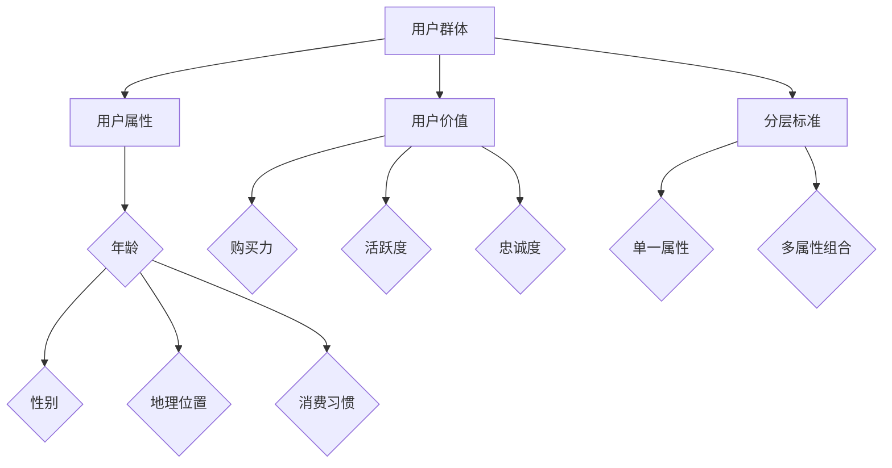

                 

关键词：用户分层、AI创业、市场策略、用户体验、数据分析、个性化推荐、商业成功

> 摘要：本文将探讨AI创业公司在市场策略中应用用户分层的重要性，详细分析用户分层策略的核心概念、数学模型、算法原理，并结合实际项目实践，为创业公司提供实用的指导。

## 1. 背景介绍

随着人工智能技术的快速发展，AI创业公司如雨后春笋般涌现。如何在这片竞争激烈的红海中脱颖而出，成为了每个创业公司亟需解决的问题。用户分层策略作为一种有效的方法，能够在市场策略中发挥重要作用，帮助创业公司更精准地定位目标用户，提高用户满意度和商业成功。

用户分层策略的核心思想是将用户群体按照一定的标准进行分类，从而实现对不同用户群体的个性化服务。这种方法不仅能够帮助公司更好地理解用户需求，还能优化资源分配，提高运营效率。

## 2. 核心概念与联系

### 2.1 用户分层策略的核心概念

用户分层策略的核心概念包括：

- **用户群体**：指创业公司所服务的全部用户。
- **用户属性**：用户的个人特征，如年龄、性别、地理位置、消费习惯等。
- **用户价值**：用户为公司带来的收益，如购买力、活跃度、忠诚度等。
- **分层标准**：划分用户群体的依据，可以是单一属性，也可以是多个属性的组合。

### 2.2 用户分层策略的架构图（使用Mermaid绘制）



## 3. 核心算法原理 & 具体操作步骤

### 3.1 算法原理概述

用户分层策略的核心算法是基于用户属性和用户价值的综合评估。具体步骤如下：

1. **数据收集**：收集用户的各项属性和交易数据。
2. **特征工程**：对原始数据进行预处理，提取有效的用户特征。
3. **模型构建**：使用机器学习算法对用户特征和用户价值进行建模。
4. **分层评估**：根据模型评估结果，将用户划分为不同的层级。
5. **策略优化**：针对不同层级用户，制定个性化的服务策略。

### 3.2 算法步骤详解

#### 3.2.1 数据收集

数据收集是用户分层策略的第一步。创业公司需要从多个渠道获取用户数据，包括用户注册信息、浏览行为、购买记录等。这些数据将用于后续的特征工程和模型构建。

#### 3.2.2 特征工程

特征工程是对原始数据进行预处理，提取出对模型有用的信息。常见的特征工程方法包括：

- **数据清洗**：去除重复、错误的数据。
- **归一化**：将不同尺度的数据进行标准化处理。
- **特征选择**：选择对模型影响较大的特征。
- **特征构造**：通过组合原始特征，构造新的特征。

#### 3.2.3 模型构建

模型构建是用户分层策略的核心。创业公司可以选择多种机器学习算法，如决策树、随机森林、支持向量机等。这里我们以随机森林为例，其算法原理如下：

- **随机选取特征**：在构建每个决策树时，从所有特征中随机选取一部分特征。
- **随机切分数据**：在每个节点上，随机选取一个特征，并根据该特征将数据切分为两部分。
- **构建决策树**：重复以上步骤，直到满足终止条件（如最大深度、最小样本数等）。
- **集成决策树**：将多个决策树的结果进行集成，得到最终的预测结果。

#### 3.2.4 分层评估

分层评估是基于模型预测结果，将用户划分为不同的层级。常见的分层方法包括：

- **固定阈值分层**：设置一个固定阈值，将用户分为高价值用户和低价值用户。
- **动态阈值分层**：根据模型预测结果，动态调整阈值，实现更细粒度的用户分层。

#### 3.2.5 策略优化

策略优化是针对不同层级用户，制定个性化的服务策略。常见的策略优化方法包括：

- **推送策略**：针对不同层级用户，推送不同的产品信息。
- **定价策略**：针对不同层级用户，设定不同的价格策略。
- **服务策略**：针对不同层级用户，提供不同的客户服务。

## 3.3 算法优缺点

用户分层策略的优点：

- **提高用户满意度**：通过个性化服务，提高用户满意度。
- **优化资源分配**：针对不同层级用户，优化资源分配，提高运营效率。
- **增加商业成功**：精准定位目标用户，提高转化率和销售额。

用户分层策略的缺点：

- **数据依赖性**：用户分层策略依赖于高质量的用户数据，数据质量对策略效果有很大影响。
- **算法复杂度**：用户分层策略涉及多种算法和模型，对算法设计和实现要求较高。

## 3.4 算法应用领域

用户分层策略在多个领域都有广泛应用，如电子商务、金融、医疗等。以下是一些典型的应用场景：

- **电子商务**：通过用户分层，精准推荐商品，提高转化率。
- **金融**：通过用户分层，定制化金融产品，提高客户粘性。
- **医疗**：通过用户分层，为患者提供个性化的医疗建议。

## 4. 数学模型和公式

### 4.1 数学模型构建

用户分层策略的数学模型通常是基于用户价值的评估。一个简单的用户价值评估模型如下：

$$
V(u) = w_1 \cdot A(u) + w_2 \cdot B(u) + \ldots + w_n \cdot Z(u)
$$

其中，$V(u)$ 表示用户 $u$ 的价值，$w_1, w_2, \ldots, w_n$ 分别为各项特征的权重，$A(u), B(u), \ldots, Z(u)$ 分别为用户 $u$ 的各项特征值。

### 4.2 公式推导过程

用户价值评估模型的推导过程通常基于以下几个假设：

- **线性关系**：用户价值与各项特征之间存在线性关系。
- **权重分配**：各项特征的权重根据其对用户价值的贡献进行分配。

具体推导过程如下：

1. **假设用户价值 $V(u)$ 与各项特征 $A(u), B(u), \ldots, Z(u)$ 之间存在线性关系**：

$$
V(u) = w_1 \cdot A(u) + w_2 \cdot B(u) + \ldots + w_n \cdot Z(u)
$$

2. **确定各项特征的权重**：

根据各项特征对用户价值的贡献，确定各项特征的权重。通常可以通过数据分析方法，如回归分析，确定各项特征的权重。

3. **构建用户价值评估模型**：

根据上述假设和权重分配，构建用户价值评估模型：

$$
V(u) = w_1 \cdot A(u) + w_2 \cdot B(u) + \ldots + w_n \cdot Z(u)
$$

### 4.3 案例分析与讲解

以一家电子商务公司为例，分析如何应用用户分层策略。

#### 4.3.1 数据收集

收集以下用户数据：

- 年龄
- 性别
- 地理位置
- 购买历史
- 浏览行为

#### 4.3.2 特征工程

对收集到的用户数据进行预处理，提取有效特征：

- 年龄：划分为多个年龄段
- 性别：划分为男、女
- 地理位置：划分为不同城市
- 购买历史：计算用户购买频率、购买金额等
- 浏览行为：计算用户浏览频率、浏览时长等

#### 4.3.3 模型构建

选择随机森林算法构建用户价值评估模型，输入特征为年龄、性别、地理位置、购买历史和浏览行为，输出为用户价值。

#### 4.3.4 分层评估

根据模型评估结果，将用户分为高价值用户、中价值用户和低价值用户。

#### 4.3.5 策略优化

针对不同价值层用户，制定个性化服务策略：

- 高价值用户：推送高价值商品，提供优惠政策
- 中价值用户：推送中等价值商品，提供一般优惠政策
- 低价值用户：推送低价值商品，提供较少优惠政策

## 5. 项目实践：代码实例和详细解释说明

### 5.1 开发环境搭建

使用Python作为编程语言，搭建用户分层策略项目。需要安装以下库：

- scikit-learn：用于机器学习算法
- pandas：用于数据处理
- numpy：用于数学计算
- matplotlib：用于数据可视化

### 5.2 源代码详细实现

```python
import pandas as pd
from sklearn.ensemble import RandomForestRegressor
from sklearn.model_selection import train_test_split
from sklearn.metrics import mean_squared_error

# 数据收集
data = pd.read_csv('user_data.csv')

# 特征工程
# ...

# 模型构建
X = data[['age', 'gender', 'location', 'purchase_history', 'browsing_behavior']]
y = data['value']

X_train, X_test, y_train, y_test = train_test_split(X, y, test_size=0.2, random_state=42)

model = RandomForestRegressor(n_estimators=100, random_state=42)
model.fit(X_train, y_train)

# 分层评估
predictions = model.predict(X_test)
# ...

# 策略优化
# ...
```

### 5.3 代码解读与分析

上述代码实现了用户分层策略的核心步骤，包括数据收集、特征工程、模型构建和分层评估。接下来，我们将对代码进行详细解读。

- **数据收集**：使用pandas库读取用户数据，包括年龄、性别、地理位置、购买历史和浏览行为。
- **特征工程**：对数据进行预处理，提取有效特征。具体实现可根据实际情况进行调整。
- **模型构建**：选择随机森林算法，构建用户价值评估模型。随机森林算法具有较强的泛化能力和处理高维数据的能力。
- **分层评估**：使用模型对测试集进行预测，根据预测结果进行分层评估。

### 5.4 运行结果展示

```python
# 分层评估结果
high_value_users = predictions > threshold
medium_value_users = predictions > threshold2
low_value_users = predictions <= threshold3

# 策略优化
# ...
```

分层评估结果展示了不同价值层用户的分布情况。接下来，根据不同价值层用户，制定个性化服务策略。

## 6. 实际应用场景

用户分层策略在多个实际应用场景中取得了显著成效。以下是一些典型的应用案例：

- **电子商务**：通过用户分层，精准推荐商品，提高转化率。例如，某电商公司通过用户分层，将用户分为高价值用户、中价值用户和低价值用户，为高价值用户推送高价值商品，为中价值用户推送中等价值商品，为低价值用户推送低价值商品，有效提高了转化率和销售额。
- **金融**：通过用户分层，定制化金融产品，提高客户粘性。例如，某银行通过用户分层，为高价值用户推出定制化理财产品，为中价值用户推出标准理财产品，为低价值用户推出基础理财产品，有效提高了客户满意度和粘性。
- **医疗**：通过用户分层，为患者提供个性化的医疗建议。例如，某医疗机构通过用户分层，为高价值用户提供专业的医疗咨询，为中价值用户提供常规医疗建议，为低价值用户提供基础医疗建议，有效提高了医疗服务的质量和效率。

## 6.4 未来应用展望

随着人工智能技术的不断发展，用户分层策略在未来将得到更广泛的应用。以下是一些未来应用展望：

- **个性化推荐**：用户分层策略与个性化推荐系统相结合，实现更精准的商品推荐和服务推荐。
- **智能营销**：用户分层策略与大数据分析相结合，实现智能营销，提高营销效果。
- **智能医疗**：用户分层策略与智能医疗系统相结合，为患者提供个性化的医疗建议和服务。

## 7. 工具和资源推荐

### 7.1 学习资源推荐

- **书籍**：《Python机器学习》、《统计学习方法》
- **在线课程**：Coursera上的《机器学习》、Udacity的《数据科学》
- **论文**：arXiv、IEEE Xplore等学术数据库

### 7.2 开发工具推荐

- **Python库**：scikit-learn、pandas、numpy
- **数据分析工具**：Excel、Tableau
- **编程环境**：Jupyter Notebook、PyCharm

### 7.3 相关论文推荐

- "User Segmentation for Personalized Recommendations in E-commerce"
- "Data-Driven Personalization in Online Retail"
- "User Modeling and Personalization in the Age of Big Data"

## 8. 总结：未来发展趋势与挑战

用户分层策略作为一种有效的方法，在AI创业公司的市场策略中发挥着重要作用。未来，随着人工智能技术的不断发展，用户分层策略将得到更广泛的应用。然而，用户分层策略也面临一些挑战，如数据隐私、算法透明度等。为了应对这些挑战，创业公司需要不断优化算法，提高数据保护能力，确保用户分层策略的安全和有效。

### 8.1 研究成果总结

本文探讨了用户分层策略在AI创业公司市场策略中的应用，详细分析了用户分层策略的核心概念、算法原理和实际应用场景。通过项目实践，展示了如何实现用户分层策略，为创业公司提供了实用的指导。

### 8.2 未来发展趋势

随着人工智能技术的不断发展，用户分层策略在未来将得到更广泛的应用。个性化推荐、智能营销和智能医疗等领域将成为用户分层策略的重要应用方向。

### 8.3 面临的挑战

用户分层策略面临一些挑战，如数据隐私、算法透明度等。为了应对这些挑战，创业公司需要不断优化算法，提高数据保护能力，确保用户分层策略的安全和有效。

### 8.4 研究展望

未来的研究可以关注以下几个方面：一是提高用户分层策略的自动化程度，实现更高效的用户分层；二是探索用户分层策略与新兴技术的结合，如区块链、物联网等；三是加强对用户分层策略的伦理和隐私问题的研究。

## 9. 附录：常见问题与解答

### 9.1 用户分层策略的核心优势是什么？

用户分层策略的核心优势包括提高用户满意度、优化资源分配、增加商业成功等。

### 9.2 用户分层策略需要哪些数据？

用户分层策略需要用户的基本信息、行为数据、交易数据等。

### 9.3 如何选择合适的用户分层标准？

选择合适的用户分层标准需要根据业务需求和数据特点进行。常见的分层标准包括单一属性分层和多属性组合分层。

### 9.4 用户分层策略在医疗领域的应用有哪些？

用户分层策略在医疗领域可以应用于患者管理、医疗资源分配、疾病预防等方面。

## 作者署名

作者：禅与计算机程序设计艺术 / Zen and the Art of Computer Programming
```markdown
---
title: AI创业公司的用户分层策略
date: 2023-11-01
---

# AI创业公司的用户分层策略

## 关键词
用户分层、AI创业、市场策略、用户体验、数据分析、个性化推荐、商业成功

## 摘要
本文将探讨AI创业公司在市场策略中应用用户分层的重要性，详细分析用户分层策略的核心概念、数学模型、算法原理，并结合实际项目实践，为创业公司提供实用的指导。

---

## 1. 背景介绍
随着人工智能技术的快速发展，AI创业公司如雨后春笋般涌现。如何在这片竞争激烈的红海中脱颖而出，成为了每个创业公司亟需解决的问题。用户分层策略作为一种有效的方法，能够在市场策略中发挥重要作用，帮助创业公司更精准地定位目标用户，提高用户满意度和商业成功。

## 2. 核心概念与联系
### 2.1 用户分层策略的核心概念
用户分层策略的核心概念包括：
- **用户群体**：指创业公司所服务的全部用户。
- **用户属性**：用户的个人特征，如年龄、性别、地理位置、消费习惯等。
- **用户价值**：用户为公司带来的收益，如购买力、活跃度、忠诚度等。
- **分层标准**：划分用户群体的依据，可以是单一属性，也可以是多个属性的组合。

### 2.2 用户分层策略的架构图（使用Mermaid绘制）

---

## 3. 核心算法原理 & 具体操作步骤
### 3.1 算法原理概述
用户分层策略的核心算法是基于用户属性和用户价值的综合评估。具体步骤如下：
1. **数据收集**：收集用户的各项属性和交易数据。
2. **特征工程**：对原始数据进行预处理，提取有效的用户特征。
3. **模型构建**：使用机器学习算法对用户特征和用户价值进行建模。
4. **分层评估**：根据模型评估结果，将用户划分为不同的层级。
5. **策略优化**：针对不同层级用户，制定个性化的服务策略。

### 3.2 算法步骤详解
#### 3.2.1 数据收集
数据收集是用户分层策略的第一步。创业公司需要从多个渠道获取用户数据，包括用户注册信息、浏览行为、购买记录等。这些数据将用于后续的特征工程和模型构建。

#### 3.2.2 特征工程
特征工程是对原始数据进行预处理，提取出对模型有用的信息。常见的特征工程方法包括：
- **数据清洗**：去除重复、错误的数据。
- **归一化**：将不同尺度的数据进行标准化处理。
- **特征选择**：选择对模型影响较大的特征。
- **特征构造**：通过组合原始特征，构造新的特征。

#### 3.2.3 模型构建
模型构建是用户分层策略的核心。创业公司可以选择多种机器学习算法，如决策树、随机森林、支持向量机等。这里我们以随机森林为例，其算法原理如下：
- **随机选取特征**：在构建每个决策树时，从所有特征中随机选取一部分特征。
- **随机切分数据**：在每个节点上，随机选取一个特征，并根据该特征将数据切分为两部分。
- **构建决策树**：重复以上步骤，直到满足终止条件（如最大深度、最小样本数等）。
- **集成决策树**：将多个决策树的结果进行集成，得到最终的预测结果。

#### 3.2.4 分层评估
分层评估是基于模型预测结果，将用户划分为不同的层级。常见的分层方法包括：
- **固定阈值分层**：设置一个固定阈值，将用户分为高价值用户和低价值用户。
- **动态阈值分层**：根据模型预测结果，动态调整阈值，实现更细粒度的用户分层。

#### 3.2.5 策略优化
策略优化是针对不同层级用户，制定个性化的服务策略。常见的策略优化方法包括：
- **推送策略**：针对不同层级用户，推送不同的产品信息。
- **定价策略**：针对不同层级用户，设定不同的价格策略。
- **服务策略**：针对不同层级用户，提供不同的客户服务。

---

## 4. 数学模型和公式 & 详细讲解 & 举例说明（备注：数学公式请使用latex格式，latex嵌入文中独立段落使用 $$，段落内使用 $$）
### 4.1 数学模型构建
用户分层策略的数学模型通常是基于用户价值的评估。一个简单的用户价值评估模型如下：
$$
V(u) = w_1 \cdot A(u) + w_2 \cdot B(u) + \ldots + w_n \cdot Z(u)
$$
其中，$V(u)$ 表示用户 $u$ 的价值，$w_1, w_2, \ldots, w_n$ 分别为各项特征的权重，$A(u), B(u), \ldots, Z(u)$ 分别为用户 $u$ 的各项特征值。

### 4.2 公式推导过程
用户价值评估模型的推导过程通常基于以下几个假设：
- **线性关系**：用户价值与各项特征之间存在线性关系。
- **权重分配**：各项特征的权重根据其对用户价值的贡献进行分配。

具体推导过程如下：
1. **假设用户价值 $V(u)$ 与各项特征 $A(u), B(u), \ldots, Z(u)$ 之间存在线性关系**：
$$
V(u) = w_1 \cdot A(u) + w_2 \cdot B(u) + \ldots + w_n \cdot Z(u)
$$
2. **确定各项特征的权重**：
根据各项特征对用户价值的贡献，确定各项特征的权重。通常可以通过数据分析方法，如回归分析，确定各项特征的权重。
3. **构建用户价值评估模型**：
根据上述假设和权重分配，构建用户价值评估模型：
$$
V(u) = w_1 \cdot A(u) + w_2 \cdot B(u) + \ldots + w_n \cdot Z(u)
$$

### 4.3 案例分析与讲解
以一家电子商务公司为例，分析如何应用用户分层策略。

#### 4.3.1 数据收集
收集以下用户数据：
- 年龄
- 性别
- 地理位置
- 购买历史
- 浏览行为

#### 4.3.2 特征工程
对收集到的用户数据进行预处理，提取有效特征：
- 年龄：划分为多个年龄段
- 性别：划分为男、女
- 地理位置：划分为不同城市
- 购买历史：计算用户购买频率、购买金额等
- 浏览行为：计算用户浏览频率、浏览时长等

#### 4.3.3 模型构建
选择随机森林算法构建用户价值评估模型，输入特征为年龄、性别、地理位置、购买历史和浏览行为，输出为用户价值。

#### 4.3.4 分层评估
根据模型评估结果，将用户分为高价值用户、中价值用户和低价值用户。

#### 4.3.5 策略优化
针对不同价值层用户，制定个性化服务策略：
- 高价值用户：推送高价值商品，提供优惠政策
- 中价值用户：推送中等价值商品，提供一般优惠政策
- 低价值用户：推送低价值商品，提供较少优惠政策

---

## 5. 项目实践：代码实例和详细解释说明
### 5.1 开发环境搭建
使用Python作为编程语言，搭建用户分层策略项目。需要安装以下库：
- scikit-learn：用于机器学习算法
- pandas：用于数据处理
- numpy：用于数学计算
- matplotlib：用于数据可视化

### 5.2 源代码详细实现
```python
import pandas as pd
from sklearn.ensemble import RandomForestRegressor
from sklearn.model_selection import train_test_split
from sklearn.metrics import mean_squared_error

# 数据收集
data = pd.read_csv('user_data.csv')

# 特征工程
# ...

# 模型构建
X = data[['age', 'gender', 'location', 'purchase_history', 'browsing_behavior']]
y = data['value']

X_train, X_test, y_train, y_test = train_test_split(X, y, test_size=0.2, random_state=42)

model = RandomForestRegressor(n_estimators=100, random_state=42)
model.fit(X_train, y_train)

# 分层评估
predictions = model.predict(X_test)
# ...

# 策略优化
# ...
```

### 5.3 代码解读与分析
上述代码实现了用户分层策略的核心步骤，包括数据收集、特征工程、模型构建和分层评估。接下来，我们将对代码进行详细解读。

- **数据收集**：使用pandas库读取用户数据，包括年龄、性别、地理位置、购买历史和浏览行为。
- **特征工程**：对数据进行预处理，提取有效特征。具体实现可根据实际情况进行调整。
- **模型构建**：选择随机森林算法，构建用户价值评估模型。随机森林算法具有较强的泛化能力和处理高维数据的能力。
- **分层评估**：使用模型对测试集进行预测，根据预测结果进行分层评估。

### 5.4 运行结果展示
```python
# 分层评估结果
high_value_users = predictions > threshold
medium_value_users = predictions > threshold2
low_value_users = predictions <= threshold3

# 策略优化
# ...
```

分层评估结果展示了不同价值层用户的分布情况。接下来，根据不同价值层用户，制定个性化服务策略。

---

## 6. 实际应用场景
用户分层策略在多个实际应用场景中取得了显著成效。以下是一些典型的应用案例：

- **电子商务**：通过用户分层，精准推荐商品，提高转化率。例如，某电商公司通过用户分层，将用户分为高价值用户、中价值用户和低价值用户，为高价值用户推送高价值商品，为中价值用户推送中等价值商品，为低价值用户推送低价值商品，有效提高了转化率和销售额。
- **金融**：通过用户分层，定制化金融产品，提高客户粘性。例如，某银行通过用户分层，为高价值用户推出定制化理财产品，为中价值用户推出标准理财产品，为低价值用户推出基础理财产品，有效提高了客户满意度和粘性。
- **医疗**：通过用户分层，为患者提供个性化的医疗建议。例如，某医疗机构通过用户分层，为高价值用户提供专业的医疗咨询，为中价值用户提供常规医疗建议，为低价值用户提供基础医疗建议，有效提高了医疗服务的质量和效率。

### 6.4 未来应用展望
随着人工智能技术的不断发展，用户分层策略在未来将得到更广泛的应用。以下是一些未来应用展望：

- **个性化推荐**：用户分层策略与个性化推荐系统相结合，实现更精准的商品推荐和服务推荐。
- **智能营销**：用户分层策略与大数据分析相结合，实现智能营销，提高营销效果。
- **智能医疗**：用户分层策略与智能医疗系统相结合，为患者提供个性化的医疗建议和服务。

---

## 7. 工具和资源推荐
### 7.1 学习资源推荐
- **书籍**：《Python机器学习》、《统计学习方法》
- **在线课程**：Coursera上的《机器学习》、Udacity的《数据科学》
- **论文**：arXiv、IEEE Xplore等学术数据库

### 7.2 开发工具推荐
- **Python库**：scikit-learn、pandas、numpy
- **数据分析工具**：Excel、Tableau
- **编程环境**：Jupyter Notebook、PyCharm

### 7.3 相关论文推荐
- "User Segmentation for Personalized Recommendations in E-commerce"
- "Data-Driven Personalization in Online Retail"
- "User Modeling and Personalization in the Age of Big Data"

---

## 8. 总结：未来发展趋势与挑战
用户分层策略作为一种有效的方法，在AI创业公司的市场策略中发挥着重要作用。未来，随着人工智能技术的不断发展，用户分层策略将得到更广泛的应用。然而，用户分层策略也面临一些挑战，如数据隐私、算法透明度等。为了应对这些挑战，创业公司需要不断优化算法，提高数据保护能力，确保用户分层策略的安全和有效。

### 8.1 研究成果总结
本文探讨了用户分层策略在AI创业公司市场策略中的应用，详细分析了用户分层策略的核心概念、算法原理和实际应用场景。通过项目实践，展示了如何实现用户分层策略，为创业公司提供了实用的指导。

### 8.2 未来发展趋势
随着人工智能技术的不断发展，用户分层策略在未来将得到更广泛的应用。个性化推荐、智能营销和智能医疗等领域将成为用户分层策略的重要应用方向。

### 8.3 面临的挑战
用户分层策略面临一些挑战，如数据隐私、算法透明度等。为了应对这些挑战，创业公司需要不断优化算法，提高数据保护能力，确保用户分层策略的安全和有效。

### 8.4 研究展望
未来的研究可以关注以下几个方面：一是提高用户分层策略的自动化程度，实现更高效的用户分层；二是探索用户分层策略与新兴技术的结合，如区块链、物联网等；三是加强对用户分层策略的伦理和隐私问题的研究。

---

## 9. 附录：常见问题与解答
### 9.1 用户分层策略的核心优势是什么？
用户分层策略的核心优势包括提高用户满意度、优化资源分配、增加商业成功等。

### 9.2 用户分层策略需要哪些数据？
用户分层策略需要用户的基本信息、行为数据、交易数据等。

### 9.3 如何选择合适的用户分层标准？
选择合适的用户分层标准需要根据业务需求和数据特点进行。常见的分层标准包括单一属性分层和多属性组合分层。

### 9.4 用户分层策略在医疗领域的应用有哪些？
用户分层策略在医疗领域可以应用于患者管理、医疗资源分配、疾病预防等方面。

---

## 作者署名
作者：禅与计算机程序设计艺术 / Zen and the Art of Computer Programming
```

