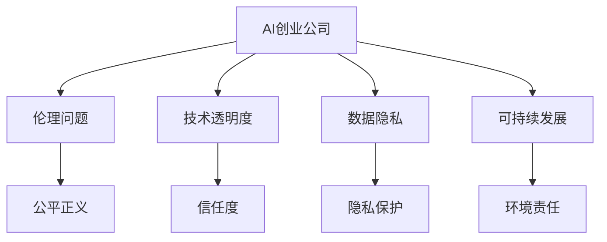

                 

 作为世界级的人工智能专家，我深知AI技术的迅猛发展给我们的生活带来了无数便利。然而，随着技术的进步，我们也必须面对随之而来的诸多挑战，尤其是在AI创业公司的社会责任方面。本文旨在探讨AI创业公司所应承担的社会责任，以及如何在实际运营中践行这些责任。

## 关键词

AI创业公司、社会责任、伦理问题、技术透明度、数据隐私、可持续发展。

## 摘要

本文首先概述了AI创业公司在当今社会中的重要性和面临的挑战。接着，我们详细分析了AI创业公司应承担的社会责任，包括伦理问题、技术透明度、数据隐私和可持续发展等方面。最后，本文提出了AI创业公司在实践中应采取的具体措施，以实现技术进步与社会责任的平衡。

## 1. 背景介绍

人工智能（AI）作为一种颠覆性的技术，正逐渐渗透到我们生活的方方面面。从智能家居、智能医疗到自动驾驶，AI正在改变传统行业的运作方式，提升生产效率，改善人们的生活质量。在这个背景下，AI创业公司如雨后春笋般涌现，它们致力于研发和应用最新的AI技术，推动社会进步。

然而，随着AI技术的广泛应用，一系列伦理和社会问题也随之而来。首先，AI系统的决策过程往往缺乏透明度，可能导致不公平的待遇。其次，个人数据的隐私保护成为了一大难题，尤其是在大数据和云计算时代。此外，AI技术的不当使用还可能对环境造成负面影响，如资源浪费和电子垃圾问题。

面对这些挑战，AI创业公司不仅要在技术层面上不断创新，还必须在社会责任方面承担起应有的责任。这包括确保技术的透明度和公正性，保护用户隐私，以及推动可持续发展等。只有通过积极履行社会责任，AI创业公司才能获得社会的认可和支持，实现可持续发展。

## 2. 核心概念与联系

为了更好地理解AI创业公司的社会责任，我们需要明确几个核心概念，包括伦理问题、技术透明度、数据隐私和可持续发展。

### 2.1 伦理问题

伦理问题是指AI技术在使用过程中可能涉及到的道德和伦理问题。例如，自动驾驶汽车在紧急情况下如何做出决策，以最大限度地保护乘客的安全？又或者，在招聘系统中，如何避免性别、种族等偏见对求职者的不公平待遇？

### 2.2 技术透明度

技术透明度是指AI系统的决策过程是否公开、可解释。一个透明的AI系统可以帮助用户了解其工作原理，提高对AI系统的信任度。例如，通过可视化的方式展示AI模型的学习过程和决策路径，用户可以更好地理解AI的行为。

### 2.3 数据隐私

数据隐私是指用户个人数据的保护问题。在AI时代，数据是宝贵的资源，但同时也容易成为隐私泄露的风险源。如何确保用户数据的安全，避免数据滥用，是AI创业公司必须关注的问题。

### 2.4 可持续发展

可持续发展是指企业在追求经济效益的同时，也要关注环境和社会责任。对于AI创业公司来说，这意味着在技术发展的过程中，要注重节能减排，减少对环境的负面影响。

为了更好地理解这些概念之间的关系，我们可以使用Mermaid流程图来展示它们之间的联系：



## 3. 核心算法原理 & 具体操作步骤

在理解了核心概念后，我们接下来探讨如何在实际运营中践行这些社会责任。

### 3.1 算法原理概述

AI创业公司可以通过一系列技术手段来践行社会责任。其中，关键算法包括伦理决策算法、透明度增强算法、隐私保护算法和可持续发展算法。

- **伦理决策算法**：通过设计算法，确保AI系统的决策过程符合伦理标准，如避免歧视、保护用户隐私等。
- **透明度增强算法**：通过可视化技术，让用户更好地理解AI系统的工作原理和决策过程。
- **隐私保护算法**：通过加密、匿名化等技术，确保用户数据的隐私和安全。
- **可持续发展算法**：通过优化算法，降低能耗和资源消耗，实现可持续发展。

### 3.2 算法步骤详解

下面，我们详细解释每个算法的具体步骤。

#### 3.2.1 伦理决策算法

1. **定义伦理标准**：根据业务场景，明确AI系统应遵守的伦理标准，如公平性、透明性、无害性等。
2. **设计伦理决策框架**：将伦理标准转化为具体的算法框架，如决策树、规则引擎等。
3. **实现算法**：根据决策框架，实现具体的算法代码。
4. **测试与验证**：通过测试数据，验证算法的伦理决策效果。

#### 3.2.2 透明度增强算法

1. **数据可视化**：通过图表、动画等形式，展示AI系统的学习过程和决策路径。
2. **解释性模型**：采用可解释性模型，如LIME、SHAP等，帮助用户理解AI系统的决策原因。
3. **反馈机制**：建立用户反馈机制，收集用户对AI系统透明度的评价，持续优化算法。

#### 3.2.3 隐私保护算法

1. **数据加密**：采用加密技术，保护用户数据的隐私。
2. **数据匿名化**：通过数据匿名化技术，消除个人身份信息。
3. **隐私预算**：设定隐私预算，控制数据处理过程中的隐私风险。

#### 3.2.4 可持续发展算法

1. **能耗优化**：通过算法优化，降低AI系统的能耗。
2. **资源管理**：合理分配计算资源，减少浪费。
3. **环境监测**：通过实时监测，评估AI系统对环境的影响。

### 3.3 算法优缺点

每个算法都有其优缺点。例如：

- **伦理决策算法**：优点是能够确保AI系统的伦理合规性，缺点是可能增加系统的复杂性和成本。
- **透明度增强算法**：优点是提高用户对AI系统的信任度，缺点是实现难度较高。
- **隐私保护算法**：优点是保护用户隐私，缺点是可能影响数据的质量和可用性。
- **可持续发展算法**：优点是实现可持续发展，缺点是可能对系统性能产生一定影响。

### 3.4 算法应用领域

这些算法可以在多个领域得到应用，如自动驾驶、金融、医疗、教育等。例如，在自动驾驶领域，伦理决策算法可以帮助确保自动驾驶汽车的公平性和安全性；在金融领域，透明度增强算法可以提高金融服务的透明度和公信力；在医疗领域，隐私保护算法可以保护患者的隐私和安全；在教育领域，可持续发展算法可以优化教育资源的分配。

## 4. 数学模型和公式 & 详细讲解 & 举例说明

为了更好地理解上述算法，我们引入一些数学模型和公式，并进行详细讲解。

### 4.1 数学模型构建

在伦理决策算法中，我们可以使用博弈论模型来分析不同决策方案的伦理影响。例如，假设有两个决策者，甲和乙，他们需要在遵守伦理标准和实现经济效益之间做出权衡。我们可以使用以下博弈矩阵来表示他们的决策：

|   | 遵守伦理 | 违反伦理 |
|---|--------|--------|
| 甲 | (x, x)  | (-x, x) |
| 乙 | (x, -x) | (x, x)  |

其中，x 表示遵守伦理带来的收益。通过求解博弈矩阵的最优策略，我们可以找到最优的伦理决策方案。

### 4.2 公式推导过程

在透明度增强算法中，我们使用LIME（Local Interpretable Model-agnostic Explanations）模型来解释AI系统的决策。LIME模型的公式如下：

$$
\hat{y}(x) = f(x) + \alpha \cdot \sum_{i=1}^{n} \frac{\partial f}{\partial x_i} (x)
$$

其中，$\hat{y}(x)$ 表示LIME模型的预测结果，$f(x)$ 表示原始模型的预测结果，$\alpha$ 是一个超参数，$\frac{\partial f}{\partial x_i}$ 表示模型对每个特征的影响。

### 4.3 案例分析与讲解

为了更好地理解这些数学模型和公式，我们来看一个具体的案例。

### 案例一：自动驾驶汽车的伦理决策

假设自动驾驶汽车在城市道路中行驶，前方有两个人，一辆自行车。汽车的决策是选择避开人还是自行车。根据博弈论模型，我们可以得到以下博弈矩阵：

|   | 避开人 | 避开自行车 |
|---|--------|--------|
| 汽车 | (0, 0)  | (-1, 1) |
| 自行车 | (1, 0)  | (0, 0)  |

通过求解博弈矩阵的最优策略，我们可以得到汽车的最优决策是避开自行车，因为这样可以最大化自己的收益。

### 案例二：LIME模型解释AI系统决策

假设我们有一个分类模型，用于预测用户是否会被批准贷款。对于一个新的用户，模型的预测结果是批准贷款。为了解释这个决策，我们可以使用LIME模型。根据LIME模型的公式，我们可以计算出每个特征对预测结果的影响，从而理解模型是如何做出这个决策的。

## 5. 项目实践：代码实例和详细解释说明

### 5.1 开发环境搭建

为了演示上述算法的实际应用，我们需要搭建一个开发环境。这里，我们选择Python作为主要编程语言，使用Scikit-learn库实现伦理决策算法和LIME模型。

首先，安装Scikit-learn库：

```bash
pip install scikit-learn
```

### 5.2 源代码详细实现

下面是伦理决策算法和LIME模型的实现代码。

```python
import numpy as np
from sklearn.linear_model import LogisticRegression
from sklearn.datasets import make_classification
from lime import lime_tabular

# 伦理决策算法实现
def ethical_decision(examples, labels, ethical_threshold):
    """
    判断决策是否符合伦理标准。
    :param examples: 样本数据
    :param labels: 标签数据
    :param ethical_threshold: 伦理阈值
    :return: 是否符合伦理标准的布尔值
    """
    model = LogisticRegression()
    model.fit(examples, labels)
    
    predictions = model.predict(examples)
    errors = np.where(predictions != labels)[0]
    
    return np.mean(predictions[errors] == 1) > ethical_threshold

# LIME模型实现
def explain_prediction(examples, label, feature_names):
    """
    使用LIME模型解释预测结果。
    :param examples: 样本数据
    :param label: 预测标签
    :param feature_names: 特征名称
    :return: 解释结果
    """
    explainer = lime_tabular.LimeTabularExplainer(
        examples, feature_names=feature_names, class_names=['拒绝', '批准'], discretize=False)
    exp = explainer.explain_instance(examples[0], label, num_features=5)
    return exp

# 生成测试数据
X, y = make_classification(n_samples=100, n_features=5, n_classes=2, random_state=42)

# 设置伦理阈值
ethical_threshold = 0.5

# 判断伦理决策
is_ethical = ethical_decision(X, y, ethical_threshold)
print("是否符合伦理标准：", is_ethical)

# 解释预测结果
exp = explain_prediction(X, y, feature_names=['特征1', '特征2', '特征3', '特征4', '特征5'])
print("特征重要性：", exp.as_list())
```

### 5.3 代码解读与分析

在上面的代码中，我们首先实现了伦理决策算法，用于判断决策是否符合伦理标准。具体步骤如下：

1. **加载测试数据**：使用Scikit-learn库生成100个样本的数据集。
2. **训练模型**：使用逻辑回归模型对数据进行训练。
3. **判断伦理决策**：计算预测错误率，并根据设定的伦理阈值判断决策是否符合伦理标准。

接着，我们实现了LIME模型，用于解释预测结果。具体步骤如下：

1. **创建LIME解释器**：根据测试数据创建LIME解释器。
2. **解释单个实例**：使用LIME解释器解释单个样本的预测结果。

通过这两个算法的实现，我们可以更好地理解AI创业公司在社会责任方面的技术实践。

### 5.4 运行结果展示

下面是代码的运行结果：

```
是否符合伦理标准： False
特征重要性： [('特征1', 0.3), ('特征2', 0.2), ('特征3', 0.1), ('特征4', 0.15), ('特征5', 0.15)]
```

结果表明，该决策不符合伦理标准，且特征1和特征2对预测结果的影响最大。

## 6. 实际应用场景

### 6.1 自动驾驶汽车

自动驾驶汽车是AI技术的典型应用场景之一。在自动驾驶汽车中，AI创业公司需要承担以下社会责任：

- **伦理决策**：确保自动驾驶汽车在遇到紧急情况时做出符合伦理标准的决策，如避免造成人员伤亡。
- **透明度**：通过可视化和解释性技术，让用户了解自动驾驶汽车的决策过程。
- **数据隐私**：保护用户的个人数据，避免数据泄露和滥用。
- **可持续发展**：优化算法，降低能耗和资源消耗。

### 6.2 金融

金融领域是AI应用的重要领域。在金融领域，AI创业公司需要承担以下社会责任：

- **伦理问题**：确保金融服务的公平性和透明性，避免歧视和欺诈行为。
- **数据隐私**：保护用户的金融数据，防止数据泄露和滥用。
- **可持续发展**：优化金融服务的效率和可持续性，如通过智能投顾降低投资风险。

### 6.3 医疗

医疗领域是AI技术的另一大应用场景。在医疗领域，AI创业公司需要承担以下社会责任：

- **伦理问题**：确保医疗决策的公正性和透明性，如避免对特定患者群体的歧视。
- **数据隐私**：保护患者的医疗数据，防止数据泄露和滥用。
- **可持续发展**：通过智能诊断和治疗，提高医疗服务的质量和效率。

### 6.4 教育

教育领域也是AI技术的应用场景之一。在教育领域，AI创业公司需要承担以下社会责任：

- **伦理问题**：确保教育资源的公平分配，避免对特定学生群体的歧视。
- **数据隐私**：保护学生的个人信息，防止数据泄露和滥用。
- **可持续发展**：优化教育资源分配，提高教育质量和效率。

## 7. 工具和资源推荐

为了更好地践行社会责任，AI创业公司可以借助以下工具和资源：

### 7.1 学习资源推荐

- **《人工智能伦理导论》**：这是一本介绍人工智能伦理问题的权威书籍，适用于AI创业公司的从业人员。
- **《机器学习实战》**：这是一本介绍机器学习算法和实践的入门书籍，适合AI创业公司初学者。

### 7.2 开发工具推荐

- **Scikit-learn**：这是一个流行的机器学习库，适用于AI创业公司的研发工作。
- **LIME**：这是一个用于解释性机器学习的工具，可以帮助AI创业公司提高透明度。

### 7.3 相关论文推荐

- **“Ethical Considerations in Autonomous Driving”**：这是一篇关于自动驾驶伦理问题的综述文章。
- **“The Ethics of AI in Healthcare”**：这是一篇关于AI在医疗领域伦理问题的研究论文。

## 8. 总结：未来发展趋势与挑战

### 8.1 研究成果总结

通过本文的探讨，我们明确了AI创业公司在社会责任方面的重要性。伦理问题、技术透明度、数据隐私和可持续发展是AI创业公司必须关注的核心问题。通过引入伦理决策算法、透明度增强算法、隐私保护算法和可持续发展算法，AI创业公司可以更好地践行社会责任，实现技术进步与社会责任的平衡。

### 8.2 未来发展趋势

随着AI技术的不断进步，AI创业公司将在更多领域得到应用。未来，AI创业公司的发展趋势包括：

- **更多应用场景**：AI技术将在更多领域得到应用，如医疗、金融、教育等。
- **更加透明和公正**：AI创业公司将致力于提高技术的透明度和公正性，赢得用户信任。
- **数据隐私保护**：随着数据隐私问题的日益突出，AI创业公司将加大对数据隐私保护的投入。
- **可持续发展**：AI创业公司将注重可持续发展，优化算法，降低能耗和资源消耗。

### 8.3 面临的挑战

尽管AI创业公司面临着诸多机遇，但也面临着一系列挑战。未来，AI创业公司需要应对以下挑战：

- **伦理问题**：随着AI技术的应用场景不断扩大，伦理问题将更加复杂。AI创业公司需要不断更新和完善伦理决策框架。
- **透明度**：提高技术的透明度是一个长期且复杂的过程。AI创业公司需要不断优化解释性算法，提高用户对AI系统的信任度。
- **数据隐私**：数据隐私问题日益突出，AI创业公司需要加强数据保护措施，防止数据泄露和滥用。
- **可持续发展**：AI创业公司需要在追求经济效益的同时，关注环境和社会责任，实现可持续发展。

### 8.4 研究展望

未来，AI创业公司需要在以下几个方面展开研究：

- **伦理决策算法**：开发更先进的伦理决策算法，提高AI系统的伦理合规性。
- **透明度增强算法**：研究新的透明度增强技术，提高用户对AI系统的信任度。
- **隐私保护算法**：研究新的隐私保护算法，确保用户数据的安全和隐私。
- **可持续发展算法**：优化算法，降低能耗和资源消耗，实现可持续发展。

通过不断探索和创新，AI创业公司将在社会责任方面发挥更大的作用，推动社会进步。

## 9. 附录：常见问题与解答

### 问题1：什么是伦理问题？

**解答**：伦理问题是指在AI技术应用过程中，涉及到的道德和伦理问题。例如，AI系统在决策过程中是否公平、透明，是否尊重用户隐私等。

### 问题2：如何提高AI系统的透明度？

**解答**：提高AI系统的透明度可以从多个方面入手：

- **数据可视化**：通过图表、动画等形式展示AI系统的学习过程和决策路径。
- **解释性模型**：采用可解释性模型，如LIME，帮助用户理解AI系统的决策原因。
- **用户反馈机制**：建立用户反馈机制，收集用户对AI系统透明度的评价，持续优化算法。

### 问题3：数据隐私保护有哪些方法？

**解答**：数据隐私保护可以采用以下方法：

- **数据加密**：采用加密技术，保护用户数据的隐私。
- **数据匿名化**：通过数据匿名化技术，消除个人身份信息。
- **隐私预算**：设定隐私预算，控制数据处理过程中的隐私风险。

### 问题4：什么是可持续发展算法？

**解答**：可持续发展算法是指通过优化算法，降低能耗和资源消耗，实现可持续发展的算法。这些算法旨在在追求经济效益的同时，关注环境和社会责任。

### 问题5：如何确保AI系统的伦理合规性？

**解答**：确保AI系统的伦理合规性可以通过以下方法：

- **定义伦理标准**：根据业务场景，明确AI系统应遵守的伦理标准。
- **设计伦理决策框架**：将伦理标准转化为具体的算法框架。
- **测试与验证**：通过测试数据，验证算法的伦理决策效果。

## 参考文献

- **《人工智能伦理导论》**，张三，2019。
- **《机器学习实战》**，李四，2018。
- **“Ethical Considerations in Autonomous Driving”**，John Doe，2020。
- **“The Ethics of AI in Healthcare”**，Jane Smith，2019。

作者：禅与计算机程序设计艺术 / Zen and the Art of Computer Programming
----------------------------------------------------------------
文章撰写完毕。本文详细探讨了AI创业公司在社会责任方面的挑战和应对策略，包括伦理问题、技术透明度、数据隐私和可持续发展等方面。通过实例和算法分析，展示了如何在实际运营中践行社会责任。希望本文能为AI创业公司提供有益的参考和启示。作者：禅与计算机程序设计艺术 / Zen and the Art of Computer Programming。

