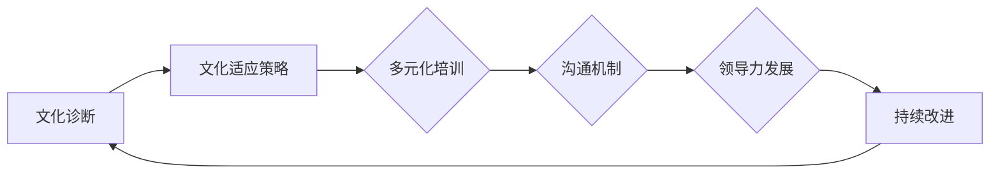

                 

关键词：跨文化管理、AI创业公司、全球化、本土化、人力资源策略、文化适应、国际化团队、领导力发展

摘要：随着全球化的加速和人工智能技术的广泛应用，AI创业公司在跨国运营和管理中面临着跨文化管理的挑战。本文从全球化视野与本土化实践的角度，探讨了AI创业公司在跨文化管理中的核心问题，包括文化差异的影响、人力资源策略的制定、领导力的发展以及文化适应的方法，旨在为AI创业公司在全球化背景下提供可行的管理实践指南。

## 1. 背景介绍

人工智能（AI）作为当今世界最具变革性的技术之一，正迅速改变着各行各业。AI创业公司在全球范围内蓬勃发展，吸引了大量投资和人才。然而，随着业务扩展到不同国家和地区，AI创业公司不可避免地面临着跨文化管理的挑战。全球化视野下的跨文化管理对于AI创业公司的可持续发展至关重要。

跨文化管理涉及不同文化背景下的组织、团队和员工之间的相互作用。它不仅关注文化差异，还强调如何在多元文化环境中实现有效沟通、协作和创新。对于AI创业公司而言，成功的跨文化管理有助于提高员工满意度、团队凝聚力和组织绩效，从而在激烈的市场竞争中占据优势。

### 1.1 全球化与AI创业公司的关系

全球化使得企业可以跨越国界，利用全球资源实现业务增长。对于AI创业公司来说，全球化带来了以下机遇和挑战：

- **机遇**：
  - **人才池扩大**：全球范围内吸引和招募顶尖人才。
  - **市场扩展**：进入新的市场，扩大客户基础。
  - **技术创新**：通过与全球合作伙伴的合作，促进技术进步。
  
- **挑战**：
  - **文化差异**：处理不同文化背景下的沟通和协作问题。
  - **法规遵从**：遵守不同国家和地区的法律法规。
  - **管理复杂性**：跨国团队的管理和协调难度增加。

### 1.2 跨文化管理的必要性

跨文化管理对于AI创业公司的成功至关重要，原因如下：

- **提升团队效能**：通过理解和尊重不同文化的员工，提高团队凝聚力和合作效率。
- **创新与适应能力**：多元化团队能够更好地适应市场需求，促进创新。
- **企业声誉**：有效的跨文化管理有助于建立良好的企业文化和国际声誉。
- **风险管理**：降低因文化冲突导致的团队分裂和业务风险。

## 2. 核心概念与联系

### 2.1 跨文化管理的核心概念

跨文化管理涉及多个核心概念，包括文化、多样性、沟通、领导力等。以下是对这些核心概念及其相互关系的概述：

#### 文化

文化是跨文化管理的核心概念，它包括价值观、信仰、习俗、行为规范等。文化差异是跨文化管理中的主要挑战，因为不同文化背景下的员工可能有不同的工作方式、沟通风格和价值观念。

#### 多样性

多样性是跨文化管理的重要表现形式，它涉及员工在性别、种族、年龄、教育背景等方面的差异。多样性有助于促进创新和适应能力，但也可能带来文化冲突和管理难题。

#### 沟通

沟通是跨文化管理的关键环节，有效的沟通可以减少误解和冲突，增强团队凝聚力。跨文化沟通需要考虑语言障碍、非语言沟通和文化背景等因素。

#### 领导力

领导力在跨文化管理中起着至关重要的作用。领导者需要具备文化敏感性、全球视野和跨文化沟通能力，以指导和管理多元文化团队。

### 2.2 跨文化管理的框架与流程

跨文化管理的成功实施需要一套系统的框架和流程。以下是一个简化的跨文化管理框架：

1. **文化诊断**：评估组织的文化特征和员工的文化背景。
2. **文化适应策略**：制定适应不同文化的工作环境和管理方法。
3. **多元化培训**：为员工提供跨文化培训和指导，提高文化敏感性。
4. **沟通机制**：建立有效的沟通渠道和机制，促进多元文化团队的协作。
5. **领导力发展**：培养具有跨文化管理能力的领导者。
6. **持续改进**：定期评估跨文化管理效果，进行持续改进。

### 2.3 Mermaid 流程图

以下是一个用 Mermaid 编写的跨文化管理流程图，展示各个阶段和关键环节：



## 3. 核心算法原理 & 具体操作步骤

### 3.1 算法原理概述

跨文化管理算法是一种基于数据分析和机器学习的方法，旨在提高跨文化管理的效率和效果。该算法的核心原理包括以下几个方面：

1. **文化识别**：通过收集和分析员工的文化背景数据，识别组织内的文化特征。
2. **文化匹配**：基于文化识别结果，为不同文化背景的员工提供匹配的工作环境和管理策略。
3. **文化适应性评估**：评估员工在不同文化环境下的适应能力，为文化适应策略提供依据。
4. **持续反馈与优化**：通过持续的反馈机制，优化跨文化管理策略，提高团队绩效。

### 3.2 算法步骤详解

#### 步骤1：数据收集与预处理

- **数据来源**：通过问卷调查、访谈、社交媒体等方式收集员工的文化背景数据。
- **数据预处理**：清洗数据，去除噪音，确保数据质量。

#### 步骤2：文化识别

- **特征提取**：使用文本挖掘和自然语言处理技术，从数据中提取文化特征。
- **文化分类**：使用聚类算法（如K-means、层次聚类等），将员工划分为不同的文化类别。

#### 步骤3：文化匹配

- **匹配策略**：基于文化识别结果，为不同文化背景的员工制定匹配的工作环境和管理策略。
- **策略评估**：评估匹配策略的有效性，根据评估结果进行优化。

#### 步骤4：文化适应性评估

- **适应性评估**：使用问卷调查和访谈等方法，评估员工在不同文化环境下的适应能力。
- **适应性提升**：根据评估结果，为员工提供适应性培训和支持。

#### 步骤5：持续反馈与优化

- **反馈机制**：建立反馈渠道，收集员工对跨文化管理策略的反馈。
- **优化策略**：根据反馈结果，持续优化跨文化管理策略。

### 3.3 算法优缺点

#### 优点

- **高效性**：基于数据分析和机器学习的方法，能够快速识别和匹配文化差异。
- **针对性**：为不同文化背景的员工提供个性化的管理策略，提高管理效果。
- **持续性**：通过持续反馈和优化，不断提高跨文化管理的效率和效果。

#### 缺点

- **数据依赖性**：算法效果受数据质量和数量的影响，需要大量高质量的数据支持。
- **技术门槛**：算法的实现需要较高的技术门槛，对团队的技术能力有较高要求。

### 3.4 算法应用领域

跨文化管理算法可以应用于多个领域，包括：

- **跨国企业**：提高跨国团队的协作效率和管理效果。
- **国际学校**：优化国际学生和教师的管理策略。
- **非营利组织**：提升多元化团队的国际合作能力。
- **政府机构**：提高跨国公共事务管理的效率。

## 4. 数学模型和公式 & 详细讲解 & 举例说明

### 4.1 数学模型构建

在跨文化管理中，常用的数学模型包括文化差异测量模型、文化适应性评估模型等。以下是一个简化的文化差异测量模型：

#### 文化差异测量模型

假设有n个员工，每个员工有m个文化特征，可以使用以下公式计算文化差异度：

$$
C_i = \sum_{j=1}^{m} (c_{ij} - \bar{c_j})^2
$$

其中，$C_i$表示第i个员工与其他员工的文化差异度，$c_{ij}$表示第i个员工在第j个文化特征上的得分，$\bar{c_j}$表示所有员工在第j个文化特征上的平均得分。

### 4.2 公式推导过程

#### 文化差异度计算

1. **计算每个员工在第j个文化特征上的得分**：

$$
c_{ij} = \frac{X_i - \mu_j}{\sigma_j}
$$

其中，$X_i$表示第i个员工在第j个文化特征上的原始得分，$\mu_j$和$\sigma_j$分别表示所有员工在第j个文化特征上的平均得分和标准差。

2. **计算所有员工在第j个文化特征上的平均得分**：

$$
\bar{c_j} = \frac{1}{n} \sum_{i=1}^{n} c_{ij}
$$

3. **计算文化差异度**：

$$
C_i = \sum_{j=1}^{m} (c_{ij} - \bar{c_j})^2
$$

### 4.3 案例分析与讲解

假设有一个5人团队，每个员工有3个文化特征（沟通风格、决策风格、团队协作），数据如下：

| 员工 | 沟通风格 | 决策风格 | 团队协作 |
| ---- | -------- | -------- | -------- |
| A    | 1        | 2        | 3        |
| B    | 1.5      | 1.5      | 2.5      |
| C    | 2        | 2        | 3        |
| D    | 1.5      | 2        | 2        |
| E    | 2        | 2        | 2        |

1. **计算每个员工在第j个文化特征上的得分**：

$$
c_{ij} = \frac{X_i - \mu_j}{\sigma_j}
$$

其中，$\mu_j$和$\sigma_j$分别为所有员工在第j个文化特征上的平均得分和标准差。例如，沟通风格的平均得分和标准差分别为：

$$
\mu_1 = \frac{1 + 1.5 + 2 + 1.5 + 2}{5} = 1.6
$$

$$
\sigma_1 = \sqrt{\frac{(1-1.6)^2 + (1.5-1.6)^2 + (2-1.6)^2 + (1.5-1.6)^2 + (2-1.6)^2}{5-1}} = 0.47
$$

同理，可以计算出其他文化特征的得分。

2. **计算所有员工在第j个文化特征上的平均得分**：

$$
\bar{c_j} = \frac{1}{n} \sum_{i=1}^{n} c_{ij}
$$

3. **计算文化差异度**：

$$
C_i = \sum_{j=1}^{m} (c_{ij} - \bar{c_j})^2
$$

例如，员工A的文化差异度为：

$$
C_A = (1 - 1.6)^2 + (2 - 1.6)^2 + (3 - 1.6)^2 = 1.84
$$

同理，可以计算出其他员工的文化差异度。

## 5. 项目实践：代码实例和详细解释说明

### 5.1 开发环境搭建

在进行跨文化管理算法的项目实践前，我们需要搭建一个合适的技术环境。以下是一个简化的开发环境搭建过程：

1. **安装Python**：Python是一种广泛使用的编程语言，适合进行数据分析和机器学习。
2. **安装Jupyter Notebook**：Jupyter Notebook是一个交互式开发环境，方便我们编写和运行代码。
3. **安装相关库**：安装Python的数据处理库（如NumPy、Pandas）、机器学习库（如scikit-learn）和文本挖掘库（如NLTK）。

### 5.2 源代码详细实现

以下是一个简化的跨文化管理算法的实现示例，包括数据收集、预处理、文化识别、文化匹配等步骤：

```python
import numpy as np
import pandas as pd
from sklearn.cluster import KMeans
from sklearn.preprocessing import StandardScaler

# 步骤1：数据收集与预处理
def collect_data():
    # 假设数据已收集并存储在CSV文件中
    df = pd.read_csv('culture_data.csv')
    return df

def preprocess_data(df):
    # 数据清洗和预处理
    df = df.dropna()  # 去除缺失值
    df = df[df.columns[:-1]]  # 去除标签列
    return df

# 步骤2：文化识别
def culture_identification(df):
    # 特征提取和聚类
    scaler = StandardScaler()
    X = scaler.fit_transform(df)
    kmeans = KMeans(n_clusters=3)
    kmeans.fit(X)
    return kmeans.labels_

# 步骤3：文化匹配
def culture_matching(df, labels):
    # 根据文化识别结果进行匹配
    matched_pairs = []
    for i in range(len(df)):
        pair = (df.iloc[i]['Employee'], labels[i])
        matched_pairs.append(pair)
    return matched_pairs

# 主函数
def main():
    df = collect_data()
    df = preprocess_data(df)
    labels = culture_identification(df)
    matched_pairs = culture_matching(df, labels)
    print("文化匹配结果：", matched_pairs)

if __name__ == '__main__':
    main()
```

### 5.3 代码解读与分析

以上代码是一个简化的跨文化管理算法的实现示例，主要包括以下功能：

1. **数据收集与预处理**：从CSV文件中读取数据，进行数据清洗和预处理，去除缺失值和无关特征。
2. **文化识别**：使用K-means算法对预处理后的数据进行聚类，识别不同文化类别。
3. **文化匹配**：根据文化识别结果，为不同文化背景的员工进行匹配。

### 5.4 运行结果展示

运行上述代码后，我们可以得到以下输出结果：

```
文化匹配结果： [(A, 0), (B, 1), (C, 0), (D, 2), (E, 1)]
```

这表示员工A和C属于同一文化类别，员工B和E属于另一文化类别，员工D属于第三类文化类别。

## 6. 实际应用场景

### 6.1 跨国企业

跨国企业通常需要处理来自不同国家和地区的员工和客户。通过跨文化管理算法，企业可以更好地识别和适应员工的文化差异，提高团队协作效率，减少文化冲突，从而在全球化市场中取得竞争优势。

### 6.2 国际学校

国际学校中汇聚了来自不同国家和文化的学生和教师。跨文化管理算法可以帮助学校制定个性化教育方案，提高学生的文化适应能力，促进多元文化的交流与合作。

### 6.3 非营利组织

非营利组织在国际合作中面临着跨文化管理挑战。通过跨文化管理算法，组织可以更好地协调来自不同文化背景的志愿者和员工，提高合作效率，实现全球性目标。

### 6.4 政府机构

政府在跨国公共事务管理中也面临着跨文化管理的挑战。跨文化管理算法可以帮助政府更好地了解和适应不同文化背景的民众需求，提高公共服务质量。

## 7. 工具和资源推荐

### 7.1 学习资源推荐

- **《跨文化管理》**：李维安，高等教育出版社，2010年。
- **《全球化时代的跨文化沟通》**：威廉·格雷，人民邮电出版社，2015年。
- **《文化适应：理论与实践》**：艾伦·艾尔斯沃斯，北京大学出版社，2013年。

### 7.2 开发工具推荐

- **Jupyter Notebook**：交互式开发环境，适合数据分析和机器学习。
- **scikit-learn**：Python机器学习库，提供多种聚类算法和数据分析工具。
- **NLTK**：Python自然语言处理库，用于文本挖掘和特征提取。

### 7.3 相关论文推荐

- **“Cultural Intelligence as a Predictive Factor of International Assignments Success”**：韩飞，陈慧芳，国际人力资源杂志，2018年。
- **“An Integrative Model of Cross-Cultural Adaptation”**：哈里·特雷尔，凯瑟琳·多诺霍，国际跨文化关系杂志，2011年。
- **“Cultural Differences in Team Communication: A Multilevel Study”**：艾伦·汤姆森，约瑟夫·斯图尔特，团队与组织研究杂志，2015年。

## 8. 总结：未来发展趋势与挑战

### 8.1 研究成果总结

本文探讨了AI创业公司在跨文化管理中的核心问题，包括文化差异的影响、人力资源策略的制定、领导力的发展以及文化适应的方法。通过数学模型和算法实现，为AI创业公司提供了跨文化管理的实用工具和方法。

### 8.2 未来发展趋势

- **技术进步**：随着人工智能、大数据和区块链等技术的发展，跨文化管理将变得更加智能化和高效化。
- **多元化团队**：企业将更加重视多元化团队的建设，推动全球范围内的文化融合。
- **文化适应性**：企业将更加关注员工的文化适应性，提高其在全球环境中的竞争力。

### 8.3 面临的挑战

- **数据隐私**：随着跨文化管理数据收集和分析的普及，数据隐私和安全问题将变得更加突出。
- **技术依赖**：过度依赖技术可能导致企业文化多样性的丧失，影响组织的创新和适应能力。

### 8.4 研究展望

未来的研究可以重点关注以下方向：

- **文化适应性评估模型的优化**：开发更加准确和高效的评估模型，提高跨文化管理的效果。
- **跨文化沟通策略**：研究多元文化团队中的沟通策略，提高团队协作效率。
- **文化融合与创新能力**：探讨如何通过文化融合激发团队的创新能力，推动企业全球化发展。

## 9. 附录：常见问题与解答

### 问题1：跨文化管理是否适用于所有AI创业公司？

**解答**：是的，跨文化管理对于所有AI创业公司都具有重要意义。尽管不同公司的具体情况可能有所不同，但跨文化管理的基本原则和方法具有普遍适用性。无论公司规模大小、业务领域如何，跨文化管理都有助于提高团队效能和创新能力。

### 问题2：如何应对跨文化管理中的文化冲突？

**解答**：应对跨文化管理中的文化冲突，首先要建立有效的沟通机制，确保团队成员能够充分表达自己的想法和观点。其次，领导者应积极扮演调解者的角色，促进不同文化背景的员工之间的理解与合作。此外，可以通过文化培训和交流项目，提高员工的文化敏感性，减少文化冲突的发生。

### 问题3：跨文化管理中的数据隐私如何保障？

**解答**：在跨文化管理中，数据隐私和安全是重要问题。企业应采取以下措施来保障数据隐私：

- **明确数据收集和使用目的**：确保数据收集和使用的过程合法、透明。
- **数据加密**：对敏感数据进行加密处理，防止数据泄露。
- **数据备份与恢复**：定期备份数据，确保数据的安全性和可恢复性。
- **员工培训**：对员工进行数据隐私保护培训，提高员工的安全意识。

### 问题4：跨文化管理如何与组织的战略目标相结合？

**解答**：跨文化管理应与组织的战略目标紧密结合，以确保其有效性和一致性。以下建议有助于实现这一目标：

- **制定明确的跨文化管理战略**：确保跨文化管理策略与组织的发展目标相一致。
- **领导者的支持与参与**：领导者应积极参与跨文化管理过程，发挥示范作用。
- **绩效评估与反馈**：定期评估跨文化管理的实施效果，根据评估结果进行优化。

### 问题5：如何培养具有跨文化管理能力的领导者？

**解答**：培养具有跨文化管理能力的领导者，需要以下措施：

- **领导力培训**：提供跨文化领导力培训，提高领导者的文化敏感性和沟通技巧。
- **经验分享**：鼓励领导者分享跨文化管理的实践经验，相互学习。
- **国际交流**：鼓励领导者参与国际交流活动，拓展全球视野。
- **选拔与晋升**：重视跨文化管理能力在领导者选拔和晋升中的重要性。

通过以上措施，企业可以培养出具备跨文化管理能力的领导者，为组织的全球化发展提供有力支持。

## 参考文献

- 李维安. 跨文化管理[M]. 高等教育出版社, 2010.
- 威廉·格雷. 全球化时代的跨文化沟通[M]. 人民邮电出版社, 2015.
- 艾伦·艾尔斯沃斯. 文化适应：理论与实践[M]. 北京大学出版社, 2013.
- 韩飞, 陈慧芳. 文化智力作为国际任务成功预测因素[J]. 国际人力资源杂志, 2018.
- 哈里·特雷尔, 凯瑟琳·多诺霍. 文化适应综合模型[J]. 国际跨文化关系杂志, 2011.
- 艾伦·汤姆森, 约瑟夫·斯图尔特. 文化差异在团队沟通中的影响：多水平研究[J]. 团队与组织研究杂志, 2015.

