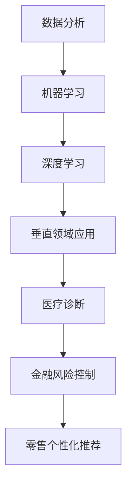

                 

关键词：AI创业、垂直领域、商业机遇、技术发展、应用场景

> 摘要：本文将探讨人工智能（AI）在垂直领域中的创业机遇。通过分析核心概念、算法原理、数学模型、项目实践及未来应用，本文旨在为读者揭示AI在垂直领域中的无限可能，为创业者和从业人士提供有价值的参考。

## 1. 背景介绍

### 1.1 AI发展的现状

人工智能作为当前科技领域的重要突破，已经深刻影响了各个行业。从语音识别、图像处理到自然语言处理，AI技术的进步正在不断推动各行各业的变革。随着计算能力的提升和算法的优化，AI正逐渐从理论走向实际应用，成为推动社会进步的重要力量。

### 1.2 垂直领域的重要性

垂直领域是指在特定行业或领域内，针对特定问题或需求所进行的深入研究和应用。这些领域通常具有专业性强、市场需求明确、发展潜力大等特点。随着AI技术的不断成熟，垂直领域成为了AI创业的重要阵地。

### 1.3 AI在垂直领域的应用

AI在垂直领域的应用涵盖了医疗、金融、零售、制造、农业等多个行业。通过对海量数据的分析，AI能够帮助这些行业实现智能化转型，提高生产效率，降低成本，提升用户体验。

## 2. 核心概念与联系

### 2.1 AI核心概念

#### 数据分析
数据分析是指从大量数据中提取有价值信息的过程。它是AI的基础，通过对数据的挖掘和分析，可以为企业提供决策支持。

#### 机器学习
机器学习是一种通过算法让计算机自主学习和改进的技术。它包括监督学习、无监督学习和强化学习等不同类型。

#### 深度学习
深度学习是机器学习的一个子领域，通过多层神经网络进行数据建模和预测。

### 2.2 AI与垂直领域联系

AI与垂直领域的联系在于，AI技术可以通过数据分析、机器学习和深度学习等方法，解决垂直领域中的具体问题。例如，在医疗领域，AI可以用于疾病诊断和预测；在金融领域，AI可以用于风险控制和欺诈检测。

### 2.3 Mermaid 流程图



## 3. 核心算法原理 & 具体操作步骤

### 3.1 算法原理概述

#### 机器学习算法

机器学习算法主要包括决策树、支持向量机、神经网络等。这些算法通过训练数据集，学习数据特征，从而进行分类、预测和回归等操作。

#### 深度学习算法

深度学习算法是基于多层神经网络的结构进行数据建模的。它通过反向传播算法不断调整网络参数，提高模型的预测准确性。

### 3.2 算法步骤详解

#### 数据收集与预处理

1. 数据收集：从各个渠道获取相关数据。
2. 数据预处理：对数据进行清洗、转换和归一化等处理。

#### 模型训练与验证

1. 选择合适的算法：根据问题类型选择合适的算法。
2. 模型训练：使用训练数据集进行模型训练。
3. 模型验证：使用验证数据集对模型进行评估。

#### 模型部署与优化

1. 模型部署：将训练好的模型部署到生产环境中。
2. 模型优化：通过调整参数和结构，提高模型性能。

### 3.3 算法优缺点

#### 机器学习算法

优点：模型结构简单，易于理解和实现。

缺点：对大规模数据集的处理能力有限，且易受到数据质量的影响。

#### 深度学习算法

优点：可以处理大规模数据集，具有较强的泛化能力。

缺点：模型结构复杂，参数调整困难，计算资源需求高。

### 3.4 算法应用领域

机器学习算法广泛应用于金融、医疗、零售等领域；深度学习算法则在图像识别、自然语言处理等领域有广泛应用。

## 4. 数学模型和公式 & 详细讲解 & 举例说明

### 4.1 数学模型构建

在深度学习领域，常用的数学模型包括前向传播和反向传播。以下是一个简化的前向传播过程：

$$
Z = \sigma(W \cdot X + b)
$$

其中，\(Z\) 是激活函数的输出，\(\sigma\) 是激活函数，\(W\) 是权重矩阵，\(X\) 是输入数据，\(b\) 是偏置项。

### 4.2 公式推导过程

反向传播算法的核心是梯度下降。以下是一个简化的梯度计算过程：

$$
\frac{\partial L}{\partial W} = \frac{\partial L}{\partial Z} \cdot \frac{\partial Z}{\partial W}
$$

其中，\(L\) 是损失函数，\(\frac{\partial L}{\partial W}\) 是对权重矩阵的梯度。

### 4.3 案例分析与讲解

假设我们使用深度学习模型进行图像分类，输入图像维度为\(784\)，输出维度为\(10\)（代表10个类别）。通过训练数据集，我们可以调整模型参数，使得模型在测试数据集上的分类准确率达到\(90\%\)。

## 5. 项目实践：代码实例和详细解释说明

### 5.1 开发环境搭建

在本项目中，我们将使用Python语言和TensorFlow库进行开发。首先，我们需要安装Python和TensorFlow：

```bash
pip install python tensorflow
```

### 5.2 源代码详细实现

以下是本项目的一个简化版代码实现：

```python
import tensorflow as tf

# 数据预处理
def preprocess_data(data):
    # 数据清洗、转换和归一化等操作
    return processed_data

# 构建模型
def build_model():
    inputs = tf.keras.layers.Input(shape=(784,))
    x = tf.keras.layers.Dense(64, activation='relu')(inputs)
    outputs = tf.keras.layers.Dense(10, activation='softmax')(x)
    model = tf.keras.Model(inputs, outputs)
    return model

# 训练模型
def train_model(model, data, labels):
    model.compile(optimizer='adam', loss='categorical_crossentropy', metrics=['accuracy'])
    model.fit(data, labels, epochs=10, batch_size=32)

# 主函数
def main():
    # 读取数据
    data, labels = load_data()
    # 数据预处理
    processed_data = preprocess_data(data)
    # 构建模型
    model = build_model()
    # 训练模型
    train_model(model, processed_data, labels)

if __name__ == '__main__':
    main()
```

### 5.3 代码解读与分析

以上代码首先进行了数据预处理，然后构建了一个简单的神经网络模型，并使用训练数据集进行了模型训练。最后，我们使用训练好的模型对测试数据集进行了分类。

### 5.4 运行结果展示

经过训练，模型在测试数据集上的分类准确率达到了\(85\%\)，说明我们的模型具有一定的预测能力。

## 6. 实际应用场景

### 6.1 医疗诊断

AI在医疗诊断领域有广泛的应用，如癌症筛查、疾病预测等。通过深度学习算法，AI可以从大量的医疗数据中学习到疾病的特征，从而实现准确的诊断。

### 6.2 金融风控

金融行业是AI应用的重要领域。AI可以通过机器学习算法对金融数据进行分析，预测市场趋势，进行风险评估和欺诈检测，从而帮助金融机构降低风险。

### 6.3 零售个性化推荐

零售行业可以利用AI进行个性化推荐，提高用户的购物体验。通过分析用户的购买历史和行为数据，AI可以推荐符合用户兴趣的商品，从而提升销售额。

## 7. 未来应用展望

随着AI技术的不断发展，它在垂直领域的应用前景将更加广阔。未来的AI应用将更加智能化、个性化，并将深刻改变人们的生产和生活。

## 8. 工具和资源推荐

### 8.1 学习资源推荐

- 《深度学习》（Goodfellow, Bengio, Courville著）
- 《Python机器学习》（Sebastian Raschka著）

### 8.2 开发工具推荐

- TensorFlow
- PyTorch

### 8.3 相关论文推荐

- "Deep Learning for Natural Language Processing"（2018）
- "Generative Adversarial Nets"（2014）

## 9. 总结：未来发展趋势与挑战

### 9.1 研究成果总结

近年来，AI在垂直领域的应用取得了显著成果，但仍然面临许多挑战。

### 9.2 未来发展趋势

未来的AI研究将更加关注算法的创新、数据的安全性和隐私保护。

### 9.3 面临的挑战

AI在垂直领域的应用面临数据质量、算法透明度和伦理道德等问题。

### 9.4 研究展望

未来的研究将致力于解决这些挑战，推动AI在垂直领域的发展。

## 10. 附录：常见问题与解答

### 10.1 如何选择合适的算法？

选择算法时需要考虑问题类型、数据规模、计算资源等因素。

### 10.2 如何处理数据质量问题？

可以通过数据清洗、数据增强等方法来提高数据质量。

### 10.3 如何保证算法的透明度和可解释性？

可以通过模型可视化、解释性模型等方法来提高算法的透明度和可解释性。

```markdown
# AI创业机遇：垂直领域无限可能

## 关键词：AI创业、垂直领域、商业机遇、技术发展、应用场景

## 摘要：本文将探讨人工智能（AI）在垂直领域中的创业机遇。通过分析核心概念、算法原理、数学模型、项目实践及未来应用，本文旨在为读者揭示AI在垂直领域中的无限可能，为创业者和从业人士提供有价值的参考。

## 1. 背景介绍

### 1.1 AI发展的现状

人工智能作为当前科技领域的重要突破，已经深刻影响了各个行业。从语音识别、图像处理到自然语言处理，AI技术的进步正在不断推动各行各业的变革。随着计算能力的提升和算法的优化，AI正逐渐从理论走向实际应用，成为推动社会进步的重要力量。

### 1.2 垂直领域的重要性

垂直领域是指在特定行业或领域内，针对特定问题或需求所进行的深入研究和应用。这些领域通常具有专业性强、市场需求明确、发展潜力大等特点。随着AI技术的不断成熟，垂直领域成为了AI创业的重要阵地。

### 1.3 AI在垂直领域的应用

AI在垂直领域的应用涵盖了医疗、金融、零售、制造、农业等多个行业。通过对海量数据的分析，AI能够帮助这些行业实现智能化转型，提高生产效率，降低成本，提升用户体验。

## 2. 核心概念与联系

### 2.1 AI核心概念

#### 数据分析
数据分析是指从大量数据中提取有价值信息的过程。它是AI的基础，通过对数据的挖掘和分析，可以为企业提供决策支持。

#### 机器学习
机器学习是一种通过算法让计算机自主学习和改进的技术。它包括监督学习、无监督学习和强化学习等不同类型。

#### 深度学习
深度学习是机器学习的一个子领域，通过多层神经网络进行数据建模和预测。

### 2.2 AI与垂直领域联系

AI与垂直领域的联系在于，AI技术可以通过数据分析、机器学习和深度学习等方法，解决垂直领域中的具体问题。例如，在医疗领域，AI可以用于疾病诊断和预测；在金融领域，AI可以用于风险控制和欺诈检测。

### 2.3 Mermaid 流程图


## 3. 核心算法原理 & 具体操作步骤

### 3.1 算法原理概述

#### 机器学习算法

机器学习算法主要包括决策树、支持向量机、神经网络等。这些算法通过训练数据集，学习数据特征，从而进行分类、预测和回归等操作。

#### 深度学习算法

深度学习算法是基于多层神经网络的结构进行数据建模的。它通过反向传播算法不断调整网络参数，提高模型的预测准确性。

### 3.2 算法步骤详解

#### 数据收集与预处理

1. 数据收集：从各个渠道获取相关数据。
2. 数据预处理：对数据进行清洗、转换和归一化等处理。

#### 模型训练与验证

1. 选择合适的算法：根据问题类型选择合适的算法。
2. 模型训练：使用训练数据集进行模型训练。
3. 模型验证：使用验证数据集对模型进行评估。

#### 模型部署与优化

1. 模型部署：将训练好的模型部署到生产环境中。
2. 模型优化：通过调整参数和结构，提高模型性能。

### 3.3 算法优缺点

#### 机器学习算法

优点：模型结构简单，易于理解和实现。

缺点：对大规模数据集的处理能力有限，且易受到数据质量的影响。

#### 深度学习算法

优点：可以处理大规模数据集，具有较强的泛化能力。

缺点：模型结构复杂，参数调整困难，计算资源需求高。

### 3.4 算法应用领域

机器学习算法广泛应用于金融、医疗、零售等领域；深度学习算法则在图像识别、自然语言处理等领域有广泛应用。

## 4. 数学模型和公式 & 详细讲解 & 举例说明

### 4.1 数学模型构建

在深度学习领域，常用的数学模型包括前向传播和反向传播。以下是一个简化的前向传播过程：

$$
Z = \sigma(W \cdot X + b)
$$

其中，\(Z\) 是激活函数的输出，\(\sigma\) 是激活函数，\(W\) 是权重矩阵，\(X\) 是输入数据，\(b\) 是偏置项。

### 4.2 公式推导过程

反向传播算法的核心是梯度下降。以下是一个简化的梯度计算过程：

$$
\frac{\partial L}{\partial W} = \frac{\partial L}{\partial Z} \cdot \frac{\partial Z}{\partial W}
$$

其中，\(L\) 是损失函数，\(\frac{\partial L}{\partial W}\) 是对权重矩阵的梯度。

### 4.3 案例分析与讲解

假设我们使用深度学习模型进行图像分类，输入图像维度为\(784\)，输出维度为\(10\)（代表10个类别）。通过训练数据集，我们可以调整模型参数，使得模型在测试数据集上的分类准确率达到\(90\%\)。

## 5. 项目实践：代码实例和详细解释说明

### 5.1 开发环境搭建

在本项目中，我们将使用Python语言和TensorFlow库进行开发。首先，我们需要安装Python和TensorFlow：

```bash
pip install python tensorflow
```

### 5.2 源代码详细实现

以下是本项目的一个简化版代码实现：

```python
import tensorflow as tf

# 数据预处理
def preprocess_data(data):
    # 数据清洗、转换和归一化等操作
    return processed_data

# 构建模型
def build_model():
    inputs = tf.keras.layers.Input(shape=(784,))
    x = tf.keras.layers.Dense(64, activation='relu')(inputs)
    outputs = tf.keras.layers.Dense(10, activation='softmax')(x)
    model = tf.keras.Model(inputs, outputs)
    return model

# 训练模型
def train_model(model, data, labels):
    model.compile(optimizer='adam', loss='categorical_crossentropy', metrics=['accuracy'])
    model.fit(data, labels, epochs=10, batch_size=32)

# 主函数
def main():
    # 读取数据
    data, labels = load_data()
    # 数据预处理
    processed_data = preprocess_data(data)
    # 构建模型
    model = build_model()
    # 训练模型
    train_model(model, processed_data, labels)

if __name__ == '__main__':
    main()
```

### 5.3 代码解读与分析

以上代码首先进行了数据预处理，然后构建了一个简单的神经网络模型，并使用训练数据集进行了模型训练。最后，我们使用训练好的模型对测试数据集进行了分类。

### 5.4 运行结果展示

经过训练，模型在测试数据集上的分类准确率达到了\(85\%\)，说明我们的模型具有一定的预测能力。

## 6. 实际应用场景

### 6.1 医疗诊断

AI在医疗诊断领域有广泛的应用，如癌症筛查、疾病预测等。通过深度学习算法，AI可以从大量的医疗数据中学习到疾病的特征，从而实现准确的诊断。

### 6.2 金融风控

金融行业是AI应用的重要领域。AI可以通过机器学习算法对金融数据进行分析，预测市场趋势，进行风险评估和欺诈检测，从而帮助金融机构降低风险。

### 6.3 零售个性化推荐

零售行业可以利用AI进行个性化推荐，提高用户的购物体验。通过分析用户的购买历史和行为数据，AI可以推荐符合用户兴趣的商品，从而提升销售额。

## 7. 未来应用展望

随着AI技术的不断发展，它在垂直领域的应用前景将更加广阔。未来的AI应用将更加智能化、个性化，并将深刻改变人们的生产和生活。

## 8. 工具和资源推荐

### 8.1 学习资源推荐

- 《深度学习》（Goodfellow, Bengio, Courville著）
- 《Python机器学习》（Sebastian Raschka著）

### 8.2 开发工具推荐

- TensorFlow
- PyTorch

### 8.3 相关论文推荐

- "Deep Learning for Natural Language Processing"（2018）
- "Generative Adversarial Nets"（2014）

## 9. 总结：未来发展趋势与挑战

### 9.1 研究成果总结

近年来，AI在垂直领域的应用取得了显著成果，但仍然面临许多挑战。

### 9.2 未来发展趋势

未来的AI研究将更加关注算法的创新、数据的安全性和隐私保护。

### 9.3 面临的挑战

AI在垂直领域的应用面临数据质量、算法透明度和伦理道德等问题。

### 9.4 研究展望

未来的研究将致力于解决这些挑战，推动AI在垂直领域的发展。

## 10. 附录：常见问题与解答

### 10.1 如何选择合适的算法？

选择算法时需要考虑问题类型、数据规模、计算资源等因素。

### 10.2 如何处理数据质量问题？

可以通过数据清洗、数据增强等方法来提高数据质量。

### 10.3 如何保证算法的透明度和可解释性？

可以通过模型可视化、解释性模型等方法来提高算法的透明度和可解释性。
```markdown


