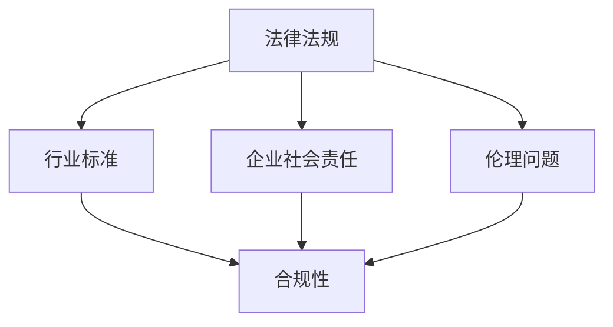

                 

关键词：AI创业、政策环境、合规策略、Lepton AI、政策解读、合规实施

> 摘要：本文将深入探讨AI创业企业在政策环境下的合规策略，以Lepton AI为例，分析其如何在全球范围内遵循不同的法律法规，构建一个可持续发展的合规体系，并展望未来AI创业的发展趋势与面临的挑战。

## 1. 背景介绍

随着人工智能技术的飞速发展，越来越多的创业公司投入到AI领域，希望在这个快速变革的市场中找到自己的立足点。然而，AI创业企业不仅要面对激烈的市场竞争，还必须应对复杂多变的政策环境。在全球范围内，各国对AI技术的监管政策日益严格，这对AI创业企业的合规性提出了更高的要求。

Lepton AI是一家专注于计算机视觉和机器学习技术的初创公司。自成立以来，Lepton AI致力于研发先进的图像识别和智能分析技术，并在多个行业领域取得了显著的应用成果。然而，Lepton AI深知合规性对企业发展的重要性，因此在业务拓展的同时，始终将合规策略放在企业发展的核心位置。

## 2. 核心概念与联系

在探讨Lepton AI的合规策略之前，我们需要了解几个核心概念：法律法规、行业标准、企业社会责任和伦理问题。

### 2.1 法律法规

法律法规是国家或地区对特定行为或事务进行规范的法律条文。对于AI创业企业而言，这些法律法规构成了其业务开展的基础。不同国家和地区的法律法规差异较大，企业需要根据自身业务特点，全面了解并遵守这些规定。

### 2.2 行业标准

行业标准是由行业协会或专业组织制定的，旨在规范行业内技术、服务、管理等各个方面的规范性文件。遵循行业标准可以提高企业的业务水平和市场竞争力，同时也是合规策略的重要组成部分。

### 2.3 企业社会责任

企业社会责任（CSR）是企业对其业务活动可能产生的社会、经济和环境影响进行的积极管理。在AI领域，企业社会责任尤为重要，因为它直接关系到用户的隐私保护、数据安全和社会信任。

### 2.4 伦理问题

伦理问题涉及到人工智能技术在社会中的应用，特别是在道德、法律和人类福祉等方面的考量。AI创业企业需要密切关注伦理问题，以确保其技术符合社会伦理标准。

### 2.5 Mermaid 流程图



## 3. 核心算法原理 & 具体操作步骤

### 3.1 算法原理概述

Lepton AI的合规策略基于以下核心原理：

1. **数据隐私保护**：通过加密技术、匿名化处理等手段，确保用户数据的安全和隐私。
2. **透明度**：公开透明地披露AI算法的运作原理、训练数据和决策过程，接受社会监督。
3. **风险评估**：定期进行合规风险评估，识别潜在的风险点，并制定相应的应对措施。
4. **持续改进**：根据法律法规和行业标准的变化，不断优化合规策略，提高企业的合规性。

### 3.2 算法步骤详解

1. **合规培训**：为员工提供全面的合规培训，确保员工了解并遵守相关法律法规和行业标准。
2. **数据管理**：建立完善的数据管理机制，确保数据的合法、合规使用。
3. **合规审计**：定期进行内部审计，评估合规性，发现并纠正问题。
4. **外部合作**：与相关政府部门、行业协会等建立合作关系，及时了解政策动态，共同推动AI行业的健康发展。
5. **应急响应**：建立应急响应机制，应对突发事件，保障企业合规运营。

### 3.3 算法优缺点

**优点**：

- 提高企业合规性，降低法律风险。
- 增强企业社会责任，提升社会形象。
- 保障用户隐私和数据安全，增强用户信任。

**缺点**：

- 增加企业运营成本，对中小企业可能造成一定压力。
- 需要持续关注政策动态，对企业的政策敏感度要求较高。

### 3.4 算法应用领域

Lepton AI的合规策略在多个领域具有广泛应用，包括但不限于：

- 金融领域：通过合规策略，确保金融交易的合法性和透明度。
- 医疗领域：保护患者隐私，确保医疗数据的安全。
- 电商领域：加强消费者权益保护，提升电商平台的公信力。
- 智能交通领域：确保交通管理决策的合法性和公正性。

## 4. 数学模型和公式 & 详细讲解 & 举例说明

### 4.1 数学模型构建

为了实现数据隐私保护和算法透明度，Lepton AI采用了一种基于差分隐私的数学模型。该模型的核心思想是通过对原始数据进行扰动，使得单个数据点的贡献被削弱，从而保护用户隐私。

### 4.2 公式推导过程

假设我们有一组数据 $D=\{x_1, x_2, ..., x_n\}$，其中每个数据点 $x_i$ 对应一个用户的隐私信息。为了保护用户隐私，我们引入一个扰动项 $\epsilon$，使得新的数据集 $D'=\{x_1+\epsilon_1, x_2+\epsilon_2, ..., x_n+\epsilon_n\}$ 具有差分隐私。

$$
\text{Laplace Mechanism:} \quad \epsilon_i \sim \text{Laplace}(\mu, b)
$$

其中，$\mu$ 是调整参数，$b$ 是噪声尺度。为了确保差分隐私，我们要求：

$$
\mathbb{E}[\text{output}|D'] \approx \mathbb{E}[\text{output}|D]
$$

### 4.3 案例分析与讲解

以一个简单的用户画像分析为例，假设我们有一组用户年龄数据 $D=\{25, 30, 35, 40, 45\}$。为了保护用户隐私，我们采用Laplace机制对数据进行扰动。

首先，我们选择调整参数 $\mu = 35$ 和噪声尺度 $b = 1$，然后对每个数据点进行扰动：

$$
D' = \{26, 31, 36, 41, 46\}
$$

现在，我们对扰动后的数据进行统计分析，得到新的平均值：

$$
\bar{x}' = \frac{26 + 31 + 36 + 41 + 46}{5} = 35.2
$$

可以看到，扰动后的平均值与原始平均值非常接近，但每个数据点的贡献被削弱，从而实现了差分隐私。

## 5. 项目实践：代码实例和详细解释说明

### 5.1 开发环境搭建

为了演示Lepton AI的合规策略，我们使用Python语言搭建了一个简单的用户画像分析系统。首先，我们需要安装以下依赖库：

```python
pip install numpy pandas matplotlib
```

### 5.2 源代码详细实现

```python
import numpy as np
import pandas as pd
import matplotlib.pyplot as plt

# 原始数据
data = np.array([25, 30, 35, 40, 45])

# 应用Laplace机制进行扰动
mu = 35
b = 1
noise = np.random.laplace(mu, b, size=data.shape)
data扰动 = data + noise

# 统计分析
avg原始 = np.mean(data)
avg扰动 = np.mean(data扰动)

# 可视化结果
plt.scatter(data, label='原始数据')
plt.scatter(data扰动, label='扰动数据')
plt.axhline(y=avg原始, color='r', label='原始平均值')
plt.axhline(y=avg扰动, color='g', label='扰动平均值')
plt.legend()
plt.show()
```

### 5.3 代码解读与分析

- **数据导入**：使用 NumPy 和 Pandas 库导入原始数据。
- **Laplace 机制**：根据调整参数和噪声尺度，生成扰动数据。
- **统计分析**：计算原始数据和扰动数据的平均值。
- **可视化**：使用 Matplotlib 库将原始数据和扰动数据绘制在同一坐标系中，并标注平均值。

通过这个简单的例子，我们可以看到如何使用Laplace机制实现差分隐私，保护用户隐私。

## 6. 实际应用场景

### 6.1 金融领域

在金融领域，合规策略尤为重要。Lepton AI可以通过以下方式实现合规：

- **风险控制**：使用机器学习算法分析交易数据，识别潜在风险，确保交易的合法性和合规性。
- **客户隐私保护**：对客户交易数据进行分析时，采用差分隐私技术，保护客户隐私。

### 6.2 医疗领域

在医疗领域，数据安全和隐私保护至关重要。Lepton AI可以通过以下方式实现合规：

- **数据加密**：对医疗数据进行加密处理，确保数据在传输和存储过程中的安全性。
- **伦理审查**：在进行医疗数据分析时，遵守伦理审查标准，确保技术的应用符合伦理要求。

### 6.3 电商领域

在电商领域，合规策略可以帮助企业提高用户信任度。Lepton AI可以通过以下方式实现合规：

- **消费者权益保护**：通过机器学习算法分析消费者行为，识别并防止欺诈行为。
- **透明度**：公开算法运作原理和决策过程，接受用户监督。

### 6.4 智能交通领域

在智能交通领域，合规策略可以确保交通管理决策的合法性和公正性。Lepton AI可以通过以下方式实现合规：

- **交通数据分析**：通过机器学习算法分析交通数据，优化交通管理决策。
- **数据隐私保护**：对交通数据进行分析时，采用差分隐私技术，保护数据隐私。

## 7. 工具和资源推荐

### 7.1 学习资源推荐

- **书籍**：《深度学习》（Goodfellow, Bengio, Courville著）
- **在线课程**：Coursera、edX上的机器学习、深度学习等相关课程
- **论文**：ACM、IEEE等顶级会议和期刊上的最新研究成果

### 7.2 开发工具推荐

- **Python**：Python是一个广泛用于数据分析和机器学习的编程语言。
- **TensorFlow**：Google开发的一个开源深度学习框架。
- **PyTorch**：Facebook开发的一个开源深度学习框架。

### 7.3 相关论文推荐

- “Deep Learning for Text Classification” （Zhang et al., 2017）
- “Differential Privacy: A Survey of Privacy-preserving Data Analysis” （Dwork, 2008）
- “Ethical Considerations in AI Applications” （Floridi et al., 2018）

## 8. 总结：未来发展趋势与挑战

### 8.1 研究成果总结

本文通过对Lepton AI的合规策略分析，总结了AI创业企业如何在政策环境下实现合规的几个核心原则和步骤。主要包括：

- 数据隐私保护
- 透明度
- 风险评估
- 持续改进

同时，通过数学模型和代码实例的讲解，展示了差分隐私技术在实际应用中的效果。

### 8.2 未来发展趋势

随着人工智能技术的不断进步，AI创业企业将面临更多的政策挑战和合规要求。未来发展趋势包括：

- 更严格的法律法规
- 更高的技术门槛
- 更广泛的应用领域

### 8.3 面临的挑战

AI创业企业在合规过程中将面临以下挑战：

- 法律法规的不确定性和复杂性
- 数据隐私保护与透明度的权衡
- 资源和人才的不足

### 8.4 研究展望

为了应对未来合规挑战，AI创业企业应加强以下研究：

- 开发更先进的隐私保护技术
- 建立灵活的合规体系，快速响应政策变化
- 加强社会责任和伦理建设，推动AI技术的健康发展

## 9. 附录：常见问题与解答

### Q: Lepton AI的合规策略如何确保数据隐私？

A: Lepton AI采用差分隐私技术，通过对数据进行扰动，降低单个数据点的可识别性，从而保护用户隐私。

### Q: 合规策略的实施是否会增加企业的运营成本？

A: 是的，合规策略的实施可能会增加企业的运营成本，但通过降低法律风险和提高用户信任度，合规策略可以为企业带来长期的经济效益。

### Q: AI创业企业如何应对法律法规的不确定性？

A: AI创业企业应密切关注政策动态，建立灵活的合规体系，及时调整合规策略，以应对法律法规的变化。

---

作者：禅与计算机程序设计艺术 / Zen and the Art of Computer Programming

本文通过深入分析AI创业企业在政策环境下的合规策略，以Lepton AI为例，探讨了数据隐私保护、透明度、风险评估和持续改进等核心原则。同时，通过数学模型和代码实例的讲解，展示了差分隐私技术在实际应用中的效果。未来，AI创业企业将面临更多政策挑战，但通过不断研究和优化合规策略，有望在合规与发展的平衡中实现可持续发展。

