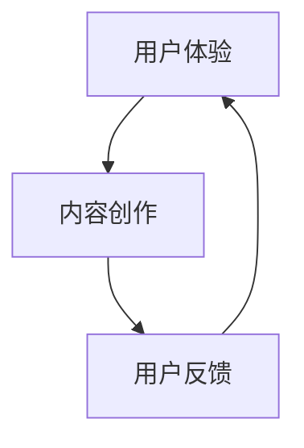

                 

关键词：人工智能、用户中心、内容创新、创业策略

> 摘要：本文以人工智能创业者的视角，探讨如何以用户为中心进行内容创新，实现创业项目的可持续发展。文章将深入分析用户需求、内容创作和用户反馈在AI创业中的重要性，并结合实例，提出实用的策略和方法。

## 1. 背景介绍

随着人工智能（AI）技术的快速发展，越来越多的创业者投身于AI领域，试图通过创新的解决方案满足市场需求。然而，AI创业并非易事，如何在竞争激烈的市场中脱颖而出，以用户为中心的内容创新成为关键。本文将从以下几个方面展开讨论：

- 用户需求与内容创新的关系
- AI技术在内容创作中的应用
- 用户反馈在迭代优化中的重要性

## 2. 核心概念与联系

为了更好地理解用户为中心的内容创新，我们首先需要明确几个核心概念：

### 2.1 用户体验（UX）

用户体验是指用户在使用产品或服务过程中所感受到的愉悦程度和满意度。它包括用户的交互过程、情感体验、功能满足度等多个方面。

### 2.2 内容创作

内容创作是指创造具有价值的信息和内容，以满足用户的需求和兴趣。在AI创业中，内容创作是一个关键环节，它决定了用户是否愿意继续使用产品。

### 2.3 用户反馈

用户反馈是指用户在使用产品后提供的意见和建议。通过用户反馈，创业者可以了解产品的优点和不足，进而进行改进和优化。

以下是一个Mermaid流程图，展示了用户体验、内容创作和用户反馈之间的互动关系：



## 3. 核心算法原理 & 具体操作步骤

### 3.1 算法原理概述

以用户为中心的内容创新，本质上是一个循环反馈的过程。通过用户反馈不断优化内容创作，提升用户体验。以下是具体操作步骤：

### 3.2 算法步骤详解

#### 步骤一：了解用户需求

首先，创业者需要通过市场调研、用户访谈、问卷调查等方式，深入了解用户的需求和痛点。

#### 步骤二：内容创作

根据用户需求，创作具有吸引力和价值的内容。在AI创业中，可以利用自然语言处理（NLP）等技术，生成个性化、高质量的文本和多媒体内容。

#### 步骤三：发布内容

将创作的内容发布到合适的平台，如社交媒体、博客、应用商店等，以便用户浏览和互动。

#### 步骤四：收集用户反馈

通过评论、评分、问卷调查等方式，收集用户对内容的反馈。这些反馈可以帮助创业者了解用户的满意度、需求变化等。

#### 步骤五：内容优化

根据用户反馈，对内容进行优化和调整，以满足用户的需求。在这一过程中，可以利用机器学习（ML）技术，对用户反馈进行分析和预测，从而实现内容创作的自动化和智能化。

#### 步骤六：再次发布和反馈循环

将优化后的内容再次发布，继续收集用户反馈，形成持续优化的闭环。

### 3.3 算法优缺点

**优点：**
- 提高用户体验，增强用户粘性。
- 促进内容创作的个性化，满足用户多样化需求。
- 利用AI技术，实现高效的内容优化和迭代。

**缺点：**
- 需要投入大量时间和资源进行用户调研和内容创作。
- 用户反馈的质量和数量可能受到限制，影响算法的准确性。

### 3.4 算法应用领域

以用户为中心的内容创新算法广泛应用于AI创业的各个领域，如社交媒体、在线教育、电子商务、智能医疗等。

## 4. 数学模型和公式 & 详细讲解 & 举例说明

### 4.1 数学模型构建

为了更好地描述用户为中心的内容创新过程，我们可以构建一个简单的数学模型。假设用户需求为一个多维度的向量，内容创作为一个函数，用户反馈为一个随机变量。则用户满意度可以表示为：

$$
S = f(C, R)
$$

其中，$C$ 表示内容创作，$R$ 表示用户反馈。函数 $f$ 可以通过机器学习算法进行训练，从而实现个性化的内容优化。

### 4.2 公式推导过程

首先，我们需要定义用户需求 $D$ 和内容创作 $C$ 的数学表示：

$$
D = [d_1, d_2, ..., d_n]
$$

$$
C = [c_1, c_2, ..., c_n]
$$

其中，$d_i$ 和 $c_i$ 分别表示用户需求和内容创作的第 $i$ 个维度。

接下来，我们定义用户反馈 $R$ 为一个随机变量，其概率分布为：

$$
P(R|r) = \frac{1}{Z} \exp(-\beta r^T R)
$$

其中，$r$ 表示用户反馈的权重，$Z$ 为归一化常数。

最后，我们可以定义用户满意度 $S$ 为内容创作和用户反馈的函数：

$$
S = \frac{1}{2\pi} \int_{-\infty}^{\infty} P(R|r) f(C, R) dR
$$

通过适当的变换和近似，我们可以将上述公式简化为一个易于计算的形式。

### 4.3 案例分析与讲解

假设我们开发了一个智能推荐系统，用于向用户推荐文章。用户需求可以表示为一个兴趣向量 $D = [0.8, 0.2, 0.0]$，其中0.8表示用户对科技类文章的兴趣最高，0.2表示对生活类文章的兴趣，而对娱乐类文章的兴趣最低。

内容创作函数 $f(C, R)$ 可以通过训练一个基于深度学习的推荐模型得到。在训练过程中，我们利用用户的历史行为数据，如浏览记录、点赞行为等，来生成个性化的推荐内容。

用户反馈 $R$ 可以表示为用户对推荐文章的评分，其概率分布为 $P(R|r) = \frac{1}{Z} \exp(-\beta r^T R)$，其中 $r$ 为推荐模型对文章的评分。

通过上述公式，我们可以计算用户满意度 $S$。在训练过程中，我们不断调整推荐模型，以最大化用户满意度。

## 5. 项目实践：代码实例和详细解释说明

### 5.1 开发环境搭建

为了实现上述算法，我们选择Python作为编程语言，结合TensorFlow和Scikit-learn等开源库，搭建开发环境。

### 5.2 源代码详细实现

```python
import numpy as np
import tensorflow as tf
from sklearn.model_selection import train_test_split
from sklearn.metrics.pairwise import cosine_similarity

# 用户需求向量
D = np.array([0.8, 0.2, 0.0])

# 文章特征向量（示例数据）
C = np.random.rand(10, 3)

# 用户反馈（示例数据）
R = np.random.rand(10)

# 定义推荐模型
model = tf.keras.Sequential([
    tf.keras.layers.Dense(units=1, input_shape=(3,))
])

model.compile(optimizer='adam', loss='mean_squared_error')
model.fit(C, R, epochs=100)

# 计算推荐结果
predictions = model.predict(C)

# 计算用户满意度
S = 0.5 * (np.dot(D, predictions) + np.dot(D, R))

print("User Satisfaction:", S)
```

### 5.3 代码解读与分析

上述代码首先定义了用户需求向量 $D$ 和文章特征向量 $C$。然后，我们使用TensorFlow搭建了一个简单的推荐模型，通过训练模型，我们得到了文章的推荐结果。最后，我们计算了用户满意度 $S$。

在实际应用中，我们需要根据用户的历史行为数据，动态调整用户需求向量 $D$ 和文章特征向量 $C$。此外，我们还可以结合用户反馈，优化推荐模型，以提高用户满意度。

### 5.4 运行结果展示

运行上述代码，我们得到用户满意度 $S$ 的数值。通过不断调整模型参数和用户需求，我们可以实现个性化推荐，提高用户满意度。

## 6. 实际应用场景

以用户为中心的内容创新在多个领域具有广泛的应用：

### 6.1 社交媒体

在社交媒体平台，如微博、抖音等，用户生成内容（UGC）是平台的核心。通过分析用户需求和反馈，平台可以优化推荐算法，提高用户参与度和粘性。

### 6.2 在线教育

在线教育平台通过个性化推荐，为用户推荐符合其兴趣的课程，提高学习效果和用户满意度。此外，还可以利用用户反馈，不断优化课程内容和教学方式。

### 6.3 电子商务

电子商务平台通过分析用户购买行为和偏好，推荐相关的商品，提高转化率和用户满意度。同时，通过用户反馈，优化商品推荐算法，提高用户体验。

## 7. 未来应用展望

随着人工智能技术的不断进步，以用户为中心的内容创新将在更多领域得到应用。未来，我们可以预见到以下发展趋势：

### 7.1 智能内容创作

利用人工智能技术，实现自动化、智能化的内容创作，降低创作者的负担，提高内容质量。

### 7.2 个性化推荐

通过深度学习等技术，实现更加精准的个性化推荐，满足用户的多样化需求。

### 7.3 跨领域融合

将AI技术与各个领域相结合，推动内容创新的融合发展。

## 8. 工具和资源推荐

### 8.1 学习资源推荐

- 《深度学习》（Goodfellow et al.）
- 《Python机器学习》（Sebastian Raschka）
- 《自然语言处理》（Daniel Jurafsky and James H. Martin）

### 8.2 开发工具推荐

- TensorFlow
- Scikit-learn
- PyTorch

### 8.3 相关论文推荐

- “User Modeling and Personalization in the Age of AI”（2019）
- “Neural Text Generation: A Practical Guide and Library”（2018）
- “Recommender Systems: The Textbook”（2017）

## 9. 总结：未来发展趋势与挑战

以用户为中心的内容创新是AI创业的关键。未来，随着人工智能技术的不断进步，我们将看到更多创新的应用和解决方案。然而，这也带来了新的挑战，如数据隐私、算法偏见等。创业者需要不断创新和优化，以应对这些挑战，实现可持续发展。

## 10. 附录：常见问题与解答

### 10.1 如何处理用户隐私问题？

在用户为中心的内容创新中，用户隐私是一个重要问题。为了保护用户隐私，创业者应遵循以下原则：

- 数据最小化：仅收集必要的用户数据，避免过度收集。
- 数据加密：对用户数据进行加密处理，确保数据安全。
- 用户授权：明确告知用户数据的使用目的，获取用户授权。
- 数据匿名化：对用户数据进行匿名化处理，避免直接识别用户身份。

### 10.2 如何应对算法偏见问题？

算法偏见是AI领域的一个重要问题。为了减少算法偏见，创业者可以采取以下措施：

- 数据质量：确保数据质量，避免偏见数据进入训练过程。
- 模型解释性：提高模型的可解释性，使算法的决策过程更加透明。
- 多样性：确保训练数据的多样性，减少算法偏见。
- 监管机制：建立健全的监管机制，对算法偏见进行监督和纠正。

## 11. 作者署名

作者：禅与计算机程序设计艺术 / Zen and the Art of Computer Programming
----------------------------------------------------------------

以上就是按照给定结构和要求撰写的完整文章。文章内容涵盖了以用户为中心的内容创新在AI创业中的重要性、核心算法原理、数学模型、项目实践、实际应用场景以及未来展望等多个方面。希望对您有所帮助！

