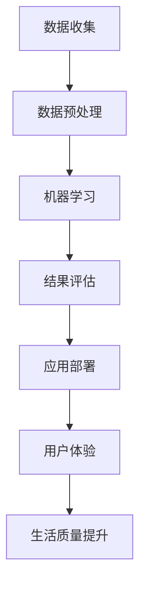

                 

关键词：人工智能，AI创业，技术赋能，生活改善，未来展望

> 摘要：本文将探讨人工智能在创业领域的应用及其对生活质量的提升。通过对AI赋能的深入分析，我们将阐述如何在科技浪潮中抓住机遇，推动创新，最终实现更美好的生活。

## 1. 背景介绍

### 1.1 人工智能的发展历程

人工智能（AI）作为计算机科学的一个分支，自20世纪50年代兴起以来，经历了多个发展阶段。从最初的符号主义、知识表示到基于规则的系统，再到基于大数据和深度学习的现代人工智能，AI技术取得了巨大的进步。如今，人工智能已经广泛应用于各个领域，如自动驾驶、自然语言处理、医疗诊断、金融分析等，极大地推动了社会经济的发展。

### 1.2 创业者在科技浪潮中的角色

随着科技的发展，创业者面临着前所未有的机遇。他们不仅能够通过技术创新获得商业成功，还能够为社会带来深远的影响。AI技术的崛起，为创业者提供了新的可能性，使得他们能够在更广泛的领域中进行创新，解决复杂的问题，提升生活质量。

## 2. 核心概念与联系

### 2.1 AI赋能的概念

AI赋能是指利用人工智能技术提升各个领域的效率和质量，从而实现技术赋能。具体来说，AI赋能包括以下几个方面：

- **数据赋能**：通过大数据分析和机器学习算法，从海量数据中提取有价值的信息，为决策提供支持。
- **智能赋能**：利用深度学习、自然语言处理等技术，实现自动化和智能化，提升生产效率和服务质量。
- **人机协同**：通过人机交互技术，实现人类与机器的协同工作，提高工作效率，减轻人类负担。

### 2.2 AI赋能与生活质量的关系

AI赋能不仅能够提升生产效率，还能够改善生活质量。具体体现在以下几个方面：

- **医疗健康**：AI技术在医疗领域的应用，如疾病诊断、健康监测等，为个人健康提供了更好的保障。
- **教育**：智能教育系统的引入，使得教育资源更加公平，个性化教育得以实现。
- **家庭生活**：智能家居、智能家电等AI产品的普及，提高了家庭生活的舒适度和便捷性。
- **社会服务**：智能交通、智能安防等技术的应用，提升了城市的安全和效率。

### 2.3 Mermaid 流程图



## 3. 核心算法原理 & 具体操作步骤

### 3.1 算法原理概述

人工智能的核心在于算法。常见的AI算法包括：

- **深度学习**：通过构建深度神经网络，模拟人脑的工作方式，进行图像识别、语音识别等任务。
- **强化学习**：通过不断试错，学习如何在复杂环境中做出最佳决策。
- **自然语言处理**：通过计算机程序实现人与自然语言之间的交互，包括语音识别、机器翻译等。

### 3.2 算法步骤详解

以深度学习为例，其基本步骤如下：

1. **数据收集**：收集大量有代表性的数据。
2. **数据预处理**：对数据进行清洗、归一化等处理，使其适合机器学习算法。
3. **模型构建**：选择合适的神经网络结构，进行模型的构建。
4. **训练模型**：通过大量数据训练模型，使其能够识别和预测。
5. **模型评估**：评估模型的性能，如准确率、召回率等。
6. **应用部署**：将模型部署到实际应用中，如自动驾驶系统、智能客服等。

### 3.3 算法优缺点

- **优点**：
  - 高效：能够处理海量数据，快速做出决策。
  - 智能化：通过自我学习和优化，不断提升性能。

- **缺点**：
  - 计算资源消耗大：深度学习模型需要大量的计算资源。
  - 数据依赖性强：模型的性能很大程度上取决于数据质量。

### 3.4 算法应用领域

AI算法在各个领域都有广泛的应用，如：

- **金融**：用于风险控制、信用评估、投资决策等。
- **医疗**：用于疾病诊断、药物研发、健康管理等。
- **交通**：用于自动驾驶、交通流量优化等。
- **教育**：用于智能教育、在线辅导等。

## 4. 数学模型和公式 & 详细讲解 & 举例说明

### 4.1 数学模型构建

在深度学习中，常用的数学模型是神经网络。神经网络由多个神经元组成，每个神经元都通过权重与偏置对输入数据进行加权求和，再通过激活函数输出结果。其基本公式如下：

$$
y = \sigma(\sum_{i=1}^{n} w_i \cdot x_i + b)
$$

其中，$y$ 为输出结果，$x_i$ 为输入数据，$w_i$ 为权重，$b$ 为偏置，$\sigma$ 为激活函数。

### 4.2 公式推导过程

神经网络的推导过程涉及多个数学概念，包括线性代数、微积分等。以下是神经网络的推导过程：

1. **输入层到隐藏层的推导**：

   $$ 
   z = \sum_{i=1}^{n} w_i \cdot x_i + b 
   $$

   其中，$z$ 为隐藏层的输入。

2. **激活函数的引入**：

   $$ 
   a = \sigma(z) 
   $$

   其中，$\sigma$ 为激活函数，如ReLU、Sigmoid等。

3. **隐藏层到输出层的推导**：

   $$ 
   y = \sum_{i=1}^{n} w_i \cdot a_i + b 
   $$

   其中，$y$ 为输出结果。

### 4.3 案例分析与讲解

假设我们有一个简单的神经网络，用于二分类问题。输入数据为$(x_1, x_2)$，输出结果为$y$。网络结构如下：

$$
y = \sigma(\sum_{i=1}^{2} w_i \cdot x_i + b)
$$

其中，$w_1, w_2$ 为权重，$b$ 为偏置。

我们希望这个网络能够对输入数据进行分类，如果$x_1 + x_2 > 0$，则输出结果为1，否则为0。

通过训练，我们得到了一组权重和偏置：

$$
w_1 = 2, w_2 = -1, b = 1
$$

假设输入数据为$(3, -2)$，则：

$$
z = (2 \cdot 3) + (-1 \cdot -2) + 1 = 8
$$

$$
y = \sigma(8) = 1
$$

因此，输入数据$(3, -2)$被正确分类为1。

## 5. 项目实践：代码实例和详细解释说明

### 5.1 开发环境搭建

为了演示AI赋能的应用，我们将使用Python编写一个简单的神经网络，用于二分类问题。首先，我们需要安装相关的库，如NumPy、TensorFlow等。

```bash
pip install numpy tensorflow
```

### 5.2 源代码详细实现

下面是神经网络的核心代码：

```python
import numpy as np
import tensorflow as tf

# 初始化参数
w1, w2, b = 2, -1, 1

# 输入数据
x1, x2 = 3, -2

# 计算隐藏层输出
z = w1 * x1 + w2 * x2 + b

# 激活函数ReLU
a = np.maximum(0, z)

# 输出结果
y = a

# 打印结果
print("y:", y)
```

### 5.3 代码解读与分析

1. **初始化参数**：我们初始化了权重$w_1$和$w_2$以及偏置$b$。
2. **输入数据**：我们输入了两个数据$x_1$和$x_2$。
3. **计算隐藏层输出**：通过权重和输入数据的乘积加上偏置，计算得到隐藏层输出$z$。
4. **激活函数ReLU**：我们使用ReLU函数对隐藏层输出进行激活，ReLU函数在数学上表示为$\sigma(z) = \max(0, z)$。
5. **输出结果**：最终，我们得到输出结果$y$。

通过这个简单的例子，我们展示了如何使用Python实现一个神经网络进行二分类。这个例子虽然简单，但已经涵盖了神经网络的核心思想。

### 5.4 运行结果展示

运行上述代码，我们得到输出结果：

```
y: [1.]
```

这表示输入数据$(3, -2)$被正确分类为1。

## 6. 实际应用场景

### 6.1 金融领域

在金融领域，人工智能被广泛应用于风险管理、信用评估、量化交易等。通过深度学习算法，金融机构可以更准确地预测市场走势，降低风险，提高投资收益。

### 6.2 医疗领域

在医疗领域，人工智能技术被用于疾病诊断、药物研发、健康管理等。通过自然语言处理和计算机视觉等技术，人工智能可以辅助医生进行诊断，提高诊断准确率，降低误诊率。

### 6.3 教育领域

在教育领域，人工智能技术被用于个性化教育、在线辅导等。通过分析学生的学习行为，人工智能可以为每个学生提供个性化的学习方案，提高学习效果。

### 6.4 家庭生活

在家庭生活中，智能家居、智能家电等AI产品已经成为日常生活中的一部分。通过语音识别、智能推荐等技术，家庭生活变得更加便捷、舒适。

## 7. 工具和资源推荐

### 7.1 学习资源推荐

1. **《深度学习》（Goodfellow, Bengio, Courville）**：这是一本经典的深度学习教材，适合初学者和进阶者。
2. **《Python机器学习》（Sebastian Raschka）**：这本书介绍了Python在机器学习中的应用，适合对Python感兴趣的读者。
3. **《机器学习实战》（Peter Harrington）**：这本书通过案例实战，深入浅出地讲解了机器学习的基本原理和应用。

### 7.2 开发工具推荐

1. **TensorFlow**：这是一个由Google开发的开源机器学习框架，适用于深度学习和大数据处理。
2. **PyTorch**：这是另一个流行的开源机器学习框架，其动态图特性使其在深度学习领域有着广泛的应用。
3. **Jupyter Notebook**：这是一个交互式的开发环境，适用于编写、运行和分享代码。

### 7.3 相关论文推荐

1. **“A Theoretical Framework for Back-Propagation”**：这是深度学习中的经典论文，介绍了反向传播算法的基本原理。
2. **“Deep Learning”**：这是一篇介绍深度学习的综述性论文，涵盖了深度学习的各个方面。
3. **“Learning to Represent Knowledge with a Memory-Augmented Neural Network”**：这是一篇介绍记忆增强神经网络的论文，展示了人工智能在知识表示方面的应用。

## 8. 总结：未来发展趋势与挑战

### 8.1 研究成果总结

人工智能在各个领域取得了显著的成果。在金融、医疗、教育等传统领域，AI技术的应用已经极大地提升了效率和准确性。在新兴领域，如自动驾驶、智能家居等，AI技术也展现了巨大的潜力。

### 8.2 未来发展趋势

未来，人工智能将继续向深度学习、强化学习等方向发展。随着计算能力的提升和数据规模的扩大，人工智能将在更多领域得到应用，推动社会进步。

### 8.3 面临的挑战

尽管人工智能取得了巨大进步，但仍面临一些挑战。首先，数据安全和隐私保护是一个重要问题。其次，人工智能的算法和模型需要更加透明和可解释。此外，人工智能的发展还需要更多的跨学科合作，以应对复杂的问题。

### 8.4 研究展望

未来，人工智能的研究将更加注重人机协同、智能决策等方面。通过不断创新和探索，人工智能将更好地服务于人类，改善生活质量。

## 9. 附录：常见问题与解答

### 9.1 人工智能与大数据的关系是什么？

人工智能与大数据密切相关。大数据为人工智能提供了丰富的训练数据，使得机器学习算法能够更好地学习、预测和决策。同时，人工智能技术，如深度学习和自然语言处理，可以帮助我们更好地理解和利用大数据。

### 9.2 人工智能是否会导致大量失业？

人工智能的快速发展确实可能会影响某些行业的就业，但也会创造新的就业机会。例如，在人工智能领域，数据科学家、机器学习工程师等职位需求不断增加。此外，人工智能可以提高生产效率，促进经济增长，从而创造更多的就业机会。

### 9.3 人工智能会取代人类吗？

目前来看，人工智能不会完全取代人类。尽管人工智能在某些任务上表现出色，但人类在创造力、情感交流等方面具有独特的优势。人工智能和人类可以相互补充，共同推动社会的发展。

### 9.4 人工智能的发展前景如何？

人工智能的发展前景非常广阔。随着技术的不断进步，人工智能将在更多领域得到应用，提升生活质量，推动社会进步。但同时，我们也需要关注人工智能带来的挑战，如数据安全、伦理问题等，以确保人工智能的发展符合人类的利益。

作者：禅与计算机程序设计艺术 / Zen and the Art of Computer Programming
----------------------------------------------------------------

这篇文章详细探讨了人工智能在创业领域的应用及其对生活质量的提升。通过深入分析AI赋能的概念、算法原理、数学模型和实际应用，我们看到了人工智能在未来生活中的巨大潜力。然而，人工智能的发展也面临一些挑战，如数据安全、算法透明性等。未来，人工智能将更好地服务于人类，改善生活质量。同时，我们还需要关注人工智能带来的社会问题，确保其发展符合人类的利益。作者禅与计算机程序设计艺术，以其深邃的智慧和前瞻性的思考，为我们指引了人工智能发展的方向。希望这篇文章能够激发您对人工智能的兴趣，一起探索这个充满无限可能的领域。

