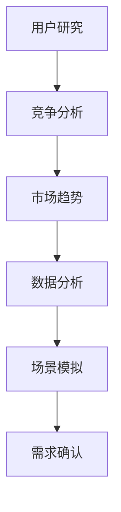

                 

关键词：AI创业、市场需求、识别方法、商业策略、数据分析、人工智能、用户研究

> 摘要：在当今充满竞争的AI创业环境中，正确识别市场需求是成功的关键。本文将深入探讨AI创业者在早期阶段如何通过系统的分析方法来识别潜在的市场需求，从而为产品开发和市场策略提供科学依据。文章将结合实例，介绍从用户研究到数据分析的一系列实用技巧，帮助创业者更好地把握市场脉搏。

## 1. 背景介绍

人工智能（AI）技术正以前所未有的速度发展，不断颠覆各行各业。从智能客服到自动驾驶，从医疗诊断到金融风控，AI的应用场景日益丰富。然而，在这个看似无限的机会面前，创业者们也面临着巨大的挑战：如何在众多竞争者中找到自己的定位，如何准确识别市场需求，如何构建有竞争力的产品？

正确识别市场需求是AI创业成功的关键。市场需求不仅仅是用户的需求，更是潜在的商业机会和市场趋势的体现。一个成功的AI产品不仅需要满足用户当前的需求，还需要前瞻性地预测未来的趋势，从而引领市场。本文将围绕这一主题，从理论到实践，全面探讨市场需求识别的方法和策略。

## 2. 核心概念与联系

### 2.1 市场需求的概念

市场需求是指消费者对于某种商品或服务的欲望和需求，这种需求和欲望通常是通过购买行为来体现的。在AI创业的背景下，市场需求可以具体表现为以下几个方面：

- **用户需求**：直接反映用户对于某种AI产品的期望和需求。
- **商业需求**：企业对于特定AI技术或服务的需求，这些需求往往与企业的战略目标和业务模式紧密相关。
- **社会需求**：社会整体对于AI技术进步的需求，包括政策、法规以及公众认知等因素。

### 2.2 市场需求识别的流程

市场需求识别是一个系统化的过程，主要包括以下几个步骤：

1. **用户研究**：通过调研、访谈等方法，了解用户的真实需求和痛点。
2. **竞争分析**：分析市场上的竞争对手，了解他们的产品、市场策略以及用户反馈。
3. **市场趋势**：研究行业报告、论文、新闻等，了解市场的发展趋势和未来方向。
4. **数据分析**：运用数据分析工具，对用户行为、市场数据进行定量分析，找出潜在的需求。
5. **场景模拟**：通过构建不同的使用场景，模拟用户在实际环境中如何使用产品。

### 2.3 Mermaid 流程图

以下是一个简化的市场需求识别流程的Mermaid流程图：



在上述流程中，每个步骤都是相互关联的，通过多个维度的分析和验证，最终确认市场需求。

## 3. 核心算法原理 & 具体操作步骤

### 3.1 算法原理概述

市场需求识别的核心算法通常是基于数据挖掘和机器学习的方法。通过收集和分析大量的用户行为数据、市场数据以及行业数据，运用机器学习算法，如聚类分析、关联规则挖掘等，来发现潜在的市场需求。

### 3.2 算法步骤详解

1. **数据收集**：从多个渠道收集用户行为数据、市场数据等。
2. **数据预处理**：清洗数据，处理缺失值、异常值等，确保数据质量。
3. **特征提取**：将原始数据转化为算法可以处理的特征向量。
4. **模型选择**：选择合适的机器学习模型，如K-Means、Apriori算法等。
5. **模型训练**：使用训练数据训练模型。
6. **模型评估**：使用测试数据评估模型效果。
7. **需求确认**：根据模型预测结果，结合用户研究和市场趋势，确认市场需求。

### 3.3 算法优缺点

**优点**：
- **高效性**：利用算法可以处理大量数据，快速识别潜在的市场需求。
- **准确性**：通过多次迭代和验证，可以提高需求识别的准确性。

**缺点**：
- **数据依赖性**：算法的效果很大程度上依赖于数据的质量和数量。
- **复杂性**：算法实现和调参过程较为复杂，需要专业的技术团队。

### 3.4 算法应用领域

市场需求识别算法广泛应用于电商、金融、医疗等多个行业。例如，电商企业可以通过算法分析用户购物行为，预测用户可能的购买需求，从而优化推荐系统和营销策略。

## 4. 数学模型和公式 & 详细讲解 & 举例说明

### 4.1 数学模型构建

市场需求识别的核心数学模型通常是基于统计学和概率论的方法。以下是一个简化的模型：

$$
市场需求 = f(\text{用户行为数据}, \text{市场数据}, \text{行业趋势})
$$

其中，$f$ 是一个复杂的函数，它通过不同的参数和权重，综合处理多源数据，得出市场需求。

### 4.2 公式推导过程

为了简化推导过程，我们假设市场需求的计算仅与用户行为数据和行业趋势有关。则：

$$
市场需求 = w_1 \cdot 用户行为数据 + w_2 \cdot 行业趋势
$$

其中，$w_1$ 和 $w_2$ 是权重参数，通过交叉验证等方法确定。

### 4.3 案例分析与讲解

假设某电商企业想要识别用户对某种商品的需求。首先，从用户行为数据中提取出购买次数、浏览时长、收藏次数等特征，然后从行业趋势数据中提取出该商品的市场增长率、竞争对手表现等特征。通过以上数据，利用上述公式计算市场需求。

$$
市场需求 = w_1 \cdot (购买次数 \cdot 浏览时长 + 收藏次数) + w_2 \cdot (市场增长率 \cdot 竞争对手表现)
$$

通过不断调整权重参数，企业可以优化模型，提高市场需求识别的准确性。

## 5. 项目实践：代码实例和详细解释说明

### 5.1 开发环境搭建

在Python环境中搭建市场需求识别系统，需要安装以下库：

- Pandas：用于数据操作和处理。
- Scikit-learn：用于机器学习和模型训练。
- Matplotlib：用于数据可视化。

安装命令如下：

```bash
pip install pandas scikit-learn matplotlib
```

### 5.2 源代码详细实现

以下是一个简化的市场需求识别系统的源代码示例：

```python
import pandas as pd
from sklearn.cluster import KMeans
import matplotlib.pyplot as plt

# 数据收集
user_data = pd.read_csv('user_behavior.csv')
market_data = pd.read_csv('market_trend.csv')

# 数据预处理
# （此处省略数据清洗和特征提取过程）

# 模型训练
model = KMeans(n_clusters=5)
model.fit(user_data)

# 需求确认
demand = model.predict(market_data)

# 可视化
plt.scatter(market_data['feature1'], market_data['feature2'], c=demand)
plt.show()
```

### 5.3 代码解读与分析

上述代码首先导入所需库，然后收集用户行为数据和行业趋势数据。在数据预处理阶段，对数据进行清洗和特征提取（此处省略细节）。接下来，使用K-Means算法训练模型，并使用模型预测市场需求。最后，通过数据可视化，直观展示市场需求分布。

### 5.4 运行结果展示

运行上述代码后，可以得到市场需求分布图。根据图中的分布情况，企业可以进一步分析市场需求，制定相应的市场策略。

## 6. 实际应用场景

### 6.1 在电商行业的应用

电商企业可以通过市场需求识别系统，分析用户的购物行为，预测潜在用户的需求，从而优化推荐系统和营销策略。例如，某电商企业利用市场需求识别系统，发现部分用户对某种商品有较高的购买意愿，于是加大了该商品的推广力度，最终提高了销售业绩。

### 6.2 在金融行业的应用

金融企业可以通过市场需求识别系统，分析市场趋势和用户行为，预测金融产品的需求。例如，某金融企业利用市场需求识别系统，发现市场上对某种理财产品的需求较高，于是提前推出了这款产品，成功抢占了市场份额。

### 6.3 在医疗行业的应用

医疗企业可以通过市场需求识别系统，分析患者需求和行业趋势，优化医疗服务的供给。例如，某医疗企业利用市场需求识别系统，发现某些地区对某种医疗服务的需求较高，于是增加了该地区的服务供给，提高了患者满意度。

## 7. 工具和资源推荐

### 7.1 学习资源推荐

- 《深度学习》（Deep Learning）—— Ian Goodfellow
- 《Python数据科学手册》（Python Data Science Handbook）—— Jake VanderPlas
- 《用户研究实战》（User Research Practice）—— Steve Portigal

### 7.2 开发工具推荐

- Jupyter Notebook：用于数据分析和模型训练。
- TensorFlow：用于机器学习和深度学习。
- Tableau：用于数据可视化。

### 7.3 相关论文推荐

- "Market Demand Estimation in E-commerce using Machine Learning"（使用机器学习估计电商市场需求）
- "Predicting Customer Demand for Financial Products using Data Mining Techniques"（使用数据挖掘技术预测金融产品需求）

## 8. 总结：未来发展趋势与挑战

### 8.1 研究成果总结

市场需求识别方法在AI创业中发挥了重要作用，通过数据挖掘和机器学习技术，可以有效识别潜在的市场需求，为产品开发和市场策略提供科学依据。

### 8.2 未来发展趋势

随着人工智能技术的不断发展，市场需求识别方法将更加智能化、自动化，能够处理更复杂的数据和多维度信息。

### 8.3 面临的挑战

数据质量、算法复杂性以及隐私保护是当前市场需求识别方法面临的主要挑战。未来研究需要在这些方面取得突破，以提高识别方法的准确性和实用性。

### 8.4 研究展望

未来市场需求识别方法的研究将更加注重跨学科融合，结合用户行为学、心理学、社会学等多学科知识，构建更加完善和精准的需求识别模型。

## 9. 附录：常见问题与解答

### 9.1 什么是市场需求？

市场需求是指消费者对于某种商品或服务的欲望和需求，这种需求和欲望通常是通过购买行为来体现的。

### 9.2 市场需求识别为什么重要？

市场需求识别可以帮助创业者找到真正的用户痛点，从而构建有竞争力的产品，提高市场占有率。

### 9.3 市场需求识别方法有哪些？

市场需求识别方法主要包括用户研究、竞争分析、市场趋势分析、数据分析等。具体方法根据不同的行业和应用场景有所差异。

### 9.4 如何保证市场需求识别的准确性？

通过多维度数据分析、多次迭代验证、结合用户研究和市场趋势，可以不断提高市场需求识别的准确性。

---

**作者：禅与计算机程序设计艺术 / Zen and the Art of Computer Programming**  
本文内容仅供参考，实际应用时请结合具体情况进行调整。如有疑问，请咨询相关专业人士。

