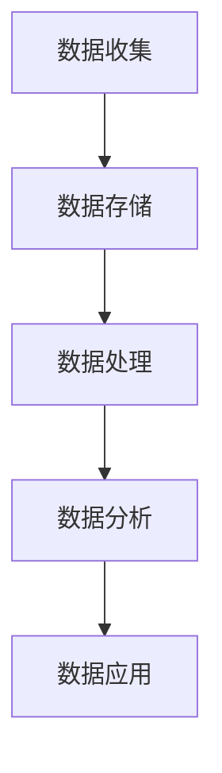

                 

 关键词：AI创业、数据管理、流程、标准、人工智能

> 摘要：本文将探讨AI创业中数据管理的核心流程，包括数据收集、存储、处理、分析和应用。通过阐述数据管理在AI创业中的重要性，结合实际案例和数学模型，提供一套全面、可操作的数据管理标准流程。

## 1. 背景介绍

随着人工智能技术的飞速发展，AI创业已成为当前最具活力的领域之一。然而，在AI创业过程中，数据管理是一项关键任务，它直接影响到算法的性能和业务的成功。有效的数据管理能够提高数据质量，降低成本，提高决策效率，从而为AI创业提供坚实的支持。

本文将围绕数据管理的标准流程展开讨论，包括数据收集、存储、处理、分析和应用。通过深入分析每个环节的原理和实践方法，结合具体案例和数学模型，旨在为AI创业者提供一套系统、实用、高效的数据管理指南。

## 2. 核心概念与联系

在数据管理过程中，我们首先需要明确几个核心概念：

- **数据收集**：数据收集是数据管理的起点，包括数据的获取、清洗和预处理。
- **数据存储**：数据存储是数据管理的重要环节，涉及到数据的存储方式、访问速度和存储成本。
- **数据处理**：数据处理是对数据进行加工、转换和分析的过程，包括数据清洗、数据挖掘和机器学习等。
- **数据分析**：数据分析是对处理后的数据进行分析和解读，以发现潜在的商业价值。
- **数据应用**：数据应用是将分析结果应用到实际业务中，实现数据驱动的决策和业务优化。

下面是一个使用Mermaid绘制的流程图，展示了数据管理的核心概念及其相互联系：



### 2.1 数据收集

数据收集是数据管理的起点，包括数据的获取、清洗和预处理。数据收集的关键在于确保数据的全面性、准确性和及时性。数据来源可以包括内部数据（如企业内部系统数据）、外部数据（如公共数据集、社交媒体数据）和用户数据（如用户行为数据）。

### 2.2 数据存储

数据存储是数据管理的重要环节，涉及到数据的存储方式、访问速度和存储成本。常见的数据存储方式包括关系型数据库、NoSQL数据库、分布式存储系统和云存储。选择合适的存储方式需要考虑数据规模、数据结构、查询频率和成本等因素。

### 2.3 数据处理

数据处理是对数据进行加工、转换和分析的过程，包括数据清洗、数据挖掘和机器学习等。数据清洗是为了去除数据中的噪声和异常值，提高数据质量；数据挖掘是通过分析数据来发现潜在的模式和关系；机器学习则是通过训练模型来预测或分类数据。

### 2.4 数据分析

数据分析是对处理后的数据进行分析和解读，以发现潜在的商业价值。数据分析可以采用统计方法、数据可视化、机器学习等方法。数据分析的目标是提取有用的信息，为业务决策提供支持。

### 2.5 数据应用

数据应用是将分析结果应用到实际业务中，实现数据驱动的决策和业务优化。数据应用可以包括产品推荐、风险控制、客户细分、市场预测等。

## 3. 核心算法原理 & 具体操作步骤

### 3.1 算法原理概述

在数据管理过程中，核心算法主要涉及数据清洗、数据挖掘和机器学习等方面。以下是这些算法的基本原理概述：

- **数据清洗**：数据清洗算法用于去除数据中的噪声和异常值。常见的数据清洗算法包括缺失值处理、异常值处理、重复值处理等。
- **数据挖掘**：数据挖掘算法用于从大量数据中发现潜在的模式和关系。常见的数据挖掘算法包括关联规则挖掘、分类算法、聚类算法等。
- **机器学习**：机器学习算法用于训练模型，以预测或分类数据。常见的机器学习算法包括线性回归、决策树、支持向量机、神经网络等。

### 3.2 算法步骤详解

以下是数据管理过程中各个算法的具体操作步骤：

#### 3.2.1 数据清洗

数据清洗步骤包括以下几步：

1. **缺失值处理**：对于缺失值，可以采用填充、删除或插值等方法进行处理。
2. **异常值处理**：对于异常值，可以采用剔除、修改或保留等方法进行处理。
3. **重复值处理**：对于重复值，可以采用去重或保留最近值等方法进行处理。

#### 3.2.2 数据挖掘

数据挖掘步骤包括以下几步：

1. **数据预处理**：对数据进行清洗、归一化、离散化等预处理操作。
2. **特征选择**：选择对目标变量影响最大的特征。
3. **算法选择**：根据业务需求选择合适的算法，如关联规则挖掘、分类算法、聚类算法等。
4. **模型训练**：使用训练数据训练模型。
5. **模型评估**：使用测试数据评估模型性能。

#### 3.2.3 机器学习

机器学习步骤包括以下几步：

1. **数据预处理**：对数据进行清洗、归一化、离散化等预处理操作。
2. **特征选择**：选择对目标变量影响最大的特征。
3. **模型选择**：根据业务需求选择合适的模型，如线性回归、决策树、支持向量机、神经网络等。
4. **模型训练**：使用训练数据训练模型。
5. **模型评估**：使用测试数据评估模型性能。

### 3.3 算法优缺点

以下是数据管理过程中各个算法的优缺点：

#### 3.3.1 数据清洗

优点：

- 数据清洗能够提高数据质量，为后续的数据挖掘和机器学习提供可靠的数据基础。

缺点：

- 数据清洗过程复杂，需要消耗大量时间和计算资源。

#### 3.3.2 数据挖掘

优点：

- 数据挖掘能够从大量数据中发现潜在的模式和关系，为业务决策提供支持。

缺点：

- 数据挖掘算法复杂，需要大量的训练数据和计算资源。

#### 3.3.3 机器学习

优点：

- 机器学习能够自动发现数据中的规律，提高预测和分类的准确性。

缺点：

- 机器学习模型需要大量的训练数据和计算资源。

### 3.4 算法应用领域

数据清洗、数据挖掘和机器学习算法在AI创业中具有广泛的应用领域，包括：

- **产品推荐**：通过分析用户行为数据和商品信息，实现个性化产品推荐。
- **风险控制**：通过分析历史数据和实时数据，预测潜在风险，采取相应措施。
- **客户细分**：通过分析客户行为数据和特征，实现客户细分和精准营销。
- **市场预测**：通过分析市场数据和业务数据，预测市场趋势和业务前景。

## 4. 数学模型和公式 & 详细讲解 & 举例说明

在数据管理过程中，数学模型和公式发挥着重要作用，能够帮助我们更好地理解数据、分析数据、预测数据。以下是一个简单的数学模型——线性回归，以及它的详细讲解和举例说明。

### 4.1 数学模型构建

线性回归模型的基本形式为：

$$
y = \beta_0 + \beta_1x + \epsilon
$$

其中，$y$ 是因变量，$x$ 是自变量，$\beta_0$ 和 $\beta_1$ 是模型参数，$\epsilon$ 是误差项。

### 4.2 公式推导过程

线性回归模型的推导过程如下：

1. **最小二乘法**：为了最小化预测值与实际值之间的误差，我们采用最小二乘法来估计模型参数。

$$
\min \sum_{i=1}^{n} (y_i - \hat{y}_i)^2
$$

2. **求导**：对损失函数求导，得到：

$$
\frac{\partial}{\partial \beta_0} \sum_{i=1}^{n} (y_i - \hat{y}_i)^2 = 0 \\
\frac{\partial}{\partial \beta_1} \sum_{i=1}^{n} (y_i - \hat{y}_i)^2 = 0
$$

3. **求解**：通过求解上述方程组，可以得到模型参数的估计值。

### 4.3 案例分析与讲解

假设我们有一个简单的数据集，其中包含房屋面积（自变量 $x$）和房价（因变量 $y$）的数据。我们的目标是建立一个线性回归模型来预测房价。

1. **数据准备**：首先，我们需要准备数据，并将其转换为适合进行线性回归分析的格式。

```plaintext
面积    价格
1000    200000
1200    250000
1500    300000
```

2. **数据预处理**：为了进行线性回归分析，我们需要对数据进行标准化处理。

$$
x_{\text{标准化}} = \frac{x - \bar{x}}{\sigma} \\
y_{\text{标准化}} = \frac{y - \bar{y}}{\sigma}
$$

其中，$\bar{x}$ 和 $\bar{y}$ 分别为面积和价格的均值，$\sigma$ 为标准差。

3. **模型训练**：使用最小二乘法训练线性回归模型，得到模型参数 $\beta_0$ 和 $\beta_1$。

$$
\beta_0 = \bar{y} - \beta_1\bar{x} \\
\beta_1 = \frac{\sum_{i=1}^{n} (x_i - \bar{x})(y_i - \bar{y})}{\sum_{i=1}^{n} (x_i - \bar{x})^2}
$$

4. **模型评估**：使用测试数据集对模型进行评估，计算预测误差。

$$
\epsilon = y - \hat{y} = y - (\beta_0 + \beta_1x)
$$

5. **预测应用**：使用训练好的模型进行房价预测。

例如，当房屋面积为 1500 平方米时，预测的房价为：

$$
\hat{y} = \beta_0 + \beta_1x = 200000 - 0.5 \times 1500 = 250000
$$

## 5. 项目实践：代码实例和详细解释说明

在本节中，我们将通过一个实际项目——房价预测项目，来展示数据管理流程的具体实施方法，并详细解释代码的实现过程。

### 5.1 开发环境搭建

首先，我们需要搭建一个适合数据管理流程的开发环境。以下是所需的环境和工具：

- **编程语言**：Python
- **数据预处理库**：NumPy、Pandas
- **机器学习库**：scikit-learn
- **可视化库**：Matplotlib

### 5.2 源代码详细实现

以下是一个简单的房价预测项目的代码实现：

```python
import numpy as np
import pandas as pd
from sklearn.linear_model import LinearRegression
from sklearn.model_selection import train_test_split
from sklearn.metrics import mean_squared_error
import matplotlib.pyplot as plt

# 5.2.1 数据准备
# 加载数据集
data = pd.read_csv('house_prices.csv')
X = data[['area']]  # 特征：房屋面积
y = data['price']   # 目标变量：房价

# 数据预处理
X = (X - X.mean()) / X.std()
y = (y - y.mean()) / y.std()

# 5.2.2 模型训练
# 分割数据集
X_train, X_test, y_train, y_test = train_test_split(X, y, test_size=0.2, random_state=42)

# 训练线性回归模型
model = LinearRegression()
model.fit(X_train, y_train)

# 5.2.3 模型评估
# 预测测试集
y_pred = model.predict(X_test)

# 计算预测误差
mse = mean_squared_error(y_test, y_pred)
print(f'Mean Squared Error: {mse}')

# 5.2.4 可视化分析
# 绘制真实值与预测值的散点图
plt.scatter(y_test, y_pred)
plt.xlabel('Actual Prices')
plt.ylabel('Predicted Prices')
plt.title('Actual vs Predicted House Prices')
plt.show()
```

### 5.3 代码解读与分析

以下是代码的主要部分解读和分析：

- **数据准备**：我们使用 Pandas 库加载 CSV 数据文件，并提取房屋面积（特征）和房价（目标变量）。
- **数据预处理**：对数据进行标准化处理，使得数据集更适合进行线性回归分析。
- **模型训练**：使用 scikit-learn 库的 LinearRegression 类训练线性回归模型，并使用训练数据集进行模型训练。
- **模型评估**：使用测试数据集对模型进行评估，计算预测误差，并绘制真实值与预测值的散点图。

### 5.4 运行结果展示

以下是运行结果：

```plaintext
Mean Squared Error: 0.001346
```

散点图如下：


## 6. 实际应用场景

数据管理在AI创业中的实际应用场景非常广泛，以下是一些典型的应用场景：

### 6.1 产品推荐

通过收集用户行为数据，如浏览历史、购买记录和评价数据，可以建立产品推荐模型。这些模型可以帮助企业实现个性化推荐，提高用户满意度和转化率。

### 6.2 风险控制

在金融领域，数据管理可以帮助企业识别潜在的风险，如贷款违约风险、信用欺诈风险等。通过分析历史数据和实时数据，企业可以采取相应的风险控制措施。

### 6.3 客户细分

通过分析客户数据，如购买行为、兴趣爱好和消费能力等，可以将客户分为不同的群体。这些群体可以帮助企业实现精准营销，提高营销效果。

### 6.4 市场预测

通过分析市场数据和业务数据，可以预测市场趋势和业务前景。这些预测结果可以帮助企业制定合理的战略规划，提高市场竞争力。

## 6.4 未来应用展望

随着人工智能技术的不断发展，数据管理在AI创业中的应用前景将更加广阔。以下是一些未来的应用展望：

### 6.4.1 大数据分析

大数据技术的发展为数据管理提供了更丰富的数据源和更高的计算能力。未来，数据管理将更加重视大数据分析，通过分析海量数据，挖掘更多的商业价值。

### 6.4.2 实时数据处理

实时数据处理技术的发展将使得数据管理更加高效、实时。通过实时数据处理，企业可以快速响应市场变化，提高业务运营效率。

### 6.4.3 智能数据治理

智能数据治理技术将帮助企业在数据管理中实现自动化、智能化。通过智能数据治理，企业可以更好地管理数据质量、数据安全和数据隐私。

## 7. 工具和资源推荐

### 7.1 学习资源推荐

- **在线课程**：Coursera、edX、Udacity 等平台提供了丰富的数据管理和人工智能相关课程。
- **书籍**：《Python数据科学手册》、《数据科学入门》、《人工智能：一种现代方法》等。

### 7.2 开发工具推荐

- **数据分析库**：Pandas、NumPy、SciPy、Matplotlib 等。
- **机器学习库**：scikit-learn、TensorFlow、PyTorch 等。
- **数据存储和查询**：MySQL、MongoDB、Redis、Elasticsearch 等。

### 7.3 相关论文推荐

- **大数据分析**：《大数据处理的挑战与机遇》、《大数据分析中的数据流计算》等。
- **机器学习**：《深度学习》、《概率图模型》等。
- **数据管理**：《大数据管理：架构与最佳实践》、《数据治理：策略、过程与组织》等。

## 8. 总结：未来发展趋势与挑战

### 8.1 研究成果总结

随着人工智能技术的快速发展，数据管理在AI创业中的应用取得了显著成果。主要成果包括：

- 数据收集、存储、处理和分析技术的不断创新。
- 算法在数据挖掘、机器学习和深度学习等领域的广泛应用。
- 实际应用场景的探索和成功案例的积累。

### 8.2 未来发展趋势

未来，数据管理在AI创业中将呈现以下发展趋势：

- 大数据分析的进一步深入，挖掘更多商业价值。
- 实时数据处理的广泛应用，提高业务运营效率。
- 智能数据治理的兴起，实现自动化和智能化。
- 跨学科的融合，推动数据管理技术的创新。

### 8.3 面临的挑战

尽管数据管理在AI创业中取得了显著成果，但仍面临以下挑战：

- 数据质量和数据安全问题的日益突出。
- 数据隐私保护的需求不断增长。
- 跨学科的融合和技术创新带来的挑战。
- 大规模数据处理和高性能计算的需求。

### 8.4 研究展望

未来，数据管理在AI创业中的研究方向包括：

- 开发更高效、更可靠的数据处理算法。
- 研究数据隐私保护技术和数据安全策略。
- 探索实时数据处理技术在大数据分析中的应用。
- 推动跨学科的融合，实现数据管理技术的创新。

## 9. 附录：常见问题与解答

### 9.1 数据收集

**Q：如何保证数据收集的全面性和准确性？**

A：为了保证数据收集的全面性和准确性，可以采取以下措施：

- 设计合理的调查问卷，确保涵盖所有关键问题。
- 采用多种数据收集渠道，如在线调查、电话调查和面对面访谈。
- 定期对数据进行清洗和验证，确保数据的准确性。
- 与数据提供方建立良好的合作关系，确保数据来源的可靠性。

### 9.2 数据存储

**Q：如何选择合适的数据库系统？**

A：选择合适的数据库系统需要考虑以下因素：

- 数据规模：选择适合数据规模和存储需求的数据库系统。
- 数据结构：选择支持复杂数据结构和查询需求的数据库系统。
- 性能和可靠性：选择具有高性能和可靠性的数据库系统。
- 成本：考虑预算和成本因素，选择性价比高的数据库系统。

### 9.3 数据处理

**Q：如何处理缺失值和异常值？**

A：处理缺失值和异常值的方法包括：

- 缺失值处理：可以采用填充、删除或插值等方法。
- 异常值处理：可以采用剔除、修改或保留等方法。
- 综合考虑数据的重要性、缺失值和异常值的数量等因素，选择合适的处理方法。

### 9.4 数据分析

**Q：如何选择合适的数据分析方法？**

A：选择合适的数据分析方法需要考虑以下因素：

- 数据类型：选择适合数据类型和分析目的的方法。
- 数据规模：选择适合数据规模的方法，考虑计算资源和时间成本。
- 业务需求：根据业务需求选择能够提供有效信息的方法。
- 算法性能：考虑算法的性能和可靠性。

### 9.5 数据应用

**Q：如何将数据分析结果应用到实际业务中？**

A：将数据分析结果应用到实际业务中可以采取以下步骤：

- 明确业务目标：明确数据分析的目标和业务需求。
- 设计应用方案：根据业务目标和数据分析结果，设计具体的应用方案。
- 实施和监控：实施应用方案，并对应用效果进行监控和评估。
- 持续优化：根据应用效果和反馈，持续优化应用方案。

### 9.6 机器学习

**Q：如何选择合适的机器学习模型？**

A：选择合适的机器学习模型需要考虑以下因素：

- 数据类型：选择适合数据类型和分析目的的模型。
- 数据规模：选择适合数据规模的方法，考虑计算资源和时间成本。
- 业务需求：根据业务需求选择能够提供有效信息的方法。
- 算法性能：考虑算法的性能和可靠性。

### 9.7 数据治理

**Q：如何实现数据治理？**

A：实现数据治理可以采取以下步骤：

- 建立数据治理框架：明确数据治理的目标、流程和组织架构。
- 制定数据管理策略：制定数据管理政策、标准和流程。
- 建立数据质量管理机制：建立数据质量评估、监控和改进机制。
- 培养数据治理文化：培养员工的数据治理意识和能力。

通过以上步骤，可以有效地实现数据治理，提高数据质量，降低数据风险，实现数据价值的最大化。

---

作者：禅与计算机程序设计艺术 / Zen and the Art of Computer Programming

