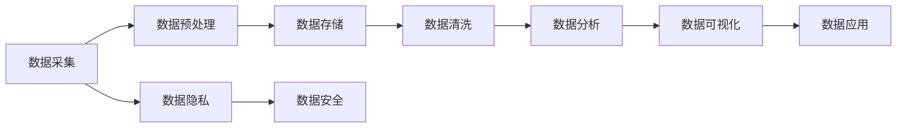

                 

关键词：AI创业、数据管理、策略、实践、算法、模型、应用场景、未来展望

> 摘要：本文旨在深入探讨AI创业中数据管理的策略与实践。通过分析数据管理的核心概念、算法原理、数学模型、实际应用案例，以及未来发展趋势和挑战，帮助创业者更好地理解和应对数据管理中的关键问题，从而实现AI项目的成功。

## 1. 背景介绍

在人工智能（AI）飞速发展的今天，数据管理已经成为AI创业的核心驱动力。无论是机器学习、深度学习还是自然语言处理等领域，数据的质量和规模都直接影响到算法的性能和结果。然而，数据管理并非易事，它涉及到数据的采集、存储、处理、分析和应用等多个环节，每一个环节都充满了挑战和复杂性。

### 1.1 数据管理的必要性

随着互联网的普及和数据量的爆炸式增长，企业面临着前所未有的数据挑战。有效的数据管理可以帮助企业从海量数据中挖掘有价值的信息，提高决策的准确性和效率。此外，数据管理还能降低数据冗余、确保数据安全，从而提升企业的整体竞争力。

### 1.2 数据管理的关键问题

- 数据质量：数据质量是数据管理的核心问题。不准确、不完整或过时的数据会严重影响算法的性能和结果。
- 数据隐私：随着数据隐私法规的不断完善，如何保护用户隐私成为数据管理的重要课题。
- 数据分析：如何从海量数据中快速、准确地提取有价值的信息，是数据管理面临的另一大挑战。

## 2. 核心概念与联系

在探讨数据管理的策略与实践之前，我们需要了解一些核心概念和它们之间的联系。以下是一个Mermaid流程图，展示了数据管理中的关键流程和概念。



### 2.1 数据采集

数据采集是数据管理的第一步，也是最重要的一步。它涉及到从各种来源（如传感器、网站、数据库等）收集数据。数据采集的质量直接影响后续数据处理的效率和效果。

### 2.2 数据预处理

数据预处理是对原始数据进行清洗、转换和归一化等操作，以使其适合后续的处理和分析。预处理的质量直接影响数据质量和分析结果。

### 2.3 数据存储

数据存储是将处理后的数据存储到数据库或数据仓库中，以便进行后续的分析和应用。数据存储的效率和可靠性对数据管理至关重要。

### 2.4 数据清洗

数据清洗是去除数据中的错误、异常值和冗余数据的过程。数据清洗的目的是提高数据质量，确保数据的一致性和准确性。

### 2.5 数据分析

数据分析是使用统计、机器学习等技术对数据进行分析和挖掘，以提取有价值的信息和洞察。数据分析的质量直接影响企业的决策和业务发展。

### 2.6 数据可视化

数据可视化是将数据以图形、图表等形式展示出来，以帮助用户更好地理解和分析数据。数据可视化不仅提高了数据分析的效率，还提高了决策的准确性。

### 2.7 数据应用

数据应用是将分析结果应用到实际业务场景中，如营销、运营、风险管理等。数据应用的效果直接影响到企业的业务增长和竞争力。

### 2.8 数据隐私和数据安全

数据隐私和数据安全是数据管理中不可忽视的问题。在数据采集、存储和处理过程中，必须确保用户数据的隐私和安全。

## 3. 核心算法原理 & 具体操作步骤

### 3.1 算法原理概述

在数据管理中，常用的算法包括数据清洗算法、数据分析算法和数据可视化算法。以下分别介绍这些算法的原理和具体操作步骤。

### 3.2 数据清洗算法

数据清洗算法用于去除数据中的错误、异常值和冗余数据。常用的数据清洗算法包括缺失值填充、重复值去除、异常值检测和修正等。

#### 3.2.1 缺失值填充

缺失值填充是指用合适的方法填补数据中的缺失值。常用的缺失值填充方法包括均值填充、中值填充和插值填充等。

#### 3.2.2 重复值去除

重复值去除是指从数据中删除重复的记录。重复值去除可以防止数据冗余，提高数据质量。

#### 3.2.3 异常值检测和修正

异常值检测和修正是指识别并处理数据中的异常值。常用的异常值检测方法包括标准差法、箱线图法和Z-score法等。

### 3.3 数据分析算法

数据分析算法用于对数据进行统计分析和模式识别。常用的数据分析算法包括聚类分析、关联规则挖掘、回归分析和时间序列分析等。

#### 3.3.1 聚类分析

聚类分析是将数据划分为若干个类别，使类别内的数据尽可能相似，类别间的数据尽可能不同。常用的聚类算法包括K-means算法、层次聚类算法和DBSCAN算法等。

#### 3.3.2 关联规则挖掘

关联规则挖掘是发现数据之间的关联关系。常用的关联规则挖掘算法包括Apriori算法和FP-growth算法等。

#### 3.3.3 回归分析

回归分析是建立因变量和自变量之间的数学模型，用于预测和分析。常用的回归分析方法包括线性回归、多项式回归和逻辑回归等。

#### 3.3.4 时间序列分析

时间序列分析是研究数据在不同时间点的变化规律。常用的时间序列分析方法包括ARIMA模型、SARIMA模型和LSTM模型等。

### 3.4 数据可视化算法

数据可视化算法用于将数据以图形、图表等形式展示出来。常用的数据可视化算法包括散点图、折线图、柱状图、饼图和热力图等。

#### 3.4.1 散点图

散点图是用于显示两个变量之间关系的图形。它通过在坐标系中绘制数据点的位置，直观地展示了数据之间的关系。

#### 3.4.2 折线图

折线图是用于显示数据随时间变化的趋势。它通过连接数据点的线条，清晰地展示了数据的变化趋势。

#### 3.4.3 柱状图

柱状图是用于显示不同类别数据的数量或比例。它通过不同高度的柱子，直观地展示了各类别数据之间的差异。

#### 3.4.4 饼图

饼图是用于显示各类别数据占总数据比例的图形。它通过不同大小的扇形区域，直观地展示了各类别数据之间的比例关系。

#### 3.4.5 热力图

热力图是用于显示数据密度和分布的图形。它通过不同颜色和亮度的区域，直观地展示了数据在不同区域的热力分布。

### 3.5 算法优缺点

每种算法都有其优缺点，选择合适的算法需要根据具体问题和数据特点进行权衡。

- 数据清洗算法：优点是简单有效，缺点是可能引入偏差，无法解决复杂的数据质量问题。
- 数据分析算法：优点是能揭示数据中的潜在规律，缺点是计算复杂度高，对数据质量要求较高。
- 数据可视化算法：优点是直观易懂，缺点是可能忽略数据中的细节信息。

### 3.6 算法应用领域

不同类型的算法在各个应用领域都有广泛的应用。

- 数据清洗算法：应用于数据预处理阶段，提高数据质量。
- 数据分析算法：应用于市场分析、风险管理、客户行为分析等领域，为企业提供决策支持。
- 数据可视化算法：应用于数据报告、业务监控、客户体验优化等领域，帮助用户更好地理解和利用数据。

## 4. 数学模型和公式 & 详细讲解 & 举例说明

### 4.1 数学模型构建

在数据管理中，数学模型用于描述数据之间的关系和规律。构建数学模型通常包括以下几个步骤：

#### 4.1.1 确定研究对象

首先，需要明确研究的数据集和数据类型，例如是时间序列数据、分类数据还是回归数据等。

#### 4.1.2 数据预处理

对数据进行预处理，包括数据清洗、缺失值填充、数据转换等，以确保数据质量。

#### 4.1.3 模型选择

根据数据类型和研究目标，选择合适的数学模型。例如，对于时间序列数据，可以选择ARIMA模型或LSTM模型；对于分类数据，可以选择逻辑回归模型或支持向量机模型。

#### 4.1.4 模型参数估计

通过统计或优化方法，估计模型的参数。对于线性模型，可以使用最小二乘法；对于非线性模型，可以使用梯度下降法或牛顿法。

#### 4.1.5 模型评估

使用评估指标，如准确率、召回率、F1分数等，评估模型的性能。

### 4.2 公式推导过程

以线性回归模型为例，介绍数学模型的推导过程。

假设我们有n个数据点$(x_1, y_1), (x_2, y_2), \ldots, (x_n, y_n)$，其中$x_i$和$y_i$分别是第$i$个数据点的自变量和因变量。

线性回归模型的目标是找到一条直线$y = \beta_0 + \beta_1x$，使得预测值$y$与实际值$y_i$之间的误差最小。

误差函数为：

$$
E = \frac{1}{2}\sum_{i=1}^{n}(y_i - (\beta_0 + \beta_1x_i))^2
$$

为了使误差函数E最小，需要求出$\beta_0$和$\beta_1$的最优值。

对误差函数E求导，并令导数等于0，得到：

$$
\frac{\partial E}{\partial \beta_0} = -\sum_{i=1}^{n}(y_i - (\beta_0 + \beta_1x_i)) = 0
$$

$$
\frac{\partial E}{\partial \beta_1} = -\sum_{i=1}^{n}(x_i(y_i - (\beta_0 + \beta_1x_i))) = 0
$$

解上述方程组，可以得到：

$$
\beta_0 = \bar{y} - \beta_1\bar{x}
$$

$$
\beta_1 = \frac{\sum_{i=1}^{n}(x_i - \bar{x})(y_i - \bar{y})}{\sum_{i=1}^{n}(x_i - \bar{x})^2}
$$

其中，$\bar{x}$和$\bar{y}$分别是$x_i$和$y_i$的平均值。

### 4.3 案例分析与讲解

以下是一个简单的线性回归模型案例。

假设我们有一个包含年龄（自变量$x$）和薪资（因变量$y$）的数据集，数据如下：

| 年龄（$x$） | 薪资（$y$） |
| :---: | :---: |
| 20 | 50000 |
| 25 | 60000 |
| 30 | 70000 |
| 35 | 80000 |
| 40 | 90000 |

我们需要建立一个线性回归模型来预测某个年龄的薪资。

#### 4.3.1 数据预处理

首先，计算自变量和因变量的平均值：

$$
\bar{x} = \frac{20 + 25 + 30 + 35 + 40}{5} = 30
$$

$$
\bar{y} = \frac{50000 + 60000 + 70000 + 80000 + 90000}{5} = 70000
$$

然后，计算自变量和因变量的差值：

| 年龄（$x$） | 薪资（$y$） | 年龄差值（$x_i - \bar{x}$） | 薪资差值（$y_i - \bar{y}$） |
| :---: | :---: | :---: | :---: |
| 20 | 50000 | -10 | -20000 |
| 25 | 60000 | -5 | -10000 |
| 30 | 70000 | 0 | 0 |
| 35 | 80000 | 5 | 10000 |
| 40 | 90000 | 10 | 20000 |

#### 4.3.2 模型参数估计

根据公式计算$\beta_0$和$\beta_1$：

$$
\beta_0 = \bar{y} - \beta_1\bar{x} = 70000 - \beta_1 \times 30
$$

$$
\beta_1 = \frac{\sum_{i=1}^{n}(x_i - \bar{x})(y_i - \bar{y})}{\sum_{i=1}^{n}(x_i - \bar{x})^2} = \frac{(-10 \times -20000) + (-5 \times -10000) + (0 \times 0) + (5 \times 10000) + (10 \times 20000)}{(-10)^2 + (-5)^2 + (0)^2 + (5)^2 + (10)^2} = \frac{200000 + 50000 + 0 + 50000 + 200000}{100 + 25 + 0 + 25 + 100} = \frac{400000}{250} = 1600
$$

代入$\beta_1$的值，计算$\beta_0$：

$$
\beta_0 = 70000 - 1600 \times 30 = 70000 - 48000 = 22000
$$

因此，得到的线性回归模型为：

$$
y = 22000 + 1600x
$$

#### 4.3.3 模型评估

使用测试数据集，计算预测值和实际值之间的误差，评估模型的性能。

假设有一个新的年龄值$x = 28$，预测的薪资为：

$$
y = 22000 + 1600 \times 28 = 22000 + 44800 = 67000
$$

实际薪资为60000，误差为：

$$
E = |67000 - 60000| = 7000
$$

根据误差大小，可以评估模型的性能。误差越小，模型的性能越好。

## 5. 项目实践：代码实例和详细解释说明

### 5.1 开发环境搭建

在开始编写代码之前，我们需要搭建一个合适的开发环境。本文使用Python作为编程语言，主要依赖以下库：

- Pandas：用于数据处理
- NumPy：用于数学运算
- Matplotlib：用于数据可视化
- Scikit-learn：用于机器学习

安装这些库后，我们就可以开始编写代码了。

### 5.2 源代码详细实现

以下是一个简单的线性回归模型的实现示例。

```python
import pandas as pd
import numpy as np
import matplotlib.pyplot as plt
from sklearn.linear_model import LinearRegression

# 数据读取
data = pd.read_csv('salary_data.csv')

# 数据预处理
X = data[['age']]
y = data['salary']

# 线性回归模型
model = LinearRegression()
model.fit(X, y)

# 模型参数
beta_0 = model.intercept_
beta_1 = model.coef_

# 预测
x_new = np.array([[28]])
y_pred = model.predict(x_new)

# 可视化
plt.scatter(X, y, label='实际数据')
plt.plot(X, model.predict(X), color='red', label='预测数据')
plt.xlabel('年龄')
plt.ylabel('薪资')
plt.legend()
plt.show()

print(f"预测薪资：{y_pred[0]}")
```

### 5.3 代码解读与分析

上述代码首先读取数据，然后进行预处理，包括将数据集分为自变量和因变量。接着，创建线性回归模型并拟合数据。拟合完成后，可以获取模型参数$\beta_0$和$\beta_1$。然后，使用模型进行预测，并将预测结果可视化。

### 5.4 运行结果展示

运行上述代码后，会生成一个散点图和一条直线，展示了实际数据和预测数据的关系。预测结果会输出到控制台。

## 6. 实际应用场景

数据管理在各个行业都有广泛的应用。以下是一些实际应用场景：

- **金融行业**：数据管理用于风险评估、客户行为分析、投资决策等，提高金融服务的质量和效率。
- **零售行业**：数据管理用于库存管理、销售预测、客户细分等，帮助企业优化运营和营销策略。
- **医疗行业**：数据管理用于医疗数据存储、分析和共享，提高医疗诊断和治疗的准确性和效率。
- **制造业**：数据管理用于生产监控、设备维护、供应链管理等，提高生产效率和产品质量。

## 7. 工具和资源推荐

### 7.1 学习资源推荐

- 《数据科学入门》：提供数据科学的基本概念和实用技巧。
- 《Python数据分析》：详细介绍Python在数据分析中的应用。
- 《机器学习实战》：涵盖机器学习的理论基础和实战技巧。

### 7.2 开发工具推荐

- Jupyter Notebook：用于数据分析和机器学习的交互式开发环境。
- Anaconda：提供Python和R等语言的集成开发环境，方便数据管理项目的搭建。
- PyCharm：功能强大的Python IDE，支持数据科学和机器学习项目开发。

### 7.3 相关论文推荐

- "Data Science for Business"：介绍数据科学在商业领域的应用。
- "Data Management for Business Intelligence"：讨论数据管理在企业决策中的重要性。
- "Data Mining: Concepts and Techniques"：涵盖数据挖掘的基本概念和方法。

## 8. 总结：未来发展趋势与挑战

### 8.1 研究成果总结

数据管理在AI创业中发挥着至关重要的作用。通过有效的数据管理，企业可以从海量数据中挖掘有价值的信息，提高决策的准确性和效率。当前，数据管理的研究成果主要集中在以下几个方面：

- 数据清洗算法的优化和改进。
- 数据分析算法的创新和应用。
- 数据可视化技术的研发和推广。
- 数据隐私和安全保障机制的建立。

### 8.2 未来发展趋势

随着大数据和AI技术的不断进步，数据管理将继续向以下几个方向发展：

- 数据处理能力的提升，以应对更大数据集和更复杂的数据类型。
- 数据分析算法的智能化和自动化，提高数据分析的效率和准确性。
- 数据可视化技术的创新，提高数据展示的交互性和用户体验。
- 数据隐私和安全保障技术的完善，确保用户数据的隐私和安全。

### 8.3 面临的挑战

虽然数据管理在AI创业中具有巨大的潜力，但也面临着一系列挑战：

- 数据质量：如何确保数据的质量和准确性，是数据管理的核心挑战。
- 数据隐私：如何在数据管理和应用过程中保护用户隐私，是一个重要问题。
- 数据安全：如何防止数据泄露和滥用，确保数据安全，是数据管理的重要任务。
- 数据分析：如何从海量数据中快速、准确地提取有价值的信息，是数据管理的重要难题。

### 8.4 研究展望

未来，数据管理研究可以从以下几个方面进行：

- 开发更高效的数据清洗算法，提高数据质量。
- 研究新型的数据分析算法，提高数据分析的效率和准确性。
- 探索更先进的数据可视化技术，提高数据展示的交互性和用户体验。
- 研究数据隐私和安全保障机制，确保用户数据的隐私和安全。

通过持续的研究和创新，数据管理将为AI创业提供更强大的支持，助力企业在竞争激烈的市场中脱颖而出。

## 9. 附录：常见问题与解答

### 9.1 数据质量如何保证？

数据质量是数据管理的核心问题。为了保证数据质量，可以采取以下措施：

- 数据清洗：去除错误、异常值和冗余数据。
- 数据验证：对数据进行检查，确保数据的一致性和准确性。
- 数据监控：建立数据监控机制，及时发现和纠正数据问题。

### 9.2 数据隐私如何保护？

数据隐私保护是数据管理的重要任务。以下是一些保护数据隐私的措施：

- 数据匿名化：对数据进行脱敏处理，隐藏敏感信息。
- 加密技术：对数据进行加密，确保数据在传输和存储过程中的安全。
- 隐私政策：制定明确的隐私政策，告知用户数据的使用方式和范围。

### 9.3 数据分析如何确保准确性？

为了保证数据分析的准确性，可以采取以下措施：

- 数据验证：对数据进行检查，确保数据的一致性和准确性。
- 标准化处理：对数据进行标准化处理，消除数据之间的差异。
- 交叉验证：使用多种方法对结果进行验证，提高分析结果的可靠性。

### 9.4 数据管理中的常见问题有哪些？

数据管理中常见的问题包括：

- 数据质量不高，影响分析结果。
- 数据隐私和安全问题，可能导致数据泄露。
- 数据分析不准确，无法提供有效的决策支持。
- 数据存储和访问效率低下，影响业务运营。

### 9.5 如何解决这些问题？

解决数据管理中的问题可以从以下几个方面入手：

- 数据清洗和预处理：确保数据质量。
- 数据隐私和安全保护：确保数据隐私和安全。
- 采用先进的数据分析算法：提高数据分析的准确性和效率。
- 优化数据存储和访问策略：提高数据存储和访问效率。

### 9.6 数据管理在AI创业中的重要性

数据管理在AI创业中具有至关重要的作用。通过有效的数据管理，企业可以从海量数据中挖掘有价值的信息，提高决策的准确性和效率。此外，数据管理还能降低数据冗余、确保数据安全，从而提升企业的整体竞争力。

## 结尾

数据管理是AI创业的核心环节，直接影响AI项目的成功与否。本文系统地介绍了数据管理的核心概念、算法原理、数学模型、实际应用案例以及未来发展趋势和挑战。希望通过本文，创业者能够更好地理解和应对数据管理中的关键问题，从而在激烈的市场竞争中脱颖而出。作者：禅与计算机程序设计艺术 / Zen and the Art of Computer Programming。|end|<|im_sep|>

