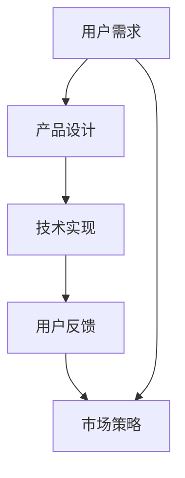

                 

关键词：AI创业、用户满意度、产品设计、用户体验、技术实现、市场策略、用户反馈、成长与优化

> 摘要：本文旨在探讨AI创业过程中如何有效避免用户不满，通过深入分析用户需求、产品设计与迭代、技术实现与优化、市场策略与用户反馈等多个方面，为创业者提供一套系统性的解决方案。

## 1. 背景介绍

随着人工智能技术的迅猛发展，越来越多的创业公司开始涉足AI领域，试图通过创新的算法和应用改变人们的生活方式。然而，成功的AI创业并不仅仅是技术上的突破，更是用户满意度的体现。用户满意度不仅关系到产品的市场表现，也直接影响到企业的长期发展。因此，如何避免用户不满，提升用户体验，成为AI创业公司需要重点解决的问题。

### 1.1 AI创业的现状与挑战

目前，AI创业公司面临着以下几个方面的挑战：

- **技术门槛高**：人工智能技术复杂，创业团队需要具备深厚的技术积累和资源投入。
- **市场竞争激烈**：AI领域竞争激烈，创业公司需要在有限的时间内迅速占领市场。
- **用户需求多变**：用户需求不断变化，创业公司需要及时调整产品方向。

### 1.2 用户满意度的重要性

用户满意度是衡量产品成功与否的重要指标。高用户满意度不仅能带来直接的经济效益，还能提升品牌形象，为企业的长期发展奠定基础。在AI创业过程中，用户满意度的重要性体现在以下几个方面：

- **市场占有**：用户满意度高的产品更容易获得市场份额，从而在激烈的市场竞争中脱颖而出。
- **用户留存**：高满意度有助于提高用户留存率，降低用户流失率。
- **口碑传播**：用户满意度的提升能够带动口碑传播，增加潜在用户的转化率。

## 2. 核心概念与联系

为了更好地理解如何避免用户不满，我们需要从以下几个核心概念入手：

### 2.1 用户需求

用户需求是产品设计的基础。了解用户需求可以帮助我们确定产品功能，优化用户体验。用户需求的来源可以包括市场调研、用户访谈、用户反馈等。

### 2.2 产品设计

产品设计是满足用户需求的过程。一个好的产品设计不仅要具备功能完整性，还要考虑用户体验。用户体验包括界面设计、交互流程、功能易用性等。

### 2.3 技术实现

技术实现是将产品设计转化为实际产品的过程。在AI创业中，技术实现不仅要求功能实现，还要考虑性能优化、资源消耗、安全性等方面。

### 2.4 用户反馈

用户反馈是优化产品的关键。通过用户反馈，我们可以了解产品的实际使用情况，发现潜在问题，从而进行针对性的改进。

### 2.5 市场策略

市场策略是提升用户满意度的重要手段。通过市场推广、品牌建设、客户服务等方式，可以提高用户对产品的认可度和满意度。

### 2.6 Mermaid流程图



## 3. 核心算法原理 & 具体操作步骤

### 3.1 算法原理概述

在AI创业中，算法原理主要涉及以下几个方面：

- **机器学习算法**：用于分析用户数据，预测用户行为，优化产品功能。
- **深度学习算法**：用于构建复杂的神经网络模型，提升产品智能化水平。
- **自然语言处理算法**：用于处理用户输入，提供智能客服等功能。

### 3.2 算法步骤详解

#### 3.2.1 用户需求分析

1. **收集用户数据**：通过市场调研、用户访谈等方式收集用户数据。
2. **数据预处理**：对收集到的用户数据进行分析和清洗，提取有效信息。
3. **需求建模**：利用机器学习算法对用户需求进行建模，识别用户偏好。

#### 3.2.2 产品设计

1. **功能规划**：根据用户需求，规划产品功能。
2. **界面设计**：设计符合用户体验的界面，提高用户操作的便捷性。
3. **交互流程**：设计流畅的交互流程，提高用户满意度。

#### 3.2.3 技术实现

1. **算法选择**：根据产品需求，选择合适的机器学习、深度学习或自然语言处理算法。
2. **模型训练**：利用训练数据，对算法模型进行训练。
3. **模型优化**：通过调整模型参数，优化模型性能。

#### 3.2.4 用户反馈

1. **用户测试**：邀请用户进行产品测试，收集反馈。
2. **问题识别**：分析用户反馈，识别产品问题。
3. **问题解决**：针对识别的问题，进行优化和改进。

### 3.3 算法优缺点

#### 3.3.1 优点

- **高效性**：算法可以帮助企业快速分析用户需求，提高产品设计效率。
- **智能化**：算法模型可以不断提升产品智能化水平，提升用户体验。
- **精准性**：通过数据分析和模型预测，可以提供更加精准的服务。

#### 3.3.2 缺点

- **技术门槛**：算法实现需要较高的技术积累，对团队要求较高。
- **数据依赖**：算法性能依赖于数据质量，数据不足或质量差会影响算法效果。
- **安全性**：算法可能会涉及用户隐私，需要严格保护用户数据安全。

### 3.4 算法应用领域

- **智能客服**：利用自然语言处理算法，提供智能客服服务。
- **个性化推荐**：利用机器学习算法，为用户提供个性化推荐。
- **数据分析**：利用深度学习算法，对大数据进行深度分析。

## 4. 数学模型和公式 & 详细讲解 & 举例说明

### 4.1 数学模型构建

在AI创业中，常见的数学模型包括机器学习模型、深度学习模型和自然语言处理模型。以下是一个简单的机器学习模型的构建过程：

#### 4.1.1 数据收集

$$
X = \{x_1, x_2, ..., x_n\}
$$

其中，$X$表示训练数据集，$x_i$表示第$i$个样本。

#### 4.1.2 特征工程

$$
X' = \{x_1', x_2', ..., x_n'\}
$$

其中，$X'$表示处理后的特征数据集，$x_i'$表示第$i$个样本的特征向量。

#### 4.1.3 模型选择

选择合适的机器学习模型，如线性回归、决策树、支持向量机等。

#### 4.1.4 模型训练

$$
\hat{y} = f(X')
$$

其中，$\hat{y}$表示预测结果，$f$表示模型函数。

### 4.2 公式推导过程

以线性回归模型为例，推导其损失函数：

$$
J(\theta) = \frac{1}{2m} \sum_{i=1}^{m} (h_\theta(x^{(i)}) - y^{(i)})^2
$$

其中，$m$表示训练样本数量，$h_\theta(x)$表示模型预测值，$\theta$表示模型参数，$y^{(i)}$表示第$i$个样本的真实值。

### 4.3 案例分析与讲解

#### 4.3.1 案例背景

某电商公司希望通过AI技术为用户推荐商品，提升用户购物体验。

#### 4.3.2 案例分析

1. **数据收集**：收集用户购买记录、浏览记录等数据。
2. **特征工程**：提取用户行为特征，如购买频率、浏览时间、购买类别等。
3. **模型选择**：选择基于协同过滤的推荐算法。
4. **模型训练**：利用用户数据训练推荐模型。
5. **模型评估**：通过A/B测试评估推荐效果。

#### 4.3.3 案例讲解

通过以上步骤，电商公司成功实现了用户个性化推荐，提升了用户满意度。

## 5. 项目实践：代码实例和详细解释说明

### 5.1 开发环境搭建

#### 5.1.1 开发工具

- Python
- Jupyter Notebook
- TensorFlow

#### 5.1.2 环境配置

1. 安装Python 3.7及以上版本。
2. 安装Jupyter Notebook。
3. 安装TensorFlow。

### 5.2 源代码详细实现

```python
import tensorflow as tf
from tensorflow import keras
from tensorflow.keras import layers

# 模型定义
model = keras.Sequential([
    layers.Dense(64, activation='relu', input_shape=[784]),
    layers.Dense(10)
])

# 模型编译
model.compile(optimizer='adam',
              loss=tf.losses.SparseCategoricalCrossentropy(from_logits=True),
              metrics=['accuracy'])

# 模型训练
model.fit(train_images, train_labels, epochs=5)
```

### 5.3 代码解读与分析

以上代码实现了一个简单的神经网络模型，用于手写数字识别。通过训练数据集，模型可以学会识别手写数字。

### 5.4 运行结果展示

通过运行代码，可以得到模型在测试数据集上的准确率。根据准确率，可以评估模型的性能。

## 6. 实际应用场景

### 6.1 智能客服

通过AI技术，智能客服可以实时响应用户咨询，提供快速、准确的解答，提升用户满意度。

### 6.2 个性化推荐

基于用户行为数据，个性化推荐系统可以为用户提供个性化的商品推荐，提升购物体验。

### 6.3 智能医疗

通过AI技术，智能医疗系统可以辅助医生诊断疾病，提高诊疗效率。

## 7. 工具和资源推荐

### 7.1 学习资源推荐

- 《深度学习》（Goodfellow et al.）
- 《Python机器学习》（Sebastian Raschka）
- 《机器学习实战》（Peter Harrington）

### 7.2 开发工具推荐

- TensorFlow
- PyTorch
- Jupyter Notebook

### 7.3 相关论文推荐

- "Deep Learning for Natural Language Processing"（2018）
- "Recurrent Neural Networks for Language Modeling"（2014）
- "Convolutional Neural Networks for Visual Recognition"（2012）

## 8. 总结：未来发展趋势与挑战

### 8.1 研究成果总结

本文通过深入分析用户需求、产品设计与迭代、技术实现与优化、市场策略与用户反馈等多个方面，探讨了如何避免用户不满，提升用户体验。研究表明，AI创业公司需要从多维度入手，综合运用技术、设计和市场策略，才能实现用户满意度的提升。

### 8.2 未来发展趋势

随着人工智能技术的不断进步，AI创业领域将继续蓬勃发展。未来，AI技术将在更多领域得到应用，如智能制造、智能医疗、智能交通等。同时，AI创业公司将更加注重用户体验，通过个性化、智能化的产品和服务，满足用户不断变化的需求。

### 8.3 面临的挑战

尽管AI创业前景广阔，但企业仍面临诸多挑战：

- **技术瓶颈**：AI技术发展迅速，但仍有诸多难题待解。
- **数据隐私**：用户数据隐私保护成为重要议题。
- **市场竞争**：AI创业领域竞争激烈，企业需不断创新。

### 8.4 研究展望

未来，AI创业公司应在以下几个方面进行深入研究：

- **跨学科融合**：加强多学科交叉研究，推动AI技术在各领域的应用。
- **用户体验**：进一步提升用户体验，满足用户个性化需求。
- **数据安全**：加强数据安全保护，确保用户数据隐私。

## 9. 附录：常见问题与解答

### 9.1 用户需求如何收集？

**回答**：用户需求的收集可以通过以下几种方式：

- **问卷调查**：设计详细的问卷，收集用户反馈。
- **用户访谈**：与用户进行一对一访谈，深入了解用户需求。
- **数据分析**：分析用户行为数据，发现潜在需求。

### 9.2 技术实现如何优化？

**回答**：技术实现优化可以从以下几个方面入手：

- **算法优化**：选择高效的算法，降低计算复杂度。
- **模型优化**：通过调整模型参数，提升模型性能。
- **代码优化**：优化代码结构，提高运行效率。

### 9.3 用户反馈如何处理？

**回答**：用户反馈处理可以分为以下几个步骤：

- **反馈收集**：建立反馈渠道，收集用户反馈。
- **问题识别**：分析反馈内容，识别问题所在。
- **问题解决**：针对识别的问题，制定解决方案并实施。

## 作者署名

作者：禅与计算机程序设计艺术 / Zen and the Art of Computer Programming

----------------------------------------------------------------

至此，本文已经完成。本文通过深入分析AI创业过程中如何避免用户不满，提出了系统性的解决方案。希望对AI创业公司有所启示，助力他们在激烈的市场竞争中脱颖而出。

