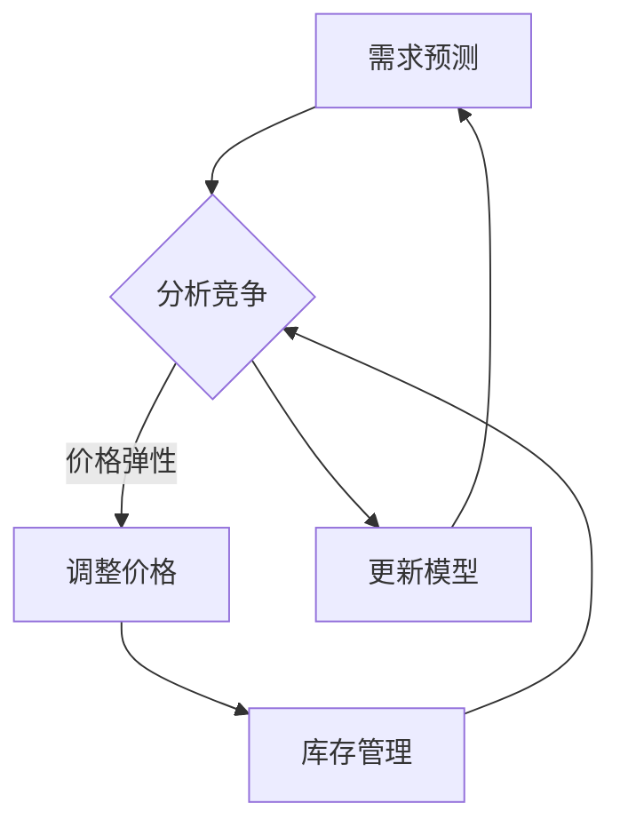

                 

关键词：人工智能，动态定价，机器学习，数据挖掘，经济模型，市场预测，应用场景，挑战与展望。

> 摘要：本文将探讨人工智能在动态定价领域的应用，从原理、应用、挑战等方面全面解析AI动态定价的现状与发展趋势。我们将结合实际案例，深入分析AI动态定价的数学模型、核心算法及其优缺点，以及其在各行业的实际应用和未来展望。

## 1. 背景介绍

动态定价（Dynamic Pricing）是一种根据市场需求、竞争对手策略、库存水平等因素实时调整商品或服务价格的策略。这一概念起源于航空、酒店等行业，但近年来随着人工智能技术的发展，动态定价逐渐在电商、物流、广告等多个领域得到广泛应用。

人工智能（AI）作为当今科技发展的前沿领域，其核心在于模拟人类智能，通过机器学习、深度学习等技术手段，实现数据的自动获取、分析和决策。将AI技术应用于动态定价，不仅可以提高定价的准确性和效率，还能为企业带来更高的利润。

## 2. 核心概念与联系

### 2.1 动态定价的核心概念

- **需求预测**：预测市场对某种商品或服务的需求量。
- **竞争分析**：分析竞争对手的定价策略。
- **库存管理**：监测商品库存水平，根据库存情况调整价格。
- **价格弹性**：消费者对价格变动的敏感程度。

### 2.2 人工智能与动态定价的联系

- **机器学习**：通过历史数据和算法模型，预测市场需求和价格趋势。
- **数据挖掘**：挖掘用户行为和购买习惯，为动态定价提供决策依据。
- **经济模型**：构建基于供需关系的数学模型，优化定价策略。

### 2.3 Mermaid 流程图



## 3. 核心算法原理 & 具体操作步骤

### 3.1 算法原理概述

动态定价的算法原理主要包括以下三个方面：

- **需求预测**：利用时间序列分析和机器学习技术，预测市场需求。
- **竞争分析**：通过数据挖掘技术，分析竞争对手的定价策略。
- **定价策略**：根据需求预测和竞争分析结果，制定合理的定价策略。

### 3.2 算法步骤详解

1. **数据收集**：收集历史销售数据、竞争对手定价数据、用户行为数据等。
2. **需求预测**：利用机器学习算法，对需求进行预测。
3. **竞争分析**：通过数据挖掘技术，分析竞争对手的定价策略。
4. **定价策略**：结合需求预测和竞争分析结果，制定定价策略。
5. **定价实施**：根据定价策略，实时调整商品或服务的价格。
6. **模型更新**：根据实时数据，不断更新和优化模型。

### 3.3 算法优缺点

- **优点**：提高定价准确性，优化库存管理，提高企业利润。
- **缺点**：对数据质量要求高，计算复杂度大，需要不断调整和优化。

### 3.4 算法应用领域

- **电商**：根据用户行为和需求，实现个性化定价。
- **物流**：根据实时库存和运输成本，调整物流价格。
- **广告**：根据用户兴趣和行为，实现精准广告投放。

## 4. 数学模型和公式 & 详细讲解 & 举例说明

### 4.1 数学模型构建

动态定价的数学模型主要包括需求预测模型、竞争分析模型和定价策略模型。

- **需求预测模型**：常用的时间序列分析模型包括ARIMA、LSTM等。
- **竞争分析模型**：常见的聚类算法包括K-means、DBSCAN等。
- **定价策略模型**：常用的优化算法包括线性规划、遗传算法等。

### 4.2 公式推导过程

假设需求量 \(D\) 与价格 \(P\) 之间的关系可以用线性函数表示：

$$
D = aP + b
$$

其中，\(a\) 和 \(b\) 为常数。通过数据拟合，可以得到具体的函数表达式。

### 4.3 案例分析与讲解

以电商平台的个性化定价为例，我们使用K-means算法对用户进行聚类，根据不同聚类结果，制定不同的定价策略。

1. **数据收集**：收集用户购买历史数据，包括商品ID、价格、购买量等。
2. **数据预处理**：对数据进行清洗、归一化处理。
3. **聚类分析**：使用K-means算法，将用户分为不同聚类。
4. **定价策略**：根据聚类结果，制定不同的定价策略。

## 5. 项目实践：代码实例和详细解释说明

### 5.1 开发环境搭建

- **Python**：安装Python 3.8及以上版本。
- **库**：安装NumPy、Pandas、Scikit-learn、Matplotlib等库。

### 5.2 源代码详细实现

```python
import numpy as np
import pandas as pd
from sklearn.cluster import KMeans
from sklearn.preprocessing import StandardScaler

# 读取数据
data = pd.read_csv('data.csv')
X = data[['price', 'quantity']]

# 数据归一化
scaler = StandardScaler()
X_scaled = scaler.fit_transform(X)

# 聚类分析
kmeans = KMeans(n_clusters=3)
kmeans.fit(X_scaled)
clusters = kmeans.predict(X_scaled)

# 定价策略
for cluster in range(3):
    cluster_data = X_scaled[clusters == cluster]
    a, b = np.polyfit(cluster_data[:, 0], cluster_data[:, 1], 1)
    print(f'Cluster {cluster}: D = {a}P + {b}')
```

### 5.3 代码解读与分析

1. **数据读取与预处理**：读取商品价格和购买量数据，并进行归一化处理。
2. **聚类分析**：使用K-means算法，将用户分为3个聚类。
3. **定价策略**：根据聚类结果，使用线性回归模型，拟合不同聚类中的需求与价格关系。

## 6. 实际应用场景

### 6.1 电商

电商平台可以根据用户购买历史和行为，实现个性化定价，提高用户满意度。

### 6.2 物流

物流公司可以根据实时库存和运输成本，动态调整物流价格，提高运输效率。

### 6.3 广告

广告平台可以根据用户兴趣和行为，实现精准广告投放，提高广告效果。

## 7. 未来应用展望

随着人工智能技术的不断发展，动态定价将在更多领域得到应用。未来，我们可以期待以下发展趋势：

1. **更精确的需求预测**：结合深度学习和大数据技术，实现更精确的需求预测。
2. **更智能的定价策略**：利用强化学习等技术，实现更智能的定价策略。
3. **更广泛的行业应用**：动态定价将在更多行业得到广泛应用，如医疗、金融等。

## 8. 总结：未来发展趋势与挑战

### 8.1 研究成果总结

本文从原理、应用、挑战等方面全面解析了AI动态定价。通过实际案例和代码实现，展示了AI动态定价在电商、物流、广告等领域的应用效果。

### 8.2 未来发展趋势

未来，AI动态定价将在更广泛的领域得到应用，结合深度学习、大数据、强化学习等技术，实现更智能、更精确的定价策略。

### 8.3 面临的挑战

- **数据质量**：动态定价对数据质量要求高，如何提高数据质量是一个重要挑战。
- **计算复杂度**：动态定价算法计算复杂度较大，如何提高计算效率是一个挑战。
- **行业适应性**：不同行业具有不同的特点和需求，如何实现通用性是一个挑战。

### 8.4 研究展望

未来，我们将继续深入研究AI动态定价，探索更多创新算法和技术，以应对行业挑战，实现更智能、更高效的动态定价。

## 9. 附录：常见问题与解答

### 9.1 动态定价与传统定价有何不同？

动态定价可以根据实时数据和市场需求，动态调整价格，以实现利润最大化。而传统定价通常是基于固定的价格策略，缺乏灵活性。

### 9.2 动态定价对数据质量有何要求？

动态定价对数据质量要求较高，需要收集完整、准确的历史销售数据、竞争对手定价数据、用户行为数据等。

### 9.3 动态定价在哪些领域有广泛应用？

动态定价在电商、物流、广告等领域有广泛应用，如个性化定价、物流价格调整、精准广告投放等。

### 9.4 动态定价有哪些优缺点？

动态定价的优点包括提高定价准确性、优化库存管理、提高企业利润。缺点包括对数据质量要求高、计算复杂度大等。

----------------------------------------------------------------

作者：禅与计算机程序设计艺术 / Zen and the Art of Computer Programming

