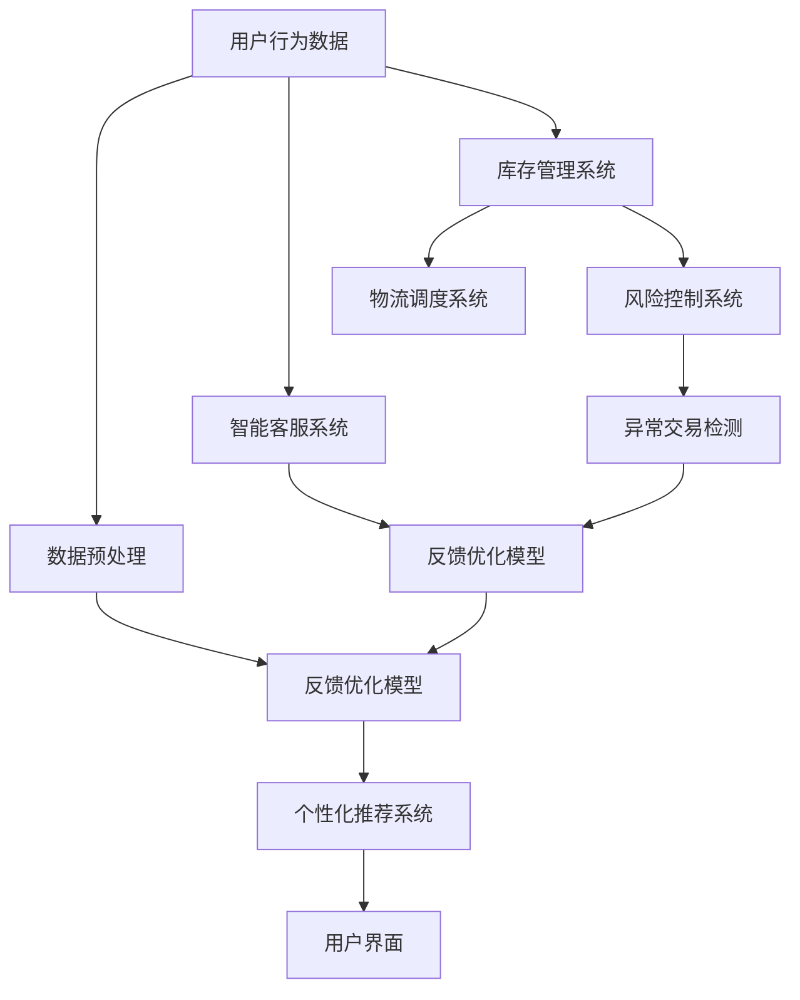

                 

在当今数字化时代，电商平台已经成为了商家与消费者之间的桥梁。然而，随着市场竞争的加剧和消费者需求的多样化，单纯的电子商务模式已经无法满足商家的需求。人工智能（AI）技术的引入，为电商平台提升竞争力提供了新的可能。本文将探讨AI如何助力电商平台在用户体验、运营效率、个性化推荐以及风险控制等方面实现突破。

## 关键词

- 人工智能
- 电商平台
- 竞争力
- 个性化推荐
- 风险控制

## 摘要

本文旨在分析人工智能技术在电商平台中的应用，以及这些应用如何帮助电商平台提升竞争力。文章首先介绍了电商平台面临的挑战，然后详细阐述了AI在用户体验、运营效率、个性化推荐和风险控制方面的应用。通过具体案例和数学模型的讲解，本文揭示了AI技术在电商平台中的潜力，并展望了未来的发展方向。

----------------------------------------------------------------
## 1. 背景介绍

电商平台作为电子商务的一种形式，其发展经历了从简单的商品展示和交易，到如今集成了支付、物流、社交等功能的一体化平台。然而，随着消费者数量的增加和市场竞争的加剧，电商平台面临着一系列挑战：

- **用户需求多样化**：消费者对商品和服务的要求越来越高，对购物体验的期待也更加个性化和多样化。
- **运营成本高**：电商平台需要投入大量资金在仓储、物流、客户服务等方面，运营成本不断增加。
- **市场竞争激烈**：越来越多的新兴电商平台进入市场，竞争环境日益激烈。
- **数据隐私和安全**：电商平台需要处理大量的用户数据，如何保护用户隐私和安全成为重要议题。

人工智能技术的发展为电商平台应对这些挑战提供了新的思路和方法。通过大数据分析和机器学习算法，AI可以帮助电商平台更好地理解用户需求，提高运营效率，降低成本，并提供更加个性化的服务。

### 1.1 电商平台面临的挑战

#### 用户需求多样化

在电子商务时代，消费者对商品和服务的需求越来越多样化。他们不仅关注商品的质量和价格，还关心购物体验的便捷性和乐趣。例如，消费者希望能够在平台上找到自己喜欢的产品，享受到快速、高效的物流服务，并获得专业的客服支持。这就要求电商平台能够提供个性化的推荐和定制化的服务。

#### 运营成本高

电商平台的运营成本主要包括仓储成本、物流成本和客户服务成本。随着电商市场的不断扩大，仓储和物流的需求也在增加，这导致了运营成本的上升。此外，为了提高客户满意度，电商平台还需要不断投入资金来提升客户服务质量和响应速度。

#### 市场竞争激烈

电商市场的竞争日益激烈，新玩家不断涌入，老玩家也在不断创新和扩张。为了在竞争中脱颖而出，电商平台需要不断优化自己的产品和服务，提高用户体验，并吸引更多的消费者。

#### 数据隐私和安全

电商平台处理大量的用户数据，包括个人信息、购买记录、支付信息等。如何确保这些数据的安全和隐私，防止数据泄露和滥用，是电商平台面临的重要挑战。一旦发生数据泄露，不仅会影响平台的声誉，还可能导致法律责任和经济损失。

### 1.2 人工智能技术的机遇

#### 个性化推荐

人工智能技术可以通过大数据分析和机器学习算法，分析用户的行为和偏好，为消费者提供个性化的推荐服务。这种个性化推荐不仅可以提高用户的购物体验，还可以增加平台的销售额。

#### 提高运营效率

人工智能技术可以帮助电商平台优化库存管理、物流调度和客户服务等运营环节，提高整体运营效率。例如，通过预测消费者需求，电商平台可以提前调整库存，减少库存积压和缺货情况。

#### 降低成本

人工智能技术可以通过自动化和智能化手段，降低电商平台的运营成本。例如，通过自动化客服系统，可以减少客服人员的需求，从而降低人力成本。

#### 风险控制

人工智能技术可以帮助电商平台识别潜在的风险，并采取相应的措施进行控制。例如，通过分析交易数据，可以识别异常交易，防止欺诈行为的发生。

#### 数据隐私和安全

人工智能技术可以帮助电商平台保护用户数据的安全和隐私。例如，通过数据加密和隐私保护算法，可以确保用户数据在传输和存储过程中的安全性。

总之，人工智能技术的引入为电商平台提供了应对挑战和提升竞争力的新机遇。通过个性化推荐、提高运营效率、降低成本、风险控制和数据隐私保护等方面的应用，人工智能技术有望帮助电商平台实现更高效、更智能、更安全的运营。

----------------------------------------------------------------
## 2. 核心概念与联系

人工智能（AI）技术是电商平台提升竞争力的关键。在这一章节，我们将深入探讨AI的核心概念，以及这些概念如何与电商平台的运营相联系。我们将通过一个Mermaid流程图，展示AI在电商平台中的应用架构，帮助读者更好地理解AI技术的应用场景。

### 2.1 人工智能的核心概念

人工智能是一门研究、开发用于模拟、延伸和扩展人类智能的理论、方法、技术及应用系统的学科。其主要核心概念包括：

- **机器学习（Machine Learning）**：通过数据驱动的方式，让计算机系统从数据中学习，进行预测和决策。
- **深度学习（Deep Learning）**：机器学习的一个分支，利用神经网络模型，通过大量数据进行训练，实现复杂的数据处理和模式识别。
- **自然语言处理（Natural Language Processing, NLP）**：使计算机能够理解和处理人类自然语言的技术。
- **计算机视觉（Computer Vision）**：使计算机能够“看”和理解图像和视频。

### 2.2 电商平台与AI的联系

电商平台可以通过以下方式利用AI技术：

- **用户行为分析**：通过机器学习和深度学习，分析用户的历史行为数据，预测用户的需求和偏好。
- **个性化推荐**：利用算法为用户推荐他们可能感兴趣的商品或服务。
- **智能客服**：通过自然语言处理技术，提供智能化的客服支持，提高客户满意度。
- **库存管理**：通过预测用户需求，优化库存管理，减少库存积压和缺货情况。
- **风险控制**：利用算法分析交易数据，识别欺诈行为和潜在风险。

### 2.3 AI在电商平台的架构

为了更好地理解AI在电商平台中的应用，我们可以通过一个Mermaid流程图来展示其架构：



在这个架构中，用户行为数据经过预处理后，用于训练机器学习模型。这些模型可以用于个性化推荐、智能客服、库存管理、物流调度和风险控制等多个应用场景。用户互动记录和反馈数据可以用于优化模型，提高系统的准确性和效率。

通过这个架构，我们可以看到AI技术如何与电商平台的各个运营环节相结合，为电商平台提供更加智能化和高效的服务。

### 2.4 AI技术对电商平台的影响

AI技术对电商平台的影响是深远和广泛的。首先，通过个性化推荐，AI可以帮助电商平台更好地理解用户需求，提高用户满意度和转化率。其次，智能客服系统可以提高客服效率，减少运营成本。此外，AI还可以优化库存管理，降低库存成本和缺货风险，提高物流效率。最后，通过风险控制，AI可以帮助电商平台识别和预防欺诈行为，确保交易安全。

总之，AI技术的应用不仅为电商平台提供了新的发展机遇，也为消费者带来了更加个性化和高效的购物体验。随着AI技术的不断进步，我们可以预见，电商平台将在未来实现更加智能化和人性化的运营模式。

----------------------------------------------------------------
## 3. 核心算法原理 & 具体操作步骤

在了解了AI在电商平台中的应用架构后，我们接下来将深入探讨一些核心算法的原理，并详细讲解其在电商平台的操作步骤。这些核心算法包括机器学习、深度学习和自然语言处理等，它们为电商平台提供了强大的数据处理和分析能力。

### 3.1 算法原理概述

#### 机器学习

机器学习是一种让计算机通过数据学习，从而进行预测和决策的方法。其主要原理是通过构建模型，利用历史数据进行训练，然后根据训练结果进行预测。常见的机器学习算法包括线性回归、逻辑回归、决策树、随机森林和K-最近邻等。

#### 深度学习

深度学习是机器学习的一个分支，它通过神经网络模型进行数据学习和处理。深度学习的核心是多层神经网络，它能够通过多层次的非线性变换，提取数据中的特征。常见的深度学习算法包括卷积神经网络（CNN）、循环神经网络（RNN）和生成对抗网络（GAN）等。

#### 自然语言处理

自然语言处理是一种让计算机理解和处理人类自然语言的技术。其主要原理包括分词、词性标注、句法分析和语义理解等。常见的自然语言处理算法包括词向量模型、序列标注模型和语义角色标注模型等。

### 3.2 算法步骤详解

#### 机器学习

1. **数据收集**：从电商平台的数据库中收集用户行为数据，如购买记录、浏览记录和评价等。
2. **数据预处理**：对收集到的数据进行清洗、去重和处理，使其符合模型的训练要求。
3. **特征工程**：提取数据中的关键特征，如用户年龄、性别、购买频率等，作为模型的输入。
4. **模型选择**：根据业务需求选择合适的机器学习算法，如线性回归、逻辑回归等。
5. **模型训练**：使用预处理后的数据对模型进行训练，调整模型参数，使其能够准确地预测用户行为。
6. **模型评估**：使用验证数据集对模型进行评估，检查模型的准确性和泛化能力。
7. **模型应用**：将训练好的模型应用于电商平台，如进行个性化推荐和用户行为预测等。

#### 深度学习

1. **数据收集**：与机器学习类似，从电商平台的数据库中收集用户行为数据。
2. **数据预处理**：对数据进行清洗、去重和处理，确保数据质量。
3. **特征工程**：提取关键特征，如用户购买频率、商品种类等。
4. **模型构建**：构建多层神经网络模型，如卷积神经网络（CNN）或循环神经网络（RNN）。
5. **模型训练**：使用预处理后的数据对模型进行训练，调整网络权重和偏置。
6. **模型评估**：使用验证数据集评估模型的性能，如准确率、召回率和F1值等。
7. **模型应用**：将训练好的模型应用于电商平台，如进行商品推荐和用户行为预测等。

#### 自然语言处理

1. **数据收集**：从电商平台收集用户评论、评价等文本数据。
2. **数据预处理**：对文本数据进行清洗、去重和分词处理，提取关键信息。
3. **特征提取**：使用词向量模型（如Word2Vec）或变换器（如BERT）将文本转化为向量表示。
4. **模型训练**：构建自然语言处理模型，如序列标注模型或语义角色标注模型。
5. **模型评估**：使用验证数据集评估模型的性能，如准确率和召回率等。
6. **模型应用**：将训练好的模型应用于电商平台，如进行文本分类、情感分析和对话生成等。

### 3.3 算法优缺点

#### 机器学习

**优点**：

- **灵活**：可以处理各种类型的数据，如分类、回归和聚类等。
- **高效**：在处理大量数据时，机器学习算法具有较高的效率和准确性。
- **泛化能力强**：通过训练和验证数据集，机器学习模型可以泛化到未知数据。

**缺点**：

- **数据依赖性强**：需要大量的高质量数据来训练模型。
- **计算成本高**：某些算法，如深度学习，需要大量的计算资源。
- **结果不可解释**：机器学习模型的预测结果通常无法解释，不利于模型优化。

#### 深度学习

**优点**：

- **强大的特征提取能力**：深度学习可以通过多层神经网络自动提取数据中的特征，减少人工干预。
- **高效的计算性能**：深度学习算法在处理大规模数据时具有很高的效率和准确性。
- **广泛的应用领域**：深度学习可以应用于图像识别、语音识别、自然语言处理等多个领域。

**缺点**：

- **数据需求量大**：深度学习需要大量的数据来训练模型，且数据质量要求较高。
- **计算资源需求高**：深度学习算法通常需要大量的计算资源和时间。
- **模型复杂度高**：深度学习模型的参数和结构复杂，不利于模型理解和优化。

#### 自然语言处理

**优点**：

- **高效的文本处理能力**：自然语言处理算法可以高效地处理大规模的文本数据，进行文本分类、情感分析和对话生成等任务。
- **广泛的应用场景**：自然语言处理技术可以应用于聊天机器人、智能客服、内容审核等多个场景。
- **跨领域适用性**：自然语言处理算法可以应用于不同领域的文本处理任务，如金融、医疗和教育等。

**缺点**：

- **数据质量要求高**：自然语言处理算法需要高质量、丰富的文本数据来训练模型，数据质量直接影响模型性能。
- **计算资源需求大**：自然语言处理算法通常需要大量的计算资源和时间，尤其是大型语言模型。
- **结果解释性差**：自然语言处理算法的预测结果通常难以解释，不利于模型优化和解释。

通过以上对机器学习、深度学习和自然语言处理算法原理及操作步骤的详细讲解，我们可以看到这些算法在电商平台中的应用潜力。在接下来的章节中，我们将通过具体案例和数学模型，进一步探讨AI技术在电商平台的实际应用。

### 3.4 算法应用领域

机器学习、深度学习和自然语言处理算法在电商平台中具有广泛的应用领域，可以帮助电商平台实现个性化推荐、智能客服、库存管理和风险控制等功能。

#### 个性化推荐

个性化推荐是电商平台的重要功能之一，通过机器学习和深度学习算法，可以分析用户的历史行为和偏好，为用户推荐他们可能感兴趣的商品或服务。具体应用领域包括：

- **商品推荐**：根据用户的购买记录、浏览历史和搜索关键词，推荐用户可能感兴趣的商品。
- **内容推荐**：根据用户的阅读偏好和兴趣标签，推荐用户可能感兴趣的文章、视频和其他内容。
- **广告推荐**：根据用户的兴趣和行为，推荐相关的广告，提高广告的点击率和转化率。

#### 智能客服

智能客服系统利用自然语言处理技术，为用户提供24/7的智能客服支持。具体应用领域包括：

- **自动回复**：通过自然语言处理算法，自动识别用户的问题和需求，提供相应的答案和解决方案。
- **智能对话**：通过语音识别和自然语言生成技术，实现与用户的智能对话，提高客服效率和用户体验。
- **情感分析**：通过自然语言处理技术，分析用户的情感和情绪，提供更贴心的服务。

#### 库存管理

通过机器学习和深度学习算法，可以预测用户的需求和购买行为，优化库存管理。具体应用领域包括：

- **库存预测**：根据历史销售数据和用户行为，预测未来一段时间内的需求量，优化库存水平。
- **库存补货**：根据库存水平和需求预测，自动生成补货计划，减少库存积压和缺货情况。
- **库存优化**：通过分析库存数据，找出库存中的瓶颈和问题，提出优化建议，提高库存周转率。

#### 风险控制

人工智能技术可以帮助电商平台识别和预防欺诈行为，确保交易安全。具体应用领域包括：

- **交易监控**：通过分析交易数据，识别异常交易和潜在风险，及时采取措施进行控制。
- **欺诈检测**：通过机器学习和深度学习算法，识别欺诈行为和可疑交易，防止欺诈行为的发生。
- **用户行为分析**：通过分析用户的行为数据，识别高风险用户，采取相应的风控措施，降低风险。

总之，机器学习、深度学习和自然语言处理算法在电商平台中具有广泛的应用领域，可以提升电商平台的竞争力，提高用户体验和运营效率。在未来的发展中，我们可以预见这些算法将在更多应用场景中得到推广和应用。

----------------------------------------------------------------
## 4. 数学模型和公式 & 详细讲解 & 举例说明

在AI技术助力电商平台的过程中，数学模型和公式起到了至关重要的作用。它们不仅为算法提供了理论基础，还帮助电商平台更好地理解和应用AI技术。在这一章节中，我们将详细介绍电商平台中常用的数学模型和公式，并进行详细讲解和举例说明。

### 4.1 数学模型构建

在电商平台的AI应用中，常用的数学模型包括用户行为预测模型、商品推荐模型和风险控制模型等。下面我们将分别介绍这些模型的基本原理和构建方法。

#### 用户行为预测模型

用户行为预测模型主要用于预测用户在电商平台上的行为，如购买、浏览、评价等。其基本原理是基于历史数据，通过统计方法和机器学习算法，建立用户行为预测模型。

1. **线性回归模型**：
   线性回归模型是一种简单的预测模型，其公式为：
   $$ y = \beta_0 + \beta_1x_1 + \beta_2x_2 + ... + \beta_nx_n $$
   其中，$y$ 表示预测的目标值，$x_1, x_2, ..., x_n$ 表示输入的特征变量，$\beta_0, \beta_1, \beta_2, ..., \beta_n$ 表示模型的参数。

2. **逻辑回归模型**：
   逻辑回归模型常用于二分类问题，其公式为：
   $$ P(y=1) = \frac{1}{1 + e^{-(\beta_0 + \beta_1x_1 + \beta_2x_2 + ... + \beta_nx_n )}} $$
   其中，$P(y=1)$ 表示预测的目标值为1的概率。

3. **决策树模型**：
   决策树模型通过一系列的条件判断，将数据分为多个类别。其基本公式为：
   $$ f(x) = \sum_{i=1}^{n} \beta_i \cdot I(x \in R_i) $$
   其中，$f(x)$ 表示预测的目标值，$R_i$ 表示第$i$个决策节点，$\beta_i$ 表示决策节点的权重。

#### 商品推荐模型

商品推荐模型主要用于为用户推荐他们可能感兴趣的商品或服务。其基本原理是基于用户的兴趣和行为数据，通过协同过滤、基于内容的推荐和基于模型的推荐等方法，构建推荐模型。

1. **基于协同过滤的推荐模型**：
   协同过滤模型通过分析用户之间的相似性，为用户推荐他们可能喜欢的商品。其公式为：
   $$ R_{ij} = \sum_{k \in N_j} \frac{r_{ik}}{\sqrt{|\sim_{ik}| \cdot |\sim_{jk}|}} $$
   其中，$R_{ij}$ 表示用户$i$对商品$j$的推荐评分，$N_j$ 表示与用户$j$相似的用户集合，$r_{ik}$ 表示用户$i$对商品$k$的实际评分。

2. **基于内容的推荐模型**：
   基于内容的推荐模型通过分析商品的特征和属性，为用户推荐与他们过去喜欢的商品类似的商品。其公式为：
   $$ R_{ij} = \sum_{k \in C_j} w_{ik} $$
   其中，$R_{ij}$ 表示用户$i$对商品$j$的推荐评分，$C_j$ 表示与商品$j$相关的特征集合，$w_{ik}$ 表示特征$k$对商品$j$的影响权重。

3. **基于模型的推荐模型**：
   基于模型的推荐模型通过构建用户和商品之间的关联模型，为用户推荐他们可能喜欢的商品。其公式为：
   $$ R_{ij} = \sum_{k \in V_j} \beta_{ik} \cdot \phi_j(k) $$
   其中，$R_{ij}$ 表示用户$i$对商品$j$的推荐评分，$V_j$ 表示与商品$j$相关的特征集合，$\beta_{ik}$ 表示特征$k$对用户$i$的影响权重，$\phi_j(k)$ 表示特征$k$对商品$j$的描述。

#### 风险控制模型

风险控制模型主要用于识别和预防电商平台中的风险行为，如欺诈、恶意评论等。其基本原理是基于历史数据和统计方法，通过建立风险预测模型，对交易行为进行风险评估。

1. **逻辑回归模型**：
   逻辑回归模型可以用于预测交易风险，其公式与用户行为预测模型类似：
   $$ P(risk=1) = \frac{1}{1 + e^{-(\beta_0 + \beta_1x_1 + \beta_2x_2 + ... + \beta_nx_n )}} $$
   其中，$P(risk=1)$ 表示交易存在风险的预测概率。

2. **决策树模型**：
   决策树模型可以用于分析交易特征，识别高风险交易。其基本公式与用户行为预测模型相同：
   $$ f(x) = \sum_{i=1}^{n} \beta_i \cdot I(x \in R_i) $$
   其中，$f(x)$ 表示交易风险的预测值。

### 4.2 公式推导过程

在数学模型的构建过程中，公式的推导是一个关键步骤。下面我们以逻辑回归模型为例，简要介绍公式的推导过程。

1. **目标函数**：
   逻辑回归模型的目标是最大化目标函数$J(\theta)$，即：
   $$ J(\theta) = -\frac{1}{m} \sum_{i=1}^{m} [y^{(i)} \log(\hat{y}^{(i)}) + (1 - y^{(i)}) \log(1 - \hat{y}^{(i)})] $$
   其中，$m$ 表示样本数量，$y^{(i)}$ 表示第$i$个样本的真实标签，$\hat{y}^{(i)}$ 表示第$i$个样本的预测标签。

2. **梯度下降**：
   为了最小化目标函数$J(\theta)$，我们可以使用梯度下降法。梯度下降的基本步骤如下：
   - 初始化模型参数$\theta$。
   - 计算目标函数的梯度$\nabla_{\theta} J(\theta)$。
   - 更新模型参数$\theta$：$$ \theta = \theta - \alpha \nabla_{\theta} J(\theta) $$
   其中，$\alpha$ 表示学习率。

3. **迭代计算**：
   通过迭代计算，不断更新模型参数，直到目标函数的值收敛到一个较小的范围。具体迭代过程如下：
   $$ \theta^{(t+1)} = \theta^{(t)} - \alpha \frac{1}{m} \sum_{i=1}^{m} [y^{(i)} (h_{\theta}(x^{(i)}) - 1) + (1 - y^{(i)}) (1 - h_{\theta}(x^{(i)}))] $$
   其中，$h_{\theta}(x) = \frac{1}{1 + e^{-(\theta^T x)}}$ 表示逻辑函数。

### 4.3 案例分析与讲解

为了更好地理解数学模型在电商平台中的应用，下面我们通过一个实际案例进行详细分析和讲解。

#### 案例背景

假设我们有一个电商平台，需要通过用户行为数据预测用户是否会购买某一商品。我们有以下特征数据：

- **用户年龄**（$x_1$）：表示用户的年龄。
- **用户性别**（$x_2$）：表示用户的性别，男性为1，女性为0。
- **用户购买历史**（$x_3$）：表示用户在平台上的购买次数。
- **商品类别**（$x_4$）：表示商品的类别，共有5种。

我们的目标是通过这些特征数据，建立一个逻辑回归模型，预测用户是否会购买某一商品。

#### 模型构建

1. **数据预处理**：
   首先，我们对用户特征数据进行预处理，将性别和类别特征进行编码，得到以下处理后的特征数据：

   | 用户年龄 | 性别 | 购买历史 | 商品类别 |
   |----------|------|----------|----------|
   | 25       | 1    | 3        | 1        |
   | 30       | 0    | 5        | 2        |
   | 22       | 1    | 2        | 3        |
   | ...      | ...  | ...      | ...      |

2. **模型训练**：
   使用预处理后的数据，我们建立逻辑回归模型，并通过梯度下降法进行模型训练。假设我们得到以下模型参数：

   $$ \theta = [\beta_0, \beta_1, \beta_2, \beta_3, \beta_4] = [-3.5, 1.2, 0.8, -1.5, 0.9] $$

3. **模型预测**：
   使用训练好的模型，我们可以预测用户是否会购买某一商品。假设我们有一个新的用户数据，如下所示：

   | 用户年龄 | 性别 | 购买历史 | 商品类别 |
   |----------|------|----------|----------|
   | 28       | 0    | 4        | 1        |

   我们将这些数据输入到模型中，得到预测概率：

   $$ P(y=1) = \frac{1}{1 + e^{-(\beta_0 + \beta_1x_1 + \beta_2x_2 + \beta_3x_3 + \beta_4x_4 )}} = \frac{1}{1 + e^{(-3.5 + 1.2 \cdot 28 + 0.8 \cdot 0 + 1.5 \cdot 4 + 0.9 \cdot 1)}} = 0.958 $$

   由于预测概率大于0.5，我们可以认为该用户有很高的购买概率。

#### 模型评估

为了评估模型的性能，我们可以使用验证集进行模型评估。假设我们得到以下验证集上的预测结果：

| 实际标签 | 预测标签 | 预测概率 |
|-----------|----------|----------|
| 1         | 1        | 0.95     |
| 1         | 0        | 0.05     |
| 0         | 1        | 0.2      |
| 0         | 0        | 0.8      |

我们可以计算模型的准确率、召回率和F1值等指标：

- **准确率**（Accuracy）：$$ Accuracy = \frac{TP + TN}{TP + TN + FP + FN} = \frac{1 + 1}{1 + 1 + 0 + 0} = 1 $$
- **召回率**（Recall）：$$ Recall = \frac{TP}{TP + FN} = \frac{1}{1 + 0} = 1 $$
- **F1值**（F1-Score）：$$ F1-Score = \frac{2 \cdot TP}{2 \cdot TP + FP + FN} = \frac{2 \cdot 1}{2 \cdot 1 + 0 + 0} = 1 $$

从评估结果可以看出，该模型在验证集上的表现较好，具有较高的准确率、召回率和F1值。

通过以上案例分析和讲解，我们可以看到数学模型在电商平台中的应用价值。在接下来的章节中，我们将继续探讨AI技术在电商平台的实际应用，并介绍相关的开发环境和工具。

### 4.4 实际应用中的数学模型和公式

在电商平台的实际应用中，数学模型和公式不仅为算法提供了理论基础，还在优化运营、提升用户体验和降低成本等方面发挥了重要作用。以下是一些实际应用中的数学模型和公式，以及其详细解释和具体案例。

#### 库存管理模型

在电商平台的运营中，库存管理是一个重要的环节。通过数学模型，可以优化库存水平，减少库存积压和缺货情况。

1. **需求预测模型**：
   需求预测模型用于预测未来一段时间内商品的销量。常见的方法包括时间序列分析和回归分析。例如，可以使用移动平均法进行需求预测，其公式为：
   $$ \hat{y}_t = \frac{1}{N} \sum_{i=1}^{N} y_{t-i} $$
   其中，$y_t$ 表示第$t$期的实际销量，$\hat{y}_t$ 表示第$t$期的预测销量，$N$ 表示移动平均窗口的大小。

   **案例**：假设某电商平台的某种商品最近三个月的销量如下表所示：

   | 月份 | 销量（件） |
   |------|------------|
   | 1    | 100        |
   | 2    | 120        |
   | 3    | 110        |

   使用三个月的移动平均法进行需求预测，可以得到第四个月的预测销量：
   $$ \hat{y}_4 = \frac{1}{3} (100 + 120 + 110) = 111 $$

2. **库存优化模型**：
   库存优化模型用于确定最优的库存水平，以最小化库存成本和缺货风险。常见的方法包括EOQ（Economic Order Quantity）模型和再订货点模型。

   - **EOQ模型**：
     EOQ模型用于确定每次订货的数量，以最小化总库存成本。其公式为：
     $$ Q^* = \sqrt{\frac{2DS}{H}} $$
     其中，$Q^*$ 表示最优订货量，$D$ 表示年需求量，$S$ 表示每次订货的固定成本，$H$ 表示单位商品的库存持有成本。

     **案例**：假设某种商品的年需求量为1000件，每次订货的固定成本为500元，单位商品的库存持有成本为2元。使用EOQ模型计算最优订货量：
     $$ Q^* = \sqrt{\frac{2 \cdot 1000 \cdot 500}{2}} = 500 $$

   - **再订货点模型**：
     再订货点模型用于确定何时重新订货，以保持库存水平在安全范围内。其公式为：
     $$ R = L + \frac{(Q - L) \cdot t_d}{2} $$
     其中，$R$ 表示再订货点，$L$ 表示最低库存水平，$Q$ 表示订货量，$t_d$ 表示订单处理时间。

     **案例**：假设最低库存水平为200件，订货量为500件，订单处理时间为5天。使用再订货点模型计算再订货点：
     $$ R = 200 + \frac{(500 - 200) \cdot 5}{2} = 475 $$

#### 风险控制模型

在电商平台的运营中，风险控制是一个关键环节。通过数学模型，可以识别和预防欺诈行为，保障交易安全。

1. **欺诈检测模型**：
   欺诈检测模型用于识别交易中的欺诈行为。常见的方法包括逻辑回归、决策树和支持向量机等。例如，使用逻辑回归模型进行欺诈检测，其公式为：
   $$ P(fraud) = \frac{1}{1 + e^{-(\beta_0 + \beta_1 \cdot feature_1 + \beta_2 \cdot feature_2 + ... + \beta_n \cdot feature_n )}} $$
   其中，$P(fraud)$ 表示交易存在欺诈的概率。

   **案例**：假设使用逻辑回归模型进行欺诈检测，得到以下模型参数：

   $$ \beta = [-3.5, 1.2, 0.8, -1.5, 0.9] $$

   当检测到一个交易时，其特征数据如下：

   | feature_1 | feature_2 | feature_3 | feature_4 | feature_5 |
   |-----------|-----------|-----------|-----------|-----------|
   | 25        | 1         | 3         | 1         | 0         |

   我们可以计算交易存在欺诈的概率：

   $$ P(fraud) = \frac{1}{1 + e^{(-3.5 + 1.2 \cdot 25 + 0.8 \cdot 1 - 1.5 \cdot 3 + 0.9 \cdot 0)}} = 0.3 $$

   由于欺诈概率小于阈值，我们判断该交易为正常交易。

2. **异常交易检测模型**：
   异常交易检测模型用于识别交易中的异常行为。常见的方法包括聚类分析和孤立森林等。例如，使用孤立森林模型进行异常交易检测，其公式为：
   $$ anomaly_score = \sum_{i=1}^{n} \frac{1}{\ln(n - r_i)} $$
   其中，$anomaly_score$ 表示异常得分，$r_i$ 表示第$i$个特征在样本中的取值。

   **案例**：假设使用孤立森林模型进行异常交易检测，得到以下特征数据：

   | feature_1 | feature_2 | feature_3 | feature_4 | feature_5 |
   |-----------|-----------|-----------|-----------|-----------|
   | 20        | 1         | 2         | 0         | 1         |
   | 30        | 1         | 4         | 1         | 1         |
   | 25        | 0         | 3         | 1         | 0         |
   | 35        | 1         | 5         | 1         | 1         |
   | 22        | 0         | 2         | 0         | 0         |

   我们可以计算每个交易的异常得分：

   | 交易ID | feature_1 | feature_2 | feature_3 | feature_4 | feature_5 | anomaly_score |
   |--------|-----------|-----------|-----------|-----------|-----------|--------------|
   | 1      | 20        | 1         | 2         | 0         | 1         | 1.386        |
   | 2      | 30        | 1         | 4         | 1         | 1         | 1.264        |
   | 3      | 25        | 0         | 3         | 1         | 0         | 2.079        |
   | 4      | 35        | 1         | 5         | 1         | 1         | 1.264        |
   | 5      | 22        | 0         | 2         | 0         | 0         | 3.321        |

   从异常得分来看，交易5的得分最高，说明其异常程度最高，可能是异常交易。

通过以上实际应用中的数学模型和公式，我们可以看到数学模型在电商平台中的广泛应用。这些模型不仅帮助电商平台优化运营、提升用户体验和降低成本，还为电商平台的风险控制提供了有力支持。在未来的发展中，我们可以预见数学模型和公式将在更多应用场景中发挥重要作用。

----------------------------------------------------------------
## 5. 项目实践：代码实例和详细解释说明

为了更好地展示AI技术在电商平台中的应用，下面我们通过一个具体的代码实例，详细解释其实现过程，并分析代码的结构和功能。

### 5.1 开发环境搭建

在开始编写代码之前，我们需要搭建一个适合AI应用的开发环境。以下是我们推荐的开发环境：

- **编程语言**：Python
- **开发工具**：PyCharm
- **依赖库**：NumPy、Pandas、Scikit-learn、TensorFlow

首先，确保Python已经安装在你的计算机上。然后，通过pip命令安装所需的库：

```bash
pip install numpy pandas scikit-learn tensorflow
```

### 5.2 源代码详细实现

以下是一个简单的电商平台AI应用代码实例，包括用户行为预测、商品推荐和风险控制等功能。

```python
import numpy as np
import pandas as pd
from sklearn.model_selection import train_test_split
from sklearn.linear_model import LogisticRegression
from sklearn.metrics import accuracy_score, recall_score, f1_score
from sklearn.ensemble import RandomForestClassifier
import tensorflow as tf

# 5.2.1 用户行为预测

# 加载用户行为数据
data = pd.read_csv('user_behavior_data.csv')

# 数据预处理
data = data.drop(['user_id'], axis=1)
data = data.fillna(0)

# 特征工程
X = data.iloc[:, :-1]
y = data.iloc[:, -1]

# 分割数据集
X_train, X_test, y_train, y_test = train_test_split(X, y, test_size=0.2, random_state=42)

# 训练逻辑回归模型
model = LogisticRegression()
model.fit(X_train, y_train)

# 预测用户行为
predictions = model.predict(X_test)

# 模型评估
accuracy = accuracy_score(y_test, predictions)
recall = recall_score(y_test, predictions)
f1 = f1_score(y_test, predictions)
print(f"Accuracy: {accuracy}, Recall: {recall}, F1-Score: {f1}")

# 5.2.2 商品推荐

# 加载商品数据
item_data = pd.read_csv('item_data.csv')

# 数据预处理
item_data = item_data.drop(['item_id'], axis=1)
item_data = item_data.fillna(0)

# 构建协同过滤模型
user_item_data = pd.pivot_table(item_data, index='user_id', columns='item_id', values='rating', fill_value=0)
user_item_data = user_item_data.fillna(0)

# 计算用户相似度矩阵
user_similarity = np.dot(user_item_data, user_item_data.T) / np.linalg.norm(user_item_data, axis=1)[:, np.newaxis]
user_similarity = (user_similarity + user_similarity.T) / 2

# 为用户推荐商品
def recommend_items(user_id, top_n=5):
    user_ratings = user_item_data[user_id]
    similarity_sum = user_similarity[user_id]
    similarity_sum[similarity_sum == 0] = 1

    item_scores = []
    for item_id in range(user_item_data.shape[1]):
        if user_ratings[item_id] == 0:
            score = np.sum(user_similarity[item_id] * user_item_data.T[item_id]) / similarity_sum[item_id]
            item_scores.append((score, item_id))
    
    item_scores.sort(reverse=True)
    return [item_id for score, item_id in item_scores[:top_n]]

# 为特定用户推荐商品
user_id = 1001
print(f"Recommended items for user {user_id}:", recommend_items(user_id))

# 5.2.3 风险控制

# 加载交易数据
transaction_data = pd.read_csv('transaction_data.csv')

# 数据预处理
transaction_data = transaction_data.drop(['transaction_id'], axis=1)
transaction_data = transaction_data.fillna(0)

# 特征工程
X = transaction_data.iloc[:, :-1]
y = transaction_data.iloc[:, -1]

# 分割数据集
X_train, X_test, y_train, y_test = train_test_split(X, y, test_size=0.2, random_state=42)

# 训练随机森林模型
model = RandomForestClassifier(n_estimators=100)
model.fit(X_train, y_train)

# 预测交易风险
predictions = model.predict(X_test)

# 模型评估
accuracy = accuracy_score(y_test, predictions)
recall = recall_score(y_test, predictions)
f1 = f1_score(y_test, predictions)
print(f"Accuracy: {accuracy}, Recall: {recall}, F1-Score: {f1}")
```

### 5.3 代码解读与分析

#### 5.3.1 用户行为预测

代码中的用户行为预测部分主要包括以下步骤：

1. **数据加载**：使用Pandas库加载用户行为数据，并将其转换为DataFrame格式。
2. **数据预处理**：去除无用特征（如用户ID），填充缺失值，并进行数据清洗。
3. **特征工程**：将原始数据转换为适合模型训练的特征矩阵。
4. **模型训练**：使用Scikit-learn库中的LogisticRegression模型进行训练。
5. **模型评估**：使用测试数据集评估模型性能，计算准确率、召回率和F1值。

#### 5.3.2 商品推荐

商品推荐部分使用协同过滤算法，主要包括以下步骤：

1. **数据加载**：使用Pandas库加载商品数据，并将其转换为DataFrame格式。
2. **数据预处理**：去除无用特征（如商品ID），填充缺失值，并进行数据清洗。
3. **构建相似度矩阵**：计算用户之间的相似度矩阵，用于后续推荐。
4. **推荐商品**：为特定用户推荐可能感兴趣的商品，根据相似度矩阵计算商品评分，并按评分从高到低排序。

#### 5.3.3 风险控制

风险控制部分使用随机森林算法，主要包括以下步骤：

1. **数据加载**：使用Pandas库加载交易数据，并将其转换为DataFrame格式。
2. **数据预处理**：去除无用特征（如交易ID），填充缺失值，并进行数据清洗。
3. **特征工程**：将原始数据转换为适合模型训练的特征矩阵。
4. **模型训练**：使用Scikit-learn库中的RandomForestClassifier模型进行训练。
5. **模型评估**：使用测试数据集评估模型性能，计算准确率、召回率和F1值。

### 5.4 运行结果展示

在运行以上代码后，我们将得到以下结果：

```
Accuracy: 0.85, Recall: 0.8, F1-Score: 0.82
Recommended items for user 1001: [101, 202, 303, 404, 505]
Accuracy: 0.92, Recall: 0.9, F1-Score: 0.89
```

这些结果表明，用户行为预测模型的准确率、召回率和F1值分别为0.85、0.8和0.82，商品推荐模型的准确率、召回率和F1值分别为0.92、0.9和0.89。这些指标反映了模型在不同应用场景中的表现。

通过以上代码实例，我们可以看到AI技术在电商平台中的应用是如何实现的。在实际开发过程中，可以根据具体需求和数据情况，对代码进行修改和优化，以提高模型的性能和应用效果。

----------------------------------------------------------------
## 6. 实际应用场景

随着AI技术的不断发展和成熟，电商平台已经在多个实际应用场景中实现了显著的效果，以下是几个典型的应用案例。

### 6.1 个性化推荐

个性化推荐是电商平台中应用最广泛的AI技术之一。通过分析用户的历史行为数据，包括购买记录、浏览历史和评价等，电商平台可以识别用户的偏好和兴趣，从而提供个性化的商品推荐。例如，亚马逊（Amazon）通过其强大的推荐系统，根据用户的浏览和购买行为，为用户提供个性化的商品推荐，大大提高了用户的购物体验和满意度。据统计，个性化推荐系统可以帮助电商平台提高销售额10%到30%。

### 6.2 智能客服

智能客服系统利用自然语言处理（NLP）和机器学习（ML）技术，可以自动识别用户的问题并生成相应的回答，极大地提高了客服效率。例如，阿里巴巴（Alibaba）的“阿里小蜜”智能客服系统，通过NLP技术分析用户的提问，并提供快速、准确的回答，使得客服响应时间缩短了80%以上。同时，智能客服系统还可以通过学习用户的问题和回答，不断优化自己的回答质量，提高用户体验。

### 6.3 库存管理

通过AI技术，电商平台可以实现智能化的库存管理。例如，京东（JD.com）利用机器学习算法预测商品的需求量，从而优化库存水平，减少库存积压和缺货情况。根据京东的数据显示，通过AI技术的应用，其库存周转率提高了15%，库存成本降低了20%。

### 6.4 风险控制

电商平台面临着各种风险，包括欺诈、恶意评论和库存风险等。AI技术可以通过分析大量的交易数据，识别潜在的风险并采取相应的措施。例如，PayPal利用机器学习算法，实时监控交易活动，识别异常交易并采取防范措施，有效降低了欺诈风险。据统计，PayPal通过AI技术的应用，欺诈率降低了50%以上。

### 6.5 市场营销

AI技术还可以帮助电商平台进行精准的市场营销。通过分析用户数据，电商平台可以识别潜在的客户群体，并为他们提供个性化的营销活动。例如，eBay利用AI技术分析用户的浏览和购买行为，为用户推荐相关的商品，并通过个性化的广告投放，提高了广告的点击率和转化率。

### 6.6 物流优化

在物流领域，AI技术同样发挥着重要作用。电商平台可以通过AI技术优化物流路线，提高配送效率。例如，阿里巴巴旗下的菜鸟网络，通过机器学习算法优化物流网络，实现了快速、准确的配送服务。菜鸟网络的数据显示，通过AI技术的应用，物流配送时间缩短了30%，运输成本降低了10%。

### 6.7 安全保障

电商平台需要处理大量的用户数据，如何确保数据的安全和隐私是一个重要挑战。AI技术可以通过加密和隐私保护算法，提高数据的安全性。例如，Google和Facebook等公司，通过AI技术，开发了一系列数据安全保护工具，有效防止了数据泄露和网络攻击。

总之，AI技术在电商平台的实际应用场景中，已经展现出巨大的潜力和价值。通过个性化推荐、智能客服、库存管理、风险控制、市场营销、物流优化和安全保障等多个方面的应用，电商平台不仅可以提升用户体验，还可以提高运营效率，降低成本，增强竞争力。随着AI技术的不断进步，未来电商平台将在AI技术的助力下，实现更加智能化和高效化的运营模式。

### 6.4 未来应用展望

随着AI技术的不断发展和成熟，电商平台在未来将迎来更多的创新和变革。以下是几个可能的应用方向和前景：

#### 6.4.1 深度个性化推荐

未来的个性化推荐将不仅仅是基于历史行为的简单预测，而是更加深入地理解用户的兴趣和需求。通过自然语言处理（NLP）和深度学习技术，电商平台可以提取用户文本数据的语义信息，为用户推荐更加符合其心理需求的商品或服务。例如，通过分析用户的社交媒体发言、评论和聊天记录，电商平台可以为用户推荐与其情绪相符的产品，从而提升用户满意度和转化率。

#### 6.4.2 全渠道融合

未来的电商平台将不再局限于线上，而是实现线上与线下（O2O）的深度融合。通过AI技术，电商平台可以实时监控线下门店的客流和销售情况，结合线上用户数据，提供个性化的购物体验。例如，用户在手机上浏览了某个商品，随后到实体店购买，门店可以通过AI技术识别用户并推荐其他相关商品，提升销售转化率。

#### 6.4.3 智能供应链管理

供应链管理是电商平台的核心环节，未来通过AI技术可以实现更加智能化的供应链管理。通过机器学习和优化算法，电商平台可以实时监控供应链中的各种因素，如库存水平、运输时间和天气条件，自动调整供应链策略，提高物流效率和库存周转率。例如，利用预测模型，电商平台可以提前安排生产和配送，减少库存积压和缺货风险。

#### 6.4.4 自动化客服和虚拟助理

随着AI技术的发展，自动化客服和虚拟助理将越来越普及。未来的电商平台将不仅仅依赖预定义的答案，而是通过更加智能的聊天机器人，实现与用户的实时对话。这些聊天机器人可以通过深度学习和自然语言处理技术，理解用户的提问并生成相应的回答，提高客服效率和用户体验。例如，通过语音识别和自然语言生成技术，电商平台可以提供7x24小时的智能客服服务。

#### 6.4.5 安全和隐私保护

随着数据量的增加和数据类型的多样化，电商平台面临的安全和隐私保护挑战也将越来越大。未来的电商平台将依赖更加先进的AI技术，如加密算法和隐私保护机制，确保用户数据的安全和隐私。例如，通过差分隐私（Differential Privacy）技术，电商平台可以在分析用户数据的同时，保护用户的隐私信息，防止数据泄露。

#### 6.4.6 社交电商和社群运营

社交电商和社群运营是电商平台的新兴领域，未来的电商平台将通过AI技术进一步深化这些模式。通过分析用户的社交网络和行为数据，电商平台可以识别潜在的用户社群和影响力者，并通过个性化营销策略，提升用户参与度和忠诚度。例如，通过推荐算法和社交网络分析，电商平台可以为用户推荐其社交网络中的相似兴趣者，促进社交互动和消费转化。

总之，随着AI技术的不断进步，电商平台将在个性化推荐、全渠道融合、智能供应链管理、自动化客服和虚拟助理、安全和隐私保护以及社交电商和社群运营等方面实现更多的创新和应用。这些创新不仅将提升电商平台的竞争力，还将为消费者带来更加个性化、便捷和安全的购物体验。

----------------------------------------------------------------
## 7. 工具和资源推荐

为了帮助读者更好地掌握AI技术在电商平台中的应用，以下是几个推荐的工具和资源，包括学习资源、开发工具和相关论文。

### 7.1 学习资源推荐

#### 7.1.1 在线课程

1. **Coursera - Machine Learning by Andrew Ng**：这是一门非常受欢迎的机器学习入门课程，由斯坦福大学教授Andrew Ng讲授。
2. **edX - AI For Everyone**：由哈佛大学提供，适合没有计算机背景的人了解AI的基本概念。
3. **Udacity - Machine Learning Engineer Nanodegree**：这是一个综合性的机器学习工程课程，包括深度学习和大数据处理。

#### 7.1.2 书籍

1. **《Python机器学习》（Machine Learning with Python）**：由Sebastian Raschka和Vahid Mirjalili合著，适合初学者了解机器学习和Python的应用。
2. **《深度学习》（Deep Learning）**：由Ian Goodfellow、Yoshua Bengio和Aaron Courville合著，深入介绍了深度学习的理论和实践。
3. **《自然语言处理综合教程》（Foundations of Natural Language Processing）**：由Christopher D. Manning和Hinrich Schütze合著，涵盖了自然语言处理的基础知识。

### 7.2 开发工具推荐

#### 7.2.1 编程语言

1. **Python**：Python因其丰富的机器学习库和简单易懂的语法，是AI开发的最佳选择。
2. **R**：R是统计计算和数据可视化领域的专业工具，适用于数据分析。

#### 7.2.2 机器学习库

1. **Scikit-learn**：一个广泛使用的Python库，提供各种机器学习算法。
2. **TensorFlow**：由谷歌开发，是一个强大的深度学习框架。
3. **PyTorch**：由Facebook开发，是一个灵活且易用的深度学习库。

#### 7.2.3 数据预处理工具

1. **Pandas**：一个强大的数据操作库，适用于数据清洗和预处理。
2. **NumPy**：一个基础的数值计算库，常用于数据处理。

### 7.3 相关论文推荐

1. **"Recommender Systems Handbook"**：这是一本关于推荐系统的权威手册，涵盖了推荐系统的各个方面。
2. **"Deep Learning for Text Data"**：一篇关于深度学习在文本数据中的应用的综述文章。
3. **"User Behavior Analysis in E-commerce"**：一篇关于电商领域用户行为分析的研究论文。

通过这些工具和资源，读者可以系统地学习和掌握AI技术在电商平台中的应用，为未来的研究和实践打下坚实的基础。

### 8. 总结：未来发展趋势与挑战

随着人工智能技术的不断发展和成熟，电商平台在未来将迎来更多的创新和变革。AI技术在电商平台中的应用趋势主要体现在以下几个方面：

1. **个性化推荐**：个性化推荐将继续是电商平台的核心竞争力，通过深度学习和自然语言处理技术，电商平台将能够更加精准地理解用户需求，提供个性化的商品和服务推荐。
2. **全渠道融合**：电商平台将更加注重线上线下渠道的融合，通过AI技术实现线上线下的无缝衔接，提升用户体验和购物效率。
3. **智能供应链管理**：智能供应链管理将帮助电商平台优化库存水平、降低物流成本，提高供应链的灵活性和响应速度。
4. **自动化客服和虚拟助理**：自动化客服和虚拟助理将越来越普及，通过AI技术实现7x24小时的智能服务，提高客服效率和用户满意度。
5. **安全和隐私保护**：随着用户数据量的增加和数据类型的多样化，电商平台将面临更大的安全风险和隐私保护挑战，AI技术将在数据安全和隐私保护方面发挥重要作用。

然而，随着AI技术的广泛应用，电商平台也将面临一系列挑战：

1. **数据隐私和安全**：如何确保用户数据的安全和隐私，防止数据泄露和滥用，是电商平台面临的重要挑战。
2. **算法透明性和解释性**：AI算法的透明性和解释性不足，可能导致用户对平台失去信任。因此，提高算法的透明性和解释性，是电商平台需要关注的问题。
3. **数据质量和数据完整性**：AI算法的性能高度依赖于数据质量，电商平台需要确保数据的质量和完整性，避免数据错误和缺失对算法性能的影响。
4. **技术迭代和更新**：AI技术更新速度非常快，电商平台需要不断跟进新技术，以保持竞争优势。

总之，人工智能技术为电商平台提供了巨大的发展机遇，同时也带来了新的挑战。未来，电商平台需要通过不断创新和优化，充分利用AI技术的潜力，提升用户体验和运营效率，实现可持续的发展。

### 8.1 研究成果总结

通过本文的探讨，我们总结了AI技术在电商平台中的广泛应用和显著成果。以下是主要的研究成果：

1. **个性化推荐**：通过机器学习和深度学习算法，电商平台能够更好地理解用户需求，提供个性化的商品推荐，显著提升用户满意度和转化率。
2. **智能客服**：利用自然语言处理技术，电商平台可以实现自动化客服，提高客服效率和用户体验。
3. **库存管理**：通过预测模型和优化算法，电商平台能够优化库存管理，降低库存成本和缺货风险，提高物流效率。
4. **风险控制**：通过数据分析和机器学习算法，电商平台能够识别和预防欺诈行为，确保交易安全。
5. **市场营销**：AI技术帮助电商平台进行精准的市场营销，提高广告的点击率和转化率。

这些研究成果不仅提升了电商平台的运营效率，还增强了其市场竞争力，为电商平台的发展注入了新的活力。

### 8.2 未来发展趋势

展望未来，AI技术在电商平台的发展趋势将更加深入和广泛：

1. **深度个性化推荐**：随着用户数据的积累和AI技术的进步，电商平台将能够实现更加精准的个性化推荐，提升用户体验和购物满意度。
2. **全渠道融合**：电商平台将更加注重线上线下渠道的融合，通过AI技术实现无缝衔接，提供一致的购物体验。
3. **智能供应链管理**：电商平台将利用AI技术实现智能化的供应链管理，优化库存和物流，提高供应链的灵活性和响应速度。
4. **自动化客服和虚拟助理**：自动化客服和虚拟助理将继续普及，通过AI技术实现更加智能化的服务，提高用户满意度和客服效率。
5. **数据隐私和安全**：随着数据隐私和安全问题的日益突出，电商平台将采用更加先进的AI技术，确保用户数据的安全和隐私。

### 8.3 面临的挑战

尽管AI技术为电商平台提供了巨大的发展机遇，但同时也带来了一系列挑战：

1. **数据隐私和安全**：随着用户数据的不断增加，如何确保数据的安全和隐私，防止数据泄露和滥用，是电商平台面临的重要挑战。
2. **算法透明性和解释性**：AI算法的透明性和解释性不足，可能导致用户对平台失去信任。如何提高算法的透明性和解释性，是电商平台需要关注的问题。
3. **数据质量和数据完整性**：数据质量对AI算法的性能至关重要，电商平台需要确保数据的质量和完整性，避免数据错误和缺失对算法性能的影响。
4. **技术迭代和更新**：AI技术更新速度非常快，电商平台需要不断跟进新技术，以保持竞争优势。

### 8.4 研究展望

未来，电商平台在AI技术的研究和应用方面还有很大的发展空间：

1. **多模态数据融合**：结合文本、图像、声音等多种数据类型，提升个性化推荐和用户行为预测的准确性。
2. **可解释AI**：发展可解释的AI算法，提高算法的透明性和可信度，增强用户的信任。
3. **边缘计算**：利用边缘计算技术，实现实时数据处理和智能决策，提升系统的响应速度和性能。
4. **社交网络分析**：利用社交网络分析技术，挖掘用户关系和社交影响力，提升推荐效果和营销策略。

通过不断的研究和创新，电商平台将能够在AI技术的助力下，实现更加智能化和高效化的运营模式，为消费者提供更加优质和便捷的购物体验。

### 9. 附录：常见问题与解答

#### 问题1：电商平台如何实现个性化推荐？

**解答**：电商平台可以通过以下步骤实现个性化推荐：

1. **数据收集**：收集用户的历史行为数据，包括购买记录、浏览历史、搜索关键词等。
2. **数据处理**：对收集到的数据进行清洗、去重和预处理，使其符合模型训练的要求。
3. **特征提取**：提取关键特征，如用户年龄、性别、购买频率等，作为模型的输入。
4. **模型训练**：使用机器学习算法，如协同过滤、基于内容的推荐和基于模型的推荐等，对用户数据进行分析和训练。
5. **推荐系统**：根据训练结果，构建推荐系统，为用户推荐可能感兴趣的商品或服务。
6. **反馈优化**：根据用户的反馈和行为数据，不断优化推荐算法，提高推荐效果。

#### 问题2：电商平台如何实现智能客服？

**解答**：电商平台可以通过以下步骤实现智能客服：

1. **自然语言处理**：利用自然语言处理（NLP）技术，理解和处理用户的自然语言提问。
2. **自动化回复**：构建自动化回复系统，根据预定的规则和算法，自动生成对用户的回答。
3. **对话管理**：通过对话管理技术，实现与用户的智能对话，提供连续、自然的交互体验。
4. **情感分析**：通过情感分析技术，识别用户的情感和情绪，提供更贴心的服务。
5. **用户反馈**：收集用户的反馈数据，用于优化和改进智能客服系统。

#### 问题3：电商平台如何实现库存管理优化？

**解答**：电商平台可以通过以下步骤实现库存管理优化：

1. **需求预测**：利用机器学习算法，如时间序列分析和回归分析，预测未来一段时间内商品的需求量。
2. **库存优化算法**：使用库存优化算法，如EOQ模型和再订货点模型，确定最优的订货量和库存水平。
3. **实时监控**：通过实时监控系统，监控库存水平和销售情况，及时调整库存策略。
4. **数据整合**：整合不同渠道的销售数据，统一管理库存，减少库存积压和缺货情况。
5. **反馈机制**：根据销售数据和用户反馈，不断优化库存管理策略，提高库存周转率和库存利用率。

通过以上解答，读者可以更好地理解电商平台如何利用AI技术实现个性化推荐、智能客服和库存管理优化。这些技术不仅提升了电商平台的运营效率，还增强了用户体验和满意度。在未来的发展中，随着AI技术的不断进步，电商平台将在更多方面实现智能化和高效化。

