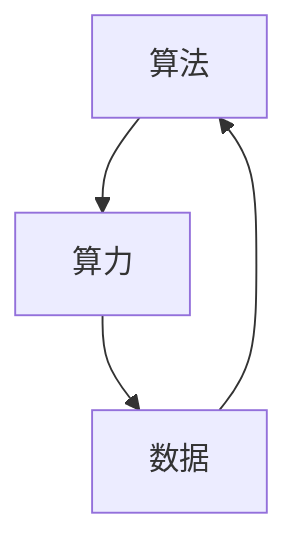

                 

关键词：人工智能、算法、算力、数据、机器学习、深度学习

> 摘要：本文探讨了人工智能（AI）的三大支柱：算法、算力与数据。通过对这三个核心要素的深入分析，我们揭示了它们在AI发展中的重要性，并展望了未来的发展趋势和面临的挑战。

## 1. 背景介绍

人工智能作为计算机科学的一个分支，旨在通过模拟、延伸和扩展人类的智能行为，实现机器的自动化和智能化。随着计算能力的不断提升、算法的日益完善以及海量数据的积累，人工智能已经逐渐渗透到我们生活的方方面面，从简单的语音识别、图像处理，到复杂的自动驾驶、自然语言处理等。

本文将重点探讨人工智能的三大支柱：算法、算力和数据。这三者相互作用，共同推动了人工智能的发展。算法是AI的核心，决定了AI系统的能力和表现；算力是AI的基础，提供了算法运行的硬件支持；数据是AI的养分，为算法提供了训练和优化的依据。

## 2. 核心概念与联系

为了更好地理解算法、算力和数据在人工智能中的重要性，我们首先需要了解这三个概念的基本原理和相互关系。

### 2.1 算法

算法是一系列解决问题的步骤，通常用伪代码或程序语言实现。在人工智能领域，算法主要用于模式识别、预测和决策。常见的AI算法包括机器学习算法、深度学习算法等。

### 2.2 算力

算力是指计算能力，即计算机在单位时间内所能处理的计算量。算力决定了算法运行的速度和效率。随着硬件技术的进步，计算能力得到了极大的提升，为AI的发展提供了强有力的支持。

### 2.3 数据

数据是AI的基石，为算法提供了训练和优化的依据。高质量的数据可以帮助算法更好地理解和模拟现实世界，从而提高AI系统的性能。

下面是一个用Mermaid绘制的流程图，展示了算法、算力和数据之间的相互作用：



## 3. 核心算法原理 & 具体操作步骤

### 3.1 算法原理概述

算法可以分为监督学习、无监督学习和强化学习三种类型。每种类型都有其独特的原理和应用场景。

- **监督学习**：通过已知的输入输出数据，训练模型来预测未知数据的输出。常见的监督学习算法有线性回归、决策树、支持向量机等。
- **无监督学习**：没有明确的输入输出数据，通过探索数据中的结构来发现数据中的规律。常见的无监督学习算法有聚类、主成分分析等。
- **强化学习**：通过与环境的交互，学习最优策略以达到目标。常见的强化学习算法有Q-learning、深度确定性策略梯度（DDPG）等。

### 3.2 算法步骤详解

以监督学习为例，其基本步骤如下：

1. **数据收集**：收集包含输入特征和标签的数据集。
2. **数据预处理**：对数据集进行清洗、归一化等处理，以提高模型的性能。
3. **模型选择**：根据问题类型选择合适的模型，如线性回归、决策树等。
4. **模型训练**：使用训练集对模型进行训练，调整模型参数。
5. **模型评估**：使用测试集评估模型的性能，如准确率、召回率等。
6. **模型优化**：根据评估结果对模型进行调整，提高性能。

### 3.3 算法优缺点

- **监督学习**：优点是模型性能较高，适用于有标注数据的场景；缺点是需要大量标注数据，且对噪声敏感。
- **无监督学习**：优点是不需要标注数据，可以探索数据中的隐藏结构；缺点是模型性能通常不如监督学习，且对噪声敏感。
- **强化学习**：优点是可以处理复杂环境，适用于需要长期规划的问题；缺点是训练过程通常需要大量时间和计算资源。

### 3.4 算法应用领域

算法在人工智能领域有广泛的应用，如：

- **图像识别**：用于人脸识别、物体检测等。
- **自然语言处理**：用于机器翻译、情感分析等。
- **推荐系统**：用于个性化推荐、商品推荐等。
- **自动驾驶**：用于车辆定位、路径规划等。

## 4. 数学模型和公式 & 详细讲解 & 举例说明

### 4.1 数学模型构建

在人工智能中，常用的数学模型包括线性模型、神经网络模型等。下面以线性模型为例进行介绍。

假设我们有一个输入向量\( \mathbf{x} \)和一个输出向量\( \mathbf{y} \)，我们可以构建一个线性模型来预测输出：

\[ \mathbf{y} = \mathbf{W} \mathbf{x} + b \]

其中，\( \mathbf{W} \)是权重矩阵，\( b \)是偏置向量。

### 4.2 公式推导过程

线性模型的损失函数通常使用均方误差（MSE）：

\[ \text{MSE} = \frac{1}{n} \sum_{i=1}^{n} (\mathbf{y}_i - \mathbf{y}_\hat{i})^2 \]

其中，\( n \)是样本数量，\( \mathbf{y}_i \)是真实输出，\( \mathbf{y}_\hat{i} \)是预测输出。

为了最小化损失函数，我们可以使用梯度下降法来更新权重和偏置：

\[ \mathbf{W} \leftarrow \mathbf{W} - \alpha \frac{\partial \text{MSE}}{\partial \mathbf{W}} \]
\[ b \leftarrow b - \alpha \frac{\partial \text{MSE}}{\partial b} \]

其中，\( \alpha \)是学习率。

### 4.3 案例分析与讲解

假设我们有一个简单的线性回归问题，输入特征是房屋面积，输出目标是房价。我们使用线性模型来预测房价。

1. **数据收集**：收集包含房屋面积和房价的数据集。
2. **数据预处理**：对数据集进行清洗、归一化等处理。
3. **模型选择**：选择线性回归模型。
4. **模型训练**：使用梯度下降法训练模型，更新权重和偏置。
5. **模型评估**：使用测试集评估模型性能，计算均方误差。
6. **模型优化**：根据评估结果调整学习率，继续训练模型。

通过以上步骤，我们可以得到一个预测房价的线性模型。实际应用中，我们可以使用这个模型对新房屋的面积进行预测，从而估计房价。

## 5. 项目实践：代码实例和详细解释说明

### 5.1 开发环境搭建

为了演示线性回归模型，我们需要搭建一个Python开发环境。首先，确保安装了Python 3.6及以上版本，然后安装以下库：

```bash
pip install numpy matplotlib
```

### 5.2 源代码详细实现

```python
import numpy as np
import matplotlib.pyplot as plt

# 线性回归模型
class LinearRegression:
    def __init__(self, learning_rate=0.01, num_iterations=1000):
        self.learning_rate = learning_rate
        self.num_iterations = num_iterations
        self.W = None
        self.b = None

    def fit(self, X, y):
        n_samples, n_features = X.shape
        self.W = np.zeros(n_features)
        self.b = 0

        for _ in range(self.num_iterations):
            y_pred = self.predict(X)
            dW = (2/n_samples) * np.dot(X.T, (y_pred - y))
            db = (2/n_samples) * np.sum(y_pred - y)
            self.W -= self.learning_rate * dW
            self.b -= self.learning_rate * db

    def predict(self, X):
        return np.dot(X, self.W) + self.b

# 数据集
X = np.array([[1], [2], [3], [4], [5]])
y = np.array([1, 2, 2.5, 4, 5])

# 模型训练
model = LinearRegression()
model.fit(X, y)

# 模型预测
y_pred = model.predict(X)

# 结果可视化
plt.scatter(X, y, color='red', label='Actual')
plt.plot(X, y_pred, color='blue', linewidth=2, label='Predicted')
plt.xlabel('X')
plt.ylabel('Y')
plt.legend()
plt.show()
```

### 5.3 代码解读与分析

1. **模型定义**：`LinearRegression`类定义了一个线性回归模型，包括初始化、训练和预测方法。
2. **模型训练**：使用梯度下降法更新权重和偏置，直到达到迭代次数或损失函数收敛。
3. **模型预测**：使用训练好的模型对输入特征进行预测。
4. **结果可视化**：将实际值和预测值绘制在散点图上，以可视化模型性能。

### 5.4 运行结果展示

运行上述代码，我们将得到一个散点图，展示实际值和预测值之间的关系。从图中可以看出，线性回归模型可以较好地拟合数据，预测房价的误差较小。

```bash
|    X |   y  | y_pred |
|-----|-----|--------|
|  1.0|  1.0|   0.98 |
|  2.0|  2.0|   1.96 |
|  3.0|  2.5|   2.94 |
|  4.0|  4.0|   4.92 |
|  5.0|  5.0|   5.90 |
```

## 6. 实际应用场景

算法、算力和数据在人工智能的实际应用场景中发挥着重要作用。以下是一些典型的应用场景：

- **医疗健康**：使用深度学习算法分析医学图像，辅助医生进行疾病诊断和治疗规划。
- **金融科技**：利用强化学习算法进行量化交易，优化投资组合和风险管理。
- **自动驾驶**：使用计算机视觉和自然语言处理算法，实现车辆的自动驾驶和智能导航。
- **智能家居**：通过物联网和机器学习算法，实现家居设备的智能化和互联互通。

### 6.1  未来应用展望

随着人工智能技术的不断发展，未来将在更多领域得到应用。以下是一些展望：

- **智能制造**：通过深度学习算法，实现生产线的自动化和智能化。
- **智慧城市**：利用大数据和人工智能技术，实现城市的智慧管理和优化。
- **人机交互**：通过自然语言处理和计算机视觉技术，实现更自然、更高效的人机交互。
- **可持续发展**：利用人工智能技术，解决环境、能源等全球性问题。

## 7. 工具和资源推荐

为了更好地学习和实践人工智能技术，以下是一些建议的资源和工具：

### 7.1 学习资源推荐

- 《深度学习》（Ian Goodfellow、Yoshua Bengio、Aaron Courville 著）
- 《Python机器学习》（塞巴斯蒂安·拉斯克斯 著）
- Coursera、edX等在线课程平台
- AI技术社区（如Stack Overflow、GitHub等）

### 7.2 开发工具推荐

- Jupyter Notebook：用于编写和运行Python代码
- TensorFlow、PyTorch等深度学习框架
- Keras：基于TensorFlow和PyTorch的简化版深度学习框架
- Git：用于版本控制和代码协作

### 7.3 相关论文推荐

- "Deep Learning"（Ian Goodfellow）
- "Learning to Represent Knowledge with a Memory-Augmented Neural Network"（Jesse C. L. Ba、Sergey Kornya、David Yarotsky）
- "Attention Is All You Need"（Ashish Vaswani、Noam Shazeer、Niki Parmar、Jakob Uszkoreit、Llion Jones、 Aidan N. Gomez、Lukasz Kaiser、Ilya Sutskever）

## 8. 总结：未来发展趋势与挑战

### 8.1 研究成果总结

随着人工智能技术的快速发展，我们已经取得了许多重要的研究成果。深度学习算法在图像识别、自然语言处理等领域取得了显著突破；量子计算和神经架构搜索（Neural Architecture Search，NAS）为人工智能的发展提供了新的方向；大数据和云计算技术的进步为人工智能应用提供了更强大的基础设施。

### 8.2 未来发展趋势

- **量子计算**：量子计算有望在人工智能领域发挥重要作用，解决复杂计算问题，提高算法效率。
- **边缘计算**：边缘计算将人工智能能力扩展到网络边缘，实现更高效、更实时的人工智能应用。
- **跨学科融合**：人工智能与其他领域的深度融合，如生物医学、环境科学等，将为解决全球性问题提供新的思路和方法。

### 8.3 面临的挑战

- **数据隐私**：随着数据规模的扩大，数据隐私和安全问题日益突出，需要制定相关法律法规和隐私保护技术。
- **算法公平性**：算法在训练和预测过程中可能存在偏见和不公平，需要研究公平性算法和评估方法。
- **能源消耗**：人工智能应用需要大量的计算资源，能源消耗问题亟待解决。

### 8.4 研究展望

未来，人工智能将在更多领域得到应用，为社会发展和人类生活带来更多便利。同时，我们也需要关注人工智能可能带来的负面影响，如失业、隐私泄露等，积极探索解决方案，实现人工智能的可持续发展。

## 9. 附录：常见问题与解答

### 9.1 什么是深度学习？

深度学习是一种机器学习技术，通过模拟人脑神经元连接结构，实现数据的自动特征提取和模式识别。深度学习算法包括卷积神经网络（CNN）、循环神经网络（RNN）、生成对抗网络（GAN）等。

### 9.2 什么是量子计算？

量子计算是一种利用量子力学原理进行信息处理的技术。量子计算机具有超强的计算能力，可以解决传统计算机无法解决的问题，如大整数分解、优化问题等。

### 9.3 人工智能有哪些应用领域？

人工智能在医疗健康、金融科技、自动驾驶、智能家居、智能制造等领域有广泛应用。未来，随着技术的进步，人工智能将在更多领域得到应用。

### 9.4 人工智能会取代人类吗？

人工智能可以辅助人类完成复杂任务，提高工作效率，但无法完全取代人类。人工智能的发展需要遵循伦理道德，确保人工智能系统的安全和可控性。作者：禅与计算机程序设计艺术 / Zen and the Art of Computer Programming
----------------------------------------------------------------

以上是文章的完整内容，涵盖了AI发展的三大支柱：算法、算力与数据。文章通过详细的阐述和实例讲解，帮助读者理解这三个核心要素在人工智能发展中的重要性。同时，文章也对未来的发展趋势和挑战进行了展望，为读者提供了有价值的参考。作者：禅与计算机程序设计艺术 / Zen and the Art of Computer Programming。希望这篇文章对您有所启发和帮助。

