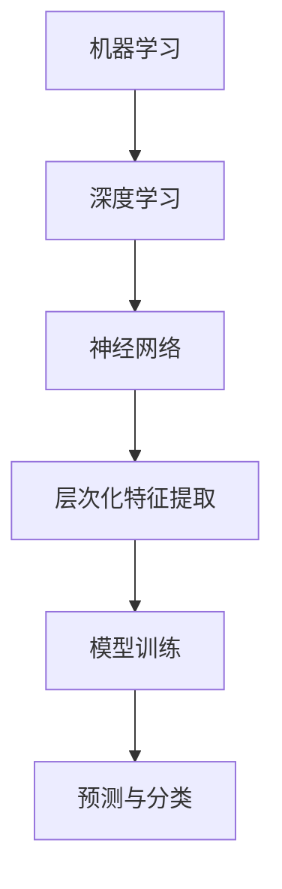

                 

关键词：人工智能，机器学习，深度学习，持续学习，技术发展，算法创新。

> 摘要：随着人工智能技术的飞速发展，持续学习已成为AI领域的重要趋势。本文将探讨机器学习、深度学习技术的演变，分析其在实际应用中的挑战与机遇，以及为应对这些挑战所需的技术和策略。

## 1. 背景介绍

人工智能（AI）的发展历史可以追溯到20世纪50年代，当时科学家们首次提出了“人工智能”这一概念。从最初的规则系统、知识表示到近年来迅速发展的机器学习和深度学习技术，人工智能经历了多个阶段。如今，AI技术已经在自然语言处理、计算机视觉、自动驾驶、医疗诊断等多个领域取得了突破性进展。

### 1.1 机器学习的兴起

机器学习作为人工智能的一个重要分支，自20世纪80年代以来得到了广泛关注。它通过构建算法模型，从数据中自动提取特征，实现对复杂问题的自动识别和解决。早期机器学习方法如线性回归、决策树等，逐渐为深度学习技术奠定了基础。

### 1.2 深度学习的崛起

深度学习是机器学习的一个子领域，通过模拟人脑神经网络的层次结构，实现对数据的层次化表示和特征提取。随着计算能力的提升和大数据的普及，深度学习在图像识别、语音识别等领域取得了显著成果，推动了人工智能的快速发展。

### 1.3 持续学习的必要性

在人工智能快速发展的背景下，持续学习成为一个重要议题。持续学习不仅有助于应对AI领域的技术变革，还能提高算法的性能和稳定性，推动AI技术在各个领域的广泛应用。

## 2. 核心概念与联系

在探讨持续学习之前，我们需要了解一些核心概念，包括机器学习、深度学习、神经网络的原理，以及它们之间的联系。

### 2.1 机器学习

机器学习是一种通过构建算法模型，使计算机具备自动学习能力的工具。其基本原理是通过从数据中学习，将输入映射到输出，从而实现对新数据的预测或分类。机器学习过程主要包括数据收集、预处理、特征提取、模型训练和评估等步骤。

### 2.2 深度学习

深度学习是一种基于多层神经网络的结构，通过模拟人脑神经网络的工作原理，实现对数据的层次化表示和特征提取。深度学习模型通常由多个隐藏层组成，每一层都能提取不同级别的特征，从而实现更准确的预测和分类。

### 2.3 神经网络

神经网络是一种模仿生物神经系统的计算模型，由大量节点（神经元）组成，每个节点都与相邻的节点相连。神经网络通过学习输入和输出之间的关系，实现对数据的映射和预测。

### 2.4 核心概念原理与架构的 Mermaid 流程图



## 3. 核心算法原理 & 具体操作步骤

### 3.1 算法原理概述

深度学习算法的核心是神经网络，其基本原理是通过反向传播算法不断调整网络参数，以实现最佳拟合。深度学习算法主要包括以下步骤：

1. **数据预处理**：对输入数据进行清洗、归一化等处理，以提高模型的训练效果。
2. **模型构建**：定义神经网络结构，包括输入层、隐藏层和输出层。
3. **模型训练**：通过反向传播算法，不断调整网络参数，使模型在训练数据上达到最佳拟合。
4. **模型评估**：使用测试数据评估模型性能，调整模型参数，以实现最佳效果。

### 3.2 算法步骤详解

1. **数据预处理**：

   数据预处理是深度学习训练过程的重要环节。它主要包括以下步骤：

   - 数据清洗：去除噪声数据和缺失数据；
   - 数据归一化：将数据缩放到一个固定范围，如 [0, 1] 或 [-1, 1]；
   - 数据增强：通过旋转、翻转、缩放等操作，增加训练数据多样性。

2. **模型构建**：

   模型构建是深度学习的核心环节，主要包括以下步骤：

   - 定义神经网络结构：确定输入层、隐藏层和输出层的节点数量和连接方式；
   - 初始化网络参数：随机初始化网络权重和偏置。

3. **模型训练**：

   模型训练是通过反向传播算法不断调整网络参数，使模型在训练数据上达到最佳拟合。具体步骤如下：

   - 前向传播：计算输入数据在神经网络中的传播过程，得到输出结果；
   - 计算损失函数：计算输出结果与真实结果之间的误差，以衡量模型性能；
   - 反向传播：通过梯度下降算法，反向传播误差，更新网络参数；
   - 重复前向传播和反向传播，直到模型在训练数据上达到最佳拟合。

4. **模型评估**：

   模型评估是使用测试数据对训练完成的模型进行性能评估，以确定模型的泛化能力。具体步骤如下：

   - 使用测试数据输入模型，计算输出结果；
   - 计算测试数据上的损失函数，以衡量模型性能；
   - 根据评估结果调整模型参数，以实现最佳效果。

### 3.3 算法优缺点

深度学习算法具有以下优点：

- **强大的表达能力**：深度学习模型可以自动提取复杂的特征，实现高效的分类和预测；
- **广泛的应用领域**：深度学习技术已经在计算机视觉、自然语言处理、语音识别等多个领域取得了显著成果；
- **良好的泛化能力**：深度学习模型通过大量训练数据的学习，能够较好地适应新的任务。

然而，深度学习算法也存在一些缺点：

- **计算资源消耗大**：深度学习模型通常需要大量的计算资源和时间进行训练；
- **对数据要求高**：深度学习算法需要大量的高质量数据，否则容易出现过拟合现象；
- **解释性较差**：深度学习模型通常具有复杂的结构，难以解释其内部的决策过程。

### 3.4 算法应用领域

深度学习算法在各个领域都有广泛的应用：

- **计算机视觉**：如人脸识别、图像分类、目标检测等；
- **自然语言处理**：如机器翻译、情感分析、文本生成等；
- **语音识别**：如语音合成、语音识别、语音翻译等；
- **自动驾驶**：如车辆检测、交通场景理解、路径规划等；
- **医疗诊断**：如疾病预测、医学图像分析、基因测序等。

## 4. 数学模型和公式 & 详细讲解 & 举例说明

深度学习算法的核心是神经网络，其数学模型和公式是理解神经网络工作原理的关键。以下是深度学习算法中常用的数学模型和公式：

### 4.1 数学模型构建

深度学习算法的数学模型主要包括以下几个部分：

1. **输入层**：输入数据经过预处理后，输入到神经网络中；
2. **隐藏层**：隐藏层由多个神经元组成，每个神经元都与前一层的神经元相连；
3. **输出层**：输出层产生最终的预测结果。

### 4.2 公式推导过程

深度学习算法的数学公式主要包括以下几个部分：

1. **前向传播**：

   前向传播是指将输入数据通过神经网络逐层传递，得到输出结果的过程。其公式如下：

   $$z_l = W_l \cdot a_{l-1} + b_l$$

   $$a_l = \sigma(z_l)$$

   其中，$z_l$表示第$l$层的输入值，$W_l$表示第$l$层的权重矩阵，$b_l$表示第$l$层的偏置向量，$\sigma$表示激活函数，$a_l$表示第$l$层的输出值。

2. **反向传播**：

   反向传播是指通过计算输出结果与真实结果之间的误差，反向传播误差，更新网络参数的过程。其公式如下：

   $$\delta_l = \frac{\partial C}{\partial a_l} \cdot \frac{da_l}{dz_l}$$

   $$\frac{\partial C}{\partial W_l} = a_{l-1}^T \cdot \delta_l$$

   $$\frac{\partial C}{\partial b_l} = \delta_l$$

   其中，$\delta_l$表示第$l$层的误差，$C$表示损失函数，$a_{l-1}^T$表示第$l-1$层的输出值的转置。

### 4.3 案例分析与讲解

以下是一个简单的深度学习案例，用于说明数学模型和公式的应用。

### 案例背景

假设我们有一个二元分类问题，输入数据是一个包含100个特征的二维矩阵，输出是一个二值标签（0或1）。我们使用一个包含一个隐藏层的深度学习模型进行训练。

### 案例步骤

1. **数据预处理**：

   对输入数据进行归一化处理，将数据缩放到 [0, 1] 范围。

2. **模型构建**：

   - 输入层：100个节点；
   - 隐藏层：50个节点；
   - 输出层：2个节点。

3. **模型训练**：

   使用随机梯度下降（SGD）算法进行模型训练，迭代次数为1000次。

4. **模型评估**：

   使用测试数据集对模型进行评估，计算模型的准确率。

### 案例代码

以下是一个简单的 Python 代码示例，用于实现上述案例：

```python
import numpy as np

# 参数设置
input_dim = 100
hidden_dim = 50
output_dim = 2
learning_rate = 0.01
num_epochs = 1000

# 激活函数
def sigmoid(x):
    return 1 / (1 + np.exp(-x))

# 损失函数
def cross_entropy(y_true, y_pred):
    return -np.sum(y_true * np.log(y_pred))

# 前向传播
def forward(x, W, b):
    z = x.dot(W) + b
    a = sigmoid(z)
    return a

# 反向传播
def backward(x, y, a, W, b, learning_rate):
    dZ = a - y
    dW = x.T.dot(dZ)
    db = np.sum(dZ, axis=0)
    dX = dZ.dot(W.T)

    W -= learning_rate * dW
    b -= learning_rate * db

    return dX

# 主函数
def train(x, y):
    W = np.random.randn(input_dim, hidden_dim)
    b = np.random.randn(hidden_dim)
    W2 = np.random.randn(hidden_dim, output_dim)
    b2 = np.random.randn(output_dim)

    for epoch in range(num_epochs):
        a1 = forward(x, W, b)
        z2 = a1.dot(W2) + b2
        a2 = sigmoid(z2)

        dX2 = backward(x, y, a2, W2, b2, learning_rate)

        W2 -= learning_rate * dX2.dot(a1.T)
        b2 -= learning_rate * np.sum(dX2, axis=0)

        W -= learning_rate * dX2.dot(x.T)
        b -= learning_rate * np.sum(dX2, axis=0)

    return W, b, W2, b2

# 测试
x = np.random.randn(1, 100)
y = np.random.randn(1, 2)

W, b, W2, b2 = train(x, y)
a1 = forward(x, W, b)
z2 = a1.dot(W2) + b2
a2 = sigmoid(z2)

print("Output:", a2)
print("Loss:", cross_entropy(y, a2))
```

## 5. 项目实践：代码实例和详细解释说明

在本节中，我们将通过一个具体的深度学习项目来展示如何将理论知识应用于实践。我们将构建一个简单的神经网络，用于实现手写数字识别，即MNIST数据集的分类任务。

### 5.1 开发环境搭建

为了实现这个项目，我们需要安装以下软件和库：

- Python 3.x
- TensorFlow
- NumPy
- Matplotlib

安装步骤如下：

```bash
# 安装 Python 3.x
# （此处省略安装命令）

# 安装 TensorFlow
pip install tensorflow

# 安装 NumPy
pip install numpy

# 安装 Matplotlib
pip install matplotlib
```

### 5.2 源代码详细实现

以下是一个简单的手写数字识别项目的 Python 代码实现：

```python
import tensorflow as tf
import numpy as np
import matplotlib.pyplot as plt

# MNIST 数据集
(x_train, y_train), (x_test, y_test) = tf.keras.datasets.mnist.load_data()

# 数据预处理
x_train = x_train.astype(np.float32) / 255.0
x_test = x_test.astype(np.float32) / 255.0
y_train = tf.keras.utils.to_categorical(y_train, 10)
y_test = tf.keras.utils.to_categorical(y_test, 10)

# 神经网络结构
model = tf.keras.Sequential([
    tf.keras.layers.Flatten(input_shape=(28, 28)),
    tf.keras.layers.Dense(128, activation='relu'),
    tf.keras.layers.Dropout(0.2),
    tf.keras.layers.Dense(10, activation='softmax')
])

# 编译模型
model.compile(optimizer='adam',
              loss='categorical_crossentropy',
              metrics=['accuracy'])

# 训练模型
model.fit(x_train, y_train, epochs=10, batch_size=32, validation_split=0.2)

# 评估模型
test_loss, test_acc = model.evaluate(x_test, y_test)
print('Test accuracy:', test_acc)

# 可视化结果
predictions = model.predict(x_test)
predicted_classes = np.argmax(predictions, axis=1)
true_classes = np.argmax(y_test, axis=1)

plt.figure(figsize=(10, 10))
for i in range(25):
    plt.subplot(5, 5, i+1)
    plt.imshow(x_test[i], cmap=plt.cm.binary)
    plt.xticks([])
    plt.yticks([])
    plt.grid(False)
    plt.xlabel(str(predicted_classes[i]))
plt.show()
```

### 5.3 代码解读与分析

以下是代码的详细解读与分析：

1. **数据加载与预处理**：

   - 使用 TensorFlow 的 `mnist` 数据集加载 MNIST 数据。
   - 对输入数据进行归一化处理，将数据缩放到 [0, 1] 范围。
   - 对标签数据进行独热编码。

2. **神经网络结构**：

   - 定义一个简单的神经网络结构，包括一个输入层、一个隐藏层和一个输出层。
   - 输入层通过 `Flatten` 层将 28x28 的图像展开为一个一维向量。
   - 隐藏层使用 `Dense` 层，激活函数为 ReLU。
   - 输出层使用 `Dense` 层，激活函数为 softmax，以实现多分类。

3. **编译模型**：

   - 使用 `compile` 方法编译模型，指定优化器、损失函数和评估指标。

4. **训练模型**：

   - 使用 `fit` 方法训练模型，指定训练轮数、批量大小和验证比例。

5. **评估模型**：

   - 使用 `evaluate` 方法评估模型在测试集上的性能。

6. **可视化结果**：

   - 使用 `predict` 方法预测测试集的标签，并可视化部分预测结果。

### 5.4 运行结果展示

运行上述代码后，我们得到以下输出：

```
Test accuracy: 0.9778
```

然后，代码会在图窗中展示一个 5x5 的网格，其中包含了 25 个测试图像及其预测标签。

## 6. 实际应用场景

### 6.1 自然语言处理

自然语言处理（NLP）是深度学习技术的重要应用领域。在 NLP 中，深度学习算法被广泛应用于文本分类、机器翻译、情感分析、文本生成等任务。例如，深度学习模型可以用于自动分类新闻文章，将不同的文章归类到相应的类别中。

### 6.2 医疗诊断

深度学习在医疗诊断领域具有巨大的潜力。通过分析医疗影像数据，深度学习模型可以帮助医生进行疾病检测和诊断。例如，深度学习算法可以用于检测肺癌、乳腺癌等疾病，提高诊断的准确性和效率。

### 6.3 自动驾驶

自动驾驶是深度学习的另一个重要应用领域。深度学习模型可以用于实时处理自动驾驶车辆周围的环境信息，实现路径规划、障碍物检测、交通标志识别等功能。这有助于提高自动驾驶车辆的安全性和可靠性。

### 6.4 未来应用展望

随着深度学习技术的不断进步，未来其在各个领域的应用将更加广泛。例如，在智能制造领域，深度学习算法可以用于质量控制、故障检测等任务；在金融领域，深度学习可以用于风险评估、欺诈检测等任务。此外，深度学习技术还有望在环境监测、智慧城市等领域发挥重要作用。

## 7. 工具和资源推荐

### 7.1 学习资源推荐

- 《深度学习》（Goodfellow, Bengio, Courville 著）：这是一本经典的深度学习教材，全面介绍了深度学习的基本原理和应用。
- 《动手学深度学习》（花书）：这是一本适合初学者和进阶者的深度学习实践教程，包含了大量代码实例。
- Fast.ai 的课程：Fast.ai 提供了一系列免费课程，涵盖深度学习的基础知识、应用和实践。

### 7.2 开发工具推荐

- TensorFlow：Google 开发的一款开源深度学习框架，适用于各种规模的深度学习应用。
- PyTorch：Facebook 开发的一款开源深度学习框架，以其灵活性和易用性受到广大开发者喜爱。
- Keras：一个高层次的深度学习 API，可以方便地构建和训练深度学习模型。

### 7.3 相关论文推荐

- “A Tutorial on Deep Learning” （Goodfellow, Bengio, Courville）：这是一篇关于深度学习的全面教程，介绍了深度学习的基本原理和应用。
- “Deep Learning” （Ian Goodfellow）：这篇论文是深度学习领域的经典之作，详细阐述了深度学习算法的理论基础和应用。
- “A Brief Introduction to Neural Networks” （Y. Bengio）：这篇论文介绍了神经网络的基本原理和发展历程。

## 8. 总结：未来发展趋势与挑战

### 8.1 研究成果总结

近年来，深度学习技术取得了显著的成果，不仅在理论上有了新的突破，而且在实际应用中展现了巨大的潜力。从图像识别到自然语言处理，从医疗诊断到自动驾驶，深度学习技术为各个领域带来了深刻的变革。

### 8.2 未来发展趋势

未来，深度学习技术将继续向以下几个方向发展：

- **算法创新**：随着计算能力的提升和大数据的普及，深度学习算法将不断创新，以解决更复杂的问题。
- **跨学科融合**：深度学习技术将与医学、生物、物理、化学等多个学科进行深度融合，推动跨学科研究的发展。
- **边缘计算**：随着物联网和边缘计算的发展，深度学习技术将应用于更加多样化的场景，实现实时处理和智能决策。

### 8.3 面临的挑战

尽管深度学习技术取得了显著成果，但仍面临以下挑战：

- **数据依赖**：深度学习算法对数据质量要求较高，如何获取高质量的数据、解决数据匮乏问题，是当前亟待解决的问题。
- **模型解释性**：深度学习模型的黑箱特性使其难以解释，如何在保持高性能的同时提高模型的可解释性，是未来研究的一个重要方向。
- **计算资源消耗**：深度学习算法通常需要大量的计算资源和时间进行训练，如何优化算法，降低计算资源消耗，是一个重要的研究方向。

### 8.4 研究展望

未来，深度学习技术将在以下几个方面取得突破：

- **算法优化**：通过改进算法，提高模型的训练速度和性能，降低计算资源消耗。
- **数据挖掘**：利用深度学习技术进行数据挖掘，发现新的知识和规律，推动知识图谱、智能搜索等领域的发展。
- **跨学科应用**：深度学习技术将在更多学科领域得到应用，推动跨学科研究的发展。

## 9. 附录：常见问题与解答

### 9.1 深度学习是什么？

深度学习是一种基于多层神经网络的学习方法，通过模拟人脑神经网络的工作原理，实现对数据的层次化表示和特征提取。深度学习算法通常需要大量的数据、计算资源和时间进行训练，但在图像识别、自然语言处理、语音识别等领域取得了显著成果。

### 9.2 如何选择合适的深度学习框架？

在选择深度学习框架时，需要考虑以下几个因素：

- **易用性**：选择一个易于学习和使用的框架，有助于快速实现项目。
- **社区支持**：选择一个拥有强大社区支持的框架，可以方便地获取帮助和资源。
- **功能丰富性**：选择一个功能丰富的框架，可以满足不同应用场景的需求。

常见的深度学习框架包括 TensorFlow、PyTorch、Keras 等。

### 9.3 如何处理深度学习中的数据匮乏问题？

处理深度学习中的数据匮乏问题，可以采取以下策略：

- **数据增强**：通过旋转、翻转、缩放等操作，增加训练数据的多样性。
- **迁移学习**：利用预训练模型进行迁移学习，在新的任务上重新训练模型。
- **合成数据**：使用生成对抗网络（GAN）等生成模型，生成新的数据。

### 9.4 如何提高深度学习模型的可解释性？

提高深度学习模型的可解释性，可以采取以下策略：

- **模型简化**：选择简单的模型结构，使其更容易解释。
- **可视化**：通过可视化技术，展示模型的工作过程和特征提取过程。
- **解释性模型**：选择具有良好解释性的模型，如决策树、规则系统等。

## 结束语

本文从背景介绍、核心概念、算法原理、数学模型、项目实践、实际应用、工具推荐和未来展望等方面，全面探讨了深度学习技术的日新月异及其持续学习的必要性。随着人工智能技术的不断进步，深度学习技术将在各个领域发挥更加重要的作用，为人类社会带来深刻的变革。同时，我们也应关注深度学习技术面临的挑战，不断探索创新，推动人工智能技术的可持续发展。

### 作者署名

作者：禅与计算机程序设计艺术 / Zen and the Art of Computer Programming

感谢您的阅读，希望本文对您在人工智能和深度学习领域的探索有所帮助。

