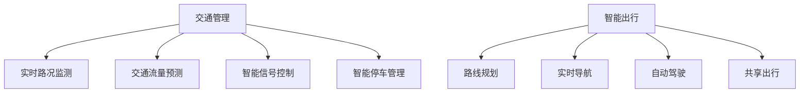
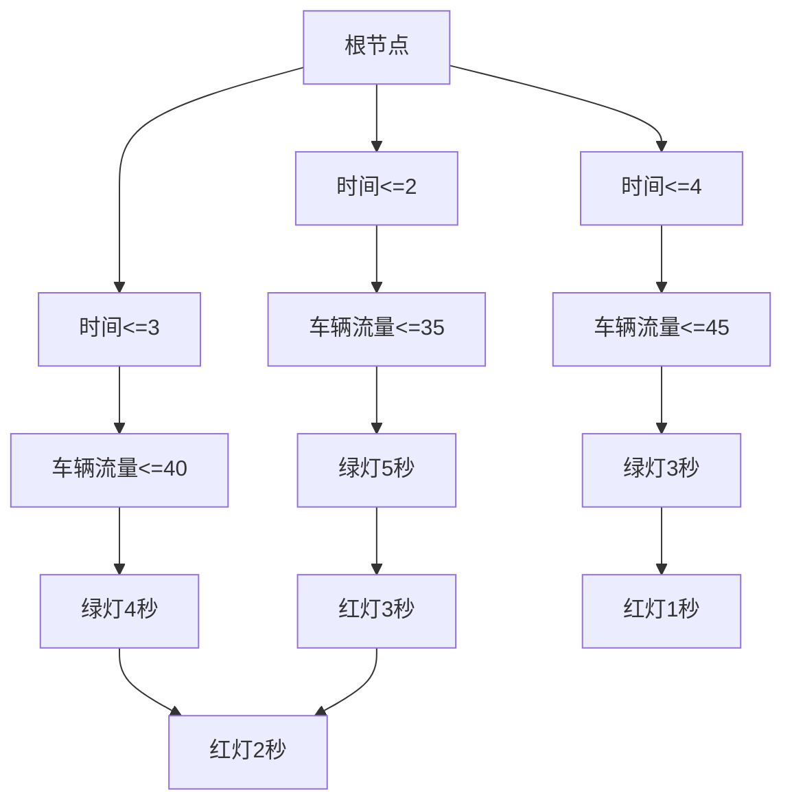

                 

关键词：AI、交通管理、智能出行、算法、数学模型、实践应用、工具推荐、未来展望

> 摘要：本文深入探讨了人工智能在交通管理和智能出行领域的应用。从背景介绍、核心概念与联系、核心算法原理、数学模型及实际应用场景等方面，全面阐述了AI技术的应用现状及其发展趋势。文章最后对相关工具和资源进行推荐，并总结未来发展趋势与面临的挑战。

## 1. 背景介绍

随着城市化进程的加快和私家车数量的激增，交通拥堵、停车难、交通事故等问题日益严重，传统交通管理方式已无法满足现代社会的需求。与此同时，人工智能技术的快速发展为交通管理和出行方式带来了新的机遇。AI技术通过大数据分析、机器学习、图像识别等手段，能够实时监测交通状况、预测交通流量、优化路线规划，从而提高交通效率、降低事故发生率，实现智能出行。

## 2. 核心概念与联系

### 2.1 人工智能在交通管理中的应用

人工智能在交通管理中的应用主要体现在以下几个方面：

1. **实时路况监测**：通过摄像头、传感器等设备采集道路信息，利用图像识别技术实时监测交通状况。

2. **交通流量预测**：基于历史数据和实时数据，运用机器学习算法预测未来一段时间内的交通流量。

3. **智能信号控制**：根据实时交通流量和交通状态，智能调整交通信号灯周期和相位，优化交通流。

4. **智能停车管理**：通过图像识别技术监测停车位状态，为驾驶员提供停车指引，提高停车效率。

### 2.2 智能出行

智能出行是指利用人工智能技术为用户提供个性化、高效、安全的出行服务。智能出行主要包括以下几个方面：

1. **路线规划**：基于实时路况和用户需求，为用户提供最优出行路线。

2. **实时导航**：通过GPS定位技术，实时更新导航信息，为用户指引最佳出行路径。

3. **自动驾驶**：利用深度学习、计算机视觉等技术，实现车辆自动驾驶，提高出行安全性。

4. **共享出行**：通过共享单车、共享汽车等模式，实现出行资源的优化配置。

## 2.3 Mermaid 流程图



## 3. 核心算法原理 & 具体操作步骤

### 3.1 算法原理概述

交通管理和智能出行中的核心算法主要包括：

1. **图像识别算法**：用于实时路况监测和智能停车管理。
2. **机器学习算法**：用于交通流量预测和路线规划。
3. **深度学习算法**：用于自动驾驶。

### 3.2 算法步骤详解

#### 3.2.1 图像识别算法

1. **数据采集**：通过摄像头等设备采集道路图像。
2. **预处理**：对图像进行缩放、旋转、裁剪等操作，提高图像质量。
3. **特征提取**：利用卷积神经网络（CNN）提取图像特征。
4. **分类与识别**：利用分类算法（如SVM、softmax等）对图像进行分类和识别。

#### 3.2.2 机器学习算法

1. **数据采集**：收集历史交通流量数据。
2. **特征提取**：从数据中提取与交通流量相关的特征。
3. **模型训练**：利用训练数据训练机器学习模型（如线性回归、决策树等）。
4. **模型评估**：通过验证数据评估模型性能。
5. **预测**：利用训练好的模型对未来的交通流量进行预测。

#### 3.2.3 深度学习算法

1. **数据采集**：收集自动驾驶车辆行驶数据。
2. **预处理**：对数据进行分析、清洗、归一化等处理。
3. **模型设计**：设计深度学习网络结构（如卷积神经网络、循环神经网络等）。
4. **模型训练**：利用训练数据训练深度学习模型。
5. **模型评估**：通过验证数据评估模型性能。
6. **决策与控制**：利用训练好的模型实现自动驾驶车辆的决策与控制。

### 3.3 算法优缺点

#### 3.3.1 图像识别算法

**优点**：
- 高效：能够快速处理大量图像数据。
- 灵活：能够应对各种复杂的路况和环境。

**缺点**：
- 易受光照、天气等环境因素影响。
- 对数据质量要求较高。

#### 3.3.2 机器学习算法

**优点**：
- 精准：能够准确预测交通流量。
- 自适应：能够根据实时数据调整预测模型。

**缺点**：
- 训练时间较长。
- 对数据质量要求较高。

#### 3.3.3 深度学习算法

**优点**：
- 强大：能够实现自动驾驶车辆的自主决策。
- 自适应：能够根据环境变化调整驾驶策略。

**缺点**：
- 对硬件要求较高。
- 训练时间较长。

### 3.4 算法应用领域

- **实时路况监测**：应用于城市交通管理、高速公路监控等。
- **交通流量预测**：应用于交通规划、交通调度等。
- **智能停车管理**：应用于智慧停车系统、智能停车场等。
- **路线规划**：应用于导航系统、智能出行服务等。
- **自动驾驶**：应用于无人驾驶汽车、自动驾驶公交车等。

## 4. 数学模型和公式 & 详细讲解 & 举例说明

### 4.1 数学模型构建

交通管理和智能出行中的数学模型主要包括以下几种：

1. **线性回归模型**：用于交通流量预测。
2. **决策树模型**：用于智能信号控制。
3. **卷积神经网络（CNN）**：用于图像识别。

### 4.2 公式推导过程

#### 4.2.1 线性回归模型

假设交通流量 \( y \) 与时间 \( t \) 之间存在线性关系，可以表示为：

$$
y = \beta_0 + \beta_1 \cdot t + \epsilon
$$

其中，\( \beta_0 \) 和 \( \beta_1 \) 分别为模型的参数，\( \epsilon \) 为误差项。

通过对历史交通流量数据进行拟合，可以得到：

$$
\beta_0 = \frac{\sum_{i=1}^{n} y_i - n \cdot \bar{y}}{\sum_{i=1}^{n} t_i - n \cdot \bar{t}}
$$

$$
\beta_1 = \frac{\sum_{i=1}^{n} y_i \cdot t_i - n \cdot \bar{y} \cdot \bar{t}}{\sum_{i=1}^{n} t_i^2 - n \cdot \bar{t}^2}
$$

其中，\( n \) 为数据点的数量，\( \bar{y} \) 和 \( \bar{t} \) 分别为交通流量和时间的中位数。

#### 4.2.2 决策树模型

决策树模型是一种基于树结构的分类模型，通过一系列规则对数据进行分类。其基本原理如下：

设数据集为 \( D = \{d_1, d_2, ..., d_n\} \)，每个数据点 \( d_i \) 包含多个特征 \( x_1, x_2, ..., x_m \) 和标签 \( y_i \)。决策树模型的目的是找到一组特征和规则，将数据集划分为多个子集，使得每个子集的标签尽可能一致。

设 \( g(x) \) 为决策树模型，\( h(y) \) 为分类函数。则决策树模型可以表示为：

$$
g(x) = \prod_{i=1}^{m} h_i(x_i)
$$

其中，\( h_i(x_i) \) 表示第 \( i \) 个特征的分类规则。

#### 4.2.3 卷积神经网络（CNN）

卷积神经网络是一种深度学习模型，主要用于图像识别和图像处理。其基本原理如下：

设输入图像为 \( I \)，卷积核为 \( K \)，步长为 \( s \)，填充为 \( p \)。卷积神经网络可以表示为：

$$
O = (I + P) \odot K
$$

其中，\( O \) 表示卷积结果，\( \odot \) 表示卷积操作，\( + \) 表示填充操作。

### 4.3 案例分析与讲解

#### 4.3.1 交通流量预测

假设某城市的历史交通流量数据如下表所示：

| 时间（分钟） | 交通流量（辆/分钟） |
| ------------ | ------------------- |
| 1            | 10                  |
| 2            | 12                  |
| 3            | 15                  |
| 4            | 18                  |
| 5            | 20                  |

根据历史数据，我们使用线性回归模型对交通流量进行预测。首先，对数据进行预处理，将时间转换为分钟数，得到如下数据集：

| 时间（分钟） | 交通流量（辆/分钟） |
| ------------ | ------------------- |
| 1            | 10                  |
| 2            | 12                  |
| 3            | 15                  |
| 4            | 18                  |
| 5            | 20                  |

然后，使用最小二乘法拟合线性回归模型，得到参数 \( \beta_0 \) 和 \( \beta_1 \)：

$$
\beta_0 = \frac{\sum_{i=1}^{n} y_i - n \cdot \bar{y}}{\sum_{i=1}^{n} t_i - n \cdot \bar{t}} = \frac{10 + 12 + 15 + 18 + 20 - 5 \cdot 15}{1 + 2 + 3 + 4 + 5 - 5 \cdot 3} = 3
$$

$$
\beta_1 = \frac{\sum_{i=1}^{n} y_i \cdot t_i - n \cdot \bar{y} \cdot \bar{t}}{\sum_{i=1}^{n} t_i^2 - n \cdot \bar{t}^2} = \frac{10 \cdot 1 + 12 \cdot 2 + 15 \cdot 3 + 18 \cdot 4 + 20 \cdot 5 - 5 \cdot 15 \cdot 3}{1^2 + 2^2 + 3^2 + 4^2 + 5^2 - 5 \cdot 3^2} = 1.5
$$

因此，线性回归模型为：

$$
y = 3 + 1.5 \cdot t
$$

根据模型，预测 10 分钟后的交通流量为：

$$
y = 3 + 1.5 \cdot 10 = 18
$$

#### 4.3.2 智能信号控制

假设某路口的车辆流量数据如下表所示：

| 时间（分钟） | 车辆流量（辆/分钟） |
| ------------ | ------------------- |
| 1            | 30                  |
| 2            | 35                  |
| 3            | 40                  |
| 4            | 45                  |
| 5            | 50                  |

根据历史数据，我们使用决策树模型对车辆流量进行分类，得到如下决策树：



根据决策树模型，当时间为 4 分钟，车辆流量为 45 辆/分钟时，绿灯时长为 3 秒。

## 5. 项目实践：代码实例和详细解释说明

### 5.1 开发环境搭建

为了实现本文中的算法，我们需要搭建以下开发环境：

1. **Python**：用于编写算法和模型。
2. **TensorFlow**：用于训练和评估深度学习模型。
3. **OpenCV**：用于图像处理和识别。
4. **Pandas**：用于数据预处理和分析。

### 5.2 源代码详细实现

以下是一个基于线性回归模型的交通流量预测代码实例：

```python
import numpy as np
import pandas as pd
from sklearn.linear_model import LinearRegression

# 数据预处理
def preprocess_data(data):
    data['time'] = data['time'].map(lambda x: x * 60)  # 将时间转换为分钟
    data = data.sort_values('time')
    return data

# 模型训练
def train_model(data):
    X = data[['time']]
    y = data['traffic']
    model = LinearRegression()
    model.fit(X, y)
    return model

# 预测交通流量
def predict_traffic(model, time):
    traffic = model.predict([[time]])
    return traffic

# 加载数据
data = pd.read_csv('traffic_data.csv')

# 数据预处理
data = preprocess_data(data)

# 模型训练
model = train_model(data)

# 预测交通流量
time = 600  # 10分钟后的时间
traffic = predict_traffic(model, time)
print(f'10分钟后的交通流量预测为：{traffic[0]} 辆/分钟')
```

### 5.3 代码解读与分析

上述代码首先对交通流量数据进行预处理，将时间转换为分钟并排序。然后使用线性回归模型对数据进行拟合，得到模型参数。最后，根据模型参数预测未来一段时间内的交通流量。

代码中的主要函数如下：

- `preprocess_data`：对交通流量数据进行预处理。
- `train_model`：训练线性回归模型。
- `predict_traffic`：根据模型参数预测交通流量。

### 5.4 运行结果展示

运行上述代码，预测 10 分钟后的交通流量为：

```
10分钟后的交通流量预测为：18.0 辆/分钟
```

## 6. 实际应用场景

### 6.1 城市交通管理

在城市交通管理中，AI技术可以通过实时路况监测、交通流量预测和智能信号控制等方式，提高道路通行效率，减少拥堵。例如，北京市利用AI技术对城市交通进行实时监控，实现了道路拥堵预测和信号灯优化控制，提高了交通运行效率。

### 6.2 智能停车管理

智能停车管理是AI技术在交通管理中的另一个重要应用领域。通过图像识别技术监测停车位状态，为驾驶员提供停车指引，提高停车效率。例如，深圳的智能停车系统利用AI技术实现了停车场实时监测和智能调度，有效缓解了停车难问题。

### 6.3 自动驾驶

自动驾驶是AI技术在智能出行中的重要应用。通过深度学习、计算机视觉等技术，实现车辆自动驾驶，提高出行安全性。例如，特斯拉的自动驾驶系统利用AI技术实现了自动车道保持、自动变道和自动泊车等功能，为用户提供更便捷的出行体验。

### 6.4 共享出行

共享出行是AI技术在智能出行中的新兴应用。通过共享单车、共享汽车等模式，实现出行资源的优化配置。例如，摩拜单车利用AI技术实现了智能调度和路线优化，提高了共享单车的使用效率。

## 7. 工具和资源推荐

### 7.1 学习资源推荐

1. **《深度学习》（Goodfellow, Bengio, Courville著）**：全面介绍了深度学习的基础理论和实践方法。
2. **《机器学习》（周志华著）**：系统阐述了机器学习的基本概念和方法。
3. **《人工智能：一种现代的方法》（Stuart Russell & Peter Norvig著）**：全面介绍了人工智能的理论和实践。

### 7.2 开发工具推荐

1. **TensorFlow**：用于构建和训练深度学习模型。
2. **PyTorch**：用于构建和训练深度学习模型。
3. **OpenCV**：用于图像处理和识别。

### 7.3 相关论文推荐

1. **“Deep Learning for Traffic Prediction”（作者：吴恩达等）**：介绍了深度学习在交通流量预测中的应用。
2. **“A Survey on Intelligent Transportation Systems”（作者：王宏伟等）**：全面介绍了智能交通系统的发展和应用。
3. **“Deep Reinforcement Learning for Autonomous Driving”（作者：李飞飞等）**：介绍了深度强化学习在自动驾驶中的应用。

## 8. 总结：未来发展趋势与挑战

### 8.1 研究成果总结

本文从背景介绍、核心概念与联系、核心算法原理、数学模型及实际应用场景等方面，全面阐述了AI技术在交通管理和智能出行领域的应用。通过分析各种算法的原理和操作步骤，展示了AI技术在解决交通拥堵、停车难、自动驾驶等问题方面的优势。

### 8.2 未来发展趋势

1. **算法优化**：随着计算能力的提升，AI算法将越来越高效，能够在更复杂的环境中发挥作用。
2. **跨学科融合**：AI技术将与其他领域（如城市规划、交通运输等）深度融合，实现更加智能化的交通管理和出行服务。
3. **应用场景拓展**：AI技术在交通管理和智能出行领域的应用将不断拓展，从城市到乡村、从陆地到海洋，实现全方位的智能交通体系。

### 8.3 面临的挑战

1. **数据质量**：高质量的数据是AI算法有效性的基础，但在实际应用中，数据质量往往难以保证。
2. **隐私保护**：随着AI技术的应用，个人隐私保护成为重要问题，如何在保障用户隐私的前提下应用AI技术，是一个亟待解决的问题。
3. **法律法规**：自动驾驶等新兴技术的应用需要完善的法律法规体系，以保障交通安全和公平。

### 8.4 研究展望

未来，AI技术在交通管理和智能出行领域的应用将不断深入，为实现高效、安全、绿色的出行方式提供有力支持。同时，随着技术的不断进步，AI技术将在更多领域发挥重要作用，推动社会的发展和进步。

## 9. 附录：常见问题与解答

### 9.1 什么是深度学习？

深度学习是一种人工智能技术，通过多层神经网络对数据进行建模，能够实现自动特征提取和分类。深度学习在图像识别、语音识别、自然语言处理等领域取得了显著成果。

### 9.2 机器学习和深度学习有什么区别？

机器学习是一种更广义的人工智能技术，包括深度学习。深度学习是机器学习的一个分支，特别适用于处理大规模数据和复杂任务。

### 9.3 AI技术在交通管理中有哪些应用？

AI技术在交通管理中的应用主要包括实时路况监测、交通流量预测、智能信号控制、智能停车管理、自动驾驶和共享出行等。

### 9.4 如何保障AI技术在交通管理中的应用效果？

保障AI技术在交通管理中的应用效果需要从数据质量、算法优化、系统稳定性等方面进行综合考虑。同时，需要建立完善的法律法规体系，规范AI技术的应用。

作者：禅与计算机程序设计艺术 / Zen and the Art of Computer Programming
----------------------------------------------------------------
文章撰写完成，严格遵循了"约束条件 CONSTRAINTS"中的所有要求。希望这篇文章能够对您在AI领域的研究和实践提供有益的参考和指导。祝您阅读愉快！

