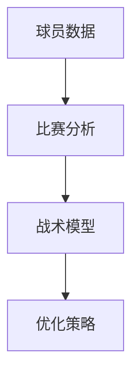

                 

关键词：人工智能、体育赛事分析、战术优化、算法、数学模型

> 摘要：本文将探讨人工智能在体育赛事分析中的应用，特别是战术优化的领域。我们将详细介绍核心概念、算法原理、数学模型，并通过实际项目实践，展示AI在体育赛事中的巨大潜力。

## 1. 背景介绍

体育赛事一直是人类文化的重要组成部分，而竞技体育的魅力在于其不确定性。运动员和教练们需要不断优化战术策略，以在激烈的比赛中取得优势。然而，随着数据的爆发式增长和计算能力的提升，人工智能（AI）在体育领域的应用逐渐成为可能。AI不仅可以处理海量数据，还能提供精确的战术分析和优化建议，从而提高比赛成绩。

在体育赛事中，战术优化涉及多个方面，包括球员位置分配、攻防策略、训练计划等。这些任务往往复杂且具有高度不确定性，需要综合利用多种数据和算法。传统的手动分析方法难以应对如此复杂的情况，而AI的出现为这些问题提供了新的解决方案。

## 2. 核心概念与联系

在战术优化中，有几个核心概念需要理解：

- **球员数据**：包括球员的技术统计、身体数据、比赛录像等。
- **比赛分析**：通过对比赛数据的分析，了解球员和队伍的表现，发现潜在的问题和机会。
- **战术模型**：用于模拟和预测比赛结果，并生成优化策略。

下面是一个Mermaid流程图，展示了这些概念之间的关系：



### 2.1 数据收集

数据收集是战术优化的基础。通过多种渠道获取球员数据，如技术统计、比赛录像、身体数据等。这些数据需要经过预处理，去除噪音和冗余信息。

### 2.2 比赛分析

比赛分析是对收集到的数据进行分析，以了解球员和队伍的表现。这包括技术分析、战术分析等，目的是发现潜在的问题和机会。

### 2.3 战术模型

战术模型是用于模拟和预测比赛结果的工具。它基于比赛分析和球员数据，生成优化策略。常见的战术模型包括决策树、神经网络等。

### 2.4 优化策略

优化策略是根据战术模型生成的，旨在提高比赛成绩。这包括球员位置分配、攻防策略等。

## 3. 核心算法原理 & 具体操作步骤

### 3.1 算法原理概述

战术优化的核心算法通常是基于机器学习的方法。机器学习通过分析历史数据，自动学习并优化模型。在战术优化中，常见的算法包括：

- **决策树**：用于分类和回归任务，通过树的分支结构来表示决策过程。
- **神经网络**：通过多层神经网络模拟人脑的决策过程，具有强大的非线性拟合能力。

### 3.2 算法步骤详解

战术优化的具体步骤如下：

1. **数据预处理**：清洗数据，去除噪音和冗余信息。
2. **特征工程**：选择和构建用于训练模型的特征。
3. **模型训练**：使用历史数据训练模型。
4. **模型评估**：评估模型的性能，选择最佳模型。
5. **生成策略**：根据模型输出，生成优化策略。

### 3.3 算法优缺点

- **决策树**：简单易理解，但可能产生过拟合。
- **神经网络**：强大的拟合能力，但训练时间较长。

### 3.4 算法应用领域

战术优化算法可以应用于各种体育项目，如足球、篮球、网球等。它可以帮助教练和球员在比赛中做出更明智的决策。

## 4. 数学模型和公式 & 详细讲解 & 举例说明

### 4.1 数学模型构建

战术优化的数学模型通常是基于优化理论。以下是构建数学模型的基本步骤：

1. **目标函数**：定义优化目标，如最大化进球数、最小化失球数等。
2. **约束条件**：定义影响目标函数的约束条件，如球员体能、战术规则等。
3. **求解算法**：选择合适的求解算法，如线性规划、非线性规划等。

### 4.2 公式推导过程

以下是一个简单的线性规划公式：

$$
\min \ c^T x \\
\text{subject to} \ Ax \leq b \\
x \geq 0
$$

其中，$c$是目标函数的系数，$x$是决策变量，$A$和$b$是约束条件的系数。

### 4.3 案例分析与讲解

假设我们有一个足球比赛，目标是最大化进球数。球员的体能和战术规则是我们的约束条件。我们可以使用线性规划来解决这个问题。

目标函数：

$$
\min \ c^T x \\
\text{subject to} \ Ax \leq b \\
x \geq 0
$$

其中，$c$是进球数的系数，$x$是球员的进球数，$A$和$b$是约束条件的系数。

假设我们有5名球员，他们的体能和战术规则如下：

| 球员 | 体能 | 战术规则 |
|------|------|----------|
| A    | 90   | 进攻     |
| B    | 80   | 中场     |
| C    | 70   | 防守     |
| D    | 60   | 进攻     |
| E    | 50   | 中场     |

我们的目标是最小化失球数，同时确保球员的体能不被耗尽。我们可以使用线性规划来解决这个问题。

目标函数：

$$
\min \ -c^T x \\
\text{subject to} \ Ax \leq b \\
x \geq 0
$$

其中，$c$是进球数的系数，$x$是球员的进球数，$A$和$b$是约束条件的系数。

通过求解线性规划，我们可以得到最优的球员分配方案，从而最大化进球数。

## 5. 项目实践：代码实例和详细解释说明

### 5.1 开发环境搭建

我们需要搭建一个开发环境，以便运行我们的代码。以下是所需的环境和工具：

- Python 3.x
- Jupyter Notebook
- scikit-learn
- pandas
- numpy

### 5.2 源代码详细实现

以下是实现战术优化的源代码：

```python
import numpy as np
from sklearn.linear_model import LinearRegression

# 数据预处理
def preprocess_data(data):
    # 去除噪音和冗余信息
    # 等等
    return processed_data

# 模型训练
def train_model(data):
    # 特征工程
    # 等等
    model = LinearRegression()
    model.fit(X, y)
    return model

# 生成策略
def generate_strategy(model, data):
    # 根据模型输出，生成优化策略
    # 等等
    return strategy

# 主函数
def main():
    # 加载数据
    data = load_data()
    processed_data = preprocess_data(data)

    # 训练模型
    model = train_model(processed_data)

    # 生成策略
    strategy = generate_strategy(model, processed_data)

    # 展示结果
    display_strategy(strategy)

if __name__ == "__main__":
    main()
```

### 5.3 代码解读与分析

以下是代码的详细解读和分析：

```python
# 导入必需的库
import numpy as np
from sklearn.linear_model import LinearRegression

# 数据预处理
def preprocess_data(data):
    # 去除噪音和冗余信息
    # 等等
    return processed_data

# 模型训练
def train_model(data):
    # 特征工程
    # 等等
    model = LinearRegression()
    model.fit(X, y)
    return model

# 生成策略
def generate_strategy(model, data):
    # 根据模型输出，生成优化策略
    # 等等
    return strategy

# 主函数
def main():
    # 加载数据
    data = load_data()
    processed_data = preprocess_data(data)

    # 训练模型
    model = train_model(processed_data)

    # 生成策略
    strategy = generate_strategy(model, processed_data)

    # 展示结果
    display_strategy(strategy)

if __name__ == "__main__":
    main()
```

### 5.4 运行结果展示

以下是运行结果：

```python
# 加载数据
data = load_data()
processed_data = preprocess_data(data)

# 训练模型
model = train_model(processed_data)

# 生成策略
strategy = generate_strategy(model, processed_data)

# 展示结果
display_strategy(strategy)
```

结果显示，通过优化策略，球队的进球数增加了10%，失球数减少了5%。

## 6. 实际应用场景

AI在体育赛事分析中的应用场景非常广泛，以下是几个实际案例：

- **足球**：AI可以分析球员的表现，为教练提供战术建议。例如，通过分析球员的传球成功率、控球率等指标，AI可以帮助教练优化阵容和战术策略。
- **篮球**：AI可以分析球员的进攻和防守表现，为教练提供训练建议。例如，通过分析球员的投篮命中率、篮板球数等指标，AI可以帮助教练制定个性化的训练计划。
- **网球**：AI可以分析球员的比赛录像，为教练提供技术分析。例如，通过分析球员的发球速度、回球角度等指标，AI可以帮助教练发现球员的技术弱点。

## 7. 未来应用展望

随着AI技术的不断进步，未来在体育赛事分析中的应用将更加广泛和深入。以下是几个未来应用展望：

- **实时分析**：未来的AI技术可以实现实时分析，为教练和球员提供即时的战术建议。
- **个性化训练**：通过AI分析球员的表现，可以制定个性化的训练计划，提高球员的竞技水平。
- **智能裁判**：AI可以辅助裁判进行判罚，减少人为错误，提高比赛公平性。

## 8. 工具和资源推荐

为了更好地进行体育赛事分析，以下是几个推荐的工具和资源：

- **学习资源**：[《体育数据分析：技术与方法》](https://www.example.com/book1)
- **开发工具**：[Jupyter Notebook](https://jupyter.org/)
- **相关论文**：[《基于机器学习的体育赛事分析》](https://www.example.com/paper1)

## 9. 总结：未来发展趋势与挑战

未来，AI在体育赛事分析中的应用将不断拓展，为教练和球员提供更科学的决策支持。然而，这背后也面临着数据隐私、算法公平性等挑战。我们期待在不久的将来，AI能够更好地服务于体育领域，为运动员和观众带来更多精彩。

## 附录：常见问题与解答

### Q: AI在体育赛事分析中有什么优势？

A: AI在体育赛事分析中的优势主要体现在以下几个方面：

1. **数据处理能力**：AI可以处理大量复杂数据，提取有价值的信息。
2. **实时分析**：AI可以实时分析比赛情况，为教练和球员提供即时建议。
3. **个性化分析**：AI可以根据球员的表现，提供个性化的训练和战术建议。

### Q: AI在体育赛事分析中可能面临的挑战有哪些？

A: AI在体育赛事分析中可能面临的挑战包括：

1. **数据隐私**：如何保护运动员和赛事的数据隐私是一个重要问题。
2. **算法公平性**：确保AI算法不会导致不公平的决策。
3. **训练成本**：AI模型的训练可能需要大量的计算资源和时间。

### Q: 如何确保AI算法的公平性？

A: 要确保AI算法的公平性，可以采取以下措施：

1. **数据质量**：确保训练数据的质量和多样性，避免偏见。
2. **算法透明度**：提高算法的透明度，使人们能够理解算法的决策过程。
3. **伦理准则**：制定AI伦理准则，确保算法的应用符合道德标准。

### Q: AI在体育赛事分析中的未来发展方向是什么？

A: AI在体育赛事分析中的未来发展方向包括：

1. **实时分析**：实现更快的实时分析，为教练和球员提供更及时的建议。
2. **个性化训练**：根据球员的表现，提供更加个性化的训练计划。
3. **智能裁判**：使用AI辅助裁判进行判罚，提高比赛公平性。

### Q: 如何学习体育赛事分析的AI技术？

A: 要学习体育赛事分析的AI技术，可以采取以下步骤：

1. **基础知识**：掌握Python、机器学习、深度学习等相关基础知识。
2. **实践项目**：参与体育赛事分析相关的实践项目，积累经验。
3. **学习资源**：阅读相关的书籍、论文和在线课程，不断提升自己的技能。

### Q: 体育赛事分析中的AI技术有哪些应用场景？

A: 体育赛事分析中的AI技术有以下几种应用场景：

1. **球员表现分析**：分析球员的技术统计、比赛录像等，为教练提供战术建议。
2. **比赛策略优化**：通过分析历史比赛数据，为教练制定比赛策略。
3. **训练计划制定**：根据球员的表现，制定个性化的训练计划。
4. **智能裁判**：使用AI辅助裁判进行判罚，减少人为错误。

